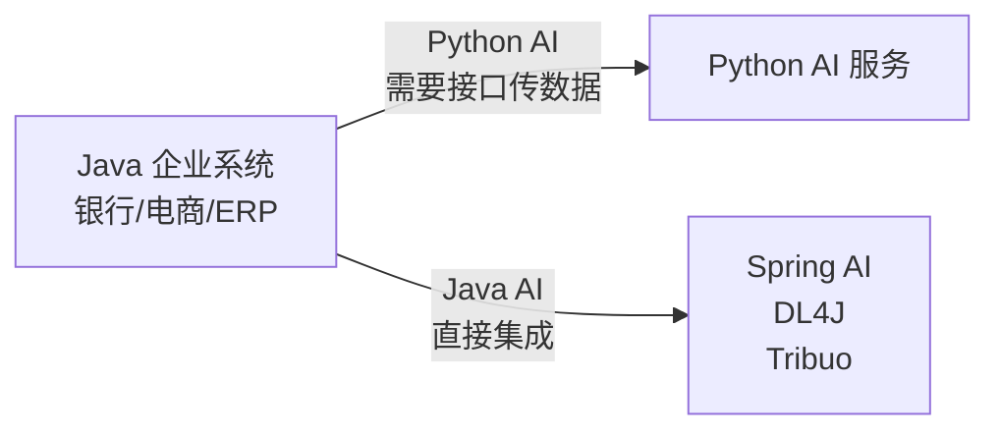
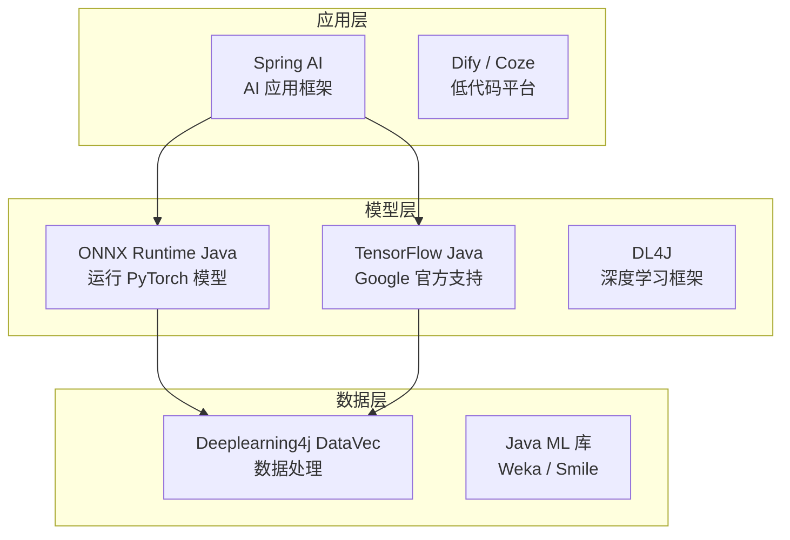
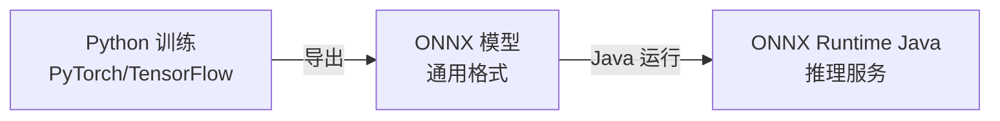
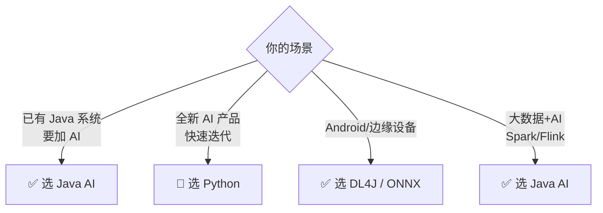
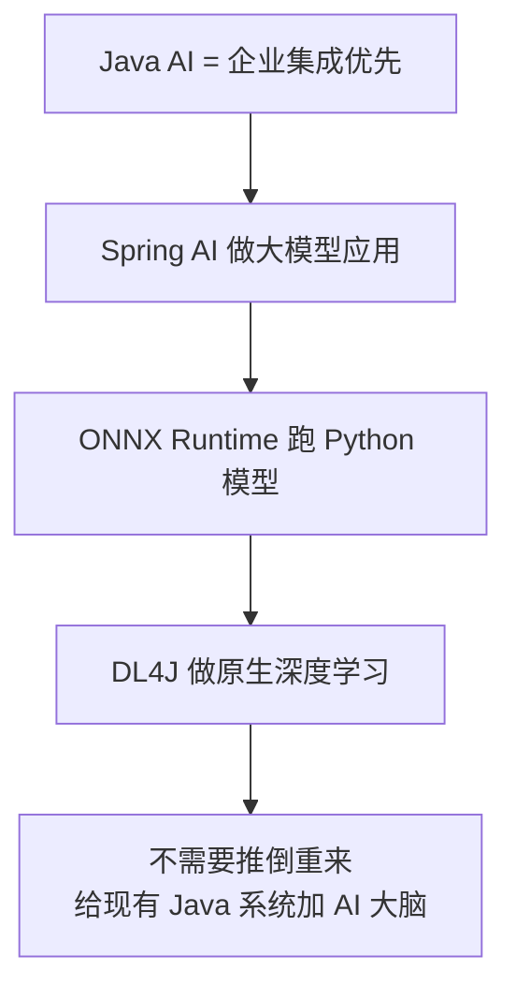

# Java AI 生态小白指南 (Java Ecosystem AI for Dummy)

> **一句话理解**: Java AI 生态就像给企业软件装上了"智能大脑"——让原本用 Java 写的银行系统、电商网站也能跑 AI，而不需要推倒重来。

---

## 🤔 为什么要用 Java 做 AI？

### 一个比喻

想象你有一家开了 20 年的老店（企业系统），全部用 Java 写成：
- **Python AI 方案** = 在旁边新开一家智能店，两家店数据要来回传
- **Java AI 方案** = 直接在老店里加智能设备，不需要搬店



### Java 做 AI 的三大理由

| 理由 | 解释 |
|------|------|
| **现有系统多** | 全球 80% 企业后台用 Java，重写成本极高 |
| **工程成熟** | 类型安全、并发稳定、工具链完善 |
| **团队熟悉** | 企业已有大量 Java 工程师 |

---

## 🧩 Java AI 生态的核心组件



### 1. Spring AI ⭐（最常用）

就像 Spring Boot 让写网站变简单，**Spring AI** 让写 AI 应用变简单。

**它能做什么**？
- 调用 OpenAI / Claude / 国产大模型
- 做 RAG（让 AI 查企业知识库）
- 做 Agent（AI 自动调用企业 API）

```java
// 最简单的 AI 聊天（就像写普通 Spring 服务）
@Controller
public class ChatController {
    private final ChatClient chatClient;
    
    public String chat(String message) {
        return chatClient.prompt(message).call().content();
    }
}
```

### 2. ONNX Runtime Java

**ONNX** 是模型的"通用语言"。



**优点**：Python 训练，Java 部署，完美分工。

### 3. DL4J (DeepLearning4J)

Java 原生深度学习框架，适合：
- 需要在 JVM 内完成训练和推理
- 边缘设备（Android）

---

## ⚖️ Java vs Python for AI

| 对比项 | Java | Python |  winner |
|--------|------|--------|---------|
| **学习资料** | 较少 | 极多 | Python ✅ |
| **企业集成** | 极容易 | 需额外工作 | Java ✅ |
| **模型生态** | 依赖 ONNX/TF Java | PyTorch 生态最丰富 | Python ✅ |
| **性能** | JVM 优化好 | 解释器较慢 | Java ✅ |
| **原型速度** | 较慢 | Jupyter 极快 | Python ✅ |
| **生产稳定** | 类型安全、并发强 | 动态类型风险 | Java ✅ |

**简单结论**：
- 🐍 **原型/研究** → 用 Python
- ☕ **企业生产** → 用 Java（通过 Spring AI / ONNX）

---

## 🎯 什么时候选 Java AI？



| 场景 | 推荐方案 |
|------|---------|
| 银行系统接入大模型 | Spring AI + OpenAI API |
| 电商推荐系统 | ONNX Runtime + Python 训练好的模型 |
| Android 端图像识别 | DL4J 或 TensorFlow Lite |
| 企业知识库问答 | Spring AI RAG |

---

## 🛠️ 最小上手示例

### 用 Spring AI 实现聊天（5 分钟）

```xml
<!-- pom.xml -->
<dependency>
    <groupId>org.springframework.ai</groupId>
    <artifactId>spring-ai-openai-spring-boot-starter</artifactId>
</dependency>
```

```java
// 配置 API Key
spring.ai.openai.api-key=${OPENAI_API_KEY}

// 写个 Controller 就能聊天
@RestController
public class ChatController {
    @Autowired
    private ChatClient chatClient;
    
    @GetMapping("/chat")
    public String chat(@RequestParam String msg) {
        return chatClient.prompt(msg).call().content();
    }
}
```

### 用 ONNX Runtime 跑 Python 模型

```java
// 加载 Python 导出的 ONNX 模型
OrtEnvironment env = OrtEnvironment.getEnvironment();
OrtSession.SessionOptions opts = new OrtSession.SessionOptions();
OrtSession session = env.createSession("model.onnx", opts);

// 准备输入
OnnxTensor inputTensor = OnnxTensor.createTensor(env, inputData);

// 推理
OrtSession.Result results = session.run(Collections.singletonMap("input", inputTensor));
float[][] output = (float[][]) results.get(0).getValue();
```

---

## ⚠️ 常见问题

| 问题 | 原因 | 解决办法 |
|------|------|---------|
| **Java AI 资料太少** | 社区相对 Python 小 | 看官方文档 + 英文社区 |
| **模型格式不兼容** | Java 不支持 .pth 直接加载 | 导出为 ONNX 格式 |
| **GPU 支持弱** | CUDA JNI 绑定复杂 | 用 ONNX Runtime 或 REST API 调用 Python 服务 |
| **Maven 依赖冲突** | Spring AI 版本迭代快 | 锁定版本，看官方 BOM |

---

## 💡 核心要点



---

## 🔗 相关主题

- [Spring AI 深度解析](./Spring_AI_Deep_Dive.md) — 完整技术细节
- [Java Ecosystem AI Overview](./Java_Ecosystem_AI_Overview.md) — 生态全景
- [部署推理](../../09_Deployment_Inference/JVM_AI_Deployment.md) — Java 模型部署

---

*Last updated: 2026-05-07*
