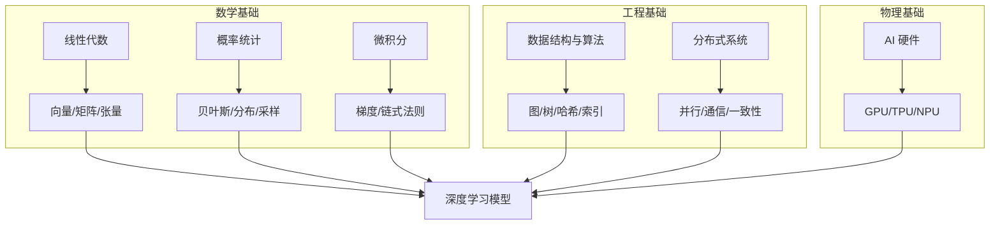
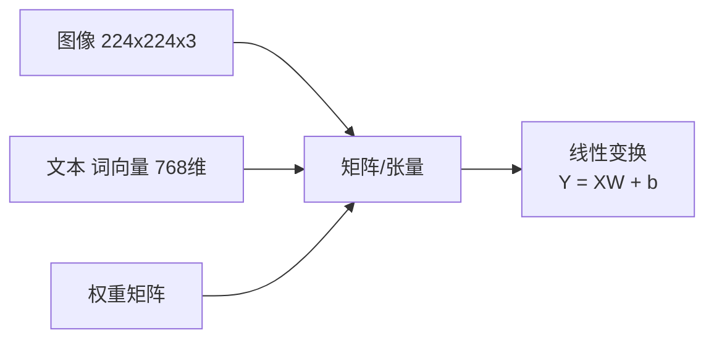
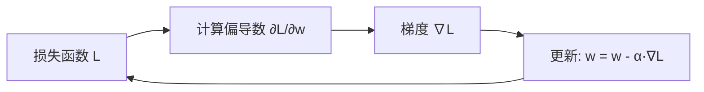
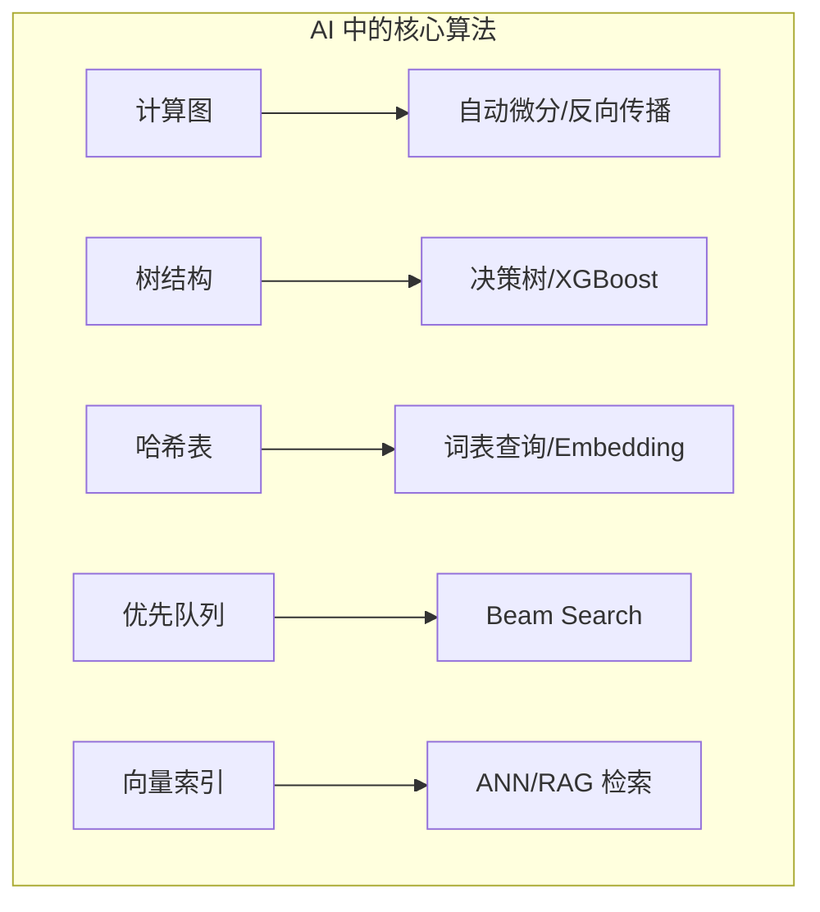
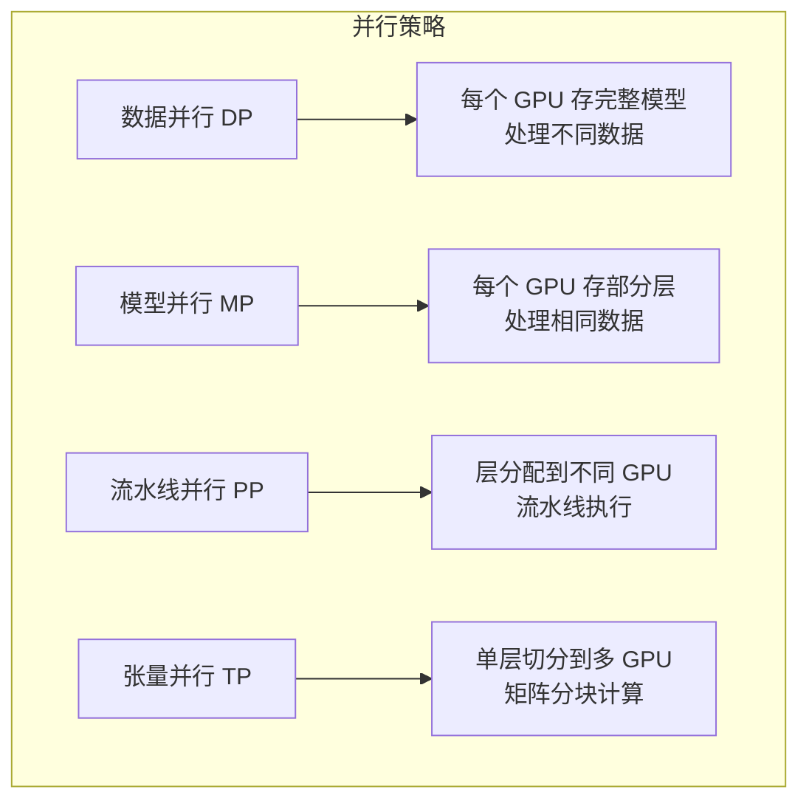
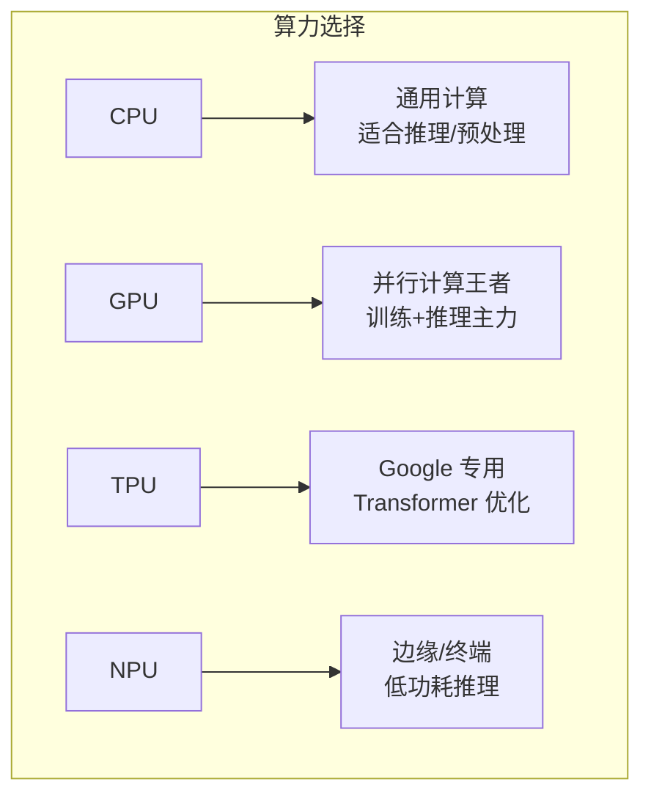
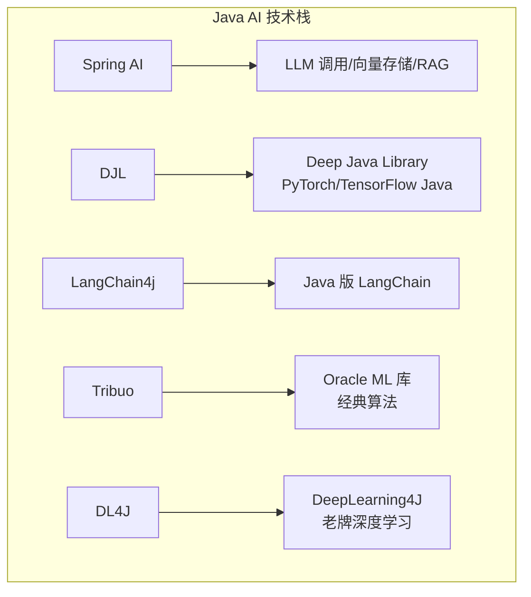
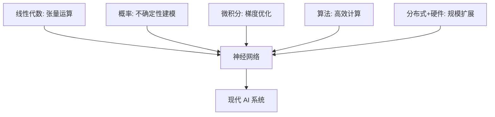

# AI 基础速成指南

> **一句话理解**: AI 大厦的地基——数学、算法、硬件和工具链共同构成了让人工智能从理论变为现实的工程基础。

---

## TL;DR

- **线性代数**: 向量、矩阵是张量运算的基石，神经网络的一切参数都活在矩阵里
- **概率统计**: 贝叶斯定理处理不确定性，分布建模现实世界的随机性
- **微积分**: 梯度是优化的方向盘，反向传播的本质就是链式求导
- **数据结构与算法**: 计算图、拓扑排序、高效检索支撑 AI 系统运行
- **分布式系统**: 数据并行、模型并行、All-Reduce 让大模型训练成为可能
- **硬件**: GPU 并行计算、TPU 专用加速、CPU 兜底，选对硬件省 50% 成本
- **Java 生态**: Spring AI + DJL + LangChain4j 让 Java 也能玩转 AI



---

## 数学基础

### 线性代数（AI 的语言）

AI 中所有数据都是**张量（Tensor）**：标量(0D) → 向量(1D) → 矩阵(2D) → 高维张量。



**核心概念速查**:

| 概念 | 一句话解释 | AI 中的应用 |
|------|-----------|------------|
| **向量内积** | $a \cdot b = \sum a_i b_i$ | 相似度计算、注意力分数 |
| **矩阵乘法** | $C_{ij} = \sum_k A_{ik} B_{kj}$ | 神经网络前向传播 |
| **转置** | 行列互换 | 维度对齐、批量运算 |
| **逆矩阵** | $A^{-1}A = I$ | 线性回归闭式解 |
| **特征分解** | $A = Q \Lambda Q^{-1}$ | PCA 降维、谱分析 |
| **SVD** | $A = U \Sigma V^T$ | 推荐系统、压缩、去噪 |

```python
import numpy as np

# 向量内积 = 相似度
a = np.array([1, 2, 3])
b = np.array([4, 5, 6])
print(a @ b)  # 32

# 矩阵乘法 = 神经网络一层
X = np.random.randn(64, 784)   # batch=64, 输入784维
W = np.random.randn(784, 256)  # 权重
b = np.random.randn(256)       # 偏置
Y = X @ W + b                  # 输出 [64, 256]
```

### 概率与统计（处理不确定性）

AI 的本质是在不确定中做决策。

```mermaid
flowchart TB
    subgraph 概率基础
        A[随机变量] --> B[离散: 伯努利/二项/泊松]
        A --> C[连续: 均匀/高斯/指数]
    end
    subgraph 核心定理
        D[贝叶斯定理] --> D1[P(A\|B) = P(B\|A)P(A)/P(B)]
        E[大数定律] --> E1[样本均值 → 期望]
        F[中心极限] --> F1[样本和 → 正态分布]
    end
```

**贝叶斯定理**——AI 中最优雅的公式:

$$P(\text{模型} | \text{数据}) = \frac{P(\text{数据} | \text{模型}) \cdot P(\text{模型})}{P(\text{数据})}$$

| 分布 | 公式/特性 | AI 应用 |
|------|----------|---------|
| **高斯分布** | $N(\mu, \sigma^2)$ | 噪声建模、VAE 潜在空间 |
| **伯努利分布** | 0/1 概率 $p$ | 二分类标签 |
| **分类分布** | 多类概率和为 1 | Softmax 输出 |
| **正态分布族** | 高斯混合 GMM | 聚类、异常检测 |

```python
# 贝叶斯更新示例
prior_spam = 0.1          # 先验: 10% 邮件是垃圾邮件
likelihood = 0.8          # 似然: 垃圾邮件含"免费"的概率
evidence = 0.15           # 证据: 所有邮件含"免费"的概率

posterior = (likelihood * prior_spam) / evidence
print(f"P(垃圾|关键词) = {posterior:.2%}")  # 53.3%
```

### 微积分（优化的引擎）

**梯度**指向函数增长最快的方向，**负梯度**就是下降最快的方向——这是训练一切模型的核心。



| 概念 | 含义 | 作用 |
|------|------|------|
| **导数** | 单变量的变化率 | 理解损失曲面的斜率 |
| **偏导数** | 多变量中对某一变量的导数 | 每个参数的独立更新量 |
| **梯度** | 所有偏导数组成的向量 | 参数更新的方向 |
| **链式法则** | $\frac{dz}{dx} = \frac{dz}{dy}\frac{dy}{dx}$ | 反向传播的数学基础 |
| **Hessian** | 二阶偏导矩阵 | 二阶优化、曲率分析 |

```python
# PyTorch 自动微分——你永远不会手动求导
import torch

x = torch.tensor([2.0], requires_grad=True)
y = x ** 3 + 2 * x
y.backward()       # 自动计算 dy/dx
print(x.grad)      # tensor([14.])  (3*x^2 + 2 = 14)
```

---

## 数据结构与算法

AI 系统不仅需要训练模型，还需要高效地存储、检索和处理数据。



| 数据结构 | AI 应用 | 时间复杂度 |
|----------|---------|-----------|
| **数组/张量** | 神经网络参数存储 | O(1) 随机访问 |
| **哈希表** | 词表映射、特征字典 | O(1) 查询 |
| **树** | 决策树、KD-Tree 检索 | O(log n) |
| **图** | 计算图、知识图谱、GNN | O(V+E) |
| **堆** | A*搜索、Beam Search | O(log n) |
| **向量索引** | 近似最近邻 (ANN) | O(log n) ~ O(1) |

```python
# 向量检索示例 (RAG 核心)
from sklearn.neighbors import NearestNeighbors
import numpy as np

# 假设有 10000 个文档向量
doc_vectors = np.random.randn(10000, 768)

# 构建 ANN 索引
index = NearestNeighbors(n_neighbors=5, algorithm='kd_tree')
index.fit(doc_vectors)

# 查询最相似的 5 个文档
query = np.random.randn(1, 768)
distances, indices = index.kneighbors(query)
print(f"最相似文档索引: {indices[0]}")
```

---

## 分布式系统基础

现代 AI，尤其大模型，单卡训不动，必须分布式。



**通信原语**:

| 操作 | 作用 | 场景 |
|------|------|------|
| **Broadcast** | 主节点发数据到所有节点 | 初始化同步 |
| **All-Reduce** | 所有节点数据求和/平均，结果同步到所有节点 | 梯度同步 |
| **All-Gather** | 收集所有节点数据到所有节点 | 合并分布式推理结果 |
| **Reduce-Scatter** | 先 Reduce 再 Scatter | ZeRO 优化器分片 |

```python
# PyTorch DDP 极简示例
import torch
import torch.distributed as dist
from torch.nn.parallel import DistributedDataParallel as DDP

# 初始化进程组
dist.init_process_group("nccl")

model = MyModel().to(local_rank)
ddp_model = DDP(model, device_ids=[local_rank])

# 前向 + 反向——梯度自动 All-Reduce 同步
output = ddp_model(input)
loss = criterion(output, target)
loss.backward()  # 梯度自动在所有 GPU 间平均
```

---

## AI 硬件基础

选对硬件 = 省钱 + 提速。



| 硬件 | 优势 | 劣势 | 适合场景 |
|------|------|------|---------|
| **CPU** | 灵活、易编程、便宜 | 并行度低 | 数据预处理、轻量推理 |
| **GPU (NVIDIA)** | CUDA 生态成熟、并行度高 | 贵、耗电 | 训练、批量推理 |
| **TPU (Google)** | 矩阵运算优化、性价比 | 锁定 GCP | Transformer 训练 |
| **NPU/ASIC** | 功耗极低、延迟低 | 灵活性差 | 手机/边缘推理 |

**显存计算速算**:

```python
# 模型参数量 → 显存占用（FP32）
# 1B 参数 ≈ 4GB 显存 (FP32)
# 1B 参数 ≈ 2GB 显存 (FP16/BF16)
# 1B 参数 ≈ 1GB 显存 (INT8)
# 1B 参数 ≈ 0.5GB 显存 (INT4)

params = 7_000_000_000  # 7B 模型
print(f"FP16 推理最小显存: {params * 2 / 1e9:.1f} GB")
# 还要加 KV Cache、激活值、优化器状态（训练时）
```

---

## Java 生态与 AI

Java 不是 AI 的一等公民，但企业级 AI 应用离不开它。



| 框架 | 定位 | 推荐指数 |
|------|------|---------|
| **Spring AI** | Spring 生态的 AI 抽象层 | ⭐⭐⭐⭐⭐ |
| **DJL** | 底层深度学习引擎 | ⭐⭐⭐⭐ |
| **LangChain4j** | LLM 应用编排 | ⭐⭐⭐⭐⭐ |
| **Tribuo** | 经典 ML（回归/分类/聚类） | ⭐⭐⭐ |
| **DL4J** | 深度神经网络 | ⭐⭐ |

```java
// Spring AI 调用 LLM
@Controller
public class ChatController {
    private final ChatClient chatClient;
    
    public ChatController(ChatClient.Builder builder) {
        this.chatClient = builder.build();
    }
    
    @GetMapping("/ai")
    public String generation(@RequestParam String message) {
        return chatClient.prompt()
            .user(message)
            .call()
            .content();
    }
}
```

---

## 关键工具速查

| 工具 | 用途 | 必学程度 |
|------|------|---------|
| **NumPy** | 张量运算基础 | 必学 |
| **Pandas** | 数据处理 | 必学 |
| **Matplotlib/Seaborn** | 可视化 | 必学 |
| **Jupyter Notebook** | 交互式开发 | 必学 |
| **Git** | 版本控制 | 必学 |
| **Docker** | 环境隔离与部署 | 强烈建议 |
| **Conda/venv** | Python 环境管理 | 强烈建议 |

---

## 📚 核心要点



**30 分钟记住这些**:
1. 矩阵乘法是神经网络的前向传播
2. 梯度下降是训练的一切——梯度来自链式法则
3. 贝叶斯定理让你理解先验和后验
4. GPU 并行 + All-Reduce = 大模型训练
5. Java 用 Spring AI + DJL 也能做 AI

---

## ❓ 常见问题 (FAQ)

**Q: 数学不好能学 AI 吗？**
> 能，但要走远必须补。建议边实践边补：用到哪学到哪。先掌握矩阵乘法、梯度、概率分布三件套。

**Q: CPU 能训练深度学习模型吗？**
> 能，但极慢。一个 epoch GPU 10 分钟，CPU 可能要 10 小时。CPU 适合数据预处理和模型推理（小模型）。

**Q: 什么是张量 (Tensor)？**
> 多维数组。标量(0D) = 5，向量(1D) = [1,2,3]，矩阵(2D) = [[1,2],[3,4]]，3D+ 就是高维张量。PyTorch/TensorFlow 的核心数据结构。

**Q: 分布式训练和数据并行有什么区别？**
> 数据并行 (DP) 是分布式训练的一种策略。分布式训练还包括模型并行、流水线并行等。DP 最简单：每个 GPU 存完整模型，处理不同数据，梯度 All-Reduce 同步。

**Q: Java 和 Python 在 AI 中怎么选？**
> 模型研发/训练用 Python；企业级应用/微服务用 Java（调用 Python 模型或直接用 DJL）。两者通过 REST/gRPC 协作最常见。

---

## 🔗 相关主题

- [机器学习速成](机器学习/ML_Fundamentals/ML-in-nutshell.md) —— 用这些基础构建 ML 模型
- [深度学习速成](深度学习/DL_Fundamentals/DL-in-nutshell.md) —— 神经网络的核心机制
- [推理速成](部署推理/Deployment_Fundamentals/Inference-in-nutshell.md) —— 把模型跑起来
- [AI 硬件对比](数学基础/AI_Hardware/AI_Hardware_2026.md) —— 2026 年硬件选型指南

---

*Last updated: 2026-05-07*

## Related

- [[数学基础/AI_Hardware/README]] — AI硬件与芯片 (AI Hardware) (共享: algorithms, basics, fundamentals, math)
- [[数学基础/Java_Ecosystem_AI/Java_Ecosystem_AI_Overview]] — Java 生态与 AI：全景概览 (共享: algorithms, basics, fundamentals, math)
- [[数学基础/Java_Ecosystem_AI/Spring_AI_Deep_Dive]] — Spring AI 深度解析 (共享: algorithms, basics, fundamentals, math)
- [[数学基础/README]] — 01 基础理论 (Fundamentals) (共享: algorithms, basics, fundamentals, math)
