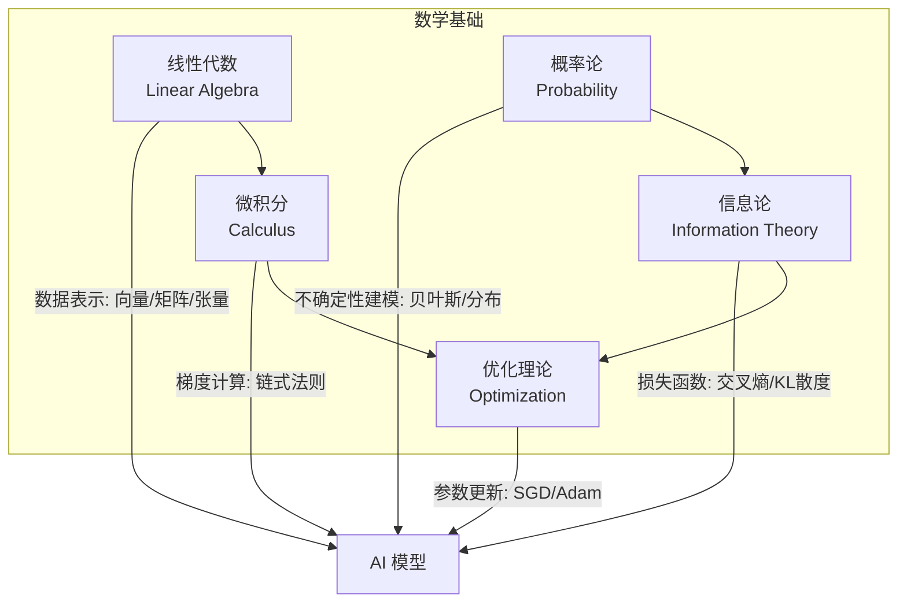

# AI 数学基础 (Mathematics for AI)

> **一句话理解**: 线性代数提供数据表示，微积分驱动优化，概率论处理不确定性，信息论度量信息，优化理论串联一切——这五大数学支柱共同支撑起现代 AI 的全部算法。

---

## TL;DR

- **线性代数 (Linear Algebra)**: 一切数据都是张量，一切参数都活在矩阵里，矩阵乘法就是神经网络的前向传播
- **微积分 (Calculus)**: 梯度指向损失增长最快的方向，负梯度就是训练的方向盘，链式法则是反向传播的灵魂
- **概率论 (Probability)**: AI 的本质是在不确定中做决策，贝叶斯定理是最优雅的更新信念的方式
- **信息论 (Information Theory)**: 交叉熵是几乎所有分类模型的损失函数，KL 散度衡量分布距离，互信息发现特征关联
- **优化理论 (Optimization)**: SGD、Adam 等优化器是训练一切模型的引擎，凸优化保证收敛，非凸优化凭经验



---

## 为什么 AI 需要这些数学？

每个 AI 模型——从最简单的线性回归到万亿参数的 GPT——背后都运行着相同的数学引擎：

| 数学分支 | 在 AI 中的角色 | 没有它会怎样 |
|---------|--------------|------------|
| **线性代数** | 数据表示与变换——输入、权重、激活值全是张量 | 无法表示高维数据，神经网络无法计算 |
| **微积分** | 计算梯度，指引参数更新方向 | 无法训练模型，不知道参数该怎么改 |
| **概率论** | 建模不确定性，做预测与推断 | 无法处理噪声数据，无法输出置信度 |
| **信息论** | 定义损失函数，度量信息增益 | 无法衡量模型好坏，无法做特征选择 |
| **优化理论** | 将"找到最优参数"变成可计算的迭代过程 | 知道方向但没有高效走到终点的方法 |

---

## 学习路线图 (What to Learn)

### 第一阶段：核心工具（必学）

| 主题 | 核心概念 | AI 中的应用 | 推荐深度 |
|------|---------|-----------|---------|
| **向量与矩阵运算** | 内积、外积、转置、逆、行列式 | 特征表示、线性变换、注意力机制 | 熟练 |
| **特征分解与 SVD** | 特征值/特征向量、奇异值分解 | PCA 降维、推荐系统、谱聚类 | 理解 |
| **多元微积分** | 偏导数、梯度、Hessian 矩阵 | 损失函数优化、二阶方法 | 熟练 |
| **链式法则** | 复合函数求导 | 反向传播、计算图自动微分 | 精通 |
| **概率分布** | 高斯、伯努利、多项式分布 | 噪声建模、生成模型、Softmax | 熟练 |
| **贝叶斯定理** | 先验、似然、后验 | 贝叶斯分类器、变分推断 | 理解 |

### 第二阶段：进阶理论（深入理解）

| 主题 | 核心概念 | AI 中的应用 | 推荐深度 |
|------|---------|-----------|---------|
| **信息熵与交叉熵** | Shannon 熵、KL 散度、互信息 | 损失函数设计、知识蒸馏、VAE | 精通 |
| **凸优化** | 凸集、凸函数、KKT 条件 | SVM、逻辑回归的全局最优解 | 理解 |
| **随机优化** | SGD、动量、Adam | 深度学习训练的基石 | 熟练 |
| **矩阵微积分** | 标量对向量/矩阵求导 | 手动推导梯度、理解自动微分 | 理解 |
| **拉格朗日乘子法** | 约束优化 | SVM 对偶问题、正则化理解 | 了解 |

### 第三阶段：前沿专题（按需学习）

| 主题 | 核心概念 | AI 中的应用 |
|------|---------|-----------|
| **张量分解** | CP 分解、Tucker 分解 | 模型压缩、推荐系统 |
| **随机矩阵理论** | 特征值分布 | 神经网络初始化分析 |
| **最优传输** | Wasserstein 距离 | GAN 训练稳定性 (WGAN) |
| **微分几何** | 流形、测地线 | 自然梯度、流形学习 |

---

## 数学 → AI 映射详解

### 线性代数：AI 的语言

```
线性代数是 AI 的母语：

数据表示:
├── 标量 (0D Tensor): 温度 = 25°C
├── 向量 (1D Tensor): 词嵌入 [0.1, -0.3, 0.7, ...] (768维)
├── 矩阵 (2D Tensor): 图像 224×224 灰度图
├── 3D 张量: 彩色图像 224×224×3
└── 4D 张量: 批量图像 batch×3×224×224

核心运算:
├── 矩阵乘法 Y = XW + b  →  神经网络的每一层
├── 转置与维度变换       →  维度对齐 (batch 处理)
├── 特征分解 A = QΛQ⁻¹  →  PCA 降维、谱分析
├── SVD A = UΣVᵀ        →  推荐系统、低秩近似
└── 张量运算            →  卷积、注意力、池化
```

### 微积分：优化的引擎

```
微积分驱动模型训练:

训练循环:
├── 前向传播: 计算预测值 ŷ = f(x; θ)
├── 计算损失: L = Loss(y, ŷ)
├── 反向传播: 用链式法则求 ∂L/∂θ (每个参数的梯度)
└── 参数更新: θ = θ - α·∇L (沿负梯度方向)

关键工具:
├── 偏导数 ∂L/∂wᵢ  →  每个参数的独立更新量
├── 梯度 ∇L        →  所有偏导数组成的方向向量
├── 链式法则       →  逐层传递梯度 (反向传播)
├── Hessian 矩阵   →  二阶曲率信息 (Newton 法)
└── Jacobian 矩阵  →  向量值函数的导数
```

### 概率论：不确定性的科学

```
概率论让 AI 在噪声中做决策:

核心框架:
├── 随机变量 X          →  数据、标签、噪声的数学抽象
├── 概率分布 P(X)       →  数据的生成规律
├── 条件概率 P(Y|X)     →  给定输入时输出的不确定性
├── 贝叶斯定理           →  用新证据更新信念
└── 极大似然估计 (MLE)   →  找到最能解释数据的参数

常见分布:
├── 高斯分布 N(μ,σ²)    →  噪声建模、VAE 潜在空间
├── 伯努利分布           →  二分类标签
├── 多项式分布           →  多分类 Softmax 输出
└── 指数分布族           →  GLM 模型的理论基础
```

### 信息论：信息的度量

```
信息论定义了"学得好不好":

核心公式:
├── 熵 H(X) = -Σ p·log p         →  不确定性的度量
├── 交叉熵 H(P,Q) = -Σ p·log q   →  分类损失函数 (几乎所有模型)
├── KL 散度 D_KL(P||Q)            →  分布距离 (VAE、知识蒸馏)
└── 互信息 I(X;Y)                 →  特征选择、对比学习

与深度学习的深度绑定:
├── 交叉熵损失     = 最小化模型分布与真实分布的差距
├── 困惑度 PPL     = exp(交叉熵)，LLM 核心评估指标
├── KL 正则化      = 让后验分布接近先验 (VAE)
└── 信息瓶颈       = 压缩表示 + 保留任务信息
```

### 优化理论：从理论到实践

```
优化理论将训练变成可计算的迭代:

方法家族:
├── 一阶方法 (用梯度):
│   ├── SGD           →  基础优化器，随机小批量
│   ├── SGD + 动量    →  加速收敛、穿越鞍点
│   ├── Adam          →  自适应学习率，深度学习默认
│   └── AdamW         →  权重衰减修正，大模型标配
├── 二阶方法 (用曲率):
│   ├── Newton 法     →  精确但太贵
│   ├── L-BFGS        →  拟牛顿，中等规模
│   └── KFAC          →  近似二阶，大模型探索中
└── 无梯度方法:
    ├── 进化策略      →  黑盒优化
    └── 贝叶斯优化    →  超参数搜索
```

---

## 详细子主题

本知识库中，每个数学分支都有独立的详细页面，建议按需深入：

| 子主题 | 页面链接 | 内容概要 |
|-------|---------|---------|
| **线性代数** | [[01_数学基础/02_Linear_Algebra/Linear_Algebra]] | 向量、矩阵、特征分解、SVD 的完整教程 |
| **概率统计** | [[01_数学基础/03_Probability_Statistics/Probability_Statistics]] | 概率分布、贝叶斯推断、假设检验深入 |
| **线性代数入门** | [[01_数学基础/02_Linear_Algebra/Linear_Algebra_for_dummy]] | 零基础友好的线性代数入门 |
| **概率统计入门** | [[01_数学基础/03_Probability_Statistics/Probability_Statistics_for_dummy]] | 零基础友好的概率统计入门 |
| **信息论基础** | [[01_数学基础/04_Information_Theory/Information_Theory_Fundamentals]] | 熵、交叉熵、KL 散度与 AI 应用 |

---

## 实用建议：学到什么程度够用？

```
不同 AI 方向的数学需求:

应用工程师 (调用 API、部署模型):
├── 线性代数: 理解矩阵乘法、维度变换即可
├── 概率统计: 理解分布、概率输出即可
├── 微积分: 知道梯度是什么即可
└── 优化/信息论: 了解概念即可

算法工程师 (调参、改模型):
├── 线性代数: 熟练矩阵运算、特征分解
├── 概率统计: 熟练贝叶斯、常见分布
├── 微积分: 能手动推导简单梯度
├── 优化: 理解 SGD/Adam 的原理和调参
└── 信息论: 理解交叉熵、KL 散度

研究员 (发论文、新模型设计):
├── 以上全部精通
├── 加: 张量分析、随机矩阵、最优传输
└── 加: 信息几何、微分方程、测度论
```

---

## 快速自测

| 问题 | 你应该能回答 |
|------|------------|
| 矩阵乘法 Y = XW 的几何意义是什么？ | 线性变换（旋转+缩放） |
| 为什么神经网络用链式法则？ | 复合函数求导，逐层传递梯度 |
| 交叉熵损失为什么比 MSE 好？ | 分类任务中梯度不消失、概率解释自然 |
| Adam 优化器做了什么？ | 自适应学习率 + 动量，两个矩估计 |
| KL 散度为什么不满足三角不等式？ | 非对称、不是严格距离度量 |

---

## Further Reading

- [[01_数学基础/02_Linear_Algebra/Linear_Algebra]] — 线性代数完整教程
- [[01_数学基础/03_Probability_Statistics/Probability_Statistics]] — 概率统计完整教程
- [[01_数学基础/04_Information_Theory/Information_Theory_Fundamentals]] — 信息论与 AI 的深度关联
- [[01_数学基础/Fundamentals-in-nutshell]] — AI 基础全景速成
- [[01_数学基础/Mathematics_for_AI]] — 数学公式速查手册
- [[02_机器学习/ML-in-nutshell]] — 用这些数学基础构建 ML 模型

---

*Last updated: 2026-06-12*
