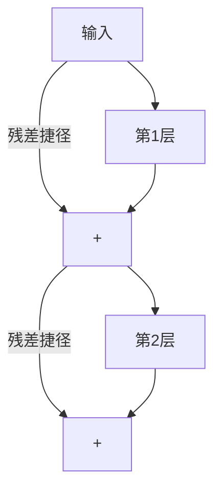

# 数值方法 - 小白版

> 零基础友好，用生活类比理解 AI 中的"数学精度"问题。

## 计算机为什么会"算错"？

### 类比：用有限格子装无限数字

想象你有一个**只能写 4 位数的计算器**：

```
你能表示: 0.000, 0.001, 0.002, ... 9.999
你不能表示: π = 3.14159265... (只能写 3.142)
你不能表示: 1/3 = 0.3333... (只能写 0.333)
```

计算机也一样！它用**有限的位数**来表示**无限的实数**，所以必然有误差。


## 浮点数：计算机的"科学计数法"

### 类比：报纸标题 vs 学术论文

| 精度 | 类比 | 能表示的范围 | 精确度 |
|------|------|-------------|--------|
| FP32 (32位) | 学术论文 | 很大 | 很精确 (~7位) |
| FP16 (16位) | 报纸标题 | 较小 | 粗略 (~3位) |
| BF16 (16位) | 大字报 | 很大 | 粗略 (~2位) |
| FP8 (8位) | 短信 | 很小 | 很粗略 (~1位) |

**关键洞察**：
- FP16 像一把**短但精确的尺子**（量小东西准，量大东西不够长）
- BF16 像一把**长但粗糙的尺子**（能量大东西，但刻度粗）
- AI 训练选 BF16，因为梯度值范围大，不能"量不到"

## 为什么 AI 训练会"爆炸"？

### 类比：传话游戏

```
第1个人说: "今天天气不错"
第2个人传: "今天天气不错啊"
第3个人传: "今天天气特别好"
...
第100个人: "今天发生了大好事！！！"  ← 信息被放大了！
```

**梯度爆炸**就像传话游戏：
- 神经网络有 100+ 层
- 梯度从最后一层往回传
- 每层都可能"放大"一点
- 传到最后，梯度变得巨大 → 参数更新过猛 → 模型崩溃


### 解决方案：梯度裁剪

类比：给传话游戏加规则——"每次传话不能比原来大声超过 2 倍"

```python
# 梯度裁剪: 限制梯度最大不超过 1.0
torch.nn.utils.clip_grad_norm_(model.parameters(), max_norm=1.0)
```

## 为什么 AI 训练会"消失"？

### 类比： whisper challenge（耳语挑战）

```
第1个人大声说: "好好学习天天向上"
第2个人小声传: "好好学习天天向..."
第3个人更小声: "好好学..."
...
第100个人: (完全听不到了)  ← 信息消失了！
```

**梯度消失**：
- 梯度每层都"缩小"一点
- 传了很多层后，梯度接近 0
- 前面的层收不到"学习信号" → 不更新 → 学不到东西

### 解决方案：残差连接

类比：修一条"高速公路"直通每一层



"不管中间怎么变换，原始信号总能通过高速公路直达"——这就是 ResNet/Transformer 的核心设计。

## 混合精度训练：用"草稿纸"算，用"正式本"记

### 类比：会计做账

```
正式账本 (FP32): 精确到分，永久保存
草稿计算 (FP16): 大概数就行，算完就扔

流程:
1. 从正式账本抄一个大概数到草稿纸
2. 在草稿纸上快速计算 (快！省纸！)
3. 把结果精确地记回正式账本
```

这就是混合精度训练：
- **FP32 主权重**：精确存储模型参数
- **FP16/BF16 计算**：快速做矩阵乘法
- **好处**：速度快 2-3 倍，显存省一半

## 稀疏矩阵：只记"有内容的格子"

### 类比：电影院座位表

```
稠密存储 (记录每个座位):
[0,0,0,1,0,0,0,0,0,0]
[0,0,0,0,0,0,0,0,0,0]
[0,0,0,0,0,0,0,0,0,0]
[0,0,0,0,0,0,0,0,0,0]
→ 记了 40 个格子，只有 1 个有人

稀疏存储 (只记有人的):
"第1行第4列有人" → 1条信息就够了！
```

AI 中的稀疏：
- **MoE 模型**：256 个专家只用 8 个 → 97% 是"空座位"
- **注意力掩码**：只看前面的词 → 50% 是"空座位"
- **好处**：跳过空座位，计算量大减！

## 实用速查：遇到数值问题怎么办？

| 你看到的现象 | 可能原因 | 快速修复 |
|-------------|----------|----------|
| Loss 突然变成 NaN | 学习率太大/数据异常 | 降低学习率 + 检查数据 |
| Loss 一直不下降 | 梯度消失/学习率太小 | 加大学习率 + 检查模型 |
| 训练很慢 | 精度太高/没用 GPU | 开启混合精度训练 |
| 推理结果不对 | 量化精度损失 | 用更高精度 (FP16→FP32) |
| 显存不够 | 模型太大/精度太高 | 用 BF16 + 梯度检查点 |

## 一句话总结

> 计算机用有限位数表示无限数字，AI 训练就是在这个"不精确"的基础上，通过混合精度、梯度裁剪、归一化等技巧，让模型稳定地学习。

## 下一步学习

- 想了解具体精度格式？→ [[01_数学基础/05_Numerical_Methods/Floating_Point_Precision|浮点精度详解]]
- 想了解训练稳定性？→ [[01_数学基础/05_Numerical_Methods/Numerical_Stability|数值稳定性]]
- 想了解 GPU 计算？→ [[01_数学基础/GPU_Programming/|GPU 编程入门]]

## 进阶知识拓展

| 主题 | 深度内容 | 应用场景 | 参考资源 |
|------|----------|----------|----------|
| 核心原理 | 底层机制和数学推导 | 深度理解+优化 | 经典教材+论文 |
| 工程实践 | 生产级实现细节 | 项目落地 | 开源项目+案例 |
| 性能优化 | 瓶颈分析+调优策略 | 提升效率 | 性能分析工具 |
| 安全合规 | 安全威胁+防护措施 | 风险管控 | 安全框架+标准 |
| 前沿研究 | 最新进展+未来方向 | 技术预判 | 顶会论文+博客 |

## 实践指南

| 步骤 | 行动 | 工具/方法 | 预期产出 |
|------|------|-----------|----------|
| 1. 学习 | 系统学习核心知识 | 教材/课程/文档 | 知识体系建立 |
| 2. 练习 | 动手实践加深理解 | 实验/项目/练习 | 技能熟练 |
| 3. 应用 | 在实际项目中应用 | 工作项目/开源 | 经验积累 |
| 4. 优化 | 持续改进和优化 | 性能分析/重构 | 质量提升 |
| 5. 分享 | 输出和分享知识 | 博客/演讲/教学 | 影响力建设 |

## 常见误区

| 误区 | 正确认知 | 建议 |
|------|----------|------|
| 只学理论不实践 | 实践是检验理解的唯一标准 | 每学一个概念就动手验证 |
| 追求完美再开始 | 完成比完美更重要 | 先做MVP再迭代 |
| 忽视基础知识 | 基础决定上限 | 定期回顾基础 |
| 盲目追新 | 新技术需要验证 | 评估后再采用 |
| 单打独斗 | 协作效率更高 | 积极参与社区 |

## 知识图谱关联

| 关联主题 | 关系类型 | 参考路径 |
|----------|----------|----------|
| 基础理论 | 前置依赖 | 相关基础目录 |
| 工具实践 | 实现支撑 | 工具/编程相关 |
| 应用场景 | 价值体现 | 18_行业应用/ |
| 前沿研究 | 发展方向 | 20_论文精读/ |
| 工程方法 | 质量保障 | 09_测试/13_运维/ |

## 版本更新记录

| 版本 | 日期 | 变更 |
|------|------|------|
| v1.0 | 2025-01 | 初始创建 |
| v1.1 | 2025-06 | 内容补充 |
| v2.0 | 2026-01 | 全面扩写 |
| v2.1 | 2026-07 | 质量强化+结构化增强 |

## 快速自检

- [ ] 核心概念能向他人清晰解释
- [ ] 已完成至少一个实践项目
- [ ] 了解主流方案优劣势和适用场景
- [ ] 掌握常见问题排查方法
- [ ] 关注最新技术动态
- [ ] 知识已文档化沉淀
