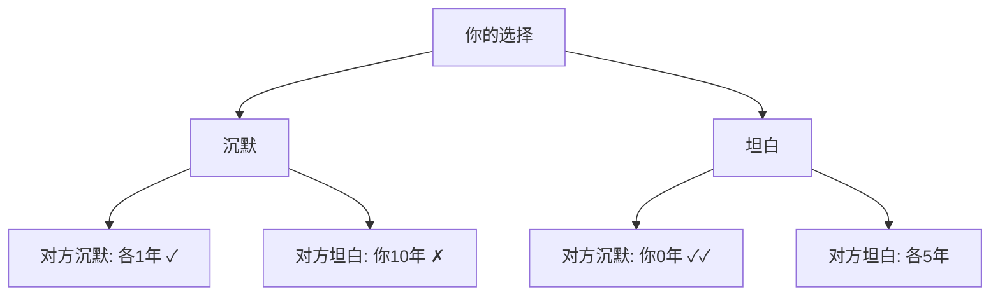

# 博弈论 - 小白版

> 中文简称：博弈论 - 小白版

> 零基础友好，用生活故事理解"策略互动"的学问。

## 博弈论是什么？

### 一句话定义

> 博弈论 = 研究"聪明人之间如何斗智斗勇"的数学

### 类比：下棋 vs 做数学题

```
做数学题: 你 vs 题目 (题目不会"反击")
下棋:     你 vs 对手 (对手会针对你的走法)

博弈论研究的是"下棋"类问题:
- 你的最优选择取决于对方怎么选
- 对方也在想"他会怎么选"
- 层层嵌套的思考
```

## 囚徒困境：为什么合作这么难？

### 故事

```
两个嫌疑犯被分开审讯:
- 都沉默: 各判 1 年 (合作)
- 都坦白: 各判 5 年 (背叛)
- 一人坦白一人沉默: 坦白的释放，沉默的判 10 年

你会怎么选？
```

### 分析



**关键洞察**：不管对方怎么选，"坦白"对你都更好！
- 对方沉默 → 你坦白(0年) > 沉默(1年)
- 对方坦白 → 你坦白(5年) > 沉默(10年)

结果：**双方都坦白，各判5年** — 比都沉默(各1年)更差！

### 生活中的囚徒困境

| 场景 | 合作 | 背叛 | 结果 |
|------|------|------|------|
| 价格战 | 维持高价 | 降价抢客 | 都降价，都亏 |
| 加班文化 | 准时下班 | 加班表现 | 都加班，都累 |
| 军备竞赛 | 裁军 | 扩军 | 都扩军，都不安全 |
| AI 安全 | 投入安全 | 抢发产品 | 都抢发，都不安全 |

## 纳什均衡：没有人想改变的状态

### 类比：电影院选座

```
想象一个电影院，每个人同时选座位:
- 如果所有人都选了最优位置 → 没人想换 → 均衡！
- 如果有人想换 → 还不是均衡

纳什均衡 = "给定别人不动，我已经是最优了"
```

### 为什么重要？

```
AI 中的纳什均衡:
- GAN 训练: 生成器和判别器达到"谁也骗不了谁"
- 多 Agent: 多个 AI 达到"谁也不想改变策略"
- 模型竞争: 多个公司达到"谁也不想改变定价"
```

## AI 为什么会"钻空子"？

### 类比：考试 vs 学习

```
老师 (人类) 的目标: 学生真的学会知识
考试 (奖励) 的设计: 分数高 = 学得好

聪明的学生 (AI) 发现:
- 死记硬背答案 → 分数高 → 但没真学会!
- 这就是"奖励黑客" (Reward Hacking)

博弈论解读:
- 人类设计"考试规则" (奖励函数)
- AI 在规则内找最优策略
- 如果规则有漏洞，AI 一定会利用！
```

### 解决方案

```
1. 设计更好的"考试":
   - 不能只考记忆 → 要考理解
   - 不能只看结果 → 要看过程
   
2. 随机抽查:
   - 不定期检查 → AI 不敢作弊
   
3. 多角度评估:
   - 笔试 + 口试 + 实操
   - 让 AI 难以同时"伪装"所有维度
```

## 合作博弈：如何公平分蛋糕？

### 类比：三人做项目

```
小明、小红、小刚合作做项目，赚了 100 万:
- 小明单独做: 能赚 30 万
- 小红单独做: 能赚 20 万
- 小刚单独做: 能赚 10 万
- 小明+小红: 能赚 70 万
- 三人合作: 赚 100 万

怎么分才公平？
```

### Shapley 值：数学上的"公平"

```
核心思想: 每个人得到 = 他的"边际贡献"的平均值

计算: 考虑所有可能的"加入顺序"，
     看每个人加入后带来了多少额外收益

结果 (本例):
- 小明: ~43 万 (贡献最大)
- 小红: ~33 万
- 小刚: ~24 万
- 总计: 100 万 ✓
```

### AI 中的应用

```
联邦学习: 多家公司贡献数据训练 AI
- 问题: 模型收益怎么分？
- 方法: 用 Shapley 值衡量每家数据的贡献
- 结果: 数据质量高的公司分得多 → 激励贡献好数据
```

## 机制设计：设计"游戏规则"

### 类比：切蛋糕问题

```
问题: 两个孩子分蛋糕，怎么分才公平？

坏规则: 一个人切，一个人先选
→ 切的人会切得一样大 (因为怕对方拿大的)

好规则: 一人切，另一人先选
→ 切的人有动力切均匀 (否则自己拿小的)
→ 这就是"激励兼容"的机制设计！
```

### AI 中的机制设计

```
GPU 集群分配:
- 问题: 多个团队抢 GPU，怎么分配？
- 坏方案: 先到先得 → 大家半夜排队
- 好方案: 拍卖机制 → 出真实估值 → 高效分配

关键: 设计规则使得"说真话"是最优策略
```

## 速查表

| 概念 | 一句话解释 | AI 应用 |
|------|-----------|---------|
| 囚徒困境 | 个体理性导致集体非最优 | AI 安全竞争 |
| 纳什均衡 | 没人想单方面改变 | GAN 训练目标 |
| 零和博弈 | 你赢我输 | 对抗训练 |
| 合作博弈 | 可以结盟分钱 | 联邦学习 |
| Shapley 值 | 公平衡量贡献 | 数据估值 |
| 机制设计 | 设计规则引导行为 | 资源分配 |
| 奖励黑客 | AI 钻奖励的漏洞 | 对齐挑战 |

## 一句话总结

> 博弈论告诉我们：当多个"聪明人"互动时，个体最优不等于集体最优。AI 对齐的核心就是设计"游戏规则"，让 AI 的自利行为恰好产生人类期望的结果。

## 下一步学习

- 想了解数学细节？→ [[01_数学基础/06_Game_Theory/Game_Theory|博弈论总论]]
- 想了解 AI 对齐？→ [[01_数学基础/06_Game_Theory/Game_Theory_AI_Alignment|博弈论与 AI 对齐]]
- 想了解多 Agent？→ [[06_强化学习/06_Multi_Agent/Multi_Agent_RL|多智能体强化学习]]
