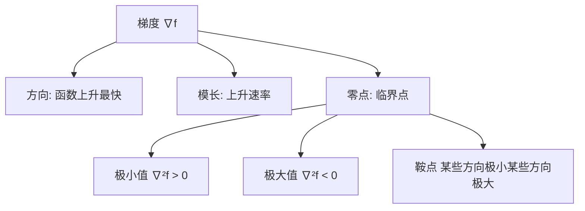
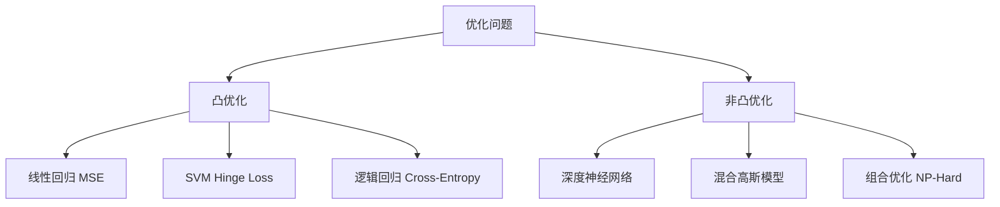

# 微积分与优化基础 (Calculus & Optimization Foundations)

> **一句话理解**: 微积分是研究"变化"的数学——导数测量瞬时变化率，梯度指引最优方向，链式法则串起整个反向传播。深度学习的本质就是用微积分在高维空间中寻找最低点。

---

## 目录

1. [概述：为什么 AI 需要微积分](#1-概述为什么-ai-需要微积分)
2. [导数：变化的度量](#2-导数变化的度量)
3. [偏导数与梯度：多变量世界的方向](#3-偏导数与梯度多变量世界的方向)
4. [链式法则：反向传播的数学灵魂](#4-链式法则反向传播的数学灵魂)
5. [泰勒展开：函数的局部近似](#5-泰勒展开函数的局部近似)
6. [凸优化：保证找到全局最优](#6-凸优化保证找到全局最优)
7. [梯度下降：从数学到算法](#7-梯度下降从数学到算法)
8. [优化器演进：SGD → Adam → Muon](#8-优化器演进sgd--adam--muon)
9. [拉格朗日乘子与 KKT 条件](#9-拉格朗日乘子与-kkt-条件)
10. [AI 中的微积分实战 Checklist](#10-ai-中的微积分实战-checklist)

---

## 1. 概述：为什么 AI 需要微积分

### 1.1 微积分在深度学习中的角色

```
深度学习 = 数据 + 模型 + 损失函数 + 优化器

微积分的作用:
├── 导数 → 计算损失函数关于参数的变化率
├── 梯度 → 确定参数更新的方向和步长
├── 链式法则 → 反向传播 (Backpropagation) 的理论基础
├── 泰勒展开 → 分析优化算法的收敛性
├── 凸优化 → 保证某些问题能找到全局最优解
└── Hessian 矩阵 → 理解损失曲面的曲率
```

### 1.2 核心直觉

| 微积分概念 | AI 中的对应 | 直觉理解 |
|-----------|------------|---------|
| **导数** | 损失对单参数的敏感度 | "这个参数微调一下，损失会变多少？" |
| **偏导数** | 多参数中某一参数的影响 | "在其他参数不变时，这个参数的影响" |
| **梯度** | 所有偏导数组成的向量 | "损失函数最陡上升的方向" |
| **链式法则** | 反向传播 | "复合函数的导数 = 各层导数的乘积" |
| **Hessian** | 损失曲面的曲率 | "梯度方向变化有多快？是平坦还是陡峭？" |
| **凸性** | 损失函数的形状 | "只有一个谷底（好）还是有多个（难）" |

---

## 2. 导数：变化的度量

### 2.1 导数的定义

$$f'(x) = \lim_{h \to 0} \frac{f(x+h) - f(x)}{h}$$

**几何意义**：函数在某点的切线斜率。

**物理意义**：瞬时变化率。


### 2.2 基本求导法则

| 法则 | 公式 | 示例 |
|------|------|------|
| **幂法则** | $\frac{d}{dx} x^n = nx^{n-1}$ | $\frac{d}{dx} x^3 = 3x^2$ |
| **常数法则** | $\frac{d}{dx} c = 0$ | $\frac{d}{dx} 5 = 0$ |
| **和法则** | $(f+g)' = f' + g'$ | $(x^2 + 3x)' = 2x + 3$ |
| **积法则** | $(fg)' = f'g + fg'$ | $(x \cdot \sin x)' = \sin x + x\cos x$ |
| **商法则** | $\left(\frac{f}{g}\right)' = \frac{f'g - fg'}{g^2}$ | $\left(\frac{x}{x+1}\right)' = \frac{1}{(x+1)^2}$ |

### 2.3 常用激活函数的导数

| 激活函数 | $f(x)$ | $f'(x)$ | 说明 |
|----------|--------|---------|------|
| **Sigmoid** | $\sigma(x) = \frac{1}{1+e^{-x}}$ | $\sigma(x)(1-\sigma(x))$ | 最大导数 0.25，易导致梯度消失 |
| **Tanh** | $\tanh(x) = \frac{e^x - e^{-x}}{e^x + e^{-x}}$ | $1 - \tanh^2(x)$ | 最大导数 1.0，优于 Sigmoid |
| **ReLU** | $\max(0, x)$ | $\begin{cases}1 & x>0\\0 & x<0\end{cases}$ | $x=0$ 处不可导，实际取 0 或 1 |
| **Leaky ReLU** | $\max(\alpha x, x)$ | $\begin{cases}1 & x>0\\\alpha & x<0\end{cases}$ | $\alpha$ 通常取 0.01 |
| **GELU** | $x \cdot \Phi(x)$ | $\Phi(x) + x\phi(x)$ | $\Phi$ 为标准正态 CDF |
| **SiLU/Swish** | $x \cdot \sigma(x)$ | $\sigma(x)(1 + x(1-\sigma(x)))$ | Llama/Gemma 等使用 |

### 2.4 数值导数 vs 解析导数

```python
# 解析导数 (Autograd 使用) — 精确、高效
def sigmoid(x):
    return 1 / (1 + np.exp(-x))

def sigmoid_grad(x):
    s = sigmoid(x)
    return s * (1 - s)  # 解析公式

# 数值导数 (梯度检查使用) — 近似、用于验证
def numerical_grad(f, x, h=1e-5):
    return (f(x + h) - f(x - h)) / (2 * h)

# 梯度检查 (Gradient Checking)
# 验证反向传播实现是否正确
diff = abs(analytic_grad - numerical_grad) / (abs(analytic_grad) + abs(numerical_grad))
assert diff < 1e-7, f"Gradient check failed: diff={diff}"
```

---

## 3. 偏导数与梯度：多变量世界的方向

### 3.1 偏导数 (Partial Derivative)

当函数有多个变量时，偏导数是**只对一个变量求导，其余视为常数**：

$$\frac{\partial f}{\partial x_i} = \lim_{h \to 0} \frac{f(\ldots, x_i+h, \ldots) - f(\ldots, x_i, \ldots)}{h}$$

**示例**：$f(x, y) = 3x^2y + y^3$

- $\frac{\partial f}{\partial x} = 6xy$ （$y$ 视为常数）
- $\frac{\partial f}{\partial y} = 3x^2 + 3y^2$ （$x$ 视为常数）

### 3.2 梯度 (Gradient)

梯度是**所有偏导数组成的向量**，指向函数值增加最快的方向：

$$\nabla f = \begin{bmatrix} \frac{\partial f}{\partial x_1} \\ \frac{\partial f}{\partial x_2} \\ \vdots \\ \frac{\partial f}{\partial x_n} \end{bmatrix}$$

**关键性质**：
- 梯度方向（$+\nabla f$）是函数**上升最快**的方向
- 负梯度方向（$-\nabla f$）是函数**下降最快**的方向 → 这就是梯度下降的基础
- 梯度为零（$\nabla f = 0$）的点是**临界点**（极值点或鞍点）



### 3.3 在神经网络中的含义

一个有 $N$ 个参数的神经网络，其损失函数 $\mathcal{L}(\theta_1, \theta_2, \ldots, \theta_N)$ 的梯度为：

$$\nabla_\theta \mathcal{L} = \left[\frac{\partial \mathcal{L}}{\partial \theta_1}, \frac{\partial \mathcal{L}}{\partial \theta_2}, \ldots, \frac{\partial \mathcal{L}}{\partial \theta_N}\right]^T$$

- **GPT-3** 有 175B 参数 → 梯度是 $1.75 \times 10^{11}$ 维向量
- 每一步训练就是计算并沿着这个超高维向量的反方向走一小步

---

## 4. 链式法则：反向传播的数学灵魂

### 4.1 单变量链式法则

如果 $y = f(g(x))$，则：

$$\frac{dy}{dx} = \frac{df}{dg} \cdot \frac{dg}{dx}$$

**示例**：$y = \sigma(w \cdot x + b)$

设 $z = w \cdot x + b$，则 $y = \sigma(z)$

$$\frac{dy}{dw} = \frac{d\sigma}{dz} \cdot \frac{dz}{dw} = \sigma(z)(1-\sigma(z)) \cdot x$$

### 4.2 多变量链式法则

如果 $z = f(x, y)$，且 $x = x(t), y = y(t)$，则：

$$\frac{dz}{dt} = \frac{\partial f}{\partial x}\frac{dx}{dt} + \frac{\partial f}{\partial y}\frac{dy}{dt}$$

### 4.3 计算图与反向传播

```
前向传播 (Forward Pass):
    x ──→ [×w] ──→ [×w₁] ──→ [+b] ──→ [σ] ──→ L
                                       
反向传播 (Backward Pass) — 链式法则的应用:
    L ←── [σ'] ←── [+b] ←── [×w₁] ←── [×w]
    
    ∂L/∂w = ∂L/∂σ × ∂σ/∂z × ∂z/∂w
           = (ŷ - y) × σ'(z) × x
```

```python
# 简化的反向传播实现
class SimpleLinear:
    def forward(self, x, w, b):
        self.x = x
        self.w = w
        self.z = x @ w + b          # 线性变换
        self.a = sigmoid(self.z)     # 激活
        return self.a
    
    def backward(self, grad_output):
        # 链式法则: 逐层乘以局部导数
        grad_z = grad_output * sigmoid_grad(self.z)  # ∂L/∂z
        grad_w = self.x.T @ grad_z                     # ∂L/∂w
        grad_b = grad_z.sum(axis=0)                    # ∂L/∂b
        grad_x = grad_z @ self.w.T                     # ∂L/∂x (传给上一层)
        return grad_x, grad_w, grad_b
```

### 4.4 链式法则的工程意义

| 概念 | 数学 | 工程 |
|------|------|------|
| 计算图 | 函数分解为原子操作 | PyTorch/TensorFlow 的 `autograd` |
| 前向传播 | 从输入计算输出 | `loss = model(inputs)` |
| 反向传播 | 从输出逆向应用链式法则 | `loss.backward()` |
| 梯度累积 | 多条路径的偏导相加 | `gradient_accumulation_steps` |

---

## 5. 泰勒展开：函数的局部近似

### 5.1 泰勒级数

$$f(x) \approx f(a) + f'(a)(x-a) + \frac{f''(a)}{2!}(x-a)^2 + \frac{f'''(a)}{3!}(x-a)^3 + \ldots$$

### 5.2 在优化中的应用

**一阶近似**（梯度下降的理论基础）：

$$f(\theta + \Delta\theta) \approx f(\theta) + \nabla f(\theta)^T \Delta\theta$$

要让 $f$ 下降最多，取 $\Delta\theta = -\eta \nabla f(\theta)$ → 这就是**梯度下降**。

**二阶近似**（牛顿法的理论基础）：

$$f(\theta + \Delta\theta) \approx f(\theta) + \nabla f^T \Delta\theta + \frac{1}{2}\Delta\theta^T H \Delta\theta$$

其中 $H = \nabla^2 f$ 是 Hessian 矩阵。对 $\Delta\theta$ 求导并令其为零：

$$\Delta\theta = -H^{-1} \nabla f$$

这就是**牛顿法**的更新规则。

### 5.3 Hessian 矩阵与损失曲面分析

$$H = \begin{bmatrix} \frac{\partial^2 f}{\partial x_1^2} & \frac{\partial^2 f}{\partial x_1 \partial x_2} & \cdots \\ \frac{\partial^2 f}{\partial x_2 \partial x_1} & \frac{\partial^2 f}{\partial x_2^2} & \cdots \\ \vdots & \vdots & \ddots \end{bmatrix}$$

| Hessian 特征 | 含义 | 临界点类型 |
|-------------|------|-----------|
| 所有特征值 > 0 | 局部凸（碗口朝上） | **局部极小值** |
| 所有特征值 < 0 | 局部凹（碗口朝下） | **局部极大值** |
| 有正有负 | 鞍形 | **鞍点** |
| 有零特征值 | 平坦方向 | 需要更高阶分析 |

> **AI 实践**: 在高维空间中（如神经网络的参数空间），几乎所有临界点都是鞍点而非局部极小值。这是高维优化能成功的关键原因之一。

---

## 6. 凸优化：保证找到全局最优

### 6.1 凸函数的定义

$$f(\lambda x + (1-\lambda)y) \leq \lambda f(x) + (1-\lambda)f(y), \quad \forall \lambda \in [0,1]$$

直观理解：**函数曲面上任意两点的连线都在曲面上方**。

### 6.2 凸 vs 非凸

| 性质 | 凸函数 | 非凸函数 |
|------|--------|---------|
| 局部最优 | = 全局最优 | ≠ 全局最优 |
| 优化难度 | 容易（梯度下降保证收敛） | 困难（可能陷入局部最优） |
| AI 中的例子 | 线性回归、SVM、逻辑回归 | 深度神经网络 |
| Hessian | 半正定 ($H \succeq 0$) | 不定 |



### 6.3 凸优化的对偶理论

**拉格朗日函数**（带有约束的优化）：

$$\mathcal{L}(\theta, \lambda, \mu) = f(\theta) + \sum_i \lambda_i g_i(\theta) + \sum_j \mu_j h_j(\theta)$$

其中 $g_i(\theta) \leq 0$ 是不等式约束，$h_j(\theta) = 0$ 是等式约束。

**对偶问题**：将原始的 $\min_\theta \max_{\lambda,\mu} \mathcal{L}$ 转换为 $\max_{\lambda,\mu} \min_\theta \mathcal{L}$。

> **AI 应用**: SVM 的对偶形式使得核方法成为可能。变分推断中也使用了拉格朗日对偶。

---

## 7. 梯度下降：从数学到算法

### 7.1 基本形式

$$\theta_{t+1} = \theta_t - \eta \nabla_\theta \mathcal{L}(\theta_t)$$

| 变体 | 更新规则 | 每步数据量 | 适用场景 |
|------|---------|-----------|---------|
| **BGD** (Batch) | 使用全部数据 | $N$ | 小数据集，精确收敛 |
| **SGD** (Stochastic) | 使用单个样本 | 1 | 大数据集，噪声大 |
| **MBGD** (Mini-Batch) | 使用一小批 | $B$ (32-512) | **最常用**，平衡效率与稳定性 |

### 7.2 学习率的影响

$$\theta_{t+1} = \theta_t - \eta \cdot \text{grad}$$

| 学习率 | 行为 | 类比 |
|--------|------|------|
| 太大 ($\eta > 2/L$) | 发散、震荡 | 步子太大，跨过了谷底 |
| 太小 ($\eta \ll 1/L$) | 收敛极慢 | 步子太小，半天走不到 |
| 适中 | 稳定收敛 | 恰到好处 |
| 衰减 | 前期快、后期精 | 先大步走，再小步调 |

> $L$ 是损失函数的 Lipschitz 常数（与 Hessian 最大特征值相关）。

### 7.3 收敛性分析

对于凸函数和 $L$-Lipschitz 连续梯度：

| 方法 | 收敛率 | 条件 |
|------|--------|------|
| 梯度下降 | $\mathcal{O}(1/T)$ | 凸 |
| 梯度下降 | $\mathcal{O}(1/T^2)$ | 凸 + Nesterov 加速 |
| 随机梯度下降 | $\mathcal{O}(1/\sqrt{T})$ | 凸 |
| 牛顿法 | 二次收敛 | 凸 + 二阶可导 |

---

## 8. 优化器演进：SGD → Adam → Muon

### 8.1 动量法 (Momentum)

$$v_t = \beta v_{t-1} + \nabla \mathcal{L}(\theta_t)$$
$$\theta_{t+1} = \theta_t - \eta \cdot v_t$$

直觉：像一个球在斜面上滚下，累积动量，能冲过小的局部最优。

### 8.2 Adam (Adaptive Moment Estimation)

$$m_t = \beta_1 m_{t-1} + (1-\beta_1) \nabla \mathcal{L}$$  (一阶矩)
$$v_t = \beta_2 v_{t-1} + (1-\beta_2) (\nabla \mathcal{L})^2$$  (二阶矩)
$$\hat{m}_t = \frac{m_t}{1-\beta_1^t}, \quad \hat{v}_t = \frac{v_t}{1-\beta_2^t}$$  (偏差校正)
$$\theta_{t+1} = \theta_t - \eta \cdot \frac{\hat{m}_t}{\sqrt{\hat{v}_t} + \epsilon}$$

**默认参数**: $\beta_1=0.9, \beta_2=0.999, \epsilon=10^{-8}$

### 8.3 优化器对比

| 优化器 | 核心思想 | 优点 | 缺点 | 适用场景 |
|--------|---------|------|------|---------|
| **SGD** | 固定学习率 | 简单、泛化好 | 收敛慢、需调 lr | CV (ResNet) |
| **SGD+Momentum** | 累积梯度方向 | 冲过局部最优 | 仍需调 lr | CV 主力 |
| **AdaGrad** | 逐参数自适应 lr | 稀疏特征友好 | lr 单调递减→消失 | NLP (早期) |
| **RMSProp** | 指数衰减的二阶矩 | 解决 AdaGrad 衰减问题 | 仍需调 lr | RNN |
| **Adam** | 动量 + 自适应 lr | 快速收敛、默认就好 | 泛化不如 SGD | **通用首选** |
| **AdamW** | Adam + 解耦权重衰减 | 正则化更有效 | 需调 wd | **Transformer 首选** |
| **Lion** | 符号操作 + 动量 | 内存效率高、效果好 | 较新、验证少 | 大模型 |
| **Muon** | 正交化梯度 | 2026 前沿、收敛快 | 计算开销 | 最新大模型 |

> **2026 趋势**: Muon (Momentum + Orthogonalization) 在 DeepSeek-V3 等大模型训练中表现出色，通过将梯度矩阵正交化来改善收敛性。

### 8.4 学习率调度

| 调度策略 | 公式 | 适用场景 |
|----------|------|---------|
| **Step Decay** | $\eta_t = \eta_0 \times \gamma^{\lfloor t/s \rfloor}$ | CV 经典 |
| **Cosine Decay** | $\eta_t = \frac{1}{2}(1 + \cos(\frac{t\pi}{T}))\eta_0$ | **大模型首选** |
| **Linear Warmup** | $\eta_t = \frac{t}{T_w}\eta_0$ (前 $T_w$ 步) | Transformer 必备 |
| **Warmup + Cosine** | 先升后降 | **LLM 训练标配** |
| **WSD** (Warmup-Stable-Decay) | 稳定段 + 衰减段 | 2026 新趋势 |

```python
# Warmup + Cosine Decay (LLM 训练标配)
def get_lr(step, max_steps, warmup_steps, max_lr):
    if step < warmup_steps:
        return max_lr * step / warmup_steps  # Linear warmup
    progress = (step - warmup_steps) / (max_steps - warmup_steps)
    return max_lr * 0.5 * (1 + math.cos(math.pi * progress))  # Cosine decay
```

---

## 9. 拉格朗日乘子与 KKT 条件

### 9.1 带约束优化问题

$$\min_\theta f(\theta) \quad \text{subject to} \quad g_i(\theta) \leq 0, \quad h_j(\theta) = 0$$

### 9.2 KKT 条件 (Karush-Kuhn-Tucker)

约束优化的**必要条件**（对于凸问题也是充分条件）：

1. **平稳性**: $\nabla_\theta f + \sum_i \lambda_i \nabla_\theta g_i + \sum_j \mu_j \nabla_\theta h_j = 0$
2. **原始可行性**: $g_i(\theta) \leq 0, \quad h_j(\theta) = 0$
3. **对偶可行性**: $\lambda_i \geq 0$
4. **互补松弛性**: $\lambda_i g_i(\theta) = 0$

### 9.3 AI 中的应用

- **SVM**: 间隔最大化 → 凸二次规划 → KKT 条件求解
- **正则化**: L1/L2 正则可视为带约束的优化
- **对抗训练**: 约束扰动范围 ($\|\delta\|_\infty \leq \epsilon$)
- **公平性约束**: 在优化目标中加入公平性条件

---

## 10. AI 中的微积分实战 Checklist

### 10.1 训练调试 Checklist

- [ ] **梯度检查**: 用数值梯度验证自定义层的解析梯度
- [ ] **梯度裁剪**: 对 RNN/Transformer 设 `max_norm=1.0`
- [ ] **学习率范围测试**: 从 $10^{-7}$ 到 $10^{1}$ 扫描，找到最优区间
- [ ] **梯度直方图**: 监控梯度分布，检测梯度消失/爆炸
- [ ] **Hessian 特征值**: (可选) 用幂迭代估计最大/最小特征值

### 10.2 常见问题与微积根源

| 问题 | 微积分原因 | 解决方案 |
|------|-----------|---------|
| **梯度消失** | 链式法则中多个 $<1$ 的导数连乘 | ReLU、残差连接、LayerNorm |
| **梯度爆炸** | 链式法则中多个 $>1$ 的导数连乘 | 梯度裁剪、权重正则 |
| **训练不收敛** | 学习率与 Lipschitz 常数不匹配 | Warmup、学习率调度 |
| **收敛到差解** | 非凸损失曲面的鞍点 | 动量法、增加批量大小 |
| **泛化差** | 优化到了太尖锐的极小值 | SGD、正则化、SWA |

### 10.3 数值稳定性

```python
# 1. LogSumExp 替代直接 exp (防止溢出)
def log_softmax(x):
    x_max = x.max(axis=-1, keepdims=True)
    return x - x_max - np.log(np.exp(x - x_max).sum(axis=-1, keepdims=True))

# 2. 数值稳定的交叉熵
def cross_entropy(logits, labels):
    log_probs = log_softmax(logits)
    return -log_probs[range(len(labels)), labels].mean()

# 3. 数值梯度检查
def grad_check(f, x, analytic_grad, num_samples=10):
    h = 1e-5
    for _ in range(num_samples):
        idx = np.random.randint(len(x))
        x_plus = x.copy(); x_plus[idx] += h
        x_minus = x.copy(); x_minus[idx] -= h
        num_grad = (f(x_plus) - f(x_minus)) / (2 * h)
        rel_error = abs(num_grad - analytic_grad[idx]) / (abs(num_grad) + abs(analytic_grad[idx]))
        assert rel_error < 1e-6, f"Gradient check failed at {idx}: {rel_error}"
```

---

## Related

- [[数学基础/Linear_Algebra/Linear_Algebra|线性代数]] — 向量/矩阵运算基础
- [[数学基础/Probability_Statistics/Probability_Statistics|概率统计]] — 贝叶斯推断与分布
- [[数学基础/Information_Theory/Information_Theory|信息论]] — 交叉熵与 KL 散度
- [[深度学习/Optimization/Optimization|深度学习优化]] — 深度学习专用优化技术
- [[模型训练/Optimization/Optimizer_Advanced|优化器进阶]] — AdamW/Lion/Muon 深度解析
- [[模型训练/Optimization/Scaling_Laws|Scaling Laws]] — 大模型训练的数学规律
- [[模型训练/Monitoring/Training_Troubleshooting_Runbook|训练故障排查]] — 梯度异常诊断

---

> **总结**: 微积分是 AI 的"发动机"——导数告诉我们参数往哪个方向调、调多少；链式法则让反向传播在百万/十亿级参数中高效运作；凸优化理论告诉我们什么时候能保证找到最优解。理解这些数学基础，才能在模型不收敛时准确诊断问题根源。

---

*Last updated: 2026-07-11*
