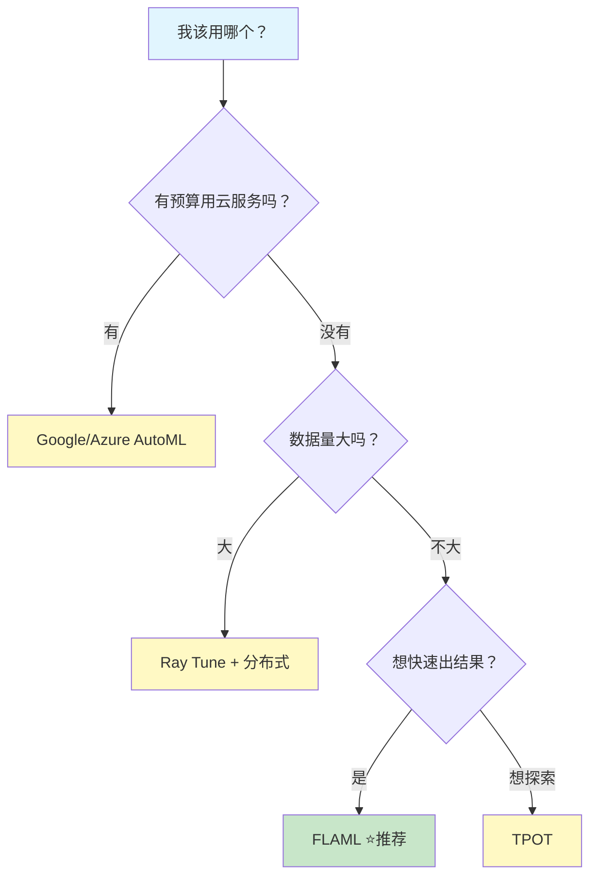

# AutoML - 小白版

> **一句话秒懂**: AutoML 就像"AI 自动调参机器人"——你把数据丢进去，它帮你自动选模型、调参数、做特征，最后给你一个能用的结果。

## 你将学到什么

- AutoML 是什么，为什么要用它
- AutoML 帮你做了哪三件大事
- 什么时候该用 AutoML，什么时候不该用
- 一个最简单的 AutoML 上手示例

---

## 为什么这个很重要？

传统机器学习流程中，**调参**是最耗时的环节之一。一个模型可能有十几个超参数，每个都有不同取值范围，组合起来可能有上百万种可能性。AutoML 让你从"炼丹师"变成"指挥官"——把重复劳动交给机器。

---

## 核心概念

### 生活中的例子：自动调电视天线 vs 电视机

```
┌─────────────────────────────────────────────────────┐
│                                                     │
│   手动调参 = 老式电视调天线                           │
│                                                     │
│     ╱╲                                              │
│    ╱  ╲     转一转... 嗞嗞嗞...                      │
│   ╱ 天 ╲   再转一转... 好点了...                     │
│  ╱  线  ╲  再转转... 又糊了...                       │
│ ╱________╲  到底哪个方向最好？？？                    │
│                                                     │
│   AutoML = 智能电视自动搜台                           │
│                                                     │
│   ┌──────────┐                                      │
│   │  📺 搜台中 │ → 自动扫描所有频道                    │
│   │  23% ████░│ → 自动锁定信号最强的                  │
│   │  完成! ✓  │ → 帮你排好序，选最好的                │
│   └──────────┘                                      │
│                                                     │
└─────────────────────────────────────────────────────┘
```

**简单来说**: 手动调参就像盲目转电视天线——你不知道哪个方向信号最好，只能一点点试。AutoML 就是自动搜台功能——它系统地扫描所有可能的"频道"，帮你找到最清晰的那一个。

---

### AutoML 帮你做的三件大事

```
┌──────────────────────────────────────────────────┐
│              AutoML 三大核心任务                    │
│                                                  │
│  ┌──────────┐  ┌──────────┐  ┌──────────┐       │
│  │ 📊 选模型 │  │ 🔧 调参数 │  │ ✨ 做特征 │       │
│  │          │  │          │  │          │       │
│  │ 从几十个 │  │ 从数百万 │  │ 自动组合 │       │
│  │ 算法中选 │  │ 种组合中 │  │ 和变换特 │       │
│  │ 最合适的 │  │ 找最优的 │  │ 征字段   │       │
│  └──────────┘  └──────────┘  └──────────┘       │
│       ↓              ↓              ↓            │
│  随机森林?       学习率=0.01?    月收入÷月支出=?  │
│  XGBoost?       深度=5?          最近7天点击=?    │
│  神经网络?       树数量=200?     用户年龄分桶=?   │
│                                                  │
└──────────────────────────────────────────────────┘
```

| 任务 | 手动方式 | AutoML 方式 |
|------|---------|-------------|
| **选模型** | 一个一个试，凭经验猜 | 自动遍历候选模型，比较性能 |
| **调参数** | 网格搜索，可能跑好几天 | 智能搜索（贝叶斯优化），几小时搞定 |
| **做特征** | 靠领域知识手动构造 | 自动生成交叉、聚合等特征 |

---

### AutoML 工作流程


---

### 什么时候用 AutoML？

```
┌────────────────────────────────────┐
│         ✅ 适合用 AutoML            │
├────────────────────────────────────┤
│                                    │
│  🔰 快速做原型/验证想法             │
│     → 几行代码就能跑出 baseline     │
│                                    │
│  📊 不确定哪个模型最好              │
│     → 让 AutoML 帮你都试一遍       │
│                                    │
│  ⏰ 时间紧迫需要出结果              │
│     → 不用花几天手动调参            │
│                                    │
│  🎓 还在学习机器学习                │
│     → 通过 AutoML 结果学习最佳实践  │
│                                    │
└────────────────────────────────────┘
```

### 什么时候不用 AutoML？

```
┌────────────────────────────────────┐
│         ❌ 不适合用 AutoML          │
├────────────────────────────────────┤
│                                    │
│  🏆 需要极致性能                   │
│     → 自动搜索有上限，手动精调更好  │
│                                    │
│  🔧 有高度定制化需求               │
│     → 特殊模型架构 AutoML 不支持    │
│                                    │
│  💰 预算极其有限                   │
│     → AutoML 搜索本身消耗算力      │
│                                    │
│  📐 需要完全可解释性                │
│     → AutoML 集成模型难以解释      │
│                                    │
└────────────────────────────────────┘
```

---

### 最简单的上手示例

**6 行代码跑一个 AutoML：**

```python
from flaml import AutoML

automl = AutoML()
automl.fit(
    X_train, y_train,       # 你的训练数据
    task="classification",  # 分类 or 回归
    time_budget=60,         # 只跑 60 秒
)

print(f"准确率: {automl.score(X_test, y_test):.2%}")
print(f"最佳模型: {automl.best_estimator}")
```

就这么简单！你只需要：
1. 准备好数据 (`X_train`, `y_train`)
2. 告诉它任务类型（分类/回归）
3. 给一个时间预算
4. 等，然后拿结果

---

### 调参方法简单类比

| 方法 | 类比 | 特点 |
|------|------|------|
| **网格搜索** | 把电视所有频道从头到尾看一遍 | 最笨但最全，超慢 |
| **随机搜索** | 随机按几个频道看看 | 比网格快，可能错过好频道 |
| **贝叶斯优化** | 聪明地按频道——知道哪些方向信号强就多按那附近 | 最聪明，AutoML 最常用 |

```
网格搜索：  1→2→3→4→5→6→7→8→9→10  (全部试一遍)
随机搜索：  3→7→2→9→1→6             (随机跳着试)
贝叶斯：    3→5→4→4.5→4.3→4.2       (越来越精准)

结果：网格最全但最慢，贝叶斯最快找到好的
```

---

### 常用 AutoML 工具怎么选？



| 工具 | 一句话评价 | 适合谁 |
|------|-----------|--------|
| **FLAML** | 轻量快速，上手最简单 | 初学者、快速原型 |
| **Optuna** | 调参神器，灵活强大 | 中级用户、深度学习 |
| **Auto-sklearn** | sklearn 生态，学术首选 | 学术研究 |
| **Ray Tune** | 分布式调参，大规模 | 工程团队 |
| **H2O AutoML** | 企业级，功能全面 | 企业用户 |

---

### 记住这个

> **AutoML = 自动选模型 + 自动调参数 + 自动做特征**
>
> 它不是万能的，但它是：
> - **入门 ML 的最佳起点** —— 几行代码就能跑出不错的结果
> - **建立 baseline 的最快方式** —— 知道"自动化能达到多少分"
> - **学习调参的好老师** —— 看它选了什么参数，你就知道什么参数好
>
> 记住：**先用 AutoML 跑出 baseline，再手动精调超越它。**
