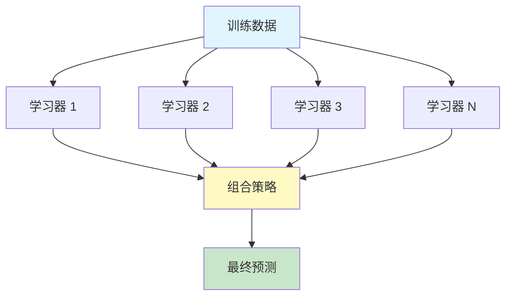
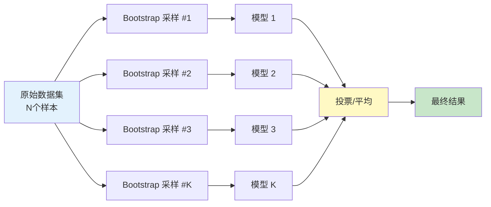
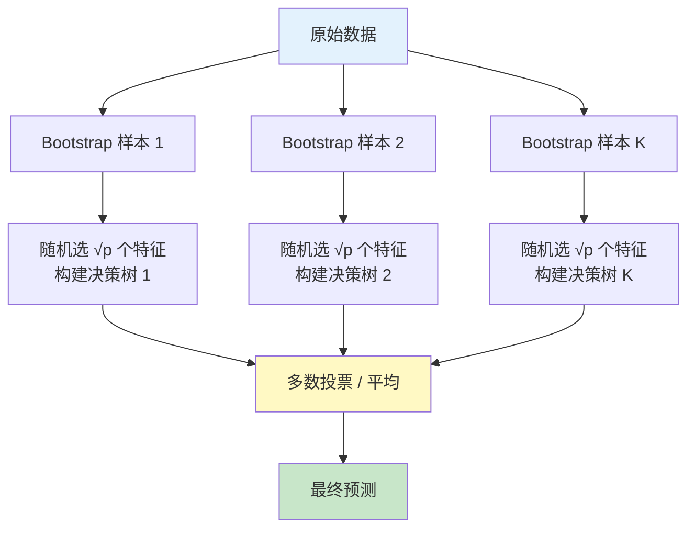
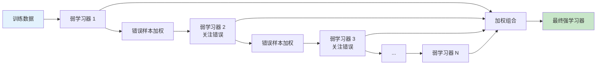
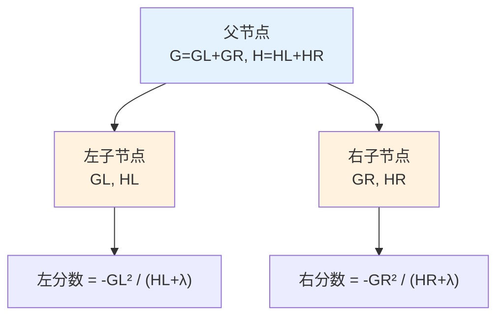
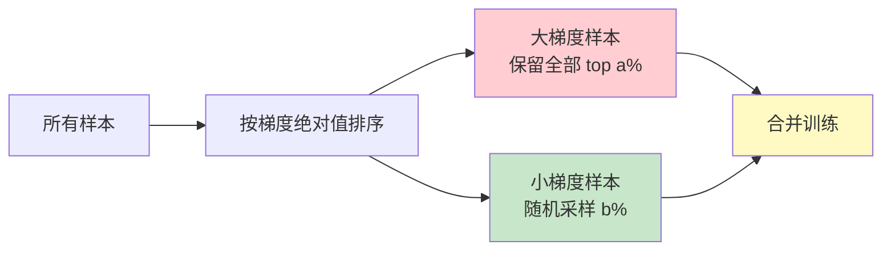
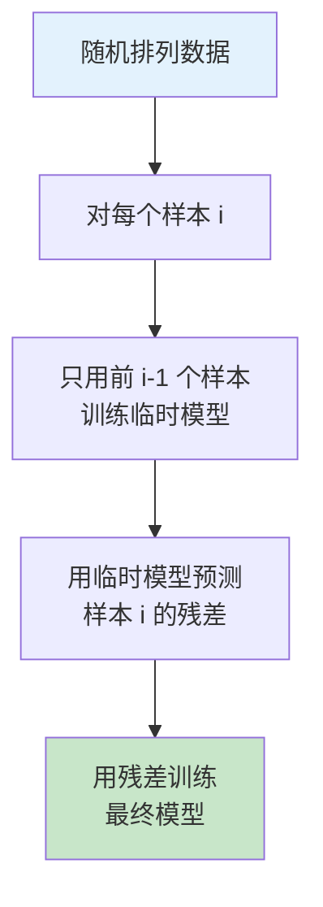
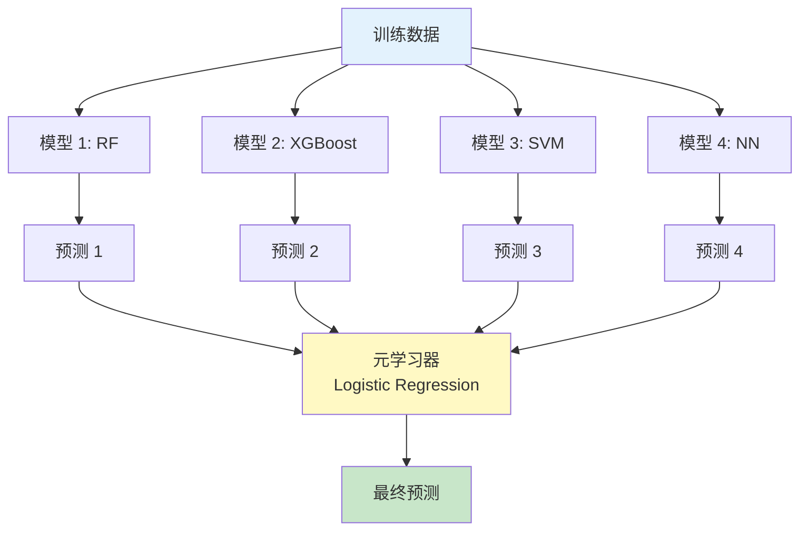
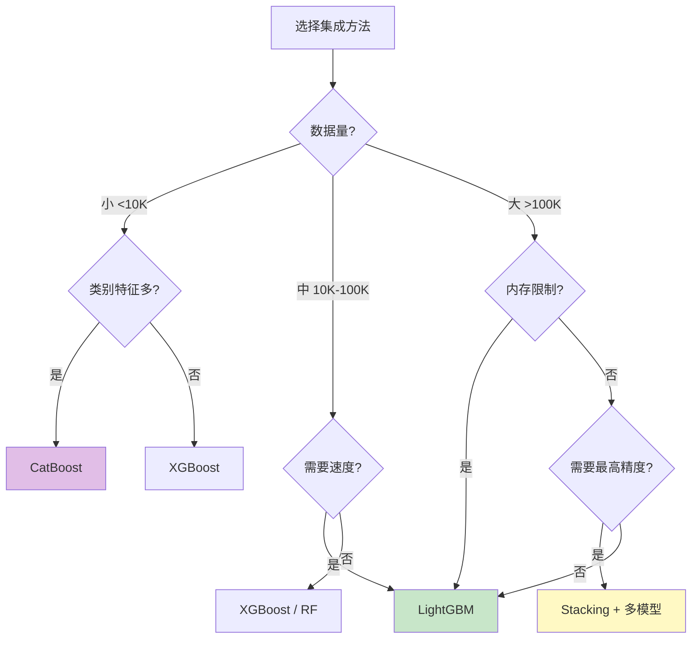

# 集成学习 (Ensemble Learning) - 完全指南

> 中文简称：集成学习 - 完全指南

## 目录

- [1. 集成学习概述](#1-集成学习概述)
- [2. Bagging 理论](#2-bagging-理论)
- [3. 随机森林 (Random Forest)](#3-随机森林-random-forest)
- [4. Boosting 理论](#4-boosting-理论)
- [5. XGBoost](#5-xgboost)
- [6. LightGBM](#6-lightgbm)
- [7. CatBoost](#7-catboost)
- [8. Stacking 与 Blending](#8-stacking-与-blending)
- [9. Voting Classifiers](#9-voting-classifiers)
- [10. 如何选择集成方法](#10-如何选择集成方法)
- [11. 综合对比与基准测试](#11-综合对比与基准测试)
- [12. 完整代码实战](#12-完整代码实战)

---

## 1. 集成学习概述

集成学习的核心思想：**组合多个弱学习器，构建一个强学习器**。



### 1.1 集成学习的三大范式

| 范式 | 核心思想 | 代表算法 | 学习器关系 |
|------|---------|---------|-----------|
| **Bagging** | 并行训练，降低方差 | Random Forest | 独立并行 |
| **Boosting** | 串行训练，降低偏差 | AdaBoost, XGBoost, LightGBM | 依赖串行 |
| **Stacking** | 分层组合，元学习 | Stacking, Blending | 层次化 |

### 1.2 为什么集成学习有效

**偏差-方差分解**：

$$\text{MSE} = \text{Bias}^2 + \text{Variance} + \text{Noise}$$

- **Bagging**：通过平均降低方差（高方差模型如决策树受益最大）
- **Boosting**：通过逐步纠错降低偏差
- **Stacking**：通过元学习器整合互补信息

---

## 2. Bagging 理论

### 2.1 Bootstrap Aggregating 原理

Bagging 的两个核心步骤：
1. **Bootstrap**：从训练集中有放回地随机采样，生成多个子数据集
2. **Aggregating**：对每个子数据集训练一个基学习器，最后聚合结果



### 2.2 Bootstrap 采样性质

每个 Bootstrap 样本中：
- 约 **63.2%** 的原始样本至少出现一次
- 约 **36.8%** 的样本未被采样到（Out-of-Bag, OOB）

```python
import numpy as np

def bootstrap_sample(X, n_samples=None, random_state=None):
    rng = np.random.RandomState(random_state)
    n = X.shape[0] if n_samples is None else n_samples
    indices = rng.choice(n, size=n, replace=True)
    return X[indices], indices

n = 10000
all_indices = set(range(n))
rng = np.random.RandomState(42)
sampled = rng.choice(n, size=n, replace=True)
oob = all_indices - set(sampled)
print(f"OOB 比例: {len(oob)/n:.4f}")
print(f"采样到比例: {1 - len(oob)/n:.4f}")
```

数学推导：

$$P(\text{样本未被选中}) = \left(1 - \frac{1}{N}\right)^N \xrightarrow{N \to \infty} \frac{1}{e} \approx 0.368$$

### 2.3 Out-of-Bag (OOB) 估计

OOB 样本可以作为免费的验证集，无需额外的交叉验证：

```python
from sklearn.ensemble import BaggingClassifier
from sklearn.tree import DecisionTreeClassifier
from sklearn.datasets import make_classification

X, y = make_classification(n_samples=1000, n_features=20, random_state=42)

clf = BaggingClassifier(
    estimator=DecisionTreeClassifier(),
    n_estimators=100,
    oob_score=True,
    random_state=42
)
clf.fit(X, y)

print(f"OOB 准确率: {clf.oob_score_:.4f}")
```

### 2.4 Bagging 降低方差的数学证明

假设有 $K$ 个独立同分布的模型，每个模型的方差为 $\sigma^2$：

$$\text{Var}\left(\frac{1}{K}\sum_{i=1}^{K} f_i\right) = \frac{\sigma^2}{K}$$

实际中模型之间有相关性 $\rho$：

$$\text{Var} = \rho \sigma^2 + \frac{1-\rho}{K}\sigma^2$$

**关键洞察**：Bagging 的效果取决于模型之间的相关性。随机森林通过特征随机选择降低相关性。

---

## 3. 随机森林 (Random Forest)

### 3.1 核心思想

随机森林 = Bagging + 特征随机选择

在每棵树分裂节点时，不是在所有 $p$ 个特征中寻找最优分裂，而是在随机选择的 $m$ 个特征中寻找（通常 $m = \sqrt{p}$ 用于分类，$m = p/3$ 用于回归）。



### 3.2 特征重要性

#### 3.2.1 基于不纯度的重要性 (Mean Decrease Impurity)

$$\text{Importance}(j) = \frac{1}{K}\sum_{k=1}^{K}\sum_{t \in T_k: v(t)=j} \Delta i(t)$$

其中 $\Delta i(t)$ 是节点 $t$ 分裂时的不纯度减少量。

#### 3.2.2 排列重要性 (Permutation Importance)

打乱某个特征的值后观察性能下降程度：

```python
from sklearn.ensemble import RandomForestClassifier
from sklearn.inspection import permutation_importance
from sklearn.datasets import make_classification
from sklearn.model_selection import train_test_split
import matplotlib.pyplot as plt

X, y = make_classification(
    n_samples=1000, n_features=10, n_informative=5, random_state=42
)
X_train, X_test, y_train, y_test = train_test_split(X, y, random_state=42)

rf = RandomForestClassifier(n_estimators=100, random_state=42)
rf.fit(X_train, y_train)

# MDI 重要性
mdi_importance = rf.feature_importances_

# 排列重要性
perm_importance = permutation_importance(rf, X_test, y_test, n_repeats=30, random_state=42)

fig, axes = plt.subplots(1, 2, figsize=(14, 5))

axes[0].barh(range(10), mdi_importance)
axes[0].set_title("MDI 特征重要性")
axes[0].set_xlabel("重要性")

axes[1].barh(range(10), perm_importance.importances_mean)
axes[1].set_title("排列特征重要性")
axes[1].set_xlabel("重要性")

plt.tight_layout()
plt.savefig("feature_importance.png", dpi=150)
plt.show()
```

### 3.3 超参数指南

| 参数 | 默认值 | 调优范围 | 说明 |
|------|--------|---------|------|
| `n_estimators` | 100 | 100-1000 | 树的数量，越多越好但边际收益递减 |
| `max_depth` | None | 5-30 | 树的最大深度，控制过拟合 |
| `min_samples_split` | 2 | 2-20 | 分裂所需最小样本数 |
| `min_samples_leaf` | 1 | 1-10 | 叶节点最小样本数 |
| `max_features` | √p / p/3 | 0.1-1.0 | 每次分裂考虑的特征比例 |
| `bootstrap` | True | True/False | 是否使用 Bootstrap 采样 |
| `oob_score` | False | True | 是否计算 OOB 分数 |
| `n_jobs` | None | -1 | 并行计算的 CPU 数量 |

```python
from sklearn.model_selection import RandomizedSearchCV
from scipy.stats import randint

param_dist = {
    'n_estimators': randint(100, 500),
    'max_depth': randint(5, 30),
    'min_samples_split': randint(2, 20),
    'min_samples_leaf': randint(1, 10),
    'max_features': ['sqrt', 'log2', 0.3, 0.5, 0.7]
}

rf = RandomForestClassifier(random_state=42)
search = RandomizedSearchCV(
    rf, param_dist, n_iter=50, cv=5, scoring='accuracy',
    random_state=42, n_jobs=-1
)
search.fit(X_train, y_train)
print(f"最佳参数: {search.best_params_}")
print(f"最佳分数: {search.best_score_:.4f}")
```

---

## 4. Boosting 理论

### 4.1 Boosting 核心思想

Boosting 通过**串行**训练一系列弱学习器，每个学习器关注前一个学习器犯错的样本。



### 4.2 AdaBoost

AdaBoost（Adaptive Boosting）通过调整样本权重来聚焦难分类的样本。

#### 算法流程

1. 初始化样本权重 $w_i = 1/N$
2. 对每一轮 $t = 1, 2, ..., T$：
 - 用加权数据训练弱学习器 $h_t$
 - 计算加权错误率：$\epsilon_t = \sum_{i: h_t(x_i) \neq y_i} w_i$
 - 计算学习器权重：$\alpha_t = \frac{1}{2}\ln\frac{1-\epsilon_t}{\epsilon_t}$
 - 更新样本权重：$w_i \leftarrow w_i \cdot \exp(-\alpha_t y_i h_t(x_i))$
 - 归一化权重
3. 最终分类器：$H(x) = \text{sign}\left(\sum_{t=1}^{T}\alpha_t h_t(x)\right)$

```python
from sklearn.ensemble import AdaBoostClassifier
from sklearn.tree import DecisionTreeClassifier
from sklearn.datasets import make_moons
from sklearn.model_selection import cross_val_score

X, y = make_moons(n_samples=500, noise=0.3, random_state=42)

ada = AdaBoostClassifier(
    estimator=DecisionTreeClassifier(max_depth=1),
    n_estimators=100,
    learning_rate=0.5,
    random_state=42
)

scores = cross_val_score(ada, X, y, cv=5, scoring='accuracy')
print(f"AdaBoost 准确率: {scores.mean():.4f} ± {scores.std():.4f}")
```

### 4.3 Gradient Boosting

Gradient Boosting 通过拟合当前模型的**负梯度**（残差）来学习：

$$F_{t}(x) = F_{t-1}(x) + \eta \cdot h_t(x)$$

其中 $h_t$ 是在负梯度 $-\nabla_{F}L(y, F)$ 上训练的学习器。

```python
from sklearn.ensemble import GradientBoostingClassifier
from sklearn.datasets import make_classification
from sklearn.model_selection import train_test_split
from sklearn.metrics import accuracy_score

X, y = make_classification(n_samples=2000, n_features=20, random_state=42)
X_train, X_test, y_train, y_test = train_test_split(X, y, random_state=42)

gb = GradientBoostingClassifier(
    n_estimators=200,
    learning_rate=0.1,
    max_depth=5,
    subsample=0.8,
    random_state=42
)
gb.fit(X_train, y_train)

print(f"训练集准确率: {gb.score(X_train, y_train):.4f}")
print(f"测试集准确率: {gb.score(X_test, y_test):.4f}")

import numpy as np
cumulative_errors = []
for y_pred in gb.staged_predict(X_test):
    cumulative_errors.append(1 - accuracy_score(y_test, y_pred))
best_n = np.argmin(cumulative_errors) + 1
print(f"最佳树数量: {best_n}")
```

---

## 5. XGBoost

### 5.1 目标函数

XGBoost 的目标函数在传统梯度提升基础上加入了正则化项：

$$\text{Obj}^{(t)} = \sum_{i=1}^{n} L(y_i, \hat{y}_i^{(t-1)} + f_t(x_i)) + \Omega(f_t)$$

正则化项：

$$\Omega(f) = \gamma T + \frac{1}{2}\lambda \|\mathbf{w}\|^2$$

其中 $T$ 是叶子节点数量，$w$ 是叶子权重。

### 5.2 二阶泰勒展开

对损失函数进行二阶泰勒展开：

$$\text{Obj}^{(t)} \approx \sum_{i=1}^{n}\left[g_i f_t(x_i) + \frac{1}{2}h_i f_t^2(x_i)\right] + \Omega(f_t)$$

其中：
- $g_i = \partial_{\hat{y}^{(t-1)}} L(y_i, \hat{y}^{(t-1)})$ — 一阶梯度
- $h_i = \partial_{\hat{y}^{(t-1)}}^2 L(y_i, \hat{y}^{(t-1)})$ — 二阶梯度（Hessian）

### 5.3 最优分裂增益

$$\text{Gain} = \frac{1}{2}\left[\frac{G_L^2}{H_L + \lambda} + \frac{G_R^2}{H_R + \lambda} - \frac{(G_L+G_R)^2}{H_L+H_R+\lambda}\right] - \gamma$$



### 5.4 树剪枝

XGBoost 采用**预剪枝**策略：当增益 Gain < $\gamma$ 时，不进行分裂。此外还支持**后剪枝**：从最大深度开始，递归剪去负增益的节点。

### 5.5 正则化手段

| 正则化方法 | 参数 | 作用 |
|-----------|------|------|
| L1 正则化 | `alpha` (λ) | 稀疏化叶子权重 |
| L2 正则化 | `lambda` (λ) | 平滑叶子权重 |
| 最小分裂增益 | `gamma` (γ) | 控制分裂的最小增益 |
| 子采样 | `subsample` | 行采样，防过拟合 |
| 列采样 | `colsample_bytree` | 列采样，增加多样性 |
| 学习率 | `eta` | 缩放每棵树的贡献 |
| 早停 | `early_stopping_rounds` | 验证集不提升时停止 |

### 5.6 参数指南

```python
import xgboost as xgb
from sklearn.datasets import make_classification
from sklearn.model_selection import train_test_split

X, y = make_classification(n_samples=5000, n_features=30, random_state=42)
X_train, X_test, y_train, y_test = train_test_split(X, y, random_state=42)

dtrain = xgb.DMatrix(X_train, label=y_train)
dtest = xgb.DMatrix(X_test, label=y_test)

params = {
    'objective': 'binary:logistic',
    'eval_metric': 'auc',
    'max_depth': 6,
    'eta': 0.1,
    'subsample': 0.8,
    'colsample_bytree': 0.8,
    'min_child_weight': 1,
    'gamma': 0,
    'lambda': 1,
    'alpha': 0,
    'scale_pos_weight': 1,
    'seed': 42
}

evals_result = {}
model = xgb.train(
    params, dtrain,
    num_boost_round=500,
    evals=[(dtrain, 'train'), (dtest, 'test')],
    early_stopping_rounds=50,
    evals_result=evals_result,
    verbose_eval=50
)

print(f"最佳迭代: {model.best_iteration}")
print(f"最佳 AUC: {model.best_score:.4f}")
```

### 5.7 XGBoost 参数调优优先级

```
第一优先级: max_depth, min_child_weight
第二优先级: gamma, subsample, colsample_bytree
第三优先级: eta (learning_rate), n_estimators
第四优先级: lambda, alpha (正则化)
第五优先级: scale_pos_weight (类别不平衡)
```

```python
from sklearn.model_selection import GridSearchCV
import xgboost as xgb

xgb_clf = xgb.XGBClassifier(
    objective='binary:logistic',
    eval_metric='auc',
    use_label_encoder=False,
    random_state=42
)

param_grid = {
    'max_depth': [3, 5, 7, 9],
    'min_child_weight': [1, 3, 5],
    'gamma': [0, 0.1, 0.2],
    'subsample': [0.7, 0.8, 0.9],
    'colsample_bytree': [0.7, 0.8, 0.9],
    'eta': [0.01, 0.05, 0.1],
    'n_estimators': [100, 200, 500]
}

search = RandomizedSearchCV(
    xgb_clf, param_grid, n_iter=50, cv=5,
    scoring='roc_auc', random_state=42, n_jobs=-1
)
search.fit(X_train, y_train)
```

---

## 6. LightGBM

### 6.1 核心创新

LightGBM 的两大核心优化：

#### 6.1.1 GOSS (Gradient-based One-Side Sampling)

保留大梯度的样本（因为对学习最有用），随机丢弃小梯度的样本：



#### 6.1.2 EFB (Exclusive Feature Bundling)

将互斥特征（很少同时取非零值的特征）捆绑在一起，减少特征数量：

```python
# EFB 示例：两个互斥特征合并
# 特征 A: [1, 0, 0, 3, 0, 0]
# 特征 B: [0, 2, 0, 0, 0, 4]
# 合并后:  [1, 2, 0, 3, 0, 4]  (假设 A 的范围是 0-3)
```

### 6.2 Leaf-wise vs Level-wise 生长策略

```
Level-wise (XGBoost 默认):        Leaf-wise (LightGBM):
      按层生长，避免过拟合            按叶子增益生长，效率更高
           [根]                           [根]
          /    \                         /    \
        [A]    [B]                     [A]    [B]
       / \    / \                     / \
     [C] [D][E] [F]                 [C] [D]
                                      \
                                  (继续分裂增益最大的叶子)
```

### 6.3 完整代码示例

```python
import lightgbm as lgb
from sklearn.datasets import make_classification
from sklearn.model_selection import train_test_split
from sklearn.metrics import accuracy_score, roc_auc_score

X, y = make_classification(
    n_samples=10000, n_features=50, n_informative=25, random_state=42
)
X_train, X_test, y_train, y_test = train_test_split(X, y, test_size=0.2, random_state=42)

train_data = lgb.Dataset(X_train, label=y_train)
test_data = lgb.Dataset(X_test, label=y_test, reference=train_data)

params = {
    'objective': 'binary',
    'metric': ['auc', 'binary_logloss'],
    'boosting_type': 'gbdt',
    'num_leaves': 31,
    'learning_rate': 0.05,
    'feature_fraction': 0.8,
    'bagging_fraction': 0.8,
    'bagging_freq': 5,
    'min_data_in_leaf': 20,
    'lambda_l1': 0.0,
    'lambda_l2': 0.0,
    'max_depth': -1,
    'verbose': -1,
    'seed': 42
}

callbacks = [
    lgb.early_stopping(stopping_rounds=50),
    lgb.log_evaluation(period=50)
]

model = lgb.train(
    params,
    train_data,
    num_boost_round=1000,
    valid_sets=[train_data, test_data],
    valid_names=['train', 'valid'],
    callbacks=callbacks
)

y_pred = model.predict(X_test)
y_pred_binary = (y_pred > 0.5).astype(int)

print(f"准确率: {accuracy_score(y_test, y_pred_binary):.4f}")
print(f"AUC: {roc_auc_score(y_test, y_pred):.4f}")

print("\n特征重要性 (Top 10):")
importance = model.feature_importance(importance_type='gain')
feature_names = [f'f{i}' for i in range(X.shape[1])]
sorted_idx = importance.argsort()[::-1][:10]
for idx in sorted_idx:
    print(f"  {feature_names[idx]}: {importance[idx]:.2f}")
```

### 6.4 LightGBM 参数指南

| 参数 | 默认值 | 推荐范围 | 说明 |
|------|--------|---------|------|
| `num_leaves` | 31 | 15-127 | 叶节点数量，主要复杂度控制 |
| `max_depth` | -1 | 3-15 | 限制深度可防止过拟合 |
| `learning_rate` | 0.1 | 0.01-0.3 | 配合更多迭代次数 |
| `n_estimators` | 100 | 100-10000 | 配合早停使用 |
| `min_data_in_leaf` | 20 | 10-100 | 叶节点最小数据量 |
| `feature_fraction` | 1.0 | 0.5-0.9 | 特征采样比例 |
| `bagging_fraction` | 1.0 | 0.5-0.9 | 数据采样比例 |
| `lambda_l1` | 0 | 0-5 | L1 正则化 |
| `lambda_l2` | 0 | 0-5 | L2 正则化 |
| `min_gain_to_split` | 0 | 0-1 | 最小分裂增益 |

---

## 7. CatBoost

### 7.1 核心创新

#### 7.1.1 Ordered Boosting (有序提升)

传统 Boosting 在训练时会使用同一数据集的预测值作为目标，导致**目标泄露**（Target Leakage）。CatBoost 通过有序提升解决：



#### 7.1.2 类别特征处理

CatBoost 的类别特征编码方法（Ordered Target Statistics）：

$$\text{encoded}(x_j^i) = \frac{\sum_{k < i}[x_j^k = x_j^i] \cdot y_k + a \cdot P}{\sum_{k < i}[x_j^k = x_j^i] + a}$$

其中 $P$ 是先验（全局目标均值），$a$ 是先验权重。

```python
from catboost import CatBoostClassifier, Pool
from sklearn.datasets import make_classification
from sklearn.model_selection import train_test_split

X, y = make_classification(n_samples=5000, n_features=20, random_state=42)
X_train, X_test, y_train, y_test = train_test_split(X, y, random_state=42)

model = CatBoostClassifier(
    iterations=500,
    learning_rate=0.1,
    depth=6,
    l2_leaf_reg=3,
    loss_function='Logloss',
    eval_metric='AUC',
    random_seed=42,
    verbose=100,
    early_stopping_rounds=50
)

model.fit(
    X_train, y_train,
    eval_set=(X_test, y_test),
    verbose=100
)

print(f"测试集 AUC: {model.score(X_test, y_test):.4f}")
```

### 7.2 CatBoost 处理真实类别特征示例

```python
import pandas as pd
import numpy as np
from catboost import CatBoostClassifier, Pool
from sklearn.model_selection import train_test_split

np.random.seed(42)
n = 5000
data = pd.DataFrame({
    'city': np.random.choice(['北京', '上海', '广州', '深圳', '杭州'], n),
    'device': np.random.choice(['iOS', 'Android', 'Web'], n),
    'age': np.random.randint(18, 65, n),
    'income': np.random.exponential(5000, n),
    'browsing_time': np.random.exponential(30, n),
})
data['purchase'] = (
    (data['city'].isin(['北京', '上海']) * 0.1 +
     (data['device'] == 'iOS') * 0.15 +
     (data['income'] > 5000) * 0.2 +
     (data['browsing_time'] > 30) * 0.1 +
     np.random.normal(0, 0.1, n)) > 0.3
).astype(int)

cat_features = ['city', 'device']

X_train, X_test, y_train, y_test = train_test_split(
    data.drop('purchase', axis=1), data['purchase'], test_size=0.2, random_state=42
)

train_pool = Pool(X_train, y_train, cat_features=cat_features)
test_pool = Pool(X_test, y_test, cat_features=cat_features)

model = CatBoostClassifier(
    iterations=300,
    learning_rate=0.1,
    depth=6,
    cat_features=cat_features,
    random_seed=42,
    verbose=100
)
model.fit(train_pool, eval_set=test_pool, early_stopping_rounds=30)

print(f"\n特征重要性:")
for name, imp in sorted(zip(data.columns[:-1], model.feature_importances_), key=lambda x: -x[1]):
    print(f"  {name}: {imp:.2f}")
```

---

## 8. Stacking 与 Blending

### 8.1 Stacking (堆叠)



**关键**：基学习器的预测必须通过交叉验证生成，避免数据泄露。

```python
from sklearn.ensemble import (
    StackingClassifier, RandomForestClassifier, GradientBoostingClassifier
)
from sklearn.svm import SVC
from sklearn.linear_model import LogisticRegression
from sklearn.neural_network import MLPClassifier
from sklearn.model_selection import cross_val_score
from sklearn.datasets import make_classification

X, y = make_classification(n_samples=2000, n_features=20, random_state=42)

base_learners = [
    ('rf', RandomForestClassifier(n_estimators=100, random_state=42)),
    ('gb', GradientBoostingClassifier(n_estimators=100, random_state=42)),
    ('svc', SVC(probability=True, random_state=42)),
    ('mlp', MLPClassifier(hidden_layer_sizes=(50,), max_iter=500, random_state=42))
]

stacking = StackingClassifier(
    estimators=base_learners,
    final_estimator=LogisticRegression(),
    cv=5,
    n_jobs=-1
)

scores = cross_val_score(stacking, X, y, cv=5, scoring='accuracy')
print(f"Stacking 准确率: {scores.mean():.4f} ± {scores.std():.4f}")

for name, model in base_learners:
    s = cross_val_score(model, X, y, cv=5, scoring='accuracy')
    print(f"{name} 准确率: {s.mean():.4f} ± {s.std():.4f}")
```

### 8.2 Blending (融合)

Blending 是 Stacking 的简化版：用固定的验证集代替交叉验证生成元特征。

```python
from sklearn.model_selection import train_test_split
import numpy as np

X_train_full, X_test, y_train_full, y_test = train_test_split(X, y, test_size=0.2, random_state=42)
X_train, X_val, y_train, y_val = train_test_split(X_train_full, y_train_full, test_size=0.5, random_state=42)

base_models = [
    RandomForestClassifier(n_estimators=100, random_state=42),
    GradientBoostingClassifier(n_estimators=100, random_state=42),
    SVC(probability=True, random_state=42)
]

val_predictions = np.zeros((X_val.shape[0], len(base_models)))
test_predictions = np.zeros((X_test.shape[0], len(base_models)))

for i, model in enumerate(base_models):
    model.fit(X_train, y_train)
    val_predictions[:, i] = model.predict_proba(X_val)[:, 1]
    test_predictions[:, i] = model.predict_proba(X_test)[:, 1]

meta_model = LogisticRegression()
meta_model.fit(val_predictions, y_val)

blending_score = meta_model.score(test_predictions, y_test)
print(f"Blending 准确率: {blending_score:.4f}")
```

### 8.3 Stacking vs Blending 对比

| 特性 | Stacking | Blending |
|------|---------|----------|
| 验证方式 | K 折交叉验证 | 单次验证集 |
| 数据利用 | 更充分 | 较少（验证集不参与训练） |
| 计算复杂度 | 更高 | 较低 |
| 过拟合风险 | 较低 | 较高 |
| 适用场景 | 数据量充足时 | 快速实验时 |

---

## 9. Voting Classifiers

### 9.1 硬投票 (Hard Voting)

多数表决：每个模型投一票，少数服从多数。

### 9.2 软投票 (Soft Voting)

概率平均：每个模型输出概率，取平均后选择最高概率的类别。

```python
from sklearn.ensemble import (
    VotingClassifier, RandomForestClassifier, GradientBoostingClassifier
)
from sklearn.linear_model import LogisticRegression
from sklearn.svm import SVC
from sklearn.model_selection import cross_val_score
from sklearn.datasets import make_moons

X, y = make_moons(n_samples=1000, noise=0.3, random_state=42)

estimators = [
    ('lr', LogisticRegression(random_state=42)),
    ('rf', RandomForestClassifier(n_estimators=100, random_state=42)),
    ('gb', GradientBoostingClassifier(n_estimators=100, random_state=42)),
    ('svc', SVC(probability=True, random_state=42))
]

hard_voting = VotingClassifier(estimators=estimators, voting='hard')
soft_voting = VotingClassifier(estimators=estimators, voting='soft')

hard_scores = cross_val_score(hard_voting, X, y, cv=5, scoring='accuracy')
soft_scores = cross_val_score(soft_voting, X, y, cv=5, scoring='accuracy')

print(f"硬投票准确率: {hard_scores.mean():.4f} ± {hard_scores.std():.4f}")
print(f"软投票准确率: {soft_scores.mean():.4f} ± {soft_scores.std():.4f}")

for name, model in estimators:
    s = cross_val_score(model, X, y, cv=5, scoring='accuracy')
    print(f"{name} 准确率: {s.mean():.4f} ± {s.std():.4f}")
```

### 9.3 加权投票

```python
weighted_voting = VotingClassifier(
    estimators=estimators,
    voting='soft',
    weights=[1, 2, 2, 1]  # GB 和 RF 权重更高
)
weighted_scores = cross_val_score(weighted_voting, X, y, cv=5, scoring='accuracy')
print(f"加权软投票准确率: {weighted_scores.mean():.4f}")
```

---

## 10. 如何选择集成方法

### 10.1 决策流程



### 10.2 选择指南表

| 场景 | 推荐方法 | 理由 |
|------|---------|------|
| 快速基线 | Random Forest | 简单、鲁棒、无需调参 |
| 结构化数据竞赛 | LightGBM / XGBoost | 精度高、速度快 |
| 大量类别特征 | CatBoost | 自动处理类别特征 |
| 极致精度需求 | Stacking | 组合多种模型的优势 |
| 模型可解释性 | Random Forest | 特征重要性更稳定 |
| 在线学习/流数据 | LightGBM | 支持增量学习 |
| GPU 加速 | XGBoost / LightGBM | 原生 GPU 支持 |

---

## 11. 综合对比与基准测试

### 11.1 算法全面对比

| 特性 | Random Forest | XGBoost | LightGBM | CatBoost |
|------|--------------|---------|----------|----------|
| **树生长策略** | Level-wise | Level-wise | Leaf-wise | Level-wise |
| **分裂算法** | 精确 | 近似/直方图 | 直方图 | 对称树 |
| **类别特征** | 需编码 | 需编码 | 支持原生 | 原生支持 |
| **训练速度** | 中等 | 较快 | 最快 | 较慢 |
| **预测速度** | 快 | 快 | 最快 | 快 |
| **内存占用** | 中等 | 中等 | 低 | 中等 |
| **GPU 支持** | 有限 | 是 | 是 | 是 |
| **缺失值处理** | 否 | 是 | 是 | 是 |
| **并行训练** | 是 | 是 | 是 | 是 |
| **过拟合风险** | 低 | 中 | 较高 | 低 |
| **调参难度** | 低 | 中 | 中 | 低 |

### 11.2 基准测试代码

```python
import time
import numpy as np
from sklearn.datasets import make_classification
from sklearn.model_selection import train_test_split, cross_val_score
from sklearn.ensemble import RandomForestClassifier, GradientBoostingClassifier
from sklearn.metrics import accuracy_score, roc_auc_score
import xgboost as xgb
import lightgbm as lgb
from catboost import CatBoostClassifier

X, y = make_classification(
    n_samples=50000, n_features=50, n_informative=25,
    n_redundant=10, random_state=42
)
X_train, X_test, y_train, y_test = train_test_split(X, y, test_size=0.2, random_state=42)

models = {
    'Random Forest': RandomForestClassifier(n_estimators=200, random_state=42, n_jobs=-1),
    'Gradient Boosting': GradientBoostingClassifier(n_estimators=200, random_state=42),
    'XGBoost': xgb.XGBClassifier(n_estimators=200, random_state=42, use_label_encoder=False, eval_metric='logloss'),
    'LightGBM': lgb.LGBMClassifier(n_estimators=200, random_state=42, verbose=-1),
    'CatBoost': CatBoostClassifier(iterations=200, random_state=42, verbose=0),
}

results = []
for name, model in models.items():
    start = time.time()
    model.fit(X_train, y_train)
    train_time = time.time() - start
    
    start = time.time()
    y_pred = model.predict(X_test)
    predict_time = time.time() - start
    
    y_proba = model.predict_proba(X_test)[:, 1] if hasattr(model, 'predict_proba') else y_pred
    
    acc = accuracy_score(y_test, y_pred)
    auc = roc_auc_score(y_test, y_proba)
    
    results.append({
        'Model': name,
        'Accuracy': f'{acc:.4f}',
        'AUC': f'{auc:.4f}',
        'Train Time (s)': f'{train_time:.2f}',
        'Predict Time (s)': f'{predict_time:.4f}'
    })
    print(f"{name}: Acc={acc:.4f}, AUC={auc:.4f}, Train={train_time:.2f}s")

import pandas as pd
results_df = pd.DataFrame(results)
print("\n" + results_df.to_string(index=False))
```

---

## 12. 完整代码实战

### 12.1 端到端集成学习流水线

```python
import numpy as np
import pandas as pd
from sklearn.datasets import fetch_openml
from sklearn.model_selection import train_test_split, StratifiedKFold
from sklearn.preprocessing import LabelEncoder, StandardScaler
from sklearn.metrics import classification_report, confusion_matrix
from sklearn.ensemble import (
    RandomForestClassifier, VotingClassifier, StackingClassifier
)
from sklearn.linear_model import LogisticRegression
import xgboost as xgb
import lightgbm as lgb
from catboost import CatBoostClassifier

# 加载数据
data = fetch_openml('adult', version=2, as_frame=True)
df = data.frame.copy()

# 预处理
df = df.dropna()
cat_cols = df.select_dtypes(include=['category', 'object']).columns.tolist()
cat_cols = [c for c in cat_cols if c != 'class']

le_dict = {}
for col in cat_cols:
    le = LabelEncoder()
    df[col] = le.fit_transform(df[col].astype(str))
    le_dict[col] = le

target_le = LabelEncoder()
y = target_le.fit_transform(df['class'].astype(str))
X = df.drop('class', axis=1)

X_train, X_test, y_train, y_test = train_test_split(
    X, y, test_size=0.2, random_state=42, stratify=y
)

scaler = StandardScaler()
num_cols = X.select_dtypes(include=[np.number]).columns.tolist()
X_train[num_cols] = scaler.fit_transform(X_train[num_cols])
X_test[num_cols] = scaler.transform(X_test[num_cols])

# 定义模型
rf = RandomForestClassifier(n_estimators=200, max_depth=15, random_state=42, n_jobs=-1)
xgb_model = xgb.XGBClassifier(
    n_estimators=200, max_depth=6, learning_rate=0.1,
    use_label_encoder=False, eval_metric='logloss', random_state=42
)
lgb_model = lgb.LGBMClassifier(
    n_estimators=200, num_leaves=31, learning_rate=0.1, random_state=42, verbose=-1
)
cat_model = CatBoostClassifier(iterations=200, depth=6, random_state=42, verbose=0)

# Stacking
stacking = StackingClassifier(
    estimators=[
        ('rf', rf),
        ('xgb', xgb_model),
        ('lgb', lgb_model),
        ('cat', cat_model)
    ],
    final_estimator=LogisticRegression(max_iter=1000),
    cv=5,
    n_jobs=-1
)

stacking.fit(X_train, y_train)
y_pred = stacking.predict(X_test)

print("=" * 60)
print("Stacking 集成模型分类报告")
print("=" * 60)
print(classification_report(y_test, y_pred, target_names=target_le.classes_))
print("\n混淆矩阵:")
print(confusion_matrix(y_test, y_pred))

# 单模型对比
for name, model in [('RF', rf), ('XGBoost', xgb_model), ('LightGBM', lgb_model), ('CatBoost', cat_model)]:
    model.fit(X_train, y_train)
    acc = model.score(X_test, y_test)
    print(f"{name}: 准确率 = {acc:.4f}")

stacking_acc = stacking.score(X_test, y_test)
print(f"Stacking: 准确率 = {stacking_acc:.4f}")
```

### 12.2 回归任务集成

```python
from sklearn.ensemble import (
    RandomForestRegressor, StackingRegressor, VotingRegressor
)
from sklearn.linear_model import Ridge, Lasso
from sklearn.metrics import mean_squared_error, r2_score
import xgboost as xgb
import lightgbm as lgb
from sklearn.datasets import fetch_openml

# 使用房价数据
housing = fetch_openml('house_prices', as_frame=True, parser='auto')
df = housing.frame.copy()

df = df.select_dtypes(include=[np.number]).dropna()
X = df.drop('SalePrice', axis=1)
y = df['SalePrice']

X_train, X_test, y_train, y_test = train_test_split(X, y, test_size=0.2, random_state=42)

scaler = StandardScaler()
X_train = scaler.fit_transform(X_train)
X_test = scaler.transform(X_test)

models = {
    'Random Forest': RandomForestRegressor(n_estimators=200, random_state=42, n_jobs=-1),
    'XGBoost': xgb.XGBRegressor(n_estimators=200, learning_rate=0.1, random_state=42),
    'LightGBM': lgb.LGBMRegressor(n_estimators=200, learning_rate=0.1, random_state=42, verbose=-1),
    'Ridge': Ridge(alpha=1.0),
}

for name, model in models.items():
    model.fit(X_train, y_train)
    y_pred = model.predict(X_test)
    rmse = np.sqrt(mean_squared_error(y_test, y_pred))
    r2 = r2_score(y_test, y_pred)
    print(f"{name}: RMSE={rmse:.2f}, R²={r2:.4f}")

# Voting Regressor
voting = VotingRegressor(
    estimators=[(n, m) for n, m in models.items()]
)
voting.fit(X_train, y_train)
y_pred = voting.predict(X_test)
rmse = np.sqrt(mean_squared_error(y_test, y_pred))
r2 = r2_score(y_test, y_pred)
print(f"\nVoting Regressor: RMSE={rmse:.2f}, R²={r2:.4f}")

# Stacking Regressor
stacking = StackingRegressor(
    estimators=[(n, m) for n, m in models.items()],
    final_estimator=Ridge(alpha=1.0),
    cv=5
)
stacking.fit(X_train, y_train)
y_pred = stacking.predict(X_test)
rmse = np.sqrt(mean_squared_error(y_test, y_pred))
r2 = r2_score(y_test, y_pred)
print(f"Stacking Regressor: RMSE={rmse:.2f}, R²={r2:.4f}")
```

---

## 总结

| 方法 | 适用场景 | 优势 | 劣势 |
|------|---------|------|------|
| **Bagging** | 高方差模型 | 简单并行 | 无法降低偏差 |
| **Random Forest** | 通用基线 | 鲁棒、易用 | 精度不如 Boosting |
| **AdaBoost** | 简单二分类 | 理论优雅 | 对噪声敏感 |
| **Gradient Boosting** | 结构化数据 | 精度高 | 需要调参 |
| **XGBoost** | 竞赛/生产 | 全面强大 | 参数复杂 |
| **LightGBM** | 大规模数据 | 极速训练 | 易过拟合 |
| **CatBoost** | 类别特征多 | 无需预处理 | 训练较慢 |
| **Stacking** | 极致精度 | 灵活强大 | 计算昂贵 |
| **Voting** | 快速集成 | 简单有效 | 提升有限 |

> **经验法则**：从 Random Forest 基线开始，然后尝试 LightGBM/XGBoost 调优，需要更高精度时再考虑 Stacking。

## Related

- [[02_机器学习/05_Feature_Engineering/Feature_Engineering]] — 特征工程 (Feature Engineering) (共享: machine-learning, ml, supervised, unsupervised)
- [[02_机器学习/05_Feature_Engineering/Feature_Engineering_for_dummy]] — 特征工程 - 小白版 (共享: machine-learning, ml, supervised, unsupervised)
- [[02_机器学习/ML-in-nutshell]] — 机器学习速成指南 (共享: machine-learning, ml, supervised, unsupervised)
- [[02_机器学习/README]] — 02 经典机器学习 (Classical Machine Learning) (共享: machine-learning, ml, supervised, unsupervised)
