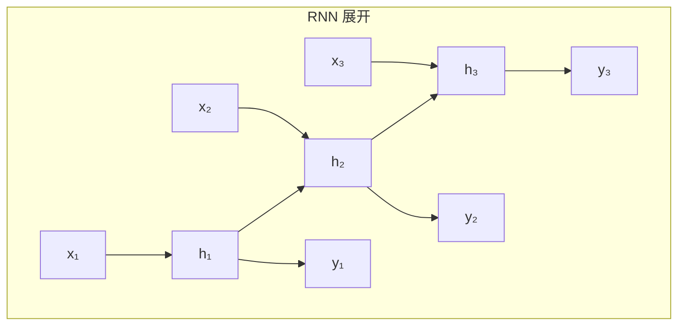
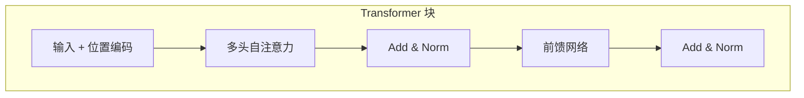
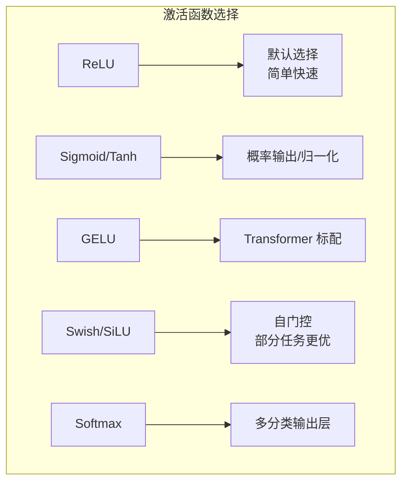
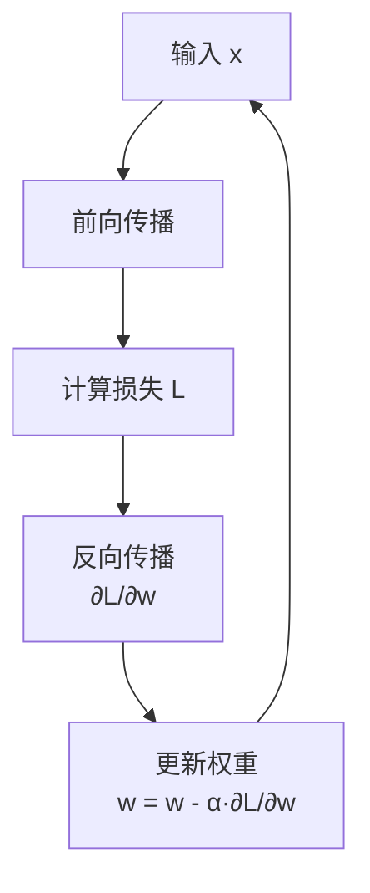
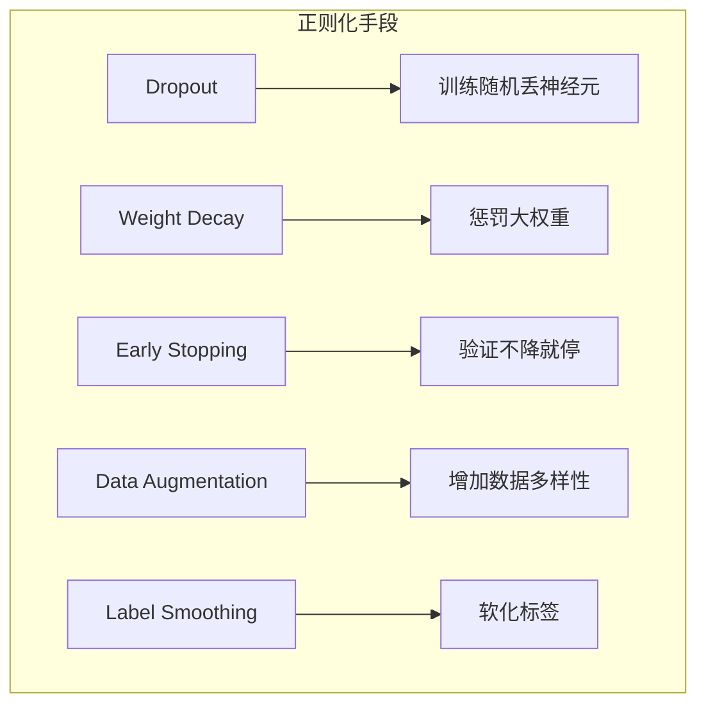
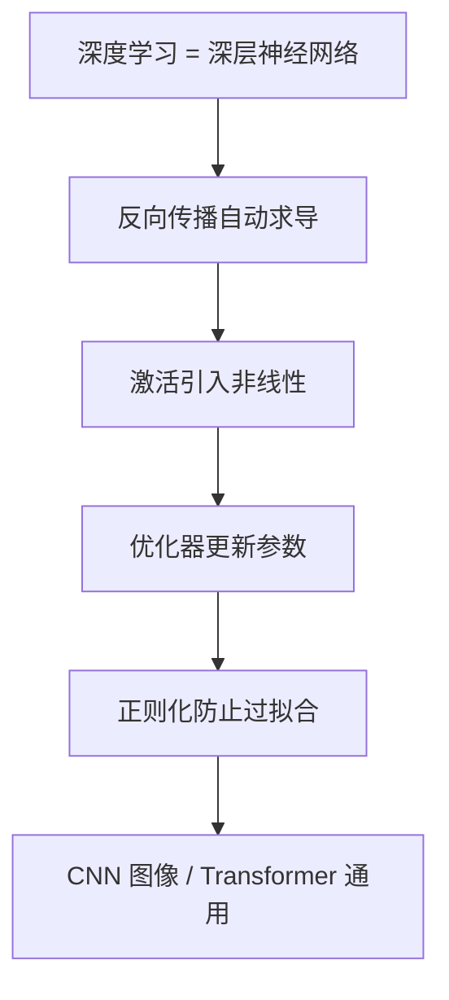

# 深度学习速成指南

> **一句话理解**: 深度学习就是用多层神经网络自动从数据中逐层提取特征，最终完成复杂任务——本质是大规模参数优化问题。

---

## TL;DR

- **神经网络**: 多层神经元堆叠，每层学习不同抽象级别的特征
- **反向传播**: 链式法则计算梯度，从输出层传回输入层更新权重
- **CNN**: 局部连接 + 权重共享，专精图像
- **RNN**: 序列建模，有记忆，但长序列会遗忘
- **Transformer**: 自注意力机制，并行计算，统治 NLP 和视觉
- **激活函数**: 引入非线性，让网络能拟合任意复杂函数
- **优化器**: Adam/AdamW 是默认选择，带动量加速收敛
- **正则化**: Dropout + Weight Decay + 早停，防止过拟合


---

## 神经网络基础

### 从感知机到深度网络

```mermaid
flowchart TB
    subgraph 感知机 Perceptron
        A1[x₁] --> N[神经元]
        A2[x₂] --> N
        A3[x₃] --> N
        N --> O[输出<br/>y = σ(Σwᵢxᵢ + b)]
    end
    
    subgraph 深度网络
        B1[输入层] --> B2[隐藏层1]
        B2 --> B3[隐藏层2]
        B3 --> B4[...]
        B4 --> B5[输出层]
    end
```

**单层感知机**只能解决线性可分问题。**多层网络**通过隐藏层学习非线性映射，理论上可以逼近任意连续函数（通用近似定理）。

| 网络深度 | 参数量 (示例) | 能学什么 | 代表模型 |
|----------|--------------|---------|---------|
| **浅层 (1-2 隐藏层)** | < 1M | 简单模式 | 早期 MLP |
| **深层 (5-20 层)** | 1M - 100M | 层次特征 | VGG、ResNet |
| **极深 (50-200+ 层)** | 100M - 10B | 复杂抽象 | GPT、LLaMA |

---

## 核心架构速览

### CNN（卷积神经网络）—— 图像之王


**核心思想**: 局部感受野 + 权重共享 + 平移不变性。

| 组件 | 作用 | 类比 |
|------|------|------|
| **卷积核 (Kernel)** | 滑动窗口提取局部特征 | 滤镜 |
| **特征图 (Feature Map)** | 卷积后的输出 | 过滤后的图像 |
| **池化 (Pooling)** | 下采样，保留主要特征 | 缩略图 |
| **通道 (Channel)** | 不同特征维度 | RGB 三色 |

```python
import torch.nn as nn

# 经典 CNN 块
conv_block = nn.Sequential(
    nn.Conv2d(in_channels=3, out_channels=64, kernel_size=3, padding=1),
    nn.BatchNorm2d(64),
    nn.ReLU(),
    nn.MaxPool2d(kernel_size=2)
)
# 输入 [B, 3, 224, 224] → 输出 [B, 64, 112, 112]
```

### RNN（循环神经网络）—— 序列记忆



**问题**: 长序列梯度消失/爆炸，远距离依赖难捕捉。

**解决方案**: LSTM（门控机制）和 GRU（简化版 LSTM）。

```python
# LSTM 示例
lstm = nn.LSTM(input_size=128, hidden_size=256, num_layers=2, batch_first=True)
output, (hidden, cell) = lstm(x)  # x: [batch, seq_len, 128]
```

### Transformer —— 统一架构



**自注意力核心**: 每个位置都能直接"看"到所有其他位置，计算它们之间的相关性权重。

$$\text{Attention}(Q, K, V) = \text{softmax}\left(\frac{QK^T}{\sqrt{d_k}}\right)V$$

| 架构 | 优势 | 劣势 | 最适合 |
|------|------|------|--------|
| **CNN** | 局部特征、参数共享、可并行 | 长距离依赖弱 | 图像 |
| **RNN** | 顺序处理、变长输入 | 串行慢、长序列差 | 短文本、语音 |
| **Transformer** | 全局注意力、完全并行 | 计算量大 O(n²) | NLP、视觉、一切 |

---

## 激活函数

没有非线性激活，多层网络退化为单层线性变换。



| 函数 | 公式 | 特点 | 使用场景 |
|------|------|------|---------|
| **ReLU** | $max(0, x)$ | 简单、计算快、缓解梯度消失 | 隐藏层默认 |
| **Leaky ReLU** | $max(\alpha x, x)$ | 解决 ReLU 神经元死亡 | 深层网络 |
| **Sigmoid** | $\frac{1}{1+e^{-x}}$ | 输出 0-1 | 二分类输出 |
| **Tanh** | $\frac{e^x - e^{-x}}{e^x + e^{-x}}$ | 输出 -1~1 | RNN 隐藏层 |
| **GELU** | $x \cdot \Phi(x)$ | 平滑、Transformer 效果佳 | BERT/GPT |
| **Softmax** | $\frac{e^{x_i}}{\sum e^{x_j}}$ | 概率分布 | 多分类输出 |

```python
import torch.nn as nn

# 常见组合
hidden = nn.ReLU()        # 隐藏层
output = nn.Softmax(dim=1)  # 多分类输出
# 或者直接用 CrossEntropyLoss（内部含 Softmax）
```

---

## 损失函数

| 损失函数 | 公式 | 适用任务 |
|----------|------|---------|
| **MSE** | $\frac{1}{n}\sum(y - ŷ)^2$ | 回归 |
| **交叉熵** | $-\sum y \log(ŷ)$ | 分类 |
| **二元交叉熵** | $-\sum[y\log(ŷ) + (1-y)\log(1-ŷ)]$ | 二分类 |
| **KL 散度** | $\sum p \log\frac{p}{q}$ | 分布匹配、VAE |
| **对比损失** | $max(0, margin - d_+ + d_-)$ | 对比学习 |

```python
# PyTorch 常用组合
criterion_reg = nn.MSELoss()          # 回归
criterion_cls = nn.CrossEntropyLoss()  # 分类（自带 Softmax）

loss = criterion_cls(logits, labels)  # logits 是未归一化的分数
```

---

## 优化器


| 优化器 | 核心思想 | 学习率 | 适用 |
|--------|---------|--------|------|
| **SGD** | 纯梯度下降 | 需仔细调 | 大规模、最终收敛好 |
| **Momentum** | 动量加速 | 需仔细调 | 逃离局部最小值 |
| **Adam** | 自适应学习率 | 默认 1e-3 | 通用、训练快 |
| **AdamW** | Adam + 解耦权重衰减 | 默认 1e-3 | **Transformer 默认** |
| **Lion** | 符号更新、省内存 | 通常小 10 倍 | 大模型训练 |

```python
import torch.optim as optim

# AdamW 是 Transformer 的标准配置
optimizer = optim.AdamW(
    model.parameters(),
    lr=1e-4,
    betas=(0.9, 0.999),
    weight_decay=0.01  # L2 正则
)
```

---

## 反向传播简化版



**三步走**:
1. **前向**: 输入逐层计算到输出，得到预测 ŷ
2. **算损失**: 比较 ŷ 和真实 y，得到损失值 L
3. **反向**: 用链式法则从 L 往回算每个参数的梯度 ∂L/∂w
4. **更新**: 用优化器根据梯度更新参数

```python
# PyTorch 训练循环 = 反向传播的标准实现
for epoch in range(num_epochs):
    for batch_x, batch_y in dataloader:
        # 1. 前向
        pred = model(batch_x)
        loss = criterion(pred, batch_y)
        
        # 2. 反向
        optimizer.zero_grad()   # 清除旧梯度
        loss.backward()          # 计算新梯度（反向传播！）
        
        # 3. 更新
        optimizer.step()         # 更新权重
```

---

## 正则化技术

防止模型记住训练数据，提升泛化能力。



| 技术 | 原理 | 实现 |
|------|------|------|
| **Dropout** | 训练时以概率 p 丢弃神经元 | `nn.Dropout(0.5)` |
| **Weight Decay** | L2 正则，惩罚大参数 | `optimizer(..., weight_decay=0.01)` |
| **BatchNorm** | 标准化层输入，稳定训练 | `nn.BatchNorm2d(channels)` |
| **LayerNorm** | 对单个样本标准化 | `nn.LayerNorm(dim)`，Transformer 标配 |
| **早停** | 验证 loss 不降停止 | `EarlyStopping(patience=5)` |

```python
# Dropout + BatchNorm + Weight Decay 组合
layer = nn.Sequential(
    nn.Linear(784, 256),
    nn.BatchNorm1d(256),
    nn.ReLU(),
    nn.Dropout(0.3),  # 30% 神经元随机丢弃
    nn.Linear(256, 10)
)

optimizer = optim.AdamW(model.parameters(), lr=1e-3, weight_decay=0.01)
```

---

## 主流框架对比

| 框架 | 优点 | 缺点 | 适合 |
|------|------|------|------|
| **PyTorch** | 动态图、直观、社区最大 | 生产部署稍弱 | 研究、原型、教学 |
| **TensorFlow** | 生产部署强、生态完整 | 学习曲线陡 | 工业部署、移动端 |
| **JAX** | 函数式、自动并行、快 | 生态较小 | 研究、大规模训练 |
| **Keras** | 极简 API | 灵活性受限 | 快速原型、入门 |

```python
# PyTorch 完整示例
import torch
import torch.nn as nn
import torch.optim as optim

class Net(nn.Module):
    def __init__(self):
        super().__init__()
        self.fc1 = nn.Linear(784, 128)
        self.fc2 = nn.Linear(128, 10)
    
    def forward(self, x):
        x = torch.relu(self.fc1(x))
        return self.fc2(x)

model = Net()
criterion = nn.CrossEntropyLoss()
optimizer = optim.Adam(model.parameters(), lr=0.001)
```

---

## 学习率调度

训练不同阶段需要不同步长。

| 策略 | 描述 | 使用场景 |
|------|------|---------|
| **Step Decay** | 每 N 轮降低学习率 | 通用 |
| **Cosine Annealing** | 余弦曲线下降 | 大模型训练 |
| **Warmup + Cosine** | 先升温再余弦降 | **Transformer 标配** |
| **ReduceLROnPlateau** | 验证不降就降 | 自适应 |
| **OneCycle** | 先升后降一个周期 | 快速收敛 |

```python
# Warmup + Cosine 调度 (Transformer 标准)
from torch.optim.lr_scheduler import CosineAnnealingLR

scheduler = CosineAnnealingLR(optimizer, T_max=100)

for epoch in range(num_epochs):
    train(...)
    scheduler.step()  # 每轮调整学习率
```

---

## 📚 核心要点



**30 分钟记住这些**:
1. 没有激活函数 = 多层变单层，必须用非线性
2. 反向传播 = 链式法则 + 自动微分
3. AdamW + Warmup + Cosine = Transformer 训练黄金组合
4. CNN 局部 + RNN 顺序 + Transformer 全局并行
5. Dropout + Weight Decay + 早停 = 正则化三板斧

---

## ❓ 常见问题 (FAQ)

**Q: 为什么需要深层网络？单层不够吗？**
> 通用近似定理说单层足够宽可以逼近任何函数，但深层网络可以用指数级更少的参数学习复杂特征层次（如边缘→纹理→部件→物体）。

**Q: BatchNorm 和 LayerNorm 的区别？**
> BatchNorm 对一个 batch 的同一通道归一化（CNN 常用）；LayerNorm 对单个样本的所有特征归一化（Transformer/RNN 常用），不依赖 batch 大小。

**Q: PyTorch 还是 TensorFlow？**
> 2026 年 PyTorch 是研究和教学的标准，生态最大。TensorFlow 在移动端/嵌入式部署仍有优势。JAX 在大规模研究中增长迅速。

**Q: 训练 loss 不下降怎么办？**
> 检查清单：学习率太大/太小？梯度是否消失（层太深）？数据归一化了吗？标签对吗？尝试降低学习率 10 倍，或换 AdamW 优化器。

**Q: 什么是梯度消失？**
> 深层网络中，反向传播的梯度逐层相乘，如果激活函数导数 < 1（如 Sigmoid），梯度会指数级衰减，前面层几乎不更新。ReLU 和残差连接是解决方案。

**Q: Transformer 为什么能取代 RNN？**
> 自注意力让任意两个位置直接交互（全局依赖），而且可以完全并行计算。RNN 必须串行，长序列遗忘。虽然 Transformer 计算量是 O(n²)，但硬件并行效率更高。

---

## 🔗 相关主题

- [AI 基础速成](../01_Fundamentals/Fundamentals-in-nutshell.md) —— 线性代数、微积分、概率基础
- [机器学习速成](../02_Machine_Learning/ML-in-nutshell.md) —— 传统 ML 方法
- [计算机视觉速成](../05_Computer_Vision/CV-in-nutshell.md) —— CNN 和视觉 Transformer
- [训练速成](../07_Model_Training/Model-Training-in-nutshell.md) —— 端到端训练实践
- [神经网络核心](./Neural_Network_Core/Neural_Network_Core.md) —— 更深入的理论讲解
- [优化详解](./Optimization/Optimization.md) —— 优化器与正则化深入

---

*Last updated: 2026-05-07*

## Related

- [[03_Deep_Learning/README]] — 03 深度学习基础 (Deep Learning Foundations) (共享: backpropagation, deep-learning, dl, neural-networks)
- [[03_Deep_Learning/World_Models/JEPA_Architecture_2026]] — JEPA 架构深度解析：LeCun 的世界模型之路 (共享: backpropagation, deep-learning, dl, neural-networks)
- [[03_Deep_Learning/World_Models/README]] — 世界模型 (World Models) (共享: backpropagation, deep-learning, dl, neural-networks)
- [[03_Deep_Learning/State_Space_Models_2026.md|State_Space_Models_2026]]
