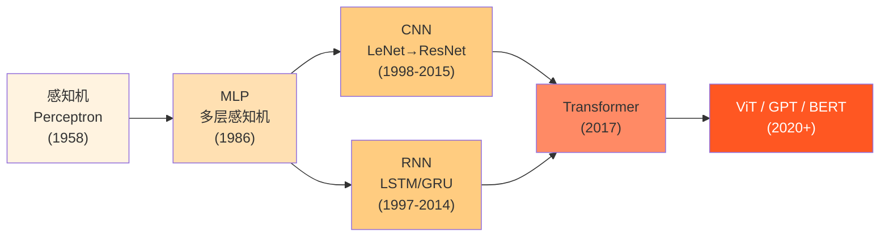
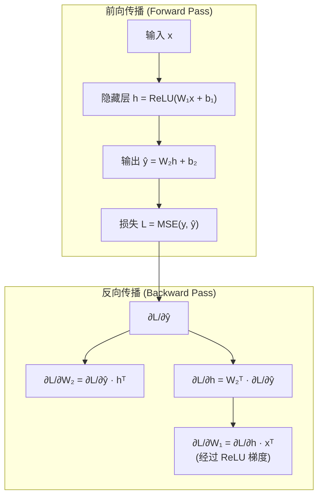
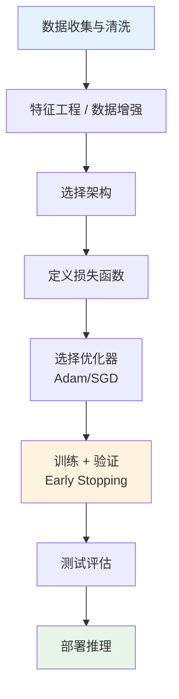

# 深度学习基础 (Deep Learning Fundamentals)

> **一句话理解**: 深度学习是多层神经网络的堆叠艺术——从感知机到 MLP、CNN、RNN 再到 Transformer，每一代架构都在逼近人脑的层次化特征提取能力，而反向传播 + 梯度下降是让这一切运转的引擎。

---

## TL;DR

- **感知机 (Perceptron)**: 最简神经元，只能解决线性可分问题
- **MLP (多层感知机)**: 隐藏层引入非线性，理论上可逼近任意连续函数（通用近似定理）
- **CNN (卷积神经网络)**: 局部连接 + 权重共享，图像特征提取王者
- **RNN (循环神经网络)**: 序列建模利器，LSTM/GRU 解决长程依赖
- **Transformer**: 自注意力机制取代循环，并行训练，统治 NLP 与视觉
- **反向传播 (Backpropagation)**: 链式法则从输出层传回梯度，驱动参数更新
- **激活函数**: ReLU 家族是默认选择，Sigmoid/Tanh 用于特殊场景

---

## 本章节索引

本章是深度学习领域的总入口，向下链接四个核心子模块：

| 子模块 | 核心内容 | 链接 |
|--------|---------|------|
| **神经网络核心** | 感知机、MLP、前向传播、反向传播 | [[深度学习/Neural_Network_Core/Neural_Network_Core]] |
| **优化方法** | SGD、Adam、学习率调度、正则化 | [[深度学习/Optimization/Optimization]] |
| **深度学习框架** | PyTorch、JAX、ONNX、训练工程 | [[深度学习/DL_Frameworks/DL_Frameworks]] |
| **世界模型** | JEPA、Sora 内部模型、预测编码 | [[深度学习/World_Models/README]] |

---

## 1. 架构演进：从感知机到 Transformer

### 1.1 里程碑时间线

| 年代 | 架构 | 核心创新 | 影响 |
|------|------|---------|------|
| 1958 | Perceptron | 单层线性神经元 | 神经网络概念的起点 |
| 1986 | MLP + Backprop | 隐藏层 + 反向传播算法 | 第一次 AI 复兴 |
| 1998 | LeNet-5 | 卷积 + 池化 + 全连接 | 手写数字识别，CNN 奠基 |
| 1997 | LSTM | 门控机制解决梯度消失 | 序列建模的长期标准 |
| 2012 | AlexNet | ReLU + Dropout + GPU | 深度学习复兴的引爆点 |
| 2015 | ResNet | 残差连接 (skip connection) | 可训练 152+ 层极深网络 |
| 2017 | Transformer | Self-Attention 替代 RNN | NLP/CV 统一架构 |
| 2020 | ViT | 图像 patch 化 + Transformer | 视觉进入注意力时代 |

---

## 2. 反向传播直觉 (Backpropagation Intuition)

反向传播的本质是**链式法则 (Chain Rule)** 的计算图遍历：

**直觉理解**：把神经网络想象成一条流水线，每个工人（层）加工零件后传给下一个。反向传播就是质检员从成品开始，逐层追溯"哪个环节出了问题、出了多少"，然后调整每个工人的手法。

**关键公式**：
- 链式法则：`∂L/∂W₁ = ∂L/∂ŷ · ∂ŷ/∂h · ∂h/∂W₁`
- 梯度下降更新：`W ← W - η · ∂L/∂W`（η 为学习率）

---

## 3. 激活函数 (Activation Functions)

激活函数为网络注入**非线性**——没有它，无论多少层都等价于一个线性变换。

| 函数 | 公式 | 范围 | 优点 | 缺点 | 使用场景 |
|------|------|------|------|------|---------|
| **Sigmoid** | σ(x) = 1/(1+e⁻ˣ) | (0, 1) | 输出可解释为概率 | 梯度消失、非零中心 | 二分类输出层 |
| **Tanh** | tanh(x) | (-1, 1) | 零中心 | 梯度消失 | RNN 隐藏层 |
| **ReLU** | max(0, x) | [0, ∞) | 计算快、缓解梯度消失 | Dead ReLU 问题 | 默认首选 |
| **Leaky ReLU** | max(αx, x), α=0.01 | (-∞, ∞) | 解决 Dead ReLU | 负区间梯度小 | 替代 ReLU |
| **GELU** | x · Φ(x) | (-∞, ∞) | 平滑、性能好 | 计算略贵 | Transformer / BERT |
| **Swish** | x · σ(x) | (-∞, ∞) | 自适应门控 | 计算开销 | EfficientNet |

**实践建议**：隐藏层默认用 ReLU 或 GELU；输出层按任务选择——分类用 Sigmoid/Softmax，回归用线性。

---

## 4. 核心架构对比

| 维度 | MLP | CNN | RNN/LSTM | Transformer |
|------|-----|-----|----------|-------------|
| **连接方式** | 全连接 | 局部连接 + 权重共享 | 时间步循环 | 全局自注意力 |
| **参数效率** | 低（参数多） | 高（卷积核共享） | 中等 | 中等 |
| **并行性** | 可并行 | 可并行 | 不可并行（时序依赖） | 高度可并行 |
| **长程依赖** | 无 | 有限（感受野） | 差（梯度消失/爆炸） | 优秀 |
| **适用数据** | 表格/向量 | 图像/网格数据 | 序列/时序 | 序列/图像/多模态 |
| **代表模型** | 早期分类器 | ResNet, EfficientNet | Seq2Seq, BiLSTM | GPT, BERT, ViT |

---

## 5. 深度学习工作流

---

## 延伸阅读 (Further Reading)

- [[深度学习/DL-in-nutshell]] — 深度学习速成指南，30 秒掌握全貌
- [[深度学习/Neural_Network_Core/Neural_Network_Core]] — 神经网络核心原理详解
- [[深度学习/Optimization/Optimization]] — 优化算法与训练技巧
- [[深度学习/DL_Frameworks/DL_Frameworks]] — PyTorch / JAX 框架实战
- [[深度学习/World_Models/README]] — 世界模型与预测编码前沿
- [[深度学习/State_Space_Models_2026]] — Mamba 与 Transformer 后继者

## 进阶知识拓展

| 主题 | 深度内容 | 应用场景 | 参考资源 |
|------|----------|----------|----------|
| 核心原理 | 底层机制和数学推导 | 深度理解+优化 | 经典教材+论文 |
| 工程实践 | 生产级实现细节 | 项目落地 | 开源项目+案例 |
| 性能优化 | 瓶颈分析+调优策略 | 提升效率 | 性能分析工具 |
| 安全合规 | 安全威胁+防护措施 | 风险管控 | 安全框架+标准 |
| 前沿研究 | 最新进展+未来方向 | 技术预判 | 顶会论文+博客 |

## 实践指南

| 步骤 | 行动 | 工具/方法 | 预期产出 |
|------|------|-----------|----------|
| 1. 学习 | 系统学习核心知识 | 教材/课程/文档 | 知识体系建立 |
| 2. 练习 | 动手实践加深理解 | 实验/项目/练习 | 技能熟练 |
| 3. 应用 | 在实际项目中应用 | 工作项目/开源 | 经验积累 |
| 4. 优化 | 持续改进和优化 | 性能分析/重构 | 质量提升 |
| 5. 分享 | 输出和分享知识 | 博客/演讲/教学 | 影响力建设 |

## 常见误区

| 误区 | 正确认知 | 建议 |
|------|----------|------|
| 只学理论不实践 | 实践是检验理解的唯一标准 | 每学一个概念就动手验证 |
| 追求完美再开始 | 完成比完美更重要 | 先做MVP再迭代 |
| 忽视基础知识 | 基础决定上限 | 定期回顾基础 |
| 盲目追新 | 新技术需要验证 | 评估后再采用 |
| 单打独斗 | 协作效率更高 | 积极参与社区 |

## 知识图谱关联

| 关联主题 | 关系类型 | 参考路径 |
|----------|----------|----------|
| 基础理论 | 前置依赖 | 相关基础目录 |
| 工具实践 | 实现支撑 | 工具/编程相关 |
| 应用场景 | 价值体现 | 行业应用/ |
| 前沿研究 | 发展方向 | 论文精读/ |
| 工程方法 | 质量保障 | 测试/运维/ |

## 版本更新记录

| 版本 | 日期 | 变更 |
|------|------|------|
| v1.0 | 2025-01 | 初始创建 |
| v1.1 | 2025-06 | 内容补充 |
| v2.0 | 2026-01 | 全面扩写 |
| v2.1 | 2026-07 | 质量强化+结构化增强 |

## 快速自检

- [ ] 核心概念能向他人清晰解释
- [ ] 已完成至少一个实践项目
- [ ] 了解主流方案优劣势和适用场景
- [ ] 掌握常见问题排查方法
- [ ] 关注最新技术动态
- [ ] 知识已文档化沉淀
