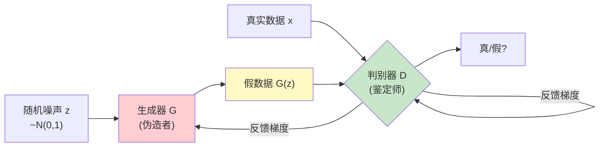
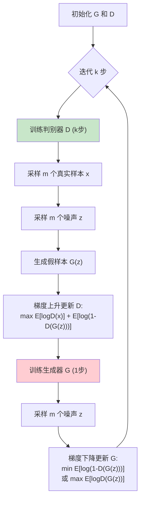
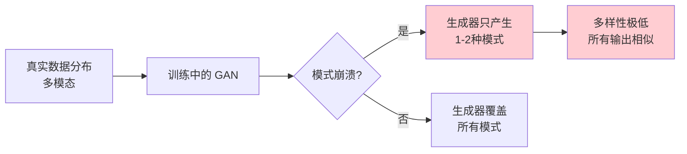
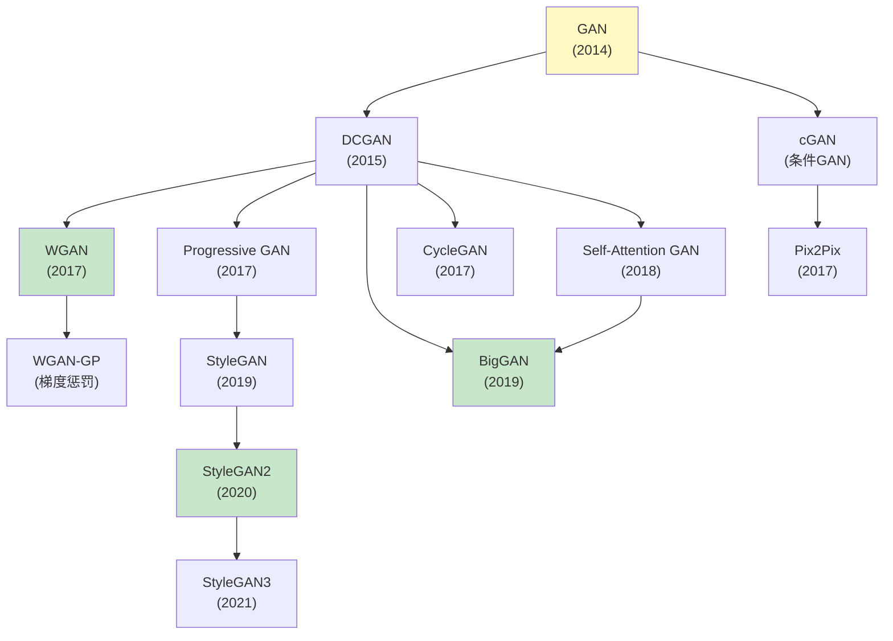
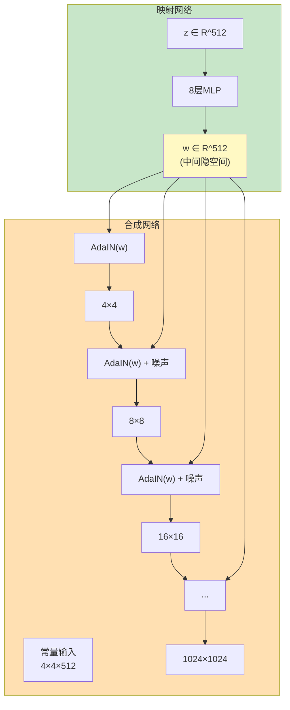

# GAN深度解析 (GAN Deep Dive)

> **一句话理解**: GAN就像伪造者与鉴定师的无休止对决——伪造者(生成器)不断学习造更逼真的假货，鉴定师(判别器)不断学习识别假货，两者在博弈中共同进化，最终伪造者能造出以假乱真的作品。

---

## 目录

- [论文信息](#论文信息)
- [1. GAN核心思想](#1-gan核心思想)
- [2. 数学基础](#2-数学基础)
- [3. 训练流程](#3-训练流程)
- [4. 训练挑战](#4-训练挑战)
- [5. GAN变体演进](#5-gan变体演进)
- [6. DCGAN](#6-dcgan)
- [7. StyleGAN系列](#7-stylegan系列)
- [8. BigGAN](#8-biggan)
- [9. 训练技巧汇总](#9-训练技巧汇总)
- [10. 评估指标](#10-评估指标)
- [11. 代码实现](#11-代码实现)
- [12. 对比表格](#12-对比表格)
- [Related](#related)

---

## 论文信息

| 属性 | 内容 |
|------|------|
| **论文** | Generative Adversarial Nets |
| **作者** | Ian Goodfellow et al. |
| **机构** | University of Montreal |
| **发表** | NeurIPS 2014 |
| **影响** | 开创生成模型新范式，催生DeepFake、AI绘画 |

---

## 1. GAN核心思想

### 生成器 vs 判别器博弈



### 直觉理解

```
GAN 的博弈类比:

┌──────────────┬───────────────────────────────────┐
│  生成器 (G)   │  伪造者                            │
│              │  目标: 造出判别器分不出真假的假货    │
│              │  max log D(G(z))                   │
├──────────────┼───────────────────────────────────┤
│  判别器 (D)   │  鉴定师                            │
│              │  目标: 正确分辨真假                  │
│              │  max log D(x) + log(1-D(G(z)))    │
├──────────────┼───────────────────────────────────┤
│  博弈结果     │  纳什均衡: G(z) ~ p_data           │
│              │  判别器无法分辨: D=0.5              │
└──────────────┴───────────────────────────────────┘
```

### GAN与其他生成模型的区别

| 生成模型 | 训练方式 | 显式密度 | 采样速度 | 样本质量 |
|----------|----------|----------|----------|----------|
| **GAN** | 对抗博弈 | ❌ 隐式 | 🟢 快(单次前向) | 🟢 高 |
| **VAE** | 变分推断 | ✅ 下界 | 🟢 快 | 🟡 模糊 |
| **扩散模型** | 去噪 | ✅ | 🔴 慢(多步) | 🟢 极高 |
| **自回归** | 逐token预测 | ✅ 精确 | 🟡 中(自回归) | 🟢 高 |
| **归一化流** | 可逆变换 | ✅ 精确 | 🟢 快 | 🟡 中 |

---

## 2. 数学基础

### 原始GAN目标函数

```
GAN 的极小极大博弈目标:

min_G max_D V(D, G) = E_{x~p_data}[log D(x)] + E_{z~p_z}[log(1 - D(G(z)))]

解读:
- 判别器 D 最大化: 正确分类真实样本 (log D(x))
                   和生成样本 (log(1-D(G(z))))
- 生成器 G 最小化: 判别器正确识别假样本的概率 (log(1-D(G(z))))

等价地，生成器最大化: log D(G(z))  (非饱和形式，实践中更常用)
```

### 最优判别器

对于固定的生成器 G，最优判别器为：

```
D*_G(x) = p_data(x) / (p_data(x) + p_g(x))

直觉: 当生成数据分布 p_g 接近真实分布 p_data 时，
      判别器输出趋近于 0.5 (无法分辨)
```

### 最优生成器

```
将 D* 代入价值函数:

V(G*, D*) = E_{x~p_data}[log(p_data / (p_data + p_g))]
          + E_{z~p_z}[log(p_g / (p_data + p_g))]

可以证明 (Goodfellow 2014):

V(G, D*_G) = -log(4) + 2 · JS_divergence(p_data || p_g)

其中 JS 是 Jensen-Shannon 散度:

  JS(p || q) = ½ KL(p || m) + ½ KL(q || m),  m = (p+q)/2

结论:
  当且仅当 p_g = p_data 时，V 达到最小值 -log(4)
  → JS散度 = 0
  → 生成器完美还原数据分布
```

### JS散度的问题与模式崩溃

```
当 p_data 和 p_g 的支撑集不重叠时:
  JS(p_data || p_g) = log(2)  (常数)
  → 梯度为 0!
  → 生成器无法学习

这就是为什么 GAN 训练不稳定:
  如果生成器"走错路"，判别器可以完美区分
  → 梯度消失 → 训练停滞

解决方案:
  WGAN: 用 Wasserstein 距离替代 JS 散度
  Wasserstein 距离在分布不重叠时仍有意义
```

### Wasserstein距离

```
Wasserstein 距离 (推土机距离 Earth Mover's Distance):

  W(p_data, p_g) = inf E_{γ~Π(p_data,p_g)} [||x - y||]

  其中 Π(p_data, p_g) 是所有联合分布的集合，
  其边缘分布分别为 p_data 和 p_g

直觉: 把分布 p_data "搬运"成 p_g 所需的最小"搬运量"

WGAN 目标:
  min_G max_{||f||_L ≤ 1} E[f(x)] - E[f(G(z))]

  其中 f 是满足 Lipschitz 约束的函数 (通过梯度惩罚或权重裁剪实现)

优势:
  → 即使分布不重叠，W距离仍连续可导
  → 提供有意义的梯度
  → 训练更稳定
```

---

## 3. 训练流程

### 交替训练算法



### 训练动态分析

```
GAN 训练中的三种状态:

1. D 太强 (D >> G):
   → D 完美区分真假
   → 梯度消失 → G 无法学习
   → 解决: 减少 D 训练步数

2. G 太强 (G >> D):
   → G 找到 D 的弱点
   → G 只生成能骗过 D 的少数模式 (模式崩溃)
   → 解决: 正则化、模式惩罚

3. 均衡 (D ≈ G):
   → 两者共同进步
   → 这是理想状态
   → 但很难维持
```

---

## 4. 训练挑战

### 模式崩溃 (Mode Collapse)



```
模式崩溃详解:

真实分布:  p_data 有多个模式 (如不同类型的脸)

模式崩溃:
  → G 只学会生成"最容易骗过 D"的模式
  → 所有 z 都映射到相似的输出
  → 例: 只生成一种脸型

原因:
  1. G 发现某个模式 D 总是打高分
  2. G 过度利用这个模式
  3. D 学会拒绝这个模式
  4. G 跳到下一个模式
  5. 循环往复 (mode hopping)

解决方案:
  → Minibatch discrimination: D 比较一批样本的多样性
  → Unrolled GAN: G 考虑 D 未来的更新
  → Feature matching: G 匹配中间特征而非输出
  → Wasserstein 距离: 提供更平滑的梯度
  → BigGAN: 大batch + 截断技巧
```

### 梯度消失

```
当 D 太强时:
  D(G(z)) → 0
  log(1 - D(G(z))) → log(1) = 0
  梯度 ∂/∂θ log(1 - D(G(z))) → 0
  → G 无法学习

非饱和损失 (Goodfellow的解决方案):
  不用 log(1 - D(G(z)))
  改用 -log D(G(z))
  → 当 D(G(z)) → 0 时，-log D(G(z)) → ∞
  → 梯度仍然存在
```

### 训练不稳定的可视化

```
GAN 损失曲线 (典型不稳定):

D loss:  ████████░░░░████████░░░░██████  (剧烈波动)
G loss:  ░░░░████████░░░░░░████████░░░░  (与D反相)

vs VAE 的平滑收敛:
VAE loss: ████████████████░░░░░░░░░░░░░  (单调下降)

→ GAN 没有明确的"收敛"信号
→ 需要人工监控生成质量
```

---

## 5. GAN变体演进



### 主要变体对比

| 变体 | 年份 | 核心创新 | 解决的问题 |
|------|------|----------|-----------|
| **GAN** | 2014 | 对抗训练 | 生成模型新范式 |
| **DCGAN** | 2015 | 卷积架构 | 图像生成 |
| **cGAN** | 2014 | 条件输入 | 可控生成 |
| **WGAN** | 2017 | Wasserstein距离 | 训练稳定 |
| **WGAN-GP** | 2017 | 梯度惩罚替代裁剪 | Lipschitz约束 |
| **Pix2Pix** | 2017 | 图像翻译 | 配对转换 |
| **CycleGAN** | 2017 | 循环一致性 | 非配对转换 |
| **Progressive GAN** | 2017 | 渐进式训练 | 高分辨率 |
| **SAGAN** | 2018 | 自注意力 | 全局依赖 |
| **BigGAN** | 2019 | 大规模+截断 | ImageNet SOTA |
| **StyleGAN** | 2019 | AdaIN风格注入 | 可控人脸生成 |
| **StyleGAN2** | 2020 | 修复伪影 | 更高质量 |
| **StyleGAN3** | 2021 | 解决纹理粘着 | 更自然的变换 |

---

## 6. DCGAN

**DCGAN (Deep Convolutional GAN)** 是首个成功将卷积神经网络应用于GAN的工作，成为后续GAN架构的基准。

### 架构设计原则

```
DCGAN 设计准则:

生成器 (G):
  → 使用转置卷积 (ConvTranspose2d) 上采样
  → 每层: ConvTranspose → BatchNorm → ReLU
  → 最后一层用 Tanh (输出范围[-1,1])
  → 从 100维噪声 → 64x64x3 图像

判别器 (D):
  → 使用步长卷积 (Conv2d stride=2) 下采样替代池化
  → 每层: Conv → BatchNorm → LeakyReLU(0.2)
  → 最后一层用 Sigmoid (输出概率)
  → 从 64x64x3 → 1维概率

关键: 全部用卷积，不用全连接层 (除了首尾)
```

### DCGAN生成器结构

```
输入: z ∈ R^100 (随机噪声)

Reshape → 100 → 4×4×1024

ConvTranspose2d(1024, 512, 4, 2, 1) → 8×8×512
    BatchNorm + ReLU

ConvTranspose2d(512, 256, 4, 2, 1) → 16×16×256
    BatchNorm + ReLU

ConvTranspose2d(256, 128, 4, 2, 1) → 32×32×128
    BatchNorm + ReLU

ConvTranspose2d(128, 3, 4, 2, 1) → 64×64×3
    Tanh

输出: 64×64×3 图像
```

---

## 7. StyleGAN系列

**StyleGAN** 是NVIDIA提出的高质量人脸生成GAN，引入了**风格注入**和**渐进式分辨率**，能生成1024×1024的逼真人脸。

### StyleGAN核心创新



### 关键技术创新

#### 1. W空间 (中间隐空间)

```
传统 GAN: z → G → image
StyleGAN: z → Mapping(z)=w → Synthesis(w) → image

W空间的优势:
  → 线性更好: w空间中的线性插值更自然
  → 解耦更好: 不同维度的w控制不同层次的特征
  → 纠缠更少: 减少了特征的耦合
```

#### 2. AdaIN (Adaptive Instance Normalization)

```
AdaIN 风格注入:

  AdaIN(x_i, y) = σ(y) · (x_i - μ(x_i)) / σ(x_i) + μ(y)

其中:
  x_i = 归一化前的特征图
  y = 从 w 学习的风格参数 (缩放和偏移)
  μ, σ = 通道级别的均值和标准差

每一层用不同的 w (风格) 进行 AdaIN:
  → 粗糙分辨率(4×4): 控制姿势、脸型
  → 中等分辨率: 控制发型、表情
  → 细节分辨率: 控制颜色、微表情
```

#### 3. 随机噪声注入

```
每层添加单通道噪声:
  → B × 1 × H × W 的随机噪声
  → 通过逐通道缩放加入特征图
  → 生成头发丝、雀斑、皮肤纹理等随机细节

关键洞察:
  → 随机变化(噪声)与确定性变化(风格)分离
  → 噪声控制"微观随机性"
  → 风格控制"宏观确定性"
```

### StyleGAN2改进

```
StyleGAN2 解决的问题:
1. AdaIN造成的水滴伪影 (blob artifacts)
2. 眼睛/嘴巴位置不一致

解决方案:
1. 权重调制+解调 (替代AdaIN):
   w → 缩放 → 卷积 → 解调 → 下一层
   → 消除水滴伪影

2. 路径长度正则化:
   E[(||J_w^T y||₂ - 1)²] → 0
   其中 J_w 是输出对w的雅可比矩阵
   → 鼓励w空间的平滑映射
   → 提高眼睛/嘴巴一致性

3. 延迟正则化:
   → 不每步计算正则化，每16步一次
   → 减少计算开销
```

### StyleGAN3改进

```
StyleGAN3 解决的问题:
  → 纹理粘着 (texture sticking)
  → 当旋转/缩放图像时，纹理像"贴纸"一样粘住

核心洞察:
  → 问题在于网络混淆了相位和幅度信息

解决方案:
1. 别名网络(AliasNetwork):
   → 在上采样后进行低通滤波
   → 消除混叠(aliasing)
   
2. 傅里叶特征:
   → 在频域处理
   → 实现真正的平移/旋转不变性

结果:
  → 图像可以自然地旋转、缩放
  → 纹理不再"粘着"
```

---

## 8. BigGAN

**BigGAN** 是2019年DeepMind提出的大规模GAN，在ImageNet上达到了前所未有的生成质量(FID 6.95)，证明了GAN的scaling law。

### BigGAN核心创新

```
BigGAN = 大模型 + 大batch + 截断技巧 + 自注意力

1. 大规模:
   → 生成器参数量: ~50M → ~70M
   → Batch size: 256 → 2048
   → 通道数: 基础的4-8倍

2. 截断技巧 (Truncation Trick):
   → 训练用 z ~ N(0,1) 或 z ~ U(-1,1)
   → 推理用 z ~ truncated(0, σ), σ < 1
   → σ越小: 质量越高，多样性越低
   → σ越大: 质量越低，多样性越高
   → 提供 质量/多样性 的可调旋钮

3. 自注意力 (Self-Attention):
   → 借鉴SAGAN
   → 中间层加入自注意力模块
   → 捕捉长距离依赖

4. 正则化:
   → 谱归一化 (Spectral Normalization)
   → 跳跃连接的谱归一化
```

### BigGAN的Scaling发现

```
BigGAN 的关键发现 (GAN Scaling Law):

1. 模型越大，效果越好 (与LLM类似)
   → 但容易模式崩溃

2. 训练不稳定 vs 质量的权衡:
   → 大模型在"快要崩溃"时质量最好
   → 需要精确控制训练步数

3. 类别条件信息注入:
   → 使用层级化的类别嵌入
   → 通过 cBN (conditional BatchNorm) 注入每层

4. 截断参数调节:
   → FID vs IS 的权衡
   → 可以根据需求调节
```

---

## 9. 训练技巧汇总

### 稳定GAN训练的实用技巧

| 技巧 | 描述 | 适用场景 |
|------|------|----------|
| **特征匹配** | G匹配D中间特征的统计量 | 减少模式崩溃 |
| **Minibatch判别** | D同时看一批样本的多样性 | 防模式崩溃 |
| **单边标签平滑** | 真实标签用0.9而非1.0 | 防止D过自信 |
| **谱归一化** | 对D的所有层做谱归一化 | 稳定Lipschitz |
| **历史平均** | 参数向历史平均收敛 | 稳定训练 |
| **虚拟批归一化** | 用参考批而非当前批计算统计 | 减少batch依赖 |
| **TTUR** | G和D用不同学习率 | 理论保证收敛 |
| **经验之谈** | D比G略强但不碾压 | 经验调参 |
| **渐进增长** | 从低分辨率逐步增长 | 高分辨率生成 |
| **EMA** | 维护权重的指数移动平均 | 提升稳定性 |

### Two Time-Scale Update (TTUR)

```
TTUR (Two Time-Scale Update Rule):

传统: G和D交替更新，学习率相同
TTUR: G和D用不同的学习率

  D学习率: α_D (较大)
  G学习率: α_G (较小)

  满足 α_D/α_G → ∞

理论保证:
  → 在较温和条件下，TTUR保证随机博弈收敛
  → 不需要交替训练 (可以同时更新)

实践:
  D lr: 0.0004
  G lr: 0.0001
```

---

## 10. 评估指标

### GAN评估的挑战

```
GAN评估的困难:
  → 没有显式似然 (不能直接算log-likelihood)
  → 需要评估"生成质量" (主观)
  → 需要评估"多样性" (覆盖模式)
  → 理想: 两者都好
```

### 主要评估指标

| 指标 | 公式 | 评估维度 | 优点 | 缺点 |
|------|------|----------|------|------|
| **IS (Inception Score)** | exp(KL(p(y\|x) \|\| p(y))) | 质量+多样性 | 简单 | 依赖Inception模型 |
| **FID (Fréchet Inception Distance)** | \|\|μ_r-μ_g\|\|² + Tr(Σ_r+Σ_g-2(Σ_rΣ_g)^½) | 质量+多样性 | 最常用 | 依赖Inception |
| **KID** | MMD² 核距离 | 质量 | 无偏估计 | 计算更慢 |
| **Precision & Recall** | 流形匹配 | 质量(P)+多样性(R) | 分别评估 | 需要大样本 |
| **LPIPS** | 深度特征距离 | 感知质量 | 人感一致 | 需要参考图像 |
| **SVD** | 单一图像多样性 | 多样性 | 无需数据集 | 只看多样性 |

### FID详解

```
FID (Fréchet Inception Distance):

计算步骤:
1. 用 Inception-V3 提取真实图像和生成图像的深度特征
2. 分别计算两组特征的均值(μ)和协方差(Σ)
3. 计算两个高斯分布的 Fréchet 距离:

   FID = ||μ_r - μ_g||² + Tr(Σ_r + Σ_g - 2(Σ_r·Σ_g)^{1/2})

性质:
  → FID 越低越好
  → 完美生成器: FID = 0
  → 同时考虑质量和多样性
  → 但只评估 Inception 特征空间

参考值:
  → 真实数据之间的 FID ≈ 0-5 (取决于数据集)
  → 好的 GAN: FID 5-20
  → 差的 GAN: FID > 50
```

---

## 11. 代码实现

### 完整DCGAN实现

```python
import torch
import torch.nn as nn
import torch.optim as optim
from torchvision import transforms, datasets

# ======== 生成器 ========
class Generator(nn.Module):
    def __init__(self, latent_dim=100, img_channels=3, base_features=64):
        super().__init__()
        self.net = nn.Sequential(
            # 输入: latent_dim x 1 x 1
            nn.ConvTranspose2d(latent_dim, base_features * 8,
                               4, 1, 0, bias=False),
            nn.BatchNorm2d(base_features * 8),
            nn.ReLU(True),
            # 512 x 4 x 4

            nn.ConvTranspose2d(base_features * 8, base_features * 4,
                               4, 2, 1, bias=False),
            nn.BatchNorm2d(base_features * 4),
            nn.ReLU(True),
            # 256 x 8 x 8

            nn.ConvTranspose2d(base_features * 4, base_features * 2,
                               4, 2, 1, bias=False),
            nn.BatchNorm2d(base_features * 2),
            nn.ReLU(True),
            # 128 x 16 x 16

            nn.ConvTranspose2d(base_features * 2, base_features,
                               4, 2, 1, bias=False),
            nn.BatchNorm2d(base_features),
            nn.ReLU(True),
            # 64 x 32 x 32

            nn.ConvTranspose2d(base_features, img_channels,
                               4, 2, 1, bias=False),
            nn.Tanh()
            # 3 x 64 x 64
        )

    def forward(self, z):
        z = z.view(z.size(0), -1, 1, 1)
        return self.net(z)


# ======== 判别器 ========
class Discriminator(nn.Module):
    def __init__(self, img_channels=3, base_features=64):
        super().__init__()
        self.net = nn.Sequential(
            # 3 x 64 x 64
            nn.Conv2d(img_channels, base_features, 4, 2, 1, bias=False),
            nn.LeakyReLU(0.2, inplace=True),
            # 64 x 32 x 32

            nn.Conv2d(base_features, base_features * 2, 4, 2, 1, bias=False),
            nn.BatchNorm2d(base_features * 2),
            nn.LeakyReLU(0.2, inplace=True),
            # 128 x 16 x 16

            nn.Conv2d(base_features * 2, base_features * 4, 4, 2, 1, bias=False),
            nn.BatchNorm2d(base_features * 4),
            nn.LeakyReLU(0.2, inplace=True),
            # 256 x 8 x 8

            nn.Conv2d(base_features * 4, base_features * 8, 4, 2, 1, bias=False),
            nn.BatchNorm2d(base_features * 8),
            nn.LeakyReLU(0.2, inplace=True),
            # 512 x 4 x 4

            nn.Conv2d(base_features * 8, 1, 4, 1, 0, bias=False),
            nn.Sigmoid()
        )

    def forward(self, img):
        return self.net(img).view(-1, 1).squeeze(1)


# ======== 训练循环 ========
def train_gan(dataloader, num_epochs=200, latent_dim=100,
              lr=0.0002, beta1=0.5, device='cuda'):
    G = Generator(latent_dim).to(device)
    D = Discriminator().to(device)

    # 优化器 (使用Adam, beta1=0.5是GAN专用配置)
    optimizerG = optim.Adam(G.parameters(), lr=lr, betas=(beta1, 0.999))
    optimizerD = optim.Adam(D.parameters(), lr=lr, betas=(beta1, 0.999))

    criterion = nn.BCELoss()

    # 标签
    real_label = 0.9  # 单边标签平滑
    fake_label = 0.0

    for epoch in range(num_epochs):
        for i, (real_imgs, _) in enumerate(dataloader):
            batch_size = real_imgs.size(0)
            real_imgs = real_imgs.to(device)

            # ============ 训练判别器 ============
            optimizerD.zero_grad()

            # 真实样本
            label = torch.full((batch_size,), real_label, device=device)
            output = D(real_imgs)
            lossD_real = criterion(output, label)
            lossD_real.backward()

            # 生成样本
            noise = torch.randn(batch_size, latent_dim, 1, 1, device=device)
            fake_imgs = G(noise)
            label.fill_(fake_label)
            output = D(fake_imgs.detach())
            lossD_fake = criterion(output, label)
            lossD_fake.backward()

            optimizerD.step()

            # ============ 训练生成器 ============
            optimizerG.zero_grad()
            label.fill_(real_label)  # G希望D认为是真的
            output = D(fake_imgs)
            lossG = criterion(output, label)
            lossG.backward()
            optimizerG.step()

        if epoch % 10 == 0:
            print(f"[{epoch}/{num_epochs}] "
                  f"Loss_D: {(lossD_real+lossD_fake).item():.4f} "
                  f"Loss_G: {lossG.item():.4f}")

    return G, D
```

### WGAN-GP实现

```python
import torch
import torch.autograd as autograd

def gradient_penalty(critic, real_data, fake_data, device):
    """WGAN-GP 梯度惩罚"""
    batch_size = real_data.size(0)
    alpha = torch.rand(batch_size, 1, 1, 1, device=device)
    alpha = alpha.expand_as(real_data)

    interpolated = alpha * real_data + (1 - alpha) * fake_data
    interpolated.requires_grad_(True)

    critic_interpolated = critic(interpolated)

    gradients = autograd.grad(
        outputs=critic_interpolated,
        inputs=interpolated,
        grad_outputs=torch.ones_like(critic_interpolated),
        create_graph=True,
        retain_graph=True,
    )[0]

    gradients = gradients.view(batch_size, -1)
    gradient_norm = gradients.norm(2, dim=1)
    penalty = ((gradient_norm - 1) ** 2).mean()
    return penalty


def train_wgan_gp_step(critic, generator, real_data,
                       optimizerC, optimizerG,
                       lambda_gp=10, n_critic=5, device='cuda'):
    """WGAN-GP 单步训练"""
    batch_size = real_data.size(0)

    # ======== 训练 Critic (n_critic 步) ========
    for _ in range(n_critic):
        optimizerC.zero_grad()

        noise = torch.randn(batch_size, 100, 1, 1, device=device)
        fake_data = generator(noise)

        # Wasserstein 损失
        lossC = -(critic(real_data).mean() - critic(fake_data).mean())

        # 梯度惩罚
        gp = gradient_penalty(critic, real_data, fake_data, device)
        lossC += lambda_gp * gp

        lossC.backward()
        optimizerC.step()

    # ======== 训练 Generator ========
    optimizerG.zero_grad()
    noise = torch.randn(batch_size, 100, 1, 1, device=device)
    fake_data = generator(noise)
    lossG = -critic(fake_data).mean()
    lossG.backward()
    optimizerG.step()

    return lossC.item(), lossG.item()
```

---

## 12. 对比表格

### GAN vs VAE vs Diffusion 综合对比

| 维度 | GAN | VAE | 扩散模型 |
|------|-----|-----|----------|
| **训练方式** | 对抗博弈 | 变分推断 | 去噪 |
| **密度估计** | 隐式 | ELBO下界 | 精确 |
| **采样速度** | 🟢 快(1步) | 🟢 快(1步) | 🔴 慢(多步) |
| **样本质量** | 🟢 高(锐利) | 🟡 中(模糊) | 🟢 极高 |
| **多样性** | 🟡 易崩溃 | 🟢 好 | 🟢 极好 |
| **训练稳定性** | 🔴 难 | 🟢 稳定 | 🟢 稳定 |
| **似然计算** | ❌ | ✅ | ✅ |
| **可解释性** | 🟡 中 | 🟡 中 | 🟢 好 |
| **主流应用** | 人脸/艺术 | 数据增强 | Stable Diffusion |

### StyleGAN版本对比

| 版本 | 年份 | 分辨率 | FID↓ | 核心改进 |
|------|------|--------|------|----------|
| **Progressive GAN** | 2017 | 1024 | 10.6 | 渐进式增长 |
| **StyleGAN** | 2019 | 1024 | 4.4 | W空间+AdaIN |
| **StyleGAN2** | 2020 | 1024 | 3.3 | 去伪影+路径正则 |
| **StyleGAN3** | 2021 | 1024 | 3.0 | 别名/纹理修正 |

> FID在FFHQ数据集上 ^[inferred]。

### 何时使用GAN

| 场景 | 推荐GAN | 理由 |
|------|---------|------|
| 实时图像生成 | DCGAN/StyleGAN | 采样速度快 |
| 高质量人脸 | StyleGAN2/3 | 质量最高 |
| ImageNet类条件 | BigGAN | 类条件质量最好 |
| 图像翻译 | CycleGAN/Pix2Pix | 专用架构 |
| 数据增强 | WGAN-GP | 多样性好 |
| 超高质量生成 | ❌ 用扩散模型 | 扩散质量更高 |

---

## Related

- [[深度学习/Generative_Models/VAE_Deep_Dive]] — VAE深度解析（生成模型对比）
- [[深度学习/Generative_Models/Diffusion_Models_Deep_Dive]] — 扩散模型深度解析（当前SOTA生成模型）
- [[深度学习/DL_Fundamentals/DL_Fundamentals]] — 深度学习基础
- [[深度学习/Neural_Network_Core/Neural_Network_Core]] — 神经网络核心
- [[深度学习/Optimization/Optimization]] — 优化方法
- [[深度学习/Self_Supervised_Learning/Self_Supervised_Learning]] — 自监督学习
- [[概念/Safety/model-watermark]] — 模型水印（GAN生成内容检测）
