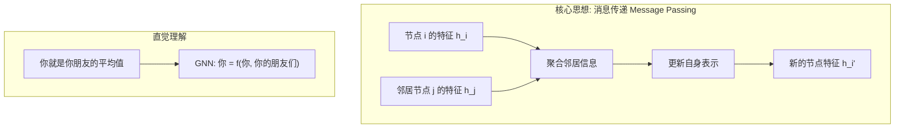
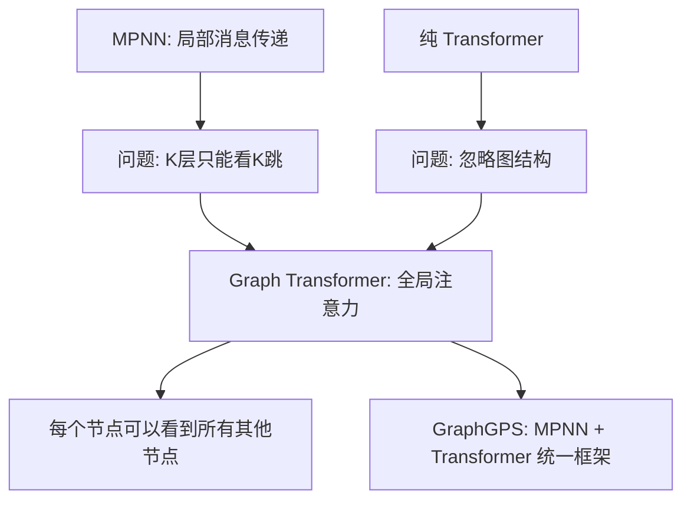

# 图神经网络深度解读: 从 GCN 到 GAT 再到 Graph Transformer

> 中文简称：图神经网络深度解读: 从 GCN 到 GAT 再到 Graph Transfor

> **一句话理解**: 图神经网络(GNN)是让 AI 理解「关系」的钥匙——社交网络中谁认识谁、分子中原子如何连接、知识图谱里概念怎样关联，CNN 处理像素、Transformer 处理序列，而 GNN 处理万物之间的连接。

---

## 1. 概述 (Overview)

### 1.1 为什么需要图神经网络

```
AI 的三大感知范式:

┌─────────────────────────────────────────────────────────────────────┐
│                     数据结构 vs AI 架构                              │
├──────────────┬──────────────────┬───────────────────────────────────┤
│  数据结构     │  AI 架构          │  典型应用                         │
├──────────────┼──────────────────┼───────────────────────────────────┤
│  网格/张量    │  CNN             │  图像分类、目标检测                │
│  序列         │  RNN/Transformer │  NLP、时间序列、语音               │
│  图(Graph)    │  GNN             │  社交网络、分子、知识图谱          │
└──────────────┴──────────────────┴───────────────────────────────────┘

现实世界中，80% 的有意义数据都是图结构:
├── 社交网络 (用户→关系→用户)
├── 分子结构 (原子→化学键→原子)
├── 知识图谱 (实体→关系→实体)
├── 推荐系统 (用户→交互→物品)
├── 交通网络 (路口→道路→路口)
├── 代码依赖 (模块→调用→模块)
└── 论文引用 (论文→引用→论文)
```

### 1.2 GNN 的核心思想



### 1.3 GNN 发展时间线

| 年份 | 里程碑 | 核心贡献 |
|------|--------|---------|
| 2005 | GNN (Scarselli) | 首次提出图上的神经网络概念 |
| 2009 | Spectral GNN (Bruna) | 图信号处理理论，谱域卷积 |
| 2015 | DCNN (Diffusion-Convolution) | 基于扩散过程的图卷积 |
| 2017 | **GCN (Kipf & Welling)** | 简化谱域方法，开启 GNN 实用化时代 |
| 2018 | **GAT (Veličković)** | 引入注意力机制，不再依赖图结构先验 |
| 2018 | GraphSAGE (Hamilton) | 归纳学习，可处理未见节点 |
| 2019 | GIN (Xu) | 证明 GNN 的表达能力上界 = WL 测试 |
| 2020 | PNA (Corso) | 多聚合器组合，超越 WL 测试 |
| 2022 | GraphGPS (Rampášek) | 统一 MPNN + Transformer 框架 |
| 2023 | **Graph Transformer** | 将 Transformer 注意力扩展到图上 |
| 2025 | Foundation Models on Graphs | 图基础模型，预训练 + 微调范式 |

---

## 2. 数学基础

### 2.1 图的表示

```
图 G = (V, E)

V = {v₁, v₂, ..., vₙ}          # 节点集合
E = {(vᵢ, vⱼ) | vᵢ 与 vⱼ 相连}  # 边集合

核心矩阵:
┌────────────────────────────────────────────────────────┐
│ 邻接矩阵 A ∈ R^(n×n)                                   │
│   A[i][j] = 1  如果 (vᵢ, vⱼ) ∈ E                      │
│   A[i][j] = 0  否则                                     │
│                                                         │
│ 度矩阵 D ∈ R^(n×n)                                     │
│   D[i][i] = Σⱼ A[i][j]  (节点 i 的度数)               │
│                                                         │
│ 拉普拉斯矩阵 L = D - A                                  │
│   归一化: L_norm = D^(-1/2) · L · D^(-1/2)             │
│   物理意义: 图的"曲率"，描述信号在图上的扩散方式         │
│                                                         │
│ 节点特征矩阵 X ∈ R^(n×d)                                │
│   X[i] = 节点 vᵢ 的 d 维特征向量                        │
└────────────────────────────────────────────────────────┘
```

### 2.2 谱域卷积 (Spectral Convolution)

```
图信号处理的数学基础:

1. 拉普拉斯矩阵的特征分解:
   L = UΛU^T
   其中 U = [u₀, u₁, ..., uₙ₋₁] 是特征向量（图傅里叶基）
   Λ = diag(λ₀, λ₁, ..., λₙ₋₁) 是特征值（图频率）

2. 图傅里叶变换:
   x̂ = U^T x          (从空间域到频域)
   x = U x̂            (从频域到空间域)

3. 谱域卷积:
   (x * g) = U · diag(ĝ) · U^T · x
   
   类比理解:
   ┌──────────────────────────────────────────┐
   │  传统信号处理:                            │
   │    时域卷积 = 频域逐元素乘法              │
   │                                          │
   │  图信号处理:                              │
   │    图上卷积 = 图频域逐元素乘法            │
   │    = U · (ĝ ⊙ (U^T · x))                │
   └──────────────────────────────────────────┘

问题: U 是 n×n 矩阵，计算复杂度 O(n³)，不适合大图
```

### 2.3 GCN: 谱域卷积的一阶近似

```
GCN 的推导 (Kipf & Welling, 2017):

1. 对谱域卷积做切比雪夫多项式近似 (K阶):
   g * x ≈ Σ(k=0 to K) θ_k · T_k(L̃) · x

2. 取 K=1 (一阶近似) + 重参数化:
   g * x ≈ θ₀·x + θ₁·(L̃ - I)·x
         ≈ θ · (I + D̃⁻¹ᐟ² Ã D̃⁻¹ᐟ²) · x

   其中:
   - Ã = A + I (加自环，节点聚合自身信息)
   - D̃ = 度矩阵(对应Ã)
   - D̃⁻¹ᐟ² Ã D̃⁻¹ᐟ² = 对称归一化邻接矩阵

3. 最终的 GCN 层:
   H^(l+1) = σ(D̃⁻¹ᐟ² Ã D̃⁻¹ᐟ² · H^(l) · W^(l))

   直觉理解:
   ┌──────────────────────────────────────────────────────┐
   │  "对每个节点，取其邻居特征的加权平均，再做非线性变换"  │
   │                                                      │
   │  h_i^(l+1) = σ( Σ_{j ∈ N(i)∪{i}}                    │
   │                    (1/√(d_i·d_j)) · h_j^(l) · W^(l)) │
   │                                                      │
   │  N(i) = 节点 i 的邻居集合                            │
   │  d_i  = 节点 i 的度数 (用于归一化)                    │
   └──────────────────────────────────────────────────────┘
```

---

## 3. 核心架构

### 3.1 GCN (Graph Convolutional Network)

```python
import torch
import torch.nn as nn
import torch.nn.functional as F

class GCNLayer(nn.Module):
    """单层图卷积网络"""
    def __init__(self, in_features, out_features):
        super().__init__()
        self.weight = nn.Parameter(torch.FloatTensor(in_features, out_features))
        self.bias = nn.Parameter(torch.FloatTensor(out_features))
        nn.init.xavier_uniform_(self.weight)
        nn.init.zeros_(self.bias)
    
    def forward(self, x, adj_hat):
        """
        x: 节点特征矩阵 [N, in_features]
        adj_hat: 归一化邻接矩阵 D^(-1/2) (A+I) D^(-1/2) [N, N]
        """
        # 消息传递: 邻居特征加权平均
        support = torch.mm(x, self.weight)        # [N, out_features]
        output = torch.spmm(adj_hat, support)      # 稀疏矩阵乘法 [N, out_features]
        return F.relu(output + self.bias)


class GCN(nn.Module):
    """两层 GCN 用于节点分类"""
    def __init__(self, n_features, n_hidden, n_classes, dropout=0.5):
        super().__init__()
        self.gcn1 = GCNLayer(n_features, n_hidden)
        self.gcn2 = GCNLayer(n_hidden, n_classes)
        self.dropout = dropout
    
    def forward(self, x, adj_hat):
        h = F.dropout(x, self.dropout, training=self.training)
        h = self.gcn1(h, adj_hat)
        h = F.dropout(h, self.dropout, training=self.training)
        h = self.gcn2(h, adj_hat)
        return F.log_softmax(h, dim=1)


def build_normalized_adjacency(adj):
    """构建 GCN 所需的归一化邻接矩阵"""
    # A + I (添加自环)
    adj_hat = adj + torch.eye(adj.size(0))
    # 计算度矩阵 D^(-1/2)
    deg = adj_hat.sum(dim=1)
    deg_inv_sqrt = deg.pow(-0.5)
    deg_inv_sqrt[deg_inv_sqrt == float('inf')] = 0
    D_inv_sqrt = torch.diag(deg_inv_sqrt)
    # D^(-1/2) * (A+I) * D^(-1/2)
    return D_inv_sqrt @ adj_hat @ D_inv_sqrt
```

### 3.2 GAT (Graph Attention Network)

```python
class GATLayer(nn.Module):
    """图注意力层: 用注意力机制替代固定的邻居权重"""
    def __init__(self, in_features, out_features, n_heads=4, concat=True):
        super().__init__()
        self.n_heads = n_heads
        self.concat = concat
        
        # 每个注意力头的参数
        self.W = nn.Parameter(torch.FloatTensor(n_heads, in_features, out_features))
        self.a_src = nn.Parameter(torch.FloatTensor(n_heads, out_features, 1))
        self.a_dst = nn.Parameter(torch.FloatTensor(n_heads, out_features, 1))
        
        self.leaky_relu = nn.LeakyReLU(0.2)
        nn.init.xavier_uniform_(self.W)
        nn.init.xavier_uniform_(self.a_src)
        nn.init.xavier_uniform_(self.a_dst)
    
    def forward(self, x, adj):
        """
        x: [N, in_features]
        adj: 邻接矩阵 [N, N] (1=相连, 0=不连)
        """
        N = x.size(0)
        
        # 线性变换: [N, in] → [H, N, out]
        h = torch.einsum('ni,hio->hno', x, self.W)
        
        # 注意力系数计算
        attn_src = torch.einsum('hno,ho1->hn', h, self.a_src)  # [H, N]
        attn_dst = torch.einsum('hno,ho1->hn', h, self.a_dst)  # [H, N]
        
        # e_ij = LeakyReLU(a_src·h_i + a_dst·h_j)
        attn = attn_src.unsqueeze(2) + attn_dst.unsqueeze(1)    # [H, N, N]
        attn = self.leaky_relu(attn)
        
        # 掩码: 只保留有边连接的注意力系数
        mask = adj.unsqueeze(0).expand_as(attn)
        attn = attn.masked_fill(mask == 0, float('-inf'))
        attn = F.softmax(attn, dim=2)
        attn = F.dropout(attn, p=0.6, training=self.training)
        
        # 聚合: h_i' = Σ_j α_ij · W · h_j
        out = torch.bmm(attn, h)  # [H, N, out_features]
        
        if self.concat:
            return out.permute(1, 0, 2).reshape(N, -1)  # [N, H*out]
        else:
            return out.mean(dim=0)  # [N, out]
```

### 3.3 GCN vs GAT vs GraphSAGE 对比

```
┌──────────────┬───────────────┬───────────────┬───────────────────────┐
│   维度        │  GCN          │  GAT          │  GraphSAGE            │
├──────────────┼───────────────┼───────────────┼───────────────────────┤
│ 聚合方式      │ 归一化平均     │ 注意力加权     │ 采样+聚合(mean/pool)  │
│ 权重来源      │ 图结构(度)     │ 学习得到       │ 可学习聚合函数        │
│ 归纳学习      │ ❌ (转导)     │ ✅            │ ✅ (设计目标)          │
│ 参数效率      │ ⭐⭐⭐⭐⭐     │ ⭐⭐⭐        │ ⭐⭐⭐⭐              │
│ 表达能力      │ ⭐⭐⭐        │ ⭐⭐⭐⭐      │ ⭐⭐⭐⭐              │
│ 可扩展性      │ ⭐⭐ (全图)   │ ⭐⭐ (全图)   │ ⭐⭐⭐⭐⭐ (采样)     │
│ 适用场景      │ 小图/学术      │ 中等图         │ 大规模工业图          │
└──────────────┴───────────────┴───────────────┴───────────────────────┘

关键洞见:
├── GCN: "一阶谱域卷积的简化" → 数学优雅但表达受限
├── GAT: "注意力 > 结构先验"  → 灵活但计算开销大
└── GraphSAGE: "采样 + 聚合"  → 工业级可扩展性
```

---

## 4. 消息传递范式 (Message Passing)

### 4.1 统一框架

```
所有 GNN 都可以统一为消息传递框架 (Gilmer et al., 2017):

┌─────────────────────────────────────────────────────────────────┐
│                    Message Passing Neural Network                │
│                                                                 │
│  消息函数:   m_ij^(l) = M(h_i^(l), h_j^(l), e_ij^(l))         │
│  聚合函数:   m_i^(l)   = AGG({m_ij^(l) : j ∈ N(i)})           │
│  更新函数:   h_i^(l+1) = U(h_i^(l), m_i^(l))                  │
│                                                                 │
│  其中:                                                           │
│  - h_i: 节点 i 的特征                                           │
│  - e_ij: 边 (i,j) 的特征                                        │
│  - N(i): 节点 i 的邻居集合                                       │
│  - M, AGG, U: 可学习的函数                                       │
│                                                                 │
│  各模型对应关系:                                                  │
│  ┌──────────┬──────────────┬──────────┬──────────────────────┐  │
│  │ 模型      │ M (消息)     │ AGG (聚合)│ U (更新)            │  │
│  ├──────────┼──────────────┼──────────┼──────────────────────┤  │
│  │ GCN      │ W·h_j        │ sum/mean │ σ(·)                 │  │
│  │ GAT      │ α_ij·W·h_j  │ sum      │ σ(·)                 │  │
│  │ GraphSAGE│ W·h_j        │ mean/pool│ W·[h_i; agg]         │  │
│  │ GIN      │ h_j          │ sum      │ MLP((1+ε)·h_i + agg) │  │
│  └──────────┴──────────────┴──────────┴──────────────────────┘  │
└─────────────────────────────────────────────────────────────────┘
```

### 4.2 PyG (PyTorch Geometric) 实现

```python
from torch_geometric.nn import MessagePassing
from torch_geometric.utils import add_self_loops, degree

class GCNConv(MessagePassing):
    """用 PyG 的消息传递框架实现 GCN"""
    def __init__(self, in_channels, out_channels):
        super().__init__(aggr='add')  # "Add" aggregation
        self.lin = nn.Linear(in_channels, out_channels, bias=False)
        self.bias = nn.Parameter(torch.zeros(out_channels))
    
    def forward(self, x, edge_index):
        # 添加自环
        edge_index, _ = add_self_loops(edge_index, num_nodes=x.size(0))
        
        # 线性变换
        x = self.lin(x)
        
        # 计算归一化系数: 1/√(d_i * d_j)
        row, col = edge_index
        deg = degree(col, x.size(0), dtype=x.dtype)
        deg_inv_sqrt = deg.pow(-0.5)
        norm = deg_inv_sqrt[row] * deg_inv_sqrt[col]
        
        # 消息传递 (自动处理聚合)
        return self.propagate(edge_index, x=x, norm=norm) + self.bias
    
    def message(self, x_j, norm):
        # x_j: 邻居节点的特征 (经过线性变换后)
        return norm.view(-1, 1) * x_j  # 归一化后的邻居特征


class GATConv(MessagePassing):
    """用 PyG 实现 GAT"""
    def __init__(self, in_channels, out_channels, heads=4):
        super().__init__(aggr='add', node_dim=0)
        self.heads = heads
        self.out_channels = out_channels
        
        self.lin = nn.Linear(in_channels, heads * out_channels, bias=False)
        self.att_src = nn.Parameter(torch.Tensor(1, heads, out_channels))
        self.att_dst = nn.Parameter(torch.Tensor(1, heads, out_channels))
        nn.init.xavier_uniform_(self.att_src)
        nn.init.xavier_uniform_(self.att_dst)
    
    def forward(self, x, edge_index):
        H, C = self.heads, self.out_channels
        x = self.lin(x).view(-1, H, C)  # [N, H, C]
        
        alpha_src = (x * self.att_src).sum(dim=-1)  # [N, H]
        alpha_dst = (x * self.att_dst).sum(dim=-1)
        
        out = self.propagate(edge_index, x=x,
                            alpha=(alpha_src, alpha_dst))
        return out.view(-1, H * C)
    
    def message(self, x_j, alpha_j, alpha_i, index):
        alpha = self.leaky_relu(alpha_j + alpha_i)
        alpha = F.softmax(alpha, dim=0)  # 按目标节点归一化
        return alpha.unsqueeze(-1) * x_j
    
    def leaky_relu(self, x, neg_slope=0.2):
        return F.leaky_relu(x, neg_slope)
```

---

## 5. GNN 的表达能力

### 5.1 WL 测试与 GNN 上界

```
Weisfeiler-Lehman (WL) 图同构测试:
┌─────────────────────────────────────────────────────────────┐
│  WL 测试算法:                                               │
│  1. 初始化每个节点的标签 (如节点特征)                         │
│  2. 迭代: 新标签 = hash(旧标签, 排序后的邻居标签集合)         │
│  3. 如果两个图的标签分布不同 → 不同构                        │
│                                                             │
│  关键定理 (Xu et al., 2019):                                 │
│  ┌───────────────────────────────────────────────────────┐  │
│  │  标准 MPNN 的表达能力 ≤ 1-WL 测试                     │  │
│  │                                                       │  │
│  │  GIN 达到 1-WL 上界:                                  │  │
│  │    h_v^(k) = MLP^((k)) ((1 + ε^(k)) · h_v^(k-1)      │  │
│  │                          + Σ_{u∈N(v)} h_u^(k-1))     │  │
│  │                                                       │  │
│  │  超越 1-WL 的方法:                                     │  │
│  │  - 高阶 WL (3-WL, k-WL)                               │  │
│  │  - PNA: 多聚合器 (mean + max + std)                   │  │
│  │  - 子图 GNN: 用子图表示增强表达力                      │  │
│  │  - Graph Transformer: 全局注意力突破局部聚合限制        │  │
│  └───────────────────────────────────────────────────────┘  │
└─────────────────────────────────────────────────────────────┘
```

### 5.2 GNN 的局限性

```
GNN 的三大局限:

1. 过度平滑 (Over-Smoothing)
   ──────────────────────
   层数太多 → 所有节点特征趋同 → 无法区分
   "消息传太远，所有人都一样了"
   
   缓解方案:
   ├── 残差连接: h^(l+1) = h^(l) + GNN(h^(l))
   ├── Jumping Knowledge: 跨层聚合不同深度的表示
   ├── DropEdge: 随机移除边，减缓消息传播
   └── PairNorm: 保持节点表示的多样性

2. 过度挤压 (Over-Squashing)
   ─────────────────────────
   指数级增长的远处信息被压缩到固定维度向量
   "远处1000个节点的信息 → 1个向量"
   
   缓解方案:
   ├── 图重布线 (Graph Rewiring): 添加长程边
   ├── Graph Transformer: 直接建模长程依赖
   └── 谱域方法: 利用全局信息

3. 长程依赖
   ──────────
   K 层 GNN 只能捕获 K 跳以内的信息
   "距离超过 K 的节点互相看不见"
   
   缓解方案:
   ├── Graph Transformer (全局注意力)
   ├── 虚拟节点 (Virtual Node)
   └── 位置编码 (Laplacian PE)
```

---

## 6. Graph Transformer

### 6.1 为什么需要 Graph Transformer



### 6.2 GraphGPS 架构

```python
class GraphGPSLayer(nn.Module):
    """GraphGPS: 统一局部 (MPNN) + 全局 (Transformer) 的图学习"""
    def __init__(self, dim, mpnn_layer, n_heads=4):
        super().__init__()
        # 局部路径: MPNN
        self.mpnn = mpnn_layer
        
        # 全局路径: Transformer
        self.attn = nn.MultiheadAttention(dim, n_heads, batch_first=True)
        self.norm1 = nn.LayerNorm(dim)
        self.norm2 = nn.LayerNorm(dim)
        self.norm3 = nn.LayerNorm(dim)
        
        # 门控融合
        self.ffn = nn.Sequential(
            nn.Linear(dim, dim * 4), nn.GELU(), nn.Linear(dim * 4, dim)
        )
    
    def forward(self, x, edge_index, batch):
        """
        x: 节点特征 [N, dim]
        edge_index: 边索引 [2, E]
        batch: 批次分配 [N] (哪个节点属于哪个图)
        """
        # 局部路径: MPNN
        x_local = self.norm1(x)
        x_local = self.mpnn(x_local, edge_index)
        
        # 全局路径: Transformer (在同一个图内的节点间做注意力)
        x_global = self.norm2(x)
        x_global, _ = self.attn(x_global, x_global, x_global,
                                 attn_mask=None,  # 全局注意力
                                 need_weights=False)
        
        # 融合 + FFN
        x = x + x_local + x_global
        x = x + self.ffn(self.norm3(x))
        return x
```

---

## 7. 实际应用

### 7.1 分子属性预测

```python
from torch_geometric.data import Data
from torch_geometric.nn import GINEConv, global_mean_pool

class MolecularGNN(nn.Module):
    """分子属性预测: 输入分子图 → 预测溶解度/毒性/药效"""
    def __init__(self, n_atom_features, n_bond_features, hidden=256):
        super().__init__()
        self.conv1 = GINEConv(nn.Linear(n_atom_features, hidden),
                               edge_dim=n_bond_features)
        self.conv2 = GINEConv(nn.Linear(hidden, hidden),
                               edge_dim=n_bond_features)
        self.conv3 = GINEConv(nn.Linear(hidden, hidden),
                               edge_dim=n_bond_features)
        self.predictor = nn.Sequential(
            nn.Linear(hidden, hidden), nn.ReLU(),
            nn.Dropout(0.5), nn.Linear(hidden, 1)
        )
    
    def forward(self, x, edge_index, edge_attr, batch):
        h = self.conv1(x, edge_index, edge_attr).relu()
        h = self.conv2(h, edge_index, edge_attr).relu()
        h = self.conv3(h, edge_index, edge_attr)
        
        # 图级池化: 分子内所有原子特征取平均
        h_graph = global_mean_pool(h, batch)
        return self.predictor(h_graph)


# 构建分子图示例 (苯环 C₆H₆ → 简化为 6 个碳原子)
def build_benzene_graph():
    """苯分子: 6个碳原子组成环"""
    # 原子特征: [原子序数, 杂化类型, 形式电荷, ...]
    x = torch.tensor([
        [6, 2, 0, 0],  # C1
        [6, 2, 0, 0],  # C2
        [6, 2, 0, 0],  # C3
        [6, 2, 0, 0],  # C4
        [6, 2, 0, 0],  # C5
        [6, 2, 0, 0],  # C6
    ], dtype=torch.float)
    
    # 边: 环状连接
    edge_index = torch.tensor([
        [0,1, 1,2, 2,3, 3,4, 4,5, 5,0],  # source
        [1,0, 2,1, 3,2, 4,3, 5,4, 0,5],  # target
    ], dtype=torch.long)
    
    # 边特征: [键类型, 是否芳香, 是否共轭]
    edge_attr = torch.ones(12, 3)  # 简化: 全部为芳香键
    
    return Data(x=x, edge_index=edge_index, edge_attr=edge_attr)
```

### 7.2 知识图谱补全 (Link Prediction)

```python
class KGCompletionGNN(nn.Module):
    """知识图谱补全: 预测缺失的三元组 (head, relation, ?)"""
    def __init__(self, n_entities, n_relations, dim=128):
        super().__init__()
        self.entity_emb = nn.Embedding(n_entities, dim)
        self.relation_emb = nn.Embedding(n_relations, dim)
        
        # RGCN: 关系感知的图卷积
        from torch_geometric.nn import RGCNConv
        self.conv1 = RGCNConv(dim, dim, n_relations)
        self.conv2 = RGCNConv(dim, dim, n_relations)
    
    def forward(self, entity_idx, edge_index, edge_type):
        x = self.entity_emb(entity_idx)
        x = self.conv1(x, edge_index, edge_type).relu()
        x = self.conv2(x, edge_index, edge_type)
        return x
    
    def score(self, head_emb, rel_emb, tail_emb):
        """DistMult 评分: score = Σ h_i * r_i * t_i"""
        return (head_emb * rel_emb * tail_emb).sum(dim=-1)


# 训练: 三元组损失
def train_kg_completion(model, triples, n_entities):
    """使用 margin ranking loss 训练"""
    model.train()
    optimizer = torch.optim.Adam(model.parameters(), lr=0.01)
    
    heads, rels, tails = triples[:, 0], triples[:, 1], triples[:, 2]
    h_emb = model.entity_emb(heads)
    r_emb = model.relation_emb(rels)
    t_emb = model.entity_emb(tails)
    
    # 正样本得分
    pos_score = model.score(h_emb, r_emb, t_emb)
    
    # 负样本: 随机替换 tail
    neg_tails = torch.randint(0, n_entities, (heads.size(0),))
    neg_t_emb = model.entity_emb(neg_tails)
    neg_score = model.score(h_emb, r_emb, neg_t_emb)
    
    # Margin Ranking Loss
    loss = F.relu(neg_score - pos_score + 1.0).mean()
    return loss
```

### 7.3 应用场景总结

```
┌──────────────────┬──────────────────────────┬────────────────────────┐
│  应用领域         │  图数据                    │  GNN 任务              │
├──────────────────┼──────────────────────────┼────────────────────────┤
│  药物发现         │  分子 (原子→化学键)        │  图分类/属性预测        │
│  推荐系统         │  用户-物品二部图           │  链接预测              │
│  社交网络分析      │  用户-关系-用户           │  节点分类/社区检测      │
│  知识图谱         │  实体-关系-实体           │  链接补全/三元组分类    │
│  交通预测         │  路口-道路-路口           │  时空预测              │
│  蛋白质交互       │  蛋白质-相互作用          │  图分类/边预测          │
│  代码分析         │  AST/CFG/DFG             │  缺陷检测/代码搜索      │
│  论文引用         │  论文-引用-论文           │  节点分类/影响力预测    │
│  计算机视觉       │  场景图 (物体→空间关系)    │  视觉问答/图像生成     │
│  自然语言处理     │  句法依存树/AMR图         │  语义解析/关系抽取      │
└──────────────────┴──────────────────────────┴────────────────────────┘
```

---

## 8. GNN 与 LLM 的融合 (2025-2026 前沿)

### 8.1 GNN + LLM 架构

```
┌─────────────────────────────────────────────────────────────┐
│              GNN + LLM 融合模式                              │
│                                                             │
│  模式1: GNN as Encoder (GNN→LLM)                           │
│  ┌────────┐     ┌──────────┐                                │
│  │ 图数据  │ →  │ GNN 编码  │ → 图表示 → LLM 作为文本补充    │
│  └────────┘     └──────────┘                                │
│  应用: 分子描述 + 化学问答                                   │
│                                                             │
│  模式2: LLM as Predictor (LLM→GNN)                         │
│  ┌────────┐     ┌──────────┐                                │
│  │ 文本描述 │ →  │ LLM 编码  │ → 文本表示 → GNN 处理图结构   │
│  └────────┘     └──────────┘                                │
│  应用: 零样本节点分类 (用文本特征初始化)                       │
│                                                             │
│  模式3: GNN-LLM 联合训练                                    │
│  ┌────────┐     ┌──────────┐     ┌──────────┐              │
│  │ 图数据  │ →  │ GNN      │ ↔   │ LLM      │ → 联合推理    │
│  └────────┘     └──────────┘     └──────────┘              │
│  应用: 知识图谱问答、科学文献分析                              │
│                                                             │
│  代表工作 (2024-2026):                                      │
│  ├── GraphGPT: 将 GNN 图表示注入 LLM                       │
│  ├── LLaGA: LLM 辅助的图分析                                │
│  ├── OFA (One For All): 图基础模型                          │
│  └── GraphRAG: 图增强的检索增强生成                          │
└─────────────────────────────────────────────────────────────┘
```

---

## 9. 工具与框架

| 框架 | 语言 | 特点 | 适用场景 |
|------|------|------|---------|
| **PyG** (PyTorch Geometric) | Python | 最流行、API 优雅、消息传递范式 | 研究与原型 |
| **DGL** (Deep Graph Library) | Python | 高性能、支持多后端(PyTorch/TF/MXNet) | 大规模训练 |
| **GraphNets** (DeepMind) | Python/JAX | JAX 原生、函数式风格 | JAX 生态 |
| **Torch-Scatter/Sparse** | Python | PyG 底层依赖 | 稀疏矩阵运算 |
| **OGB** (Open Graph Benchmark) | Python | 标准评测基准 | 模型评估 |
| **GraphGym** | Python | 自动化 GNN 设计 | AutoML for GNN |

---

## 10. 关键概念速查

| 概念 | 解释 | 数学表达 |
|------|------|---------|
| 消息传递 | 节点聚合邻居信息并更新自身 | h_i' = U(h_i, AGG({M(h_i, h_j)})) |
| 谱域卷积 | 在图傅里叶空间做滤波 | g * x = U·diag(ĝ)·U^T·x |
| 空间卷积 | 直接在图上聚合邻居 | h_i' = σ(Σ_{j∈N(i)} W·h_j) |
| 图池化 | 将节点特征聚合为图级表示 | h_G = mean/max/attention({h_i}) |
| 图读出 (Readout) | 同图池化，生成图级向量 | 同上 |
| 过度平滑 | 层数太多导致节点特征趋同 | lim_{L→∞} h_i^(L) = h_j^(L) |
| 过度挤压 | 远处信息被压缩到固定维度 | 指数增长 → 固定维度瓶颈 |
| 位置编码 | 为节点添加位置信息 | PE = Laplacian 特征向量 |
| 图重布线 | 修改图结构以改善消息传递 | 添加/删除边 |

---

## 相关资源

- [[neural-networks]] — 神经网络基础概念
- [[transformer-architecture]] — Transformer 架构（Graph Transformer 的基础）
- [[computer-vision]] — 计算机视觉（GNN 在场景图中的应用）
- [[vector-database]] — 向量数据库（GraphRAG 的存储层）

---

*最后更新: 2026-06-04*
