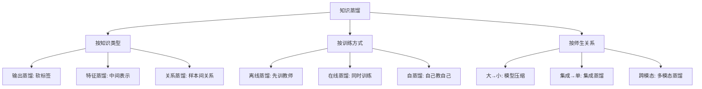

# 知识蒸馏 (Knowledge Distillation)

> 中文简称：知识蒸馏

## 1. 核心思想

### 1.1 为什么蒸馏有效？

```
教师模型 (Teacher): 大模型，精度高，推理慢
学生模型 (Student): 小模型，精度接近，推理快

关键洞察:
- 教师的 "软标签" (soft labels) 包含类间关系信息
- 例: 图片分类中，教师输出 [猫:0.7, 虎:0.2, 狗:0.1]
  - 硬标签只说"是猫"
  - 软标签还说"猫和虎比猫和狗更像" ← 暗知识 (Dark Knowledge)

温度参数 T:
- T=1: 标准 softmax (尖锐)
- T>1: 平滑分布 (暴露类间关系)
- T→∞: 均匀分布 (无信息)
- 典型: T=3-20
```

### 1.2 蒸馏分类



## 2. 经典知识蒸馏

### 2.1 Hinton KD (2015)

```python
import torch
import torch.nn.functional as F

def knowledge_distillation_loss(student_logits, teacher_logits, 
                                 true_labels, temperature=4.0, alpha=0.7):
    """
    Hinton 知识蒸馏损失
    L = α × L_soft + (1-α) × L_hard
    """
    # 软标签损失: 学生模仿教师的平滑分布
    soft_student = F.log_softmax(student_logits / temperature, dim=-1)
    soft_teacher = F.softmax(teacher_logits / temperature, dim=-1)
    loss_soft = F.kl_div(soft_student, soft_teacher, reduction='batchmean')
    loss_soft = loss_soft * (temperature ** 2)  # 温度缩放补偿
    
    # 硬标签损失: 学生也要学真实标签
    loss_hard = F.cross_entropy(student_logits, true_labels)
    
    # 加权组合
    return alpha * loss_soft + (1 - alpha) * loss_hard

# 训练流程:
# 1. 预训练教师模型 (或直接用大模型)
# 2. 教师推理生成软标签 (可离线缓存)
# 3. 学生模型联合训练 (软标签 + 硬标签)
# 4. 推理时只用学生模型
```

### 2.2 特征蒸馏 (FitNets)

```python
class FeatureDistillation(torch.nn.Module):
    """
    中间层特征对齐: 学生模仿教师的中间表示
    """
    def __init__(self, student_channels, teacher_channels):
        super().__init__()
        # 适配层: 对齐学生和教师的特征维度
        self.align = torch.nn.Conv2d(
            student_channels, teacher_channels, 1
        )
    
    def forward(self, student_feat, teacher_feat):
        """
        student_feat: 学生中间层输出
        teacher_feat: 教师对应层输出 (detach!)
        """
        aligned = self.align(student_feat)
        # L2 距离对齐
        loss = F.mse_loss(aligned, teacher_feat.detach())
        return loss
```

### 2.3 关系蒸馏 (RKD)

```python
def relational_knowledge_distillation(student_feat, teacher_feat):
    """
    关系蒸馏: 不只模仿单个样本的表示，
    还模仿样本之间的关系结构
    """
    # 距离关系: 样本对之间的距离比
    with torch.no_grad():
        t_dist = torch.cdist(teacher_feat, teacher_feat)
        t_dist = t_dist / t_dist.mean()  # 归一化
    
    s_dist = torch.cdist(student_feat, student_feat)
    s_dist = s_dist / (s_dist.mean() + 1e-8)
    
    loss_distance = F.smooth_l1_loss(s_dist, t_dist)
    
    # 角度关系: 三元组之间的角度
    # (省略具体实现)
    
    return loss_distance
```

## 3. LLM 知识蒸馏 (2024-2026)

### 3.1 LLM 蒸馏方法

| 方法 | 教师 | 学生 | 知识类型 | 代表 |
|------|------|------|----------|------|
| 输出蒸馏 | GPT-4 | 7B 模型 | 生成文本 | Alpaca/Vicuna |
| Logit 蒸馏 | 大 LLM | 小 LLM | Token 分布 | DistilBERT |
| 思维链蒸馏 | o3/R1 | 小模型 | 推理过程 | DeepSeek-R1-Distill |
| 数据蒸馏 | 大模型 | 数据集 | 合成数据 | Phi 系列 |
| 在线蒸馏 | 多模型 | 融合模型 | 互补知识 | 模型融合 |

### 3.2 思维链蒸馏 (2025-2026 热点)

```python
# DeepSeek-R1 蒸馏: 将推理能力迁移到小模型
# 教师: DeepSeek-R1 (671B MoE)
# 学生: Qwen-14B/32B, LLaMA-8B/70B

# 流程:
# 1. 教师生成带思维链的回答
# 2. 筛选高质量推理样本
# 3. 学生 SFT 学习推理格式
# 4. 可选: 学生 RL 进一步强化推理

# 效果:
# R1-Distill-Qwen-32B: 数学推理接近 o1-mini
# 成本: 教师推理 ~$10K, 学生训练 ~$5K
# vs 从头训练推理模型: ~$1M+
```

### 3.3 数据蒸馏 (Dataset Distillation)

```python
# 数据蒸馏: 将大数据集压缩为少量"精华"样本
# 目标: 在 50 个合成样本上训练 ≈ 在 50000 个真实样本上训练

# 方法:
# 1. 梯度匹配: 合成样本的梯度 ≈ 真实数据的梯度
# 2. 分布匹配: 合成数据的特征分布 ≈ 真实数据
# 3. 轨迹匹配: 在合成数据上训练的轨迹 ≈ 真实数据

# LLM 场景:
# - 用大模型生成高质量训练数据 (合成数据)
# - Phi 系列: "Textbooks Are All You Need"
# - 核心: 数据质量 > 数据数量
```

## 4. 自蒸馏与在线蒸馏

### 4.1 自蒸馏 (Self-Distillation)

```python
# 自蒸馏: 模型自己教自己 (无需教师)

# 方法1: 深层→浅层
# 用最后几层的输出指导前面层

# 方法2: EMA 教师 (Mean Teacher)
class SelfDistillation:
    def __init__(self, model, ema_decay=0.999):
        self.student = model
        self.teacher = copy.deepcopy(model)  # EMA 版本
        self.ema_decay = ema_decay
    
    def update_teacher(self):
        """指数移动平均更新教师"""
        for t_param, s_param in zip(
            self.teacher.parameters(), 
            self.student.parameters()
        ):
            t_param.data = (self.ema_decay * t_param.data + 
                           (1 - self.ema_decay) * s_param.data)
    
    def distillation_loss(self, x):
        student_out = self.student(x)
        with torch.no_grad():
            teacher_out = self.teacher(x)
        return F.kl_div(
            F.log_softmax(student_out, dim=-1),
            F.softmax(teacher_out, dim=-1),
            reduction='batchmean'
        )
```

### 4.2 在线互蒸馏

```python
# 多个模型同时训练，互相蒸馏
# 无需预训练教师，适合资源有限场景

def online_mutual_distillation(models, x, y, temperature=3.0):
    """
    N 个模型互教: 每个模型学习其他模型的平均预测
    """
    outputs = [model(x) for model in models]
    
    losses = []
    for i, output_i in enumerate(outputs):
        # 其他模型的平均软标签
        others = [outputs[j] for j in range(len(outputs)) if j != i]
        ensemble_soft = torch.stack([
            F.softmax(o / temperature, dim=-1) for o in others
        ]).mean(dim=0)
        
        # 蒸馏损失
        loss_soft = F.kl_div(
            F.log_softmax(output_i / temperature, dim=-1),
            ensemble_soft,
            reduction='batchmean'
        ) * (temperature ** 2)
        
        # 硬标签损失
        loss_hard = F.cross_entropy(output_i, y)
        
        losses.append(0.5 * loss_soft + 0.5 * loss_hard)
    
    return losses
```

## 5. 蒸馏实践指南

### 5.1 超参数选择

| 参数 | 推荐范围 | 说明 |
|------|----------|------|
| 温度 T | 3-20 | 分类用 3-5, LLM 用 1-2 |
| α (软硬比) | 0.5-0.9 | 软标签权重 |
| 学生大小 | 教师 1/4-1/12 | 太小则容量不足 |
| 训练轮次 | 2-5× 正常训练 | 蒸馏需要更多轮次 |
| 学习率 | 与正常训练相同 | 无需特殊调整 |

### 5.2 蒸馏 vs 其他压缩方法

| 方法 | 压缩比 | 精度保留 | 速度 | 适用 |
|------|--------|----------|------|------|
| 知识蒸馏 | 4-12× | 95-99% | 训练慢 | 通用 |
| 量化 (INT8) | 4× | 98-99% | 快 | 推理 |
| 剪枝 | 2-4× | 95-98% | 中 | 推理 |
| NAS | 2-8× | 97-99% | 搜索慢 | 设计 |
| 蒸馏+量化 | 8-16× | 93-97% | 组合 | 边缘 |

## 相关文档

- [[03_深度学习/09_Advanced_Topics/Neural_Architecture_Search|NAS]] — 架构搜索
- [[10_部署推理/03_Inference_Optimization/Model_Compression|模型压缩]] — 量化/剪枝
- [[05_大模型/12_Edge_LLM/|边缘 LLM]] — 小模型部署
- [[05_大模型/07_Fine_tuning_Techniques/|微调技术]] — LoRA/QLoRA
- [[05_大模型/09_Reasoning_Models/|推理模型]] — 思维链蒸馏
