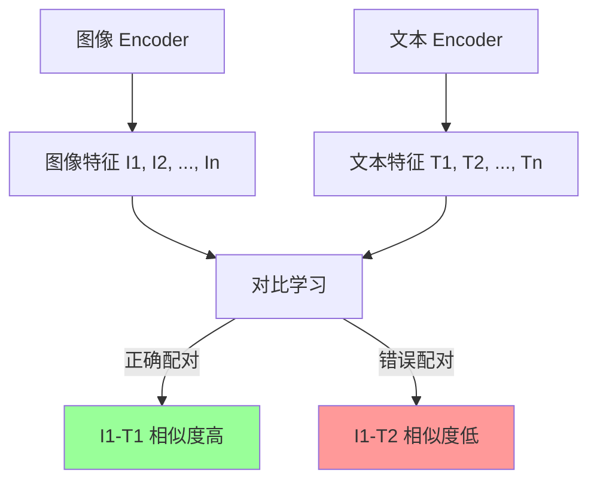
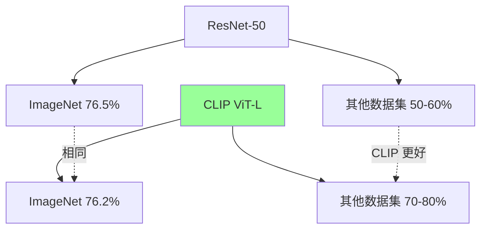
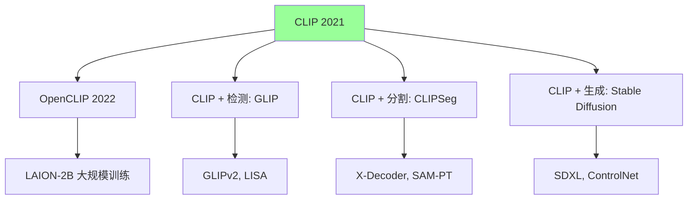

# CLIP 深度解读 - 多模态学习的里程碑

> **一句话理解**: CLIP 像是一位"双语翻译官"——它同时学习图像和文字，让 AI 看到一张图就能"说出"它的描述，或者根据文字"找出"匹配的图像，从此 AI 理解了"图和文是一回事"。

---

## 论文基本信息

| 属性 | 内容 |
|------|------|
| **核心论文** | Learning Transferable Visual Models From Natural Language Supervision |
| **作者** | Alec Radford, Jong Wook Kim 等 (OpenAI) |
| **发表** | ICML 2021 (arXiv:2103.00020) |
| **核心贡献** | 用自然语言监督信号学习视觉表示 zero-shot 分类 |
| **影响** | 多模态学习的基石，Stable Diffusion 图像编码器来源 |

---

## 1. 背景：为什么需要 CLIP？

### 1.1 传统视觉的局限

```
ImageNet 分类:
- 1000 个固定类别
- 猫、狗、汽车、飞机...
- 训练时就知道所有类别

问题:
✗ 新类别需要重新收集数据
✗ 无法描述复杂、模糊的图像
✗ 缺乏语义理解
```

### 1.2 自然语言的优势

```
语言监督:
- 词汇量巨大（几乎无限）
- 描述灵活（可以描述任何东西）
- 语义丰富（"可爱的橘猫在沙发上打盹"）

CLIP 的想法:
"为什么不直接从文本描述学习视觉？"
```

---

## 2. 核心思想：对比学习

### 2.1 训练目标

```
收集:
- N 张图片
- N 段文字描述（每张图片配一个描述）

训练目标:
让匹配的(图像, 文本)对相似度高
让不匹配的对相似度低
```



### 2.2 损失函数

```
InfoNCE / 对比损失:

对于每个图像 i:
- 正样本: 配对的文本 T_i
- 负样本: 其他 N-1 个文本

相似度用余弦相似度:
sim(I_i, T_j) = cos(Encoder_I(I_i), Encoder_T(T_j))

温度系数 τ 控制分布锐度

损失 = -log(exp(sim(I_i, T_i)/τ) / Σ_j exp(sim(I_i, T_j)/τ))
```

---

## 3. 模型架构

### 3.1 双编码器结构

```
图像编码器 (Vision Transformer):
图像 → Patch Embedding → Transformer → 图像特征

文本编码器 (Transformer):
文本 → Tokenization → Embedding → Transformer → 文本特征

特征维度对齐:
图像特征: 512 或 768 维
文本特征: 512 或 768 维
（投影到同一空间后计算相似度）
```

### 3.2 规模

| 模型 | 图像 Encoder | 参数量 | 预训练数据 |
|------|-------------|--------|-----------|
| CLIP RN50 | ResNet-50 | 38M | 400M 图像-文本对 |
| CLIP ViT-B/32 | ViT-B/32 | 151M | 400M 图像-文本对 |
| CLIP ViT-L/14 | ViT-L/14 | 428M | 400M 图像-文本对 |

---

## 4. Zero-Shot 分类

### 4.1 什么是 Zero-Shot？

```
传统分类:
输入: 图像
输出: 固定类别 (Cat, Dog, Bird...)
训练: 需要大量带标签数据

Zero-Shot 分类:
输入: 图像 + 类别描述
输出: 相似度最高的就是预测类别

示例:
图像: [一张猫的照片]
提示: "a photo of a cat" / "a photo of a dog" / "a photo of a bird"
      ↓
计算相似度 → 最高的就是预测
```

### 4.2 在 ImageNet 上的表现

| 方法 | ImageNet 准确率 |
|------|----------------|
| 有监督 ResNet-50 | 76.5% |
| CLIP ViT-L/14 | 76.2% |
| CLIP ViT-L/14 (zero-shot) | 76.2% |

**关键**: CLIP 用 zero-shot 达到了有监督训练的水平！

### 4.3 更强大的泛化能力



CLIP 在 ImageNet 相当，在其他数据集明显更好！

---

## 5. 提示工程 (Prompt Engineering)

### 5.1 为什么需要提示？

```
问题: 一词多义

"boxer" 可以是:
- 拳击手
- 的一种狗

解决: 用上下文提示

"a photo of a boxer, a breed of dog"
"a photo of a boxer, a sports athlete"
```

### 5.2 集成提示

```python
# 多提示集成
prompts = [
    "a photo of a {}, a type of pet.",
    "a photo of a {}, a common household animal.",
    "a photo of a cute {}.",
]
# 对多个提示的相似度取平均
```

---

## 6. 应用场景

### 6.1 图像搜索

```
用户输入: "sunset over the ocean"
↓ tokenize
["a photo of sunset over the ocean"]
↓ encode
文本特征向量
↓ 与图片库对比
返回相似度最高的图片
```

### 6.2 图像生成 (Stable Diffusion)

```
Stable Diffusion 架构:
CLIP Text Encoder → 文本嵌入 → UNet → 图像

CLIP 作用:
- 把文字描述变成 AI 能理解的"指令"
- 指导 UNet 在潜空间生成图像

为什么用 CLIP:
- 训练时学过 4 亿图像-文本对
- 对齐了视觉和语言
- 泛化能力强
```

### 6.3 零样本检测/分割

```
GLIP (Grounded Language-Image Pre-training):
- 输入: 图像 + 文本描述
- 输出: 检测/分割结果

效果:
- 新类别无需训练
- 用文本描述任意物体
- "检测图里那只戴着红帽子的白猫"
```

---

## 7. 后续发展



| 衍生工作 | 核心贡献 |
|---------|---------|
| OpenCLIP | 更大规模训练，中文支持 |
| GLIP | 文本引导的目标检测 |
| CLIPSeg | 零样本图像分割 |
| Stable Diffusion | CLIP Text Encoder 用于文生图 |

---

## 8. 核心公式

### 8.1 对比损失

```
给定 N 对 (图像, 文本)，对称交叉熵损失:

L = -1/2 * [E_i[log(sim(I_i, T_i))/τ]
         + E_j[log(sim(I_j, T_j))/τ]]

或者写成:
L_{i→j} = -log(exp(sim(I_i, T_i)/τ) / Σ_j exp(sim(I_i, T_j)/τ))
总损失 = (L_{i→j} + L_{j→i}) / 2
```

### 8.2 Zero-Shot 预测

```python
# 对于图像 I 和类别集合 C
text_features = encoder_text([f"a photo of a {c}" for c in C])
image_features = encoder_image(I)
similarity = cosine_similarity(image_features, text_features)
pred = C[argmax(similarity)]
```

---

## 9. 为什么必读？

```
【学术价值】
- 证明了自然语言监督的有效性
- 开启了多模态学习的新时代
- zero-shot 泛化能力的重要突破

【工程价值】
- Stable Diffusion 的文本编码器
- 多模态搜索的核心技术
- 多模态 Agent 的基础

【思想价值】
- "语言是视觉学习的监督信号"
- "万物皆可 zero-shot"
- 统一视觉和语言表示
```

---

## 10. 一句话总结

> **CLIP 让 AI 理解了"图和文是一回事"——从此 AI 可以看图说话、按图搜索、用文字指导图像生成，多模态时代正式开启。**

---

*原始论文: [Learning Transferable Visual Models From Natural Language Supervision](https://arxiv.org/abs/2103.00020)*