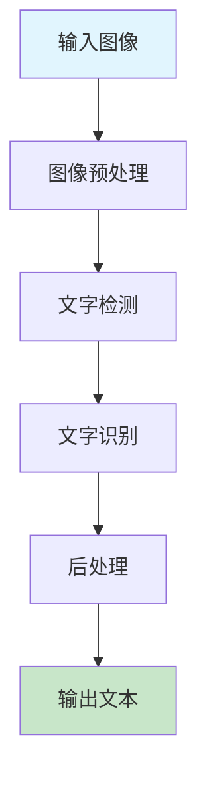
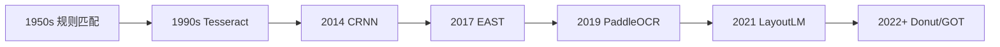
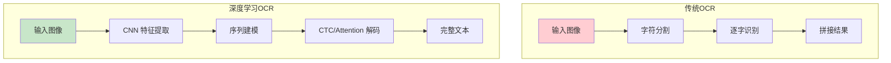
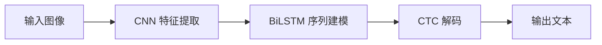
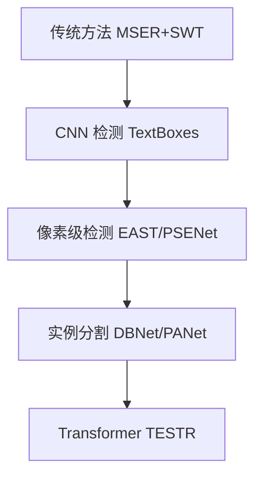
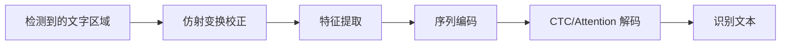
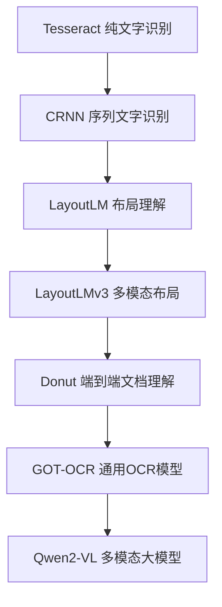
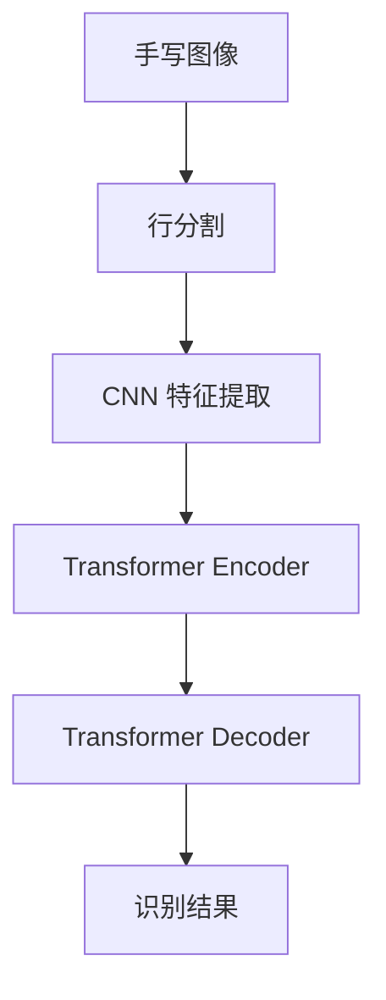

# OCR 与文字识别

> **一句话秒懂**: OCR 就像给电脑装了一双"识字眼"，能看懂图片里的文字，把它变成可以编辑的文本。

## 目录

- [为什么需要 OCR？](#为什么需要-ocr)
- [传统 OCR：Tesseract](#传统-ocrteseract)
- [深度学习 OCR](#深度学习-ocr)
- [PaddleOCR 实战](#paddleocr-实战)
- [场景文字检测](#场景文字检测)
- [场景文字识别](#场景文字识别)
- [文档 AI](#文档-ai)
- [手写文字识别](#手写文字识别)
- [多语言 OCR](#多语言-ocr)
- [实际应用案例](#实际应用案例)

---

## 为什么需要 OCR？

### 应用场景

```
生活中的 OCR 应用：

  扫描文件 → 变成可编辑文档
  拍照发票 → 自动报销录入
  拍身份证 → 自动填写表单
  拍车牌   → 自动识别号码
  拍公式   → 自动转换 LaTeX
  拍商品   → 自动比价搜索
```

### OCR 系统组成



### OCR 发展时间线



---

## 传统 OCR：Tesseract

### 工作原理

```
传统 OCR 工作原理（简化版）：

输入图片：  ┌───┐
            │ A │
            └───┘
               |
二值化处理：  ██
            █  █
            ████
            █  █
            █  █
               |
特征匹配：  对比字库中的 "A"
               |
输出结果：  "A" (置信度: 0.95)
```

### Tesseract 安装和使用

```bash
# macOS
brew install tesseract tesseract-lang

# Ubuntu
sudo apt install tesseract-ocr tesseract-ocr-chi-sim

# Python 绑定
pip install pytesseract Pillow
```

### Python 基础用法

```python
import pytesseract
from PIL import Image, ImageEnhance, ImageFilter

# 基础识别
image = Image.open("receipt.jpg")
text = pytesseract.image_to_string(image, lang="chi_sim+eng")
print(text)

# 带位置信息的识别
data = pytesseract.image_to_data(
    image, lang="chi_sim+eng", output_type=pytesseract.Output.DICT
)

for i in range(len(data["text"])):
    if int(data["conf"][i]) > 60:
        x, y, w, h = data["left"][i], data["top"][i], data["width"][i], data["height"][i]
        print(f"文字: {data['text'][i]:15s} 位置: ({x},{y},{w},{h}) 置信度: {data['conf'][i]}")

# 图像预处理提升准确率
def preprocess_image(image_path: str) -> Image.Image:
    img = Image.open(image_path)
    img = img.convert("L")  # 转灰度
    enhancer = ImageEnhance.Contrast(img)
    img = enhancer.enhance(2.0)  # 增强对比度
    img = img.point(lambda x: 0 if x < 128 else 255, "1")  # 二值化
    img = img.filter(ImageFilter.MedianFilter(size=3))  # 去噪
    return img

processed = preprocess_image("noisy_document.jpg")
text = pytesseract.image_to_string(processed, lang="chi_sim+eng")
```

### Tesseract 的局限

| 场景 | 表现 | 原因 |
|------|------|------|
| 规范印刷文档 | 好 | 设计目标场景 |
| 手写文字 | 差 | 缺乏学习能力 |
| 自然场景文字 | 差 | 背景复杂、字体多变 |
| 倾斜/旋转文字 | 差 | 对齐要求高 |
| 多语言混合 | 一般 | 需要手动指定语言 |

---

## 深度学习 OCR

### 传统 vs 深度学习



### CRNN (Convolutional Recurrent Neural Network)



```python
import torch
import torch.nn as nn

class CRNN(nn.Module):
    def __init__(self, num_classes: int, hidden_size: int = 256):
        super().__init__()

        self.cnn = nn.Sequential(
            nn.Conv2d(1, 64, 3, padding=1), nn.ReLU(), nn.MaxPool2d(2, 2),
            nn.Conv2d(64, 128, 3, padding=1), nn.ReLU(), nn.MaxPool2d(2, 2),
            nn.Conv2d(128, 256, 3, padding=1), nn.ReLU(),
            nn.Conv2d(256, 256, 3, padding=1), nn.ReLU(), nn.MaxPool2d((2, 1)),
            nn.Conv2d(256, 512, 3, padding=1), nn.BatchNorm2d(512), nn.ReLU(),
            nn.Conv2d(512, 512, 3, padding=1), nn.BatchNorm2d(512), nn.ReLU(),
            nn.MaxPool2d((2, 1)),
            nn.Conv2d(512, 512, 2), nn.ReLU(),
        )

        self.rnn = nn.LSTM(
            input_size=512,
            hidden_size=hidden_size,
            num_layers=2,
            bidirectional=True,
            batch_first=True,
        )

        self.fc = nn.Linear(hidden_size * 2, num_classes)

    def forward(self, x):
        conv = self.cnn(x)
        conv = conv.squeeze(2)
        conv = conv.permute(0, 2, 1)
        rnn_out, _ = self.rnn(conv)
        output = self.fc(rnn_out)
        return output

CHARSET = "0123456789abcdefghijklmnopqrstuvwxyz"
NUM_CLASSES = len(CHARSET) + 1

model = CRNN(num_classes=NUM_CLASSES)
criterion = nn.CTCLoss(blank=NUM_CLASSES - 1, zero_infinity=True)
optimizer = torch.optim.Adam(model.parameters(), lr=1e-3)

for epoch in range(10):
    images = torch.randn(16, 1, 32, 256)
    labels = torch.randint(0, NUM_CLASSES - 1, (16, 20))
    outputs = model(images)
    log_probs = outputs.log_softmax(2).permute(1, 0, 2)
    input_lengths = torch.full((16,), log_probs.size(0), dtype=torch.long)
    target_lengths = torch.full((16,), 20, dtype=torch.long)
    loss = criterion(log_probs, labels, input_lengths, target_lengths)
    optimizer.zero_grad()
    loss.backward()
    optimizer.step()
    print(f"Epoch {epoch}: loss = {loss.item():.4f}")
```

### EAST (Efficient and Accurate Scene Text Detector)

```python
import torch
import torch.nn as nn

class EASTDetector(nn.Module):
    def __init__(self):
        super().__init__()
        self.conv1 = nn.Sequential(
            nn.Conv2d(3, 32, 3, padding=1), nn.BatchNorm2d(32), nn.ReLU(),
            nn.MaxPool2d(2),
        )
        self.conv2 = nn.Sequential(
            nn.Conv2d(32, 64, 3, padding=1), nn.BatchNorm2d(64), nn.ReLU(),
            nn.MaxPool2d(2),
        )
        self.conv3 = nn.Sequential(
            nn.Conv2d(64, 128, 3, padding=1), nn.BatchNorm2d(128), nn.ReLU(),
            nn.MaxPool2d(2),
        )
        self.conv4 = nn.Sequential(
            nn.Conv2d(128, 256, 3, padding=1), nn.BatchNorm2d(256), nn.ReLU(),
            nn.MaxPool2d(2),
        )

        self.merge1 = nn.Conv2d(256 + 128, 128, 1)
        self.merge2 = nn.Conv2d(128 + 64, 64, 1)
        self.merge3 = nn.Conv2d(64 + 32, 32, 1)

        self.score_head = nn.Conv2d(32, 1, 1)
        self.geometry_head = nn.Conv2d(32, 4, 1)
        self.angle_head = nn.Conv2d(32, 1, 1)

    def forward(self, x):
        f1 = self.conv1(x)
        f2 = self.conv2(f1)
        f3 = self.conv3(f2)
        f4 = self.conv4(f3)

        up4 = nn.functional.interpolate(f4, size=f3.shape[2:])
        m1 = self.merge1(torch.cat([up4, f3], dim=1))

        up3 = nn.functional.interpolate(m1, size=f2.shape[2:])
        m2 = self.merge2(torch.cat([up3, f2], dim=1))

        up2 = nn.functional.interpolate(m2, size=f1.shape[2:])
        m3 = self.merge3(torch.cat([up2, f1], dim=1))

        score = torch.sigmoid(self.score_head(m3))
        geometry = self.geometry_head(m3)
        angle = self.angle_head(m3)

        return score, geometry, angle
```

---

## PaddleOCR 实战

### 安装

```bash
pip install paddlepaddle paddleocr
# GPU 版本
pip install paddlepaddle-gpu paddleocr
```

### 基础使用

```python
from paddleocr import PaddleOCR

ocr = PaddleOCR(
    use_angle_cls=True,
    lang="ch",
    use_gpu=True,
    show_log=False,
)

result = ocr.ocr("receipt.jpg", cls=True)

for idx in range(len(result)):
    res = result[idx]
    if res is None:
        continue
    for line in res:
        box = line[0]
        text = line[1][0]
        confidence = line[1][1]
        print(f"文字: {text:20s} 置信度: {confidence:.4f}")
        print(f"位置: {box}")
```

### 发票识别

```python
from paddleocr import PaddleOCR
import re

class InvoiceOCR:
    def __init__(self):
        self.ocr = PaddleOCR(lang="ch", use_gpu=True, show_log=False)

    def extract_invoice(self, image_path: str) -> dict:
        result = self.ocr.ocr(image_path, cls=True)

        texts = []
        for line in result[0]:
            box, (text, conf) = line
            texts.append({"text": text, "confidence": conf, "box": box})

        full_text = " ".join([t["text"] for t in texts])

        invoice = {
            "invoice_code": self._extract(r"发票代码[：:\s]*(\d+)", full_text),
            "invoice_number": self._extract(r"发票号码[：:\s]*(\d+)", full_text),
            "date": self._extract(r"开票日期[：:\s]*(\d{4}年\d{1,2}月\d{1,2}日)", full_text),
            "amount": self._extract(r"金额[：:\s]*¥?([\d,]+\.?\d*)", full_text),
            "tax": self._extract(r"税额[：:\s]*¥?([\d,]+\.?\d*)", full_text),
            "total": self._extract(r"价税合计[：:\s]*¥?([\d,]+\.?\d*)", full_text),
            "raw_texts": texts,
        }
        return invoice

    def _extract(self, pattern: str, text: str) -> str:
        match = re.search(pattern, text)
        return match.group(1) if match else ""

invoice_ocr = InvoiceOCR()
result = invoice_ocr.extract_invoice("invoice.jpg")
print(result)
```

### 身份证识别

```python
class IDCardOCR:
    def __init__(self):
        self.ocr = PaddleOCR(lang="ch", use_gpu=True, show_log=False)

    def recognize_front(self, image_path: str) -> dict:
        result = self.ocr.ocr(image_path, cls=True)
        texts = [line[1][0] for line in result[0]]
        full_text = "".join(texts)

        info = {
            "name": "",
            "gender": "",
            "ethnicity": "",
            "birth_date": "",
            "address": "",
            "id_number": "",
        }

        import re
        id_match = re.search(r"\d{17}[\dXx]", full_text)
        if id_match:
            info["id_number"] = id_match.group()

        for text in texts:
            if "姓名" in text:
                info["name"] = text.replace("姓名", "").strip()
            elif "民族" in text:
                info["ethnicity"] = text.replace("民族", "").strip()
            elif "性别" in text:
                gender_part = text.replace("性别", "").strip()
                info["gender"] = "男" if "男" in gender_part else "女"

        return info

    def recognize_back(self, image_path: str) -> dict:
        result = self.ocr.ocr(image_path, cls=True)
        texts = [line[1][0] for line in result[0]]

        info = {"authority": "", "valid_period": ""}
        for text in texts:
            if "签发机关" in text:
                info["authority"] = text.replace("签发机关", "").strip()
            elif "有效期限" in text or "有效期" in text:
                info["valid_period"] = text.replace("有效期限", "").replace("有效期", "").strip()

        return info

id_ocr = IDCardOCR()
front_info = id_ocr.recognize_front("id_front.jpg")
back_info = id_ocr.recognize_back("id_back.jpg")
```

### 表格识别

```python
from paddleocr import PPStructure

class TableOCR:
    def __init__(self):
        self.engine = PPStructure(
            show_log=False,
            image_dir=None,
            table=True,
            ocr=True,
            layout=True,
        )

    def extract_table(self, image_path: str) -> list:
        import cv2
        img = cv2.imread(image_path)
        result = self.engine(img)

        tables = []
        for region in result:
            if region["type"] == "table":
                html = region["res"]["html"]
                tables.append(self._html_to_list(html))
        return tables

    def _html_to_list(self, html: str) -> list:
        from html.parser import HTMLParser

        class TableParser(HTMLParser):
            def __init__(self):
                super().__init__()
                self.rows = []
                self.current_row = []
                self.current_cell = ""
                self.in_cell = False

            def handle_starttag(self, tag, attrs):
                if tag in ("td", "th"):
                    self.in_cell = True
                    self.current_cell = ""

            def handle_endtag(self, tag):
                if tag in ("td", "th"):
                    self.in_cell = False
                    self.current_row.append(self.current_cell.strip())
                elif tag == "tr":
                    if self.current_row:
                        self.rows.append(self.current_row)
                    self.current_row = []

            def handle_data(self, data):
                if self.in_cell:
                    self.current_cell += data

        parser = TableParser()
        parser.feed(html)
        return parser.rows

table_ocr = TableOCR()
tables = table_ocr.extract_table("table_image.jpg")
for table in tables:
    for row in table:
        print(" | ".join(row))
    print("---")
```

---

## 场景文字检测

### 场景文字 vs 文档文字

```
文档文字：  整齐排列、背景简单、字体规范
            +------------------------+
            | 这是一段文档文字。      |
            | 排列整齐，容易识别。    |
            +------------------------+

场景文字：  任意位置、复杂背景、各种字体
            +---------------------------+
            |    [霓虹灯招牌]           |
            |        STOP               |
            |    [商店门头 ABC Shop]    |
            |  任意角度、遮挡、反光      |
            +---------------------------+
```

### 检测方法演进



### DBNet (Differentiable Binarization)

```python
import torch
import torch.nn as nn

class DBHead(nn.Module):
    def __init__(self, in_channels: int = 256, k: int = 50):
        super().__init__()
        self.k = k
        self.binarize = nn.Sequential(
            nn.Conv2d(in_channels, in_channels // 4, 3, padding=1),
            nn.BatchNorm2d(in_channels // 4),
            nn.ReLU(),
            nn.ConvTranspose2d(in_channels // 4, in_channels // 4, 2, stride=2),
            nn.BatchNorm2d(in_channels // 4),
            nn.ReLU(),
            nn.ConvTranspose2d(in_channels // 4, 1, 2, stride=2),
        )
        self.thresh = nn.Sequential(
            nn.Conv2d(in_channels, in_channels // 4, 3, padding=1),
            nn.BatchNorm2d(in_channels // 4),
            nn.ReLU(),
            nn.ConvTranspose2d(in_channels // 4, in_channels // 4, 2, stride=2),
            nn.BatchNorm2d(in_channels // 4),
            nn.ReLU(),
            nn.ConvTranspose2d(in_channels // 4, 1, 2, stride=2),
        )

    def forward(self, features, training=True):
        shrink_maps = torch.sigmoid(self.binarize(features))
        if not training:
            return shrink_maps

        threshold_maps = torch.sigmoid(self.thresh(features)) * self.k
        binary_maps = torch.reciprocal(
            1.0 + torch.exp(-self.k * (shrink_maps - threshold_maps))
        )
        return shrink_maps, threshold_maps, binary_maps
```

---

## 场景文字识别

### 识别流程



### 常用识别模型对比

| 模型 | 架构 | 特点 | 速度 |
|------|------|------|------|
| CRNN | CNN+BiLSTM+CTC | 经典基线 | 快 |
| Rosetta | CNN+CTC | 简单高效 | 最快 |
| SAR | CNN+Attention | 增强注意力 | 中 |
| ABINet | CNN+Transformer | 自增强迭代 | 中 |
| PARSeq | Transformer | 多角度读取 | 中 |
| SVTR | 纯 Transformer | 纯注意力 | 快 |

---

## 文档 AI

### 传统 OCR vs 文档 AI

```
传统 OCR:  "我看到这些字：姓名 张三 年龄 25"
文档 AI:   "这是一份人员登记表，姓名是'张三'，年龄是'25'，
           这个字段在表格第二行第一列"
```

### 文档 AI 发展



### LayoutLM 系列

```python
from transformers import LayoutLMv3Processor, LayoutLMv3ForTokenClassification
from PIL import Image
import torch

processor = LayoutLMv3Processor.from_pretrained("microsoft/layoutlmv3-base")
model = LayoutLMv3ForTokenClassification.from_pretrained(
    "microsoft/layoutlmv3-base", num_labels=7
)

image = Image.open("form.png")
words = ["姓名", ":", "张三", "年龄", ":", "25"]
boxes = [
    [10, 10, 50, 30], [55, 10, 60, 30], [65, 10, 100, 30],
    [10, 35, 50, 55], [55, 35, 60, 55], [65, 35, 100, 55],
]

encoding = processor(image, words, boxes=boxes, return_tensors="pt", truncation=True)

with torch.no_grad():
    outputs = model(**encoding)

predictions = outputs.logits.argmax(-1).squeeze().tolist()
labels = [model.config.id2label[p] for p in predictions]
```

### Donut (Document Understanding Transformer)

```python
from transformers import DonutProcessor, VisionEncoderDecoderModel
from PIL import Image

processor = DonutProcessor.from_pretrained(
    "naver-clova-ix/donut-base-finetuned-docvqa"
)
model = VisionEncoderDecoderModel.from_pretrained(
    "naver-clova-ix/donut-base-finetuned-docvqa"
)

image = Image.open("document.png")

task_prompt = "<s_docvqa><s_question>What is the invoice number?</s_question><s_answer>"
decoder_input_ids = processor.tokenizer(
    task_prompt, add_special_tokens=False, return_tensors="pt"
).input_ids

pixel_values = processor(image, return_tensors="pt").pixel_values

outputs = model.generate(
    pixel_values,
    decoder_input_ids=decoder_input_ids,
    max_length=model.decoder.config.max_position_embeddings,
    early_stopping=True,
    pad_token_id=processor.tokenizer.pad_token_id,
    eos_token_id=processor.tokenizer.eos_token_id,
)

answer = processor.batch_decode(outputs)[0]
print(answer)
```

---

## 手写文字识别

### 挑战

```
手写识别的难点：
- 每个人的字迹不同
- 同一个人每次写法也不同
- 字之间可能连笔
- 布局不固定
- 可能有涂改
```

### 技术方案



### MNIST 手写数字识别

```python
import torch
import torch.nn as nn
from torchvision import datasets, transforms

class HandwritingNet(nn.Module):
    def __init__(self):
        super().__init__()
        self.features = nn.Sequential(
            nn.Conv2d(1, 32, 3, padding=1), nn.ReLU(), nn.MaxPool2d(2),
            nn.Conv2d(32, 64, 3, padding=1), nn.ReLU(), nn.MaxPool2d(2),
            nn.Conv2d(64, 128, 3, padding=1), nn.ReLU(),
        )
        self.classifier = nn.Sequential(
            nn.Flatten(),
            nn.Linear(128 * 7 * 7, 256),
            nn.ReLU(),
            nn.Dropout(0.5),
            nn.Linear(256, 10),
        )

    def forward(self, x):
        x = self.features(x)
        x = self.classifier(x)
        return x

transform = transforms.Compose([
    transforms.ToTensor(),
    transforms.Normalize((0.1307,), (0.3081,))
])

train_dataset = datasets.MNIST("./data", train=True, download=True, transform=transform)
train_loader = torch.utils.data.DataLoader(train_dataset, batch_size=64, shuffle=True)

model = HandwritingNet()
optimizer = torch.optim.Adam(model.parameters(), lr=1e-3)
criterion = nn.CrossEntropyLoss()

for epoch in range(5):
    for images, labels in train_loader:
        outputs = model(images)
        loss = criterion(outputs, labels)
        optimizer.zero_grad()
        loss.backward()
        optimizer.step()
    print(f"Epoch {epoch}: loss = {loss.item():.4f}")
```

---

## 多语言 OCR

### 挑战与方案

| 语言 | 挑战 | 解决方案 |
|------|------|---------|
| 中文 | 字符量大（5万+） | 常用字子集 + 语义后处理 |
| 日文 | 三种文字混用 | 统一 Unicode 编码 |
| 阿拉伯文 | 从右到左书写 | 方向检测 |
| 印地文 | 连写字符 | 整词识别 |
| 韩文 | 字母组合 | 音素分解 |

### PaddleOCR 多语言

```python
from paddleocr import PaddleOCR

ocr_ch = PaddleOCR(lang="ch")
ocr_en = PaddleOCR(lang="en")
ocr_ja = PaddleOCR(lang="japan")
ocr_ko = PaddleOCR(lang="korean")

ocr_multi = PaddleOCR(lang="ch")
result = ocr_multi.ocr("multilingual_sign.jpg", cls=True)
for line in result[0]:
    print(f"{line[1][0]} (置信度: {line[1][1]:.4f})")
```

---

## 实际应用案例

### 1. 文档数字化

```python
from paddleocr import PaddleOCR, PPStructure

class DocumentDigitizer:
    def __init__(self):
        self.ocr = PaddleOCR(lang="ch", use_gpu=True, show_log=False)
        self.structure = PPStructure(
            show_log=False, table=True, ocr=True, layout=True
        )

    def digitize(self, image_path: str) -> dict:
        import cv2
        img = cv2.imread(image_path)
        result = self.structure(img)

        document = {
            "title": "",
            "paragraphs": [],
            "tables": [],
            "figures": [],
        }

        for region in result:
            bbox = region["bbox"]
            text = region.get("res", [])

            if region["type"] == "title":
                document["title"] = self._extract_text(text)
            elif region["type"] == "text":
                document["paragraphs"].append(self._extract_text(text))
            elif region["type"] == "table":
                document["tables"].append(region["res"]["html"])
            elif region["type"] == "figure":
                document["figures"].append(bbox)

        return document

    def _extract_text(self, ocr_result) -> str:
        if isinstance(ocr_result, list):
            return " ".join([line["text"] for line in ocr_result])
        return str(ocr_result)
```

### 2. 名片识别

```python
class BusinessCardOCR:
    def __init__(self):
        self.ocr = PaddleOCR(lang="ch", use_gpu=True, show_log=False)

    def recognize(self, image_path: str) -> dict:
        result = self.ocr.ocr(image_path, cls=True)
        texts = [line[1][0] for line in result[0]]
        full_text = " ".join(texts)

        import re
        info = {
            "name": "",
            "title": "",
            "company": "",
            "phone": "",
            "email": "",
            "address": "",
        }

        email_match = re.search(r"[\w.-]+@[\w.-]+\.\w+", full_text)
        if email_match:
            info["email"] = email_match.group()

        phone_match = re.search(r"1[3-9]\d{9}", full_text)
        if phone_match:
            info["phone"] = phone_match.group()

        tel_match = re.search(r"\d{3,4}-\d{7,8}", full_text)
        if tel_match:
            info["phone"] = tel_match.group()

        return info

card_ocr = BusinessCardOCR()
info = card_ocr.recognize("business_card.jpg")
print(info)
```

### 3. 车牌识别

```python
class LicensePlateOCR:
    def __init__(self):
        self.ocr = PaddleOCR(lang="ch", use_gpu=True, show_log=False)

    def recognize(self, image_path: str) -> dict:
        result = self.ocr.ocr(image_path, cls=True)

        import re
        plate_text = ""
        for line in result[0]:
            text = line[1][0]
            plate_text += text

        plate_match = re.search(
            r"[京津沪渝冀豫云辽黑湘皖鲁新苏浙赣鄂桂甘晋蒙陕吉闽贵粤川青藏琼宁]"
            r"[A-Z][A-Z0-9]{5,6}",
            plate_text
        )

        return {
            "plate_number": plate_match.group() if plate_match else "",
            "raw_text": plate_text,
            "confidence": result[0][0][1][1] if result[0] else 0,
        }

plate_ocr = LicensePlateOCR()
plate = plate_ocr.recognize("car_plate.jpg")
print(plate)
```

---

## 技术选型对比

| 工具 | 类型 | 优势 | 劣势 | 适用场景 |
|------|------|------|------|---------|
| Tesseract | 传统 OCR | 开源免费、支持多语言 | 精度低、速度慢 | 简单文档 |
| PaddleOCR | 深度学习 | 精度高、速度快、中文好 | 依赖 PaddlePaddle | 生产环境 |
| EasyOCR | 深度学习 | 易用、多语言 | 速度较慢 | 快速原型 |
| Google Vision API | 云服务 | 精度最高 | 收费、需网络 | 企业级应用 |
| Amazon Textract | 云服务 | 表格/表单好 | 收费 | 文档处理 |
| GOT-OCR2.0 | 端到端 | 通用性强 | 资源需求大 | 复杂场景 |

### 相关文档

- [3D 计算机视觉](../3D_Vision/3D_Vision.md)
- [计算机视觉概述](../CV-in-nutshell.md)
- [部署推理 2026](../../09_Deployment_Inference/Deployment_Inference_2026.md)
- [PaddleOCR 官方文档](https://github.com/PaddlePaddle/PaddleOCR)
- [Tesseract 官方文档](https://github.com/tesseract-ocr/tesseract)
