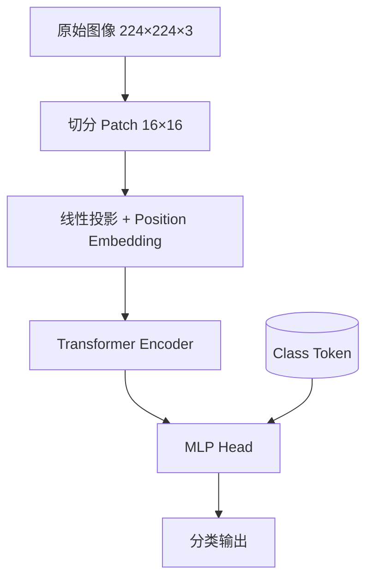
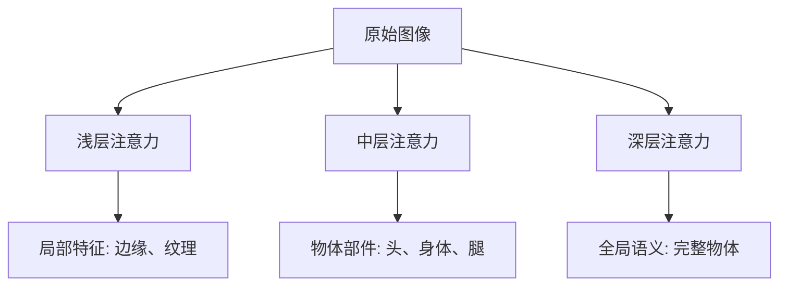
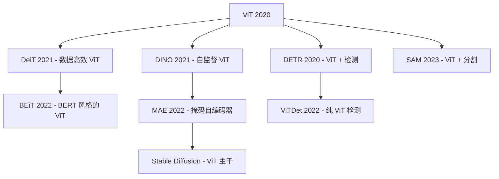

# Vision Transformer (ViT) 深度解读

> **一句话理解**: ViT 就像把图像变成一门外语——把图像切成小块（token），然后用 Transformer 的"翻译"能力来处理图像，从此计算机视觉进入了"注意力时代"。

---

## 论文基本信息

| 属性 | 内容 |
|------|------|
| **核心论文** | An Image is Worth 16x16 Words: Transformers for Image Recognition at Scale |
| **作者** | Alexey Dosovitskiy, Lucas Beyer 等 (Google Research) |
| **发表** | ICLR 2021 (arXiv:2010.11929) |
| **核心贡献** | 将图像切分为 patch 序列，用纯 Transformer 处理，超越 ResNet |
| **影响** | 开启视觉 Transformer 时代，DETR、SAM、DINO 等后续工作的基础 |

---

## 1. 历史背景：为什么需要 ViT？

### 1.1 CNN 的统治地位

```
2012: AlexNet - 深度学习复兴
     ↓
2015: ResNet - 残差连接，更深的网络
     ↓
2017-2020: CNN 一直是视觉任务的主导架构
     - 局部感受野 ✓
     - 平移不变性 ✓
     - 参数效率高 ✓
```

### 1.2 Transformer 在 NLP 的成功

```
2017: Attention Is All You Need - Transformer 诞生
     ↓
2018: BERT - 预训练+微调，称霸 NLP
     ↓
2019-2020: GPT 系列 - scaling up
     ↓
问题: Transformer 在 NLP 这么成功，能用到视觉吗？
```

### 1.3 之前的尝试

| 方法 | 问题 |
|------|------|
| 独立自注意力 | 计算量 O(n²)，难以处理大图像 |
| 局部注意力 | 仍然依赖卷积结构 |
| 跨空间维度 | 效果不如 CNN |

**核心挑战**: 图像的 token 数量远大于文本
- 文本: 一句话约 30-100 个词
- 图像: 224×224 = 50,176 像素，如果是 16×16 patch 也有 196 个

---

## 2. 核心思想：图像 = 16×16 单词

### 2.1 整体流程



### 2.2 图像切分

```
【原始图像】
224 × 224 × 3 (RGB)

【切分为 Patch】
16 × 16 × 3 = 768 像素/块
224 / 16 = 14
14 × 14 = 196 个 Patch

【类比 NLP】
- 文本: "An Image is Worth 16x16 Words"
- Patch 就像单词
- 整个图像就像一句话
```

### 2.3 Patch 嵌入

```
每个 Patch: 16×16×3 = 768 维
    ↓ 线性投影 (Linear)
768 维向量 (和 NLP 的词嵌入一样)

加上 Position Embedding:
[CLS] token + 196 个 patch tokens
```

---

## 3. 模型架构

### 3.1 标准 ViT 架构

```
ViT-B/16:
- Patch size: 16×16
- Hidden size: 768
- MLP size: 3072
- Heads: 12
- Layers: 12
- 参数量: 86M

ViT-L/16:
- Hidden size: 1024
- MLP size: 4096
- Heads: 16
- Layers: 24
- 参数量: 307M

ViT-H/14:
- Hidden size: 1280
- MLP size: 5120
- Heads: 16
- Layers: 32
- 参数量: 632M
```

### 3.2 Transformer Encoder 结构


```
每个 Transformer Block:
1. LayerNorm → Multi-Head Attention → Residual
2. LayerNorm → MLP → Residual

和标准 Transformer 一样！
```

---

## 4. 训练策略

### 4.1 预训练 + 微调

```
ViT 的成功关键: 大规模预训练

【预训练阶段】
- 数据集: JFT-300M (3亿张图片)
- 任务: 图像分类
- 目标: 学习通用视觉表示

【微调阶段】
- 数据集: ImageNet (130万张)
- 任务: 下游分类
- 优势: 只需要少量标签数据
```

### 4.2 在不同数据集上的表现

| 数据集 | ViT-L/16 | BiT-L (CNN) | SOTA |
|--------|---------|------------|------|
| ImageNet | 87.76% | 87.54% | 85.4% |
| CIFAR-100 | 95.55% | 93.51% | - |
| VTAB (19任务) | 76.29% | 76.29% | - |

**关键发现**: ViT 在大模型和大数据时超越 CNN！

### 4.3 Scaling 曲线

```
【小数据】
ImageNet-1K (130万):
- ViT-B: 低于 ResNet
- 原因: Transformer 缺乏 CNN 的归纳偏置

【大数据】
ImageNet-21K (1400万):
- ViT-B: 与 ResNet 持平

【超大数据】
JFT-300M (3亿):
- ViT-B: 大幅超越 ResNet
- ViT-L: 进一步提升
```

---

## 5. 自注意力可视化

### 5.1 注意力权重分布



### 5.2 注意力头的角色

| 层数 | 注意力头行为 | 学的特征 |
|------|------------|---------|
| 1-2 | 局部 patch 交互 | 边缘、纹理、颜色 |
| 3-6 | 部件级别 | 物体部件组合 |
| 7-12 | 全局交互 | 物体级别、关系 |

---

## 6. 为什么 ViT 有效？

### 6.1 归纳偏置对比

| 归纳偏置 | CNN | ViT |
|---------|-----|-----|
| 局部性 | ✓ (卷积核小) | ✗ (全局注意力) |
| 平移不变性 | ✓ | ✗ (位置编码) |
| 层次结构 | ✓ (逐步下采样) | ✗ (统一处理) |

```
CNN 的归纳偏置:
- 局部性: 每个卷积只看局部
- 层次性: 逐层抽象

ViT 的归纳偏置:
- 几乎没有！几乎从零学习一切
- 需要更多数据和计算来弥补
```

### 6.2 ViT 的优势

```
【相比 CNN】
✓ 全局感受野: 直接建模任意位置关系
✓ 可解释性: 注意力权重可视化
✓ 迁移学习好: 预训练模型适用范围广
✓ 多模态友好: 图像和文本统一表示

【缺点】
✗ 需要更多数据
✗ 训练更慢
✗ 缺乏局部感知
```

---

## 7. 后续发展



| 衍生工作 | 核心贡献 |
|---------|---------|
| DeiT | 数据高效训练，用知识蒸馏 |
| DINO | 自监督学习，无需标签 |
| MAE | 掩码图像建模 |
| BEiT | BERT 风格的 ViT 预训练 |
| SAM | 任意物体的分割 |
| Stable Diffusion | ViT-L 作为 VAE 的 decoder |

---

## 8. 核心公式

### 8.1 Patch 嵌入

```
x_p^i = Linear(Flat(Patch_i))

其中:
- Patch_i: 16×16×3 = 768
- Linear: 768 → D (投影)
```

### 8.2 多头自注意力

```
MSA(Q, K, V) = Concat(head_1, ..., head_h) W^O

head_i = Attention(QW_i^Q, KW_i^K, VW_i^V)
       = Softmax(QK^T / √d) V

其中 d = D / h (每个头的维度)
```

### 8.3 Position Embedding

```
三种 position embedding:
1. 1D 固定 (论文用的)
2. 2D 固定
3. 可学习

VIT 用的是 1D 可学习的 position embedding
```

---

## 9. 实战代码

```python
import torch
import torch.nn as nn
from transformers import ViTForImageClassification

# 加载预训练模型
model = ViTForImageClassification.from_pretrained(
    'google/vit-base-patch16-224'
)

# 推理
from PIL import Image
image = Image.open('cat.jpg')
inputs = processor(images=image, return_tensors="pt")
outputs = model(**inputs)
predicted_class = outputs.logits.argmax(-1)
```

---

## 10. 为什么必读？

```
【学术价值】
- 证明了 Transformer 可以用于视觉
- 打破了 CNN 在视觉领域的垄断
- 开启了多模态研究的可能

【工程价值】
- 为 Stable Diffusion 提供骨干网络
- 为 SAM、DINO 等模型奠基
- 统一了 NLP 和 CV 的架构

【思想价值】
- "万物皆可 token"
- "归纳偏置 vs 数据规模"的权衡
- 大模型在多领域的迁移成功
```

---

## 11. 一句话总结

> **ViT 把图像变成了"句子"，让 Transformer 统一了 NLP 和 CV——这不只是架构创新，而是 AI 统一的重要一步。**

---

*本文是 [README.md](./README.md) 的补充，适合想深入理解 ViT 和视觉 Transformer 原理的读者。*
*原始论文: [An Image is Worth 16x16 Words](https://arxiv.org/abs/2010.11929)*

## Related

- [[04_Computer_Vision/README.md|04_Computer_Vision README]]
- [[04_Computer_Vision/3D_Vision/3D_Vision.md|3D_Vision]]
- [[04_Computer_Vision/3D_Vision/3D_Vision_for_dummy.md|3D_Vision_for_dummy]]
- [[04_Computer_Vision/Generative_Models/Generative_Models.md|Generative_Models]]
- [[04_Computer_Vision/Generative_Models/Generative_Models_for_dummy.md|Generative_Models_for_dummy]]
