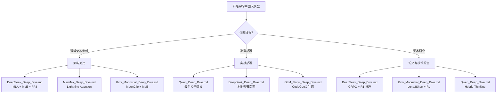

# 中国大模型生态全景 (Chinese LLM Ecosystem)

> **一句话理解**: 中国五大 AI 实验室就像五支风格迥异的"AI 战队"——DeepSeek 用最低成本打败巨头，Qwen 打造最全模型舰队，智谱从学术走向产业，Kimi 靠长上下文杀出重围，MiniMax 用闪电注意力突破百万 Token——它们共同构成了中国大模型的黄金时代。

---

## 五大厂商速览

| **厂商** | **成立时间** | **核心技术** | **旗舰模型** | **总参数** | **最大亮点** | 深度文档 |
|----------|-------------|-------------|-------------|-----------|-------------|---------|
| **DeepSeek** (深度求索) | 2023, 上海 | MLA + MoE + FP8 | DeepSeek-V4 Pro | 1.6T / 49B active | $5.6M 训练出 GPT-4 级模型 | [DeepSeek_Deep_Dive.md](./DeepSeek_Deep_Dive.md) |
| **Qwen** (通义千问) | 2023, 杭州 | Hybrid Thinking + MoE | Qwen3-235B-A22B | 235B / 22B active | 119 种语言 + 思考/直答双模 | [Qwen_Deep_Dive.md](./Qwen_Deep_Dive.md) |
| **GLM/智谱 AI** | 2019, 北京 | GLM 框架 + MoE | GLM-4.5 | 355B / 32B active | 清华血统 + 全栈 Agent 生态 | [GLM_Zhipu_Deep_Dive.md](./GLM_Zhipu_Deep_Dive.md) |
| **Kimi/月之暗面** | 2023, 北京 | MuonClip + MoE + MLA | Kimi K2 | 1.04T / 32.6B active | 万亿参数开源 Agentic 模型 | [Kimi_Moonshot_Deep_Dive.md](./Kimi_Moonshot_Deep_Dive.md) |
| **MiniMax** (稀宇科技) | 2021, 上海 | Lightning Attention + MoE | MiniMax-Text-01 / M2.5 | 456B / 45.9B active | 百万 Token 上下文 + 全模态 | [MiniMax_Deep_Dive.md](./MiniMax_Deep_Dive.md) |

---

## 旗舰模型 Benchmark 对比

### 推理与数学

| **Benchmark** | **DeepSeek-R1** | **DeepSeek-V3** | **Qwen3-235B** | **GLM-4.5** | **Kimi K2** | **MiniMax-Text-01** |
|---------------|----------------|----------------|---------------|-------------|-------------|-------------------|
| **MMLU** | — | 88.5 | ~88 | 83.3* | 89.5 | ~87 |
| **MMLU-Pro** | — | 75.9 | — | 84.6 | — | — |
| **AIME 2024** | 79.8% | 39.2 | — | 91.0 | 69.6 | — |
| **MATH-500** | 97.3% | 90.2 | — | 98.2 | — | — |
| **GPQA Diamond** | 71.5% | — | — | — | 75.1 | — |

*GLM-4 0520 的 MMLU 分数，GLM-4.5 的 MMLU-Pro 为 84.6

### 代码与工程

| **Benchmark** | **DeepSeek-V3** | **Qwen3-235B** | **GLM-4.5** | **Kimi K2** | **MiniMax-M2.5** |
|---------------|----------------|---------------|-------------|-------------|-----------------|
| **HumanEval** | 82.6 | — | — | — | — |
| **SWE-bench Verified** | — | — | 64.2 | 65.8 | **80.2** |
| **Aider-Polyglot** | — | — | — | 60.0 | — |
| **LiveCodeBench v6** | — | — | — | 53.7 | — |

### Agent 能力

| **Benchmark** | **GLM-4.5** | **Kimi K2** | **MiniMax-M2.5** |
|---------------|-------------|-------------|-----------------|
| **τ-bench** | 70.1 | ~66.1 | — |
| **BFCL-v3** | 77.8 | — | — |
| **ACEBench** | — | 76.5 | — |
| **BrowseComp** | 26.4% | — | — |

---

## 模型家族规模对比

```
DeepSeek  ████████████████████████████████  17+ 模型 (V1 → V4, R1, Coder, VL, Janus, OCR)
Qwen      ████████████████████████████████  20+ 模型 (Qwen1 → Qwen3, VL, Audio, Coder, Math, QwQ)
GLM       ██████████████████████████        15+ 模型 (GLM-130B → GLM-4.5, CogVLM, CodeGeeX, AutoGLM)
Kimi      ████████████                      5 模型 (moonshot-v1, k1.5, K2, K2.5)
MiniMax   ██████████████████████████        15+ 模型 (abab, Text-01, M1-M2.7, Hailuo, Speech, Music)
```

---

## 核心技术路线对比

### 注意力机制

| **厂商** | **注意力方案** | **复杂度** | **最大上下文** |
|----------|---------------|-----------|--------------|
| DeepSeek | **MLA** (Multi-head Latent Attention) | O(n·d²) KV cache 压缩 95% | 1M (V4) |
| Qwen | **GQA** (Group Query Attention) | O(n·d²) 标准 + RoPE 扩展 | 128K |
| GLM | **GQA** + 2D 位置编码 | O(n·d²) 标准 | 128K |
| Kimi | **MLA** (Multi-head Latent Attention) | O(n·d²) KV cache 压缩 | 128K |
| MiniMax | **Lightning Attention** (线性 + Softmax 混合) | O(n) 线性 | **4M** (推理外推) |

### MoE 架构

| **厂商** | **总参数** | **激活参数** | **专家数** | **路由策略** |
|----------|-----------|-------------|-----------|-------------|
| DeepSeek V4 | 1.6T | 49B | 256 | Top-8 + 共享专家 |
| Qwen3 | 235B | 22B | 128 | Top-8 |
| GLM-4.5 | 355B | 32B | — | MoE + 共享专家 |
| Kimi K2 | 1.04T | 32.6B | 384 | Top-8 + 1 共享 |
| MiniMax M2.5 | 230B | 10B | — | 稀疏 MoE |

### 训练成本对比

| **模型** | **训练数据** | **GPU 资源** | **估算成本** |
|----------|-------------|-------------|-------------|
| DeepSeek-V3 | 14.8T tokens | 2,048 H800 | **$5.6M** |
| DeepSeek-R1 | V3 基础 + RL | H800 集群 | ~$294K (RL) |
| Qwen3 | 36T tokens | 大规模集群 | 未公开 |
| GLM-4.5 | 22T tokens (15T+7T) | 大规模集群 | 未公开 |
| Kimi K2 | 15.5T tokens | 大规模集群 | 未公开 |
| MiniMax-01 | 大规模 | 大规模集群 | 未公开 |

---

## 开源生态对比

| **厂商** | **开源许可** | **HuggingFace 模型数** | **GitHub Stars** | **社区微调** |
|----------|-------------|---------------------|-----------------|------------|
| DeepSeek | MIT / DeepSeek License | 50+ | 90K+ (DeepSeek-LLM) | 极活跃 |
| Qwen | Apache 2.0 | 100+ | 15K+ (Qwen) | 极活跃 |
| GLM | Apache 2.0 / 智谱 License | 40+ | 12K+ (ChatGLM3) | 活跃 |
| Kimi | Apache 2.0 | 10+ | 5K+ (Kimi-K2) | 快速增长 |
| MiniMax | Apache 2.0 | 20+ | 3K+ (MiniMax-01) | 增长中 |

---

## 学习路径



**推荐阅读顺序**:
1. 先读本文的对比表格，建立全局视野
2. 选择感兴趣的厂商，深入其 Deep Dive 文档
3. 参考 [../LLM_Architectures/MoE_Case_Studies_DeepSeek_Mixtral.md](../LLM_Architectures/MoE_Case_Studies_DeepSeek_Mixtral.md) 了解 MoE 共性
4. 参考 [../Long_Context_Models_2026.md](../Long_Context_Models_2026.md) 了解长上下文技术

---

## 前置知识 (Prerequisites)

- **必修**: [../LLM_Architectures/LLM_Architectures.md](../LLM_Architectures/LLM_Architectures.md) — 理解 Transformer、MoE、GQA 等基础架构
- **推荐**: [../LLM_Architectures/MoE_Case_Studies_DeepSeek_Mixtral.md](../LLM_Architectures/MoE_Case_Studies_DeepSeek_Mixtral.md) — MoE 路由与负载均衡
- **推荐**: [../../22_Papers/Mixture_of_Experts_Deep_Dive.md](../../22_Papers/Mixture_of_Experts_Deep_Dive.md) — MoE 论文解读
- **可选**: [../Reasoning_Models/DeepSeek_R1_Technical_Analysis.md](../Reasoning_Models/DeepSeek_R1_Technical_Analysis.md) — 推理模型深度分析

---

## 关键术语速查 (Key Terms)

- **MLA (Multi-head Latent Attention)**: 多头潜在注意力，通过低秩压缩减少 KV Cache 95%
- **Lightning Attention**: 闪电注意力，线性复杂度 O(n) 处理超长序列
- **GRPO (Group Relative Policy Optimization)**: 分组相对策略优化，无需 Critic 的 RL 算法
- **MuonClip**: Kimi K2 的优化器，结合 Muon + QK-Clip 稳定训练
- **Hybrid Thinking**: 混合思考模式，在深度推理和快速响应间动态切换
- **FP8 Training**: 8 位浮点训练，内存减半速度翻倍
- **MTP (Multi-token Prediction)**: 多 Token 预测，提升训练吞吐量
- **Long2Short**: Kimi k1.5 的方法，将长 CoT 能力迁移到短回答

---

*Last updated: 2026-06-01*
