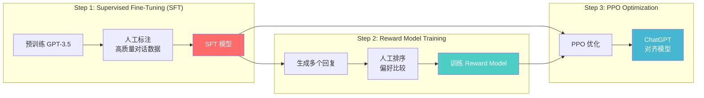
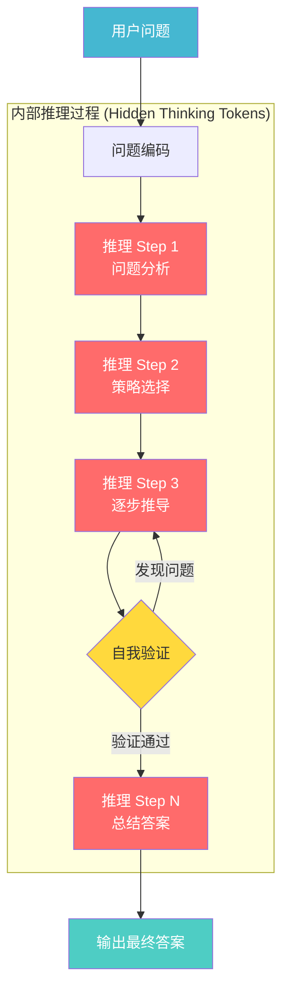
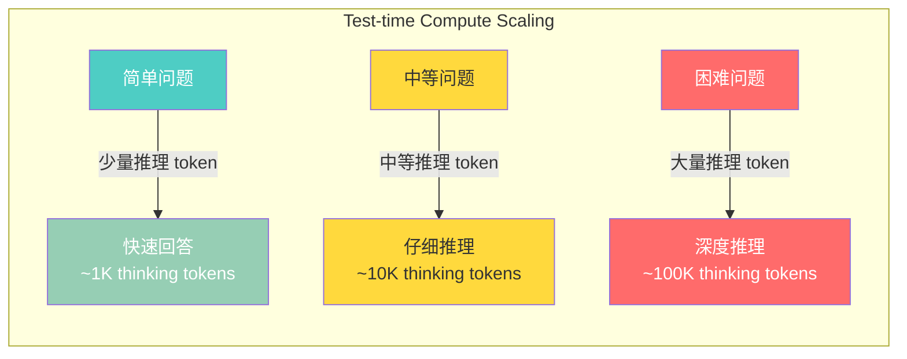
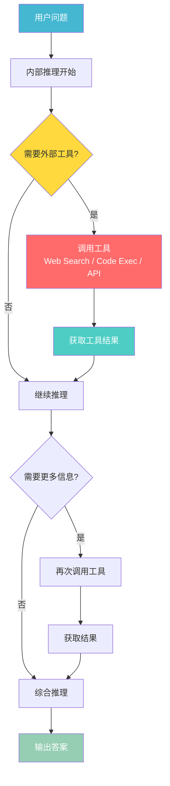
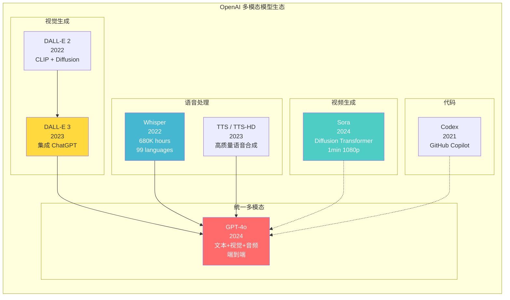
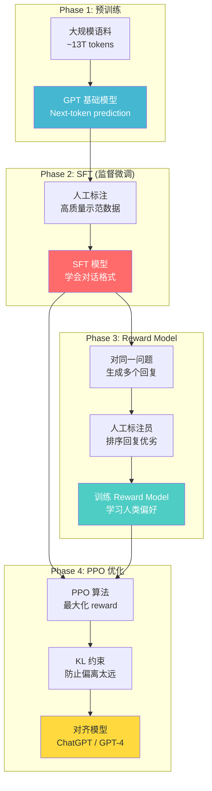

# OpenAI 技术深度解析 — 从 GPT-3 到 o3 的完整演进之路

## 一句话理解

OpenAI 就像一位"不断进化的全能学者"——从 GPT-3 的"死记硬背但见多识广"(175B 参数 In-context Learning)，到 GPT-4 的" multimodal 博士"(~1.7T MoE + 视觉理解)，再到 o3 的"会慢思考的数学家"(RL 推理 + 99.8 percentile Codeforces)，每一步都在重新定义 AI 的能力边界。

---

## 目录

1. [公司概述与历史](#一公司概述与历史)
2. [完整模型家族时间线](#二完整模型家族时间线)
3. [GPT 架构演进 (GPT-3 → GPT-4 → GPT-4.1)](#三gpt-架构演进)
4. [推理模型系列 (o1 → o3 → o4-mini)](#四推理模型系列)
5. [多模态模型生态 (DALL-E / Whisper / Sora / GPT-4o)](#五多模态模型生态)
6. [关键技术创新](#六关键技术创新)
7. [Benchmark 对比分析](#七benchmark-对比分析)
8. [API 生态与开发者工具](#八api-生态与开发者工具)
9. [硬件基础设施](#九硬件基础设施)
10. [与其他模型系列的对比](#十与其他模型系列的对比)
11. [未来展望](#十一未来展望)
12. [参考资源](#参考资源)
13. [相关文档](#相关文档)

---

## 一、公司概述与历史

### 1.1 定位

```
OpenAI
═══════════════════════════════════════════════════════════════════

定位: 全球最具影响力的 AI 研究与产品公司，AGI 赛道领跑者

核心理念:
───────────────────────────────────────────────────────────────────
• 使命驱动: 确保 AGI (通用人工智能) 造福全人类
• Scaling Laws 信仰者: 坚信更大的模型 + 更多数据 = 更强能力
• 产品化先锋: 从研究论文到 ChatGPT 的现象级产品落地
• 安全与能力并重: RLHF 对齐、System Cards、红队测试
• 生态构建者: API 平台 + ChatGPT + 企业解决方案
```

### 1.2 公司背景

| 维度 | 详情 |
|------|------|
| **公司** | OpenAI, Inc. |
| **CEO** | Sam Altman |
| **总部** | 美国旧金山 (San Francisco) |
| **成立** | 2015 年 12 月 |
| **创始成员** | Sam Altman, Elon Musk, Greg Brockman, Ilya Sutskever, Wojciech Zaremski, John Schulman 等 |
| **组织结构** | 2015-2019: 非营利 → 2019 至今: "Capped-profit" (有限利润) |
| **主要投资方** | Microsoft ($13B+), Thrive Capital, a16z, Sequoia 等 |
| **核心产品** | ChatGPT, OpenAI API, DALL-E, Whisper, Sora |
| **用户规模** | ChatGPT 周活跃用户 200M+ (2025) |

### 1.3 OpenAI 的组织结构演变

```
OpenAI 组织结构变迁
═══════════════════════════════════════════════════════════════════

2015 ──── OpenAI 成立 (非营利)
           │  目标: 确保 AGI 造福全人类
           │  资金: $1B 承诺捐赠
           │
2019 ──── 转型为 "Capped-Profit" (有限利润)
           │  原因: 需要巨额计算资源，纯非营利无法支撑
           │  结构: OpenAI LP (有限利润子公司)
           │        利润上限: 100x 投资回报
           │  Microsoft 首投 $1B
           │
2023 ──── Microsoft 追加投资至 $13B+
           │  Sam Altman 短暂被解雇又回归 ("Board Crisis")
           │  新董事会重组
           │
2024 ──── 进一步结构改革
           │  考虑转为完全营利性公司 (Public Benefit Corp)
           │  估值突破 $80B
           │
2025 ──── 持续扩张
           │  ChatGPT 200M+ 周活跃用户
           │  年化收入估计 $12B+
```

### 1.4 OpenAI 在 LLM 格局中的定位

OpenAI 是闭源大模型领域的绝对领跑者。GPT-3 开创了 In-context Learning 范式，ChatGPT 引爆了 AI 大众化浪潮，GPT-4 树立了多模态标杆，o 系列则开辟了"推理模型"新赛道。

```
全球 LLM 格局 (2025-2026)

┌──────────────────────────────────────────────────────────────┐
│                    闭源 (Closed Source)                       │
│                                                              │
│  OpenAI (本文):         Google:              Anthropic:      │
│  ├── GPT-4/4o/4.1      ├── Gemini 2.5 Pro   ├── Claude 4    │
│  ├── o1/o3/o4-mini     ├── Gemini 2.5 Flash  └── Claude 4.5 │
│  ├── DALL-E / Sora     └── Imagen / Veo                     │
│  └── Whisper                                                  │
├──────────────────────────────────────────────────────────────┤
│                    开源 (Open Source)                         │
│                                                              │
│  西方阵营:                  中国阵营:                          │
│  ├── Llama (Meta)         ├── DeepSeek (深度求索)            │
│  ├── Mistral/Mixtral      ├── Qwen (阿里通义千问)            │
│  └── OLMo (AI2)           ├── GLM (智谱清言)                 │
│                            └── Kimi (月之暗面)                │
└──────────────────────────────────────────────────────────────┘
```

### 1.5 OpenAI 的六大技术哲学

1. **Scaling Laws 至上**: 坚信模型规模是能力涌现的核心驱动力，GPT-3 (175B) → GPT-4 (~1.7T MoE) 持续扩大
2. **RLHF 对齐革命**: 率先将人类反馈强化学习大规模应用，让模型"有用、无害、诚实"
3. **产品驱动研究**: 从 GPT-3 API 到 ChatGPT，研究成果快速转化为亿级用户产品
4. **多模态统一**: 从单一文本到文本+视觉+音频+视频的全面融合
5. **推理新范式**: o 系列证明了"让模型多想想"可以指数级提升复杂任务性能
6. **安全研究并行**: System Cards、红队测试、超级对齐团队 (后解散)，能力与安全并行推进

> **相关文档**: 关于 LLM 架构范式的基础介绍，参见 [LLM Architectures](../LLM_Architectures/LLM_Architectures.md)

---

## 二、完整模型家族时间线

### 2.1 时间线图 (Timeline)

```mermaid
timeline
    title OpenAI 模型家族演进时间线
    section 2020
        GPT-3 : 2020-06 : 175B Dense Transformer, In-context Learning
    section 2021
        DALL-E : 2021-01 : CLIP-guided text-to-image
        Codex : 2021-08 : Code generation, powers GitHub Copilot
    section 2022
        InstructGPT : 2022-01 : RLHF alignment pioneer
        DALL-E 2 : 2022-04 : Diffusion-based image generation
        Whisper : 2022-09 : 680K hours, 99 languages ASR
        ChatGPT (GPT-3.5) : 2022-11 : Sparked the AI revolution
    section 2023 H1
        GPT-4 : 2023-03 : ~1.7T MoE, multimodal, MMLU 86.4%
        GPT-4 (8K→32K) : 2023-06 : Extended context window
        DALL-E 3 : 2023-09 : Integrated with ChatGPT
    section 2023 H2
        GPT-4 Turbo : 2023-11 : 128K context, cheaper API
    section 2024 H1
        GPT-4o : 2024-05 : Native multimodal omni model
        GPT-4o (update) : 2024-08 : Improved performance
    section 2024 H2
        o1-preview : 2024-09 : Reasoning model, AIME 83.3%
        o1-mini : 2024-09 : Fast cheaper reasoning
        Sora (preview) : 2024-12 : Text-to-video diffusion transformer
        o1 (full) : 2024-12 : Full reasoning model, MMLU 92.3%
    section 2025 H1
        o3-mini : 2025-01 : Compact reasoning, adjustable effort
        GPT-4.5 : 2025-02 : Broad knowledge generalist
        o3 : 2025-04 : Most powerful reasoning, GPQA 87.7%
        o4-mini : 2025-04 : Fast agentic reasoning
        GPT-4.1 : 2025-04 : 1M context, coding-focused
    section 2026
        GPT-5 : Expected : Next generation (未发布)
```



### 2.2 模型参数与能力演进表

| 发布时间 | 模型 | 参数规模 (估算) | 架构 | 上下文 | 关键创新 |
|---------|------|--------------|------|--------|---------|
| 2020-06 | **GPT-3** | **175B** | Dense Transformer | 2K | In-context Learning, Few-shot |
| 2021-01 | DALL-E | ~3.5B | VQ-VAE + Transformer | — | CLIP-guided text-to-image |
| 2021-08 | Codex | 12B | GPT-3 fine-tuned on code | 4K | GitHub Copilot 基础 |
| 2022-01 | InstructGPT | 1.3B-175B | RLHF fine-tuned GPT-3 | 4K | RLHF 对齐范式开创 |
| 2022-04 | DALL-E 2 | ~3.5B | CLIP + Diffusion | — | Prior + Diffusion decoder |
| 2022-09 | Whisper | 39M-1.55B | Encoder-Decoder | — | 680K 小时多语言 ASR |
| 2022-11 | **ChatGPT (GPT-3.5)** | **~175B** | Dense + RLHF | 4K→16K | AI 革命引爆点 |
| 2023-03 | **GPT-4** | **~1.7T MoE** | **MoE (8×220B)** | **8K→128K** | 多模态, MMLU 86.4%, Bar 90th |
| 2023-11 | GPT-4 Turbo | ~1.7T MoE | MoE | 128K | 更强指令跟随, 更便宜 |
| 2024-05 | **GPT-4o** | 未公开 | 原生多模态 | 128K | 端到端文本+音频+视觉 |
| 2024-07 | GPT-4o mini | 未公开 | 小型高效 | 128K | 替代 GPT-3.5 Turbo |
| 2024-09 | **o1-preview** | 未公开 | 推理 + CoT | 128K | RL 推理, AIME 83.3% |
| 2024-09 | o1-mini | 未公开 | 轻量推理 | 128K | 快速低成本推理 |
| 2024-12 | **o1 (full)** | 未公开 | 推理 + CoT | 200K | MMLU 92.3%, SWE-bench 48.9% |
| 2024-12 | Sora | 未公开 | Diffusion Transformer | — | 1 分钟 1080p 视频 |
| 2025-01 | o3-mini | 未公开 | 轻量推理 | 200K | 可调推理力度 (low/med/high) |
| 2025-02 | GPT-4.5 | 未公开 (最大非推理) | Dense/MoE | 128K | 广博知识, 写作质量提升 |
| 2025-04 | **o3** | 未公开 | 推理 + CoT | 200K | GPQA 87.7%, Codeforces 99.8%ile |
| 2025-04 | **o4-mini** | 未公开 | 轻量推理 + Tool use | 200K | AIME 95.8%, 原生工具调用 |
| 2025-04 | **GPT-4.1** | 未公开 | 长上下文优化 | **1M** | 1M token, 编码+指令跟随增强 |

### 2.3 模型命名规则

```
OpenAI 模型命名体系
═══════════════════════════════════════════════════════════════════

GPT 系列 (通用语言模型):
  GPT-4o
  │   │
  │   └── o = "omni" (全模态)
  └────── GPT-4 = 第四代 Generative Pre-trained Transformer

  GPT-4.1 mini
  │   │   │
  │   │   └── mini = 小型高效版
  │   └────── 4.1 = 第 4.1 代 (长上下文优化)
  └────────── GPT = 品牌系列

  GPT-4 Turbo
  │   │   │
  │   │   └── Turbo = 增强性能 + 降低价格
  │   └────── 4 = 第四代
  └────────── GPT = 品牌系列

o 系列 (推理模型):
  o3-mini
  │  │
  │  └── mini = 轻量快速版
  └───── o3 = 第三代推理模型 (o → o1 → o3, 跳过 o2 避免与 O2 电信冲突)

  o4-mini
  │  │
  │  └── mini = 轻量快速版
  └───── o4 = 第四代推理模型

多模态模型:
  DALL-E 3    → 文本到图像
  Whisper     → 语音识别
  Sora        → 文本到视频
  Codex       → 代码生成
```

---

## 三、GPT 架构演进

### 3.1 GPT-3: In-context Learning 的开创者 (2020)

GPT-3 是 OpenAI 真正奠定行业地位的里程碑。它证明了足够大的 Decoder-only Transformer 可以通过 **In-context Learning** (上下文学习) 在无需微调的情况下完成各种任务。

#### 3.1.1 架构参数

```
GPT-3 (davinci) 架构参数
═══════════════════════════════════════════════════════════════════

  总参数量:        175 Billion
  架构:            Decoder-only Transformer
  层数:            96
  隐藏维度:        12,288
  注意力头数:      96
  每头维度:        128
  上下文窗口:      2,048 tokens
  词表大小:        50,257 (BPE)
  位置编码:        Learned Absolute Positional Embeddings
  训练数据:        ~300B tokens (CommonCrawl, Wikipedia, Books, WebText)
  训练计算:        ~3.14 × 10²³ FLOPs
  训练成本:        ~$4.6M (按当时 A100 价格估算)
```

#### 3.1.2 In-context Learning 范式

GPT-3 最重要的发现是 **emergent in-context learning** — 模型可以从 prompt 中的少量示例学习任务，而不需要梯度更新：

```
In-context Learning 示例
═══════════════════════════════════════════════════════════════════

Zero-shot (零样本):
  Prompt: "Translate English to French: 'Hello, how are you?' →"
  Output: "Bonjour, comment allez-vous?"

One-shot (单样本):
  Prompt: "Translate English to French:
           'Good morning' → 'Bonjour'
           'How are you?' →"
  Output: "Comment allez-vous?"

Few-shot (少样本):
  Prompt: "Translate English to French:
           'Good morning' → 'Bonjour'
           'Thank you' → 'Merci'
           'Good night' → 'Bonne nuit'
           'How are you?' →"
  Output: "Comment allez-vous?"

关键洞察: 模型没有更新权重！它只是在 context 中"理解"了任务。
```

> **相关文档**: GPT-3 的详细论文分析，参见 [GPT-3 Deep Dive](../../22_Papers/GPT3_Deep_Dive.md)

### 3.2 GPT-3.5 / ChatGPT: AI 革命的引爆点 (2022)

GPT-3.5 系列的核心突破不在于架构，而在于 **RLHF (Reinforcement Learning from Human Feedback)** 对齐训练，使模型从"能力强大但不可控"变为"有用且安全的对话助手"。

#### 3.2.1 RLHF 训练流程



#### 3.2.2 GPT-3.5 系列变体

| 变体 | 上下文 | 特点 | 用途 |
|------|--------|------|------|
| `gpt-3.5-turbo` | 4K→16K | 基础对话模型 | ChatGPT 主力 |
| `gpt-3.5-turbo-instruct` | 4K | 类 GPT-3 completions | 传统 API 兼容 |
| `gpt-3.5-turbo-16k` | 16K | 扩展上下文 | 长文档处理 |

### 3.3 GPT-4: 多模态旗舰 (2023)

GPT-4 是 OpenAI 首次公开承认使用了 **Mixture of Experts (MoE)** 架构的模型（尽管未公布具体细节，但业界广泛推测其结构）。它也是首个支持**多模态输入**（文本+图像）的 GPT 模型。

#### 3.3.1 推测架构 (基于业界分析)

```
GPT-4 推测架构参数 (SemiAnalysis / 业界分析)
═══════════════════════════════════════════════════════════════════

  总参数量:        ~1.76 Trillion (MoE)
  专家数量:        8 组专家 (Experts)
  每专家参数:      ~220 Billion
  激活专家数:      2 (每 token 激活 2 个专家)
  激活参数量:      ~280B per token (估算)
  架构:            MoE Decoder-only Transformer
  层数:            ~120 (估算)
  上下文窗口:      8K → 32K → 128K (逐步扩展)
  词表大小:        ~100K (估算, 含多模态 token)
  位置编码:        RoPE (Rotary Position Embedding) — 推测
  训练数据:        ~13T tokens (估算)
  训练计算:        ~2.15 × 10²⁵ FLOPs (估算)
  训练成本:        ~$78-100M+ (按 A100 集群估算)
  硬件:            ~25,000 A100 GPUs (Azure)
```

#### 3.3.2 MoE 推理效率

```mermaid
graph TB
    Input[输入 Token] --> Router[Router Network<br/>门控网络]

    Router -->|"Top-2 路由"| E1[Expert 1<br/>~220B]
    Router -->|"Top-2 路由"| E2[Expert 2<br/>~220B]
    Router -.->|"不激活"| E3[Expert 3<br/>~220B]
    Router -.->|"不激活"| E4["..."]
    Router -.->|"不激活"| E8[Expert 8<br/>~220B]

    E1 --> WeightedSum[加权求和<br/>y = g₁·E₁(x) + g₂·E₂(x)]
    E2 --> WeightedSum

    WeightedSum --> Output[输出]

    subgraph "GPT-4 MoE (推测): 8 Experts, Top-2 Routing"
        Router
        E1
        E2
        E3
        E4
        E8
    end

    style Router fill:#ff6b6b,color:#fff
    style E1 fill:#4ecdc4,color:#fff
    style E2 fill:#4ecdc4,color:#fff
    style E3 fill:#ddd,color:#999
    style E4 fill:#ddd,color:#999
    style E8 fill:#ddd,color:#999
    style WeightedSum fill:#45b7d1,color:#fff
```

**MoE vs Dense 对比**:

| 维度 | Dense (GPT-3, 175B) | MoE (GPT-4, ~1.7T) |
|------|---------------------|---------------------|
| 总参数 | 175B | ~1,760B |
| 每 token 激活参数 | 175B (全部) | ~280B (仅 2/8 专家) |
| 推理 FLOPs/token | ~350B | ~560B |
| 知识容量 | 175B 级 | 1.7T 级 (全部专家存储知识) |
| 训练成本 | ~$5M | ~$100M |
| 显存需求 | ~350 GB (FP16) | ~3.5 TB (FP16) |

> **相关文档**: MoE 架构的详细技术分析，参见 [Mixture of Experts Deep Dive](../../22_Papers/Mixture_of_Experts_Deep_Dive.md)

#### 3.3.3 GPT-4 能力突破

| 能力维度 | GPT-3.5 | GPT-4 | 提升幅度 |
|---------|---------|-------|---------|
| MMLU (综合知识) | ~70% | 86.4% | +16.4% |
| Bar Exam (法律) | 10th percentile | 90th percentile | +80 百分位 |
| SAT Math | ~500 (估算) | 700/800 | +200 分 |
| GRE Writing | ~3.5 | 4/6 | +0.5 |
| 多模态理解 | 无 | 支持图像输入 | 全新能力 |
| 上下文长度 | 4K-16K | 8K-128K | 8-32× |
| 指令跟随 | 良好 | 优秀 | 显著提升 |

### 3.4 GPT-4o: 原生多模态统一 (2024)

GPT-4o ("o" = omni) 是 OpenAI 首个**端到端原生多模态**模型。不同于 GPT-4 的"文本模型 + 视觉编码器"管线方案，GPT-4o 在训练阶段就同时处理文本、音频和视觉数据。

#### 3.4.1 架构范式转变

```
GPT-4 vs GPT-4o 多模态架构对比
═══════════════════════════════════════════════════════════════════

GPT-4 (Pipeline 方案):
───────────────────────────────────────────────────────────────────

  用户语音 → Whisper (ASR) → 文本 → GPT-4 (文本模型) → 文本 → TTS → 语音回复
  用户图片 → CLIP/ViT Encoder → embedding → GPT-4 (处理文本+图像 token)

  问题:
  ❌ 多个独立模型，延迟高 (2-3 秒语音交互延迟)
  ❌ 音频信息丢失 (语气、情感、口音)
  ❌ 各模块独立训练，非全局最优

GPT-4o (Native Multimodal 方案):
───────────────────────────────────────────────────────────────────

  用户语音 ──┐
  用户图片 ──┼→ GPT-4o (单一端到端模型) ──→ 文本/语音回复
  用户文本 ──┘

  优势:
  ✅ 单一模型，延迟极低 (320ms 语音交互延迟)
  ✅ 保留音频原始信息 (语气、情感、停顿)
  ✅ 端到端训练，全局最优
  ✅ 2× 更快, 50% 更便宜 (vs GPT-4 Turbo)
```

#### 3.4.2 GPT-4o 关键指标

| 指标 | GPT-4 Turbo | GPT-4o | 变化 |
|------|-------------|--------|------|
| 速度 | 基线 | 2× 更快 | +100% |
| API 价格 | $10/1M input | $5/1M input | -50% |
| MMLU | ~86% | ~88% | +2% |
| 语音延迟 | 2-3 秒 | 320 毫秒 | -85% |
| 上下文 | 128K | 128K | 持平 |
| 多模态 | 文本+图像输入 | 文本+图像+音频输入/输出 | 全模态 |

### 3.5 GPT-4.1: 百万上下文编码专家 (2025)

GPT-4.1 是 OpenAI 首个支持 **1M (百万) token 上下文窗口**的模型，专为长文档处理和大型代码库理解优化。

#### 3.5.1 GPT-4.1 系列

| 变体 | 上下文 | 定位 | 优势 |
|------|--------|------|------|
| **GPT-4.1** | 1M tokens | 旗舰长上下文模型 | 编码+指令跟随最佳 |
| **GPT-4.1 mini** | 1M tokens | 性价比平衡 | 中等任务 |
| **GPT-4.1 nano** | 1M tokens | 超低成本 | 简单任务, 嵌入式 |

#### 3.5.2 上下文长度对比

```
OpenAI 模型上下文窗口演进
═══════════════════════════════════════════════════════════════════

GPT-3 (2020):      ██                          2,048 tokens
GPT-3.5 (2022):    ████                        4,096 tokens → 16K
GPT-4 (2023):      ████████                    8K → 32K → 128K
GPT-4 Turbo (2023): ████████                   128K
GPT-4o (2024):     ████████                    128K
o1 (2024):         ████████████                200K
GPT-4.1 (2025):    ██████████████████████████████████  1,000,000 tokens ← 1M!

参考:
  1 token ≈ 4 字符 (英文) 或 ≈ 1-2 个汉字
  1M tokens ≈ 750,000 英文单词 ≈ 2,000 页文档 ≈ 3-5 个中型代码库
```

### 3.6 GPT-4.5: 广博知识通才 (2025)

GPT-4.5 是 OpenAI 定位为"broad knowledge generalist"的最大非推理模型。

#### 3.6.1 设计理念

```
GPT-4.5 设计哲学
═══════════════════════════════════════════════════════════════════

传统 Scaling:
  更多数据 + 更多计算 → 更大模型 → 更强能力

GPT-4.5 理念:
  更大规模 + 更高质量数据 + 改进训练方法
    → 更好的 "世界模型" (world model)
    → 更自然的写作风格
    → 更准确的知识和更少的幻觉
    → 更好的 tone 和 personality

定位: 最大的非推理 (non-reasoning) 模型
  → 不追求数学竞赛/代码挑战的极致
  → 追求日常任务的质量、准确性和自然度
```

---

## 四、推理模型系列

### 4.1 从"快思考"到"慢思考"

OpenAI 的 o 系列推理模型代表了 LLM 领域的范式转变——从直接生成答案的"System 1"模式，转向先生成内部推理链再得出结论的"System 2"模式。

```
传统 LLM vs 推理模型
═══════════════════════════════════════════════════════════════════

传统 LLM (GPT-4, GPT-4o):    System 1 — 快思考
───────────────────────────────────────────────────────────────────
  输入 → [Transformer 前向传播] → 直接输出答案
  特点: 速度快，但对复杂推理容易出错

  例: "25 的平方根加上 17 的质因数个数等于？"
  → "5 + 2 = 7" (可能跳过 17 的因数验证)

推理模型 (o1, o3):            System 2 — 慢思考
───────────────────────────────────────────────────────────────────
  输入 → [内部推理链 (隐藏 CoT tokens)] → 输出答案
         ├── 分解问题
         ├── 逐步推理
         ├── 自我检查
         ├── 回溯修正
         └── 确认答案
  特点: 慢但准确，推理 token 对用户不可见

  例: 同上问题
  → 内部: "25 的平方根 = 5... 17 是质数，所以只有 1 个质因数(自身)
          ... 但题目说'质因数个数'，17 的质因数只有 17 本身，所以是 1
          ... 5 + 1 = 6"
  → 输出: "6"
```

> **相关文档**: o 系列推理模型的深入技术分析，参见 [o1-Class Reasoning Models](../Reasoning_Models/o1_Class_Reasoning_Models.md)

### 4.2 o1: 推理模型的开山之作 (2024.09 / 2024.12)

#### 4.2.1 核心技术原理



#### 4.2.2 RL 训练推理能力

o1 的核心创新是使用**强化学习**训练模型生成高质量的内部推理链：

```
o1 的 RL 训练流程 (推测)
═══════════════════════════════════════════════════════════════════

1. 基础模型 (GPT-4 级)
   ↓
2. 推理数据冷启动
   - 高质量人工标注的思维链数据
   - 数学/编程/科学推理步骤
   ↓
3. RL 强化学习 (核心!)
   - 奖励模型: 评估推理步骤质量
   - 结果奖励: 最终答案是否正确
   - 过程奖励: 中间步骤是否合理 (Process Reward Model)
   - 探索策略: 鼓励尝试不同推理路径
   ↓
4. 推理能力涌现
   - 自我纠错: 发现错误后回溯修正
   - 策略切换: 一种方法行不通时尝试另一种
   - 分解问题: 将复杂问题拆解为子问题
   - 验证答案: 用不同方法交叉验证
```

#### 4.2.3 o1 vs o1-preview vs o1-mini

| 变体 | 发布时间 | AIME 2024 | GPQA Diamond | MMLU | 定位 |
|------|---------|-----------|-------------|------|------|
| o1-preview | 2024-09 | 83.3% | — | — | 预览版 |
| o1 (full) | 2024-12 | 83.3% | 78.3% | 92.3% | 完整推理模型 |
| o1-mini | 2024-09 | — | 77.0-79.7% | — | 快速低成本 |

### 4.3 o3: 推理能力的巅峰 (2025)

o3 是截至 2025 年 4 月 OpenAI 最强大的推理模型，在多个高难度基准上达到了前所未有的成绩。

#### 4.3.1 o3 核心突破

| 基准测试 | o1 | o3 | 提升 | 含义 |
|---------|-----|-----|------|------|
| GPQA Diamond | 78.3% | **87.7%** | +9.4% | PhD 级科学问题 |
| AIME 2024 | 83.3% | **96.7%** | +13.4% | 高中数学竞赛 |
| Codeforces | 47.3%ile | **99.8%ile** | +52.5%ile | 编程竞赛排名 |
| SWE-bench | 48.9% | **71.7%** | +22.8% | 真实 GitHub issue 修复 |
| FrontierMath | — | **25.2%** | 新基准 | 前沿数学问题 |
| ARC-AGI | — | **87.5%** | 新基准 | 通用智能测试 |

#### 4.3.2 o3 的测试时计算扩展



**核心公式**:

```
传统 LLM:  性能 = f(参数量, 训练计算量)
o3:        性能 = f(参数量, 训练计算量, 测试时计算量)
                                      ↑
                               新增的关键维度!
```

测试时计算 (Test-time Compute) 包括：
- 生成的隐藏推理 token 数量
- 自我验证和纠错的轮次
- 尝试的不同策略数量
- 回溯和修正的深度

### 4.4 o4-mini: 快速推理 + 原生工具调用 (2025)

o4-mini 是 o 系列的最新轻量级推理模型，其最大创新是在推理过程中可以**原生调用外部工具**。

#### 4.4.1 推理中工具调用 (Tool Use During Reasoning)



#### 4.4.2 o4-mini 关键指标

| 指标 | o1-mini | o3-mini (high) | o4-mini |
|------|---------|----------------|---------|
| AIME 2025 | — | — | **95.8%** |
| 编码能力 | 良好 | 良好 | **优秀** |
| 工具调用 | 不支持 | 不支持 | **原生支持** |
| 速度 | 快 | 中等 | **快** |
| 价格 | 低 | 中等 | **低** |
| Agentic 能力 | 基础 | 中等 | **强** |

#### 4.4.3 推理力度调节 (Adjustable Reasoning Effort)

o3-mini 和 o4-mini 都支持推理力度调节，让用户根据任务难度控制推理深度：

```
推理力度 (Reasoning Effort) 对比
═══════════════════════════════════════════════════════════════════

Low (低):
  适用: 简单问题、日常对话、格式转换
  推理 tokens: ~100-500
  延迟: < 1 秒
  例: "Python 的 list 怎么排序？" → 直接回答

Medium (中):
  适用: 中等难度编程、分析任务
  推理 tokens: ~1K-10K
  延迟: 2-5 秒
  例: "解释这个函数的时间复杂度" → 分步分析

High (高):
  适用: 数学竞赛、复杂推理、科研问题
  推理 tokens: ~10K-100K+
  延迟: 10-60 秒
  例: "证明这个数论命题" → 深度推理+自我验证
```

### 4.5 o 系列推理模型完整对比

| 模型 | 发布时间 | GPQA Diamond | AIME 2024 | AIME 2025 | Codeforces | SWE-bench | 特色 |
|------|---------|-------------|-----------|-----------|------------|-----------|------|
| o1-preview | 2024-09 | — | 83.3% | — | — | — | 推理预览版 |
| o1 (full) | 2024-12 | 78.3% | 83.3% | — | 47.3%ile | 48.9% | 完整推理 |
| o1-mini | 2024-09 | 77.0-79.7% | — | — | — | — | 快速低成本 |
| o3-mini | 2025-01 | 79.7% (high) | — | — | — | — | 可调力度 |
| **o3** | **2025-04** | **87.7%** | **96.7%** | — | **99.8%ile** | **71.7%** | 最强推理 |
| **o4-mini** | **2025-04** | — | — | **95.8%** | — | — | 工具调用推理 |

---

## 五、多模态模型生态

### 5.1 多模态模型全景



### 5.2 DALL-E 系列: 文本到图像

#### 5.2.1 DALL-E 架构演进

| 版本 | 发布时间 | 架构 | 分辨率 | 关键创新 |
|------|---------|------|--------|---------|
| DALL-E 1 | 2021-01 | VQ-VAE + Transformer | 256×256 | 首个大规模文生图 |
| DALL-E 2 | 2022-04 | CLIP + Prior + Diffusion | 1024×1024 | CLIP 引导扩散 |
| DALL-E 3 | 2023-09 | 改进 Diffusion + LLM caption | 1024×1024 | ChatGPT 集成, 更好的 prompt 理解 |

#### 5.2.2 DALL-E 2 技术架构

```
DALL-E 2 生成流程
═══════════════════════════════════════════════════════════════════

Step 1: 文本编码
  "A cat wearing a top hat"
      ↓ CLIP Text Encoder
  text_embedding (768-d)

Step 2: Prior Network (自回归 Transformer)
  text_embedding → CLIP Image Embedding (1024-d)
  (学习文本到图像的语义映射)

Step 3: Diffusion Decoder (扩散模型)
  CLIP Image Embedding + Noise
      ↓ 逐步去噪 (1000 steps)
  高质量图像 (1024×1024)

关键: CLIP 连接了文本空间和图像空间
  → 文本描述和对应图像在 CLIP 空间中相近
  → Prior 学习如何将文本 embedding 转换为图像 embedding
  → Diffusion 模型将 embedding 解码为像素
```

### 5.3 Whisper: 多语言语音识别 (2022)

Whisper 是 OpenAI 开源的大规模语音识别模型，以其数据规模和鲁棒性著称。

#### 5.3.1 架构与训练

```
Whisper 模型系列
═══════════════════════════════════════════════════════════════════

  架构: Encoder-Decoder Transformer
  训练数据: 680,000 小时标注音频 (弱监督)
  支持语言: 99 种语言
  任务: 语音识别、语言识别、语音翻译、时间戳

  模型规模:
  ┌──────────┬──────────┬──────────┬──────────┬──────────┐
  │ Tiny     │ Base     │ Small    │ Medium   │ Large    │
  │ 39M      │ 74M      │ 244M     │ 769M     │ 1.55B    │
  │ 4 layers │ 6 layers │ 12 layers│ 24 layers│ 32 layers│
  └──────────┴──────────┴──────────┴──────────┴──────────┘

  处理流程:
  音频 (30s 片段) → Log-Mel Spectrogram → Encoder → Decoder → 文本
```

#### 5.3.2 Whisper 的多任务能力

```python
# Whisper 多任务 prompt 格式
# 通过特殊 token 控制任务类型

# 语音识别 (英文)
"<|startoftranscript|><|en|><|transcribe|> Hello world"

# 语音翻译 (任意语言 → 英文)
"<|startoftranscript|><|zh|><|translate|> 你好世界 → Hello world"

# 语言识别
"<|startoftranscript|><|lang|> → <|zh|>"

# 时间戳预测
"<|startoftranscript|><|en|><|transcribe|><|notimestamps|>"
```

### 5.4 Sora: 文本到视频 (2024)

Sora 是 OpenAI 发布的视频生成模型，能够生成长达 1 分钟的 1080p 高质量视频。

#### 5.4.1 Sora 技术架构

```
Sora: Diffusion Transformer 视频生成
═══════════════════════════════════════════════════════════════════

核心架构: Diffusion Transformer (DiT)
  → 不是 U-Net 扩散, 而是 Transformer 扩散
  → 将视频视为时空 patches

处理流程:
───────────────────────────────────────────────────────────────────

1. 视频 Patchification
   视频 → 时空 patches (spacetime patches)
   例: 将 1 分钟 1080p 视频分割为小的时空块

2. Transformer 处理
   文本 prompt + 视频 patches → Transformer (大规模)
   → 学习物理世界、运动、3D 一致性

3. 扩散去噪
   噪声 patches → 逐步去噪 → 干净 patches
   → 重建完整视频

关键能力:
  ✅ 物理世界模拟 (光影、反射、流体)
  ✅ 3D 一致性 (镜头移动时场景连贯)
  ✅ 长距离连贯性 (1 分钟内角色/场景一致)
  ✅ 摄像机运动控制 (推拉摇移)
```

#### 5.4.2 Sora vs 其他视频生成模型

| 特性 | Sora | Runway Gen-3 | Pika | Stable Video |
|------|------|-------------|------|-------------|
| 最大时长 | 60 秒 | 10 秒 | 4 秒 | 4 秒 |
| 分辨率 | 1080p | 1080p | 1080p | 1024×576 |
| 架构 | DiT | U-Net/DiT | DiT | U-Net |
| 3D 一致性 | 优秀 | 良好 | 一般 | 一般 |
| 物理理解 | 强 | 中 | 弱 | 弱 |
| 开源 | 否 | 否 | 否 | 是 |

---

## 六、关键技术创新

### 6.1 RLHF: 人类反馈强化学习

RLHF 是 OpenAI 最具影响力的技术贡献之一，它将 LLM 从"能力强大但不可预测"转变为"有用、无害、诚实"的助手。

#### 6.1.1 RLHF 完整流程



#### 6.1.2 RLHF 的数学表述

```
RLHF 优化目标
═══════════════════════════════════════════════════════════════════

PPO 优化目标:

  max_θ  E[ R_φ(x, y) ] - β · KL[ π_θ(y|x) ‖ π_ref(y|x) ]
         ↑                    ↑
    最大化 reward         防止偏离参考模型太远
    (Reward Model 评分)   (KL 散度约束)

其中:
  θ:    当前策略 (模型) 参数
  φ:    Reward Model 参数
  x:    输入 prompt
  y:    模型生成的回复
  R_φ:  Reward Model 评分函数
  π_θ:  当前策略的概率分布
  π_ref: 参考策略 (SFT 模型) 的概率分布
  β:    KL 惩罚系数

Reward Model 训练:
  L_reward = -E[ log σ( R_φ(x, y_w) - R_φ(x, y_l) ) ]
             ↑
       Bradley-Terry 偏好模型
       y_w = 人类偏好的回复 (winner)
       y_l = 人类不偏好的回复 (loser)
```

> **相关文档**: RLHF 和 DPO 的详细技术对比，参见 [RLHF & DPO Deep Dive](../../22_Papers/RLHF_DPO_Deep_Dive.md)

### 6.2 In-context Learning: 上下文学习

GPT-3 首次展示了大规模模型的 In-context Learning 能力——模型可以在不更新参数的情况下，仅通过 prompt 中的示例学习新任务。

#### 6.2.1 涌现能力分析

```
In-context Learning 能力与模型规模的关系
═══════════════════════════════════════════════════════════════════

  任务: 将英文单词映射为其反义词

  GPT-3 Small (125M):     ❌ 无法完成 few-shot
  GPT-3 Medium (350M):    ❌ 偶尔成功
  GPT-3 Large (760M):     ⚠️ 有时成功
  GPT-3 XL (6.7B):        ⚠️ 经常成功
  GPT-3 175B:             ✅ 稳定完成

  → 这是 "Emergent Ability" (涌现能力)
  → 在某个规模阈值以上突然出现
  → 类似物理学的 "相变" (Phase Transition)

  涌现能力的典型任务:
  ├── 算术推理 (多步骤计算)
  ├── 国际音标转写
  ├── 波斯语问答
  ├── 逻辑推理
  └── 代码生成
```

### 6.3 MoE 架构: 稀疏专家混合

GPT-4 被广泛认为使用了 MoE 架构。MoE 的核心思想是：不是所有参数都参与每次计算，而是通过路由机制选择少量"专家"处理每个 token。

#### 6.3.1 MoE 工作原理

```python
# MoE 层伪代码 (GPT-4 推测架构)
class MoELayer(nn.Module):
    def __init__(self, d_model, num_experts=8, top_k=2):
        super().__init__()
        self.num_experts = num_experts
        self.top_k = top_k

        # 门控网络: 决定哪些专家处理当前 token
        self.router = nn.Linear(d_model, num_experts)

        # 专家网络: 每个专家是一个独立的 FFN
        self.experts = nn.ModuleList([
            FFN(d_model) for _ in range(num_experts)
        ])

    def forward(self, x):
        # x shape: [batch, seq_len, d_model]

        # 1. 计算路由概率
        router_logits = self.router(x)          # [B, L, num_experts]
        router_probs = F.softmax(router_logits, dim=-1)

        # 2. 选择 Top-K 专家
        top_k_probs, top_k_indices = torch.topk(
            router_probs, self.top_k, dim=-1
        )   # [B, L, top_k]

        # 3. 归一化选中专家的权重
        top_k_probs = top_k_probs / top_k_probs.sum(dim=-1, keepdim=True)

        # 4. 仅激活选中的专家
        output = torch.zeros_like(x)
        for i in range(self.top_k):
            expert_idx = top_k_indices[..., i]  # [B, L]
            expert_weight = top_k_probs[..., i] # [B, L]

            # 对每个 token 路由到对应专家
            for e in range(self.num_experts):
                mask = (expert_idx == e)
                if mask.any():
                    expert_input = x[mask]
                    expert_output = self.experts[e](expert_input)
                    output[mask] += expert_weight[mask].unsqueeze(-1) * expert_output

        return output

# 效率分析:
#   总参数: 8 × 220B = 1.76T
#   激活参数/token: 2 × 220B = 440B (仅 25% 的参数参与计算)
#   推理 FLOPs 仅为 Dense 1.7T 模型的 ~25%
```

### 6.4 原生多模态 (Native Multimodality)

GPT-4o 的核心创新是将多模态从"管线拼接"升级为"端到端统一"。

#### 6.4.1 技术细节

```
原生多模态 vs 管线多模态
═══════════════════════════════════════════════════════════════════

管线多模态 (GPT-4):
───────────────────────────────────────────────────────────────────
  图像 → Vision Encoder (CLIP/ViT) → Image Tokens
                                           ↓
  文本 → Text Tokenizer → Text Tokens → [Concat] → LLM Backbone
  音频 → Whisper Encoder → Audio Tokens

  问题:
  ❌ 各模态编码器独立训练
  ❌ 信息在编码阶段就可能丢失
  ❌ 无法做模态间细粒度对齐
  ❌ 延迟高 (串行处理)

原生多模态 (GPT-4o):
───────────────────────────────────────────────────────────────────
  所有模态 token 在同一 Transformer 中端到端处理:

  ┌─ Text Tokens ──────┐
  ├─ Image Patches ────┤ → Unified Transformer → 文本/音频/图像输出
  ├─ Audio Frames ─────┤
  └─ Video Frames ─────┘

  优势:
  ✅ 端到端训练, 全局最优
  ✅ 模态间深层交互 (注意力可跨模态)
  ✅ 低延迟 (并行处理)
  ✅ 保留原始模态信息
```

### 6.5 推理 RL: 通过强化学习训练推理能力

o 系列推理模型的核心创新是使用 RL 训练模型生成高质量内部推理链。

#### 6.5.1 推理 RL vs 传统 RLHF

| 维度 | 传统 RLHF (GPT-4) | 推理 RL (o1/o3) |
|------|-------------------|-----------------|
| **优化目标** | 生成人类偏好的回复 | 生成正确的推理过程 |
| **奖励信号** | 人类偏好排序 | 答案正确性 + 推理质量 |
| **训练数据** | 人工标注的对话偏好 | 数学/代码/科学推理问题 |
| **推理过程** | 无显式推理链 | 隐式思维链 (hidden CoT) |
| **测试时行为** | 直接生成答案 | 先推理再回答 |
| **计算分配** | 固定 | 动态 (根据难度调整) |

#### 6.5.2 o3 的推理策略

```
o3 展示的推理策略 (从 System Card 分析)
═══════════════════════════════════════════════════════════════════

1. 问题分解 (Problem Decomposition)
   "证明 Fermat 小定理"
   → 先证明引理: a^p ≡ a (mod p) 对素数 p 成立
   → 用数学归纳法
   → 处理 a=0 的边界情况
   → 组合证明

2. 策略切换 (Strategy Switching)
   "解决这个组合优化问题"
   → 先尝试贪心算法 → 发现不最优
   → 切换到动态规划 → 状态空间太大
   → 切换到分支定界 → 找到最优解

3. 自我验证 (Self-Verification)
   "计算积分 ∫₀¹ x² dx"
   → 计算: [x³/3]₀¹ = 1/3
   → 验证: 用数值积分近似 → 0.333... ✓
   → 确认答案正确

4. 回溯修正 (Backtracking)
   "求解方程 2x + 5 = 3x - 7"
   → 2x + 5 = 3x - 7
   → x = 12
   → 验证: 2(12)+5 = 29, 3(12)-7 = 29 ✓
   → 如果发现错误会回溯重新计算
```

---

## 七、Benchmark 对比分析

### 7.1 综合基准对比表

| 模型 | MMLU | GPQA Diamond | AIME 2024 | AIME 2025 | SWE-bench | Codeforces | ARC-AGI | FrontierMath |
|------|------|-------------|-----------|-----------|-----------|------------|---------|-------------|
| GPT-4 | 86.4% | — | — | — | — | — | — | — |
| GPT-4o | ~88% | — | — | — | — | — | — | — |
| GPT-4o mini | 82.0% | — | — | — | — | — | — | — |
| o1-preview | — | — | 83.3% | — | — | — | — | — |
| o1 (full) | 92.3% | 78.3% | 83.3% | — | 48.9% | 47.3%ile | — | — |
| o1-mini | — | 77.0-79.7% | — | — | — | — | — | — |
| o3-mini (high) | — | 79.7% | — | — | — | — | — | — |
| **o3** | — | **87.7%** | **96.7%** | — | **71.7%** | **99.8%ile** | **87.5%** | **25.2%** |
| o4-mini | — | — | — | 95.8% | — | — | — | — |
| GPT-4.1 | — | — | — | — | — | — | — | — |

### 7.2 基准测试含义

| 基准 | 全称 | 难度 | 含义 |
|------|------|------|------|
| **MMLU** | Massive Multitask Language Understanding | ⭐⭐ | 57 学科综合知识 |
| **GPQA Diamond** | Graduate-level Google-Proof Q&A | ⭐⭐⭐⭐ | PhD 级科学问题, 专家才能答对 |
| **AIME** | American Invitational Mathematics Exam | ⭐⭐⭐⭐ | 高中数学竞赛 (IMO 预选) |
| **SWE-bench** | Software Engineering Benchmark | ⭐⭐⭐ | 真实 GitHub issue 修复 |
| **Codeforces** | Codeforces Rating | ⭐⭐⭐⭐ | 编程竞赛平台 Elo 评分 |
| **ARC-AGI** | Abstract Reasoning Challenge | ⭐⭐⭐⭐⭐ | 通用抽象推理能力 |
| **FrontierMath** | Frontier Mathematics | ⭐⭐⭐⭐⭐ | 前沿数学问题 |

### 7.3 模型能力雷达图 (定性分析)

```
OpenAI 各模型能力对比 (定性评估, 1-10)
═══════════════════════════════════════════════════════════════════

                GPT-4   GPT-4o   o1     o3     o4-mini  GPT-4.1
知识广度          9       9       8      9       7        9
推理能力          7       7       9     10       9        7
编码能力          8       8       8      9       9        9
数学能力          6       7       9     10       9        7
多模态理解        7       9       6      7       6        7
指令跟随          8       9       7      8       8        9
长文档处理        6       7       6      7       7       10
速度              5       9       3      2       7        7
价格效率          4       8       3      2       7        6
Agent 能力        6       7       6      8       9        8
```

### 7.4 与竞品对比

| 能力维度 | OpenAI (o3) | Google (Gemini 2.5 Pro) | Anthropic (Claude 4) | DeepSeek (R1/V4) |
|---------|-------------|------------------------|---------------------|-------------------|
| 推理 | ⭐⭐⭐⭐⭐ | ⭐⭐⭐⭐ | ⭐⭐⭐⭐ | ⭐⭐⭐⭐ |
| 编码 | ⭐⭐⭐⭐⭐ | ⭐⭐⭐⭐ | ⭐⭐⭐⭐⭐ | ⭐⭐⭐⭐ |
| 多模态 | ⭐⭐⭐⭐ | ⭐⭐⭐⭐⭐ | ⭐⭐⭐ | ⭐⭐⭐ |
| 长上下文 | ⭐⭐⭐⭐ | ⭐⭐⭐⭐⭐ | ⭐⭐⭐⭐⭐ | ⭐⭐⭐⭐ |
| 价格效率 | ⭐⭐⭐ | ⭐⭐⭐⭐ | ⭐⭐⭐ | ⭐⭐⭐⭐⭐ |
| 开源生态 | ⭐ | ⭐⭐ | ⭐ | ⭐⭐⭐⭐⭐ |
| Agent 能力 | ⭐⭐⭐⭐⭐ | ⭐⭐⭐⭐ | ⭐⭐⭐⭐⭐ | ⭐⭐⭐ |

---

## 八、API 生态与开发者工具

### 8.1 API 产品矩阵

```
OpenAI 开发者平台全景
═══════════════════════════════════════════════════════════════════

┌─────────────────────────────────────────────────────────────┐
│                    OpenAI Platform                           │
├─────────────────────────────────────────────────────────────┤
│                                                             │
│  核心 API:                                                   │
│  ├── Chat Completions    (GPT-4o, GPT-4.1, o3, o4-mini)    │
│  ├── Assistants API      (有状态的对话 Agent)                │
│  ├── Embeddings          (text-embedding-3-small/large)      │
│  ├── Image Generation    (DALL-E 3)                          │
│  ├── Audio (ASR)         (Whisper)                           │
│  ├── Audio (TTS)         (TTS, TTS-HD)                      │
│  ├── Fine-tuning         (GPT-4o-mini, GPT-3.5 Turbo)       │
│  └── Batch API           (异步批处理, 50% 折扣)              │
│                                                             │
│  高级功能:                                                   │
│  ├── Function Calling    (工具调用)                          │
│  ├── Structured Outputs  (JSON Schema 强制)                  │
│  ├── Vision              (图像理解)                          │
│  ├── Realtime API        (实时语音对话)                      │
│  └── Responses API       (多步骤 Agent 编排)                 │
│                                                             │
│  产品:                                                       │
│  ├── ChatGPT             (消费者产品, 200M+ 周活)            │
│  ├── ChatGPT Enterprise  (企业版)                            │
│  ├── ChatGPT Team        (团队版)                            │
│  ├── ChatGPT Edu         (教育版)                            │
│  └── GPT Store           (自定义 GPT 市场)                   │
│                                                             │
└─────────────────────────────────────────────────────────────┘
```

### 8.2 Function Calling 详解

Function Calling 是 OpenAI API 中最强大的开发者工具之一，允许模型调用外部函数和 API：

```python
import openai

# 定义工具 (Functions)
tools = [
    {
        "type": "function",
        "function": {
            "name": "get_weather",
            "description": "获取指定城市的天气信息",
            "parameters": {
                "type": "object",
                "properties": {
                    "city": {
                        "type": "string",
                        "description": "城市名称, 如 '北京'"
                    },
                    "unit": {
                        "type": "string",
                        "enum": ["celsius", "fahrenheit"],
                        "description": "温度单位"
                    }
                },
                "required": ["city"]
            }
        }
    },
    {
        "type": "function",
        "function": {
            "name": "search_web",
            "description": "搜索互联网获取最新信息",
            "parameters": {
                "type": "object",
                "properties": {
                    "query": {"type": "string"}
                },
                "required": ["query"]
            }
        }
    }
]

# 调用 API
response = openai.chat.completions.create(
    model="gpt-4o",
    messages=[
        {"role": "user", "content": "北京今天天气怎么样?"}
    ],
    tools=tools,
    tool_choice="auto"  # 模型自动决定是否调用工具
)

# 模型返回工具调用请求
# {
#   "tool_calls": [{
#     "function": {
#       "name": "get_weather",
#       "arguments": '{"city": "北京", "unit": "celsius"}'
#     }
#   }]
# }
```

### 8.3 Structured Outputs (结构化输出)

```python
# 强制模型输出符合 JSON Schema
from pydantic import BaseModel

class Step(BaseModel):
    explanation: str
    output: str

class MathSolution(BaseModel):
    steps: list[Step]
    final_answer: str

# 使用 Structured Outputs
response = openai.beta.chat.completions.parse(
    model="gpt-4o",
    messages=[
        {"role": "user", "content": "解方程 2x + 5 = 13"}
    ],
    response_format=MathSolution  # 强制输出格式
)

solution = response.choices[0].message.parsed
# 保证输出严格符合 MathSolution schema
# 无需正则解析或重试
```

### 8.4 API 定价对比 (2025 年)

| 模型 | Input ($/1M tokens) | Output ($/1M tokens) | 上下文 | 适用场景 |
|------|---------------------|----------------------|--------|---------|
| GPT-4o | $2.50 | $10.00 | 128K | 通用旗舰 |
| GPT-4o mini | $0.15 | $0.60 | 128K | 性价比之选 |
| GPT-4.1 | $2.00 | $8.00 | 1M | 长上下文编码 |
| GPT-4.1 mini | $0.40 | $1.60 | 1M | 长上下文低成本 |
| GPT-4.1 nano | $0.10 | $0.40 | 1M | 超低成本 |
| o3 | $10.00 | $40.00 | 200K | 最强推理 |
| o4-mini | $1.10 | $4.40 | 200K | 推理性价比 |
| o1 | $15.00 | $60.00 | 200K | 高级推理 |
| o1-mini | $1.10 | $4.40 | 128K | 低成本推理 |

### 8.5 Responses API (2025)

Responses API 是 OpenAI 面向 Agent 开发者的新一代编排接口，支持多步骤工具调用链：

```python
# Responses API: 多步骤 Agent 编排
response = openai.responses.create(
    model="o4-mini",
    tools=[
        {"type": "web_search"},            # 内置: 网络搜索
        {"type": "code_interpreter"},       # 内置: 代码执行
        {"type": "file_search",            # 内置: 文件检索
         "vector_store_ids": ["vs_123"]},
        my_custom_function_tool             # 自定义工具
    ],
    input="分析最新 AI 论文趋势并生成报告",
    # 模型会自动:
    # 1. 搜索网络获取最新论文
    # 2. 用代码解释器分析数据
    # 3. 从文件库检索相关文档
    # 4. 综合生成报告
)
```

---

## 九、硬件基础设施

### 9.1 计算资源概览

```
OpenAI 硬件基础设施 (估算)
═══════════════════════════════════════════════════════════════════

云服务提供商:   Microsoft Azure (独家)
───────────────────────────────────────────────────────────────────

GPU 集群 (估算):
  ├── GPT-4 训练:     ~25,000 A100 (80GB)
  ├── GPT-4o 训练:    ~50,000 A100/H100
  ├── o3 训练:        估计更大规模
  └── 推理集群:       ~100,000+ GPUs (服务全球用户)

总投资:
  ├── Microsoft 投资: $13B+ (累计)
  ├── 计算成本 (年):  数十亿美元
  └── 2025-2026 计划: 更多 H100/B200 集群

网络:
  ├── InfiniBand NDR (400Gbps) GPU 互联
  ├── Azure Ultra Ethernet
  └── 全球 CDN + Edge 推理节点

存储:
  ├── 训练数据:       数十 PB
  ├── 模型检查点:     数百 PB
  └── KV Cache 内存:  数 PB (服务集群)
```

### 9.2 模型推理优化

| 优化技术 | 描述 | 效果 |
|---------|------|------|
| **KV Cache** | 缓存已计算的 Key/Value | 避免重复计算 |
| **Speculative Decoding** | 小模型预测 + 大模型验证 | 2-3× 加速 |
| **Continuous Batching** | 动态批处理请求 | 提升吞吐量 |
| **Quantization** | FP16/INT8/INT4 推理 | 降低显存需求 |
| **Tensor Parallelism** | 多 GPU 并行推理 | 支持大模型 |
| **PagedAttention** | 虚拟内存管理 KV Cache | 提升并发量 |

---

## 十、与其他模型系列的对比

### 10.1 OpenAI vs Google Gemini

| 维度 | OpenAI (GPT-4o / o3) | Google (Gemini 2.5 Pro) |
|------|----------------------|------------------------|
| 架构 | MoE + RLHF | Sparse MoE + 多模态原生 |
| 上下文 | 128K-1M | 1M |
| 推理模型 | o1/o3/o4-mini (领先) | Gemini 2.5 Flash Thinking |
| 多模态 | 文本+图像+音频 | 文本+图像+音频+视频 |
| 搜索引擎 | 无 | 深度集成 Google Search |
| 开源 | 极少 (Whisper) | 部分 (Gemma) |
| 定价 | 中等 | 竞争性定价 |

### 10.2 OpenAI vs Anthropic Claude

| 维度 | OpenAI (GPT-4o / o3) | Anthropic (Claude 4.5) |
|------|----------------------|----------------------|
| 安全理念 | RLHF + System Cards | Constitutional AI + 安全优先 |
| 推理 | o3 (最强) | Claude 4 Extended Thinking |
| 编码 | GPT-4.1 + o3 | Claude 4.5 (编码标杆) |
| 长上下文 | 1M (GPT-4.1) | 1M (Claude 4) |
| Agent | Responses API + o4-mini | Computer Use + Tool Use |
| 写作质量 | GPT-4.5 提升 | Claude 以自然写作著称 |

### 10.3 OpenAI vs DeepSeek (开源标杆)

| 维度 | OpenAI | DeepSeek |
|------|--------|---------|
| 模式 | 闭源 API | 开源权重 (Apache 2.0) |
| 训练成本 | ~$100M+ (GPT-4) | ~$5.6M (V3) |
| 架构创新 | MoE + 原生多模态 | MLA + DeepSeekMoE + GRPO |
| 推理模型 | o3 (RL 推理) | R1 (GRPO 推理) |
| 效率 | 资源充裕 | 极致效率 |
| 社区 | API 生态 | 开源社区 + 蒸馏模型 |

---

## 十一、未来展望

### 11.1 技术路线图

```
OpenAI 未来技术方向 (2025-2027)
═══════════════════════════════════════════════════════════════════

近期 (2025-2026):
───────────────────────────────────────────────────────────────────
├── GPT-5: 下一代旗舰模型 (预计)
│   ├── 更大规模 MoE
│   ├── 更好的多模态统一
│   └── 推理与通用能力融合
├── Agent 平台成熟化
│   ├── 更强大的 Responses API
│   ├── 长时间运行的 Agent 任务
│   └── 多 Agent 协作
├── 多模态扩展
│   ├── 视频理解 + 生成 (Sora 集成)
│   └── 3D / 空间理解
└── 安全与对齐
    ├── 可解释推理过程
    └── 超级对齐研究

中期 (2026-2027):
───────────────────────────────────────────────────────────────────
├── AGI 路径探索
│   ├── 长期记忆与持续学习
│   ├── 自主研究与发现
│   └── 物理世界交互 (机器人)
├── 效率革命
│   ├── 更高效的推理 (更少 tokens 达到同等效果)
│   └── 端侧部署 (小型化强力模型)
└── 商业扩展
    ├── 企业级 Agent 平台
    ├── 垂直领域深度定制
    └── 可能 IPO
```

### 11.2 开放问题

| 问题 | 当前状态 | 挑战 |
|------|---------|------|
| 幻觉 (Hallucination) | o3 已大幅减少 | 完全消除仍困难 |
| 长期记忆 | 有限上下文窗口 | 真正的持续学习 |
| 可解释性 | 推理链部分可见 | 完全理解模型决策 |
| 安全对齐 | RLHF + 红队测试 | 防御对抗性攻击 |
| 计算效率 | 推理模型延迟高 | 减少推理 token 需求 |
| 数据瓶颈 | 高质量数据渐枯 | 合成数据 + 自我改进 |

---

## 参考资源

### 官方资源

- [OpenAI 官网](https://openai.com)
- [OpenAI API 文档](https://platform.openai.com/docs)
- [OpenAI GitHub](https://github.com/openai)
- [ChatGPT](https://chat.openai.com)
- [OpenAI Research](https://openai.com/research)
- [OpenAI Blog](https://openai.com/blog)

### 技术论文

- GPT-3: Language Models are Few-Shot Learners (Brown et al., 2020)
- InstructGPT: Training Language Models to Follow Instructions with Human Feedback (Ouyang et al., 2022)
- GPT-4 Technical Report (OpenAI, 2023)
- GPT-4o System Card (OpenAI, 2024)
- Learning to Reason with LLMs (o1 System Card, OpenAI, 2024)
- o3 System Card (OpenAI, 2025)
- Whisper: Robust Speech Recognition via Large-Scale Weak Supervision (Radford et al., 2022)
- DALL-E 2: Hierarchical Text-Conditional Image Generation with CLIP Latents (Ramesh et al., 2022)
- Sora Technical Report (OpenAI, 2024)

### 社区资源

- [OpenAI Cookbook](https://cookbook.openai.com) — 官方 API 使用示例
- [OpenAI Python SDK](https://github.com/openai/openai-python) — 官方 Python 客户端
- [Awesome ChatGPT](https://github.com/humanloop/awesome-chatgpt) — ChatGPT 生态资源合集
- [OpenAI API Pricing](https://openai.com/pricing) — 最新 API 定价

---

## 相关文档

### 架构基础

- [LLM Architectures (大语言模型架构)](../LLM_Architectures/LLM_Architectures.md) — Transformer, GPT, BERT, MoE 等核心架构的全面介绍
- [Mixture of Experts Deep Dive](../../22_Papers/Mixture_of_Experts_Deep_Dive.md) — MoE 从理论到实践的完整剖析
- [MoE Case Studies: DeepSeek & Mixtral](../LLM_Architectures/MoE_Case_Studies_DeepSeek_Mixtral.md) — MoE 路由策略与专家专业化分析
- [MoE Routing and Load Balancing](../LLM_Architectures/MoE_Routing_and_Load_Balancing.md) — MoE 负载均衡技术详解

### 推理模型

- [o1-Class Reasoning Models (o 系列推理模型)](../Reasoning_Models/o1_Class_Reasoning_Models.md) — OpenAI o1/o3 类推理模型的深度技术分析
- [DeepSeek-R1 Technical Analysis](../Reasoning_Models/DeepSeek_R1_Technical_Analysis.md) — DeepSeek-R1 的 GRPO 训练和推理自进化机制
- [Reasoning Models for Dummy (推理模型小白指南)](../Reasoning_Models/Reasoning_Models_for_dummy.md) — 推理模型基础概念入门
- [Test-Time Compute (测试时计算)](../Reasoning_Models/Test_Time_Compute_2026.md) — 测试时计算扩展的理论与实践
- [Process Reward Models (过程奖励模型)](../Reasoning_Models/Process_Reward_Models.md) — 过程奖励模型详解

### 核心论文

- [GPT-3 Deep Dive](../../22_Papers/GPT3_Deep_Dive.md) — GPT-3 论文的深度解析, Scaling Laws 与 In-context Learning
- [RLHF & DPO Deep Dive](../../22_Papers/RLHF_DPO_Deep_Dive.md) — 人类反馈强化学习与直接偏好优化的技术对比
- [Attention Is All You Need Deep Dive](../../22_Papers/Attention_Is_All_You_Need_Deep_Dive.md) — Transformer 架构原始论文解析

### 多模态

- [Multimodal Architectures 2026](../Multimodal_Models/Multimodal_Architectures_2026.md) — 多模态模型架构全景
- [Native Multimodal Architectures](../Multimodal_Models/Native_Multimodal_Architectures.md) — 原生多模态模型的技术细节
- [Video Understanding Architectures](../Multimodal_Models/Video_Understanding_Architectures.md) — 视频理解与生成模型架构

### 全球 LLM 生态

- [DeepSeek Deep Dive (深度求索技术深度解析)](../Chinese_LLM_Ecosystem/DeepSeek_Deep_Dive.md) — DeepSeek 完整技术演进
- [Qwen Deep Dive (通义千问技术深度解析)](../Chinese_LLM_Ecosystem/Qwen_Deep_Dive.md) — 阿里 Qwen 系列全面分析

### 训练与微调

- [Fine-tuning Techniques (微调技术)](../Fine_tuning_Techniques/Fine_tuning_Techniques.md) — LoRA, QLoRA, PEFT 等微调方法

---

*Last updated: 2026-06-02*
