# 大语言模型基础速成指南

> 🎯 **目标**：用最简单的方式理解大语言模型（LLM）是什么、如何工作、以及如何使用。

---

## 🤔 什么是大语言模型？

**大语言模型 (LLM)** = 学习了大量文本后，能够预测"下一个词"的 AI 系统。

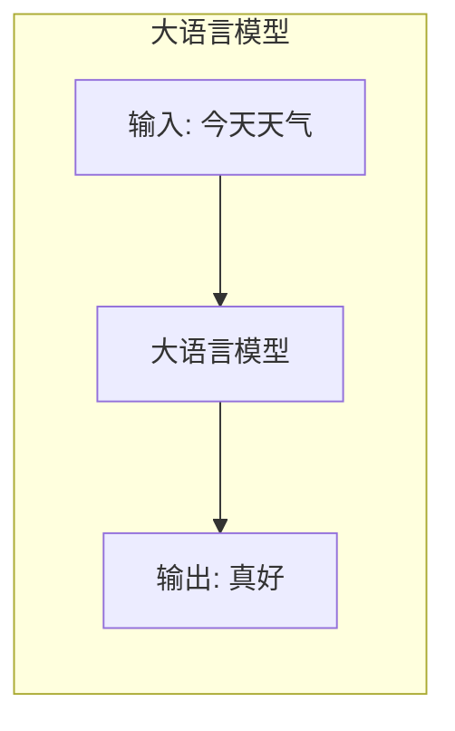

**类比**：
- LLM 就像一个读过**几乎所有书籍**的学生
- 你问它问题，它根据"记忆"生成回答
- 但它**不理解**内容，只是**模式匹配**非常强大

### 为什么叫"大"？

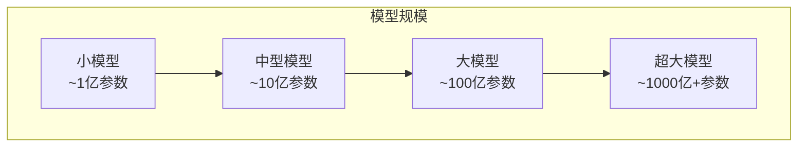

| 模型 | 参数量 | 类比 |
|------|--------|------|
| BERT | 1.1 亿 | 一本百科全书 |
| GPT-2 | 15 亿 | 一个小型图书馆 |
| LLaMA-7B | 70 亿 | 一个大学图书馆 |
| GPT-4 | ~1.8 万亿 (推测) | 全球所有图书馆 |

---

## 🧩 核心概念

### 1. Token（词元）

LLM 不直接处理文字，而是处理 **Token**。

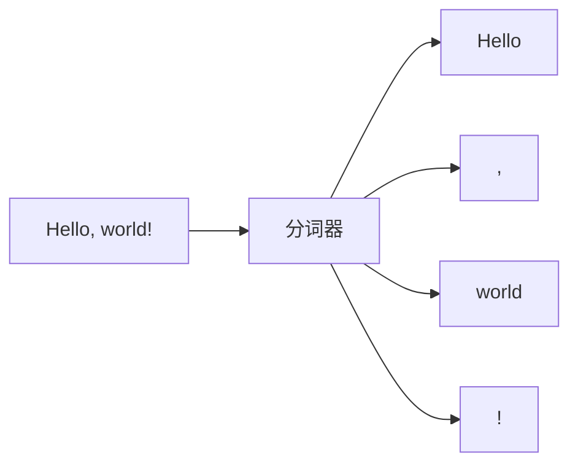

```python
# Token 示例
from tiktoken import encoding_for_model

enc = encoding_for_model("gpt-4")
text = "Hello, world!"
tokens = enc.encode(text)

print(tokens)      # [9906, 11, 1917, 0]
print(len(tokens)) # 4 个 token
```

**重要规则**：
- 1 个英文单词 ≈ 1-2 个 token
- 1 个中文字 ≈ 1-2 个 token
- 空格、标点也是 token
- **Token 数决定成本和速度！**

### 2. 上下文窗口 (Context Window)

模型一次能"看到"的最大 Token 数。

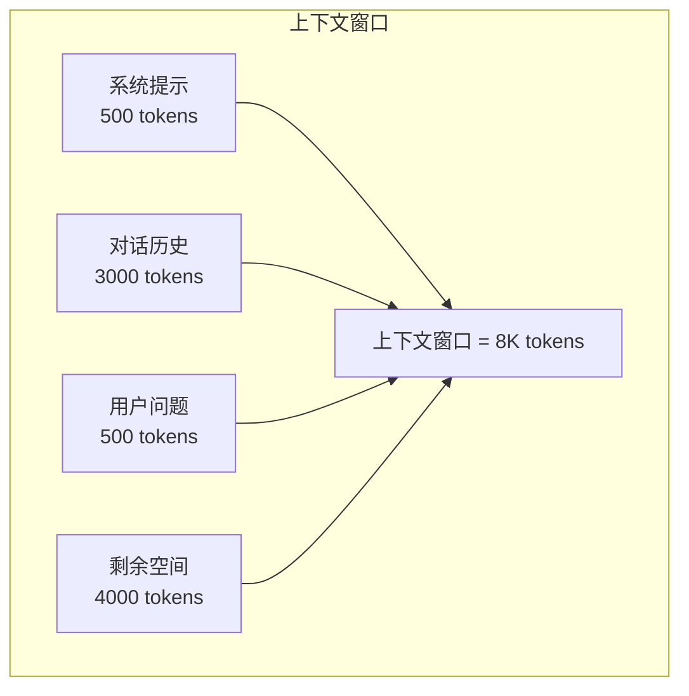

| 模型 | 上下文窗口 | 相当于 |
|------|-----------|--------|
| GPT-3.5 | 4K / 16K | 3,000 / 12,000 字 |
| GPT-4 | 8K / 128K | 6,000 / 100,000 字 |
| Claude 3 | 200K | 150,000 字（一本书） |
| Gemini 1.5 | 1M | 750,000 字 |

**运维提示**：
```python
# 检查是否超出上下文窗口
def check_context_limit(messages, max_tokens=8000):
    total_tokens = count_tokens(messages)
    if total_tokens > max_tokens * 0.9:  # 留 10% 缓冲
        print(f"⚠️ 接近上下文限制: {total_tokens}/{max_tokens}")
        return True
    return False
```

### 3. Temperature（温度）

控制输出的**随机性**。

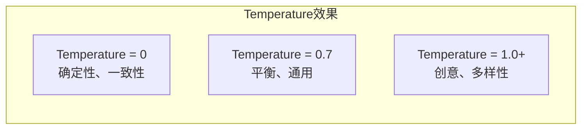

```python
# Temperature 对比
import openai

# 低温度 - 事实性任务
response_factual = openai.chat.completions.create(
    model="gpt-4",
    messages=[{"role": "user", "content": "1+1=?"}],
    temperature=0  # 答案始终是 2
)

# 高温度 - 创意任务
response_creative = openai.chat.completions.create(
    model="gpt-4",
    messages=[{"role": "user", "content": "写一首关于 AI 的诗"}],
    temperature=0.9  # 每次结果都不同
)
```

| 场景 | 推荐 Temperature |
|------|-----------------|
| 代码生成 | 0 - 0.2 |
| 问答/客服 | 0.3 - 0.5 |
| 文案写作 | 0.7 - 0.9 |
| 头脑风暴 | 0.9 - 1.2 |

### 4. 其他重要参数

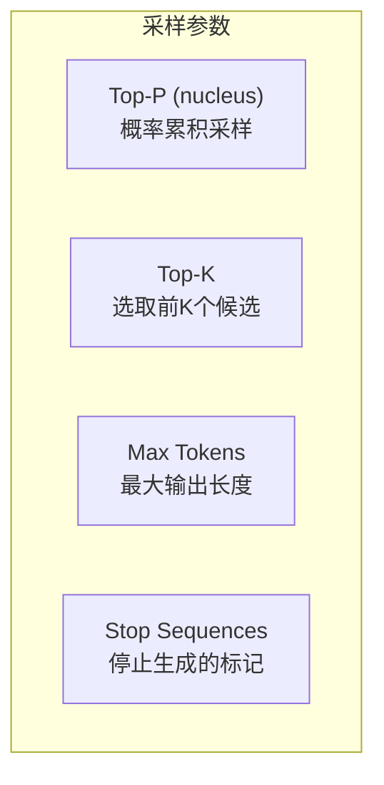

```python
response = openai.chat.completions.create(
    model="gpt-4",
    messages=messages,
    temperature=0.7,      # 随机性
    top_p=0.9,           # 累积概率阈值
    max_tokens=1000,      # 最大输出长度
    stop=["\n\n", "END"], # 遇到这些就停止
    frequency_penalty=0.5, # 减少重复
    presence_penalty=0.5,  # 鼓励新话题
)
```

---

## 📋 主流模型对比

### 商业闭源模型

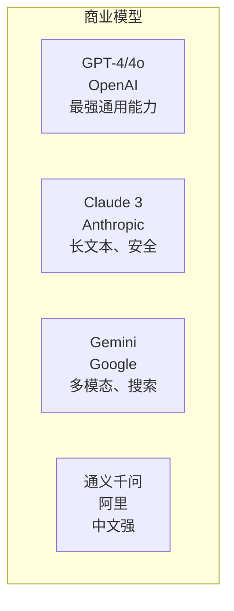

| 模型 | 厂商 | 优势 | 价格 (输入/输出 per 1M tokens) |
|------|------|------|-------------------------------|
| GPT-4o | OpenAI | 最强通用 | $5 / $15 |
| GPT-4o-mini | OpenAI | 性价比 | $0.15 / $0.6 |
| Claude 3 Opus | Anthropic | 推理、长文本 | $15 / $75 |
| Claude 3.5 Sonnet | Anthropic | 平衡 | $3 / $15 |
| Gemini 1.5 Pro | Google | 长上下文 | $3.5 / $10.5 |

### 开源模型

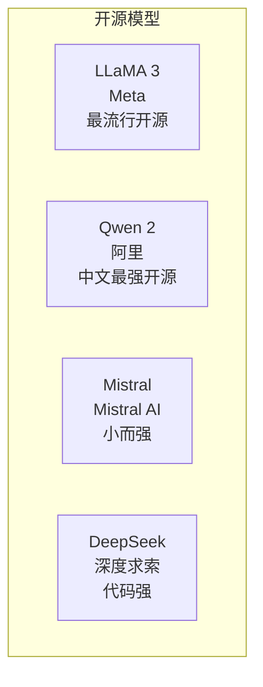

| 模型 | 参数量 | 特点 | 运行要求 |
|------|--------|------|----------|
| LLaMA 3 8B | 80 亿 | 通用、社区大 | 16GB GPU |
| LLaMA 3 70B | 700 亿 | 接近 GPT-4 | 140GB GPU |
| Qwen2 7B | 70 亿 | 中文最强 | 16GB GPU |
| Mistral 7B | 70 亿 | 小而精 | 16GB GPU |
| DeepSeek Coder | 70 亿 | 代码专精 | 16GB GPU |

---

## 🔧 使用方式

### 方式 1: API 调用（最简单）

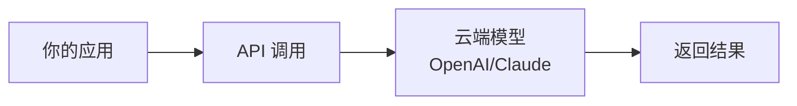

```python
# OpenAI API
import openai

client = openai.OpenAI(api_key="sk-...")

response = client.chat.completions.create(
    model="gpt-4",
    messages=[
        {"role": "system", "content": "你是一个有帮助的助手"},
        {"role": "user", "content": "什么是人工智能？"}
    ]
)

print(response.choices[0].message.content)
```

```python
# Anthropic API
import anthropic

client = anthropic.Anthropic(api_key="sk-ant-...")

response = client.messages.create(
    model="claude-3-sonnet-20240229",
    max_tokens=1000,
    messages=[
        {"role": "user", "content": "什么是人工智能？"}
    ]
)

print(response.content[0].text)
```

### 方式 2: 本地部署（更可控）

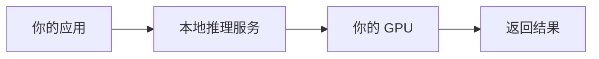

```bash
# 使用 Ollama（最简单）
# 安装: https://ollama.ai

# 下载模型
ollama pull llama3

# 运行模型
ollama run llama3

# API 调用
curl http://localhost:11434/api/generate -d '{
  "model": "llama3",
  "prompt": "什么是人工智能？"
}'
```

```python
# 使用 vLLM（高性能生产部署）
from vllm import LLM, SamplingParams

llm = LLM(model="meta-llama/Llama-3-8B-Instruct")
sampling_params = SamplingParams(temperature=0.7, max_tokens=500)

outputs = llm.generate(["什么是人工智能？"], sampling_params)
print(outputs[0].outputs[0].text)
```

### 方式 3: 兼容 API（统一接口）

```python
# 使用 OpenAI 兼容接口调用任何模型
import openai

# 调用本地 Ollama
client = openai.OpenAI(
    base_url="http://localhost:11434/v1",
    api_key="ollama"  # 本地不需要真实 key
)

# 调用 vLLM
client = openai.OpenAI(
    base_url="http://localhost:8000/v1",
    api_key="vllm"
)

# 调用其他兼容服务（如 LiteLLM）
client = openai.OpenAI(
    base_url="http://your-proxy:4000/v1",
    api_key="your-key"
)

# 用法完全相同！
response = client.chat.completions.create(
    model="llama3",
    messages=[{"role": "user", "content": "你好"}]
)
```

---

## 📊 成本管理

### Token 计费

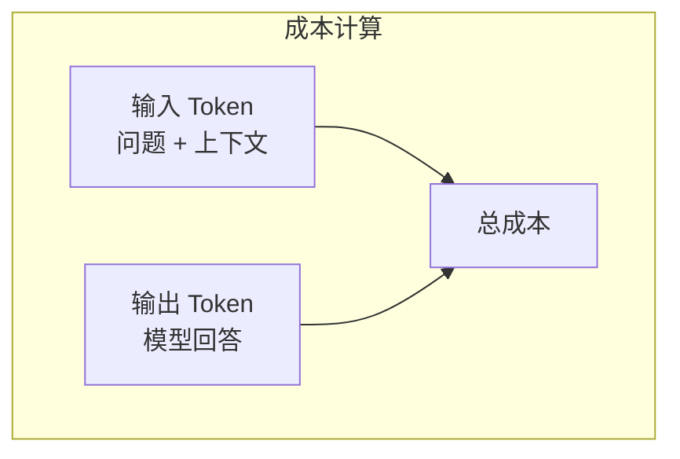

```python
# 成本估算工具
import tiktoken

def estimate_cost(prompt: str, model: str = "gpt-4"):
    """估算 API 调用成本"""
    enc = tiktoken.encoding_for_model(model)
    input_tokens = len(enc.encode(prompt))
    
    # 假设输出是输入的 2 倍
    estimated_output = input_tokens * 2
    
    # GPT-4 价格 (per 1M tokens)
    prices = {
        "gpt-4": {"input": 30, "output": 60},
        "gpt-4o": {"input": 5, "output": 15},
        "gpt-4o-mini": {"input": 0.15, "output": 0.6},
    }
    
    price = prices.get(model, prices["gpt-4o"])
    input_cost = (input_tokens / 1_000_000) * price["input"]
    output_cost = (estimated_output / 1_000_000) * price["output"]
    
    return {
        "input_tokens": input_tokens,
        "estimated_output_tokens": estimated_output,
        "estimated_cost_usd": round(input_cost + output_cost, 4)
    }

# 使用
print(estimate_cost("写一篇 1000 字的文章", "gpt-4o"))
# {'input_tokens': 15, 'estimated_output_tokens': 30, 'estimated_cost_usd': 0.0005}
```

### 成本优化策略

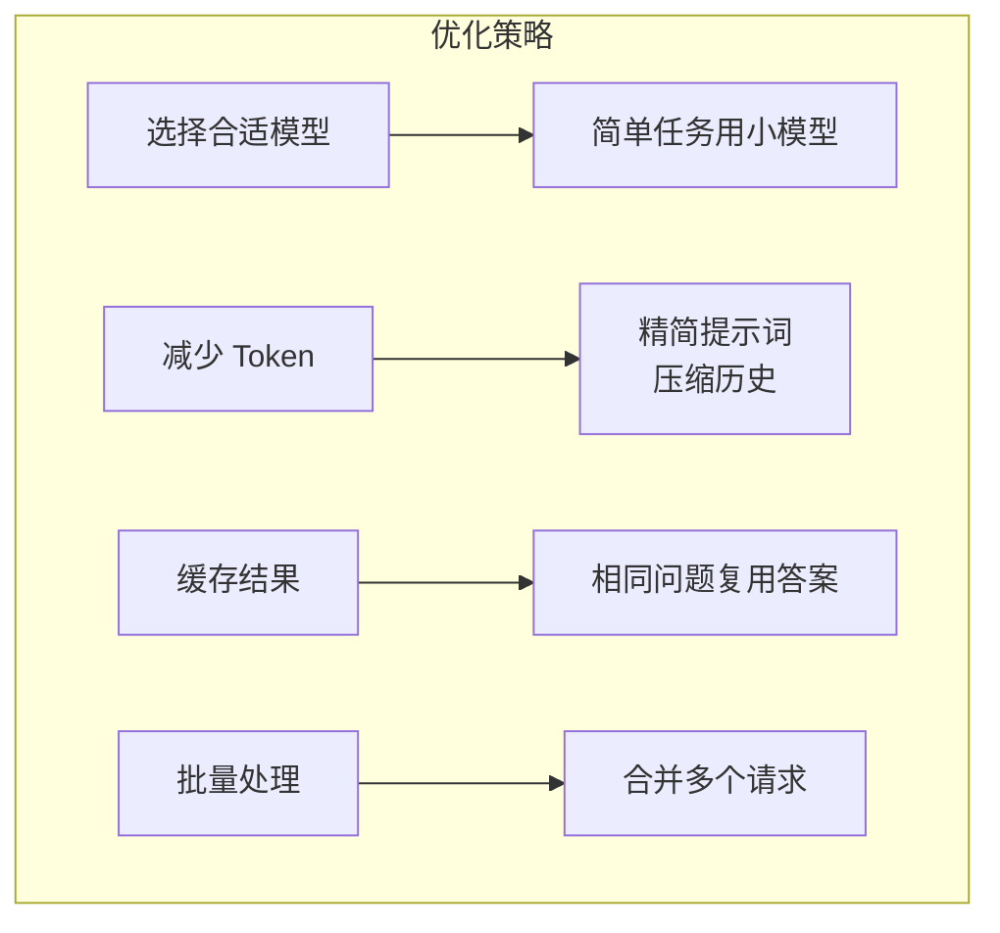

```python
# 缓存实现示例
import hashlib
import json

class LLMCache:
    def __init__(self):
        self.cache = {}
    
    def get_or_call(self, prompt: str, call_fn):
        key = hashlib.md5(prompt.encode()).hexdigest()
        
        if key in self.cache:
            print("📦 使用缓存")
            return self.cache[key]
        
        print("🔄 调用 API")
        result = call_fn(prompt)
        self.cache[key] = result
        return result

# 使用
cache = LLMCache()
result = cache.get_or_call("什么是AI?", lambda p: call_llm(p))
```

---

## 🛠️ 运维指南

### 环境准备

```bash
# 安装依赖
pip install openai anthropic tiktoken

# 设置环境变量
export OPENAI_API_KEY="sk-..."
export ANTHROPIC_API_KEY="sk-ant-..."

# 验证连接
python -c "import openai; print(openai.OpenAI().models.list())"
```

### 健康检查

```python
def health_check():
    """检查 LLM 服务可用性"""
    import openai
    import time
    
    try:
        start = time.time()
        response = openai.OpenAI().chat.completions.create(
            model="gpt-4o-mini",
            messages=[{"role": "user", "content": "ping"}],
            max_tokens=5
        )
        latency = time.time() - start
        
        return {
            "status": "healthy",
            "latency_ms": round(latency * 1000),
            "model": "gpt-4o-mini"
        }
    except Exception as e:
        return {"status": "unhealthy", "error": str(e)}

# 定期运行
print(health_check())
```

### 错误处理

```python
import openai
from tenacity import retry, stop_after_attempt, wait_exponential

@retry(
    stop=stop_after_attempt(3),
    wait=wait_exponential(multiplier=1, min=4, max=60)
)
def call_llm_with_retry(messages):
    try:
        return openai.OpenAI().chat.completions.create(
            model="gpt-4o",
            messages=messages
        )
    except openai.RateLimitError:
        print("⚠️ 触发速率限制，等待重试...")
        raise
    except openai.APIError as e:
        print(f"❌ API 错误: {e}")
        raise
```

---

## ⚠️ 常见问题与解决方案

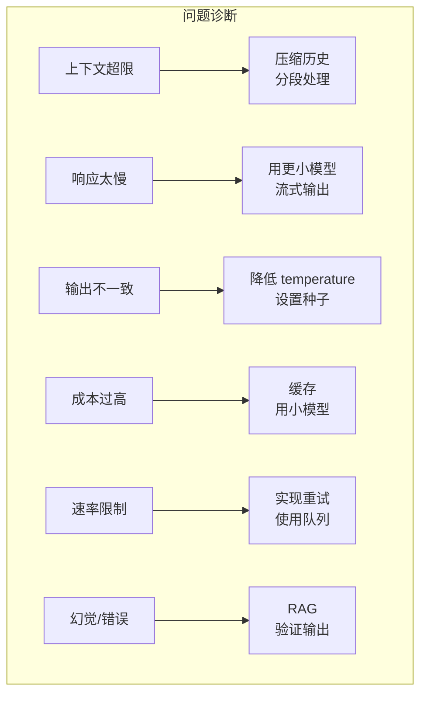

| 问题 | 症状 | 解决方案 |
|------|------|----------|
| **上下文超限** | "context length exceeded" | 压缩历史，分段处理 |
| **响应太慢** | 等待 >10s | 用更小模型，启用流式输出 |
| **输出不一致** | 每次结果不同 | 降低 temperature，设置 seed |
| **成本过高** | 账单太贵 | 实现缓存，简单任务用小模型 |
| **速率限制** | 429 错误 | 实现重试，使用请求队列 |
| **幻觉** | 输出错误信息 | 使用 RAG，验证输出 |

---

## 💡 最佳实践

### 1. 选择合适的模型

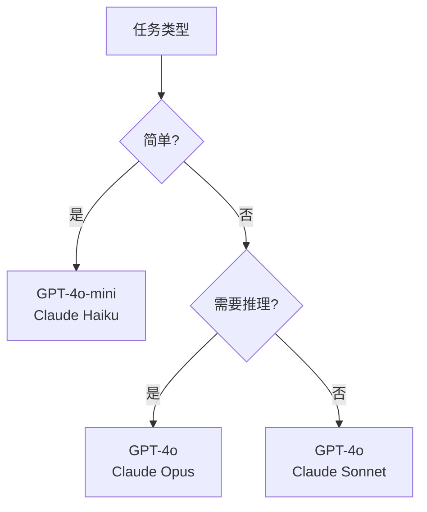

### 2. 始终使用流式输出

```python
# 流式输出 - 用户体验更好
stream = openai.OpenAI().chat.completions.create(
    model="gpt-4o",
    messages=messages,
    stream=True  # 启用流式
)

for chunk in stream:
    if chunk.choices[0].delta.content:
        print(chunk.choices[0].delta.content, end="", flush=True)
```

### 3. 设置超时和限制

```python
response = openai.OpenAI().chat.completions.create(
    model="gpt-4o",
    messages=messages,
    max_tokens=1000,   # 限制输出长度
    timeout=30,        # 30 秒超时
)
```

---

## 📚 核心要点

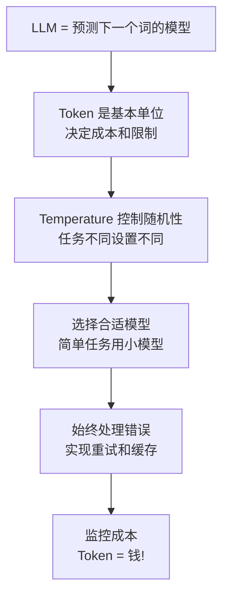

---

## 🔗 相关主题

- [Prompt Engineering](./Prompt-Engineering-in-nutshell.md) - 如何写好提示词
- [模型推理](../../09_Deployment_Inference/Inference-in-nutshell.md) - 部署和优化
- [RAG 系统](../../11_RAG_Systems/RAG-in-nutshell.md) - 让 LLM 访问你的数据
- [AI 智能体](../../06_Reinforcement_Learning/AI_Agents/Agent-in-nutshell.md) - LLM + 工具 + 记忆
