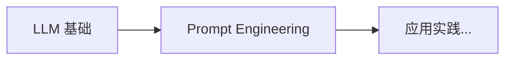

# 04 自然语言处理与大模型 (NLP & LLMs)

本章系统讲解自然语言处理的现代范式，从序列模型（RNN/LSTM）演进到 Transformer 架构，再到大语言模型（GPT/BERT）、微调技术（LoRA/QLoRA）和提示词工程。这是当前 AI 应用最活跃的领域。

## 学习路径 (Learning Path)

```
    ┌──────────────────┐
    │  序列模型         │
    │  Sequence Models │
    │  (RNN/LSTM)      │
    └────────┬─────────┘
             │
             ▼
    ┌──────────────────┐
    │  Transformer     │
    │  革命            │
    │  (Attention)     │
    └────────┬─────────┘
             │
             ▼
    ┌──────────────────┐
    │  大语言模型       │
    │  LLM Arch        │
    │  (GPT/BERT)      │
    └────────┬─────────┘
             │
             ├─────────────────────┐
             ▼                     ▼
    ┌────────────────┐    ┌───────────────┐
    │  微调技术       │    │  提示词工程   │
    │  Fine-tuning   │    │  Prompt Eng   │
    │  (LoRA/QLoRA)  │    │  (In-context) │
    └────────────────┘    └───────────────┘
```

## 🚀 速成指南 (In-Nutshell Quick Start)

> 面向初级运维人员的入门材料，包含丰富的 Mermaid 图示。



| 主题 | 描述 | 速成文档 |
|------|------|----------|
| **LLM 基础** | 理解大语言模型：Token、上下文窗口、Temperature、API 调用 | [LLM-Basics-in-nutshell.md](./LLM_Architectures/LLM-Basics-in-nutshell.md) |
| **Prompt Engineering** | 掌握提示词工程：Zero-shot、Few-shot、CoT、角色扮演 | [Prompt-Engineering-in-nutshell.md](./Prompt_Engineering/Prompt-Engineering-in-nutshell.md) |

---

## 内容索引 (Content Index)

| 主题 | 难度 | 描述 | 文档链接 |
|------|------|------|---------|
| 序列模型 (Sequence Models) | 入门 | RNN、LSTM、GRU，理解序列建模的早期方法 | [Sequence_Models/](./Sequence_Models/) |
| Transformer 革命 (Transformer Revolution) | 进阶 | Self-Attention、多头注意力、位置编码，现代 NLP 核心架构 | [Transformer_Revolution.md](./Transformer_Revolution/Transformer_Revolution.md) |
| 大语言模型架构 (LLM Architectures) | 进阶 | GPT（Decoder-only）、BERT（Encoder-only）、MoE，预训练范式 | [LLM_Architectures.md](./LLM_Architectures/LLM_Architectures.md) |
| **推理模型 2026 (Reasoning Models)** | **2026 新增** | **o1/o3 推理模型、思维链进化、Test-Time Compute Scaling** | **[Reasoning_Models_2026.md](./LLM_Architectures/Reasoning_Models_2026.md)** |
| **长上下文模型 2026 (Long Context)** | **2026 新增** | **100K-1M Token处理、稀疏注意力、KV Cache优化** | **[Long_Context_Models_2026.md](./Long_Context_Models_2026.md)** |
| **架构演进大白话 (Architecture Evolution for Dummy)** | **2026 新增** | **KV 压缩、Mamba、RetNet 大白话解释** | **[Architecture_Evolution_for_dummy.md](./Architecture_Evolution_for_dummy.md)** |
| **多模态模型 (Multimodal)** | 进阶 | **视觉-语言统一架构、GPT-4V/Gemini/LLaVA** | **[Multimodal_Architectures_2026.md](./Multimodal_Models/Multimodal_Architectures_2026.md)** |
| 微调技术 (Fine-tuning Techniques) | 实战 | LoRA、QLoRA、Prefix Tuning，参数高效微调方法 | [Fine_tuning_Techniques.md](./Fine_tuning_Techniques/Fine_tuning_Techniques.md) |
| 提示词工程 (Prompt Engineering) | 实战 | Few-shot、Chain-of-Thought、提示优化，零代码调用 LLM | [Prompt_Engineering/](./Prompt_Engineering/) |
| **Structured Output 框架** | **2026 新增** | **Instructor/Guidance/Outlines/DSPy 结构化输出** | **[Prompt_Engineering/](./Prompt_Engineering/)** |
| **中国大模型生态 (Chinese LLM Ecosystem)** | **2026 新增** | **DeepSeek/Qwen/GLM/Kimi/MiniMax 五大厂商技术路线、模型矩阵与 Benchmark 全景对比** | **[Chinese_LLM_Ecosystem/README.md](./Chinese_LLM_Ecosystem/README.md)** |
| **国际大模型生态 (Global LLM Ecosystem)** | **2026 新增** | **OpenAI/Google/Anthropic/Meta/Mistral 五大厂商技术路线、模型矩阵与 Benchmark 全景对比** | **[Global_LLM_Ecosystem/README.md](./Global_LLM_Ecosystem/README.md)** |
| **语音与音频 AI** | **2026 新增** | **Whisper ASR、CosyVoice TTS、GPT-4o 实时对话、音乐生成** | **[Speech_Audio_AI/](./Speech_Audio_AI/)** |
| **LLM 数据工程** | **2026 新增** | **预训练数据清洗、SFT 数据构建、合成数据飞轮、数据配比** | **[LLM_Data_Engineering/](./LLM_Data_Engineering/)** |
| **小模型与端侧 LLM** | **2026 新增** | **Phi-3/Gemma/Qwen 小模型、GPTQ/AWQ 量化、llama.cpp/MLC-LLM 端侧部署** | **[Edge_LLM/](./Edge_LLM/)** |

## 前置知识 (Prerequisites)

- **必修**: [神经网络核心](../03_Deep_Learning/Neural_Network_Core/Neural_Network_Core.md)（理解反向传播）
- **必修**: [优化与正则化](../03_Deep_Learning/Optimization/Optimization.md)（训练大模型）
- **推荐**: [线性代数](../01_Fundamentals/Linear_Algebra/Linear_Algebra.md)（理解注意力机制的矩阵运算）
- **可选**: [概率统计](../01_Fundamentals/Probability_Statistics/Probability_Statistics.md)（理解语言模型概率建模）

## 关键术语速查 (Key Terms)

- **Self-Attention**: 自注意力机制，根据输入序列动态计算权重关系
- **Multi-Head Attention**: 多头注意力，并行多个注意力头捕捉不同特征
- **位置编码 (Positional Encoding)**: 为序列位置注入顺序信息
- **GPT (Generative Pre-trained Transformer)**: Decoder-only 架构，擅长文本生成
- **BERT (Bidirectional Encoder)**: Encoder-only 架构，擅长理解任务（分类/NER）
- **预训练 (Pre-training)**: 大规模无监督训练，学习通用语言表示
- **LoRA (Low-Rank Adaptation)**: 低秩矩阵微调，大幅降低微调参数量
- **QLoRA**: LoRA + 量化，在消费级 GPU 上微调大模型
- **RLHF (Reinforcement Learning from Human Feedback)**: 基于人类偏好对齐模型输出
- **提示词工程 (Prompt Engineering)**: 设计输入文本引导模型输出，无需微调

### 推理模型 (2026新增)
- **Chain-of-Thought (CoT)**: 思维链提示，诱导模型展示推理过程
- **Test-Time Compute Scaling**: 测试时计算扩展，动态分配推理计算资源
- **o1/o3**: OpenAI推理模型，通过RL训练内部推理token
- **Quiet Thinking**: 安静思考模式，推理过程不输出给用户
- **Reasoning RL**: 推理强化学习，训练模型"如何思考"而非"思考什么"

---
*Last updated: 2026-06-02* - 新增国际大模型生态全景专题

## Related
- [[04_NLP_LLMs/Sequence_Models/Sequence_Models_for_dummy|序列模型 - 小白版]]
- [[04_NLP_LLMs/Sequence_Models/Sequence_Models|序列模型 (Sequence Models)]]
- [[04_NLP_LLMs/README_for_dummy|04 自然语言处理与大模型 - 小白版]]

- [[04_NLP_LLMs/Fine_tuning_Techniques/PEFT_2026/README]] — PEFT 2026 (参数高效微调) (共享: bert, gpt, llm, nlp, transformer)
- [[04_NLP_LLMs/Fine_tuning_Techniques/README]] — 微调技术 (Fine-tuning Techniques) (共享: bert, gpt, llm, nlp, transformer)
- [[04_NLP_LLMs/LLM_Architectures/LLM-Basics-in-nutshell]] — 大语言模型基础速成指南 (共享: bert, gpt, llm, nlp, transformer)
- [[04_NLP_LLMs/Multimodal_Models/Multimodal_Architectures_2026]] — 多模态模型架构 2026：从 GPT-4V 到原生多模态 AGI (共享: bert, gpt, llm, nlp, transformer)
- [[04_NLP_LLMs/LLM_Architectures/LLM_Architectures_for_dummy]] — LLM_Architectures_for_dummy
- [[04_NLP_LLMs/LLM_Architectures/LLM_Architectures]] — LLM_Architectures
- [[04_NLP_LLMs/LLM_Architectures/Reasoning_Models_2026]] — Reasoning_Models_2026
- [[04_NLP_LLMs/Transformer_Revolution/Transformer_Revolution_for_dummy]] — Transformer_Revolution_for_dummy
- [[04_NLP_LLMs/Transformer_Revolution/Transformer_Revolution]] — Transformer_Revolution
- [[04_NLP_LLMs/Fine_tuning_Techniques/Axolotl_Deep_Dive]] — Axolotl_Deep_Dive
- [[04_NLP_LLMs/Fine_tuning_Techniques/Unsloth_Deep_Dive]] — Unsloth_Deep_Dive
- [[04_NLP_LLMs/Fine_tuning_Techniques/Model_Merging_2026]] — Model_Merging_2026
- [[04_NLP_LLMs/Fine_tuning_Techniques/Fine_tuning_Techniques]] — Fine_tuning_Techniques
- [[04_NLP_LLMs/Fine_tuning_Techniques/Fine_tuning_Techniques_for_dummy]] — Fine_tuning_Techniques_for_dummy
- [[04_NLP_LLMs/Reasoning_Models/Test_Time_Compute_2026]] — Test_Time_Compute_2026
- [[04_NLP_LLMs/Reasoning_Models/Reasoning_Models_for_dummy]] — Reasoning_Models_for_dummy
- [[04_NLP_LLMs/Prompt_Engineering/Prompt_Engineering]] — Prompt_Engineering
- [[04_NLP_LLMs/Prompt_Engineering/Outlines_Deep_Dive]] — Outlines_Deep_Dive
- [[04_NLP_LLMs/Prompt_Engineering/Prompt-Engineering-in-nutshell]] — Prompt Engineering 速成指南
- [[04_NLP_LLMs/Prompt_Engineering/Prompt_Engineering_for_dummy]] — Prompt_Engineering_for_dummy
- [[synthesis/llm-nlp|Llm Nlp]]

## 本期新增

- [[04_NLP_LLMs/Multimodal_Models/Native_Multimodal_Architectures|Native Multimodal Architectures: From GPT-4V to Gemini 2.5]]
- [[04_NLP_LLMs/Multimodal_Models/Modality_Fusion_Mechanisms|Modality Fusion Mechanisms: Deep Dive]]
- [[04_NLP_LLMs/Multimodal_Models/Video_Understanding_Architectures|Video Understanding Architectures]]
- [[04_NLP_LLMs/LLM_Architectures/MoE_Routing_and_Load_Balancing|MoE Routing and Load Balancing]]
- [[04_NLP_LLMs/LLM_Architectures/MoE_Case_Studies_DeepSeek_Mixtral|MoE Case Studies: DeepSeek and Mixtral]]
- [[04_NLP_LLMs/LLM_Architectures/Transformer_Alternatives|Transformer Alternatives: RWKV, RetNet, Mamba, and Beyond]]
- [[04_NLP_LLMs/Reasoning_Models/o1_Class_Reasoning_Models|o1-Class Reasoning Models]]
- [[04_NLP_LLMs/Reasoning_Models/DeepSeek_R1_Technical_Analysis|DeepSeek R1 Technical Analysis]]
- [[04_NLP_LLMs/Reasoning_Models/Process_Reward_Models|Process Reward Models]]
- [[04_NLP_LLMs/Chinese_LLM_Ecosystem/README|中国大模型生态全景：DeepSeek / Qwen / GLM / Kimi / MiniMax]]
- [[04_NLP_LLMs/Chinese_LLM_Ecosystem/DeepSeek_Deep_Dive|DeepSeek 技术全景深度解析]]
- [[04_NLP_LLMs/Chinese_LLM_Ecosystem/Qwen_Deep_Dive|Qwen 通义千问技术全景深度解析]]
- [[04_NLP_LLMs/Chinese_LLM_Ecosystem/GLM_Zhipu_Deep_Dive|GLM 智谱 AI 技术全景深度解析]]
- [[04_NLP_LLMs/Chinese_LLM_Ecosystem/Kimi_Moonshot_Deep_Dive|Kimi 月之暗面技术全景深度解析]]
- [[04_NLP_LLMs/Chinese_LLM_Ecosystem/MiniMax_Deep_Dive|MiniMax 稀宇科技技术全景深度解析]]
- [[04_NLP_LLMs/Chinese_LLM_Ecosystem/Xiaomi_MiMo_Deep_Dive|小米 MiMo 技术全景深度解析]]
- [[04_NLP_LLMs/Global_LLM_Ecosystem/README|国际大模型生态全景：OpenAI / Google / Anthropic / Meta / Mistral]]
- [[04_NLP_LLMs/Global_LLM_Ecosystem/OpenAI_Deep_Dive|OpenAI 技术深度解析：从 GPT-3 到 o3]]
- [[04_NLP_LLMs/Global_LLM_Ecosystem/Google_Gemini_Deep_Dive|Google Gemini 技术深度解析]]
- [[04_NLP_LLMs/Global_LLM_Ecosystem/Anthropic_Claude_Deep_Dive|Anthropic Claude 技术深度解析]]
- [[04_NLP_LLMs/Global_LLM_Ecosystem/Meta_LLaMA_Deep_Dive|Meta LLaMA 技术深度解析]]
- [[04_NLP_LLMs/Global_LLM_Ecosystem/Mistral_AI_Deep_Dive|Mistral AI 技术深度解析]]

## 相关页面
- [[04_NLP_LLMs/Fine_tuning_Techniques/Tool_Use_and_Agent_Fine_Tuning|Tool Use 与 Agent 微调 (Tool-Use and Agent Fine-Tuning)]]
- [[04_NLP_LLMs/Edge_LLM/README|小模型与端侧 LLM (Edge LLM)]]
- [[04_NLP_LLMs/Edge_LLM/Edge_LLM_Deep_Dive|小模型与端侧 LLM 深度解读: 从高效模型到端侧部署]]
- [[04_NLP_LLMs/LLM_Data_Engineering/LLM_Data_Engineering_Deep_Dive|LLM 数据工程深度解读: 从预训练数据到合成数据]]
- [[04_NLP_LLMs/LLM_Data_Engineering/README|LLM 数据工程 (LLM Data Engineering)]]
- [[04_NLP_LLMs/Speech_Audio_AI/Speech_Audio_AI_Deep_Dive|语音与音频 AI 深度解读: 从 Whisper 到 CosyVoice 再到 AudioLM]]
- [[04_NLP_LLMs/Speech_Audio_AI/README|语音与音频 AI (Speech & Audio AI)]]

- [[concepts/long-context-models|Long Context Models]]
- [[concepts/kv-cache-compression|KV Cache 压缩]]
- [[concepts/mamba|Mamba]]
- [[concepts/retnet|RetNet]]
- [[04_NLP_LLMs/Architecture_Evolution_for_dummy|架构演进大白话]]

- [[concepts/sequence-models|Sequence Models]]

## 新增页面

- [[04_NLP_LLMs/Structured_Output_Guide|结构化输出指南]]
