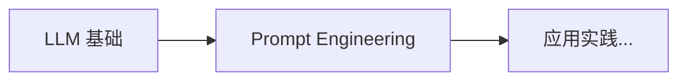

# 04 自然语言处理与大模型 (NLP & LLMs)

本章系统讲解自然语言处理的现代范式，从序列模型（RNN/LSTM）演进到 Transformer 架构，再到大语言模型（GPT/BERT）、微调技术（LoRA/QLoRA）和提示词工程。这是当前 AI 应用最活跃的领域。

## 学习路径 (Learning Path)

```
    ┌──────────────────┐
    │  序列模型         │
    │  Sequence Models │
    │  (RNN/LSTM)      │
    └────────┬─────────┘
             │
             ▼
    ┌──────────────────┐
    │  Transformer     │
    │  革命            │
    │  (Attention)     │
    └────────┬─────────┘
             │
             ▼
    ┌──────────────────┐
    │  大语言模型       │
    │  LLM Arch        │
    │  (GPT/BERT)      │
    └────────┬─────────┘
             │
             ├─────────────────────┐
             ▼                     ▼
    ┌────────────────┐    ┌───────────────┐
    │  微调技术       │    │  提示词工程   │
    │  Fine-tuning   │    │  Prompt Eng   │
    │  (LoRA/QLoRA)  │    │  (In-context) │
    └────────────────┘    └───────────────┘
```

## 🚀 速成指南 (In-Nutshell Quick Start)

> 面向初级运维人员的入门材料，包含丰富的 Mermaid 图示。



| 主题 | 描述 | 速成文档 |
|------|------|----------|
| **LLM 基础** | 理解大语言模型：Token、上下文窗口、Temperature、API 调用 | [LLM-Basics-in-nutshell.md](./LLM_Architectures/LLM-Basics-in-nutshell.md) |
| **Prompt Engineering** | 掌握提示词工程：Zero-shot、Few-shot、CoT、角色扮演 | [Prompt-Engineering-in-nutshell.md](./Prompt_Engineering/Prompt-Engineering-in-nutshell.md) |

---

## 内容索引 (Content Index)

| 主题 | 难度 | 描述 | 文档链接 |
|------|------|------|---------|
| 序列模型 (Sequence Models) | 入门 | RNN、LSTM、GRU，理解序列建模的早期方法 | [Sequence_Models/](./Sequence_Models/) |
| Transformer 革命 (Transformer Revolution) | 进阶 | Self-Attention、多头注意力、位置编码，现代 NLP 核心架构 | [Transformer_Revolution.md](./Transformer_Revolution/Transformer_Revolution.md) |
| 大语言模型架构 (LLM Architectures) | 进阶 | GPT（Decoder-only）、BERT（Encoder-only）、MoE，预训练范式 | [LLM_Architectures.md](./LLM_Architectures/LLM_Architectures.md) |
| **推理模型 2026 (Reasoning Models)** | **2026 新增** | **o1/o3 推理模型、思维链进化、Test-Time Compute Scaling** | **[Reasoning_Models_2026.md](./LLM_Architectures/Reasoning_Models_2026.md)** |
| **长上下文模型 2026 (Long Context)** | **2026 新增** | **100K-1M Token处理、稀疏注意力、KV Cache优化** | **[Long_Context_Models_2026.md](./Long_Context_Models_2026.md)** |
| **多模态模型 (Multimodal)** | 进阶 | **视觉-语言统一架构、GPT-4V/Gemini/LLaVA** | **[Multimodal_Architectures_2026.md](./Multimodal_Models/Multimodal_Architectures_2026.md)** |
| 微调技术 (Fine-tuning Techniques) | 实战 | LoRA、QLoRA、Prefix Tuning，参数高效微调方法 | [Fine_tuning_Techniques.md](./Fine_tuning_Techniques/Fine_tuning_Techniques.md) |
| 提示词工程 (Prompt Engineering) | 实战 | Few-shot、Chain-of-Thought、提示优化，零代码调用 LLM | [Prompt_Engineering/](./Prompt_Engineering/) |
| **Structured Output 框架** | **2026 新增** | **Instructor/Guidance/Outlines/DSPy 结构化输出** | **[Prompt_Engineering/](./Prompt_Engineering/)** |

## 前置知识 (Prerequisites)

- **必修**: [神经网络核心](../03_Deep_Learning/Neural_Network_Core/Neural_Network_Core.md)（理解反向传播）
- **必修**: [优化与正则化](../03_Deep_Learning/Optimization/Optimization.md)（训练大模型）
- **推荐**: [线性代数](../01_Fundamentals/Linear_Algebra/Linear_Algebra.md)（理解注意力机制的矩阵运算）
- **可选**: [概率统计](../01_Fundamentals/Probability_Statistics/Probability_Statistics.md)（理解语言模型概率建模）

## 关键术语速查 (Key Terms)

- **Self-Attention**: 自注意力机制，根据输入序列动态计算权重关系
- **Multi-Head Attention**: 多头注意力，并行多个注意力头捕捉不同特征
- **位置编码 (Positional Encoding)**: 为序列位置注入顺序信息
- **GPT (Generative Pre-trained Transformer)**: Decoder-only 架构，擅长文本生成
- **BERT (Bidirectional Encoder)**: Encoder-only 架构，擅长理解任务（分类/NER）
- **预训练 (Pre-training)**: 大规模无监督训练，学习通用语言表示
- **LoRA (Low-Rank Adaptation)**: 低秩矩阵微调，大幅降低微调参数量
- **QLoRA**: LoRA + 量化，在消费级 GPU 上微调大模型
- **RLHF (Reinforcement Learning from Human Feedback)**: 基于人类偏好对齐模型输出
- **提示词工程 (Prompt Engineering)**: 设计输入文本引导模型输出，无需微调

### 推理模型 (2026新增)
- **Chain-of-Thought (CoT)**: 思维链提示，诱导模型展示推理过程
- **Test-Time Compute Scaling**: 测试时计算扩展，动态分配推理计算资源
- **o1/o3**: OpenAI推理模型，通过RL训练内部推理token
- **Quiet Thinking**: 安静思考模式，推理过程不输出给用户
- **Reasoning RL**: 推理强化学习，训练模型"如何思考"而非"思考什么"

---
*Last updated: 2026-04-10* - 新增推理模型 2026 专题
