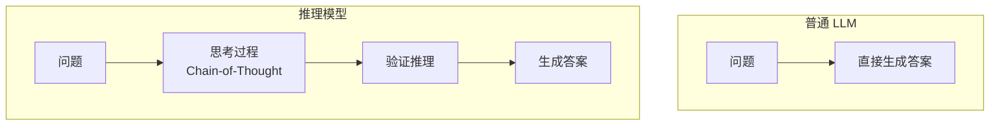
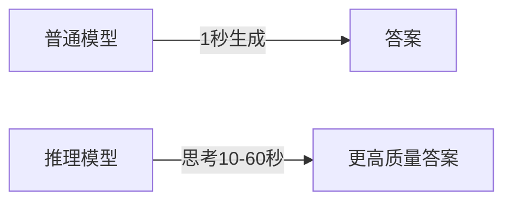
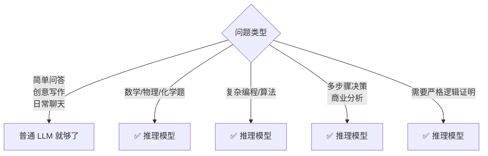
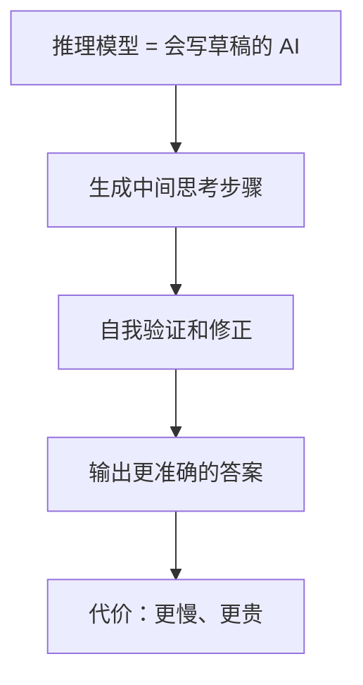

# 推理模型小白指南 (Reasoning Models for Dummy)

> **一句话理解**: 推理模型就像"会思考的 AI"——不像普通 AI 那样立刻回答，而是先在脑子里"演算草稿纸"，一步步想清楚再给你答案。

---

## 🤔 什么是推理模型？

### 一个比喻

**普通 AI** 像口算很快的学生：
- 你问："小明有 5 个苹果，给了小红 2 个，还剩几个？"
- 它立刻答："3 个！"

**推理模型** 像写步骤的学霸：
- 它先想："原有 5 个，给出 2 个，5 - 2 = 3"
- 然后答："3 个"



### 代表模型

| 模型 | 公司 | 特点 |
|------|------|------|
| **o1 / o3** | OpenAI | 思考时间长，数学/编程强 |
| **DeepSeek-R1** | DeepSeek | 开源，推理过程透明 |
| **Kimi k1.5** | Moonshot | 中文推理强 |
| **QwQ** | 阿里 | 开源，长思考 |

---

## 🧠 推理模型怎么"思考"？

### 核心技术：思维链（Chain-of-Thought）

就像你解数学题要写步骤：

```
问题：一个农场有鸡和兔，头共 35 个，脚共 94 只。鸡兔各几只？

推理过程：
1. 假设全是鸡，应该有 35 × 2 = 70 只脚
2. 实际多了 94 - 70 = 24 只脚
3. 每把一只鸡换成兔，多 2 只脚
4. 所以兔有 24 ÷ 2 = 12 只
5. 鸡有 35 - 12 = 23 只

答案：鸡 23 只，兔 12 只
```

推理模型就是在内部生成这样的"草稿纸"。

### 测试时计算（Test-Time Compute）



**关键洞察**：花更多时间"想"，答案更准确。

| 类型 | 计算花在哪 | 时间 |
|------|----------|------|
| 普通 LLM | 训练时 | 回答很快 |
| 推理模型 | **回答时** | 思考更久 |

---

## 🏆 推理模型强在哪？

| 任务 | 普通 LLM | 推理模型 |
|------|---------|---------|
| **小学数学** | 70% 正确 | 95%+ 正确 |
| **编程竞赛** | 勉强通过 | 金牌水平 |
| **逻辑谜题** | 经常错 | 很少错 |
| **科学推理** | 表面理解 | 深层因果 |
| **日常聊天** | 流畅自然 | 可能过度思考 |

### 但推理模型也有弱点

| 弱点 | 说明 |
|------|------|
| **慢** | 思考 10-60 秒，普通模型 1-3 秒 |
| **贵** | Token 消耗多 5-10 倍 |
| **不适合简单问题** | 问"今天星期几"它也写草稿 |
| **可能过度推理** | 简单问题想太复杂 |

---

## 🎯 什么时候用推理模型？



---

## 🛠️ 如何用好推理模型？

### 1. 给足时间

不要催它。推理模型需要"想一会儿"。

### 2. 问题要具体

```
❌ 差："帮我分析一下"
✅ 好："帮我分析这家公司过去 3 年的财报，
       计算 ROE 和毛利率趋势，指出 3 个风险点"
```

### 3. 要求展示推理过程

```
提示词："请一步一步思考，并在最后给出结论"
```

---

## ⚠️ 常见问题

| 问题 | 解答 |
|------|------|
| **推理模型会取代普通 LLM 吗？** | 不会。简单任务用普通模型更快更便宜 |
| **所有模型都能推理吗？** | 普通模型也能通过提示词诱导推理，但专用推理模型更强 |
| **推理模型真的"思考"吗？** | 不是人类意义上的思考，是生成中间步骤的文本 |
| **怎么判断是否需要推理模型？** | 如果问题需要 3 步以上逻辑推导，就用推理模型 |

---

## 💡 核心要点



---

## 🔗 相关主题

- [Prompt Engineering](../Prompt_Engineering/Prompt_Engineering.md) — 如何诱导普通模型做推理
- [LLM 架构](../LLM_Architectures/LLM_Architectures.md) — 大模型基础
- [Agent-in-nutshell](../../06_Reinforcement_Learning/AI_Agents/Agent-in-nutshell.md) — Agent 也需要推理能力

---

*Last updated: 2026-05-07*
