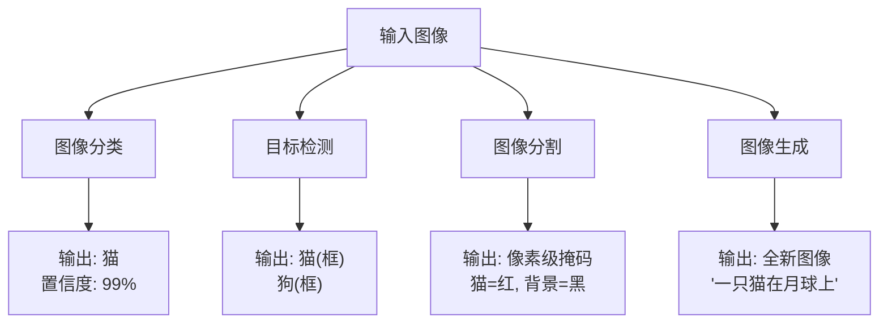
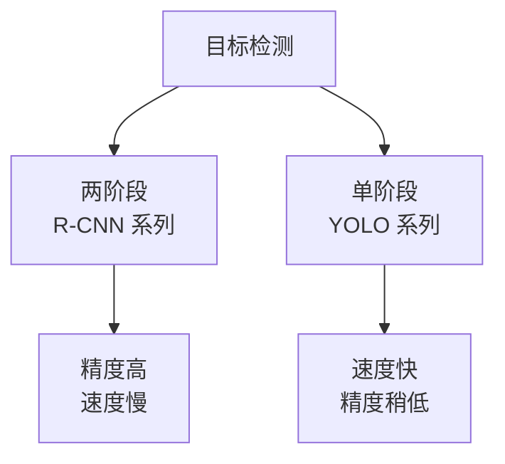

# 计算机视觉速成指南 (Computer Vision in a Nutshell)

> 中文简称：计算机视觉速成指南

> **一句话理解**: 计算机视觉让机器拥有"眼睛"——从照片中识别物体、理解场景、甚至生成以假乱真的图像。

---

## TL;DR（30 秒速览）

- **图像分类**: 这张图是什么？（猫 vs 狗）
- **目标检测**: 图里有什么？在哪？（画框标出猫的位置）
- **图像分割**: 每个像素属于什么？（精确描出猫的轮廓）
- **生成模型**: 从无到有创造图像（Stable Diffusion、DALL-E）
- **核心架构**: CNN → ResNet → Vision Transformer (ViT)
- **关键工具**: OpenCV、Pillow、torchvision、Hugging Face

---

## 1. 核心任务速查



| 任务 | 输入 | 输出 | 典型应用 |
|------|------|------|---------|
| **图像分类** | 单张图片 | 类别标签 + 置信度 | 医学影像诊断、内容审核 |
| **目标检测** | 单张图片 | 边界框 + 类别 | 自动驾驶、安防监控 |
| **语义分割** | 单张图片 | 像素级类别图 | 自动驾驶车道线、医学影像 |
| **实例分割** | 单张图片 | 每个物体的精确轮廓 | 工业质检、AR 特效 |
| **图像生成** | 文字/噪声 | 全新图像 | 设计创意、数据增强 |
| **视频分析** | 视频序列 | 时序标注/动作识别 | 行为分析、体育裁判 |

---

## 2. 关键架构演进

### CNN 时代 (2012-2020)


| 架构 | 核心创新 | 影响 |
|------|---------|------|
| **AlexNet** | ReLU + Dropout + GPU 训练 | 开启深度学习复兴 |
| **ResNet** | 残差连接，可训练 152+ 层 | 极深网络成为可能 |
| **EfficientNet** | 复合缩放（深度/宽度/分辨率） | 效率与精度平衡最佳 |

### Transformer 时代 (2020+)

| 架构 | 特点 | 优势 |
|------|------|------|
| **ViT** | 把图像切成 patch，当句子处理 | 全局感知能力强 |
| **Swin Transformer** | 层次化窗口注意力 | 计算效率高，适合检测/分割 |
| **ConvNeXt** | CNN 吸收 Transformer 设计 | 纯 CNN 也能很强 |

**选型建议**:
- 分类任务：EfficientNet 或 ConvNeXt
- 检测/分割：Swin Transformer 或基于 CNN 的 YOLO
- 需要预训练：用 ImageNet-21k 或 CLIP 预训练权重

---

## 3. 目标检测速查



| 系列 | 代表模型 | 速度 | 精度 | 适用场景 |
|------|---------|------|------|---------|
| **YOLO** | YOLOv8/v9/v10 | ⚡ 极快 | 良好 | 实时检测、边缘设备 |
| **R-CNN** | Faster R-CNN | 🐢 慢 | 高 | 高精度需求 |
| **DETR** | DETR / DINO | 中等 | 高 | 端到端训练 |

**代码示例 (YOLOv8)**:

```python
from ultralytics import YOLO

# 加载预训练模型
model = YOLO('yolov8n.pt')

# 推理
results = model('image.jpg')
results[0].show()

# 训练自定义数据
model.train(data='custom_data.yaml', epochs=100)
```

---

## 4. 图像生成速查

| 技术 | 原理 | 代表模型 | 特点 |
|------|------|---------|------|
| **GAN** | 生成器 vs 判别器对抗 | StyleGAN | 可控生成，训练不稳定 |
| **VAE** | 编码到潜在空间再解码 | Stable Diffusion VAE | 稳定但质量一般 |
| **Diffusion** | 逐步去噪生成 | Stable Diffusion, DALL-E 3 | 质量最高，可控性强 |

```python
# Stable Diffusion 快速生成 (Hugging Face)
from diffusers import StableDiffusionPipeline
import torch

pipe = StableDiffusionPipeline.from_pretrained(
    "runwayml/stable-diffusion-v1-5",
    torch_dtype=torch.float16
).to("cuda")

image = pipe("a cat sitting on a moon").images[0]
image.save("output.png")
```

---

## 5. 多模态视觉

| 模型 | 能力 | 应用 |
|------|------|------|
| **CLIP** | 图文匹配 | 零样本分类、图像检索 |
| **SAM** | 任意分割 | 交互式分割、数据标注 |
| **LLaVA** | 视觉问答 | 看图聊天 |

```python
# CLIP 零样本分类
import clip
import torch

model, preprocess = clip.load("ViT-B/32")
image = preprocess(Image.open("cat.jpg")).unsqueeze(0)
text = clip.tokenize(["a cat", "a dog", "a car"])

with torch.no_grad():
    logits_per_image, _ = model(image, text)
    probs = logits_per_image.softmax(dim=-1)

print(probs)  # [0.92, 0.05, 0.03] → 是猫！
```

---

## 6. 关键工具链

| 工具 | 用途 | 学习成本 |
|------|------|---------|
| **OpenCV** | 图像处理、视频读取、传统 CV | 低 |
| **Pillow** | 图像格式转换、基础编辑 | 极低 |
| **torchvision** | PyTorch 视觉工具包 | 中 |
| **Hugging Face** | 预训练模型、数据集 | 低 |
| **Ultralytics** | YOLO 系列一站式 | 极低 |
| **Diffusers** | 扩散模型生成 | 低 |

---

## 7. 常见问题

**Q: 计算机视觉和图像处理有什么区别？**
> 图像处理是"修图"（滤波、增强），计算机视觉是"理解"（识别、分析）。

**Q: 需要多少数据？**
> 分类：每类 100-1000 张（用预训练）；检测：1000-10000 张；生成：越多越好。

**Q: CPU 能跑 CV 模型吗？**
> 小模型（MobileNet、YOLO-Nano）可以，大模型需要 GPU。

**Q: 怎么选预训练模型？**
> 看任务类型 + 速度要求 + 精度要求，参考 Papers With Code 排行榜。

---

## 8. 与其他章节的关联

- [深度学习基础](../03_深度学习/README.md) — CNN、Transformer 原理
- [NLP & LLMs](../05_大模型/README.md) — 多模态模型（CLIP、LLaVA）
- [部署推理](./10_部署推理/README.md) — 模型上线与优化
- [AI 应用](../18_行业应用/) — 行业应用案例

---

*Last updated: 2026-05-07*

## Related

- [[04_计算机视觉/README.md|计算机视觉 README]]
- [[04_计算机视觉/05_3D_Vision/3D_Vision.md|3D_Vision]]
- [[04_计算机视觉/05_3D_Vision/3D_Vision_for_dummy.md|3D_Vision_for_dummy]]
- [[04_计算机视觉/06_Generative_Models/Generative_Models.md|Generative_Models]]
- [[04_计算机视觉/06_Generative_Models/Generative_Models_for_dummy.md|Generative_Models_for_dummy]]
