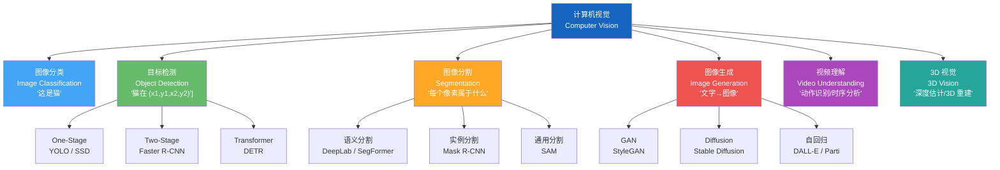
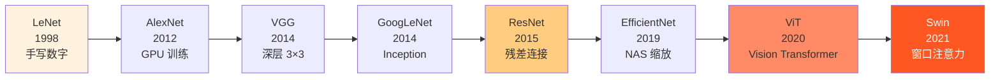

# 计算机视觉基础 (Computer Vision Fundamentals)

> 中文简称：计算机视觉基础

> **一句话理解**: 计算机视觉赋予机器"眼睛"——从分类、检测到分割、生成，核心骨干从 CNN 演进到 Vision Transformer，而 YOLO 系列让实时目标检测走进千家万户。

---

## TL;DR

- **任务分类**: 图像分类 → 目标检测 → 语义/实例分割 → 图像生成 → 视频理解 → 3D 重建
- **CNN 演进**: LeNet (1998) → AlexNet (2012) → VGG (2014) → ResNet (2015) → EfficientNet (2019)
- **Transformer 入侵**: ViT (2020) → Swin (2021) → ConvNeXt (2022)，CNN 与 Transformer 融合共存
- **目标检测**: YOLO 系列主导实时检测，DETR 引入 Transformer 端到端检测
- **图像分割**: SAM (Segment Anything) 统一分割范式，零样本泛化
- **生成模型**: GAN → Diffusion Models → DiT，Stable Diffusion / DALL-E / Midjourney 引领创作
- **视频生成**: Sora (2024) → 视频生成进入"世界模拟器"时代

---

## 本章节索引

本文是计算机视觉领域的总入口，向下链接核心子模块：

| 子模块 | 核心内容 | 链接 |
|--------|---------|------|
| **图像分类与检测** | ResNet、YOLO、DETR | [[04_计算机视觉/02_Image_Classification_Detection/Image_Classification_Detection]] |
| **图像分割** | 语义分割、实例分割、SAM | [[04_计算机视觉/03_Segmentation/Segmentation]] |
| **生成模型** | GAN、Diffusion、VAE | [[04_计算机视觉/06_Generative_Models/Generative_Models]] |
| **视频生成** | Sora、Runway、Kling | [[04_计算机视觉/07_Video_Generation/Video_Generation_2026]] |
| **3D 视觉** | NeRF、3D Gaussian Splatting | [[04_计算机视觉/05_3D_Vision/3D_Vision]] |

---

## 1. CV 任务树 (Task Taxonomy)

---

## 2. CNN 演进：从 LeNet 到 ViT

### 2.1 骨干网络对比

| 架构 | 年份 | 参数量 | ImageNet Top-1 | 核心创新 | 推理速度 |
|------|------|--------|---------------|---------|---------|
| **LeNet-5** | 1998 | 60K | — | 卷积+池化奠基 | 极快 |
| **AlexNet** | 2012 | 60M | 63.3% | ReLU + Dropout + GPU | 快 |
| **VGG-16** | 2014 | 138M | 71.3% | 统一 3×3 卷积 | 中 |
| **ResNet-50** | 2015 | 25.6M | 76.0% | 残差连接 (skip) | 快 |
| **ResNet-152** | 2015 | 60.2M | 78.3% | 极深网络可行性 | 中 |
| **EfficientNet-B7** | 2019 | 66M | 84.4% | 复合缩放 | 中 |
| **ViT-L/16** | 2020 | 307M | 87.8% | 图像 patch + Transformer | 慢 |
| **Swin-L** | 2021 | 197M | 87.3% | 层次化窗口注意力 | 中 |
| **ConvNeXt-L** | 2022 | 198M | 87.5% | 现代化 CNN | 快 |

**2026 选型建议**:
- 实时 / 边缘部署: EfficientNet-B0~B3 或 YOLOv8/YOLOv11
- 高精度分类: ConvNeXt 或 Swin Transformer
- 下游检测/分割: Swin 或 PVT 作为 backbone
- 资源受限: MobileNetV3 或 EfficientNet-Lite

---

## 3. 目标检测：YOLO 系列

YOLO (You Only Look Once) 将目标检测转化为单次回归问题，是实时检测的事实标准。

| 版本 | 年份 | 作者/团队 | mAP (COCO) | FPS | 核心改进 |
|------|------|----------|-----------|-----|---------|
| **YOLOv1** | 2016 | Redmon | 63.4 | 45 | 单次回归范式 |
| **YOLOv3** | 2018 | Redmon | 57.9 | 65 | 多尺度检测 |
| **YOLOv5** | 2020 | Ultralytics | 50.7 | 140 | 工程化、易用 |
| **YOLOv8** | 2023 | Ultralytics | 53.9 | 162 | Anchor-free、统一框架 |
| **YOLOv11** | 2024 | Ultralytics | 55.2 | 175 | C3k2 模块、效率提升 |
| **RT-DETR** | 2023 | Baidu | 54.8 | 114 | Transformer 实时检测 |

**检测范式对比**:

| 范式 | 代表 | 速度 | 精度 | 适用场景 |
|------|------|------|------|---------|
| **One-Stage** | YOLO, SSD | 快 (>100 FPS) | 中 | 实时应用、边缘部署 |
| **Two-Stage** | Faster R-CNN | 慢 (5-15 FPS) | 高 | 高精度离线检测 |
| **Transformer** | DETR, RT-DETR | 中 | 高 | 端到端、无 NMS |

---

## 4. 图像分割与生成模型

### 4.1 分割范式

| 类型 | 目标 | 代表模型 | 输出 |
|------|------|---------|------|
| **语义分割** | 像素级类别标注 | DeepLab, SegFormer | 每个像素的类别 |
| **实例分割** | 区分同类不同物体 | Mask R-CNN, SOLOv2 | 每个物体的掩码 |
| **全景分割** | 语义 + 实例统一 | Mask2Former | 完整场景解析 |
| **通用分割** | 零样本万物分割 | SAM (Segment Anything) | 任意提示 → 掩码 |

### 4.2 生成模型演进

| 时代 | 模型 | 原理 | 质量 | 速度 |
|------|------|------|------|------|
| **GAN 时代** | StyleGAN (2019-2021) | 对抗训练 | 高（人脸） | 快（单次前向） |
| **Diffusion 时代** | Stable Diffusion (2022-2024) | 逐步去噪 | 极高 | 慢（多步迭代） |
| **DiT 时代** | SD3, FLUX (2024-2026) | Diffusion + Transformer | 极高 | 中 |

---

## 延伸阅读 (Further Reading)

- [[04_计算机视觉/CV-in-nutshell]] — 计算机视觉速成指南
- [[04_计算机视觉/ViT_Deep_Dive]] — Vision Transformer 深度解读
- [[04_计算机视觉/02_Image_Classification_Detection/Image_Classification_Detection]] — 图像分类与检测
- [[04_计算机视觉/03_Segmentation/Segmentation]] — 图像分割
- [[04_计算机视觉/06_Generative_Models/Generative_Models]] — 生成模型
- [[04_计算机视觉/07_Video_Generation/Video_Generation_2026]] — 视频生成 2026
- [[04_计算机视觉/05_3D_Vision/3D_Vision]] — 3D 视觉

## 进阶知识拓展

| 主题 | 深度内容 | 应用场景 | 参考资源 |
|------|----------|----------|----------|
| 核心原理 | 底层机制和数学推导 | 深度理解+优化 | 经典教材+论文 |
| 工程实践 | 生产级实现细节 | 项目落地 | 开源项目+案例 |
| 性能优化 | 瓶颈分析+调优策略 | 提升效率 | 性能分析工具 |
| 安全合规 | 安全威胁+防护措施 | 风险管控 | 安全框架+标准 |
| 前沿研究 | 最新进展+未来方向 | 技术预判 | 顶会论文+博客 |

## 实践指南

| 步骤 | 行动 | 工具/方法 | 预期产出 |
|------|------|-----------|----------|
| 1. 学习 | 系统学习核心知识 | 教材/课程/文档 | 知识体系建立 |
| 2. 练习 | 动手实践加深理解 | 实验/项目/练习 | 技能熟练 |
| 3. 应用 | 在实际项目中应用 | 工作项目/开源 | 经验积累 |
| 4. 优化 | 持续改进和优化 | 性能分析/重构 | 质量提升 |
| 5. 分享 | 输出和分享知识 | 博客/演讲/教学 | 影响力建设 |

## 常见误区

| 误区 | 正确认知 | 建议 |
|------|----------|------|
| 只学理论不实践 | 实践是检验理解的唯一标准 | 每学一个概念就动手验证 |
| 追求完美再开始 | 完成比完美更重要 | 先做MVP再迭代 |
| 忽视基础知识 | 基础决定上限 | 定期回顾基础 |
| 盲目追新 | 新技术需要验证 | 评估后再采用 |
| 单打独斗 | 协作效率更高 | 积极参与社区 |

## 知识图谱关联

| 关联主题 | 关系类型 | 参考路径 |
|----------|----------|----------|
| 基础理论 | 前置依赖 | 相关基础目录 |
| 工具实践 | 实现支撑 | 工具/编程相关 |
| 应用场景 | 价值体现 | 18_行业应用/ |
| 前沿研究 | 发展方向 | 20_论文精读/ |
| 工程方法 | 质量保障 | 09_测试/13_运维/ |

## 版本更新记录

| 版本 | 日期 | 变更 |
|------|------|------|
| v1.0 | 2025-01 | 初始创建 |
| v1.1 | 2025-06 | 内容补充 |
| v2.0 | 2026-01 | 全面扩写 |
| v2.1 | 2026-07 | 质量强化+结构化增强 |

## 快速自检

- [ ] 核心概念能向他人清晰解释
- [ ] 已完成至少一个实践项目
- [ ] 了解主流方案优劣势和适用场景
- [ ] 掌握常见问题排查方法
- [ ] 关注最新技术动态
- [ ] 知识已文档化沉淀
