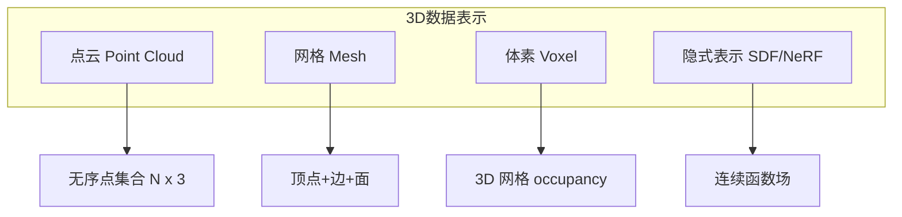
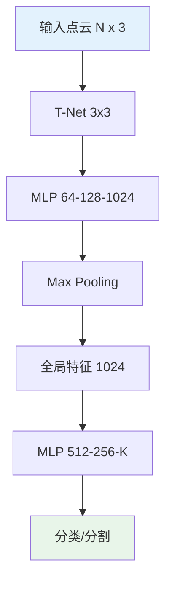
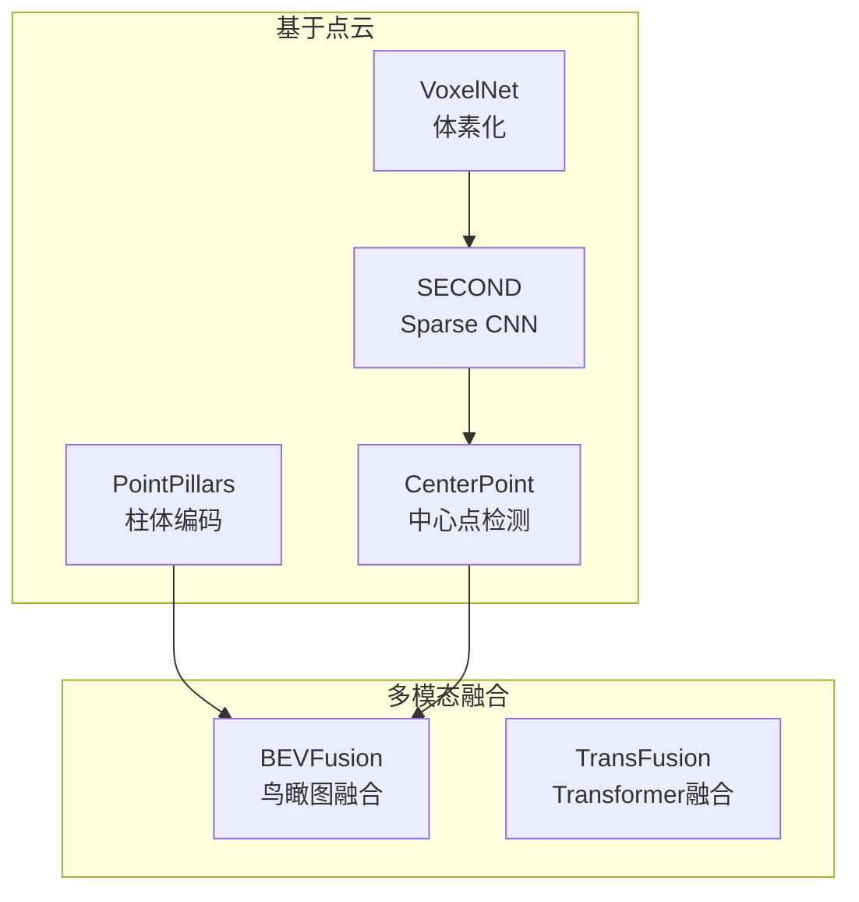
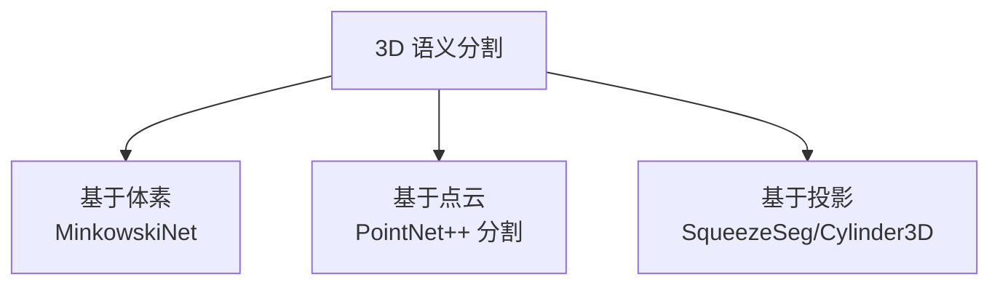
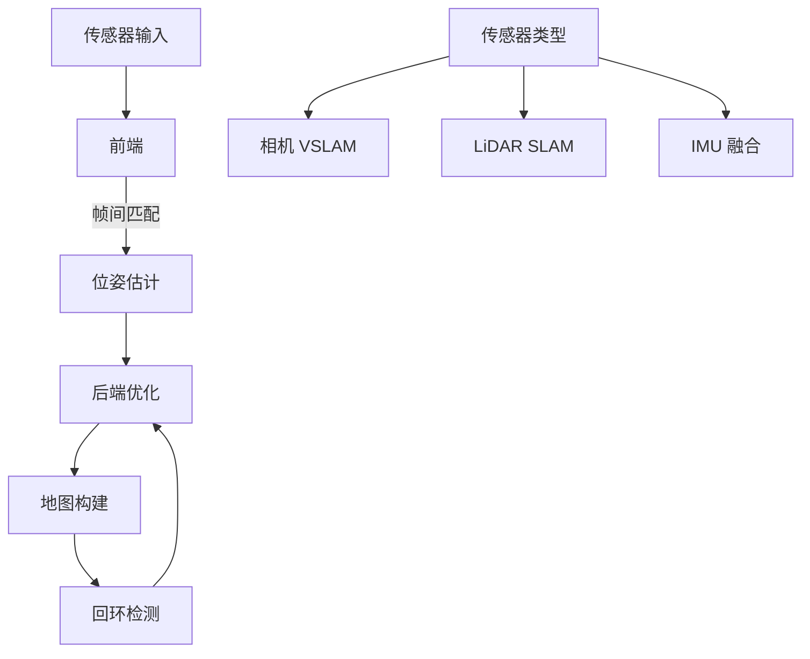
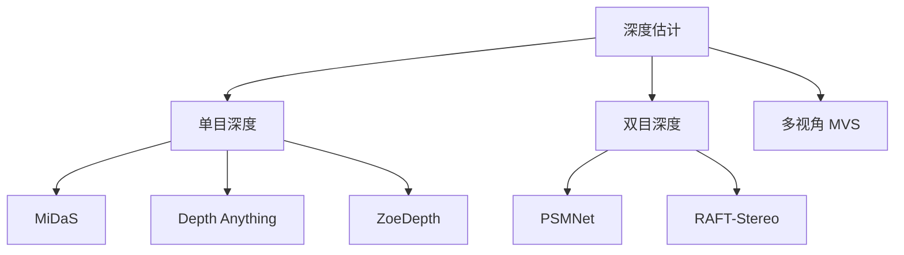
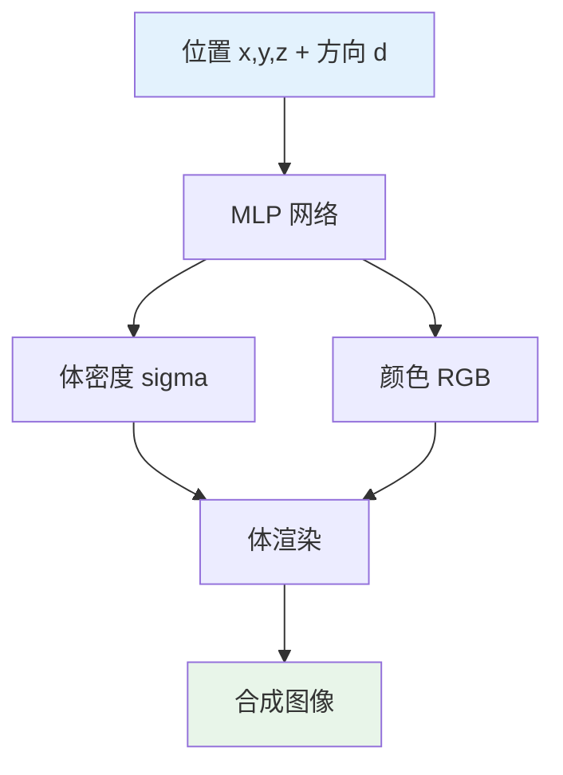
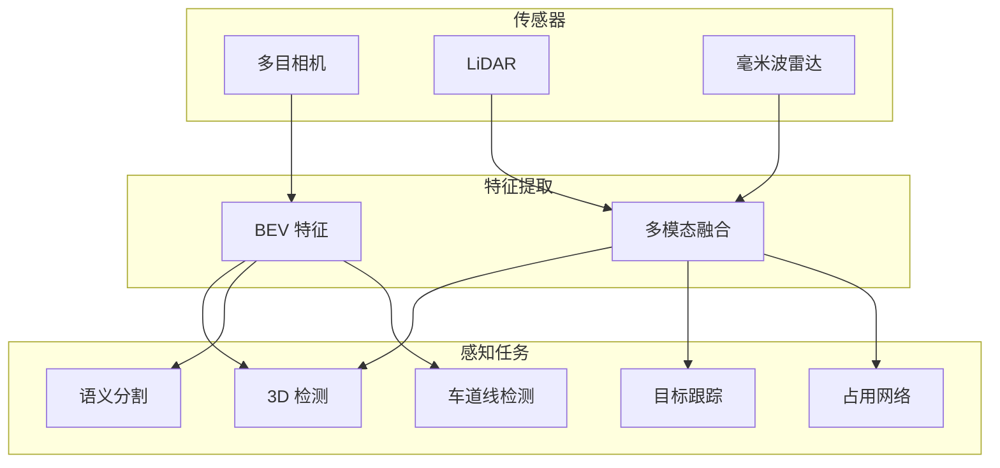

# 3D 计算机视觉

> 中文简称：3D 计算机视觉

> **一句话秒懂**: 3D 计算机视觉让机器不仅能"看"到平面图像，还能理解物体的深度、形状和三维空间关系。

## 目录

- [3D 数据表示](#3d-数据表示)
- [点云处理](#点云处理)
- [3D 目标检测](#3d-目标检测)
- [3D 语义分割](#3d-语义分割)
- [SLAM 基础](#slam-基础)
- [深度估计](#深度估计)
- [NeRF](#nerf)
- [3D Gaussian Splatting](#3d-gaussian-splatting)
- [自动驾驶感知](#自动驾驶感知)

---

## 3D 数据表示

### 四种主流表示方法



### 对比

| 表示方法 | 存储 | 精度 | 操作性 | 应用 |
|----------|------|------|--------|------|
| 点云 | 小 | 中 | 低 | LiDAR 扫描 |
| 网格 | 中 | 高 | 高 | 图形学、3D 打印 |
| 体素 | 大 | 低 | 中 | 3D CNN 输入 |
| SDF/NeRF | 小 | 极高 | 低 | 新视角合成 |

### 点云 (Point Cloud)

```python
import numpy as np
import torch

class PointCloud:
    def __init__(self, points: np.ndarray, colors: np.ndarray = None):
        self.points = points  # (N, 3) xyz 坐标
        self.colors = colors  # (N, 3) RGB 颜色
        self.normals = None   # (N, 3) 法向量

    @property
    def num_points(self) -> int:
        return self.points.shape[0]

    def bounding_box(self) -> dict:
        mins = self.points.min(axis=0)
        maxs = self.points.max(axis=0)
        return {"min": mins, "max": maxs, "size": maxs - mins}

    def normalize(self) -> "PointCloud":
        centroid = self.points.mean(axis=0)
        self.points -= centroid
        max_dist = np.max(np.linalg.norm(self.points, axis=1))
        self.points /= max_dist
        return self

    def random_sample(self, n: int) -> "PointCloud":
        indices = np.random.choice(self.num_points, n, replace=self.num_points < n)
        colors = self.colors[indices] if self.colors is not None else None
        return PointCloud(self.points[indices], colors)

    def farthest_point_sample(self, n: int) -> "PointCloud":
        """最远点采样"""
        N = self.num_points
        centroids = np.zeros(n, dtype=int)
        distance = np.ones(N) * 1e10
        farthest = np.random.randint(0, N)
        for i in range(n):
            centroids[i] = farthest
            centroid = self.points[farthest]
            dist = np.sum((self.points - centroid) ** 2, axis=1)
            distance = np.minimum(distance, dist)
            farthest = np.argmax(distance)
        colors = self.colors[centroids] if self.colors is not None else None
        return PointCloud(self.points[centroids], colors)

    def to_tensor(self) -> torch.Tensor:
        return torch.FloatTensor(self.points)

pc = PointCloud(
    points=np.random.randn(10000, 3),
    colors=np.random.randint(0, 255, (10000, 3))
)
sampled = pc.farthest_point_sample(1024)
print(f"原始: {pc.num_points} 点, 采样后: {sampled.num_points} 点")
```

### 体素 (Voxel)

```python
import numpy as np

def point_cloud_to_voxel(
    points: np.ndarray,
    voxel_size: float = 0.1,
    grid_size: int = 32,
) -> np.ndarray:
    """将点云转换为体素网格"""
    mins = points.min(axis=0)
    grid = np.zeros((grid_size, grid_size, grid_size), dtype=np.float32)

    for point in points:
        idx = ((point - mins) / voxel_size).astype(int)
        if all(0 <= i < grid_size for i in idx):
            grid[idx[0], idx[1], idx[2]] = 1.0

    return grid

points = np.random.randn(10000, 3).astype(np.float32)
voxel_grid = point_cloud_to_voxel(points, voxel_size=0.2, grid_size=32)
print(f"体素网格形状: {voxel_grid.shape}")
print(f"占用体素数: {voxel_grid.sum()}")
```

---

## 点云处理

### PointNet



```python
import torch
import torch.nn as nn
import torch.nn.functional as F

class TNet(nn.Module):
    def __init__(self, k: int = 3):
        super().__init__()
        self.k = k
        self.conv = nn.Sequential(
            nn.Conv1d(k, 64, 1), nn.BatchNorm1d(64), nn.ReLU(),
            nn.Conv1d(64, 128, 1), nn.BatchNorm1d(128), nn.ReLU(),
            nn.Conv1d(128, 1024, 1), nn.BatchNorm1d(1024), nn.ReLU(),
        )
        self.fc = nn.Sequential(
            nn.Linear(1024, 512), nn.BatchNorm1d(512), nn.ReLU(),
            nn.Linear(512, 256), nn.BatchNorm1d(256), nn.ReLU(),
            nn.Linear(256, k * k),
        )
        self.eye = torch.eye(k).unsqueeze(0)

    def forward(self, x):
        batch_size = x.size(0)
        out = self.conv(x)
        out = F.max_pool1d(out, out.size(2)).squeeze(2)
        out = self.fc(out)
        out = out.view(batch_size, self.k, self.k)
        out += self.eye.to(x.device)
        return out

class PointNetClassifier(nn.Module):
    def __init__(self, num_classes: int = 10, num_points: int = 1024):
        super().__init__()
        self.tnet = TNet(k=3)

        self.conv = nn.Sequential(
            nn.Conv1d(3, 64, 1), nn.BatchNorm1d(64), nn.ReLU(),
            nn.Conv1d(64, 128, 1), nn.BatchNorm1d(128), nn.ReLU(),
            nn.Conv1d(128, 1024, 1), nn.BatchNorm1d(1024), nn.ReLU(),
        )

        self.fc = nn.Sequential(
            nn.Linear(1024, 512), nn.BatchNorm1d(512), nn.ReLU(), nn.Dropout(0.3),
            nn.Linear(512, 256), nn.BatchNorm1d(256), nn.ReLU(), nn.Dropout(0.3),
            nn.Linear(256, num_classes),
        )

    def forward(self, x):
        # x: (batch, 3, N)
        transform = self.tnet(x)
        x = x.transpose(2, 1)
        x = torch.bmm(x, transform)
        x = x.transpose(2, 1)

        features = self.conv(x)
        global_feature = F.max_pool1d(features, features.size(2)).squeeze(2)
        output = self.fc(global_feature)
        return output

model = PointNetClassifier(num_classes=10)
x = torch.randn(16, 3, 1024)
out = model(x)
print(f"输入: {x.shape} -> 输出: {out.shape}")
```

### PointNet++ 分层特征提取

```python
class PointNetSetAbstraction(nn.Module):
    """PointNet++ 的集合抽象层"""

    def __init__(self, npoint: int, radius: float, nsample: int, in_channel: int, mlp: list):
        super().__init__()
        self.npoint = npoint
        self.radius = radius
        self.nsample = nsample

        layers = []
        last_channel = in_channel
        for out_channel in mlp:
            layers.extend([
                nn.Conv2d(last_channel, out_channel, 1),
                nn.BatchNorm2d(out_channel),
                nn.ReLU(),
            ])
            last_channel = out_channel
        self.mlp = nn.Sequential(*layers)

    def forward(self, xyz: torch.Tensor, points: torch.Tensor = None):
        """
        xyz: (B, N, 3) 点坐标
        points: (B, N, C) 点特征（可选）
        """
        B, N, _ = xyz.shape
        device = xyz.device

        # 采样中心点
        fps_idx = torch.randint(0, N, (B, self.npoint), device=device)
        new_xyz = torch.gather(
            xyz, 1, fps_idx.unsqueeze(-1).expand(-1, -1, 3)
        )

        # 球查询分组
        dist = torch.cdist(new_xyz, xyz)  # (B, npoint, N)
        group_idx = dist.argsort(dim=-1)[:, :, :self.nsample]  # (B, npoint, nsample)

        grouped_xyz = torch.gather(
            xyz.unsqueeze(1).expand(-1, self.npoint, -1, -1),
            2,
            group_idx.unsqueeze(-1).expand(-1, -1, -1, 3)
        )
        grouped_xyz -= new_xyz.unsqueeze(2)

        if points is not None:
            grouped_points = torch.gather(
                points.unsqueeze(1).expand(-1, self.npoint, -1, -1),
                2,
                group_idx.unsqueeze(-1).expand(-1, -1, -1, points.size(-1))
            )
            grouped = torch.cat([grouped_xyz, grouped_points], dim=-1)
        else:
            grouped = grouped_xyz

        grouped = grouped.permute(0, 3, 1, 2)  # (B, C, npoint, nsample)
        new_points = self.mlp(grouped)
        new_points = torch.max(new_points, dim=-1)[0]  # (B, C, npoint)
        new_points = new_points.permute(0, 2, 1)  # (B, npoint, C)

        return new_xyz, new_points

class PointNetPlusPlus(nn.Module):
    def __init__(self, num_classes: int = 10):
        super().__init__()
        self.sa1 = PointNetSetAbstraction(512, 0.2, 32, 3, [64, 64, 128])
        self.sa2 = PointNetSetAbstraction(128, 0.4, 64, 128 + 3, [128, 128, 256])
        self.sa3 = PointNetSetAbstraction(1, None, None, 256 + 3, [256, 512, 1024])

        self.fc = nn.Sequential(
            nn.Linear(1024, 512), nn.BatchNorm1d(512), nn.ReLU(), nn.Dropout(0.3),
            nn.Linear(512, 256), nn.BatchNorm1d(256), nn.ReLU(), nn.Dropout(0.3),
            nn.Linear(256, num_classes),
        )

    def forward(self, x):
        # x: (B, N, 3)
        xyz, points = self.sa1(x)
        xyz, points = self.sa2(xyz, points)
        xyz, points = self.sa3(xyz, points)
        points = points.squeeze(1)
        return self.fc(points)

model = PointNetPlusPlus(num_classes=10)
x = torch.randn(16, 1024, 3)
out = model(x)
print(f"PointNet++ 输入: {x.shape} -> 输出: {out.shape}")
```

---

## 3D 目标检测

### 方法对比



### PointPillars


```python
import torch
import torch.nn as nn

class PillarFeatureNet(nn.Module):
    """PointPillars 的 Pillar 特征提取"""

    def __init__(
        self,
        num_features: int = 9,
        num_filters: int = 64,
        max_pillars: int = 12000,
        max_points_per_pillar: int = 100,
        voxel_size: list = [0.16, 0.16, 4.0],
        point_cloud_range: list = [0, -39.68, -3, 69.12, 39.68, 1],
    ):
        super().__init__()
        self.max_pillars = max_pillars
        self.max_points = max_points_per_pillar
        self.voxel_size = voxel_size
        self.pc_range = point_cloud_range

        grid_size = [
            (point_cloud_range[3] - point_cloud_range[0]) / voxel_size[0],
            (point_cloud_range[4] - point_cloud_range[1]) / voxel_size[1],
        ]
        self.grid_x = int(grid_size[0])
        self.grid_y = int(grid_size[1])

        self.mlp = nn.Sequential(
            nn.Linear(num_features, 64), nn.BatchNorm1d(64), nn.ReLU(),
            nn.Linear(64, num_filters), nn.BatchNorm1d(num_filters), nn.ReLU(),
        )

    def forward(self, pillars: torch.Tensor, indices: torch.Tensor):
        # pillars: (max_pillars, max_points, 9)
        batch_size = 1
        features = self.mlp(pillars.view(-1, pillars.size(-1)))
        features = features.view(self.max_pillars, self.max_points, -1)
        features = features.max(dim=1)[0]  # (max_pillars, C)

        # 散布到伪图像
        pseudo_image = torch.zeros(
            batch_size, features.size(-1), self.grid_y, self.grid_x,
            device=features.device
        )

        x_idx = indices[:, 0].long()
        y_idx = indices[:, 1].long()
        valid = (x_idx >= 0) & (y_idx >= 0) & (x_idx < self.grid_x) & (y_idx < self.grid_y)

        pseudo_image[0, :, y_idx[valid], x_idx[valid]] = features[valid].T

        return pseudo_image

class PointPillarsDetector(nn.Module):
    def __init__(self, num_classes: int = 3):
        super().__init__()
        self.pillar_net = PillarFeatureNet()

        self.backbone = nn.Sequential(
            nn.Conv2d(64, 64, 3, stride=2, padding=1), nn.BatchNorm2d(64), nn.ReLU(),
            nn.Conv2d(64, 128, 3, stride=2, padding=1), nn.BatchNorm2d(128), nn.ReLU(),
            nn.Conv2d(128, 256, 3, stride=2, padding=1), nn.BatchNorm2d(256), nn.ReLU(),
        )

        self.detect_head = nn.Conv2d(256, num_classes * 7, 1)

    def forward(self, pillars, indices):
        pseudo_img = self.pillar_net(pillars, indices)
        features = self.backbone(pseudo_img)
        detections = self.detect_head(features)
        return detections
```

### 3D 检测评估指标

| 指标 | 说明 |
|------|------|
| AP (Average Precision) | 不同 IoU 阈值下的平均精度 |
| AP_3D | 3D 边界框 IoU 下的 AP |
| AP_BEV | 鸟瞰图 IoU 下的 AP |
| AP_40 | 40 个召回点的 AP |
| NDS | nuScenes 检测分数 |

---

## 3D 语义分割

### 方法概览



### 点云分割网络

```python
class PointNetSegmenter(nn.Module):
    """PointNet 语义分割"""

    def __init__(self, num_classes: int = 13):
        super().__init__()
        self.conv = nn.Sequential(
            nn.Conv1d(3, 64, 1), nn.BatchNorm1d(64), nn.ReLU(),
            nn.Conv1d(64, 128, 1), nn.BatchNorm1d(128), nn.ReLU(),
            nn.Conv1d(128, 1024, 1), nn.BatchNorm1d(1024), nn.ReLU(),
        )

        self.seg_head = nn.Sequential(
            nn.Conv1d(1024 + 64, 512, 1), nn.BatchNorm1d(512), nn.ReLU(),
            nn.Conv1d(512, 256, 1), nn.BatchNorm1d(256), nn.ReLU(),
            nn.Conv1d(256, 128, 1), nn.BatchNorm1d(128), nn.ReLU(),
            nn.Conv1d(128, num_classes, 1),
        )

    def forward(self, x):
        # x: (B, 3, N)
        local_features = self.conv[:3](x)  # (B, 64, N)
        global_features = self.conv(x)  # (B, 1024, N)
        global_features = global_features.max(dim=2, keepdim=True)[0]
        global_features = global_features.expand(-1, -1, x.size(2))

        combined = torch.cat([local_features, global_features], dim=1)
        return self.seg_head(combined)

model = PointNetSegmenter(num_classes=13)
x = torch.randn(4, 3, 1024)
out = model(x)
print(f"分割输出: {out.shape}")  # (4, 13, 1024)
```

---

## SLAM 基础

### SLAM 是什么？

```
SLAM = Simultaneous Localization And Mapping
同时定位与建图

机器人/自动驾驶的核心能力：
"我在哪？" + "周围环境是什么样子？"
```

### SLAM 系统架构



### 主要 SLAM 方法

| 方法 | 类型 | 特点 | 应用 |
|------|------|------|------|
| ORB-SLAM3 | 视觉 | 支持单目/双目/RGB-D | 机器人导航 |
| LIO-SAM | LiDAR+IMU | 紧耦合、实时 | 自动驾驶 |
| RTAB-Map | 多传感器 | 支持多种传感器 | 通用 SLAM |
| Cartographer | LiDAR | Google 开源 | 机器人 |
| VINS-Fusion | 视觉+IMU | 无人机导航 | 无人机 |
| DROID-SLAM | 深度学习 | 端到端 | 研究 |

### 特征点提取与匹配

```python
import cv2
import numpy as np

class FeatureMatcher:
    def __init__(self):
        self.detector = cv2.ORB_create(nfeatures=2000)
        self.matcher = cv2.BFMatcher(cv2.NORM_HAMMING, crossCheck=True)

    def extract_and_match(self, img1: np.ndarray, img2: np.ndarray):
        kp1, des1 = self.detector.detectAndCompute(img1, None)
        kp2, des2 = self.detector.detectAndCompute(img2, None)

        matches = self.matcher.match(des1, des2)
        matches = sorted(matches, key=lambda x: x.distance)[:500]

        pts1 = np.float32([kp1[m.queryIdx].pt for m in matches])
        pts2 = np.float32([kp2[m.trainIdx].pt for m in matches])

        return pts1, pts2, matches

    def estimate_pose(self, pts1, pts2, K):
        E, mask = cv2.findEssentialMat(pts1, pts2, K, cv2.RANSAC, 0.999, 1.0)
        _, R, t, mask = cv2.recoverPose(E, pts1, pts2, K)
        return R, t

matcher = FeatureMatcher()
img1 = cv2.imread("frame_001.png")
img2 = cv2.imread("frame_002.png")
pts1, pts2, matches = matcher.extract_and_match(img1, img2)

K = np.array([[500, 0, 320], [0, 500, 240], [0, 0, 1]])
R, t = matcher.estimate_pose(pts1, pts2, K)
print(f"旋转矩阵:\n{R}")
print(f"平移向量:\n{t}")
```

---

## 深度估计

### 方法分类



### 单目深度估计 (MiDaS 风格)

```python
import torch
import torch.nn as nn

class MonocularDepthNet(nn.Module):
    def __init__(self):
        super().__init__()
        self.encoder = nn.Sequential(
            nn.Conv2d(3, 64, 7, stride=2, padding=3), nn.BatchNorm2d(64), nn.ReLU(),
            nn.MaxPool2d(2),
            self._make_layer(64, 128, 2),
            self._make_layer(128, 256, 2),
            self._make_layer(256, 512, 2),
            self._make_layer(512, 1024, 2),
        )

        self.decoder = nn.Sequential(
            nn.ConvTranspose2d(1024, 512, 2, stride=2), nn.BatchNorm2d(512), nn.ReLU(),
            nn.Conv2d(512, 512, 3, padding=1), nn.BatchNorm2d(512), nn.ReLU(),
            nn.ConvTranspose2d(512, 256, 2, stride=2), nn.BatchNorm2d(256), nn.ReLU(),
            nn.Conv2d(256, 256, 3, padding=1), nn.BatchNorm2d(256), nn.ReLU(),
            nn.ConvTranspose2d(256, 128, 2, stride=2), nn.BatchNorm2d(128), nn.ReLU(),
            nn.Conv2d(128, 128, 3, padding=1), nn.BatchNorm2d(128), nn.ReLU(),
            nn.ConvTranspose2d(128, 64, 2, stride=2), nn.BatchNorm2d(64), nn.ReLU(),
            nn.Conv2d(64, 1, 3, padding=1),
            nn.Sigmoid(),
        )

    def _make_layer(self, in_c, out_c, blocks):
        layers = [nn.Conv2d(in_c, out_c, 3, padding=1), nn.BatchNorm2d(out_c), nn.ReLU()]
        for _ in range(blocks - 1):
            layers.extend([
                nn.Conv2d(out_c, out_c, 3, padding=1),
                nn.BatchNorm2d(out_c),
                nn.ReLU(),
            ])
        return nn.Sequential(*layers)

    def forward(self, x):
        features = self.encoder(x)
        depth = self.decoder(features)
        return nn.functional.interpolate(depth, size=x.shape[2:], mode="bilinear")

model = MonocularDepthNet()
x = torch.randn(2, 3, 384, 512)
depth = model(x)
print(f"深度图: {depth.shape}, 范围: [{depth.min():.3f}, {depth.max():.3f}]")
```

### 使用 Depth Anything

```python
from transformers import pipeline

depth_estimator = pipeline(
    "depth-estimation",
    model="depth-anything/Depth-Anything-V2-Small-hf"
)

result = depth_estimator("scene.jpg")
print(type(result["depth"]))

from PIL import Image
import numpy as np

depth_array = np.array(result["depth"])
depth_normalized = (depth_array - depth_array.min()) / (depth_array.max() - depth_array.min())
depth_image = Image.fromarray((depth_normalized * 255).astype(np.uint8))
depth_image.save("depth_output.png")
```

---

## NeRF

### Neural Radiance Fields 原理



### NeRF 核心代码

```python
import torch
import torch.nn as nn

class NeRF(nn.Module):
    def __init__(self, pos_dim: int = 63, dir_dim: int = 27, hidden: int = 256):
        super().__init__()

        self.pos_encoder = PositionalEncoding(L=10)
        self.dir_encoder = PositionalEncoding(L=4)

        self.pos_dim = pos_dim
        self.dir_dim = dir_dim

        self backbone = nn.Sequential(
            nn.Linear(pos_dim, hidden), nn.ReLU(),
            nn.Linear(hidden, hidden), nn.ReLU(),
            nn.Linear(hidden, hidden), nn.ReLU(),
            nn.Linear(hidden, hidden), nn.ReLU(),
        )

        self.density_head = nn.Sequential(
            nn.Linear(hidden + pos_dim, hidden), nn.ReLU(),
            nn.Linear(hidden, 1),
        )

        self.feature_head = nn.Linear(hidden, hidden)
        self.color_head = nn.Sequential(
            nn.Linear(hidden + dir_dim, hidden // 2), nn.ReLU(),
            nn.Linear(hidden // 2, 3), nn.Sigmoid(),
        )

    def forward(self, positions: torch.Tensor, directions: torch.Tensor):
        pos_enc = self.pos_encoder(positions)
        dir_enc = self.dir_encoder(directions)

        features = self.backbone(pos_enc)
        density = self.density_head(torch.cat([features, pos_enc], dim=-1))

        features = self.feature_head(features)
        color = self.color_head(torch.cat([features, dir_enc], dim=-1))

        return color, density.squeeze(-1)

class PositionalEncoding(nn.Module):
    def __init__(self, L: int = 10):
        super().__init__()
        self.L = L

    def forward(self, x: torch.Tensor) -> torch.Tensor:
        freqs = 2.0 ** torch.arange(self.L, device=x.device) * torch.pi
        x_scaled = x.unsqueeze(-1) * freqs
        enc = torch.cat([torch.sin(x_scaled), torch.cos(x_scaled)], dim=-1)
        return enc.flatten(-2)

def volume_rendering(
    colors: torch.Tensor,
    densities: torch.Tensor,
    depths: torch.Tensor,
):
    """体渲染"""
    deltas = depths[..., 1:] - depths[..., :-1]
    deltas = torch.cat([deltas, torch.full_like(deltas[..., :1], 1e10)], dim=-1)

    alpha = 1.0 - torch.exp(-densities * deltas)
    transmittance = torch.cumprod(1.0 - alpha + 1e-10, dim=-1)
    transmittance = torch.cat(
        [torch.ones_like(transmittance[..., :1]), transmittance[..., :-1]], dim=-1
    )

    weights = transmittance * alpha
    rendered_color = (weights.unsqueeze(-1) * colors).sum(dim=-2)
    rendered_depth = (weights * depths).sum(dim=-1)

    return rendered_color, rendered_depth

nerf = NeRF()
positions = torch.randn(1024, 3)
directions = torch.randn(1024, 3)
colors, densities = nerf(positions, directions)
print(f"颜色: {colors.shape}, 密度: {densities.shape}")
```

---

## 3D Gaussian Splatting

### 原理

```
NeRF:   连续隐式场 → MLP 查询 → 慢
3DGS:   离散高斯点 → 可微光栅化 → 快

每个高斯包含：
- 位置 (x, y, z)
- 协方差 (缩放 + 旋转)
- 不透明度 (alpha)
- 球谐系数 (颜色)
```


### 高斯表示

```python
import torch
import torch.nn as nn
from torch.quaternion import random_quaternions

class GaussianSplat(nn.Module):
    def __init__(self, num_gaussians: int = 100000):
        super().__init__()
        self.num_gaussians = num_gaussians

        self.positions = nn.Parameter(torch.randn(num_gaussians, 3) * 0.1)
        self.scales = nn.Parameter(torch.randn(num_gaussians, 3).exp() * 0.01)
        self.rotations = nn.Parameter(random_quaternions(num_gaussians))
        self.opacities = nn.Parameter(torch.ones(num_gaussians, 1) * 0.5)
        self.sh_coeffs = nn.Parameter(torch.randn(num_gaussians, 16, 3) * 0.01)

    def get_covariance(self):
        R = quaternion_to_matrix(self.rotations)
        S = torch.diag_embed(self.scales.exp())
        RS = torch.bmm(R, S)
        return torch.bmm(RS, RS.transpose(1, 2))

    def get_colors(self, directions: torch.Tensor):
        return self.sh_coeffs[:, 0, :]

def quaternion_to_matrix(q: torch.Tensor) -> torch.Tensor:
    w, x, y, z = q[:, 0], q[:, 1], q[:, 2], q[:, 3]
    R = torch.stack([
        1 - 2*(y*y + z*z), 2*(x*y - w*z), 2*(x*z + w*y),
        2*(x*y + w*z), 1 - 2*(x*x + z*z), 2*(y*z - w*x),
        2*(x*z - w*y), 2*(y*z + w*x), 1 - 2*(x*x + y*y),
    ], dim=-1).reshape(-1, 3, 3)
    return R

model = GaussianSplat(num_gaussians=50000)
print(f"高斯数量: {model.num_gaussians}")
print(f"位置: {model.positions.shape}")
print(f"协方差: {model.get_covariance().shape}")
```

---

## 自动驾驶感知

### 感知系统架构



### BEV (Bird's Eye View) 感知

```python
class BEVPerspectiveTransform:
    """将相机视图转换为鸟瞰图"""

    def __init__(self, image_size: tuple = (512, 512), bev_size: tuple = (256, 256)):
        self.image_h, self.image_w = image_size
        self.bev_h, self.bev_w = bev_size

    def compute_transform(
        self,
        intrinsic: torch.Tensor,
        extrinsic: torch.Tensor,
        bev_range: list = [-50, 50, -50, 50, 0, 10],
    ):
        B = intrinsic.size(0)

        bev_x = torch.linspace(bev_range[0], bev_range[1], self.bev_w)
        bev_y = torch.linspace(bev_range[2], bev_range[3], self.bev_h)
        bev_z = torch.ones_like(bev_x) * 1.0

        grid_x, grid_y = torch.meshgrid(bev_x, bev_y)
        grid_z = torch.ones_like(grid_x)

        bev_points = torch.stack([grid_x, grid_y, grid_z], dim=-1).reshape(-1, 3)
        bev_points_h = torch.cat(
            [bev_points, torch.ones(bev_points.size(0), 1)], dim=-1
        )

        transform = intrinsic @ torch.inverse(extrinsic)
        image_points = (transform @ bev_points_h.T).T
        image_points = image_points[:, :2] / image_points[:, 2:3]

        return image_points

transform = BEVPerspectiveTransform()
intrinsic = torch.eye(3).unsqueeze(0)
extrinsic = torch.eye(4).unsqueeze(0)
extrinsic[0, 2, 3] = 1.5

image_pts = transform.compute_transform(intrinsic, extrinsic)
print(f"BEV -> 图像投影: {image_pts.shape}")
```

### 感知模型对比

| 模型 | 传感器 | 3D AP (Car) | FPS | 应用 |
|------|--------|-------------|-----|------|
| PointPillars | LiDAR | 74.99 | 42 | 实时检测 |
| CenterPoint | LiDAR | 77.1 | 16 | 高精度 |
| BEVDet | Camera | 41.6 | 15 | 纯视觉 |
| BEVFormer | Camera | 48.1 | 3 | 高精度视觉 |
| BEVFusion | Camera+LiDAR | 70.2 | 5 | 多模态 |
| TransFusion-L | LiDAR | 75.2 | 13 | Transformer |

### 自动驾驶感知管线

```python
class PerceptionPipeline:
    def __init__(self):
        self.detector_3d = PointPillarsDetector(num_classes=3)
        self.depth_estimator = MonocularDepthNet()
        self.segmenter = PointNetSegmenter(num_classes=13)

    def process_frame(
        self,
        point_cloud: torch.Tensor,
        images: list[torch.Tensor],
    ) -> dict:
        results = {}

        # 3D 目标检测
        pillars, indices = self.voxelize(point_cloud)
        detections = self.detector_3d(pillars, indices)
        results["detections_3d"] = self.decode_detections(detections)

        # 深度估计
        depths = []
        for img in images:
            depth = self.depth_estimator(img)
            depths.append(depth)
        results["depth_maps"] = depths

        # 点云分割
        pc_tensor = point_cloud.unsqueeze(0).transpose(2, 1)
        segmentation = self.segmenter(pc_tensor)
        results["segmentation"] = segmentation.argmax(dim=1)

        return results

    def voxelize(self, points: torch.Tensor):
        return torch.randn(12000, 100, 9), torch.randint(0, 432, (12000, 2))

    def decode_detections(self, raw: torch.Tensor):
        return [{"class": "car", "score": 0.95, "box3d": [0, 0, 0, 4.5, 2.0, 1.5, 0.1]}]

pipeline = PerceptionPipeline()
pc = torch.randn(50000, 3)
images = [torch.randn(1, 3, 384, 512) for _ in range(6)]
result = pipeline.process_frame(pc, images)
```

---

## 总结

### 技术选型

```
┌─────────────────────────────────────────────┐
│          3D 视觉技术选型                      │
├─────────────────────────────────────────────┤
│                                             │
│  点云分类/分割 → PointNet / PointNet++      │
│  3D 目标检测   → PointPillars / CenterPoint │
│  深度估计       → Depth Anything V2         │
│  新视角合成     → 3D Gaussian Splatting     │
│  SLAM          → ORB-SLAM3 / LIO-SAM       │
│  自动驾驶       → BEVFusion                 │
│                                             │
└─────────────────────────────────────────────┘
```

### 相关文档

- [OCR 与文字识别](../04_OCR与文字识别/02_OCR与文字识别.md)
- [计算机视觉概述](04_计算机视觉/01_CV基础/04_CV_简明指南.md)
- [部署推理 2026](10_部署推理/01_部署基础/02_部署推理_2026.md)
- [图像分类与检测](../02_图像分类与检测/)
