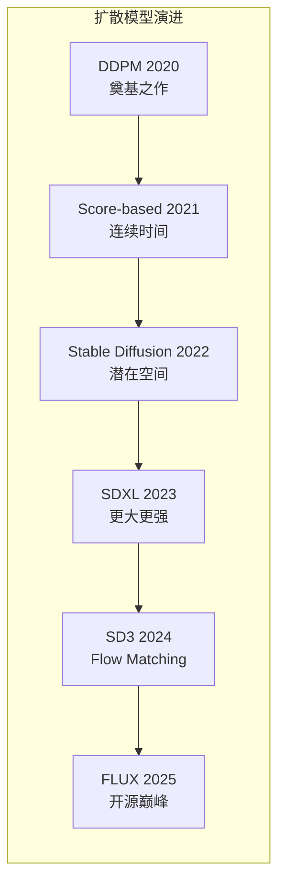

# 扩散模型深度解读 (Diffusion Models Deep Dive)

> **一句话理解**: 扩散模型通过逐步去噪来生成高质量图像——就像雕塑家从一块大理石中"去掉多余的部分"，每一步都在让图像变得更清晰。

---

## TL;DR

- **核心思想**: 正向过程加噪 → 反向过程去噪 → 训练去噪网络 → 从噪声生成图像
- **数学基础**: 变分下界 (ELBO)、Score Matching、SDE/ODE 采样
- **里程碑模型**: DDPM (2020) → Score-based (2021) → Stable Diffusion (2022) → SDXL/SD3 (2024) → FLUX (2025)
- **关键技术**: Classifier-Free Guidance、LoRA 微调、ControlNet、IP-Adapter
- **应用场景**: 图像生成、编辑、超分、视频生成、3D 生成



---

## 1. 核心原理

### 1.1 正向扩散过程 (Forward Process)

逐步向图像添加高斯噪声，直到变成纯噪声：

```
x₀ (原始图像)
  → x₁ = √(1-β₁) x₀ + √β₁ ε₁     (加一点噪声)
  → x₂ = √(1-β₂) x₁ + √β₂ ε₂     (再加一点)
  → ...
  → x_T ≈ N(0, I)                   (纯噪声)

其中 ε ~ N(0, I) 是标准高斯噪声
β₁ < β₂ < ... < β_T 是噪声调度（variance schedule）
```

**直觉**：就像把一张清晰的照片逐渐变得模糊，直到完全看不出原来是什么。

### 1.2 反向去噪过程 (Reverse Process)

训练一个神经网络学习如何从噪声中恢复图像：

```
x_T (纯噪声)
  → x_{T-1} = 去噪网络预测的分布
  → x_{T-2} = 再去噪一步
  → ...
  → x₀ (生成的图像)

神经网络 ε_θ(x_t, t) 预测：在时间步 t，输入 x_t 中的噪声是什么
训练目标：minimize ||ε - ε_θ(x_t, t)||²
```

### 1.3 DDPM 训练算法

```python
# DDPM 训练伪代码
for step in range(training_steps):
    x_0 = sample_real_image()           # 取一张真实图像
    t = random.randint(1, T)            # 随机选一个时间步
    epsilon = torch.randn_like(x_0)     # 随机噪声
    
    # 构造加噪图像（利用闭式解，一步到位）
    alpha_bar_t = cumulative_product(1 - beta, t)
    x_t = sqrt(alpha_bar_t) * x_0 + sqrt(1 - alpha_bar_t) * epsilon
    
    # 训练网络预测噪声
    predicted_noise = model(x_t, t)
    loss = MSE(predicted_noise, epsilon)
    loss.backward()
```

---

## 2. 采样方法

### 2.1 DDPM 采样（慢但质量高）

```python
# 需要 T 步（通常 1000 步），非常慢
x_T = torch.randn(image_shape)
for t in reversed(range(T)):
    predicted_noise = model(x_t, t)
    x_t = (1/sqrt(alpha_t)) * (x_t - (1-alpha_t)/sqrt(1-alpha_bar_t) * predicted_noise)
    if t > 0:
        z = torch.randn_like(x_t)
        x_t += sigma_t * z  # 加回一点随机性
```

### 2.2 DDIM 采样（快速确定性）

```python
# 可以跳步：1000步 → 50步甚至 10步
# 确定性采样：同样的噪声总是生成同样的图像
for t in subsequence(range(T)):  # [1, 51, 101, ..., 951]
    predicted_noise = model(x_t, t)
    predicted_x0 = (x_t - sqrt(1-alpha_bar_t) * predicted_noise) / sqrt(alpha_bar_t)
    x_t = sqrt(alpha_bar_prev) * predicted_x0 + sqrt(1-alpha_bar_prev) * predicted_noise
```

### 2.3 采样方法对比

| 方法 | 步数 | 速度 | 质量 | 特点 |
|------|------|------|------|------|
| DDPM | 1000 | 慢 | 高 | 原始方法 |
| DDIM | 50-100 | 快 | 中高 | 确定性 |
| DPM-Solver++ | 10-20 | 很快 | 高 | ODE 求解器 |
| Euler Ancestral | 20-30 | 快 | 中高 | SD WebUI 默认 |
| UniPC | 15-25 | 快 | 高 | 统一预测校正 |

---

## 3. Stable Diffusion 架构

### 3.1 核心创新：潜在空间扩散

```
传统 DDPM：在像素空间扩散（512×512×3 = 786,432 维）
Stable Diffusion：在潜在空间扩散（64×64×4 = 16,384 维）

计算量降低约 48 倍！

流程：
图像 → VAE Encoder → 潜在表示 z → 扩散/去噪 → VAE Decoder → 图像
```

### 3.2 三大组件

```
Stable Diffusion = VAE + U-Net + Text Encoder

1. VAE (Variational Autoencoder)
   - Encoder: 图像 → 潜在空间
   - Decoder: 潜在空间 → 图像
   
2. U-Net (去噪网络)
   - 输入: 噪声潜在表示 + 时间步 + 文本条件
   - 输出: 预测的噪声
   - 使用 Cross-Attention 融合文本信息
   
3. Text Encoder (CLIP)
   - 将文本提示编码为向量
   - 为 U-Net 提供语义条件
```

### 3.3 Classifier-Free Guidance (CFG)

```python
# CFG 让生成结果更符合文本描述
# 原理：同时预测有条件和无条件的噪声，取差值放大

def cfg_denoise(x_t, t, text_embed, guidance_scale=7.5):
    # 有条件预测
    noise_cond = model(x_t, t, text_embed)
    # 无条件预测（空文本）
    noise_uncond = model(x_t, t, empty_text_embed)
    # 引导
    noise = noise_uncond + guidance_scale * (noise_cond - noise_uncond)
    return noise

# guidance_scale 越大 → 越符合文本但多样性降低
# 推荐值：5-12
```

---

## 4. 扩散模型演进（2022-2026）

### 4.1 主要版本对比

| 模型 | 年份 | 关键改进 | 参数量 |
|------|------|----------|--------|
| Stable Diffusion 1.5 | 2022 | 潜在空间扩散 | 860M |
| SDXL | 2023 | 双 U-Net、更大分辨率 | 3.5B |
| SD3 | 2024 | Flow Matching、MMDiT | 8B |
| FLUX.1 | 2025 | 开源、Rectified Flow | 12B |
| SD4 (预期) | 2026 | 视频+图像统一 | - |

### 4.2 2026 趋势

1. **Flow Matching 替代 Diffusion**: 更简单的训练目标、更快的采样
2. **DiT (Diffusion Transformer)**: 用 Transformer 替代 U-Net
3. **统一架构**: 图像、视频、3D 共享同一扩散框架
4. **实时生成**: LCM + 蒸馏实现 1-4 步生成
5. **可控生成**: ControlNet、IP-Adapter、Reference-Only 精准控制

---

## 5. 实战代码

### 5.1 HuggingFace Diffusers 快速上手

```python
from diffusers import StableDiffusionPipeline
import torch

# 加载模型
pipe = StableDiffusionPipeline.from_pretrained(
    "stabilityai/stable-diffusion-xl-base-1.0",
    torch_dtype=torch.float16,
    variant="fp16"
).to("cuda")

# 生成图像
prompt = "a photorealistic cat wearing a wizard hat, 4k, detailed"
negative_prompt = "blurry, low quality, distorted"

image = pipe(
    prompt,
    negative_prompt=negative_prompt,
    num_inference_steps=30,
    guidance_scale=7.5,
    width=1024, height=1024
).images[0]

image.save("generated_cat.png")
```

### 5.2 ControlNet 条件控制

```python
from diffusers import StableDiffusionXLControlNetPipeline, ControlNetModel

# 加载 ControlNet（边缘检测条件）
controlnet = ControlNetModel.from_pretrained(
    "diffusers/controlnet-canny-sdxl-1.0",
    torch_dtype=torch.float16
)

pipe = StableDiffusionXLControlNetPipeline.from_pretrained(
    "stabilityai/stable-diffusion-xl-base-1.0",
    controlnet=controlnet,
    torch_dtype=torch.float16
).to("cuda")

# 生成受边缘图控制的图像
image = pipe(
    prompt="a beautiful landscape painting",
    image=canny_edge_image,  # 边缘条件图
    controlnet_conditioning_scale=0.8
).images[0]
```

---

## 相关阅读

- [[计算机视觉/Generative_Models/Generative_Models]] — 生成模型全景
- [[计算机视觉/Generative_Models/Generative_Models_for_dummy]] — 生成模型入门版
- [[计算机视觉/Video_Generation/Video_Generation_2026]] — AI 视频生成 2026
- [[计算机视觉/HF_Diffusers_Practical_Guide]] — HuggingFace Diffusers 实战
- [[深度学习/World_Models/JEPA_Architecture_2026]] — 世界模型（另一条 AGI 路径）
