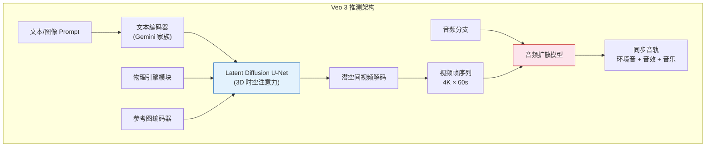
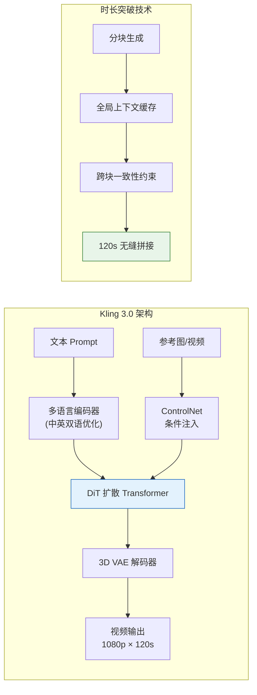
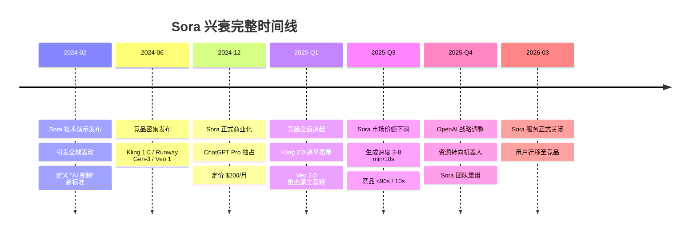
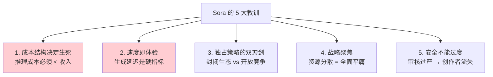
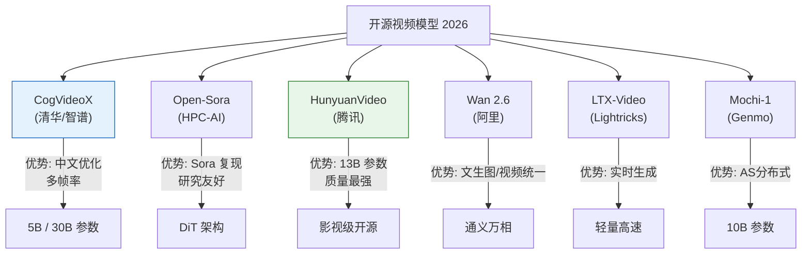
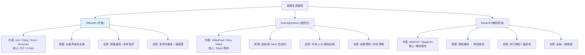
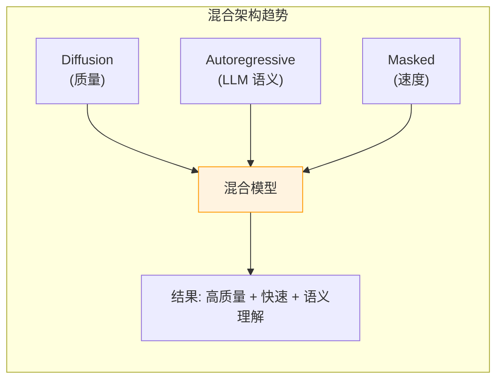
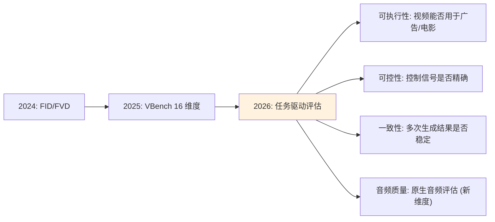
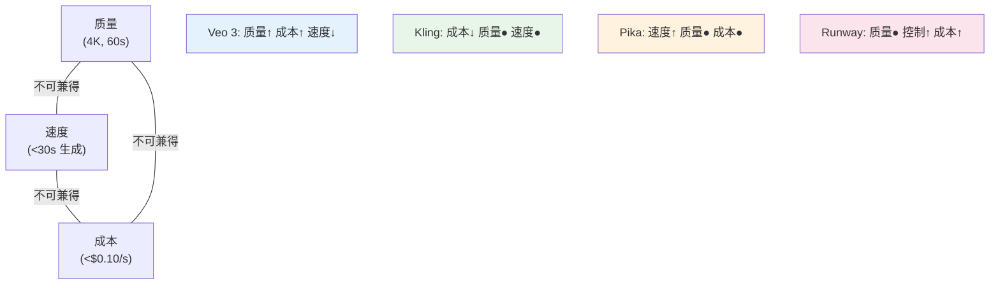

# 视频生成前沿模型深度报告 2026 (Video Frontier Models)

> **一句话定位**: 本文是对 [[Video_Generation_2026|AI 视频生成 2026 全景报告]] 的技术深度补充——聚焦各前沿模型的**架构设计**、**能力边界**、**技术路线对比**和**商业化挑战**，而非市场分层概览。

---

## 目录

- [1. Google Veo 3：架构分析与能力边界](#1-google-veo-3架构分析与能力边界)
- [2. 快手 Kling 3.0：时长与分辨率突破](#2-快手-kling-30时长与分辨率突破)
- [3. Sora 兴衰史：完整时间线与教训](#3-sora-兴衰史完整时间线与教训)
- [4. Pika 2.0 / Runway Gen-4 / Seedance：路线对比](#4-pika-20--runway-gen-4--seedance路线对比)
- [5. 开源视频模型](#5-开源视频模型)
- [6. 架构对比：Diffusion vs Autoregressive vs Masked](#6-架构对比diffusion-vs-autoregressive-vs-masked)
- [7. 评估指标：VBench / EvalCrafter](#7-评估指标vbench--evalcrafter)
- [8. 商业化挑战：成本 / 延迟 / 版权](#8-商业化挑战成本--延迟--版权)
- [9. Related](#9-related)

---

## 1. Google Veo 3：架构分析与能力边界

### 1.1 定位与概述

Google Veo 3 是 2026 年视频生成领域的画质标杆，在分辨率（4K 原生）、音频同步（原生生成）和专业工作流（Flow 界面）三个维度上建立了领先优势。

### 1.2 架构推测

Google 未公开 Veo 3 的完整论文，但从产品能力和 Google DeepMind 的研究脉络可推断:



关键架构特征:

| 组件 | 设计要点 | 与竞品差异 |
|------|---------|-----------|
| **文本编码器** | 基于 Gemini 多模态编码器，深度理解复杂叙事 | 比 CLIP-T 编码器语义理解更深 |
| **扩散主干** | 3D U-Net + 时空联合注意力 | 与 Sora 的 DiT 路线不同 |
| **潜空间** | 高压缩比时空潜空间（减少计算量） | 压缩比 > Kling，适合高分辨率 |
| **音频生成** | 独立扩散分支 + 视频条件注入 | Veo 3 首创原生音视频统一 |
| **物理模块** | 内嵌物体持久性和运动约束 | 减少物理违反（角色变形、穿模） |

### 1.3 能力边界

```
Veo 3 强项:
  ✅ 4K 原生分辨率 (3840×2160)
  ✅ 60 秒连贯叙事
  ✅ 原生音频 (环境音 + 音乐 + 音效)
  ✅ 角色跨场景一致性 (Flow Storyboard)
  ✅ 相机运动控制 (推/拉/摇/移)

Veo 3 弱项:
  ❌ 生成延迟较高 (3-5 分钟 / 10 秒视频)
  ❌ 价格偏高 (Google One Premium 订阅)
  ❌ 开放 API 受限 (主要通过 Flow / Vertex AI)
  ❌ 超长叙事 (>60s) 仍需分段拼接
  ❌ 复杂多角色交互场景仍有伪影
```

### 1.4 与竞争者对比

| 维度 | Veo 3 | Kling 3.0 | Runway Gen-4.5 | Sora (已关闭) |
|------|-------|-----------|----------------|-------------|
| 最高分辨率 | **4K** | 1080p | 1080p | 1080p |
| 最长时长 | 60s | **120s** | 16s | 20s |
| 原生音频 | **✅** | ❌ | ❌ | ❌ |
| 物理真实性 | 强 | 中 | 中 | 中 |
| 创意控制度 | 中 (Flow) | 中 | **高** (Motion Brush) | 低 |
| API 可用性 | 受限 | **开放** | 开放 | 已关闭 |
| 价格竞争力 | 高 | **最低** | 中 | 高 |

---

## 2. 快手 Kling 3.0：时长与分辨率突破

### 2.1 定位

Kling 3.0 由快手 AI 团队开发，在**超长时长**（120 秒）和**极致性价比**（~$0.10/秒）两个维度上建立了独特优势，尤其在人像生成和中文场景理解方面表现突出。

### 2.2 技术架构



### 2.3 时长突破的技术路径

```
传统视频生成: 5-10 秒 → 块级生成，块间跳变

Kling 120 秒的关键技术:
┌──────────────────────────────────────────────────────────┐
│  1. 层级生成策略                                          │
│     ├── 关键帧生成 (每 10s 生成关键帧)                     │
│     ├── 帧间插值 (关键帧之间扩散插值)                      │
│     └── 全局优化 (整段视频一致性优化)                      │
│                                                          │
│  2. 长上下文记忆                                          │
│     ├── 全局 KV Cache 缓存 (前文帧的压缩表示)              │
│     ├── 参考帧检索 (从历史帧提取关键信息)                   │
│     └── 运动轨迹延续 (保持物体运动方向一致)                 │
│                                                          │
│  3. 时序一致性损失                                        │
│     ├── 光流一致性约束                                    │
│     ├── 外观一致性正则                                    │
│     └── 身份保持损失 (角色不变)                            │
└──────────────────────────────────────────────────────────┘
```

### 2.4 人像生成优势

Kling 在人像/数字人场景的表现被认为是行业最佳:

| 人像指标 | Kling 3.0 | 行业平均 |
|---------|-----------|---------|
| 面部表情自然度 | 优 | 良 |
| 口型同步精度 | 高 | 中 |
| 肢体动作流畅度 | 优 | 良 |
| 皮肤纹理真实感 | 优 | 良 |
| 微表情捕捉 | 支持 | 部分支持 |

### 2.5 生态套件

```
快手 AI 创意套件 (Kling 2.0/3.0):
├── KLING Master — 视频生成核心
├── KOLORS — 图像生成
├── Multi-Elements Editor — 多元素编辑
├── Image Editing & Restyle — 图像编辑与风格转换
└── API 开放平台 — 企业级接入
```

---

## 3. Sora 兴衰史：完整时间线与教训

### 3.1 完整时间线



### 3.2 衰退根因分析

| 因素 | 详情 | 严重度 |
|------|------|--------|
| **计算成本过高** | Sora 的 DiT 架构在长视频上计算量极大，每次生成成本 $1-5，远高于竞品 $0.1-0.5 | ★★★★★ |
| **生成速度落后** | 10 秒视频需 3-8 分钟，竞品 <90 秒。用户体验差距 3-5 倍 | ★★★★★ |
| **内容审核压力** | 深度伪造风险导致严格的内容过滤，误杀率高，创作者流失 | ★★★★☆ |
| **竞争无定价优势** | $200/月独占 Pro 用户，竞品 $10-30/月或免费 | ★★★★☆ |
| **战略转向** | OpenAI 将资源重新分配到机器人和世界模拟 (World Simulation) | ★★★★★ |
| **开源追赶** | CogVideoX / HunyuanVideo / Wan 等开源模型质量逼近 | ★★★☆☆ |

### 3.3 Sora 的历史贡献

尽管 Sora 已关闭，它对行业的贡献是开创性的:

```
Sora 的遗产:
├── 确立了 DiT (Diffusion Transformer) 为视频生成主流架构
├── 证明了"文本到长视频"的技术可行性 (>10s 连贯)
├── 引入了时空 Patch 化 (Spatiotemporal Patches) 的统一表示
├── 推动了世界模型 (World Model) 概念在视频生成中的落地
├── 激发了整个赛道: Kling/Veo/Runway/Pika/Seedance 的快速跟进
└── 留下的教训: 技术领先 ≠ 商业成功
```

### 3.4 教训总结



---

## 4. Pika 2.0 / Runway Gen-4 / Seedance：路线对比

### 4.1 Pika 2.0

**定位**: 快速迭代 + 实时预览的创作者工具

```
Pika 2.0 技术特点:
├── 架构: 轻量 DiT + 快速采样 (4-8 步)
├── 优势: 生成速度快 (<30 秒 / 5 秒视频)
├── 特色:
│   ├── Pikaffects (特效预设: 爆炸/融化/变形)
│   ├── 实时预览 (低分辨率快速预览 → 高分辨率精修)
│   └── 音频同步 (基础音效)
├── 定价: 免费层 + Pro ($10-35/月)
└── 目标用户: 社交媒体创作者 / 快速原型
```

### 4.2 Runway Gen-4 / Gen-4.5

**定位**: 专业创作者首选，最强创意控制度

```
Runway Gen-4.5 技术特点:
├── 架构: 潜空间扩散 + 多模态条件注入
├── 优势: 精确的创意控制工具链
├── 核心功能:
│   ├── Motion Brush — 指定画面中哪些部分运动
│   ├── Camera Control — 精确相机运动路径
│   ├── Region-based Generation — 分区域独立生成
│   ├── Green Screen — AI 抠像
│   └── Director Mode — 多镜头编排
├── 定价: 信用点制 ($15-95/月)
├── 实时生成: GTC 2026 展示 <100ms 首帧
└── 目标用户: 专业 VFX / 影视制作 / 广告
```

### 4.3 字节 Seedance 2.0

**定位**: 统一音视频 + 12 种多模态输入

```
Seedance 2.0 技术特点:
├── 架构: 统一扩散模型 (音视频共享主干)
├── 突破: 音视频同步生成 (非后处理拼接)
├── 多模态输入 (12 种):
│   ├── 文本提示
│   ├── 参考图像 (风格 / 角色 / 场景)
│   ├── 参考视频 (动作迁移)
│   ├── 音频 (音乐节奏同步)
│   ├── 深度图 (3D 结构控制)
│   ├── 姿态图 (人体动作控制)
│   ├── 蒙版 (区域控制)
│   ├── 边缘图 (Canny 边缘)
│   ├── 法线图 (3D 表面)
│   ├── 草图 (粗略线条)
│   ├── 颜色提示 (色彩控制)
│   └── 运动轨迹 (路径引导)
├── 定价: ~$0.14/秒
└── 目标用户: 企业 / 高控制需求场景
```

### 4.4 四模型路线对比

| 维度 | Pika 2.0 | Runway Gen-4.5 | Seedance 2.0 | Kling 3.0 |
|------|----------|----------------|-------------|-----------|
| **核心卖点** | 速度 + 社交特效 | 创意控制 + 专业工作流 | 多模态输入 + 音视频统一 | 长时长 + 性价比 |
| **生成速度** | 最快 (<30s) | 中 (60-120s) | 中 (60-90s) | 中 (60-90s) |
| **最长时长** | 10s | 16s | 10s | **120s** |
| **音频** | 基础音效 | ❌ | **原生音视频** | ❌ |
| **控制粒度** | 预设特效 | **最高** (像素级) | 多条件 (12 种) | 多元素编辑 |
| **价格** | $10-35/月 | $15-95/月 | ~$0.14/s | **~$0.10/s** |
| **目标用户** | 社交媒体 | 专业 VFX | 企业 | 量产/长内容 |

---

## 5. 开源视频模型

### 5.1 开源生态全景



### 5.2 CogVideoX (清华 / 智谱)

```
CogVideoX 技术概要:
├── 开发者: 清华大学 / 智谱 AI (THUDM)
├── 参数规模: 5B (CogVideoX-5B) / 30B (CogVideoX1.5-5B)
├── 架构: 3D VAE + DiT (Diffusion Transformer)
│   ├── 3D 因果 VAE: 视频压缩到潜空间
│   ├── 专家 Transformer: 文本-视频联合建模
│   └── 多帧率训练: 支持不同帧率输出
├── 能力:
│   ├── 文生视频: 6 秒 / 8 帧
│   ├── 图生视频: 图像动画化
│   └── 视频续写: 给定前段续生成
├── 中文优化: 中文 prompt 理解最佳
├── 许可证: Apache 2.0 (商用友好)
└── 生态: HuggingFace / ModelScope 开放权重
```

### 5.3 Open-Sora (HPC-AI)

```
Open-Sora 技术概要:
├── 开发者: HPC-AI Tech (潞晨科技)
├── 目标: 开源复现 Sora 架构
├── 架构:
│   ├── 时空 Patch 化 (类 Sora)
│   ├── DiT 扩散主干
│   ├── 3D VAE 潜空间压缩
│   └── Flow Matching 采样
├── 能力:
│   ├── 文生视频 (最长 15 秒)
│   ├── 多分辨率支持 (240p - 1080p)
│   └── 多宽高比 (横屏/竖屏/方形)
├── 特色: 研究友好，架构完全透明
├── 许可证: Apache 2.0
└── 社区: GitHub 活跃，支持二次开发
```

### 5.4 HunyuanVideo (腾讯)

```
HunyuanVideo 技术概要:
├── 开发者: 腾讯混元团队
├── 参数规模: 13B (最大开源视频模型)
├── 架构:
│   ├── 双流 DiT (文本流 + 视频流)
│   ├── 3D 因果 VAE
│   ├── 多分辨率训练
│   └── 时序注意力 + 空间注意力分离
├── 能力:
│   ├── 文生视频: 高质量 5-10 秒
│   ├── 物理一致性: 开源模型中最强
│   └── 文本-视频对齐: 语义还原度高
├── 优势: 质量最接近闭源模型
├── 许可证: Tencent Community License
└── 硬件需求: 60GB+ VRAM 推理
```

### 5.5 开源 vs 闭源对比

| 维度 | 闭源 (Veo/Kling/Runway) | 开源 (CogVideoX/Hunyuan/Open-Sora) |
|------|------------------------|-----------------------------------|
| **质量上限** | 影视级 | 接近但略低 |
| **可控性** | API 限制多 | 完全可定制 |
| **部署成本** | 按次付费 | GPU 自建 |
| **数据隐私** | 数据上传第三方 | 本地部署 |
| **更新频率** | 持续迭代 | 社区驱动 |
| **中文能力** | 部分支持 | CogVideoX 最佳 |
| **商用许可** | API 条款 | Apache 2.0 / Community |

---

## 6. 架构对比：Diffusion vs Autoregressive vs Masked

### 6.1 三大技术路线



### 6.2 详细对比

| 维度 | Diffusion (DiT) | Autoregressive (AR) | Masked (MaskGIT) |
|------|-----------------|--------------------|--------------------|
| **生成过程** | 噪声 → 迭代去噪 (20-50 步) | 逐 token 预测 (序列生成) | 掩码 → 并行填充 (8-16 步) |
| **生成质量** | ⭐⭐⭐⭐⭐ 最高 | ⭐⭐⭐ 中等 | ⭐⭐⭐⭐ 较高 |
| **生成速度** | ⭐⭐ 慢 (多步去噪) | ⭐ 最慢 (串行) | ⭐⭐⭐⭐ 快 (并行) |
| **时序一致性** | 强 (时空联合建模) | 弱 (误差累积) | 中等 |
| **可扩展性** | 强 (DiT 可规模化) | 强 (复用 LLM 架构) | 中 |
| **主流度 (2026)** | ⭐⭐⭐⭐⭐ 绝对主流 | ⭐⭐ 衰退 | ⭐⭐⭐ 稳定 |
| **代表模型** | Veo, Kling, Hunyuan | VideoPoet, Emu | MAGVIT-V2 |

### 6.3 为什么 Diffusion 赢了

```
2024-2026 年扩散模型主导的原因:

1. 质量优势: 扩散模型在高分辨率长视频上的视觉质量碾压 AR/Masked
2. 时序建模: 时空联合注意力天然适合视频的时序特性
3. 条件控制: ControlNet / 参考图注入在扩散框架下最成熟
4. 采样优化: Flow Matching / DPM-Solver 将步数从 50 降到 4-8 步
5. 规模化: DiT 架构继承了 Transformer 的 scaling law
6. 音频扩展: 扩散天然适合音视频统一生成 (Veo 3 证明)

AR 路线的困境:
  - 视频的时序依赖导致严重的误差累积
  - Token 化视频丢失连续运动信息
  - 逐帧生成太慢，无法扩展到长视频

Masked 路线的局限:
  - 全局一致性弱于扩散的迭代去噪
  - 大规模训练不如 DiT 稳定
  - 主要用于短视频 / 图像编辑场景
```

### 6.4 混合架构趋势 (2026)



2026 年的前沿模型越来越多采用混合策略:
- **语义理解**: 用 LLM (AR) 解析 prompt → 生成结构化脚本
- **核心生成**: 用 DiT (Diffusion) 生成高质量视频帧
- **快速预览**: 用 Masked 模型生成低分辨率快速预览
- **精修**: 回到 Diffusion 做高分辨率精修

---

## 7. 评估指标：VBench / EvalCrafter

### 7.1 VBench

> VBench: *"Comprehensive Benchmark Suite for Video Generative Models"* (2024)

VBench 是 2024-2026 年最全面的视频生成评估基准，涵盖 **16 个维度**的细粒度评估。

```
VBench 评估维度:

├── 暗场景 (Subject Consistency) — 前后帧物体外观一致性
├── 背景一致性 (Background Consistency) — 背景稳定性
├── 时间闪烁 (Temporal Flickering) — 帧间闪烁程度
├── 运动平滑度 (Motion Smoothness) — 运动流畅性
├── 动态程度 (Dynamic Degree) — 视频动态丰富度
├── 空间质量 (Aesthetic Quality) — 画面美学评分
├── 成像质量 (Imaging Quality) — 分辨率/清晰度/伪影
├── 主题一致性 (Subject Consistency)
├── 多物体 (Multiple Objects) — 多物体场景质量
├── 空间关系 (Spatial Relationship)
├── 场景理解 (Scene Understanding)
├── 颜色 (Color) — 色彩还原度
├── 人类动作 (Human Action) — 人物动作自然度
├── 物体类别 (Object Class) — 物体识别准确度
├── 物体计数 (Object Count) — 数量准确性
└── 整体一致性 (Overall Consistency)

评估方法:
├── 自动指标 (基于 CLIP / DINO / 光流等)
├── 人工评估 (成对比较 A/B testing)
└── 对抗检测 (检测生成视频的可辨识度)
```

### 7.2 EvalCrafter

> EvalCrafter: *"Benchmarking and Evaluating Large Video Generation Models"* (CVPR 2024)

EvalCrafter 侧重**端到端生成质量**评估:

| 评估类别 | 具体指标 | 说明 |
|---------|---------|------|
| **视觉质量** | FID, FVD | 生成视频与真实视频的分布距离 |
| **文本-视频对齐** | CLIP-Score | 视频内容与 prompt 的语义匹配度 |
| **时序一致性** | Warping Error | 光流扭曲误差 |
| **运动质量** | Motion Magnitude | 平均运动幅度合理性 |
| **人类感知** | Mean Opinion Score | 人工主观评分 (1-5) |
| **多样性** | Diversity Score | 同 prompt 多次生成的差异度 |

### 7.3 评估的挑战

```
视频生成评估的 4 大难题:

1. "好视频" 没有客观标准
   ├── 美学 vs 真实感 vs 创意 → 难以统一打分
   └── 自动指标与人感的相关性弱

2. 时序一致性难以量化
   ├── 单帧质量高 ≠ 视频连贯
   └── FVD 等指标对时序问题不敏感

3. Prompt 复杂度差异大
   ├── "一只猫在跑" vs "一个穿红裙的女孩在雨中的街头跳舞"
   └── 不同难度 prompt 无法直接比较

4. 人工评估成本高且不稳定
   ├── 每次评估需要大量人工标注
   └── 标注者间一致性低 (inter-rater agreement)
```

### 7.4 2026 评估趋势



---

## 8. 商业化挑战：成本 / 延迟 / 版权

### 8.1 成本结构

```
视频生成的成本拆解 (以 10 秒 1080p 视频为例):

┌─────────────────────────────────────────────────────────────┐
│  推理计算成本                                                │
│  ├── GPU 租用: ~$0.50-2.00 (取决于模型大小和采样步数)         │
│  ├── 峰值显存: 40-80 GB (需要 A100/H100)                    │
│  └── 推理时间: 30s-8min (影响 GPU 占用时长)                  │
│                                                             │
│  存储与带宽成本                                               │
│  ├── 视频存储: 10s/1080p ≈ 20-50 MB                        │
│  └── CDN 分发: 按观看量计费                                  │
│                                                             │
│  内容审核成本                                                │
│  ├── 自动审核: NSFW / 暴力 / 版权检测                        │
│  └── 人工审核: 边界 case 人工复核                            │
│                                                             │
│  总成本: $0.10-5.00 / 10 秒视频                              │
│  收费: $0.10-2.00 / 10 秒 → 毛利依赖规模化                   │
└─────────────────────────────────────────────────────────────┘
```

### 8.2 成本-质量-速度三角



### 8.3 延迟挑战

| 应用场景 | 可接受延迟 | 当前技术 | 差距 |
|---------|----------|---------|------|
| **实时交互** (VR/游戏) | <100ms 首帧 | Runway 实时预览 (GTC 2026) | 勉强达标 |
| **社交媒体创作** | <30s | Pika 2.0 | 达标 |
| **专业制作** | 1-5 分钟 | Veo 3 / Kling | 达标 |
| **批量生产** | 分钟级可接受 | MiniMax API | 达标 |

### 8.4 版权与法律风险

```
视频生成的版权风险:

┌─────────────────────────────────────────────────────────────┐
│  风险 1: 训练数据版权                                         │
│  ├── 模型训练使用了受版权保护的视频/电影                       │
│  ├── 生成内容可能侵犯原始创作者权益                            │
│  └── 2025-2026 已有多起诉讼 (Getty Images vs AI 公司)        │
│                                                             │
│  风险 2: 生成内容归属                                         │
│  ├── AI 生成视频的版权归谁? (用户 / 平台 / 公有领域)          │
│  ├── 各国法律不一: 美国倾向于"无人类创作则无版权"             │
│  └── 商用授权条款模糊                                        │
│                                                             │
│  风险 3: 深度伪造 (Deepfake)                                  │
│  ├── 名人肖像滥用 (未经授权的明星代言视频)                     │
│  ├── 政治虚假信息 (伪造政治人物发言)                          │
│  └── 金融诈骗 (伪造 CEO 讲话)                                │
│                                                             │
│  风险 4: 品牌商标侵权                                         │
│  ├── 生成视频中出现真实品牌 LOGO                              │
│  └── 未经授权的商业使用                                       │
└─────────────────────────────────────────────────────────────┘

应对措施:
├── 水印: 生成视频嵌入不可见水印 (如 SynthID)
├── 内容过滤: 训练前过滤版权内容
├── 许可协议: 与内容方签订训练数据许可
├── C2PA 标准: 内容溯源元数据
└── 使用条款: 明确商用限制
```

### 8.5 商业模式对比

| 模式 | 代表 | 优势 | 劣势 |
|------|------|------|------|
| **订阅制** | Runway / Pika | 稳定收入 | 转化率低 |
| **按量付费** | Kling / MiniMax API | 用户友好 | 收入波动 |
| **生态捆绑** | Google (Veo + Workspace) | 锁定效应 | 需要大生态 |
| **开源 + 服务** | 阿里 (Wan) / 清华 (CogVideo) | 社区增长 | 变现难 |
| **企业私有化** | 字节 / 腾讯内部使用 | 成本可控 | 无法规模化收入 |

---

## 9. Related

### 知识库内关联

- [[Video_Generation_2026|AI 视频生成 2026 全景报告]] — 本文的配套市场全景页，覆盖模型分层、应用场景和技术趋势概览
- [[Video_Generation_for_dummy|视频生成入门指南]] — 零基础入门
- [[index|视频生成章节索引]]

### 架构与技术关联

- [[../../大模型/Multimodal_Models/Video_Understanding_Architectures|视频理解架构]] — 视频理解（输入侧）与视频生成（输出侧）的架构对照
- [[../../大模型/Multimodal_Models/Native_Multimodal_Architectures|原生多模态架构]] — Veo 3 音视频统一生成的理论基础
- [[../../大模型/Multimodal_Models/Modality_Fusion_Mechanisms|模态融合机制]] — Seedance 12 种多模态输入的技术基础

### 评估与基准关联

- [[../../概念/LLM/llm-benchmarks|LLM 评估基准]] — VBench / EvalCrafter 的方法论与 LLM benchmark 的对比

### 参考资源

1. Brooks, et al. "Video generation models as world simulators." OpenAI, 2024. (Sora 技术报告)
2. VBench: "Comprehensive Benchmark Suite for Video Generative Models." arXiv:2311.17882, 2024.
3. EvalCrafter: "Benchmarking and Evaluating Large Video Generation Models." CVPR 2024.
4. Yang, et al. "CogVideoX: Text-to-Video Diffusion Models with An Expert Transformer." arXiv:2408.06072, 2024.
5. Kong, et al. "HunyuanVideo: A Systematic Framework For Large Video Generation Model." arXiv:2412.03603, 2024.
6. Google DeepMind. "Veo: Our most capable video generation model." 2024-2026 技术博客.
7. Kuaishou. "Kling: Creative Visual Creation & Exploration." 技术博客, 2024-2026.
