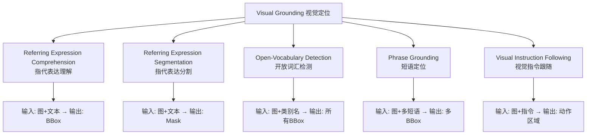

# 视觉定位 (Visual Grounding) 深度解析

> 中文简称：视觉定位 深度解析

> **一句话秒懂**: 视觉定位让AI不仅能"看到"物体，还能根据自然语言描述"找到"特定物体——从"图中穿红衣服的女人"到精确的边界框/分割掩码，是连接语言理解与视觉感知的桥梁。

---

## 目录

- [概述](#概述)
- [核心任务定义](#核心任务定义)
- [核心架构与原理](#核心架构与原理)
- [代表模型对比](#代表模型对比)
- [开放词汇检测](#开放词汇检测)
- [与VLM的关系](#与vlm的关系)
- [实践指南](#实践指南)
- [2026前沿](#2026前沿)
- [相关概念](#相关概念)

---

## 概述

### 什么是视觉定位？

```
视觉定位 (Visual Grounding) = 语言 → 视觉区域

输入: 图像 + 自然语言描述 (Referring Expression)
输出: 对应物体的位置 (Bounding Box / Segmentation Mask)

示例:
图像: [一张公园照片，有多个人]
文本: "穿红色夹克正在遛狗的男人"
输出: [精确框住该男人的bbox/mask]
```

### 为什么视觉定位重要？

```
1. 人机交互的基础:
   - "帮我把桌上左边的杯子拿过来" → 机器人需定位"杯子"
   - "把图中第三个人的衣服换成蓝色" → 图像编辑需定位

2. 多模态理解的桥梁:
   - 连接语言理解 (NLP) 与视觉感知 (CV)
   - 是VLM视觉能力的核心评估维度

3. 下游应用广泛:
   - 自动驾驶: "前方左转车道的卡车"
   - 医学影像: "左肺下叶的结节"
   - 遥感: "港口第二排集装箱"
   - 机器人: "厨房台面上的红色杯子"
```

### 任务族谱



---

## 核心任务定义

### Referring Expression Comprehension (REC)

```
任务: 给定图像和一段自然语言描述，定位唯一目标物体

输入:
- 图像 I ∈ R^(H×W×3)
- 指代表达 e = "the man in red jacket on the left"

输出:
- 边界框 b = (x1, y1, x2, y2)

评估指标:
- Acc@0.5: IoU > 0.5 视为正确
- Acc@0.7: IoU > 0.7 (更严格)
- Overall IoU: 平均IoU

经典数据集:
- RefCOCO / RefCOCO+ / RefCOCOg
- Visual Genome (关系描述)
- Flickr30k Entities
```

### Referring Expression Segmentation (RES)

```
任务: 与REC类似，但输出像素级分割掩码

输入: 图像 + 指代表达
输出: 二值掩码 M ∈ {0,1}^(H×W)

评估指标:
- oIoU (overall IoU): 所有样本平均IoU
- mIoU: 按类别平均IoU
- Precision@X: IoU > X 的准确率

关键区别:
- REC: 矩形框 (粗糙)
- RES: 像素掩码 (精确)
- RES需要更强的空间理解能力
```

### Open-Vocabulary Detection (OVD)

```
任务: 检测训练时未见过的类别

传统检测:
- 训练: COCO 80类
- 测试: 只能检测这80类
- 新类: 需重新标注+训练

开放词汇检测:
- 训练: 基类 (base categories)
- 测试: 任意文本描述的类别
- 新类: 只需提供类别名称/描述

示例:
训练时: 见过 "dog", "cat", "car"
测试时: 检测 "golden retriever", "siamese cat", "tesla"
→ 无需重新训练!
```

### Phrase Grounding

```
任务: 同时定位图像中多个短语对应的区域

输入:
- 图像
- 多个短语: ["a red car", "two people", "a traffic light"]

输出:
- 每个短语对应的bbox集合

与REC的区别:
- REC: 一个表达 → 一个目标
- Phrase Grounding: 多个表达 → 多个目标
- 需要处理歧义和上下文关系
```

---

## 核心架构与原理

### 经典两阶段架构

```
早期方法 (2016-2020):

┌─────────────────────────────────────────┐
│  视觉分支 (Visual Stream)               │
│  Image → CNN/ViT → Region Features      │
│  (Faster R-CNN proposals)               │
└─────────────────┬───────────────────────┘
                  │
                  ↓ Cross-Modal Fusion
                  │
┌─────────────────┴───────────────────────┐
│  语言分支 (Language Stream)              │
│  Text → LSTM/BERT → Word Features       │
└─────────────────────────────────────────┘
                  │
                  ↓
┌─────────────────────────────────────────┐
│  跨模态匹配 (Cross-Modal Matching)       │
│  视觉-语言注意力 → 评分 → 选择最佳区域   │
└─────────────────────────────────────────┘

代表: MattNet, MAttNet, CMPC, UNITER
局限: 依赖预提取proposals, 无法处理新类别
```

### 端到端统一架构 (2022+)

```
现代方法 (Grounding DINO, GLIP):

┌─────────────────────────────────────────┐
│  Image Encoder (Swin-T/B)               │
│  → Multi-scale Visual Features          │
└─────────────────┬───────────────────────┘
                  │
                  ↓ Feature Enhancer
                  │ (Cross-Modality Fusion)
                  │
┌─────────────────┴───────────────────────┐
│  Text Encoder (BERT)                    │
│  → Token-level Language Features        │
└─────────────────────────────────────────┘
                  │
                  ↓
┌─────────────────────────────────────────┐
│  Language-Guided Query Selection        │
│  → 选择与文本相关的视觉区域作为queries    │
└─────────────────────────────────────────┘
                  │
                  ↓
┌─────────────────────────────────────────┐
│  Cross-Modality Decoder (Transformer)   │
│  → 视觉-语言交叉注意力 (多层)            │
│  → 预测 bbox + 文本对齐分数             │
└─────────────────────────────────────────┘

关键创新: 不再依赖固定类别, 文本即类别
```

### Grounding DINO 架构详解

```
Grounding DINO = DINO (检测) + Grounding (语言引导)

核心组件:
1. Image Encoder: Swin Transformer
   - 多尺度特征: C2, C3, C4, C5
   - 输入: 800×1333 图像

2. Text Encoder: BERT-base
   - Token级别特征 (非句子级)
   - 保留每个词的语义

3. Feature Enhancer:
   - 视觉-语言双向交叉注意力
   - 视觉特征感知文本
   - 文本特征感知视觉

4. Language-Guided Query Selection:
   - 用文本特征选择top-K视觉区域
   - 作为Decoder的初始queries
   - 关键: 让queries与文本相关

5. Cross-Modality Decoder:
   - 6层Transformer Decoder
   - 每层: Self-Attn → Cross-Attn(视觉) → Cross-Attn(文本)
   - 输出: bbox + 与每个文本token的对齐分数

6. 输出:
   - Bounding boxes (x, y, w, h)
   - 与输入文本的匹配分数
   - 支持任意长度文本输入
```

### GLIP (Grounded Language-Image Pre-training)

```
GLIP核心思想: 将检测统一为Grounding问题

传统检测: image → [bbox, class_id]
GLIP:     image + text → [bbox, text_alignment]

统一公式:
- 检测 = Grounding(图像, "所有类别名")
- REC = Grounding(图像, "指代表达")
- 分割 = Grounding(图像, "描述") + Mask Head

预训练策略:
1. Detection数据: 图像 + 类别名拼接
   "person . car . dog . traffic light"
2. Grounding数据: 图像 + 描述性文本
3. 对比学习: region-text对齐

优势:
- 一个模型统一检测/定位/分割
- 零样本迁移到新类别
- 利用海量文本-图像对预训练
```

### 视觉-语言对齐机制

```
核心: 如何衡量"这个区域"与"这段文字"的匹配度?

方法1: 点积对齐
score = region_feat · text_feat / √d

方法2: 交叉注意力
attn = softmax(Q_text · K_visual^T / √d) · V_visual
→ 文本引导的视觉注意力

方法3: 细粒度对齐 (Grounding DINO)
对每个bbox, 计算与每个text token的对齐:
scores = [s_1, s_2, ..., s_N] (N=token数)
final_score = max(scores) 或 mean(scores)

方法4: 对比学习 (CLIP式)
正对: (正确区域, 对应文本) → 高相似度
负对: (错误区域, 对应文本) → 低相似度
```

---

## 代表模型对比

### 视觉定位模型对比

| 模型 | 年份 | 类型 | 骨干 | 文本编码 | RefCOCO val | 开放词汇 | 实时性 |
|------|------|------|------|----------|-------------|----------|--------|
| **Grounding DINO 1.5** | 2024 | 端到端 | Swin-B | BERT | 92.8% | ✓ | 15 FPS |
| **Grounding DINO** | 2023 | 端到端 | Swin-T | BERT | 88.5% | ✓ | 12 FPS |
| **GLIP-T** | 2022 | 端到端 | Swin-T | BERT | 86.3% | ✓ | 10 FPS |
| **YOLO-World** | 2024 | 端到端 | YOLOv8 | CLIP | 84.1% | ✓ | 52 FPS |
| **OWLv2** | 2023 | 端到端 | ViT-B | CLIP | 82.5% | ✓ | 20 FPS |
| **KOSMOS-2** | 2023 | VLM | ViT-L | LLM | 85.2% | ✓ | 5 FPS |
| **Ferret** | 2023 | VLM | ViT-L | Vicuna | 87.1% | ✓ | 3 FPS |
| **UNINEXT** | 2023 | 统一 | Swin-B | BERT | 90.2% | ✓ | 8 FPS |
| **EVA-02-Det** | 2023 | 端到端 | EVA-02 | CLIP | 89.7% | ✓ | 18 FPS |

### 指代分割模型对比

| 模型 | 年份 | 方法 | RefCOCOg oIoU | 速度 | 特点 |
|------|------|------|---------------|------|------|
| **SAM 2 + Grounding** | 2024 | 检测+分割 | 78.5% | 10 FPS | 通用分割 |
| **LISA** | 2023 | VLM+SAM | 76.2% | 3 FPS | 推理分割 |
| **PixelLM** | 2024 | 像素解码 | 74.8% | 5 FPS | 轻量 |
| **GLaMM** | 2023 | 统一模型 | 73.1% | 4 FPS | 多功能 |
| **PolyFormer** | 2022 | 多边形 | 72.5% | 8 FPS | 高效 |
| **CRIS** | 2022 | 对比学习 | 71.3% | 12 FPS | 快速 |

### 开放词汇检测对比 (COCO zero-shot)

| 模型 | 骨干 | Novel AP | Base AP | 参数量 | 速度 |
|------|------|----------|---------|--------|------|
| **Grounding DINO-L** | Swin-L | 46.2 | 58.1 | 341M | 8 FPS |
| **YOLO-World-L** | YOLOv8-L | 35.4 | 52.8 | 48M | 52 FPS |
| **OWLv2-L** | ViT-L | 34.8 | 51.2 | 303M | 20 FPS |
| **GLIP-L** | Swin-L | 30.1 | 55.4 | 341M | 7 FPS |
| **RegionCLIP** | RN50 | 22.4 | 45.2 | 108M | 15 FPS |
| **ViLD** | RN50 | 19.8 | 42.1 | 108M | 12 FPS |

---

## 开放词汇检测

### 核心思路

```
开放词汇检测的三大技术路线:

路线1: 视觉-语言对齐 (Region-Text Alignment)
- 训练: 学习region与text的对齐
- 推理: 新类别名作为text query
- 代表: GLIP, Grounding DINO, OWLv2

路线2: 知识蒸馏 (Knowledge Distillation)
- 教师: CLIP (见过海量类别)
- 学生: 检测器 (学习CLIP的类别知识)
- 代表: ViLD, RegionCLIP

路线3: 生成式 (Generative)
- 将检测转化为生成问题
- 自回归生成bbox坐标
- 代表: YOLO-World (部分), VLM-based
```

### YOLO-World: 实时开放词汇检测

```
创新: 将开放词汇能力引入YOLO系列

架构:
Image → YOLOv8 Backbone → FPN Neck
                              ↓
Text → CLIP Text Encoder → Text Features
                              ↓
                    Re-parameterizable Vision-Language PAN
                    (视觉-语言特征融合)
                              ↓
                    Detection Head (bbox + text alignment)

关键设计:
1. 可重参数化: 推理时将文本特征"烧入"权重
   → 推理时无需文本编码器 → 极速
2. 对比学习: region-text对比损失
3. 大规模预训练: Objects365 + GoldG + CC3M

性能:
- COCO zero-shot: 35.4 AP (vs YOLOv8 53.9 mAP supervised)
- 速度: 52 FPS (RTX 3090)
- 优势: 实时 + 开放词汇
```

### 从封闭到开放的范式转变

```
传统检测 (封闭集):
┌────────────────────────────┐
│ 训练: 80类标注数据          │
│ 模型: 80个分类头            │
│ 推理: 只能检测80类          │
│ 新类: 重新标注+训练         │
└────────────────────────────┘
         ↓ 范式转变
开放词汇检测:
┌────────────────────────────┐
│ 训练: 基类 + 文本-图像对    │
│ 模型: 文本-视觉对齐模块     │
│ 推理: 任意文本作为类别      │
│ 新类: 只需提供名称/描述     │
└────────────────────────────┘

意义:
- 从"识别已知" → "理解未知"
- 从"数据驱动" → "知识驱动"
- 从"固定类别" → "无限类别"
```

---

## 与VLM的关系

### VLM中的Grounding能力

```
VLM (Vision-Language Model) 的视觉定位:

传统VLM (LLaVA, Qwen-VL):
- 输入: 图像 + 问题
- 输出: 文本回答
- Grounding: 输出bbox坐标文本 "[x1,y1,x2,y2]"

Grounding VLM (Ferret, KOSMOS-2, Qwen-VL):
- 输入: 图像 + "指出穿红衣的人"
- 输出: 文本 + bbox/mask
- 能力: 理解 + 定位 统一

关键区别:
- 检测器 (Grounding DINO): 专注定位, 无推理
- VLM: 理解+推理+定位, 但速度较慢
- 趋势: 两者融合
```

### Grounding作为VLM评估维度

```
VLM Grounding评估:

1. Referring Expression:
   "图中最大的红色物体在哪?" → bbox

2. Spatial Reasoning:
   "桌子左边的第二个物品" → 需空间推理+定位

3. Multi-object Grounding:
   "指出所有戴帽子的人" → 多个bbox

4. Reasoning Grounding (LISA):
   "哪个物体可以用来切东西?" → 推理+定位刀

评估基准:
- RefCOCO/+/g: 标准REC
- Visual Genome: 关系定位
- Refcocog-UD: 长描述
- ReasonVOS: 推理+分割
```

### Grounding + Generation 的统一

```
2026趋势: 定位与生成的统一

传统分离:
检测/定位 → 找到物体
生成/编辑 → 创建/修改内容

统一模型:
"找到穿红衣的人，把他的衣服变成蓝色"
→ Grounding: 定位"穿红衣的人"
→ Generation: 修改衣服颜色
→ 一个模型完成!

代表:
- InstructPix2Pix + Grounding
- Grounded-SAM + Inpainting
- Qwen-VL + 图像编辑
- 统一多模态模型 (2026)
```

---

## 实践指南

### Grounding DINO 快速使用

```python
# 安装
# pip install groundingdino-py

from groundingdino.util.inference import load_model, predict
import cv2
import torch

# 加载模型
model = load_model(
    "groundingdino/config/GroundingDINO_SwinT_OGC.py",
    "weights/groundingdino_swint_ogc.pth"
)

# 推理
image = cv2.imread("image.jpg")
TEXT_PROMPT = "red car . person with hat . traffic light"
BOX_THRESHOLD = 0.35
TEXT_THRESHOLD = 0.25

boxes, logits, phrases = predict(
    model=model,
    image=image,
    caption=TEXT_PROMPT,
    box_threshold=BOX_THRESHOLD,
    text_threshold=TEXT_THRESHOLD
)

# boxes: [N, 4] (cx, cy, w, h) 归一化坐标
# logits: [N] 置信度
# phrases: [N] 匹配的短语
```

### YOLO-World 实时检测

```python
from ultralytics import YOLOWorld

# 加载模型
model = YOLOWorld("yolov8l-worldv2")

# 设置自定义类别
model.set_classes(["person", "bus", "dog", "surfboard"])

# 推理
results = model.predict("image.jpg")

# 获取结果
for box in results[0].boxes:
    x1, y1, x2, y2 = box.xyxy[0]
    conf = box.conf[0]
    cls = model.names[int(box.cls[0])]
    print(f"{cls}: {conf:.2f} at ({x1:.0f},{y1:.0f},{x2:.0f},{y2:.0f})")
```

### Grounded-SAM: 定位+分割

```python
# Grounding DINO + SAM = 文本到分割

from groundingdino.util.inference import load_model, predict
from segment_anything import sam_model_registry, SamPredictor

# 1. Grounding DINO 定位
boxes, logits, phrases = predict(model, image, "the cat on sofa", 0.35, 0.25)

# 2. SAM 分割
sam = sam_model_registry["vit_h"](checkpoint="sam_vit_h.pth")
predictor = SamPredictor(sam)
predictor.set_image(image)

# 3. 用bbox作为SAM的prompt
masks, _, _ = predictor.predict(
    box=boxes[0].numpy(),  # 第一个检测结果
    multimask_output=False
)
# masks: 像素级分割掩码
```

### 视觉指令跟随

```python
# 使用Qwen-VL进行视觉定位

from transformers import AutoModelForCausalLM, AutoTokenizer

model = AutoModelForCausalLM.from_pretrained(
    "Qwen/Qwen2-VL-7B-Instruct",
    torch_dtype=torch.bfloat16
).cuda()

# 视觉定位: 输出bbox
query = "请指出图中穿红色衣服的人的位置"
# 模型输出: <ref>穿红色衣服的人</ref><box>[234,156,489,567]</box>

# 视觉推理+定位
query = "图中哪个物体可以用来遮雨？请指出它的位置"
# 模型输出: <ref>雨伞</ref><box>[123,89,234,345]</box>
```

### 性能优化建议

| 场景 | 推荐模型 | 优化策略 |
|------|----------|----------|
| 实时检测 (>30FPS) | YOLO-World | 重参数化、TensorRT |
| 高精度定位 | Grounding DINO 1.5 | 多尺度、NMS优化 |
| 边缘部署 | YOLO-World-S | INT8量化、ONNX |
| 分割任务 | Grounded-SAM2 | 批量推理、缓存 |
| 推理+定位 | Qwen2-VL / Ferret | 量化、KV Cache |
| 批量处理 | OWLv2 | 数据并行、批处理 |

---

## 2026前沿

### Grounding + Generation 统一模型

```
2026核心趋势: 理解-定位-生成 一体化

传统Pipeline:
VLM理解 → Grounding定位 → 生成模型编辑
(3个模型, 3次推理, 信息损失)

统一模型 (2026):
一个模型同时:
- 理解: "图中有什么?"
- 定位: "在哪里?" (bbox/mask)
- 生成: "变成什么样?" (编辑/生成)
- 推理: "为什么?" (解释)

代表方向:
- 统一Token: 视觉token + 坐标token + 生成token
- 自回归生成bbox: <box>x1 y1 x2 y2</box>
- 像素级生成: 直接输出mask
- 多任务训练: 检测+分割+生成联合
```

### 3D Grounding

```
从2D定位 → 3D定位:

任务: "找到房间中桌子左边的红色椅子"
输出: 3D Bounding Box / 3D Mask

挑战:
- 3D空间关系理解
- 遮挡处理
- 多模态3D输入 (点云+图像+文本)

代表:
- 3D-LLM: 3D场景理解+定位
- OpenMask3D: 开放词汇3D分割
- 3D Grounding with VLMs

应用:
- 机器人操作
- AR/VR交互
- 室内导航
```

### 视频Grounding

```
从图像定位 → 视频时空定位:

任务: "找到视频中第一次出现红色汽车的时刻和位置"
输出: 时间区间 + 空间bbox/mask (时空管)

挑战:
- 时间定位: 哪一帧/哪段时间
- 空间定位: 每帧的位置
- 时空一致性: 跟踪同一物体

代表:
- TubeR: 时空管检测
- VLG: 视频语言定位
- SAM2 + Grounding: 视频分割+定位

应用:
- 视频检索
- 视频编辑
- 监控分析
```

### 推理增强Grounding

```
从"直接定位" → "推理后定位":

传统: "穿红衣的人" → 直接匹配
推理: "可以用来切东西的工具" → 推理出"刀" → 定位

Reasoning Grounding:
1. 理解描述
2. 推理目标 (可能需多步推理)
3. 定位目标
4. 解释为什么

代表:
- LISA: Reasoning Segmentation
- ReasonVOS: 推理视频分割
- Think-then-Ground: 先推理后定位

与CoT的结合:
"图中哪个动物是食肉动物?" 
→ 思考: 食肉动物包括...图中有兔子和狼
→ 定位: 狼的位置
```

### 多粒度Grounding

```
从单一粒度 → 多粒度统一:

2026模型同时支持:
- 点级: 点击定位
- 框级: bbox定位
- 像素级: mask分割
- 区域级: 场景区域
- 关系级: 物体间关系
- 属性级: 颜色/材质/状态

统一表示:
所有粒度统一为token序列
<point>x,y</point>
<box>x1,y1,x2,y2</box>
<mask>encoded_mask</mask>
<region>semantic_region</region>
```

### 产业应用 (2026)

| 领域 | 应用 | 技术要求 |
|------|------|----------|
| **自动驾驶** | 自然语言导航/场景理解 | 实时、3D、鲁棒 |
| **机器人** | 语言引导操作 | 3D定位、精确 |
| **医疗影像** | 报告-影像对齐 | 高精度、可解释 |
| **电商** | 商品搜索/推荐 | 细粒度、大规模 |
| **安防** | 自然语言视频检索 | 视频、实时 |
| **AR/VR** | 手势/语音交互 | 低延迟、3D |
| **遥感** | 地物识别/变化检测 | 多尺度、专业术语 |

---

## 相关概念

### 本知识库相关页面

- [[概念/Vision/clip]] - CLIP多模态对齐 (开放词汇检测的基础)
- [[概念/Vision/object-detection]] - 目标检测 (视觉定位的前置任务)
- [[概念/Vision/object-detection]] - 目标检测完整指南
- [[04_计算机视觉/01_CV基础/05_ViT_深入分析]] - Vision Transformer (骨干网络)
- [[概念/Vision/image-segmentation]] - 图像分割 (RES的基础)
- [[概念/Vision/multimodal-vision]] - 多模态视觉总览
- [[概念/Vision/vision-language-model]] - 视觉语言模型 (VLM中的Grounding)
- [[Image_Classification_Detection]] - 图像分类与检测
- [[04_计算机视觉/01_CV基础/02_CV基础]] - 计算机视觉基础

### 关键术语表

| 术语 | 英文 | 含义 |
|------|------|------|
| 指代表达理解 | Referring Expression Comprehension | 根据语言描述定位物体 |
| 指代表达分割 | Referring Expression Segmentation | 语言引导的像素级分割 |
| 开放词汇检测 | Open-Vocabulary Detection | 检测任意文本描述的类别 |
| 短语定位 | Phrase Grounding | 多短语同时定位 |
| 视觉-语言对齐 | Vision-Language Alignment | 视觉区域与文本的匹配 |
| 跨模态融合 | Cross-Modal Fusion | 视觉与语言特征的交互 |
| 零样本迁移 | Zero-shot Transfer | 无需训练即可检测新类别 |
| 可重参数化 | Re-parameterization | 推理时将分支合并加速 |
| 时空定位 | Spatio-temporal Grounding | 视频中的时间+空间定位 |
| 推理定位 | Reasoning Grounding | 需要推理才能确定目标 |

---

## 参考资源

### 论文

- Grounding DINO: Marrying DINO with Grounded Pre-Training (2023)
- GLIP: Grounded Language-Image Pre-training (2022)
- YOLO-World: Real-Time Open-Vocabulary Object Detection (2024)
- OWLv2: Scaling Open-Vocabulary Object Detection (2023)
- LISA: Reasoning Segmentation via Large Language Model (2023)
- KOSMOS-2: Grounding Multimodal Large Language Models (2023)
- Ferret: Refer and Ground Anything Anywhere (2023)

### 开源项目

- Grounding DINO: github.com/IDEA-Research/GroundingDINO
- YOLO-World: github.com/AILab-CVC/YOLO-World
- Grounded-SAM: github.com/IDEA-Research/Grounded-Segment-Anything
- OWLv2: github.com/google-research/scenic (OWLv2)
- LISA: github.com/dvlab-research/LISA

### 数据集

- RefCOCO / RefCOCO+ / RefCOCOg: 指代表达标准基准
- Visual Genome: 场景图+区域描述
- Objects365: 大规模检测预训练
- GoldG: Grounding预训练数据
- Flickr30k Entities: 短语级标注

---

> **总结**: 视觉定位是连接语言理解与视觉感知的核心桥梁。从2022年GLIP开创统一范式，到2024年Grounding DINO/YOLO-World实现高精度+实时，再到2026年Grounding+Generation+Reasoning的统一，这一领域正从"找到物体"进化为"理解-定位-操作"的完整闭环。掌握Grounding DINO + SAM + VLM的组合，是当前最具实用价值的技术栈。
