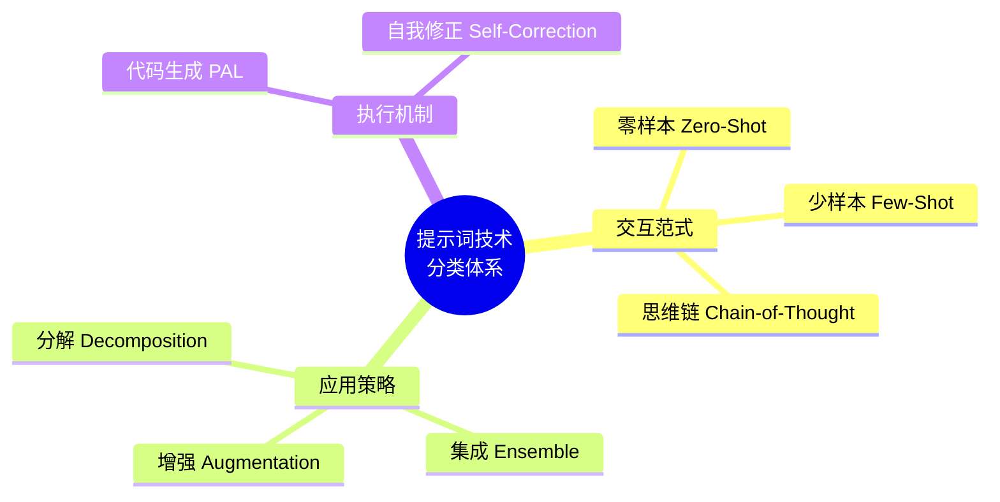
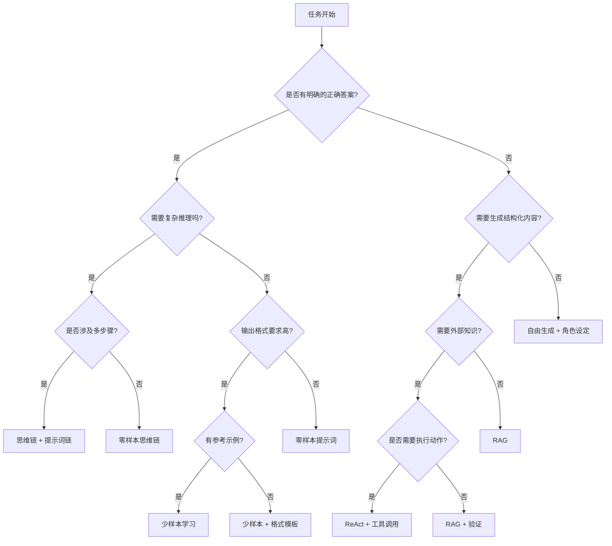

# 提示词模板库、反模式与技术分类索引

本文融合《大模型提示词工程指南》附录 A/E/F 的核心内容，提供可直接复用的模板库、常见反模式与排错指南、技术分类体系与决策树。

## 1. 提示词模板库

### 1.1 文本分析类

#### 情感分析
```markdown
请分析以下文本的情感倾向：

文本：{text}

输出格式：
{
  "sentiment": "positive/negative/neutral",
  "confidence": 0.0-1.0,
  "key_phrases": ["关键短语1", "关键短语2"]
}
```

#### 主题提取
```markdown
从以下文本中提取主要主题：

文本：{text}

要求：
- 提取3-5个核心主题
- 每个主题用2-3个词概括
- 按重要性排序
```

#### 实体识别
```markdown
识别以下文本中的命名实体：

文本：{text}

识别类别：人名、地名、组织机构、日期时间、数字金额
输出格式：JSON
```

### 1.2 内容生成类

#### 营销文案
```markdown
角色：资深文案策划师

任务：为以下产品创作营销文案

产品信息：
- 名称：{product_name}
- 类别：{category}
- 核心特点：{features}
- 目标用户：{target_audience}

要求：
1. 标题：吸引眼球，10字以内
2. 正文：200-300字
3. 结尾：行动号召
4. 风格：{tone}（专业、亲切、激情）
```

#### 文章大纲
```markdown
请为以下主题创建文章大纲：

主题：{topic}
目标读者：{audience}
预计字数：{word_count}

大纲要求：
- 3-5个主要章节
- 每个章节包含3-4个小节
- 逻辑清晰，由浅入深
```

### 1.3 数据处理类

#### 信息提取
```markdown
从以下非结构化文本中提取结构化信息：

文本：{text}

提取字段：
{
  "field1": "描述",
  "field2": "描述"
}

输出：严格按照JSON格式，如果某字段信息缺失，值为null
```

#### 表格数据分析
```markdown
分析以下表格数据：

{table_data}

分析维度：
1. 数据概览（行数、列数、字段类型）
2. 关键统计指标
3. 趋势或异常
4. 主要发现

输出：结构化的分析报告
```

### 1.4 代码相关

#### 代码解释
```markdown
请解释以下代码的功能：

```
{code}
```

解释要求：
1. 整体功能说明
2. 关键步骤分解
3. 重要概念解释
4. 潜在的改进点
```

#### Bug 诊断
```markdown
以下代码存在问题，请帮助诊断：

```
{code}
```

错误信息：{error_message}

请分析：
1. 问题根源
2. 修复方案
3. 预防措施
```

### 1.5 客户服务类

#### FAQ 回答
```markdown
角色：{company}的客服代表

知识库：
{knowledge_base}

用户问题：{question}

回答要求：
- 基于知识库信息
- 专业且友好
- 提供具体的解决方案
- 如需要，引导联系人工客服
```

#### 投诉处理
```markdown
角色：资深客户关系专员

投诉内容：{complaint}

处理要求：
1. 表达同理心
2. 理解核心诉求
3. 提供解决方案
4. 设定期望和时间线
5. 语气诚恳专业
```

### 1.6 翻译类

#### 专业翻译
```markdown
请将以下{source_lang}文本翻译成{target_lang}：

原文：{text}

要求：
- 保持原意准确
- 符合{target_lang}表达习惯
- 专业术语参考：{terminology_dict}
- 语气风格：{tone}
```

### 1.7 研究分析类

#### 竞品分析
```markdown
请进行竞品分析：

我方产品：{our_product}
竞品列表：{competitors}

分析维度：
- 功能对比
- 定价策略
- 目标用户
- 市场定位
- 优劣势SWOT

输出：结构化的分析报告
```

## 2. 八大反模式与排错指南

### 反模式 1：冗余与过度限定

**问题**：堆砌大量无关背景故事、同义词重复、冗长礼貌用语
```text
❌ "你好，亲爱的人工智能助手。我今天遇到了一点小麻烦...
请你务必、一定、千万要记住...请写一个 Python 函数反转字符串。"
```

**后果**：消耗额外 Token、分散注意力、触发多余寒暄

**修正**：
```text
✅ "你是一个高级 Python 工程师。请写一个时间复杂度为 O(n) 的字符串反转函数。
不要输出问候语和解释。"
```

---

### 反模式 2：负向指令优先

**问题**：大量篇幅告诉模型"不要做什么"
```text
❌ "不要用第一人称，不要用长句子，不要带有感情色彩...
现在帮我写一份会议记录。"
```

**后果**：负面启动效应——模型被禁止内容的词语激活，反而倾向于输出被禁止的内容

**修正**：
```text
✅ "请用第三人称、平实的语气写一份段落式会议记录。
输出纯文本（禁止任何格式符号）。"
```

---

### 反模式 3：单次调用的超载

**问题**：一个 Prompt 包含十几条任务指令
```text
❌ "请阅读这 10 份研报。先将它们翻译成中文，然后每一份写个 200 字摘要。
另外评估情感倾向并给出 1-5 分的评分。最后汇总成带有柱状图数据的 HTML 网页。"
```

**后果**：必然导致部分指令被忽视

**修正**：使用提示词链分步处理
```text
步骤 1: 翻译
步骤 2: 摘要
步骤 3: 情感分析 + 评分
步骤 4: 生成 HTML 报告
```

---

### 反模式 4：强制格式的硬换行与缩进敏感

**问题**：强迫模型输出基于空格对齐的 ASCII 图表
```text
❌ "请输出一个树状图，每层子节点必须缩进 4 个空格，
且必须用 |-- 连接。如果有多行，必须对齐。"
```

**后果**：几乎 100% 触发对齐错位

**修正**：改用 JSON、YAML、Mermaid 或 Markdown List

---

### 反模式 5：缺乏退路

**问题**：没有为"不知道"或"数据异常"提供处理选项
```text
❌ "提取这段文字中的人名并输出 JSON: {"person_name": "xxx"}"
```

**后果**：模型陷入幻觉，强行编造名字以满足格式

**修正**：
```text
✅ "提取文字中的人名。如果未找到任何人名，返回:
{"person_name": null, "reason": "未提及人物"}"
```

---

### 反模式 6：在系统提示词中附带用户请求

**问题**：将临时任务或动态数据硬编码进 `system` 角色

**后果**：System 角色被污染，多轮对话时上下文无法正确刷新

**修正**：System 规定规则与格式，User 承载当次请求内容

---

### 反模式 7：盲目依赖 Few-Shot

**问题**：未经筛选，随便找历史数据作为 Few-Shot

**后果**：
- 历史数据中的拼写错误、逻辑不一被模型学习
- 例子缺乏多样性导致严重过拟合

**修正**：仔细挑选最具代表性、最高质量的"金标准"示例

---

### 反模式 8：上下文污染与无差别检索

**问题**：为模型提供与问题完全不相关的参考资料

**后果**：
- 触发"Lost in the Middle"遗忘现象
- 被无关信息误导产生幻觉
- 浪费大量 Token

**修正**：精细化检索结果 + 防御性提示词

---

### 反模式自查清单

```text
【设计阶段】
□ 是否清晰定义了任务？
□ 是否有具体的成功标准？
□ 是否考虑了边界情况？

【指令阶段】
□ 是否避免了冗余措辞？
□ 是否用正向而非负向指令？
□ 是否将复杂任务分解为步骤？
□ 是否明确了输出格式？

【上下文阶段】
□ 是否只包含了相关信息？
□ 是否标记了外部数据的边界？
□ 是否提供了足够的示例？

【安全性阶段】
□ 是否有明确的权限限制？
□ 是否有错误处理的逃生通路？
□ 是否防护了提示词注入风险？

【测试阶段】
□ 是否在 5+ 个测试用例上运行？
□ 是否测试了边界情况？
□ 是否评估了成功率？
```

## 3. 技术分类体系

### 3.1 分类图谱



### 3.2 基础交互范式

| 范式 | 定义 | 典型场景 | 优势 | 局限 |
|------|------|----------|------|------|
| Zero-Shot | 不给示例，直接提问 | 通用问答、翻译 | 简单快捷 | 复杂任务不稳定 |
| One-Shot | 提供单个示例 | 格式转换、简单分类 | 平衡效果与成本 | 示例选择影响大 |
| Few-Shot | 提供2-6个示例 | 复杂分类、信息提取 | 效果可控 | 占用上下文空间 |

### 3.3 推理增强策略

| 策略 | 核心机制 | 最佳场景 | 触发语 |
|------|----------|----------|--------|
| Chain-of-Thought | 显式展示中间步骤 | 数学计算、逻辑推理 | "让我们一步步思考" |
| Tree-of-Thought | 探索多条推理路径 | 创意问题、规划任务 | "列出3种可能的方案" |
| Decomposition | 将大问题拆分为子问题 | 复杂工作流 | "首先...然后...最后..." |

### 3.4 外部能力增强

| 技术 | 解决的问题 | 工作原理 |
|------|-----------|----------|
| RAG | 知识截止、私有数据 | 检索相关文档注入上下文 |
| Tool Use | 无法计算、无法操作 | 调用外部 API 执行任务 |
| Code Execution | 复杂计算、数据处理 | 生成并执行代码 |

### 3.5 可靠性集成策略

| 策略 | 核心思想 | 适用场景 |
|------|----------|----------|
| Self-Consistency | 多次采样+多数投票 | 数学题、逻辑推理 |
| Self-Correction | 生成后自我检查和修正 | 代码生成、事实核查 |
| Verification Chain | 独立验证步骤 | 关键业务决策 |

## 4. 技术选型决策树

### 4.1 快速决策流程



### 4.2 常见场景推荐

#### 分类任务
```text
✓ 情感分析
- 零样本：✓ 简单情感（正/负/中立）
- 少样本：✓ 复杂情感（混合、讽刺）
推荐：零样本起步，准确率 < 70% 加少样本
```

#### 信息抽取
```text
✓ 实体识别
- 少样本：✓ 推荐，用示例定义实体类型
推荐：少样本，配合 JSON 格式
```

#### 问答系统
```text
✓ 事实问答
- RAG：✓✓✓ 强烈推荐，确保准确性
推荐：RAG + 思维链
```

#### 代码生成
```text
✓ 程序补全
- 少样本：✓✓ 推荐，用示例展示风格
推荐：少样本 + 代码格式模板
```

#### 内容生成
```text
✓ 营销文案
- 少样本：✓✓ 推荐，定义风格和语调
- 角色设定：✓ 非常有用
推荐：角色设定 + 少样本示例
```

### 4.3 技术组合矩阵

```text
        零样本    少样本    思维链    RAG    ReAct
分类      ✓        ✓✓      △        -      -
抽取      △        ✓✓✓     △        △      -
问答      ✓        ✓        ✓✓      ✓✓✓    -
生成      ✓✓       ✓        -        -      -
推理      △        ✓        ✓✓✓      △      -
决策      -        △        ✓✓       -      ✓✓✓
工作流    -        -        △        △      ✓✓✓

图例：✓ 可用  ✓✓ 推荐  ✓✓✓ 强烈推荐  △ 特定情况下有用  - 不适用
```

## 5. 性能优化决策

### 5.1 准确率不达标时

| 问题类型 | 具体表现 | 推荐方案 |
|----------|----------|----------|
| 格式错误 | 格式不规范 | 少样本 + 模板 |
| 逻辑错误 | 推理偏离 | 思维链 + CoT |
| 知识错误 | 答案错误/幻觉 | RAG + 验证 |
| 风格不符 | 语气不对 | 角色设定 + 示例 |

### 5.2 成本过高时

```text
决策流程：
1. 是上下文太长？→ 精简或摘要
2. 是多次调用？→ 合并为一次
3. 是模型太强？→ 尝试更弱的模型
4. 是重复计算？→ 缓存结果

优化方案：
- 删除不必要的示例（保留 2-3 个高质量示例）
- 简化提示词措辞
- 使用 prompt caching 缓存系统提示词
- 对小任务考虑使用轻量模型
```

### 5.3 延迟过高时

```text
决策流程：
1. 是模型推理慢？→ 尝试更小的模型或流式输出
2. 是数据检索慢？→ 优化 RAG 的检索性能
3. 是工具调用多？→ 合并或并行调用
4. 是生成内容长？→ 分页或流式返回
```

## 6. 快速迭代策略

```text
第 1 步：选择基础方案（5 分钟）
- 根据决策树选择初始技术
- 撰写最小化提示词
- 测试能否工作

第 2 步：评估效果（10 分钟）
- 在 5-10 个测试用例上运行
- 计算成功率
- 识别主要失败模式

第 3 步：有针对性改进（20 分钟）
- 根据失败模式选择优化策略
- 添加示例或思维链
- 再次测试

第 4 步：边界测试（10 分钟）
- 测试边界情况
- 检查特殊输入
- 评估稳定性

总时间：45 分钟内从 0 到可用的方案
```

## 7. 避免的陷阱

```text
❌ 陷阱 1：一开始就用最复杂的技术
   → 从零样本开始，逐步升级

❌ 陷阱 2：添加过多的示例
   → 2-3 个高质量示例通常足够

❌ 陷阱 3：忽视输入质量
   → 好的 RAG 检索 > 完美的提示词

❌ 陷阱 4：一成不变地使用一种技术
   → 定期重新评估，根据实际结果调整

❌ 陷阱 5：没有建立评估指标
   → 无法判断改进是否有效
```

## 8. 核心总结

| 场景 | 推荐方案 |
|------|----------|
| 简单任务 | 零样本 + 清晰指令 |
| 格式问题 | 少样本 + 示例 |
| 推理问题 | 思维链 |
| 知识问题 | RAG |
| 执行问题 | ReAct |
| 准确率低 | 添加示例或思维链 |
| 成本高 | 精简上下文 |
| 延迟高 | 流式输出或更小的模型 |

**一句话原则**：将模型视为一个极度聪明但记忆力只有几秒钟、且非常容易受暗示的新员工。提供清晰、结构化、分步骤的操作手册，永远好过一纸天马行空的需求单。

## 相关页面

- [[LLM_Fundamentals]] - 大语言模型基础原理
- [[NLP_Fundamentals]] - NLP 基础概念
- [[Context_Engineering_Guide]] - 上下文工程指南
- [[Prompt_Engineering_Complete_Guide]] - 提示词工程完整指南（核心技术）
- [[Prompt_Engineering_Advanced_Apps]] - 提示词工程高级应用
