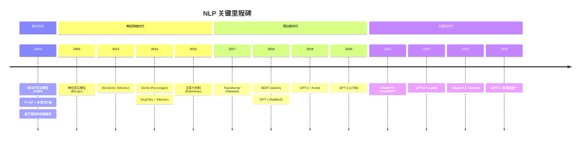
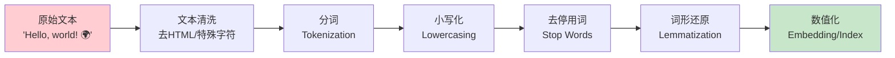
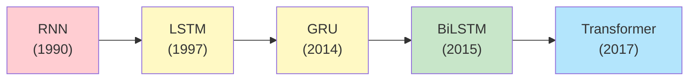

# NLP 基础 (NLP Fundamentals)

> 中文简称：NLP 基础

> **一句话理解**: NLP 是让机器"读懂"人类语言的学科——从分词、词嵌入到序列模型，每一步都在把非结构化的文本转化为机器可理解的数学表示。

---

## TL;DR

- **文本预处理**: 清洗、分词 (Tokenization)、去停用词、词干提取 / 词形还原
- **Tokenization 策略**: Word-level、Subword (BPE/WordPiece)、Character-level，各有取舍
- **词嵌入 (Word Embedding)**: Word2Vec (CBOW/Skip-gram)、GloVe、FastText，将词映射为稠密向量
- **序列模型演进**: RNN → LSTM → GRU → Transformer，逐步解决长程依赖问题
- **NLP 任务分类**: 文本分类、命名实体识别、机器翻译、问答、摘要生成
- **评估指标**: Accuracy、F1-Score、BLEU、ROUGE、Perplexity

---

## 本章节索引

本文是 NLP 领域的总入口，向下链接核心子模块：

| 子模块 | 核心内容 | 链接 |
|--------|---------|------|
| **序列模型** | RNN、LSTM、GRU、Seq2Seq | [[05_大模型/02_序列模型/02_序列模型]] |
| **Transformer 革命** | Self-Attention、BERT、GPT | [[05_大模型/03_Transformer架构/03_Transformer_Revolution]] |
| **Prompt Engineering** | 提示词工程、In-context Learning | [[05_大模型/08_提示工程/16_Prompt工程]] |

---

## 1. NLP 发展时间线 (Timeline)



---

## 2. 文本预处理流水线 (Text Preprocessing)



### 2.1 Tokenization 策略对比

| 策略 | 粒度 | 词汇量 | 优点 | 缺点 | 代表 |
|------|------|--------|------|------|------|
| **Word-level** | 整词 | 50K-500K | 语义完整 | OOV 问题、词汇大 | spaCy |
| **Subword (BPE)** | 子词 | 30K-100K | 平衡粒度与覆盖 | 切分不直观 | GPT, LLaMA |
| **WordPiece** | 子词 | 30K | 基于似然选择 | 类似 BPE | BERT |
| **Character** | 单字符 | <256 | 无 OOV | 序列过长 | 部分 CJK 模型 |
| **SentencePiece** | 子词 | 32K-128K | 语言无关、直接在原始文本训练 | — | T5, LLaMA |

**实践建议**: 现代 LLM 普遍使用 BPE 或 SentencePiece，中文场景常用 Byte-level BPE 或 Unigram。

---

## 3. 词嵌入 (Word Embeddings)

词嵌入将离散的词映射为连续的稠密向量，使得语义相似的词在向量空间中距离更近。

| 方法 | 训练方式 | 维度 | 特点 | 局限 |
|------|---------|------|------|------|
| **One-Hot** | 无训练 | V (词汇量) | 简单 | 稀疏、无语义信息 |
| **Word2Vec CBOW** | 上下文→中心词 | 100-300 | 训练快 | 一词一向，无法处理多义 |
| **Word2Vec Skip-gram** | 中心词→上下文 | 100-300 | 小数据表现好 | 同上 |
| **GloVe** | 全局共现矩阵分解 | 50-300 | 利用全局统计 | 同上 |
| **FastText** | 子词 (n-gram) | 100-300 | 处理 OOV 词 | 训练慢 |
| **Contextual (BERT)** | Transformer | 768+ | 上下文相关、多义处理 | 计算开销大 |

**经典公式** (Word2Vec 核心思想):

```
CBOW:    P(w_t | w_{t-2}, w_{t-1}, w_{t+1}, w_{t+2})  → 最大化
Skip-gram: P(w_{t+j} | w_t)  for j ∈ [-c, c]          → 最大化
```

**重要发现**: `vec("King") - vec("Man") + vec("Woman") ≈ vec("Queen")` — 词向量空间编码了语义关系。

---

## 4. 序列模型演进 (Sequence Models Evolution)



| 模型 | 核心机制 | 长程依赖 | 并行性 | 复杂度 |
|------|---------|---------|--------|--------|
| **Vanilla RNN** | 隐状态循环 h_t = tanh(W_h[h_{t-1}, x_t]) | 差 (梯度消失) | 不可并行 | O(n) |
| **LSTM** | 遗忘门 + 输入门 + 输出门 + Cell State | 较好 | 不可并行 | O(n) |
| **GRU** | 重置门 + 更新门 (简化 LSTM) | 较好 | 不可并行 | O(n) |
| **Transformer** | Self-Attention + Position Encoding | 优秀 | 完全并行 | O(n²) |

---

## 5. NLP 任务分类 (Task Taxonomy)

| 任务类别 | 具体任务 | 输入 → 输出 | 典型模型 | 评估指标 |
|---------|---------|------------|---------|---------|
| **文本分类** | 情感分析、垃圾邮件检测 | 文本 → 标签 | BERT, FastText | Accuracy, F1 |
| **序列标注** | NER、POS Tagging | 文本 → 逐 token 标签 | BiLSTM-CRF, BERT | F1, Span-F1 |
| **文本生成** | 摘要、翻译、创作 | 文本 → 文本 | GPT, T5, BART | BLEU, ROUGE |
| **问答** | 抽取式、生成式 QA | 问题+文本 → 答案 | BERT, GPT | EM, F1 |
| **文本相似度** | 语义匹配、检索 | 文本对 → 分数 | Sentence-BERT | Spearman ρ |
| **信息抽取** | 关系抽取、事件抽取 | 文本 → 结构化数据 | BERT, LLM | Precision, Recall |

---

## 延伸阅读 (Further Reading)

- [[05_大模型/02_序列模型/02_序列模型]] — 序列模型详解 (RNN/LSTM)
- [[05_大模型/03_Transformer架构/03_Transformer_Revolution]] — Transformer 架构革命
- [[05_大模型/08_提示工程/16_Prompt工程]] — 提示词工程
- [[05_大模型/01_LLM基础]] — 大语言模型基础
- [[05_大模型/03_Transformer架构/14_Transformer 架构详解]] — Transformer 架构详解
- [[05_大模型/01_LLM基础/06_llm_nlp|LLM 与 NLP 融合]]
- [[05_大模型/01_LLM基础/ApacheCN_NLP_Track|ApacheCN NLP 学习路径]]

## 版本兼容性

| 工具 | 版本 | 特性 | 备注 |
|------|------|------|------|
| HuggingFace | 4.40+ | 统一模型接口 | transformers |
| spaCy | 3.7+ | 工业级 NLP | 传统 NLP |
| jieba | 0.42+ | 中文分词 | 中文 NLP |
| NLTK | 3.8+ | 教学工具 | 学习用 |
| gensim | 4.3+ | 词向量训练 | Word2Vec |

## 常见问题

| 问题 | 原因 | 解决方案 |
|------|------|------|
| 分词不准 | 词典不全 | 添加自定义词典 |
| OOV 问题 | 词汇表限制 | 使用 BPE/SentencePiece |
| 长文本慢 | 序列太长 | 使用 Transformer |
| 中文效果差 | 训练数据偏英文 | 使用中文优化模型 |

## 生产检查清单

1. ✅ 确认任务类型和性能要求
2. ✅ 选择合适的分词策略
3. ✅ 实现文本预处理流水线
4. ✅ 选择合适的词嵌入方法
5. ✅ 建立评估基准
6. ✅ 实现缓存和降级策略
7. ✅ 监控延迟和成本
8. ✅ 定期更新模型和词典

## 总结

NLP 是让机器"读懂"人类语言的学科，从分词、词嵌入到序列模型，每一步都在把非结构化的文本转化为机器可理解的数学表示。2026 年，NLP 已进入 LLM 时代，但经典 NLP 知识仍是理解大模型的基础。Transformer 架构统一了几乎所有 NLP 任务，而 BPE/SentencePiece 成为标准的分词方法。

> 💡 NLP 的核心价值：让机器理解人类语言——从"听不懂"到"听得懂"再到"会思考"，每一步都是人工智能的重要突破。
