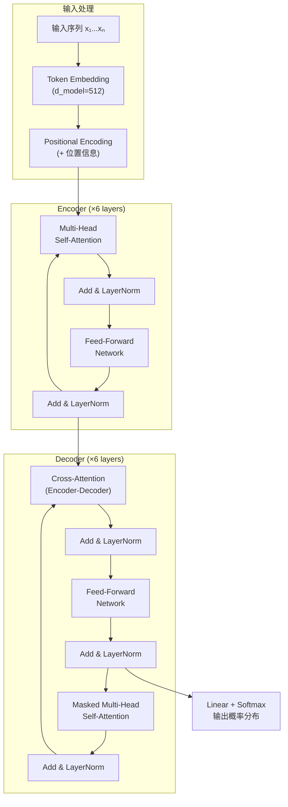
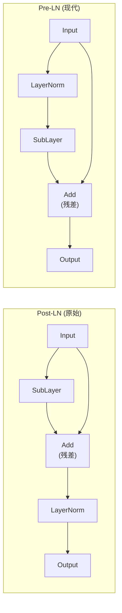

# Transformer 架构详解

> 中文简称：Transformer 架构详解

> **一句话理解**: Transformer 用 Self-Attention 取代循环和卷积，让序列中任意两个位置都能直接交互——并行训练、全局感知、高度可扩展，成为当代 AI 的统一基础架构。

---

## TL;DR

- **Encoder-Decoder 结构**: 原始 Transformer 包含 6 层 Encoder + 6 层 Decoder
- **Multi-Head Attention**: 将注意力拆分为多个"头"，每个头关注不同的语义子空间
- **Positional Encoding**: 用正弦/余弦函数或可学习向量为序列注入位置信息
- **Feed-Forward Network (FFN)**: 每个 Transformer Block 包含两层线性变换 + 激活函数
- **Layer Normalization**: Pre-LN (先归一化再注意力) 已成为主流，训练更稳定
- **复杂度**: Self-Attention 为 O(n²·d)，FFN 为 O(n·d²)，n 为序列长度，d 为维度

---

## 关联文档

- [[05_大模型/04_Transformer_Revolution/Self_Attention_Mechanism]] — Self-Attention 机制深入剖析
- [[05_大模型/04_Transformer_Revolution/Transformer_Revolution]] — Transformer 革命全景
- [[20_论文精读/02_Architecture/Attention_Is_All_You_Need_Deep_Dive]] — 原始论文深度解读

---

## 1. 整体架构 (Overall Architecture)



---

## 2. 核心组件拆解 (Component Breakdown)

### 2.1 Multi-Head Self-Attention

Self-Attention 的核心是 Q (Query)、K (Key)、V (Value) 三个矩阵运算：

```
Attention(Q, K, V) = softmax(QKᵀ / √d_k) · V

Multi-Head:
├── 将 Q, K, V 分别投影到 h 个子空间
├── 每个头独立计算 Attention
├── 拼接所有头的输出
└── 最终线性投影

head_i = Attention(QW_i^Q, KW_i^K, VW_i^V)
MultiHead(Q,K,V) = Concat(head_1,...,head_h) · W^O
```

**直觉**: 不同的注意力头可以学习不同类型的关系——一个头关注语法结构，另一个关注语义相似性，还有的关注位置相邻关系。

### 2.2 组件对比表

| 组件 | 功能 | 参数量 (d=512, h=8) | 计算复杂度 | 作用 |
|------|------|---------------------|-----------|------|
| **Multi-Head Attention** | 序列内全局交互 | 4·d² ≈ 1M | O(n²·d) | 捕捉任意位置间依赖 |
| **Feed-Forward (FFN)** | 逐位置非线性变换 | 2·d·d_ff ≈ 2M | O(n·d²) | 特征升维 → 非线性 → 降维 |
| **Layer Normalization** | 归一化激活值 | 2·d ≈ 1K | O(n·d) | 稳定训练、加速收敛 |
| **Positional Encoding** | 注入位置信息 | 0 (固定) 或 d (可学习) | O(n·d) | 打破排列不变性 |
| **Residual Connection** | 跳跃连接 | 0 | O(n·d) | 缓解梯度消失 |

### 2.3 Positional Encoding 详解

原始 Transformer 使用固定的正弦/余弦位置编码：

```
PE(pos, 2i)   = sin(pos / 10000^(2i/d_model))
PE(pos, 2i+1) = cos(pos / 10000^(2i/d_model))

其中:
├── pos = 位置索引 (0, 1, 2, ...)
├── i   = 维度索引 (0, 1, 2, ..., d_model/2-1)
└── d_model = 模型维度 (通常 512 或 768)
```

**为什么用正弦/余弦？** 不同频率的波形叠加可以唯一标识每个位置，且相对位置关系可以通过线性变换表达：`PE(pos+k)` 可以表示为 `PE(pos)` 的线性函数。

| 编码方式 | 类型 | 最大长度 | 优势 | 使用模型 |
|---------|------|---------|------|---------|
| **Sinusoidal** | 固定公式 | 无限制 | 理论可外推 | 原始 Transformer |
| **Learned** | 可学习参数 | 固定 (如 2048) | 数据自适应 | BERT, GPT-2 |
| **RoPE** | 旋转位置编码 | 可扩展 | 相对位置感知 | LLaMA, GPT-NeoX |
| **ALiBi** | 线性偏置 | 可外推 | 无需位置向量 | BLOOM |

---

## 3. Layer Normalization: Pre-LN vs Post-LN



| 方案 | 训练稳定性 | 最终性能 | 使用模型 |
|------|-----------|---------|---------|
| **Post-LN** | 需 warmup，不稳定 | 略优（充分训练后） | 原始 Transformer |
| **Pre-LN** | 稳定，无需 warmup | 接近 Post-LN | GPT-2, LLaMA, 大多数现代模型 |

---

## 4. PyTorch 核心代码片段

```python
import torch
import torch.nn as nn
import math

class MultiHeadAttention(nn.Module):
    def __init__(self, d_model=512, num_heads=8):
        super().__init__()
        self.d_k = d_model // num_heads
        self.num_heads = num_heads
        self.W_q = nn.Linear(d_model, d_model)
        self.W_k = nn.Linear(d_model, d_model)
        self.W_v = nn.Linear(d_model, d_model)
        self.W_o = nn.Linear(d_model, d_model)

    def forward(self, query, key, value, mask=None):
        batch_size = query.size(0)

        # 线性投影并拆分为多头
        Q = self.W_q(query).view(batch_size, -1, self.num_heads, self.d_k).transpose(1, 2)
        K = self.W_k(key).view(batch_size, -1, self.num_heads, self.d_k).transpose(1, 2)
        V = self.W_v(value).view(batch_size, -1, self.num_heads, self.d_k).transpose(1, 2)

        # 缩放点积注意力 (Scaled Dot-Product Attention)
        scores = torch.matmul(Q, K.transpose(-2, -1)) / math.sqrt(self.d_k)
        if mask is not None:
            scores = scores.masked_fill(mask == 0, float('-inf'))
        attn = torch.softmax(scores, dim=-1)

        # 拼接多头
        output = torch.matmul(attn, V)
        output = output.transpose(1, 2).contiguous().view(batch_size, -1, self.num_heads * self.d_k)

        return self.W_o(output)
```

---

## 5. 架构变体 (Architecture Variants)

| 变体 | 改动 | 效果 | 代表模型 |
|------|------|------|---------|
| **Decoder-only** | 去掉 Encoder，仅用 Masked Attention | 自回归生成最优 | GPT, LLaMA, Claude |
| **Encoder-only** | 去掉 Decoder，双向注意力 | 理解任务最优 | BERT, RoBERTa |
| **Sparse Attention** | 局部 + 全局注意力模式 | O(n√n) 或 O(n·log n) | Longformer, BigBird |
| **Flash Attention** | IO 感知分块计算 | 2-4x 加速，省内存 | 通用加速方案 |
| **MoE** | FFN 层使用稀疏专家 | 参数多但激活少 | Mixtral, GPT-4 |
| **GQA (Grouped-Query)** | 多个 Q 头共享 K/V | 减少 KV Cache | LLaMA 2 (70B) |

---

## 延伸阅读 (Further Reading)

- [[05_大模型/04_Transformer_Revolution/Self_Attention_Mechanism]] — Self-Attention 机制详解
- [[05_大模型/04_Transformer_Revolution/Transformer_Revolution]] — Transformer 革命全景
- [[05_大模型/NLP_Fundamentals]] — NLP 基础知识
- [[05_大模型/01_LLM_Fundamentals]] — 大语言模型基础
- [[20_论文精读/02_Architecture/Attention_Is_All_You_Need_Deep_Dive]] — "Attention Is All You Need" 论文深度解读
