# Tool Use 与 Agent 微调 (Tool-Use and Agent Fine-Tuning)

> 中文简称：Tool Use 与 Agent 微调

> **一句话理解**: Tool-Use 微调就像教一个博学但只会纸上谈兵的学者"动手干活"——学会调用计算器、查数据库、写代码，从"能说"进化到"能做"；Agent 微调则更进一步，让它像项目经理一样自主规划、分步执行、处理异常。

---

## 目录

1. [Tool Use 基础](#1-tool-use-基础)
2. [Function Calling 训练数据](#2-function-calling-训练数据)
3. [Tool-Use Fine-Tuning Pipeline](#3-tool-use-fine-tuning-pipeline)
4. [Agent Fine-Tuning](#4-agent-fine-tuning)
5. [MCP (Model Context Protocol) Training](#5-mcp-model-context-protocol-training)
6. [Agentic RL (强化学习驱动 Agent)](#6-agentic-rl-强化学习驱动-agent)
7. [Code Interpreter Training](#7-code-interpreter-training)
8. [Web Browsing Training](#8-web-browsing-training)
9. [Multi-Agent Training](#9-multi-agent-training)
10. [实战指南](#10-实战指南)
11. [方法对比总表](#11-方法对比总表)

---

## TL;DR（30 秒速览）

- **Tool Use** = 让 LLM 输出结构化的函数调用指令，而不是纯文本
- **Function Calling SFT** = 用 API 文档 + 合成数据监督微调，提升调用准确率
- **Agent** = LLM + 规划 (Planning) + 工具使用 (Tool Use) + 记忆 (Memory)，微调使模型学会自主决策
- **MCP** = Anthropic 推出的工具集成标准，让模型动态发现和使用外部工具
- **Agentic RL** = 用强化学习 (GRPO/PPO) 优化 Agent 的多步策略
- **Code Interpreter** = 训练模型在沙箱中写代码、执行代码、根据输出迭代
- **Multi-Agent** = 多个 Agent 协作、辩论、分工，解决复杂任务
- **τ-bench** = 面向客服等真实场景的 Agent 评估基准

---

## 相关文档

- [PEFT 参数高效微调](./09_PEFT_2026.md) — LoRA/QLoRA 等参数高效方法，Tool-Use 微调常用
- [微调技术总览](./03_微调技术.md) — SFT/RLHF/DPO 等微调基础
- [GRPO 与新对齐方法](07_模型训练/06_对齐训练/02_GRPO_and_新型_对齐_Methods.md) — Agent RL 训练中使用的 GRPO 算法详解
- [Agentic 评估指南](08_模型评估/02_基准测试/01_Agentic_基准测试_指南.md) — BFCL、τ-bench、AgentBench 等 Agent 评估方法

---

## 1. Tool Use 基础

### 1.1 什么是 Tool Use / Function Calling

传统 LLM 只能生成自然语言文本。但在实际应用中，我们经常需要模型：

- 查询实时天气（调用 Weather API）
- 执行数学计算（调用计算器 / Wolfram Alpha）
- 搜索数据库（执行 SQL 查询）
- 发送邮件（调用邮件 API）
- 读取文件（调用文件系统工具）

**Tool Use（工具使用）** 让模型在生成过程中输出**结构化的函数调用指令**，由外部系统执行后将结果返回给模型继续推理。这一过程对用户透明，用户体验就像和一个"什么都能查、什么都能算"的助手对话。

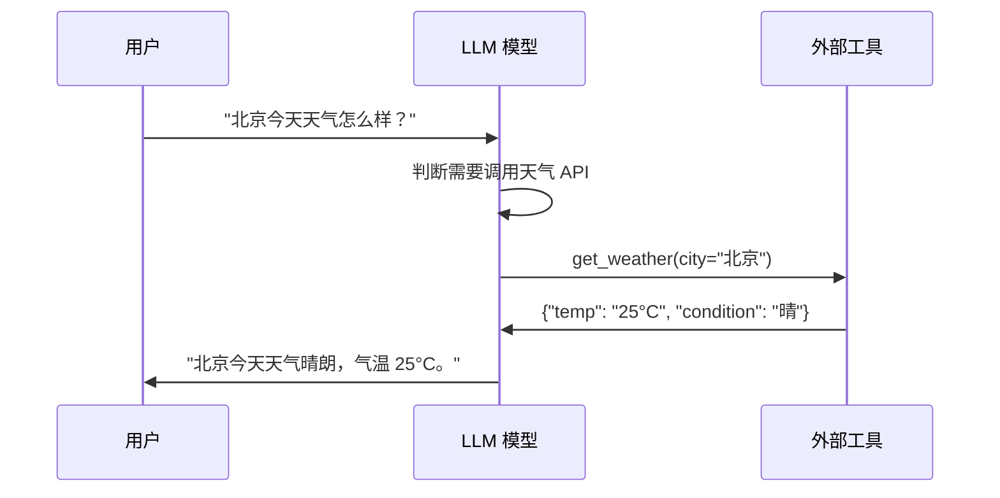

**核心概念拆解**：

| 术语 | 含义 | 示例 |
|------|------|------|
| **Tool Definition** | 工具的名称、描述、参数 schema | `get_weather(city: str) -> dict` |
| **Tool Call** | 模型输出的调用指令 | `{"name": "get_weather", "arguments": {"city": "北京"}}` |
| **Tool Result** | 工具执行后返回的结果 | `{"temp": "25°C", "condition": "晴"}` |
| **Tool Choice** | 控制模型是否/如何调用工具 | `auto`, `required`, `none`, `{"name": "xxx"}` |

### 1.2 为什么要微调 Tool Use

通用模型经过 prompt 工程即可进行简单的 function calling，但在生产环境中存在显著不足：

| 问题 | 表现 | 微调后改善 |
|------|------|-----------|
| **格式不合规** | 输出 JSON 格式错误、字段缺失、多余文字 | 格式合规率 > 99% |
| **参数幻觉** | 编造不存在的参数名或参数值 | 参数准确率提升 30%+ |
| **选择错误** | 选错函数或遗漏必选参数 | 函数选择准确率显著提升 |
| **冗余调用** | 不需要工具时也调用工具 | 学会判断何时调用、何时直接回答 |
| **并行能力差** | 多个独立调用串行执行 | 学会 parallel function calling |
| **错误恢复弱** | 工具报错后不知如何处理 | 学会重试、换工具、向用户澄清 |

**核心洞察**：Tool-use 微调的本质是让模型学会一种新的"语言"——结构化的函数调用协议。就像学外语需要大量例句一样，tool-use 微调也需要大量高质量的调用示例。研究表明，仅需 **500-2000 条**高质量示例即可显著提升小模型的 function calling 能力（Glaive 2023, Salesforce xLAM 2024）。

### 1.3 Tool Use 格式对比

目前主流的 tool-use 格式有三大体系，各有设计哲学：

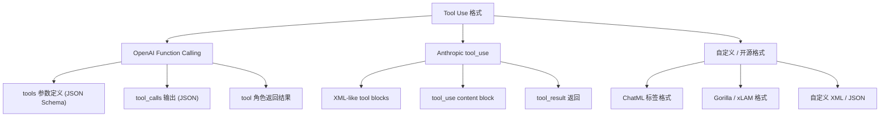

#### OpenAI Function Calling 格式

```json
{
  "model": "gpt-4",
  "messages": [{"role": "user", "content": "北京天气如何？"}],
  "tools": [{
    "type": "function",
    "function": {
      "name": "get_weather",
      "description": "获取指定城市的天气信息",
      "parameters": {
        "type": "object",
        "properties": {
          "city": {"type": "string", "description": "城市名称"},
          "unit": {"type": "string", "enum": ["celsius", "fahrenheit"]}
        },
        "required": ["city"]
      }
    }
  }]
}
```

模型响应输出：

```json
{
  "choices": [{
    "message": {
      "role": "assistant",
      "content": null,
      "tool_calls": [{
        "id": "call_abc123",
        "type": "function",
        "function": {
          "name": "get_weather",
          "arguments": "{\"city\": \"北京\", \"unit\": \"celsius\"}"
        }
      }]
    }
  }]
}
```

#### Anthropic tool_use 格式

```json
{
  "role": "assistant",
  "content": [
    {
      "type": "thinking",
      "thinking": "用户询问天气，我需要调用 get_weather 工具..."
    },
    {
      "type": "tool_use",
      "id": "toolu_abc123",
      "name": "get_weather",
      "input": {"city": "北京", "unit": "celsius"}
    }
  ]
}
```

工具返回结果：

```json
{
  "role": "user",
  "content": [
    {
      "type": "tool_result",
      "tool_use_id": "toolu_abc123",
      "content": "{\"temp\": \"25°C\", \"condition\": \"晴\"}"
    }
  ]
}
```

#### 开源微调常用格式 (ChatML / 自定义标签)

```text
__code=$?; pgrep -g 0 >/var/folders/6j/5zn4k0rn3bbddx_y9rm_f6yh0000gn/T/shell_pgrep_f107baf63515.tmp 2>&1; (exit $__code)<|im_start|>system
You are a helpful assistant with access to the following tools:
{"name": "get_weather", "description": "获取天气", "parameters": {...}}
</|im_end|>
<|im_start|>user
北京今天天气怎么样？</|im_end|>
<|im_start|>assistant
__code=$?; pgrep -g 0 >/var/folders/6j/5zn4k0rn3bbddx_y9rm_f6yh0000gn/T/shell_pgrep_4a728057ae09.tmp 2>&1; (exit $__code)
---

## 2. Function Calling 训练数据

Function calling 微调的效果高度依赖训练数据质量。本节介绍如何构建高质量的 function calling 训练数据集。

### 2.1 数据来源：API 文档 → 训练示例

最可靠的训练数据来源是真实的 API 文档。构建流程如下：

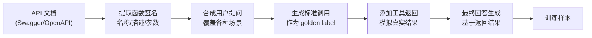

**具体步骤**：

1. **API 文档解析**：从 Swagger/OpenAPI spec 中提取所有 endpoint 的名称、描述、参数 schema
2. **用户提问合成**：针对每个 API，生成 5-20 种不同的用户提问方式（口语化、正式、模糊等）
3. **标准调用生成**：用强模型（GPT-4 / Claude）生成正确的函数调用作为 golden label
4. **工具返回模拟**：模拟真实的 API 返回值，包括成功和失败场景
5. **最终回答生成**：基于工具返回结果，生成面向用户的最终回答

### 2.2 合成数据生成策略

大规模训练数据通常需要合成生成。主流方法包括：

| 方法 | 原理 | 优点 | 缺点 |
|------|------|------|------|
| **Self-Instruct** | 用强模型生成指令+回答 | 快速、低成本 | 多样性有限 |
| **Evol-Instruct** | 逐步演化增加复杂度 | 多样性好 | 可能引入噪声 |
| **API-Gen** | 从 API 定义自动生成调用链 | 贴近真实场景 | 需要 API 生态 |
| **Self-Play** | 模型间对话产生轨迹 | 自然多轮 | 需要质量过滤 |
| **Rejection Sampling** | 大量采样 + 过滤 | 质量可控 | 计算成本高 |

**合成数据生成示例 (Python)**：

```python
from openai import OpenAI
client = OpenAI()

def generate_training_example(user_query: str, tools: list) -> dict:
    """使用 GPT-4 生成一条 function calling 训练样本"""
    response = client.chat.completions.create(
        model="gpt-4",
        messages=[
            {"role": "system", "content": "你是一个助手，根据用户需求调用合适的工具。"},
            {"role": "user", "content": user_query}
        ],
        tools=[{"type": "function", "function": t} for t in tools],
        tool_choice="auto"
    )
    msg = response.choices[0].message
    return {
        "user_message": user_query,
        "tool_definitions": tools,
        "model_response": {
            "content": msg.content,
            "tool_calls": [tc.model_dump() for tc in (msg.tool_calls or [])]
        }
    }

# 批量生成：针对每个 API 生成多种用户提问方式
queries = ["帮我找一款500元以下的蓝牙耳机", "有没有评分最高的机械键盘？", ...]
dataset = [generate_training_example(q, tools) for q in queries]
```

### 2.3 多轮 Tool Use 对话

真实场景中 tool use 往往是多轮的。多轮训练数据需包含：

- **信息收集轮**：模型向用户追问缺失参数
- **多步调用轮**：先搜索再查详情再比价
- **错误恢复轮**：工具失败后重试或换策略
- **结果总结轮**：汇总多步结果给用户

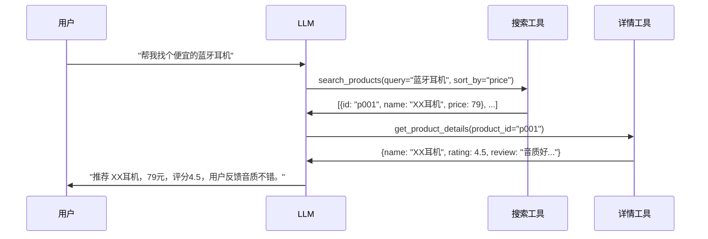

### 2.4 Parallel Function Calling (并行函数调用)

当多个工具调用之间无依赖关系时，模型应学会并行调用：

```json
{
  "tool_calls": [
    {
      "id": "call_1",
      "function": {
        "name": "get_weather",
        "arguments": "{\"city\": \"北京\"}"
      }
    },
    {
      "id": "call_2",
      "function": {
        "name": "get_weather",
        "arguments": "{\"city\": \"上海\"}"
      }
    },
    {
      "id": "call_3",
      "function": {
        "name": "get_stock_price",
        "arguments": "{\"symbol\": \"AAPL\"}"
      }
    }
  ]
}
```

训练数据中需要显式标注哪些调用可以并行、哪些必须串行，让模型学会依赖分析。

### 2.5 错误处理与重试示例

高质量训练集必须包含错误场景：

| 错误类型 | 工具返回示例 | 期望模型行为 |
|----------|-------------|-------------|
| **参数错误** | `{"error": "invalid city name"}` | 向用户确认参数 |
| **服务超时** | `{"error": "timeout after 30s"}` | 重试或提示用户稍后 |
| **权限不足** | `{"error": "unauthorized"}` | 提示用户登录/授权 |
| **结果为空** | `{"results": []}` | 换关键词或告知无结果 |
| **部分失败** | 3个调用中1个失败 | 处理成功的，重试失败的 |

```json
{
  "messages": [
    {"role": "user", "content": "帮我查下火星的天气"},
    {
      "role": "assistant",
      "tool_calls": [{"function": {"name": "get_weather", "arguments": "{\"city\": \"火星\"}"}}]
    },
    {"role": "tool", "content": "{\"error\": \"city not found\"}"},
    {
      "role": "assistant",
      "content": "抱歉，我无法找到"火星"的天气信息。请确认您想查询的城市名称，例如北京、上海等。"
    }
  ]
}
```

### 2.6 数据格式规范

推荐的训练数据 schema，兼容 ShareGPT 和 OpenAI 格式：

```json
{
  "conversations": [
    {"from": "system", "value": "你是一个智能助手，可以使用以下工具：..."},
    {"from": "human", "value": "帮我查一下从北京到上海的高铁"},
    {"from": "gpt", "value": null, "tool_calls": [
      {"name": "search_trains", "arguments": {"from": "北京", "to": "上海", "date": "2026-06-04"}}
    ]},
    {"from": "tool", "value": "{\"trains\": [{\"id\": \"G1\", \"departure\": \"08:00\", \"price\": 553}]}"},
    {"from": "gpt", "value": "为您查到从北京到上海的高铁 G1，早上 8:00 发车，二等座 553 元。"}
  ],
  "tools": [
    {"name": "search_trains", "description": "查询火车票", "parameters": {...}}
  ]
}
```

---

## 3. Tool-Use Fine-Tuning Pipeline

### 3.1 端到端流程图

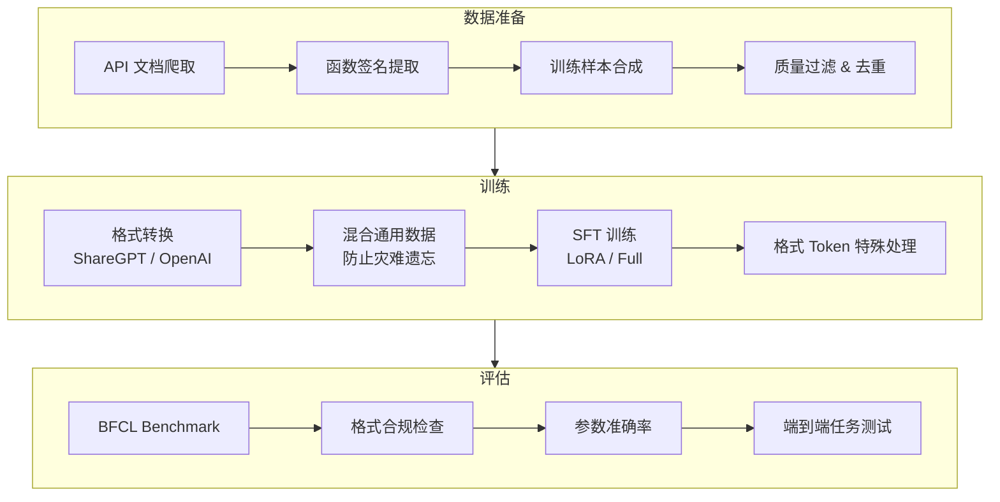

### 3.2 数据收集与处理

**Step 1: API 文档爬取**

```python
# 从 RapidAPI / Swagger Hub 爬取 API 定义
import requests

def scrape_openapi_specs(source_url: str) -> list:
 """从 OpenAPI 目录中抓取 API 定义"""
 specs = requests.get(source_url).json()
 functions = []
 for path, methods in specs.get("paths", {}).items():
 for method, detail in methods.items():
 functions.append({
 "name": detail.get("operationId", path.replace("/", "_")),
 "description": detail.get("summary", ""),
 "parameters": detail.get("parameters", []),
 "method": method.upper(),
 "path": path
 })
 return functions
```

**Step 2: 数据增强策略**

- **参数变异**：对同一 API 使用不同的参数值组合
- **提问改写**：同一需求用 10+ 种自然语言表达
- **负样本**：不需要工具时直接回答的示例（~20% 比例）
- **混合工具集**：每条样本提供 5-20 个工具（含干扰项），训练选择能力

### 3.3 数据混合策略

纯 function calling 数据会导致模型通用能力下降（灾难遗忘）。推荐的混合比例：

| 数据类型 | 比例 | 作用 |
|----------|------|------|
| **Function Calling** | 40-50% | 核心能力训练 |
| **通用对话** | 20-30% | 防止遗忘 |
| **代码生成** | 10-15% | 增强结构化输出 |
| **推理/数学** | 10-15% | 增强逻辑能力 |
| **Rejection Sampling** | 5-10% | 高质量困难样本 |

### 3.4 训练技巧

#### Loss 权重策略

在 function calling 训练中，不同 token 的重要性不同：

```python
# 伪代码：对不同部分施加不同 loss 权重
def compute_weighted_loss(logits, labels, token_types):
 """
 token_types: 'system' | 'user' | 'tool_def' | 'tool_call' | 'tool_result' | 'answer'
 """
 weights = {
 'system': 0.0, # 不计算 loss
 'user': 0.0, # 不计算 loss
 'tool_def': 0.0, # 工具定义不计算 loss
 'tool_call': 2.0, # 函数调用最重要，加大权重
 'tool_result': 0.5, # 工具返回结果，中等权重
 'answer': 1.0, # 最终回答，标准权重
 }
 loss = cross_entropy(logits, labels, reduction='none')
 weighted_loss = loss * token_types.map(weights)
 return weighted_loss.mean()
```

#### 格式 Token 处理

- 将 `
__code=$?; pgrep -g 0 >/var/folders/6j/5zn4k0rn3bbddx_y9rm_f6yh0000gn/T/shell_pgrep_75e73419d7c9.tmp 2>&1; (exit $__code)    │                 │
    │   ReAct 循环     │   Plan-then-Execute │   反思/自我修正     │
    │                 │                     │                     │
    │ Thought → Action│ 先生成完整计划       │ 执行后反思错误       │
    │ → Observation   │ 再逐步执行          │ 自我修正再执行       │
    │ → Thought → ... │                     │                     │
    └─────────────────┴─────────────────────┴─────────────────────┘
```

### 4.2 ReAct 格式训练

ReAct 是最流行的 Agent 训练范式。其核心是交替进行 **推理 (Reasoning)** 和 **行动 (Acting)**：

```text
Question: 帮我预订明天晚上 7 点北京国贸附近的意大利餐厅，2 人位。

Thought 1: 用户需要预订餐厅。我需要先搜索国贸附近的意大利餐厅，
           然后选择一个合适的进行预订。
Action 1: search_restaurants(location="国贸", cuisine="意大利", date="明天")

Observation 1: [
  {"id": "r001", "name": "La Bella Italia", "rating": 4.7, "available": true},
  {"id": "r002", "name": "Pizza Hut CBD", "rating": 3.9, "available": true}
]

Thought 2: La Bella Italia 评分更高(4.7)，看起来更合适。我来预订这家。
Action 2: book_restaurant(restaurant_id="r001", date="明天", time="19:00", guests=2)

Observation 2: {"booking_id": "BK12345", "status": "confirmed", "table": "A3"}

Thought 3: 预订成功了。我来整理信息告诉用户。
Action 3: finish("已为您预订 La Bella Italia 餐厅，明天晚上 7 点，2 人位，桌号 A3。预订号：BK12345。")
```

**ReAct 训练数据结构**：

```json
{
  "conversations": [
    {"role": "system", "content": "你是一个餐厅预订助手..."},
    {"role": "user", "content": "帮我预订明天晚上7点国贸附近的意大利餐厅，2人位"},
    {"role": "assistant", "content": "Thought: 用户需要预订餐厅...\nAction: search_restaurants(...)\n"},
    {"role": "tool", "content": "[{\"id\": \"r001\", ...}]"},
    {"role": "assistant", "content": "Thought: La Bella Italia 评分更高...\nAction: book_restaurant(...)\n"},
    {"role": "tool", "content": "{\"booking_id\": \"BK12345\", ...}"},
    {"role": "assistant", "content": "Thought: 预订成功...\nAction: finish(...)\n"}
  ]
}
```

### 4.3 Agent 轨迹数据 (Trajectory)

Agent 微调的核心数据是完整的交互轨迹：

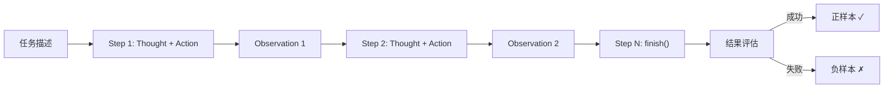

**轨迹数据来源**：

1. **人工标注**：专家手动操作，质量最高但成本大
2. **强模型蒸馏**：用 GPT-4/Claude 完成相同任务，收集轨迹
3. **环境交互**：部署 Agent 在真实/模拟环境中运行
4. **Self-Play**：一个模型扮演用户、另一个扮演 Agent 对话

### 4.4 Self-Play 数据生成

Self-play 是生成 Agent 训练数据的高效方法，无需人工标注：

```python
def self_play_data_generation(task_description, tools, env_simulator, max_steps=10):
    """Self-play 生成 Agent 训练轨迹"""
    trajectory, state = {"task": task_description, "steps": []}, {"history": []}

    for _ in range(max_steps):
        action = actor_model.generate(
            prompt=format_agent_prompt(state, tools), temperature=0.7)
        if action.type == "finish": break

        obs = env_simulator.execute(action.tool_name, action.arguments)
        step_data = {"thought": action.thought, "action": action.tool_call, "observation": obs}
        trajectory["steps"].append(step_data)
        state["history"].append(step_data)

    quality = critic_model.evaluate(trajectory)
    return trajectory if quality > 0.8 else None
```

### 4.5 Agent 微调最佳实践

| 实践 | 说明 |
|------|------|
| **CoT 与 Tool 交替** | 每个 Action 前必须有 Thought，防止模型跳过思考直接调用 |
| **错误轨迹也训练** | 包含 20-30% 的错误恢复轨迹，教会 Agent 处理异常 |
| **长度控制** | 限制最大步骤数（如 5-10 步），训练 Agent 高效完成任务 |
| **工具集多样性** | 训练时提供 5-30 个工具（含干扰项），提升选择能力 |
| **System Prompt 变化** | 使用不同的 system prompt 变体，增强泛化能力 |
| **渐进式训练** | 先学单步调用 → 再学 2-3 步链 → 最后学复杂多步任务 |

---

## 5. MCP (Model Context Protocol) Training

### 5.1 什么是 MCP

**Model Context Protocol (MCP)** 是 Anthropic 于 2024 年底推出的开放标准，旨在统一 LLM 与外部工具/数据源的交互方式。可以类比为 "AI 领域的 USB 接口"——一个通用协议让任何模型连接任何工具。

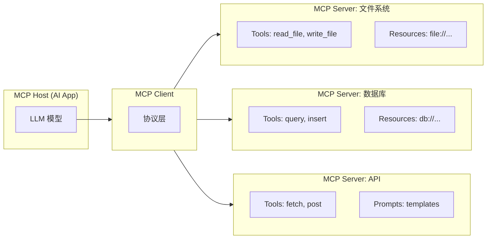

### 5.2 MCP 核心概念

| 概念 | 说明 | 类比 |
|------|------|------|
| **MCP Host** | 运行 LLM 的应用程序 | USB 主机 (电脑) |
| **MCP Client** | Host 中的协议处理层 | USB 控制器 |
| **MCP Server** | 提供工具/资源的服务 | USB 设备 (U盘/键盘) |
| **Tools** | 模型可调用的函数 | API endpoints |
| **Resources** | 模型可读取的数据源 | GET endpoints |
| **Prompts** | 预定义的 prompt 模板 | 配置模板 |

### 5.3 MCP Tool Schema

MCP 工具定义遵循 JSON Schema 标准：

```json
{
  "name": "query_database",
  "description": "执行 SQL 查询并返回结果",
  "inputSchema": {
    "type": "object",
    "properties": {
      "sql": {
        "type": "string",
        "description": "SQL 查询语句"
      },
      "database": {
        "type": "string",
        "description": "目标数据库名称",
        "default": "main"
      },
      "limit": {
        "type": "integer",
        "description": "返回结果最大行数",
        "default": 100
      }
    },
    "required": ["sql"]
  }
}
```

### 5.4 训练模型使用 MCP Server

训练模型使用 MCP 工具需要解决几个特殊挑战：

**1. 动态工具发现 (Dynamic Tool Discovery)**

与传统 function calling 不同，MCP 工具是动态注册的。训练时需要让模型学会：
- 解析 tools/list 返回的动态工具列表
- 根据工具描述判断用途
- 处理工具不可用或版本变化的情况

```json
{
  "messages": [
    {
      "role": "system",
      "content": "你可以使用以下 MCP 工具（动态发现）：\n[mcp-tools-list 输出]"
    },
    {
      "role": "user",
      "content": "帮我分析最近的服务器日志"
    },
    {
      "role": "assistant",
      "content": null,
      "tool_calls": [{
        "name": "mcp_call",
        "arguments": {
          "server": "log-analyzer",
          "tool": "search_logs",
          "input": {"query": "ERROR", "time_range": "last_24h"}
        }
      }]
    }
  ]
}
```

**2. 多 Server 协调**

MCP 环境中模型可能需要协调多个 server 的工具：

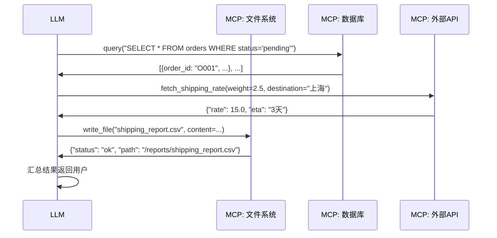

### 5.5 MCP 训练数据构建

```python
def build_mcp_training_data(mcp_servers: list, tasks: list):
    """构建 MCP 训练数据：枚举工具组合 → 生成轨迹 → 格式转换"""
    dataset = []
    for task in tasks:
        available工具 = [t for s in mcp_servers for t in s.list_tools()]
        trajectory = generate_trajectory(task=task, tools=available_tools, model="gpt-4")
        dataset.append({
            "mcp工具": [t.to_schema() for t in available_tools],
            "conversations": format_as_mcp_messages(trajectory),
            "metadata": {"servers_used": trajectory.servers_used,
                         "num_steps": len(trajectory.steps),
                         "success": trajectory.evaluation.passed}
        })
    return dataset
```

---

## 6. Agentic RL (强化学习驱动 Agent)

### 6.1 为什么需要 RL 训练 Agent

SFT 训练的 Agent 存在固有局限：

- **模仿偏差**：只能模仿训练数据中的行为，无法发现更优策略
- **曝光偏差**：训练时看 golden trajectory，推理时面对自己的错误会雪崩
- **探索不足**：不会主动尝试新的工具组合或策略

**强化学习** 通过环境反馈直接优化 Agent 的任务完成率，可以克服以上问题。

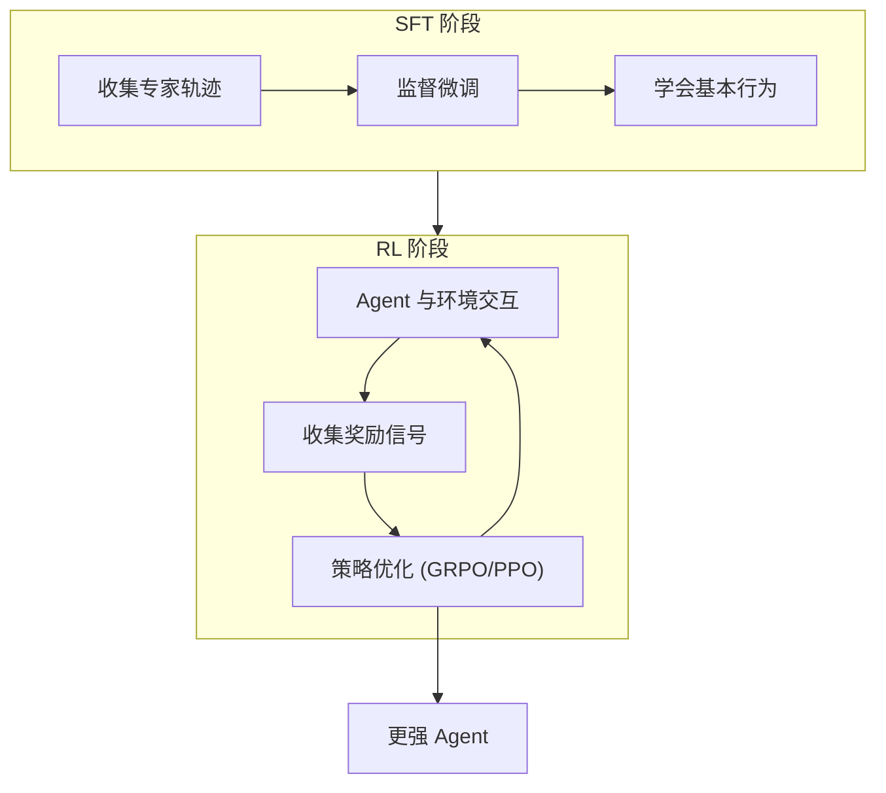

### 6.2 奖励设计 (Reward Design)

Agent RL 的奖励信号设计至关重要：

| 奖励维度 | 信号 | 权重建议 | 说明 |
|----------|------|---------|------|
| **任务完成** | 最终答案是否正确 | 最高 (×3) | 核心目标 |
| **效率** | 完成任务所用步骤数 | 中等 (×1) | 鼓励高效 |
| **格式合规** | 工具调用格式是否正确 | 中等 (×1) | 基础要求 |
| **安全性** | 是否避免危险操作 | 高 (×2) | 约束条件 |
| **过程奖励** | 每一步是否合理 | 低 (×0.5) | PRM 风格 |

**结果奖励 vs 过程奖励**：

```python
def compute_agent_reward(trajectory, ground_truth, optimal_steps=3):
    """计算 Agent 轨迹的综合奖励"""
    outcome = 1.0 if trajectory.final_answer == ground_truth else -1.0
    efficiency = max(0, 1.0 - (len(trajectory.steps) - optimal_steps) * 0.1)
    fmt = sum(s.is_valid_format for s in trajectory.steps) / len(trajectory.steps)
    safety = -2.0 if trajectory.has_unsafe_action else 0.0
    process = sum(prm_score(s) for s in trajectory.steps) / len(trajectory.steps)
    return 3.0*outcome + 1.0*efficiency + 1.0*fmt + safety + 0.5*process
```

### 6.3 τ-bench 风格训练

**τ-bench** (Tau-bench) 是面向真实客服场景的 Agent 评估基准。其训练思路可以泛化到多种 Agent 场景：

**τ-bench 核心特点**：
- 模拟真实客服环境（航空公司、零售商店）
- Agent 需要遵守复杂的业务政策 (policy)
- 包含多轮对话、工具调用、状态修改
- 评估端到端任务完成率

**τ-bench 训练流程**：

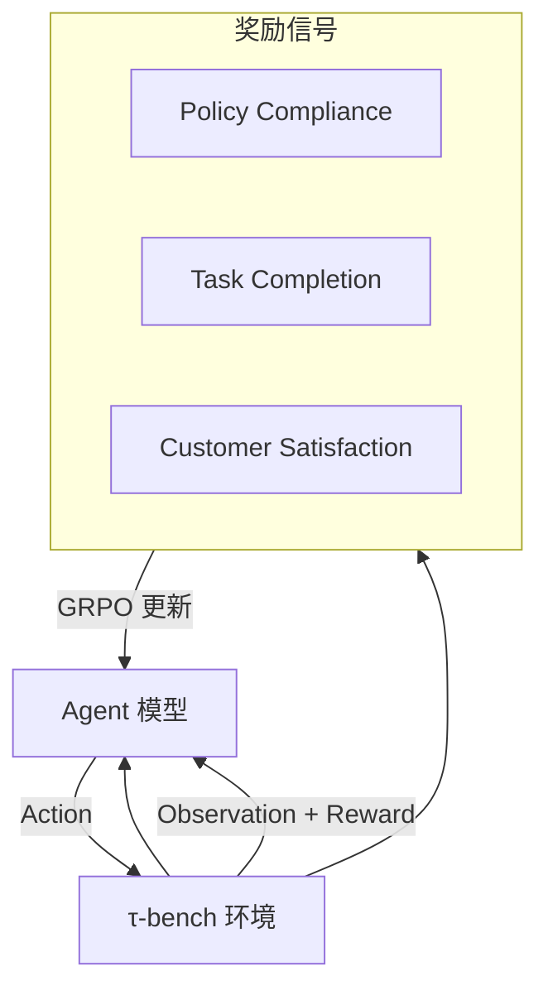

### 6.4 Kimi K2 的 Agentic 数据合成

Moonshot AI 的 Kimi K2 模型展示了 agentic 数据合成的前沿实践：

**Kimi K2 关键策略**：

1. **大规模 Self-Play**：Agent 在真实工具环境中 self-play 产生轨迹
2. **μ-RL (Micro-RL)**：细粒度强化学习，优化每个 tool call 的决策
3. **Agentic Data Synthesis**：
 - 部署 Agent 在 Web 环境中执行真实任务
 - 收集成功轨迹作为 SFT 数据
 - 用 RL 进一步优化策略
4. **多轮迭代**：SFT → 部署 → 收集 → SFT → RL 循环

### 6.5 环境交互框架

Agent RL 训练需要标准化的环境接口：

```python
class AgentEnvironment:
    """Agent RL 训练环境接口"""

    def __init__(self, tools: list, task_db: list):
        self.tools = tools
        self.tasks = task_db
        self.current_task = None
        self.history = []

    def reset(self, task_id: int) -> dict:
        self.current_task = self.tasks[task_id]
        self.history = []
        return {"task": self.current_task.description,
                "available工具": [t.schema for t in self.tools]}

    def step(self, action: dict) -> tuple:
        """返回 (observation, reward, done, info)"""
        if action["type"] == "tool_call":
            try:
                result = self.get_tool(action["name"]).execute(**action["arguments"])
                obs, reward = {"type": "tool_result", "content": result}, 0.0
            except Exception as e:
                obs, reward = {"type": "error", "content": str(e)}, -0.1
        elif action["type"] == "finish":
            return {"type": "done"}, self.evaluate(action["answer"]), True, {}

        self.history.append({"action": action, "observation": obs})
        return obs, reward, len(self.history) >= 20, {}

    def evaluate(self, answer: str) -> float:
        gt = self.current_task.expected_answer
        if answer == gt: return 1.0
        if self.partial_match(answer, gt): return 0.5
        return -1.0
```

关于 GRPO 算法的详细实现，参见 [GRPO 与新对齐方法](07_模型训练/06_对齐训练/02_GRPO_and_新型_对齐_Methods.md)。

---

## 7. Code Interpreter Training

### 7.1 什么是 Code Interpreter

Code Interpreter 让 LLM 具备编写和执行代码的能力——模型生成 Python 代码，在沙箱中执行，将执行结果返回给模型继续推理。这是最强大的 tool-use 形式之一。

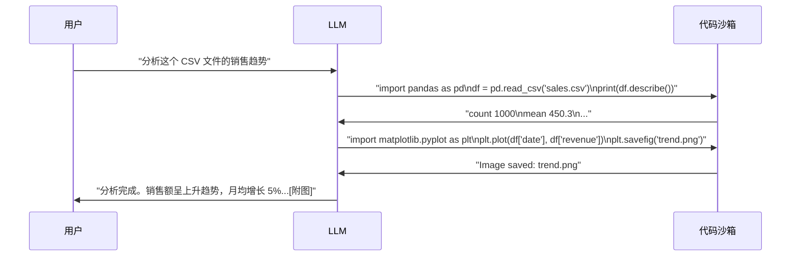

### 7.2 训练数据构建

Code Interpreter 训练数据的核心是 **(指令, 代码, 执行输出, 解释)** 四元组：

```json
{
  "messages": [
    {"role": "user", "content": "帮我计算 1 到 100 中所有质数的和"},
    {
      "role": "assistant",
      "content": "让我写一段 Python 代码来计算：",
      "code": "def is_prime(n):\n    if n < 2: return False\n    for i in range(2, int(n**0.5)+1):\n        if n % i == 0: return False\n    return True\n\nprimes = [i for i in range(2, 101) if is_prime(i)]\nprint(f'质数列表: {primes}')\nprint(f'总和: {sum(primes)}')"
    },
    {
      "role": "tool",
      "content": "质数列表: [2, 3, 5, 7, 11, 13, 17, 19, 23, 29, 31, 37, 41, 43, 47, 53, 59, 61, 67, 71, 73, 79, 83, 89, 97]\n总和: 1060"
    },
    {
      "role": "assistant",
      "content": "1 到 100 之间共有 25 个质数，它们的总和是 **1060**。"
    }
  ]
}
```

### 7.3 沙箱执行环境

Code Interpreter 需要安全的沙箱环境：

| 沙箱方案 | 安全性 | 功能 | 适用场景 |
|----------|-------|------|---------|
| **Docker 容器** | 高 | 完整 Linux 环境 | 生产环境 |
| **E2B** | 高 | 云端沙箱，快速启动 | SaaS 产品 |
| **Pyodide** | 中 | 浏览器内 Python | Web 应用 |
| **nsjail** | 高 | 轻量级 Linux 沙箱 | 高并发 |
| **Modal** | 高 | Serverless GPU 环境 | ML 任务 |

### 7.4 多步代码推理训练

高级 Code Interpreter 训练包含多步迭代：

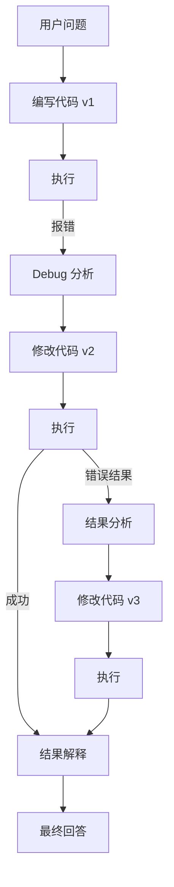

**关键训练要素**：

- **错误恢复**：代码报错后分析 traceback 并修复
- **迭代优化**：初版代码结果不满意，优化算法或可视化
- **文件操作**：读取用户上传的文件，生成并下载结果文件
- **库使用**：训练模型正确使用 pandas、numpy、matplotlib 等常用库
- **输出解读**：将代码输出翻译为用户能理解的自然语言

---

## 8. Web Browsing Training

### 8.1 Web Agent 概述

Web Browsing 能力让 LLM 能够主动搜索互联网、浏览网页、提取信息。这需要训练模型掌握一组 web-specific 的工具。

**Web Agent 工具集**：

| 工具 | 功能 | 参数 |
|------|------|------|
| `web_search` | 搜索引擎查询 | query, num_results |
| `browse_url` | 访问指定 URL | url, extract_mode |
| `click_element` | 点击页面元素 | element_id / selector |
| `scroll_page` | 滚动页面 | direction, amount |
| `extract_text` | 提取页面文本 | selector, format |
| `fill_form` | 填写表单 | fields |
| `navigate_back` | 返回上一页 | - |

### 8.2 搜索查询生成训练

训练模型生成高质量的搜索查询：

```json
{
  "messages": [
    {"role": "user", "content": "2026年最新的Python异步框架有哪些？"},
    {
      "role": "assistant",
      "content": null,
      "tool_calls": [{
        "function": {
          "name": "web_search",
          "arguments": "{\"query\": \"best Python async frameworks 2026\", \"num_results\": 5}"
        }
      }]
    },
    {
      "role": "tool",
      "content": "[{\"title\": \"Top Async Frameworks...\", \"url\": \"https://...\", \"snippet\": \"...\"}]"
    },
    {
      "role": "assistant",
      "content": null,
      "tool_calls": [{
        "function": {
          "name": "browse_url",
          "arguments": "{\"url\": \"https://...\", \"extract_mode\": \"markdown\"}"
        }
      }]
    },
    {
      "role": "tool",
      "content": "# Top Async Frameworks for Python in 2026\n\n1. **asyncio** (标准库)..."
    },
    {
      "role": "assistant",
      "content": "根据最新信息，2026年主流的 Python 异步框架包括..."
    }
  ]
}
```

**搜索查询优化策略**（训练目标）：

| 策略 | 原始查询 | 优化后查询 |
|------|---------|-----------|
| **关键词提取** | "帮我看看特斯拉最近股价" | "TSLA stock price today" |
| **精确搜索** | "Python 如何处理大文件" | "Python read large file memory efficient" |
| **多语言搜索** | "量子计算最新进展" | "quantum computing breakthrough 2026" |
| **site 限定** | "GitHub 上的 React 模板" | "site:github.com react template 2026" |

### 8.3 网页导航与信息提取

Web Agent 需要学会在复杂网页中定位和提取信息：

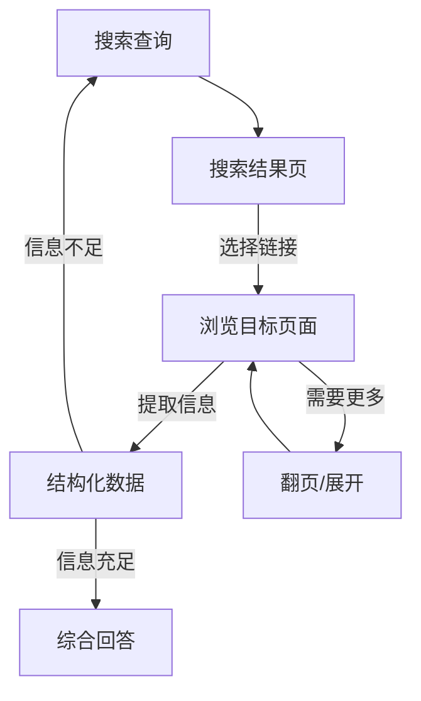

### 8.4 工具链 (Tool Chain) 训练

Web Browsing 常与其他工具组合使用：

```text
用户: "帮我调研一下竞品公司 X 的最新融资情况，整理成表格"

Step 1: web_search("X company funding 2026")
Step 2: browse_url("https://techcrunch.com/x-funding")
Step 3: web_search("X company valuation Series B")
Step 4: browse_url("https://crunchbase.com/x")
Step 5: code_execute("生成 Markdown 表格")
Step 6: finish("调研结果如下...")
```

---

## 9. Multi-Agent Training

### 9.1 Multi-Agent 概述

Multi-Agent 系统让多个 LLM Agent 协作完成复杂任务。每个 Agent 有独立角色和专长，通过通信协议协调。

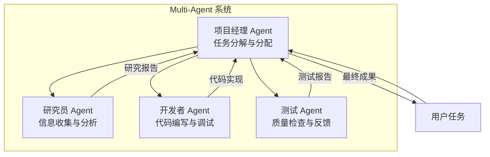

### 9.2 角色分配策略

| 策略 | 说明 | 适用场景 |
|------|------|---------|
| **固定角色** | 每个 Agent 预定义角色和 system prompt | 流程明确的场景 |
| **动态分配** | 由 Leader Agent 根据任务动态分配 | 通用任务 |
| **角色轮换** | Agent 轮流扮演不同角色 | 需要多视角的任务 |
| **能力匹配** | 根据 Agent 模型能力分配角色 | 异构 Agent 系统 |

### 9.3 通信协议

Multi-Agent 通信的常见模式：

**1. 中心化通信 (Hub-and-Spoke)**

```json
{
  "from": "leader",
  "to": "researcher",
  "type": "task_assignment",
  "content": {
    "task": "调研 Python 异步框架的最新发展",
    "deadline": "step_3",
    "output_format": "markdown_report"
  }
}
```

**2. 去中心化通信 (Peer-to-Peer)**

```json
{
  "from": "developer",
  "to": "tester",
  "type": "review_request",
  "content": {
    "artifact": "def async_handler():\n    await process()\n    return result",
    "request": "请测试这个异步处理函数的并发安全性"
  }
}
```

### 9.4 辩论机制 (Debate)

辩论机制让多个 Agent 就同一问题提出不同观点，通过辩论达成共识：

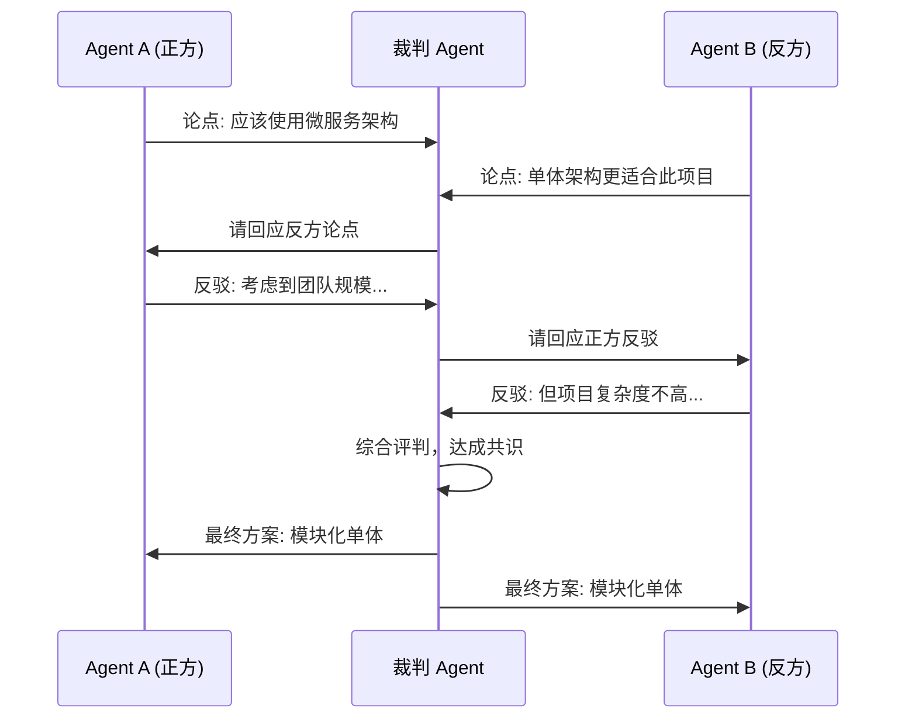

### 9.5 Multi-Agent 训练数据

训练 Multi-Agent 协作需要完整的对话轨迹：

```json
{
  "agents": [
    {"id": "leader", "model": "llama-3-70b", "role": "项目经理"},
    {"id": "researcher", "model": "llama-3-8b-tool", "role": "研究员"},
    {"id": "coder", "model": "deepseek-coder-33b", "role": "开发者"}
  ],
  "trajectory": [
    {"from": "user", "to": "leader", "content": "帮我构建一个天气 Dashboard"},
    {"from": "leader", "to": "researcher", "type": "assign", "content": "调研天气 API"},
    {"from": "researcher", "to": "leader", "type": "report", "content": "推荐使用 OpenWeather API..."},
    {"from": "leader", "to": "coder", "type": "assign", "content": "基于调研实现 Dashboard"},
    {"from": "coder", "to": "leader", "type": "report", "content": "代码实现完成，包含..."},
    {"from": "leader", "to": "user", "content": "Dashboard 已完成..."}
  ]
}
```

**训练要点**：
- 训练 Leader Agent 的任务分解能力
- 训练 Worker Agent 的专注执行能力（不越权）
- 训练冲突解决机制（意见不一致时如何决策）
- 训练通信效率（避免冗余信息传递）

---

## 10. 实战指南

### 10.1 Function Calling SFT 数据格式

完整的训练数据文件示例 (`tool_use_train.json`)：

```json
[
  {
    "conversations": [
      {
        "from": "system",
        "value": "你是一个智能旅行助手，可以帮助用户查询航班、酒店和景点信息。"
      },
      {
        "from": "human",
        "value": "我想查一下 6 月 15 号从北京飞东京的航班"
      },
      {
        "from": "gpt",
        "value": "好的，我来帮您查询 6 月 15 日北京到东京的航班信息。",
        "tool_calls": [
          {
            "id": "call_001",
            "name": "search_flights",
            "arguments": {
              "origin": "北京",
              "destination": "东京",
              "date": "2026-06-15",
              "passengers": 1
            }
          }
        ]
      },
      {
        "from": "tool",
        "value": "{\"flights\": [{\"airline\": \"ANA\", \"flight\": \"NH964\", \"departure\": \"08:30\", \"arrival\": \"12:45\", \"price\": 2800}, {\"airline\": \"国航\", \"flight\": \"CA925\", \"departure\": \"10:00\", \"arrival\": \"14:30\", \"price\": 2200}]}"
      },
      {
        "from": "gpt",
        "value": "为您查到 6 月 15 日北京飞东京的两个航班：\n\n1. **全日空 ANA NH964**\n   - 出发 08:30，到达 12:45\n   - 价格：¥2,800\n\n2. **中国国航 CA925**\n   - 出发 10:00，到达 14:30\n   - 价格：¥2,200\n\n国航价格更便宜，全日空到达时间更早。您倾向哪个？"
      }
    ],
    "tools": [
      {
        "name": "search_flights",
        "description": "搜索航班信息",
        "parameters": {
          "type": "object",
          "properties": {
            "origin": {"type": "string", "description": "出发城市"},
            "destination": {"type": "string", "description": "到达城市"},
            "date": {"type": "string", "description": "出发日期 (YYYY-MM-DD)"},
            "passengers": {"type": "integer", "description": "乘客人数"}
          },
          "required": ["origin", "destination", "date"]
        }
      }
    ]
  }
]
```

### 10.2 使用 Axolotl 进行 Tool-Use 微调

Axolotl 配置文件 (`axolotl_config.yaml`)：

```yaml
# Axolotl 配置 - Tool Use 微调
base_model: meta-llama/Meta-Llama-3-8B-Instruct
model_type: LlamaForCausalLM
tokenizer_type: AutoTokenizer

load_in_8bit: false
load_in_4bit: true  # QLoRA 4-bit 量化

adapter: qlora
lora_r: 64
lora_alpha: 128
lora_dropout: 0.05
lora_target_modules:
  - q_proj
  - k_proj
  - v_proj
  - o_proj
  - gate_proj
  - up_proj
  - down_proj

# 数据集配置
datasets:
  - path: ./data/tool_use_train.json
    type: sharegpt
    conversation: chatml
  - path: ./data/general_chat.json    # 混合通用数据
    type: sharegpt
    conversation: chatml

dataset_prepared_path: ./prepared_data
val_set_size: 0.05

# 训练超参数
num_epochs: 3
learning_rate: 0.0002
lr_scheduler: cosine
warmup_steps: 100
micro_batch_size: 2
gradient_accumulation_steps: 8
max_steps: -1
sequence_len: 8192

# 特殊 token
special_tokens:
  - "
__code=$?; pgrep -g 0 >/var/folders/6j/5zn4k0rn3bbddx_y9rm_f6yh0000gn/T/shell_pgrep_55de1f52c2b1.tmp 2>&1; (exit $__code)
### 10.4 构建 Agent 微调数据集

完整的 Agent 数据集构建 pipeline：

```python
"""Agent 微调数据集构建 Pipeline: 定义任务 → 生成轨迹 → 过滤 → 格式转换"""
import json

# Step 1: 定义任务集
TASKS = [
 {"description": "帮我预订下周三下午 2 点的会议室 A", "expected工具": ["search_rooms", "book_room"], "difficulty": "medium"},
 {"description": "分析销售数据并生成可视化报告", "expected工具": ["query_db", "execute_code", "create_chart"], "difficulty": "hard"},
]

# Step 2: 轨迹生成
def generate_agent_trajectory(task, tools, model):
 messages = [{"role": "system", "content": SYSTEM_PROMPT},
 {"role": "user", "content": task["description"]}]
 trajectory = {"task": task, "steps": [], "success": False}

 for _ in range(15):
 response = model.chat(messages, tools=tools, temperature=0.3)
 if response.has_tool_calls:
 for tc in response.tool_calls:
 result = simulate_tool(tc.name, tc.arguments)
 trajectory["steps"].append({"thought": response.thinking, "action": tc.to_dict(), "observation": result})
 messages += [{"role": "assistant", "content": response.content, "tool_calls": [tc.to_dict()]},
 {"role": "tool", "content": json.dumps(result)}]
 else:
 trajectory["final_answer"] = response.content
 trajectory["success"] = evaluate_answer(response.content, task)
 break
 return trajectory

# Step 3: 质量过滤 (成功 + 步骤数 2-12 + 有 thought + 无重复调用)
def filter_trajectories(trajs):
 return [t for t in trajs if t["success"] and 2 <= len(t["steps"]) <= 12
 and all(s.get("thought") for s in t["steps"])
 and len(set(json.dumps(s["action"], sort_keys=True) for s in t["steps"])) == len(t["steps"])]

# Step 4: 格式转换为 ShareGPT
def convert_format(trajs):
 result = []
 for t in trajs:
 convs = [{"from": "system", "value": SYSTEM_PROMPT}, {"from": "human", "value": t["task"]["description"]}]
 for s in t["steps"]:
 convs += [{"from": "gpt", "value": s["thought"], "tool_calls": [s["action"]]},
 {"from": "tool", "value": json.dumps(s["observation"], ensure_ascii=False)}]
 convs.append({"from": "gpt", "value": t["final_answer"]})
 result.append({"conversations": convs})
 return result

# 执行
raw = [generate_agent_trajectory(t, TOOLS, gpt4_model) for t in TASKS]
training_data = convert_format(filter_trajectories(raw))
json.dump(training_data, open("agent_train_data.json", "w"), ensure_ascii=False, indent=2)
print(f"生成 {len(training_data)} 条样本 (从 {len(raw)} 条过滤)")
```

### 10.6 评估工具使用准确率

评估 function calling 模型的多个维度：

```python
def evaluate_function_calling(model, test_set):
 """评估 function calling 能力的多个维度"""
 metrics = {"format": [], "selection": [], "args": []}
 for ex in test_set:
 resp = model.generate(messages=ex["messages"], tools=ex["tools"])
 try:
 parsed = json.loads(resp.tool_call_json)
 metrics["format"].append(1.0)
 except json.JSONDecodeError:
 metrics["format"].append(0.0); continue

 exp_funcs, act_funcs = [tc["name"] for tc in ex["expected_calls"]], [tc["name"] for tc in parsed]
 metrics["selection"].append(len(set(exp_funcs) & set(act_funcs)) / len(set(exp_funcs) | set(act_funcs)))

 for exp, act in zip(ex["expected_calls"], parsed):
 if exp["name"] == act.get("name"):
 metrics["args"].append(sum(act.get("arguments",{}).get(k)==v for k,v in exp["arguments"].items()) / len(exp["arguments"]))
 return {k: sum(v)/len(v) if v else 0.0 for k,v in metrics.items()}
```

### 10.7 生产环境注意事项

| 关注点 | 建议 |
|--------|------|
| **安全过滤** | 工具调用前增加参数校验和权限检查层 |
| **超时控制** | 为每个工具设置超时时间，防止无限等待 |
| **重试策略** | 实现指数退避重试，最多 3 次 |
| **日志记录** | 记录所有工具调用轨迹，用于 debug 和持续改进 |
| **A/B 测试** | 微调模型 vs 原始模型 + prompt 工程的效果对比 |
| **回滚机制** | 如果微调模型表现不佳，快速回退到 prompt 方案 |
| **监控告警** | 监控工具调用失败率、延迟、用户满意度 |

---

## 11. 方法对比总表

### 11.1 核心方法对比

| 方法 | 目标 | 数据类型 | 训练方式 | 评估指标 | 代表工作 |
|------|------|---------|---------|---------|---------|
| **Function Calling SFT** | 函数调用准确率 | API 文档 + 合成示例 | SFT | BFCL, 格式合规率 | xLAM, Gorilla, ToolLLaMA |
| **Agent Trajectory** | 多步任务完成 | 交互轨迹日志 | SFT | τ-bench, 任务完成率 | AgentTuning, AgentInstruct |
| **Agentic RL** | 策略优化 | 环境交互数据 | RL (GRPO/PPO) | 完成率, 效率 | Kimi K2, τ2-bench |
| **Code Interpreter** | 代码执行正确率 | 代码 + 执行输出 | SFT | 正确率, Pass@k | CodeLlama, DeepSeek-Coder |
| **Web Browsing** | 信息检索准确率 | 搜索 + 浏览轨迹 | SFT | 信息准确率 | WebAgent, Mind2Web |
| **Multi-Agent** | 协作任务完成 | 多角色对话轨迹 | SFT | 任务完成率, 效率 | AutoGen, CrewAI |
| **MCP Training** | 动态工具使用 | MCP server 交互 | SFT | 工具发现率, 调用准确率 | Claude, xLAM-2 |

### 11.2 训练规模与资源对比

| 方法 | 典型数据量 | 训练时间 (8×A100) | 推荐 PEFT | 最低显存 |
|------|-----------|-----------------|----------|---------|
| **Function Calling SFT** | 1K-10K 条 | 1-4 小时 | QLoRA / LoRA | 24 GB (单卡) |
| **Agent Trajectory** | 5K-50K 条 | 4-24 小时 | LoRA | 40 GB (单卡) |
| **Agentic RL** | 持续交互 | 1-7 天 | Full / LoRA | 80 GB × 4 |
| **Code Interpreter** | 10K-100K 条 | 8-48 小时 | LoRA | 40 GB (单卡) |
| **Web Browsing** | 5K-20K 条 | 4-12 小时 | QLoRA | 24 GB (单卡) |
| **Multi-Agent** | 2K-10K 条 | 2-8 小时 | LoRA | 40 GB (单卡) |

### 11.3 开源数据集推荐

| 数据集 | 规模 | 类型 | 来源 |
|--------|------|------|------|
| **Glaive Function Calling** | 1M 条 | 单步 function call | Glaive AI |
| **API-Bank** | 5K API | API 文档 + 调用 | 学术 |
| **ToolBench** | 16K API | REST API 调用 | 清华 |
| **xLAM-Function-Calling** | 60K 条 | 多格式 function call | Salesforce |
| **AgentInstruct** | 1.8K 条 | Agent 轨迹 | Microsoft |
| **AgentTuning** | 10K 条 | ReAct 轨迹 | 学术 |
| **Salesforce xAgent** | 5K 条 | 多步 Agent | Salesforce |
| **τ-bench** | 100+ 场景 | 客服 Agent | Sierra AI |

### 11.4 技术选型决策树

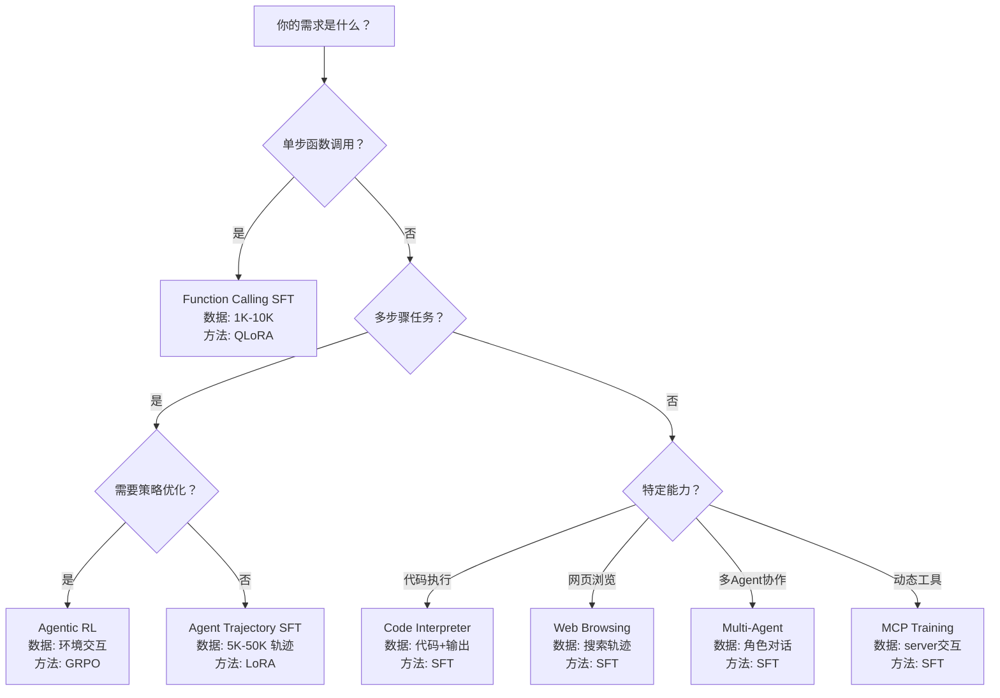

---

## 总结

Tool-Use 和 Agent 微调是 LLM 从"能说"到"能做"的关键跨越。核心要点回顾：

1. **Function Calling SFT** 是基础，500-2000 条高质量数据即可显著提升小模型
2. **数据质量 > 数据数量**，合成数据需要严格的质量过滤
3. **混合训练**防止灾难遗忘，通用数据占 20-30%
4. **Agent 训练**需要完整轨迹，ReAct 格式是主流
5. **RL 微调** (GRPO) 可以进一步优化 Agent 策略，但成本更高
6. **评估**使用 BFCL (function calling) 和 τ-bench (agent) 等专业基准
7. **MCP** 是工具集成的未来标准，值得提前布局

> 更多评估方法详见 [Agentic 评估指南](08_模型评估/02_基准测试/01_Agentic_基准测试_指南.md)，PEFT 方法详见 [PEFT 参数高效微调](./09_PEFT_2026.md)。

---

*Last updated: 2026-06-04*

## 相关链接

- [[05_大模型/06_微调技术/README|微调技术概览]] — 微调技术主题导览
- [[05_大模型/06_微调技术/09_PEFT_2026|PEFT 2026 完全指南]] — Agent 微调常用 PEFT 方法
- [[概念/Agent/function-calling|Function Calling]] — Tool Use 核心机制
- [[概念/Agent/tool-use|Tool Use]] — 工具调用概念卡片
- [[概念/Agent/mcp|Model Context Protocol]] — MCP 训练相关协议
- [[概念/Training/grpo|GRPO]] — Agentic RL 常用对齐方法
