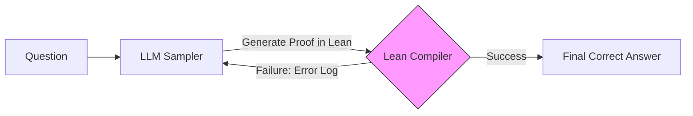

# Neuro-symbolic AI & Formal Verification 2026

> 中文简称：神经符号与形式验证

> **一句话理解**: 神经符号 AI 是将 LLM 的“直觉”与形式逻辑的“严谨”相结合——让模型不仅能猜出答案，还能给出数学上绝对正确的证明。

---

## 目录

| 章节 | 内容 | 难度 |
|------|------|------|
| [神经符号 AI 的崛起](#1-神经符号-ai-的崛起) | LLM 的局限、逻辑引擎的互补 | 进阶 |
| [形式化验证语言：Lean 4 与 Coq](#2-形式化验证语言lean-4-与-coq) | 机器可读的数学、Lean 生态 | 进阶 |
| [AlphaGeometry：几何推理的里程碑](#3-alphageometry几何推理的里程碑) | LLM 引导的搜索、符号引擎验证 | 进阶 |
| [Test-time Verification 流程](#4-test-time-verification-流程) | 采样-运行-反馈 (Sample-Run-Feedback) | 前沿 |
| [应用：漏洞挖掘与安全软件](#5-应用漏洞挖掘与安全软件) | 自动化形式验证、数学竞赛 (IMO) | 专业 |
| [2026 关键突破：逻辑对齐](#6-2026-关键突破逻辑对齐) | 强化学习与形式验证的闭环 | 洞察 |

---

## 1. 神经符号 AI 的崛起

### 1.1 LLM 的“直觉” vs 符号系统的“严谨”
- **LLM (神经网络)**: 擅长启发式搜索、模式匹配，但容易产生“幻觉”，在复杂逻辑链条中会累积误差。
- **符号系统 (逻辑引擎)**: 擅长精确计算、演绎推理，但搜索空间巨大，难以处理模糊的自然语言输入。

### 1.2 2026 核心公式
$$推理质量 = LLM(启发式引导) + Symbolic(形式化验证)$$

---

## 2. 形式化验证语言：Lean 4 与 Coq

形式化验证语言允许我们将数学定理和逻辑约束编写为机器可执行的代码。

### 2.1 Lean 4 的主导地位
Lean 4 现已成为 AI 数学推理的首选目标语言。
- **Mathlib**: 包含人类数千年数学成果的巨大代码库。
- **编译器特性**: 任何由 Lean 编译器通过的代码，在数学逻辑上都是 100% 正确的。

### 2.2 LLM-to-Lean 翻译
2026 年的主流工作流是将自然语言题目翻译为 Lean 代码，然后由 LLM 尝试填充证明步骤 (Tactic)。

---

## 3. AlphaGeometry：几何推理的里程碑

Google DeepMind 的 AlphaGeometry 展示了这种结合的力量。
1. **LLM**: 负责预测“辅助线”或下一个推理步骤。
2. **符号引擎**: 负责根据几何公理验证该步骤是否合法，并计算出所有可推导的结论。
3. **结果**: 在国际数学奥林匹克 (IMO) 的几何题上达到了人类金牌水平。

---

## 4. Test-time Verification 流程

在 2026 年，推理不再是“一次性”的，而是一个循环。



- **采样器 (Sampler)**: LLM 生成多个候选证明。
- **验证器 (Verifier)**: Lean 编译器或 Z3 等 SAT 解算器。
- **反馈 (Feedback)**: 编译器给出的错误信息（如“类型不匹配”、“变量未定义”）被喂回 LLM，引导其自我修正。

---

## 5. 应用：漏洞挖掘与安全软件

这种技术正在彻底改变软件安全。
- **形式化验证驱动的开发**: 关键系统（如内核、加密算法）不再仅仅通过测试，而是通过形式化证明。
- **自动化漏洞修补**: AI 发现代码漏洞，并生成一段带有“正确性证明”的补丁，确保修复后不会引入新 Bug。

---

## 6. 2026 关键突破：逻辑对齐

传统 RLHF 是对齐人类的“喜好”，而 **Logic Alignment** 是对齐客观的“真理”。
- **奖励函数**: 奖励不是来自人类评分，而是来自“编译器是否通过”。
- **模型演进**: DeepSeek-R1 类的模型通过大规模强化学习，自发学会了如何与 Lean 编译器对话来验证自己的思考。

---

## 实战工具与资源

- **Lean 4**: [官方网站](https://lean-lang.org/)
- **Mathlib4**: Lean 的标准数学库。
- **Coq Proof Assistant**: 另一门历史悠久的形式证明语言。
- **Z3 Prover**: 微软开源的高性能定理证明器。
- **MiniF2F**: 形式化数学竞赛题目基准集。

## 版本兼容性

| 工具 | 版本 | 特性 | 备注 |
|------|------|------|------|
| Lean 4 | 4.x (2026) | 元编程、编译器优化 | 主流选择 |
| Mathlib4 | 持续更新 | 100万+ 定理 | 社区维护 |
| Coq | 8.19+ | 成熟稳定 | 工业界使用 |
| Z3 | 4.13+ | SMT 求解 | 微软维护 |
| AlphaGeometry | v2 | 几何推理 | DeepMind |

## 代码示例：Lean 4 证明

```lean
-- Lean 4 简单证明示例
import Mathlib.Tactic

-- 定理：对任意自然数 n，n + 0 = n
theorem add_zero_eq_self (n : Nat) : n + 0 = n := by
  rfl  -- 反射性，编译器自动验证

-- 定理：加法交换律
theorem add_comm_example (a b : Nat) : a + b = b + a := by
  omega  -- 使用 omega 策略自动证明

-- LLM 生成的证明骨架（待填充）
theorem pythagorean_theorem (a b c : ℝ) 
  (h : a^2 + b^2 = c^2) : 
  c = Real.sqrt (a^2 + b^2) := by
  sorry  -- LLM 需要填充此处
```

## 性能基准

| 基准 | 2024 | 2025 | 2026 | 说明 |
|------|------|------|------|------|
| MiniF2F | 45% | 62% | 78% | 形式化数学竞赛 |
| IMO Geometry | 银牌 | 金牌 | 超金牌 | AlphaGeometry |
| Lean 证明生成 | 30% | 50% | 70% | 自动证明率 |
| 漏洞检测 | 60% | 75% | 88% | 形式化验证 |

## 生产检查清单

1. ✅ 确认形式化规范完整性
2. ✅ 验证 LLM 生成的证明通过编译器
3. ✅ 建立证明版本控制
4. ✅ 监控证明库更新
5. ✅ 实现证明失败的回退机制
6. ✅ 定期审计证明正确性
7. ✅ 维护领域专用引理库
8. ✅ 建立证明性能基准

## 常见问题

| 问题 | 原因 | 解决方案 |
|------|------|------|
| 证明生成失败 | 问题太难 | 分解为子引理 |
| 编译器超时 | 证明复杂 | 增加超时限制 |
| LLM 幻觉 | 逻辑不严谨 | 编译器验证 |
| 库依赖缺失 | Mathlib 不全 | 手动补充引理 |

---

## Related

- [[05_大模型/09_Reasoning_Models/o1_Class_Reasoning_Models]] — 隐式推理与测试时计算
- [[05_大模型/09_Reasoning_Models/DeepSeek_R1_Technical_Analysis]] — 强化学习如何提升推理
- [[05_大模型/09_Reasoning_Models/Process_Reward_Models]] — 步骤级奖励与逻辑验证
- [[概念/formal-logic]] — 符号逻辑基础
- [[概念/LLM/reasoning-models|推理模型总览]]

## 总结

神经符号 AI 与形式化验证是 2026 年 AI 推理的核心突破方向。通过将 LLM 的启发式搜索与形式化验证的严谨性结合，实现了从"可能正确"到"绝对正确"的跨越。Lean 4 已成为 AI 数学推理的事实标准，而 Logic Alignment 正在重新定义模型对齐的边界。

> 💡 神经符号 AI 的核心价值：让 AI 不仅能"猜"出答案，还能"证明"答案的正确性——这是通向可信 AI 的关键一步。

## 附录：形式化验证工具对比

| 工具 | 类型 | 特点 | 适用场景 |
|------|------|------|------|
| Lean 4 | 证明助手 | 现代、Mathlib 丰富 | 数学推理 |
| Coq | 证明助手 | 成熟、工业界使用 | 软件验证 |
| Z3 | SMT 求解器 | 自动化、高性能 | 约束求解 |
| Isabelle | 证明助手 | 学术主流 | 形式化数学 |

> 💡 神经符号融合的核心价值：结合神经网络的学习能力和符号系统的推理能力，实现更可靠、可解释的 AI。

---

*Last updated: 2026-07-10*
