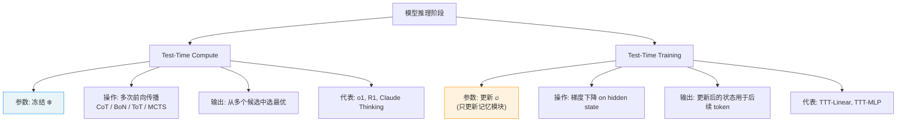
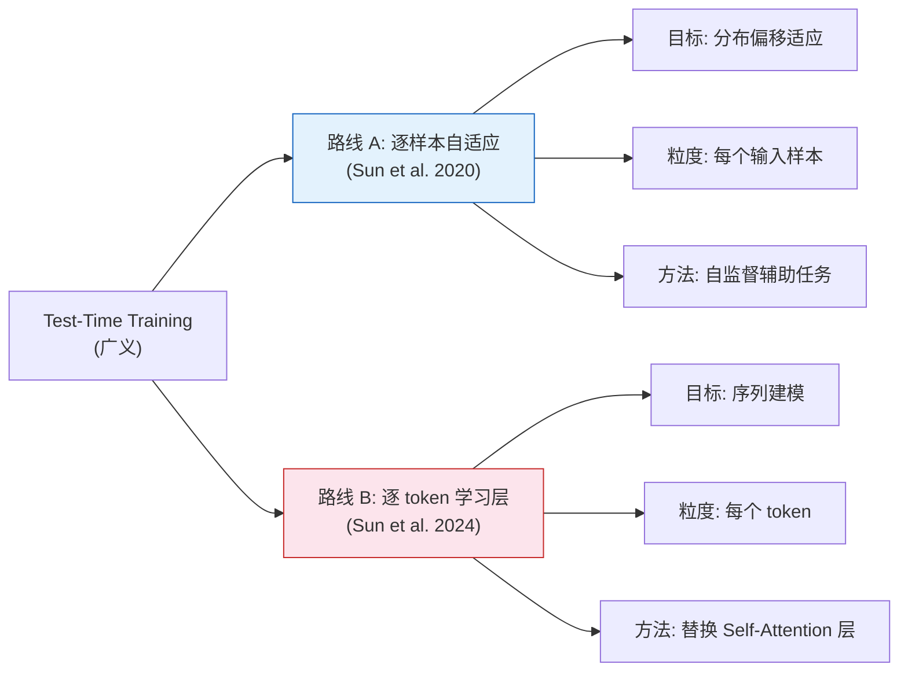
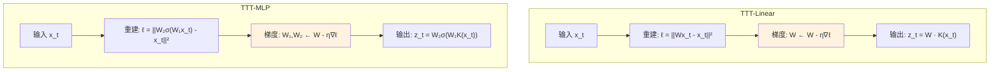
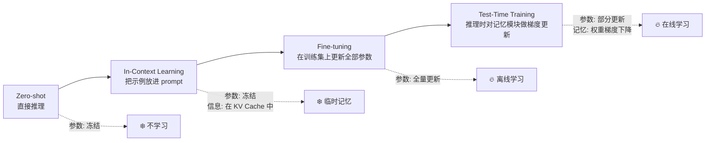
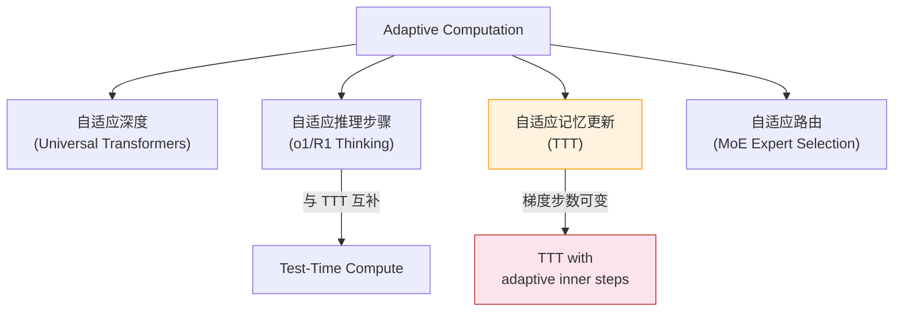

# Test-Time Training: 测试时训练 (TTT 2026)

> 中文简称：Test-Time Training: 测试时训练

> **一句话定位**: Test-Time Training (TTT) 是一种在**推理阶段对模型执行梯度更新**的技术。不同于 Test-Time Compute（o1/R1 式的"多想"而不改参数），TTT 在处理每个 token 或每个样本时，通过对一个内部记忆模块做几步梯度下降，使模型"边推理边学习"。这使隐藏状态从固定的权重变成了**可学习的模型**，极大提升了长序列的表达能力。

---

## 目录

- [1. 概述与动机](#1-概述与动机)
- [2. TTC ≠ TTT：核心区分](#2-ttc--ttt核心区分)
- [3. TTT 的形式化定义](#3-ttt-的形式化定义)
- [4. Sun et al. 2024：TTT Layers](#4-sun-et-al-2024ttt-layers)
- [5. 与 In-Context Learning、Fine-tuning 的对比](#5-与-in-context-learningfine-tuning-的对比)
- [6. 应用场景](#6-应用场景)
- [7. 与 Adaptive Computation 的关系](#7-与-adaptive-computation-的关系)
- [8. 2026 前沿展望](#8-2026-前沿展望)
- [9. Related](#9-related)

---

## 1. 概述与动机

### 1.1 从"固定记忆"到"学习型记忆"

传统 Transformer（Self-Attention）通过 KV Cache 存储序列信息。随着序列变长，KV Cache 线性增长，表达能力受限于固定维度的隐藏状态。Mamba/SSM 用固定大小的压缩状态 $h_t = f(h_{t-1}, x_t)$ 实现线性复杂度，但**压缩瓶颈**导致长程信息丢失。

Test-Time Training 的核心洞察是：**如果隐藏状态本身是一个可学习的模型（而非固定向量），那么它的表达能力将随参数量线性增长。**

```
隐藏状态的三种范式:

1. Transformer / Attention
   隐藏状态 = KV Cache (所有历史 token 的 key-value 对)
   表达力: 完美还原，但内存 O(n) 线性增长

2. RNN / SSM / Mamba
   隐藏状态 = 固定维度向量 s_t
   表达力: 压缩损失，但内存 O(1) 常数
   问题: 信息瓶颈 — 所有历史信息必须压缩到固定维度

3. TTT Layers (Test-Time Training)
   隐藏状态 = 模型权重 W_t (通过梯度下降更新)
   表达力: 随 W 的参数量线性增长
   内存: O(1) 常数 (只存权重)
   核心创新: 隐藏状态从"存储"变成了"模型"
```

### 1.2 为什么需要 TTT

| 痛点 | 现有方法的局限 | TTT 的解决方案 |
|------|--------------|--------------|
| 长序列信息丢失 | RNN/SSM 的固定维度压缩瓶颈 | 用模型权重作为记忆，表达力随参数增长 |
| KV Cache 内存爆炸 | Transformer 长序列需要 TB 级内存 | 固定大小权重，内存 O(1) |
| 模型能力在部署后固化 | 无法适应新分布/新任务 | 推理时实时梯度适应 |
| Fine-tuning 成本高 | 需要 GPU 集群 + 大规模数据 | 在线、轻量、逐样本自适应 |
| In-Context Learning 上下文窗口限制 | 信息量受限于窗口长度 | 记忆不随 token 消失，无窗口约束 |

---

## 2. TTC ≠ TTT：核心区分

> **这是本文最重要的区分**。很多人混淆 Test-Time Compute 和 Test-Time Training，但它们是**完全不同的技术路线**。

### 2.1 概念对照表

| 维度 | Test-Time Compute (TTC) | Test-Time Training (TTT) |
|------|------------------------|--------------------------|
| **代表** | OpenAI o1, DeepSeek-R1 | TTT-Linear / TTT-MLP (Sun et al. 2024) |
| **核心操作** | 生成更多 token（CoT）、多次采样（BoN）、搜索（ToT/MCTS） | 对隐藏状态/记忆模块执行**梯度下降** |
| **是否修改参数** | ❌ 参数完全冻结 | ✅ 推理时进行梯度更新 |
| **改的是什么** | 什么都不改，只是多花计算 | 更新内部记忆模块的权重 |
| **计算开销** | 2× – 1000× 推理 token | 每个 token 几步梯度下降（轻量） |
| **时间粒度** | 每个请求（sample 级） | 每个 token（step 级） |
| **解决的问题** | 复杂推理（数学、代码、逻辑） | 长序列记忆、分布偏移适应 |
| **架构嵌入** | 推理策略层（不改模型结构） | 网络层（替换 Self-Attention） |
| **类比** | "让模型多想一会儿" | "让模型边读边学" |

### 2.2 一图看懂



### 2.3 可以组合使用

TTC 和 TTT 并非互斥。理论上可以：
- 用 TTT Layers 作为序列模型（逐 token 学习）
- 在输出阶段用 TTC（CoT 推理、多次采样）
- 两者叠加：**模型边学边想**

---

## 3. TTT 的形式化定义

### 3.1 通用框架

Test-Time Training 泛指：在推理时基于输入数据对模型进行（通常是轻量的）参数更新。形式化为：

```
给定输入 x_1, x_2, ..., x_t

标准前向传播:
  h_t = f(x_t, h_{t-1})          # 固定权重，仅前向

Test-Time Training:
  W_t = W_{t-1} - η · ∇ℓ(W_{t-1}; x_t)    # 内循环梯度下降
  h_t = f_{W_t}(x_t, h_{t-1})              # 用更新后的权重计算输出

其中:
  W    = 内部记忆模块的权重 (隐藏状态)
  ℓ    = 自监督损失函数
  η    = 学习率 (通常很小)
```

### 3.2 两条技术路线

TTT 在文献中有两个不同的研究方向：



**路线 A（逐样本 TTT）**: Sun et al. 2020 提出。在推理时为每个测试样本训练一个自监督辅助任务（如图像旋转预测），通过该任务的梯度更新模型参数，使其适应该样本的分布。主要用于鲁棒性和分布偏移场景。

**路线 B（逐 token TTT Layers）**: Sun et al. 2024 提出。将 TTT 嵌入为网络层，每个 token 经过时触发一次内循环梯度下降。这是**本文的核心主题**，也是 2025–2026 年最受关注的方向。

### 3.3 数学公式

**路线 A 的损失函数**:

$$
\theta' = \theta - \eta \sum_{t=1}^{T} \nabla_\theta \mathcal{L}_{ss}(g_\theta(x_t))
$$

$$
\hat{y} = f_{\theta'}(x)
$$

其中 $\mathcal{L}_{ss}$ 是自监督损失，$g$ 是辅助网络，$f$ 是主任务网络。

**路线 B（TTT Layer）的内循环**:

$$
W_0 = \text{init}(\text{learnable})
$$

$$
W_t = W_{t-1} - \eta \nabla_W \ell(W_{t-1}; x_t, \theta_{\text{outer}})
$$

$$
z_t = f_{W_t}(\text{KKV conv}(x_t))
$$

其中 $W_t$ 是第 $t$ 个 token 处的记忆权重，$\ell$ 是重建损失，$z_t$ 是该层的输出特征。

---

## 4. Sun et al. 2024：TTT Layers

> 论文: *"Learning to (Learn at Test Time): RNNs with Expressive Memory"* (Sun, Li, Dalal, Xu, Dhiman, Huang, et al., 2024, arXiv:2407.04620)

### 4.1 核心思想

Sun et al. 将 TTT 实现为**序列建模的底层算子**，直接替换 Transformer 中的 Self-Attention 层。

关键设计:
- **隐藏状态 = 模型权重 $W$**: 不再是固定向量，而是一个小模型的权重矩阵
- **内循环 = 梯度下降**: 每个输入 token 触发几步梯度更新
- **输出 = 前向推理**: 用更新后的 $W$ 对当前 token 做前向，得到该层的输出
- **外循环 = 端到端训练**: 整个网络（包括 TTT Layers）通过常规的反向传播训练

### 4.2 从 RNN 视角理解

TTT Layer 可以理解为一种**增强版 RNN**:

```
传统 RNN:
  h_t = σ(W_h · h_{t-1} + U · x_t)     # 固定权重 W_h, U

TTT Layer (将隐藏状态视为模型):
  记忆模块 f_W 是一个小型网络 (线性层或 MLP)
  "隐藏状态" = W (f 的权重)
  
  每个 token x_t:
    1. 自监督重建: ℓ(W; x_t) = ||f_W(x_t) - x_t||²
    2. 梯度更新:   W ← W - η ∇_W ℓ(W; x_t)
    3. 输出:       z_t = f_W(K(x_t))
    
  W 的维度 >> h 的维度 → 表达能力远超传统 RNN
```

这就是"RNNs with Expressive Memory"的含义——隐藏状态从一个固定向量升级为了一个完整的模型权重。

### 4.3 TTT-Linear vs TTT-MLP

论文提出了两种记忆模块变体:

| 特性 | TTT-Linear | TTT-MLP |
|------|-----------|---------|
| **记忆模块 $f_W$** | 单层线性变换 $f_W(x) = Wx$ | 两层 MLP $f_W(x) = W_2 \sigma(W_1 x)$ |
| **参数量** | 较少 | 较多 |
| **表达力** | 中等 | 强 |
| **梯度更新成本** | 低 | 中 |
| **适合场景** | 超长序列 (>32K) | 中长序列 + 需要更强表达 |
| **与 Self-Attention 对比** | 1.3B 模型匹配 Transformer | 更大模型上仍有竞争力 |



### 4.4 TTT-NN：非线性扩展

后续工作 TTT-NN 将记忆模块替换为最近邻检索，结合了 TTT 的梯度学习和检索增强的优势。这种混合方法在需要精确记忆和泛化能力之间取得了更好的平衡。

### 4.5 训练策略：Mini-Batch TTT

朴素的 TTT 对每个 token 做一次梯度更新（序列长度 $n$ → $n$ 次更新），反向传播需要 $O(n)$ 的计算图展开。

**优化: 小批量 TTT (Mini-Batch TTT)**:
- 将 token 序列分成大小为 $b$ 的小批量
- 每个小批量内做几次梯度下降
- 使用对偶形式避免显式展开计算图 → 梯度计算降为 $O(1)$ 复杂度

```
序列: [x_1, x_2, ..., x_n]

Mini-Batch (b=8):
  Batch 1: [x_1..x_8]   → W 更新 1 次 (对 batch 平均梯度)
  Batch 2: [x_9..x_16]  → W 更新 1 次
  ...
  总更新次数: n/b (而非 n)
```

这使得 TTT Layers 在实际训练中效率接近 Self-Attention，同时保持推理时的常数内存。

### 4.6 工程实现要点

```
TTT Layer 伪代码:

class TTTLayer:
    def __init__(self, dim, ttt_type='linear'):
        self.W = init_weights(dim, ttt_type)   # 可学习初始化
        self.eta = learnable_lr()               # 可学习学习率
        self.K = Conv1d(dim, dim)               # 输出投影
        
    def forward(self, x_sequence):
        W = self.W.clone()
        outputs = []
        for x_t in x_sequence:                  # 沿时间步展开
            loss = self.self_supervised_loss(W, x_t)
            grad = autograd.grad(loss, W)
            W = W - self.eta * grad             # 内循环梯度下降
            z_t = self.output_forward(W, x_t)
            outputs.append(z_t)
        return stack(outputs)
```

关键超参数:
- **学习率 $\eta$**: 通常 0.01–0.1，可设置为可学习参数
- **内循环步数**: 通常 1–3 步（多步收益递减）
- **小批量大小 $b$**: 8–32（影响速度与质量的权衡）
- **记忆模块维度**: 通常与模型隐藏维度一致或更大

---

## 5. 与 In-Context Learning、Fine-tuning 的对比

### 5.1 学习范式谱系



### 5.2 四范式深度对比

| 维度 | Zero-shot | In-Context Learning | Fine-tuning | Test-Time Training |
|------|-----------|--------------------|----|---|
| **参数更新** | 无 | 无 | 全量/部分 | 仅记忆模块 |
| **信息存储位置** | 无 | KV Cache (激活值) | 权重 | 记忆模块权重 |
| **记忆持久性** | — | 会话级 (窗口清除即丢失) | 永久 (除非重新训练) | 当前序列 (每序列重置) |
| **上下文窗口限制** | — | 受限于窗口长度 | 无 | 无 (常数内存) |
| **计算开销** | 最低 | 低–中 | 高 (离线) | 中 (在线梯度) |
| **新信息适应速度** | 不适应 | 即时 (放入 prompt) | 需重新训练 | 几步梯度 (快速) |
| **信息容量** | — | ∝ 窗口长度 | ∝ 参数量 | ∝ 记忆模块参数量 |
| **遗忘行为** | — | 窗口外完全遗忘 | 遗忘旧任务 (灾难性) | 可设计 (梯度正则) |

### 5.3 TTT 的独特定位

TTT 填补了 ICL 和 Fine-tuning 之间的空白:

```
                    适应速度
                     ↑
        ICL ●        │
                     │     ● TTT
                     │
                     │
                     │           ● Fine-tuning
                     └──────────────────→ 信息容量
```

- **比 ICL 强**: 不受窗口限制，记忆容量 = 权重参数量
- **比 Fine-tuning 快**: 无需离线训练，逐序列自适应
- **独特优势**: 推理时常数内存，但表达力随记忆模块线性增长

---

## 6. 应用场景

### 6.1 长视频理解

这是 TTT Layers 最有潜力的应用领域。一段 1 小时的视频约有 10 万帧、数百万 token，远超任何 Transformer 的上下文窗口。

```
传统方法的困境:
┌─────────────────────────────────────────────────────────────┐
│  1 小时视频 ≈ 数百万 token                                    │
│                                                             │
│  Transformer:  KV Cache ≈ 数百 GB → 不可行                   │
│  Mamba/SSM:   压缩到固定向量 → 早期画面被遗忘                  │
│  TTT Layer:   逐帧更新记忆权重 → O(1) 内存 + 高表达力         │
└─────────────────────────────────────────────────────────────┘

TTT 的优势:
  - 每帧通过梯度更新压缩进 W
  - 记忆不随帧数增长 (常数内存)
  - 表达力随 W 的参数量线性增长
  - 可检索早期信息 (W 编码了全序列)
```

实际效果: 在 Perplexity (长序列困惑度) 和 needle-in-haystack 检索任务上，TTT-Linear 在 32K+ 序列长度上显著优于 Mamba 和 Transformer。

### 6.2 持续推理 / 流式推理

在 agent / 自主系统的场景中，模型需要持续处理无限长的交互流:


TTT 使模型能够:
- **持续学习**: 不重置，无限处理
- **环境适应**: 自动调整到新环境
- **常数资源**: 不会因序列变长而内存爆炸

### 6.3 分布偏移适应

路线 A（逐样本 TTT）的典型场景:
- **自动驾驶**: 测试时遇到新天气/路况，自监督任务微调适应
- **医学影像**: 不同医院的设备差异，逐样本自适应
- **跨域部署**: 训练域与部署域存在 gap

### 6.4 强化学习中的快速适应

在 RL 中，agent 遇到新环境时需要快速适应。TTT 可以让策略网络在每次 episode 中通过梯度更新快速学习环境动力学，实现 meta-RL 的一些目标但更加自然。

---

## 7. 与 Adaptive Computation 的关系

### 7.1 Adaptive Computation 谱系

Adaptive Computation 指"根据输入难度动态调整计算量"的一类技术:



### 7.2 TTT 作为 Adaptive Computation

TTT 天然具备自适应特性:
- **简单序列**: 少量梯度步即可收敛 → 计算量小
- **复杂序列**: 需要更多梯度步 → 计算量大
- **可设计**: 内循环步数可以根据输入难度动态决定

这与 TTC 的"难题多想"异曲同工，但 TTT 的自适应发生在**参数更新层面**，而 TTC 在**推理路径层面**。

### 7.3 统一视角

```
                     Adaptive Computation
                    /                    \
          参数层面                         推理层面
          (TTT)                           (TTC)
         /        \                      /       \
    内循环步数   记忆模块大小        采样宽度    推理深度
    (1-3步)     (Linear/MLP)        (BoN/SC)   (CoT/ToT)
```

两者最终都指向同一个目标: **让模型在推理时投入与问题难度匹配的计算资源**。

---

## 8. 2026 前沿展望

### 8.1 技术趋势

| 方向 | 当前状态 | 2026 预期 |
|------|---------|----------|
| **TTT-Linear/MLP 规模化** | 实验室验证到 ~1B 参数 | 7B–13B 级别生产可用 |
| **TTT + Attention 混合** | 理论探讨 | 混合架构成为主流（TTT 处理长序列，Attention 处理短序列精细推理） |
| **TTT + TTC 叠加** | 各自独立 | 边学边想: TTT Layer 实时学习 + TTC 深度推理 |
| **视频理解原生 TTT** | 理论优势明确 | 首个基于 TTT 的长视频模型上市 |
| **多模态 TTT** | 文本为主 | 融合视觉/音频 token 的统一 TTT 层 |

### 8.2 挑战

1. **梯度稳定性**: 推理时反复梯度下降可能导致记忆模块"漂移"或"崩溃"
2. **硬件友好性**: 梯度更新的访存模式不如 Attention/SSM 友好，需要定制 kernel
3. **灾难性遗忘**: 长序列中早期信息可能在梯度更新中被覆盖
4. **与 RLHF/对齐的兼容性**: TTT 的在线学习可能与预训练对齐冲突
5. **可解释性**: 记忆权重 W 的变化难以追踪和调试

### 8.3 开放问题

```
2026 年 TTT 领域的关键问题:

Q1: TTT 能否在通用语言建模上全面超越 Attention + SSM 混合架构?
Q2: 多步内循环 (>3 steps) 是否有显著收益? 还是一步足够?
Q3: 记忆模块的最优形式是什么? Linear / MLP / Attention / RNN?
Q4: 如何让 TTT 的梯度更新与 RLHF 对齐兼容?
Q5: TTT 在 100B+ 参数规模上是否仍然有效?
Q6: 能否将 TTT 扩展为"跨会话持久学习" (真正的在线学习)?
```

### 8.4 与已有生态的整合

```
2026 TTT 落地路径预测:

阶段 1 (2025): 研究验证 → 开源原型 (TTT-Linear 开源权重)
阶段 2 (2026 H1): 混合架构 → "TTT 层 + Attention 层" 的混合模型
阶段 3 (2026 H2): 专用场景 → 长视频理解、流式 Agent 产品
阶段 4 (2027):   通用模型 → TTT 成为标准序列建模组件之一
```

---

## 9. Related

### 核心关联

- [[Test_Time_Compute_Scaling_2026|Test-Time Compute Scaling 2026（推理时计算扩展）]] — **最关键的对照页**，系统介绍 TTC（o1/R1 式推理扩展），与本文 TTT 互为补充
- [[../09_Reasoning_Models/Test_Time_Compute_2026|测试时计算 (Test-Time Compute)]] — TTC 的概念入口页

### 序列建模关联

- [[../02_Sequence_Models/Sequence_Models|序列模型深度解析]] — Transformer / RNN / SSM / TTT 的统一视角
- [[../05_LLM_Architectures/Transformer_Alternatives|Transformer 替代架构]] — Mamba / RWKV / RetNet / TTT 等新兴架构对比
- [[../05_LLM_Architectures/Long_Context_Models_2026|长上下文模型 2026]] — TTT 在长序列中的核心应用场景

### 推理与学习关联

- [[../09_Reasoning_Models/o1_Class_Reasoning_Models|o1 类推理模型]] — TTC 的代表，与 TTT 形成对照
- [[../09_Reasoning_Models/DeepSeek_R1_Technical_Analysis|DeepSeek-R1 技术分析]] — RL 驱动的推理模型，推理时计算扩展的另一路线
- [[../07_Fine_tuning_Techniques/PEFT_2026|PEFT 2026（参数高效微调）]] — 另一种"轻量参数更新"范式（离线 vs TTT 的在线）

### 多模态关联

- [[../10_Multimodal_Models/Video_Understanding_Architectures|视频理解架构]] — TTT 在长视频理解中的应用前景

### 参考文献

1. Yu Sun, Xinhao Li, Karan Dalal, et al. "Learning to (Learn at Test Time): RNNs with Expressive Memory." arXiv:2407.04620, 2024.
2. Yu Sun, Xiaolong Wang, et al. "Test-Time Training with Self-Supervision for Generalization under Distribution Shifts." ICML 2020.
3. Karpathy, A. "TTT layers — simple, linear-complexity sequence models that learn at test time." 2024 commentary.
4. Wang, et al. "Mamba: Linear-Time Sequence Modeling with Selective State Spaces." 2023. — TTT 的主要竞争者
5. Gu & Dao. "Mamba-2: Transforming State Space Models." 2024. — 与 TTT 的理论关联（duality）
