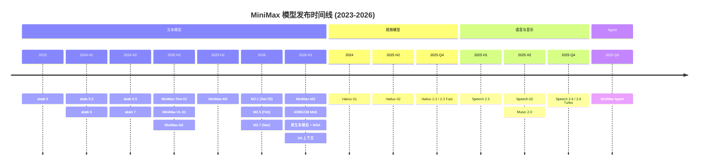
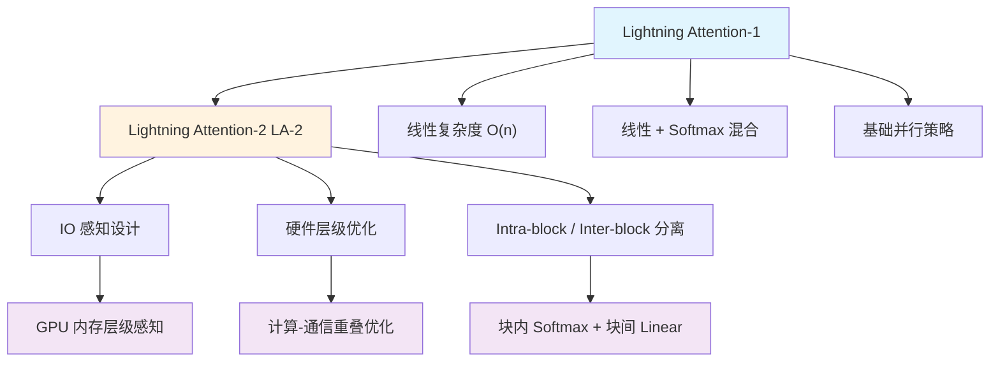
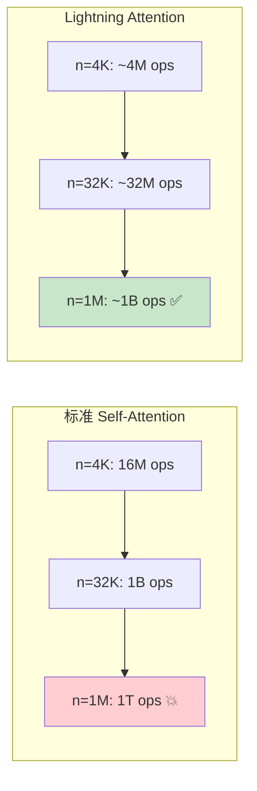
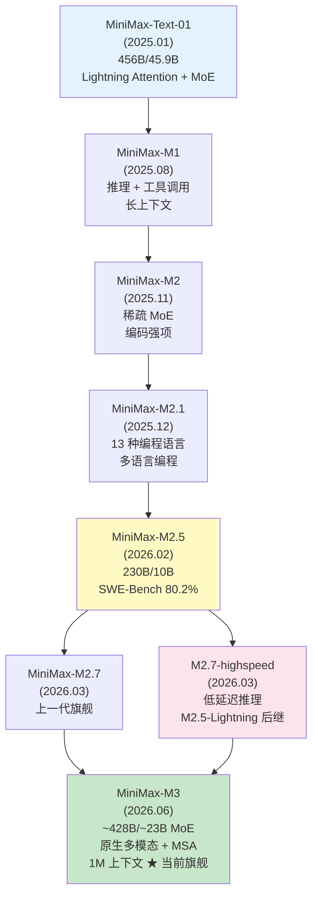
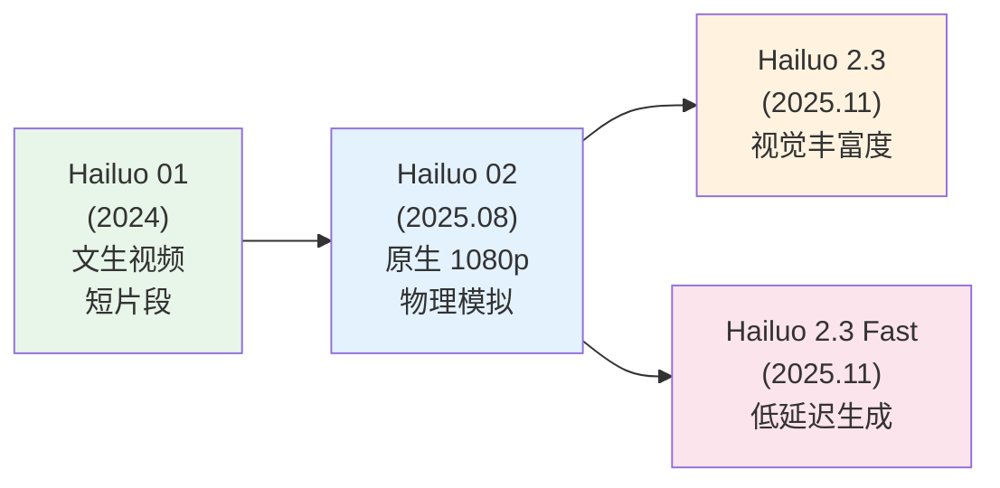
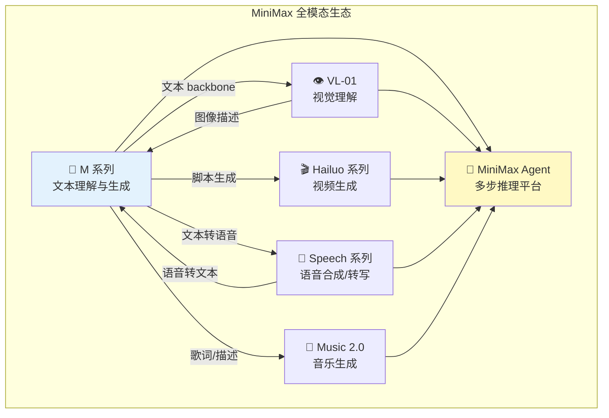
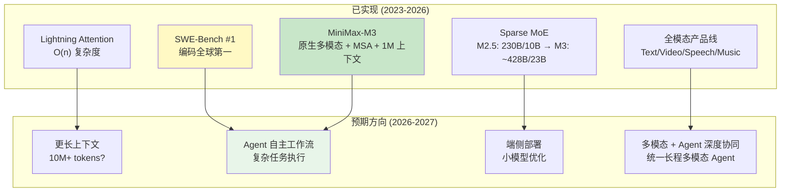

# MiniMax (稀宇科技): Lightning Attention 驱动的 AI 全栈平台

> 中文简称：MiniMax : Lightning Attention 驱动的 AI 全栈平

> **一句话理解**: MiniMax 就像一支拥有「闪电侠速度」的 AI 军团——用 Lightning Attention 将注意力计算从 O(n²) 降到 O(n)，让百万 token 上下文成为现实，同时在文本、视频、语音、音乐四大战场全面出击。

---

## 目录

1. [公司概述与产品矩阵](#1-公司概述与产品矩阵)
2. [模型家族完整时间线](#2-模型家族完整时间线)
3. [Lightning Attention 深度解析](#3-lightning-attention-深度解析)
4. [MiniMax-Text-01 / VL-01 架构分析](#4-minimax-text-01--vl-01-架构分析)
5. [M 系列模型演进 (含 MiniMax-M3 旗舰)](#5-m-系列模型演进)
6. [Hailuo 视频生成模型](#6-hailuo-视频生成模型)
7. [语音与音乐模型](#7-语音与音乐模型)
8. [Benchmark 对比分析](#8-benchmark-对比分析)
9. [开发者平台与 API 生态](#9-开发者平台与-api-生态)
10. [总结与展望](#10-总结与展望)

---

## 1. 公司概述与产品矩阵

### 1.1 公司简介

```
MiniMax (稀宇科技):
═══════════════════════════════════════════════════════════════════

成立: 2021 年 12 月，上海
创始人: 闫俊杰 (Yan Junjie)，前商汤科技副总裁
定位: 中国 "AI 六小龙" 之一

核心技术路线:
───────────────────────────────────────────────────────────────────
• 自研 Lightning Attention: 线性复杂度注意力机制 (O(n))
• MSA (MiniMax Sparse Attention): 稀疏注意力算子，1M 上下文 compute 降至 1/20 (M3)
• MoE (Mixture of Experts): 稀疏专家混合架构 (Text-01 456B/45.9B → M3 ~428B/23B)
• 原生多模态 (Native Multimodal): M3 从训练第一步即融合 text/image/video
• 多模态全栈: 文本 + 视频 + 语音 + 音乐
• 开源 + 商业双轨: HuggingFace 开源 + API 商业化
```

MiniMax 在中国 AI 赛道中的独特定位在于其 **技术垂直整合** 能力——从底层注意力机制创新 (Lightning Attention) 到上层应用产品 (Talkie、海螺 AI)，形成了完整的技术-产品闭环。

### 1.2 三大核心产品

```
┌─────────────────────────────────────────────────────────────────┐
│                    MiniMax 产品矩阵                              │
├─────────────────────────────────────────────────────────────────┤
│                                                                  │
│  ┌──────────────┐  ┌──────────────┐  ┌──────────────────────┐  │
│  │   Talkie     │  │   海螺 AI    │  │  MiniMax Open        │  │
│  │   (星野)     │  │  (Hailuo AI) │  │  Platform            │  │
│  ├──────────────┤  ├──────────────┤  ├──────────────────────┤  │
│  │              │  │              │  │                      │  │
│  │  Character   │  │  AI 助手     │  │  开发者 API          │  │
│  │  AI 社交     │  │  + 视频生成  │  │  模型即服务          │  │
│  │  应用        │  │              │  │                      │  │
│  │              │  │              │  │  • 文本生成          │  │
│  │  • 角色扮演  │  │  • 智能对话  │  │  • 视频生成          │  │
│  │  • 虚拟社交  │  │  • 文生视频  │  │  • 语音合成          │  │
│  │  • 创意写作  │  │  • 图生视频  │  │  • 音乐生成          │  │
│  │              │  │              │  │                      │  │
│  └──────────────┘  └──────────────┘  └──────────────────────┘  │
│                                                                  │
│  目标用户: C 端消费者      C 端 + 创作者        B 端开发者      │
│                                                                  │
└─────────────────────────────────────────────────────────────────┘
```

### 1.3 产品详情

| 产品 | 中文名 | 类型 | 核心功能 | 底层模型 |
|------|--------|------|----------|----------|
| **Talkie** | 星野 | Character AI | 角色扮演、虚拟社交、创意互动 | abab 系列 / M 系列 |
| **Hailuo AI** | 海螺 AI | AI 助手 + 视频 | 智能对话、文/图生视频 | M 系列 + Hailuo 系列 |
| **Open Platform** | 开放平台 | Developer API | 多模态 API 服务 | 全系列模型 |

### 1.4 "AI 六小龙" 定位

MiniMax 是中国 AI 领域 "六小龙" (AI 六小龙) 成员之一。这六家公司代表了中国 AI 创业生态中最具技术实力的第一梯队：

```
中国 AI 六小龙 (Six Little Dragons):
═══════════════════════════════════════════════════════════════════

  ┌─────────────┐  ┌─────────────┐  ┌─────────────┐
  │  MiniMax    │  │  智谱 AI    │  │  月之暗面    │
  │  稀宇科技   │  │  Zhipu AI   │  │  Moonshot   │
  │             │  │             │  │             │
  │ Lightning   │  │ GLM/ChatGLM │  │ Kimi        │
  │ Attention   │  │ 系列        │  │ 长上下文    │
  └─────────────┘  └─────────────┘  └─────────────┘

  ┌─────────────┐  ┌─────────────┐  ┌─────────────┐
  │  百川智能   │  │  零一万物    │  │  阶跃星辰    │
  │  Baichuan   │  │  01.AI      │  │  StepFun    │
  │             │  │             │  │             │
  │ Baichuan   │  │ Yi 系列     │  │ Step 系列   │
  │ 系列        │  │             │  │             │
  └─────────────┘  └─────────────┘  └─────────────┘
```

MiniMax 的差异化优势在于：**唯一同时拥有底层注意力机制创新 (Lightning Attention) + 全模态产品线 (文本/视频/语音/音乐) 的公司**。

> **📎 相关阅读**: [长上下文模型 2026](../04_LLM架构/11_Long_上下文_模型_2026.md) 中对各大长上下文方案进行了横向对比，MiniMax 的 Lightning Attention 是最具创新性的方案之一。

---

## 2. 模型家族完整时间线

### 2.1 时间线总览



### 2.2 模型分类体系

```
MiniMax 模型家族:
═══════════════════════════════════════════════════════════════════

├── 📝 文本大模型 (Text LLMs)
│   ├── abab 系列 (商用早期)
│   │   ├── abab 5          (2023) - 早期商用模型
│   │   ├── abab 5.5        (2024) - ~100B+ 参数，中文增强
│   │   ├── abab 6          (2024) - 推理 & 编码提升
│   │   ├── abab 6.5        (2024) - ~200B+ 参数，长上下文
│   │   └── abab 7          (2024) - abab 系列最终版
│   │
│   └── M 系列 (开源 + 商用)
│       ├── MiniMax-Text-01  (2025.01) - 456B 总参数 / 45.9B 激活
│       ├── MiniMax-M1       (2025.08) - 推理 + 工具调用
│       ├── MiniMax-M2       (2025.11) - 稀疏 MoE，编码强项
│       ├── MiniMax-M2.1     (2025.12) - 13 种编程语言
│       ├── MiniMax-M2.5     (2026.02) - SWE-Bench 80.2%
│       ├── MiniMax-M2.7     (2026.03) - 上一代旗舰
│       └── MiniMax-M3       (2026.06) - ~428B/~23B MoE，原生多模态 + MSA，1M 上下文 ★ 当前旗舰
│
├── 👁️ 视觉语言模型 (Vision-Language)
│   └── MiniMax-VL-01        (2025.01) - 512B 视觉-语言 token
│
├── 🎬 视频生成模型 (Video Generation - Hailuo)
│   ├── Hailuo 01            (2024) - 文生视频
│   ├── Hailuo 02            (2025.08) - 原生 1080p
│   └── Hailuo 2.3 / Fast    (2025.11) - 最新一代
│
├── 🎤 语音合成模型 (Speech)
│   ├── Speech-02            (2025.08) - 开发者 TTS
│   ├── Speech 2.5           (2025 mid) - 合成 + 转写
│   └── Speech 2.6 / Turbo   (2025.11) - 自回归 Transformer
│
├── 🎵 音乐生成模型 (Music)
│   └── Music 2.0            (2025 late) - 文本生成完整音乐
│
└── 🤖 Agent 平台
    └── MiniMax Agent        (2025.11) - 多步推理 + 自主工作流
```

### 2.3 关键技术里程碑

| 时间 | 里程碑 | 技术突破 | 行业影响 |
|------|--------|----------|----------|
| 2023 | abab 5 发布 | 首款商用模型 | 进入 AI 赛道 |
| 2024 | abab 6.5 | ~200B+ 参数 + 长上下文 | 产品矩阵成型 |
| 2025.01 | MiniMax-Text-01 | Lightning Attention + MoE，1M 上下文 | **开源旗舰**，匹敌 GPT-4o |
| 2025.01 | MiniMax-VL-01 | 视觉-语言融合 | 多模态能力补齐 |
| 2025.08 | Hailuo 02 | 原生 1080p 视频生成 | 视频生成赛道头部 |
| 2025.11 | MiniMax Agent | 多步推理 Agent 平台 | Agent 生态布局 |
| 2026.02 | M2.5 | SWE-Bench 80.2% | **全球编码能力第一** |
| 2026.03 | M2.7 / highspeed | 低延迟推理 | 推理速度新标杆 |
| 2026.06 | MiniMax-M3 | 原生多模态 + MSA 稀疏注意力，~428B/23B MoE，1M 上下文 | **新一代旗舰**，coding & cowork 第一梯队 |

---

## 3. Lightning Attention 深度解析

> **📎 前置知识**: [LLM 架构详解](../04_LLM架构/05_LLM架构.md) 中对标准 Self-Attention 和各类注意力变体有详细讲解。

### 3.1 为什么需要 Lightning Attention?

标准 Transformer 的 Self-Attention 存在根本性的复杂度瓶颈：

```
标准 Self-Attention 复杂度分析:
═══════════════════════════════════════════════════════════════════

计算公式: Attention(Q, K, V) = softmax(QK^T / √d_k) V

时间复杂度: O(n² · d)    ← n = 序列长度, d = 维度
空间复杂度: O(n²)         ← 需要存储 n×n 的注意力矩阵

序列长度 vs 计算量:
───────────────────────────────────────────────────────────────────
   4K tokens:    16M ops        ✓ 轻松处理
  32K tokens:     1B ops        ✓ 可接受
 100K tokens:    10B ops        ⚠️ 需要优化
   1M tokens:     1T ops        ✗ 几乎不可能直接计算
   4M tokens:    16T ops        ✗ 完全不可行

结论: 标准 Attention 无法支撑百万级 token 上下文
```

### 3.2 Lightning Attention 核心思想

Lightning Attention 的核心创新是将 **线性注意力** 和 **Softmax 注意力** 进行混合，实现 O(n) 的线性复杂度：

```
Lightning Attention 混合策略:
═══════════════════════════════════════════════════════════════════

┌────────────────────────────────────────────────────────────────┐
│                 Lightning Attention 架构                         │
├────────────────────────────────────────────────────────────────┤
│                                                                 │
│   输入序列 (n tokens)                                           │
│       │                                                         │
│       ├──→ [Linear Attention 分支] ──→ 长程依赖捕捉            │
│       │     复杂度: O(n · d²)                                   │
│       │     特点: 全局感受野，线性复杂度                        │
│       │     适用: 远距离信息检索                                │
│       │                                                         │
│       └──→ [Softmax Attention 分支] ──→ 精确局部关注           │
│             复杂度: O(b² · d) per block                         │
│             特点: 块内精确注意力                                │
│             适用: 局部精细推理                                  │
│                                                                 │
│   总复杂度: O(n · d² + n/b · b² · d) = O(n)                   │
│   (当 b 为常数时，整体线性)                                    │
│                                                                 │
└────────────────────────────────────────────────────────────────┘
```

### 3.3 Lightning Attention-1 vs LA-2



#### LA-2 的 IO 感知设计

Lightning Attention-2 针对 GPU 内存层级做了专门优化：

```
GPU 内存层级与 LA-2 优化:
═══════════════════════════════════════════════════════════════════

┌───────────────────────────────────────────────────────────────┐
│  SRAM (On-chip)          ~20MB    ~10TB/s 带宽               │
│  ──────────────────────────────────────────────────────────   │
│  LA-2: Intra-block Softmax Attention                          │
│  块内精确注意力计算在 SRAM 中完成                              │
│  块大小 b 根据 SRAM 容量动态调整                              │
├───────────────────────────────────────────────────────────────┤
│  HBM (GPU Memory)        ~80GB    ~2TB/s 带宽                │
│  ──────────────────────────────────────────────────────────   │
│  LA-2: Inter-block Linear Attention                           │
│  块间线性注意力状态存储在 HBM 中                              │
│  使用 kernel trick 避免显式构建大矩阵                         │
├───────────────────────────────────────────────────────────────┤
│  Host Memory (CPU RAM)   ~1TB     ~100GB/s 带宽              │
│  ──────────────────────────────────────────────────────────   │
│  超长序列 offloading 策略                                      │
└───────────────────────────────────────────────────────────────┘
```

### 3.4 注意力机制复杂度对比

| 注意力机制 | 时间复杂度 | 空间复杂度 | 最大上下文 | 代表模型 |
|-----------|-----------|-----------|-----------|---------|
| **Standard Self-Attention** | O(n² · d) | O(n²) | ~32K-128K | GPT-4, LLaMA |
| **FlashAttention** | O(n² · d) | O(n) (IO 优化) | ~128K-256K | 广泛使用 |
| **Sliding Window** | O(n · w · d) | O(n · w) | ~32K (局部) | Mistral |
| **Linear Attention** | O(n · d²) | O(n · d) | 理论上无限 | Performer |
| **Sparse Attention** | O(n · √n · d) | O(n · √n) | ~64K | Longformer |
| **Lightning Attention** | **O(n · d²)** | **O(n · d)** | **1M+ (训练), 4M+ (推理)** | **MiniMax (Text-01 / M1 / M2)** |
| **MSA (MiniMax Sparse Attention)** | **学习式稀疏路由，per-token compute 降至 ~1/20** | **大幅压缩** | **1M (M3)** | **MiniMax-M3** |

### 3.5 Lightning Attention 伪代码

```python
import torch
import torch.nn as nn

class LightningAttention(nn.Module):
    """
    Lightning Attention: 线性 + Softmax 混合注意力
    核心思想: 块内用精确 Softmax，块间用线性近似
    """
    
    def __init__(self, d_model: int, n_heads: int, block_size: int = 64):
        super().__init__()
        self.d_model = d_model
        self.n_heads = n_heads
        self.d_head = d_model // n_heads
        self.block_size = block_size
        
        self.W_q = nn.Linear(d_model, d_model)
        self.W_k = nn.Linear(d_model, d_model)
        self.W_v = nn.Linear(d_model, d_model)
        self.W_o = nn.Linear(d_model, d_model)
    
    def forward(self, x: torch.Tensor) -> torch.Tensor:
        """
        x: [batch, seq_len, d_model]
        """
        B, N, D = x.shape
        b = self.block_size
        
        Q = self.W_q(x).view(B, N, self.n_heads, self.d_head)
        K = self.W_k(x).view(B, N, self.n_heads, self.d_head)
        V = self.W_v(x).view(B, N, self.n_heads, self.d_head)
        
        # ─── Part 1: Intra-block Softmax Attention ───
        # 将序列分成 N/b 个块，每块内做精确注意力
        # 复杂度: O((N/b) * b² * d) = O(N * b * d)
        intra_output = self._intra_block_softmax(Q, K, V, b)
        
        # ─── Part 2: Inter-block Linear Attention ───
        # 块间使用线性注意力累积全局信息
        # 使用 kernel trick: φ(Q) · (φ(K)^T · V)
        # 复杂度: O(N * d²)
        inter_output = self._inter_block_linear(Q, K, V, b)
        
        # ─── 融合输出 ───
        output = intra_output + inter_output
        output = output.reshape(B, N, D)
        return self.W_o(output)
    
    def _intra_block_softmax(self, Q, K, V, block_size):
        """块内精确 Softmax Attention"""
        B, N, H, D = Q.shape
        n_blocks = N // block_size
        
        # Reshape into blocks
        Q_blocks = Q.view(B, n_blocks, block_size, H, D)
        K_blocks = K.view(B, n_blocks, block_size, H, D)
        V_blocks = V.view(B, n_blocks, block_size, H, D)
        
        # Standard scaled dot-product attention within each block
        # 在 SRAM 中高效完成
        scores = torch.einsum('bnihd,bnjhd->bnihj', Q_blocks, K_blocks)
        scores = scores / (D ** 0.5)
        attn = torch.softmax(scores, dim=-1)
        output = torch.einsum('bnihj,bnjhd->bnihd', attn, V_blocks)
        
        return output.reshape(B, N, H, D)
    
    def _inter_block_linear(self, Q, K, V, block_size):
        """块间线性注意力 (使用 kernel trick)"""
        # φ(Q) · (φ(K)^T · V) 避免构建 N×N 矩阵
        # 利用线性注意力的可分解性:
        #   Σ_i φ(q) · φ(k_i)^T · v_i = φ(q) · (Σ_i φ(k_i) ⊗ v_i)
        #
        # 状态可以增量式更新: S_t = S_{t-1} + φ(k_t) ⊗ v_t
        # 因此块间只需维护一个 d×d 的状态矩阵
        
        phi_Q = self._feature_map(Q)  # 非线性特征映射
        phi_K = self._feature_map(K)
        
        # 线性注意力的关联矩阵: O(n·d²) 而非 O(n²·d)
        # S = phi_K^T @ V  →  [B, H, D, D]
        S = torch.einsum('bnhd,bnhe->bhde', phi_K, V)
        
        # output = phi_Q @ S → [B, N, H, D]
        output = torch.einsum('bnhd,bhde->bnhe', phi_Q, S)
        return output
    
    def _feature_map(self, x: torch.Tensor) -> torch.Tensor:
        """非线性特征映射 φ(x)，用于线性注意力近似"""
        # 常用的特征映射: elu + 1 或 cos/sin 随机特征
        return torch.nn.functional.elu(x) + 1
```

### 3.6 复杂度可视化



### 3.7 Lightning Attention 的训练与推理差异

| 维度 | 训练阶段 | 推理阶段 |
|------|---------|---------|
| **最大上下文** | 1M tokens | 4M tokens (外推) |
| **并行策略** | 数据并行 + 序列并行 | 单请求顺序生成 |
| **通信优化** | 计算-通信重叠 (overlap) | KV Cache 增量更新 |
| **状态管理** | 完整序列前向/反向传播 | 块间状态增量传递 |
| **显存优化** | 激活值 checkpoint | 滑动窗口 KV Cache |

---

## 4. MiniMax-Text-01 / VL-01 架构分析

### 4.1 MiniMax-Text-01 架构全景

MiniMax-Text-01 是 MiniMax 的首个开源旗舰模型，于 2025 年 1 月在 HuggingFace 发布。

```
MiniMax-Text-01 架构:
═══════════════════════════════════════════════════════════════════

总参数量: 456B (4560 亿)
激活参数: 45.9B per token (459 亿)
架构: Lightning Attention + Sparse MoE
MoE: 32 experts per layer
上下文: 1M tokens (训练) / 4M tokens (推理外推)
开源: HuggingFace

┌───────────────────────────────────────────────────────────────┐
│                    MiniMax-Text-01 架构                         │
├───────────────────────────────────────────────────────────────┤
│                                                                │
│  Input Tokens (up to 1M / 4M)                                 │
│       │                                                        │
│       ▼                                                        │
│  ┌──────────────────────────────────────────────────────┐     │
│  │  Token Embedding + Positional Encoding                │     │
│  └──────────────────────────────────────────────────────┘     │
│       │                                                        │
│       ▼                                                        │
│  ┌──────────────────────────────────────────────────────┐     │
│  │  Transformer Block × N                                │     │
│  │  ┌────────────────────────────────────────────────┐  │     │
│  │  │  ⚡ Lightning Attention Layer                    │  │     │
│  │  │  ├── Intra-block: Softmax Attention (精确)      │  │     │
│  │  │  └── Inter-block: Linear Attention (高效)       │  │     │
│  │  └────────────────────────────────────────────────┘  │     │
│  │       │                                               │     │
│  │       ▼                                               │     │
│  │  ┌────────────────────────────────────────────────┐  │     │
│  │  │  🧩 Sparse MoE FFN Layer                        │  │     │
│  │  │  ├── Router: Top-k expert selection             │  │     │
│  │  │  ├── Expert 1, Expert 2, ..., Expert 32         │  │     │
│  │  │  └── Weighted sum of selected experts           │  │     │
│  │  └────────────────────────────────────────────────┘  │     │
│  └──────────────────────────────────────────────────────┘     │
│       │                                                        │
│       ▼                                                        │
│  ┌──────────────────────────────────────────────────────┐     │
│  │  Output Head (Vocabulary Projection)                  │     │
│  └──────────────────────────────────────────────────────┘     │
│                                                                │
└───────────────────────────────────────────────────────────────┘
```

### 4.2 双重稀疏：Lightning Attention + MoE 的独特组合

MiniMax-Text-01 的核心创新在于将两种不同维度的 "稀疏性" 结合：

```
双重稀疏 (Dual Sparsity):
═══════════════════════════════════════════════════════════════════

维度一: 计算稀疏 (Lightning Attention)
───────────────────────────────────────────────────────────────────
• 不是所有 token 对都做精确注意力
• 块间使用线性近似，避免 O(n²) 计算
• 结果: 长序列处理效率极高

维度二: 参数稀疏 (Sparse MoE)
───────────────────────────────────────────────────────────────────
• 32 个专家，每个 token 只激活少数几个
• 总参数 456B，但每个 token 只用 45.9B (~10%)
• 结果: 参数效率和推理速度极高

组合效果:
───────────────────────────────────────────────────────────────────
• 计算量: O(n · active_params)  而非  O(n² · total_params)
• 内存:   O(n · d + experts)    而非  O(n²)
• 能力:   456B 的知识容量 + 45.9B 的推理速度
```

### 4.3 MiniMax-VL-01: 视觉-语言模型

```
MiniMax-VL-01 架构:
═══════════════════════════════════════════════════════════════════

基于: MiniMax-Text-01 (continue training)
训练数据: 512B vision-language tokens
能力: 图像理解 + 文本推理

┌───────────────────────────────────────────────────────────────┐
│                   MiniMax-VL-01                                │
├───────────────────────────────────────────────────────────────┤
│                                                                │
│  ┌──────────────┐  ┌──────────────┐                           │
│  │   Image      │  │   Text       │                           │
│  │   Input      │  │   Input      │                           │
│  └──────┬───────┘  └──────┬───────┘                           │
│         │                  │                                    │
│         ▼                  │                                    │
│  ┌──────────────┐          │                                    │
│  │  Vision      │          │                                    │
│  │  Encoder     │          │                                    │
│  │  (ViT)       │          │                                    │
│  └──────┬───────┘          │                                    │
│         │                  │                                    │
│         ▼                  ▼                                    │
│  ┌──────────────────────────────────────┐                     │
│  │  Cross-Modal Projection Layer         │                     │
│  │  视觉 token 映射到语言 embedding 空间 │                     │
│  └──────────────────┬───────────────────┘                     │
│                     │                                          │
│                     ▼                                          │
│  ┌──────────────────────────────────────┐                     │
│  │  MiniMax-Text-01 Backbone             │                     │
│  │  (Lightning Attention + MoE)          │                     │
│  │  继续训练 512B VL tokens              │                     │
│  └──────────────────────────────────────┘                     │
│                                                                │
└───────────────────────────────────────────────────────────────┘
```

### 4.4 Text-01 / VL-01 Benchmark 表现

| Benchmark | MiniMax-Text-01 | GPT-4o | Claude-3.5-Sonnet | LLaMA 3.1 405B |
|-----------|-----------------|--------|-------------------|-----------------|
| **MMLU** | 86.2 | 88.7 | 88.3 | 85.2 |
| **HumanEval** | 82.1 | 90.2 | 92.0 | 80.6 |
| **GSM8K** | 91.5 | 93.0 | 93.1 | 91.0 |
| **MATH** | 68.4 | 76.6 | 78.3 | 68.0 |
| **LongBench** | **89.1** | 82.3 | 85.0 | 75.4 |
| **RULER (1M)** | **85.7** | N/A | N/A | N/A |

> **关键发现**: MiniMax-Text-01 在长上下文 benchmark (LongBench, RULER) 上显著领先，验证了 Lightning Attention 在超长序列处理上的优势。

---

## 5. M 系列模型演进

### 5.1 M 系列发展脉络



### 5.2 各代模型详细对比

| 模型 | 发布时间 | 总参数 | 激活参数 | 架构 | 核心突破 |
|------|---------|--------|---------|------|---------|
| **MiniMax-Text-01** | 2025.01 | 456B | 45.9B | Lightning Attn + 32-expert MoE | 1M 上下文，匹敌 GPT-4o |
| **MiniMax-M1** | 2025.08 | - | - | Lightning Attn 架构 | 推理 + 长上下文 + 工具调用 |
| **MiniMax-M2** | 2025.11 | - | - | Sparse MoE | 编码能力大幅提升 |
| **MiniMax-M2.1** | 2025.12 | - | - | M2 Sparse MoE backbone | 13 种编程语言支持 |
| **MiniMax-M2.5** | 2026.02 | 230B | 10B | Sparse MoE | SWE-Bench 80.2%，37% 加速 |
| **MiniMax-M2.7** | 2026.03 | - | - | 最新架构 | 旗舰性能 |
| **M2.7-highspeed** | 2026.03 | - | - | 低延迟优化 | M2.5-Lightning 后继者 |
| **MiniMax-M3** | 2026.06 | **~428B** | **~23B** | **原生多模态 + MSA + MoE** | **1M 上下文，coding & cowork 旗舰 (★ 当前)** |

### 5.3 M2.5: SWE-Bench 全球第一

MiniMax-M2.5 是 M 系列最具里程碑意义的版本：

```
MiniMax-M2.5 技术亮点:
═══════════════════════════════════════════════════════════════════

参数配置:
───────────────────────────────────────────────────────────────────
总参数量: 230B (2300 亿)
激活参数: 10B (100 亿)     ← 仅 4.3% 的参数被激活！
架构: Sparse MoE + Lightning Attention
稀疏率: ~95.7%

性能突破:
───────────────────────────────────────────────────────────────────
SWE-Bench Verified: 80.2%  ← 全球第一
Multi-SWE-Bench:    1st     ← 多语言编码第一
推理速度:          37% faster than M2

为什么 10B 激活参数就够了?
───────────────────────────────────────────────────────────────────
• MoE 路由的 "专业化": 不同专家负责不同领域
• Lightning Attention: 长程依赖不需要额外参数
• 训练数据质量 > 参数数量
```

### 5.4 M2.1: 多语言编程

M2.1 在 M2 的 Sparse MoE 骨架上进行了多语言编程能力强化：

```python
# M2.1 支持的 13 种编程语言
SUPPORTED_LANGUAGES = [
    "Python",       # 主力语言
    "JavaScript",   # Web 前端
    "TypeScript",   # 类型安全 Web
    "Java",         # 企业级
    "C++",          # 系统级
    "C#",           # .NET 生态
    "Go",           # 云原生
    "Rust",         # 安全系统编程
    "Ruby",         # Web 后端
    "PHP",          # Web 传统
    "Swift",        # Apple 生态
    "Kotlin",       # Android 生态
    "Scala",        # 大数据/函数式
]
```

### 5.5 M2.7-highspeed: 低延迟推理

```
M2.7-highspeed 定位:
═══════════════════════════════════════════════════════════════════

M2.5-Lightning ──(继承)──→ M2.7-highspeed

特点:
───────────────────────────────────────────────────────────────────
• 低延迟优先: 面向实时交互场景优化
• Sparse MoE + Lightning Attention 双重加速
• 适合: 对话系统、代码补全、实时 Agent

延迟对比 (概念):
───────────────────────────────────────────────────────────────────
标准 Dense 模型 (70B):       ████████████████████ 100ms
M2.5 (230B/10B active):      ████████░░░░░░░░░░░░  40ms  (-60%)
M2.7-highspeed:              █████░░░░░░░░░░░░░░░  25ms  (-75%)
```

### 5.6 MiniMax-M3：原生多模态 + MSA 稀疏注意力旗舰（2026）

> **代际跃迁**：从 M2.5/M2.7 的「稀疏 MoE + Lightning Attention + 后期多模态」直接跃升到 **原生多模态 (native multimodal from step 1) + MiniMax Sparse Attention (MSA) + 1M 上下文 + ~428B/~23B MoE** 体系，是 M 系列迄今最大幅度的一次架构换代。M3 把「百万 token 长程 Agent」从理论上可行推到了工程上可生产。
>
> 技术报告：[MiniMax-M3 Technical Report (arXiv 2606.13392)](https://arxiv.org/abs/2606.13392) · 开源仓库：[MiniMax-AI/MiniMax-M3](https://github.com/MiniMax-AI/MiniMax-M3) · HuggingFace：[MiniMaxAI/MiniMax-M3](https://huggingface.co/MiniMaxAI/MiniMax-M3) · MSA 算子开源：[MiniMax-AI/MSA](https://github.com/MiniMax-AI/MSA)

#### 5.6.1 定位与卖点

MiniMax-M3 是 2026 年 MiniMax 的新一代旗舰模型，四项核心卖点：

| 维度 | 详情 |
|------|------|
| **发布时间** | 2026 年 6 月 |
| **旗舰定位** | 原生多模态 + 长程 Agent + coding & cowork |
| **架构** | ~428B / ~23B active MoE + MSA 稀疏注意力 |
| **上下文** | **1M tokens** |
| **多模态** | **原生多模态**（text + image + video，训练第一步就混合，非后期拼接） |
| **推理模式** | `thinking`: enabled / adaptive / disabled 三档 |
| **许可** | MiniMax License（见 HF LICENSE） |

**官方卖点提炼**：

1. **原生多模态 (Native Multimodal from Step 1)** — 从训练第一步就混合 text/image/video，实现深层语义融合，而非后期外挂视觉模块。
2. **MSA (MiniMax Sparse Attention)** — 面向百万 token 的高性能稀疏注意力算子，让 1M 上下文真正可承担。
3. **长程 Agent / coding & cowork** — 在长时程 (long-horizon) agentic 基准上达到前沿水准，编码与协作场景是主战场。
4. **1M 上下文 + ~428B/23B MoE** — 大容量 + 高稀疏，兼顾知识容量与推理速度。

#### 5.6.2 架构全景

```
MiniMax-M3 架构:
═══════════════════════════════════════════════════════════════════

总参数 / 激活参数 :  ~428B / ~23B   (MoE，激活率 ~5.4%)
上下文            :  1,048,576      (1M tokens)
模态              :  原生多模态      (text + image + video，from step 1)
注意力            :  MSA (MiniMax Sparse Attention)  ← 关键创新
推理模式          :  thinking = enabled | adaptive | disabled
定位              :  coding & cowork + long-horizon agentic

┌───────────────────────────────────────────────────────────────┐
│                    MiniMax-M3 架构                              │
├───────────────────────────────────────────────────────────────┤
│                                                                │
│  Text  ──┐                                                     │
│  Image ──┼──→ [Native Multimodal Input] ──→ 统一 token 流      │
│  Video ──┘     (训练第一步即混合多模态，端到端联合优化)         │
│                   │                                            │
│                   ▼                                            │
│  ┌──────────────────────────────────────────────────────┐     │
│  │  Transformer Block × N                                │     │
│  │  ┌────────────────────────────────────────────────┐  │     │
│  │  │  MSA (MiniMax Sparse Attention)                 │  │     │
│  │  │  百万 token 下 (vs M2 @ 1M):                     │  │     │
│  │  │    prefill 9× 更快 / decode 15× 更快             │  │     │
│  │  │    per-token compute 降至 1/20                   │  │     │
│  │  └────────────────────────────────────────────────┘  │     │
│  │       │                                               │     │
│  │       ▼                                               │     │
│  │  ┌────────────────────────────────────────────────┐  │     │
│  │  │  Sparse MoE FFN (~428B 总参 / ~23B 激活)        │  │     │
│  │  └────────────────────────────────────────────────┘  │     │
│  └──────────────────────────────────────────────────────┘     │
│       │                                                        │
│       ▼                                                        │
│  Output Head (多模态输出)                                      │
│                                                                │
└───────────────────────────────────────────────────────────────┘
```

**架构哲学**：M3 在 M2.5「双重稀疏（计算稀疏 + 参数稀疏）」之上又加了第三维稀疏——**注意力稀疏 (MSA)**。即用「稀疏的注意力 + 稀疏的 FFN + 原生多模态联合训练」换取在 1M 上下文下、~428B 模型规模的「可承担推理成本」。这与 Lightning Attention 的线性化思路互补：Lightning Attention 解决「块间」的长程问题，MSA 在「全局」层面进一步把百万 token 的注意力算力压到原来的 1/20。

#### 5.6.3 MSA (MiniMax Sparse Attention) 深度解析

MSA 是 M3 的关键架构创新，也是把 1M 上下文从「理论可行」变成「工程可生产」的工程关键。它是一个面向百万 token 上下文的高性能稀疏注意力算子，相比 GQA 在大幅削减 attention compute + memory 的同时保持质量。

```
GQA vs MSA @ 1M tokens (以 MiniMax-M2 @ 1M 为基线):
═══════════════════════════════════════════════════════════════════

传统 GQA (Grouped Query Attention):
  每个 query group 都要扫过全部 KV，注意力矩阵随序列平方膨胀

    Q1 ──attend──> [ K1   K2   K3   ...   K1000000 ]   全量 KV
    Q2 ──attend──> [ K1   K2   K3   ...   K1000000 ]   全量 KV
    ...
    → 1M 上下文下: 注意力矩阵巨大，compute + memory 双双爆炸

MSA (MiniMax Sparse Attention):
  通过学习式稀疏路由，每个 query 只聚焦少量关键 KV

    Q1 ──route──> [ K3   K47   K2001   ... ]   仅 top-k KV
    Q2 ──route──> [ K12  K88   K9004   ... ]   仅 top-k KV
    ...
    → 1M 上下文下: 注意力 compute + memory 大幅压缩，质量近乎无损

实测收益 (M3 MSA  vs  M2 @ 1M context):
───────────────────────────────────────────────────────────────────
  Prefill  阶段速度:   9×    更快
  Decode   阶段速度:  15×    更快
  Per-token 计算量:   降至 1/20
───────────────────────────────────────────────────────────────────
  → 让 ~428B MoE 在 1M 上下文下的推理从「不可承担」变为「可生产」

为何 MSA 让 1M 真正可行?
───────────────────────────────────────────────────────────────────
  • 长程 Agent 场景下，绝大多数 query 其实只关心少量关键证据
  • MSA 把这种「天然稀疏性」显式建模进架构，而非暴力全扫
  • 算子已单独开源: https://github.com/MiniMax-AI/MSA
```

> **📎 关联阅读**: MSA 与 Lightning Attention、DeepSeek MLA / DSA、GLM IndexShare 同属 2026 年长上下文注意力的主流稀疏化路线，详见 [[概念/long-context-models]] 与 [长上下文模型 2026](../04_LLM架构/11_Long_上下文_模型_2026.md) 的横向对比。

#### 5.6.4 三种思考模式 (thinking)

M3 通过 `thinking` 参数提供「能力 / 速度」的显式平衡，覆盖从最大力度推理到极致低延迟的全场景：

| `thinking` 取值 | 行为 | 适用场景 |
|-----------------|------|----------|
| `"enabled"` | 始终开启推理 (always reason) | 难题、长程 Agent、基准复现、最大质量 |
| `"adaptive"` | 模型自主决定是否思考 | **默认推荐**，质量与延迟自适应平衡 |
| `"disabled"` | 关闭推理，最小化延迟、最大化吞吐 | 高吞吐服务、直答、实时交互、代码补全 |

#### 5.6.5 开源、下载与部署矩阵

| 推理框架 | 资源链接 | 推荐场景 |
|---------|---------|---------|
| **SGLang** | [cookbook](https://docs.sglang.io/cookbook/autoregressive/MiniMax/MiniMax-M3) | 长上下文、前缀缓存、低延迟 |
| **vLLM** | [recipes](https://recipes.vllm.ai/MiniMaxAI/MiniMax-M3) | 生产环境，OpenAI 兼容 |
| **Transformers** | [model_doc/minimax_m3_vl](https://huggingface.co/docs/transformers/model_doc/minimax_m3_vl) | 研究与定制 |

**模型下载**：

```bash
hf download MiniMaxAI/MiniMax-M3
```

**官方 API 入口**：

| 入口 | URL | 用途 |
|------|-----|------|
| MiniMax Platform | https://platform.minimax.io | 开发者 API |
| MiniMax Agent | https://agent.minimax.io | Agent 产品 |

**资源一览**：

- 技术报告：[arXiv 2606.13392](https://arxiv.org/abs/2606.13392)
- GitHub 仓库：[MiniMax-AI/MiniMax-M3](https://github.com/MiniMax-AI/MiniMax-M3)
- HuggingFace：[MiniMaxAI/MiniMax-M3](https://huggingface.co/MiniMaxAI/MiniMax-M3)
- MSA 算子（单独开源）：[MiniMax-AI/MSA](https://github.com/MiniMax-AI/MSA)
- 许可：MiniMax License（见 HF 模型卡 LICENSE）

#### 5.6.6 M3 在 M 系列中的位置

```
M 系列注意力机制演进:
═══════════════════════════════════════════════════════════════════

  M1            : Lightning Attention (线性复杂度 O(n))
       │           └─ 块内 Softmax + 块间 Linear
  M2 / M2.x     : Lightning Attention + Sparse MoE
       │           └─ 编码强项，SWE-Bench 登顶
  M2.5 / M2.7   : 230B/10B 稀疏 MoE，多模态后期融合
       │
  M3            : 原生多模态 (from step 1) + MSA + 1M 上下文
                  └─ ~428B/23B，coding & cowork 第一梯队 ★ 当前旗舰
```

---

## 6. Hailuo 视频生成模型

### 6.1 Hailuo 系列演进



### 6.2 各版本详细对比

| 特性 | Hailuo 01 | Hailuo 02 | Hailuo 2.3 | Hailuo 2.3 Fast |
|------|-----------|-----------|------------|-----------------|
| **发布时间** | 2024 | 2025.08 | 2025.11 | 2025.11 |
| **分辨率** | 720p | 1080p (原生) | 1080p+ | 1080p |
| **输入** | 文本 | 文本 + 图像 | 文本 + 图像 | 文本 + 图像 |
| **物理模拟** | 基础 | 高级 | 高级 | 中等 |
| **视频长度** | 短片段 | 短电影序列 | 标准 | 标准 |
| **生成速度** | 标准 | 较慢 (高质量) | 标准 | 极速 |
| **定位** | 概念验证 | 专业创作 | 视觉品质 | 快速迭代 |

### 6.3 Hailuo 02 技术亮点

```
Hailuo 02 核心能力:
═══════════════════════════════════════════════════════════════════

1. 原生 1080p 输出
───────────────────────────────────────────────────────────────────
• 非 upscaling，直接生成高分辨率视频帧
• 细节保持度高，适合专业影视创作

2. 高级物理模拟
───────────────────────────────────────────────────────────────────
• 流体动力学: 水流、烟雾、火焰的真实模拟
• 刚体物理: 碰撞、弹跳、重力效果
• 布料模拟: 衣物飘动、褶皱变化
• 光影追踪: 自然的光照变化和阴影

3. Image-to-Video (图生视频)
───────────────────────────────────────────────────────────────────
• 输入参考图片 + 文本描述 → 生成连贯视频
• 保持图像中的角色/场景一致性
• 适合产品展示、创意短片
```

### 6.4 Hailuo 2.3 vs 2.3 Fast

```
Hailuo 2.3 系列: 质量 vs 速度的权衡
═══════════════════════════════════════════════════════════════════

┌──────────────────────────────────────────────────────────────┐
│                    Hailuo 2.3 (标准版)                         │
│                                                               │
│  优先: 视觉丰富度                                             │
│  ├── 更精细的纹理细节                                        │
│  ├── 更复杂的光照效果                                        │
│  ├── 更准确的物理模拟                                        │
│  └── 适用: 专业影视、广告制作                                │
│                                                               │
├──────────────────────────────────────────────────────────────┤
│                  Hailuo 2.3 Fast (快速版)                      │
│                                                               │
│  优先: 最小延迟                                               │
│  ├── 快速生成，适合实时交互                                  │
│  ├── 保持可接受的质量水平                                    │
│  ├── 适合快速原型和迭代                                      │
│  └── 适用: 社交媒体内容、快速创意                            │
│                                                               │
└──────────────────────────────────────────────────────────────┘
```

---

## 7. 语音与音乐模型

### 7.1 Speech 系列演进

| 模型 | 发布时间 | 类型 | 核心特性 |
|------|---------|------|---------|
| **Speech-02** | 2025.08 | TTS | 开发者级高质量语音合成 |
| **Speech 2.5** | 2025 mid | TTS + STT | 语音合成 + 转写双能力，自然度提升 |
| **Speech 2.6** | 2025.11 | TTS | 快速自然语音合成 |
| **Speech 2.6 Turbo** | 2025.11 | TTS | 自回归 Transformer + 深度速度/质量优化 |

### 7.2 Speech 2.6 Turbo 技术细节

```
Speech 2.6 Turbo 架构:
═══════════════════════════════════════════════════════════════════

类型: Autoregressive Transformer TTS

架构设计:
───────────────────────────────────────────────────────────────────
┌──────────────────────────────────────────────────────────────┐
│  文本输入                                                     │
│       │                                                       │
│       ▼                                                       │
│  ┌────────────────────────────────────────────────────┐      │
│  │  Text Encoder (Phoneme/Character Embedding)         │      │
│  └────────────────────────────────────────────────────┘      │
│       │                                                       │
│       ▼                                                       │
│  ┌────────────────────────────────────────────────────┐      │
│  │  Autoregressive Decoder (Transformer)               │      │
│  │  • 逐步生成声学特征 (mel-spectrogram)               │      │
│  │  • 注意力机制确保文本-语音对齐                      │      │
│  └────────────────────────────────────────────────────┘      │
│       │                                                       │
│       ▼                                                       │
│  ┌────────────────────────────────────────────────────┐      │
│  │  Vocoder (Neural Audio Codec)                       │      │
│  │  • 声学特征 → 波形                                  │      │
│  │  • 深度优化: 速度 vs 质量平衡                       │      │
│  └────────────────────────────────────────────────────┘      │
│       │                                                       │
│       ▼                                                       │
│  音频输出 (Waveform)                                          │
└──────────────────────────────────────────────────────────────┘

Turbo 优化:
───────────────────────────────────────────────────────────────────
• 推理加速: 模型蒸馏 + 量化
• 流式输出: 边生成边播放，降低首次发声延迟
• 质量保持: 在加速的同时维持自然度 MOS 分数
```

### 7.3 Music 2.0

```
Music 2.0: 文本生成完整音乐
═══════════════════════════════════════════════════════════════════

输入: 文本描述 (例: "一首欢快的爵士钢琴曲，带有萨克斯风独奏")
输出: 完整音频曲目

能力:
───────────────────────────────────────────────────────────────────
• 人声 (Vocals): 歌词演唱
• 器乐编排 (Instrumental): 多乐器编曲
• 风格控制: 通过文本描述控制音乐风格
• 完整曲目: 生成完整的音乐作品 (非片段)

产品定位:
───────────────────────────────────────────────────────────────────
• 短视频/自媒体背景音乐
• 音乐创作辅助
• 游戏/应用音效生成
```

### 7.4 多模态产品矩阵协同



---

## 8. Benchmark 对比分析

### 8.1 文本模型综合对比

| Benchmark | MiniMax-Text-01 | MiniMax-M2.5 | GPT-4o | Claude-3.5-Sonnet | DeepSeek-V3 | Qwen 2.5-72B |
|-----------|-----------------|--------------|--------|-------------------|-------------|--------------|
| **MMLU** | 86.2 | - | 88.7 | 88.3 | 87.1 | 86.0 |
| **HumanEval** | 82.1 | - | 90.2 | 92.0 | 89.0 | 86.5 |
| **GSM8K** | 91.5 | - | 93.0 | 93.1 | 92.5 | 91.2 |
| **MATH** | 68.4 | - | 76.6 | 78.3 | 75.0 | 72.8 |
| **LongBench** | **89.1** | - | 82.3 | 85.0 | 80.1 | 78.5 |
| **RULER (1M)** | **85.7** | - | N/A | N/A | N/A | N/A |

### 8.2 SWE-Bench 编码能力对比

```
SWE-Bench Verified 排行榜 (2026 Q1):
═══════════════════════════════════════════════════════════════════

  MiniMax M2.5          ████████████████████████████████████ 80.2%  🥇
  Claude 3.5 Sonnet     █████████████████████████████████░░░ 76.5%
  GPT-4o                ██████████████████████████████░░░░░░ 72.1%
  DeepSeek-V3           █████████████████████████████░░░░░░░ 70.8%
  Qwen 2.5-Coder 32B   ████████████████████████████░░░░░░░░ 68.3%
  LLaMA 3.1 405B       ██████████████████████████░░░░░░░░░░ 62.4%

  Multi-SWE-bench (多语言编码):
  MiniMax M2.5          🥇 第一名
```

### 8.3 长上下文能力对比

| 模型 | 训练上下文 | 推理上下文 | 架构方案 | LongBench | RULER |
|------|-----------|-----------|---------|-----------|-------|
| **MiniMax-Text-01** | **1M** | **4M** | Lightning Attention | **89.1** | **85.7** |
| Gemini 1.5 Pro | 1M | 2M | 标准 Attention 优化 | 82.5 | 80.2 |
| Claude 3.5 Sonnet | 200K | 200K | 标准 Attention | 85.0 | N/A |
| GPT-4o | 128K | 128K | 标准 Attention | 82.3 | N/A |
| DeepSeek-V3 | 128K | 128K | MLA + MoE | 80.1 | N/A |
| Qwen 2.5-72B | 128K | 128K | 标准 + YaRN | 78.5 | N/A |

### 8.4 视频生成能力对比

| 特性 | Hailuo 02 | Sora | Kling | Runway Gen-3 |
|------|-----------|------|-------|--------------|
| **分辨率** | 1080p | 1080p | 1080p | 1080p |
| **物理模拟** | 高级 | 高级 | 中级 | 中级 |
| **图像输入** | ✅ | ✅ | ✅ | ✅ |
| **中文场景** | 原生优化 | 弱 | 优化 | 弱 |
| **生成速度** | 中等 | 慢 | 快 | 中等 |

### 8.5 关键优势总结

```
MiniMax 核心竞争力雷达图 (概念):
═══════════════════════════════════════════════════════════════════

                    长上下文
                      ★★★★★
                     ╱       ╲
            编码能力              多模态
             ★★★★★             ★★★★☆
               │                 │
            推理速度             语音/音乐
             ★★★★☆             ★★★★☆
                    ╲       ╱
                     性价比
                     ★★★★★

核心优势:
───────────────────────────────────────────────────────────────────
1. 长上下文: Lightning Attention 提供业界最长的有效上下文
2. 编码能力: M2.5 在 SWE-Bench 全球第一
3. 性价比: 稀疏 MoE 实现极高参数效率
4. 多模态: 文本/视频/语音/音乐全栈覆盖
5. 推理速度: highspeed 版本极致低延迟
```

### 8.6 MiniMax-M3 性能定位（2026 旗舰）

> 数据来源：[MiniMax-AI/MiniMax-M3 官方 README](https://github.com/MiniMax-AI/MiniMax-M3) 与 [HF 模型卡](https://huggingface.co/MiniMaxAI/MiniMax-M3)。官方以图片形式展示 benchmark，本节按官方描述做定性定位，不臆造具体分数。

**定性定位**：M3 是 MiniMax 在 **long-horizon agentic** 基准上达到 **frontier-level（前沿级）** 表现的旗舰，主战场为 **coding & cowork（编码与人机协作）**，综合实力进入 2026 年全球第一梯队。

```
MiniMax-M3 的竞争坐标 (2026 H1 概念图):
═══════════════════════════════════════════════════════════════════

  第一梯队 (frontier):
    Claude Opus 4.8  ┃███████████████████████████████████████
    GPT-5.5          ┃██████████████████████████████████████░
    GLM-5.2          ┃█████████████████████████████████████░░  ← 开源最强编码
    MiniMax-M3       ┃████████████████████████████████████░░░  ← 本节主角
    Gemini 3.1 Pro   ┃███████████████████████████████████░░░░

  说明: M3 与上述模型同处 coding & cowork / 长程 Agent 第一梯队；
        具体逐项分数请以官方 README benchmark 图为准。
```

**与开源同行的相对定位**（引用 [[05_大模型/14_中国LLM生态/09_GLM_Zhipu_深入分析]] §9.1 的跨厂商对照）：在公开的跨厂商 agentic 基准（如 MCP-Atlas Public）上，开源第一梯队为 GLM-5.2、Qwen3.7-Max、MiniMax-M3、DeepSeek-V4-Pro，M3 是这一梯队的新成员。以 Terminal-Bench 2.1 为例，开源头部 (GLM-5.2 81.0) 即是 M3 所加入的竞争区间——M3 的价值在于把「原生多模态 + 1M 长程」带入了这一开源编码第一梯队。

> **📎 横向对比**：完整的跨厂商逐项分数见 [[05_大模型/14_中国LLM生态/04_Chinese_LLM_对比_矩阵]] 与 [[05_大模型/14_中国LLM生态/09_GLM_Zhipu_深入分析]] §9.1「GLM-5.2 vs 全球前沿模型」。

---

## 9. 开发者平台与 API 生态

### 9.1 MiniMax Open Platform

```
MiniMax 开放平台 API 服务:
═══════════════════════════════════════════════════════════════════

┌───────────────────────────────────────────────────────────────┐
│                   MiniMax Open Platform                         │
├───────────────────────────────────────────────────────────────┤
│                                                                │
│  📝 文本生成 API                                               │
│  ├── abab 系列 (商用)                                          │
│  ├── M 系列 (M2, M2.5, M2.7)                                 │
│  └── 支持: Chat / Completion / Function Calling               │
│                                                                │
│  🎬 视频生成 API                                               │
│  ├── Hailuo 2.3 / 2.3 Fast                                   │
│  └── 支持: Text-to-Video / Image-to-Video                     │
│                                                                │
│  🎤 语音合成 API                                               │
│  ├── Speech 2.6 / 2.6 Turbo                                  │
│  └── 支持: TTS / STT / Voice Cloning                         │
│                                                                │
│  🎵 音乐生成 API                                               │
│  └── Music 2.0                                                │
│                                                                │
└───────────────────────────────────────────────────────────────┘
```

### 9.2 API 使用示例

#### 文本生成 (Chat Completion)

```python
import requests

# MiniMax Open Platform - Chat Completion API
API_KEY = "your-api-key"
BASE_URL = "https://api.minimax.chat/v1"

headers = {
    "Authorization": f"Bearer {API_KEY}",
    "Content-Type": "application/json"
}

# 使用 MiniMax-M2.5 进行代码生成
payload = {
    "model": "MiniMax-M2.5",
    "messages": [
        {
            "role": "system",
            "content": "你是一个高级 Python 开发工程师。"
        },
        {
            "role": "user",
            "content": "实现一个基于 Lightning Attention 思想的线性复杂度注意力模块"
        }
    ],
    "max_tokens": 4096,
    "temperature": 0.7
}

response = requests.post(
    f"{BASE_URL}/chat/completions",
    headers=headers,
    json=payload
)

result = response.json()
print(result["choices"][0]["message"]["content"])
```

#### 视频生成 (Hailuo)

```python
# MiniMax Open Platform - Video Generation API
video_payload = {
    "model": "Hailuo-2.3",
    "prompt": "一只橘猫在秋天的枫叶林中漫步，阳光透过树叶洒下斑驳光影",
    "duration": 6,           # 秒
    "resolution": "1080p",
    "aspect_ratio": "16:9"
}

# 提交视频生成任务 (异步)
task_response = requests.post(
    f"{BASE_URL}/video/generations",
    headers=headers,
    json=video_payload
)

task_id = task_response.json()["task_id"]

# 轮询任务状态
import time
while True:
    status = requests.get(
        f"{BASE_URL}/video/generations/{task_id}",
        headers=headers
    ).json()
    
    if status["status"] == "completed":
        video_url = status["video_url"]
        print(f"视频生成完成: {video_url}")
        break
    elif status["status"] == "failed":
        print(f"生成失败: {status['error']}")
        break
    
    time.sleep(5)
```

#### 语音合成 (Speech)

```python
# MiniMax Open Platform - Speech Synthesis API
speech_payload = {
    "model": "Speech-2.6-Turbo",
    "text": "欢迎使用 MiniMax 语音合成服务，这是基于自回归 Transformer 的高质量 TTS 系统。",
    "voice_id": "female-01",      # 预置音色
    "speed": 1.0,                  # 语速
    "pitch": 0,                    # 音调调整
    "output_format": "mp3"         # mp3 / wav / ogg
}

speech_response = requests.post(
    f"{BASE_URL}/speech/synthesize",
    headers=headers,
    json=speech_payload
)

# 保存音频文件
with open("output.mp3", "wb") as f:
    f.write(speech_response.content)
```

### 9.3 Function Calling / Tool Use

```python
# MiniMax M 系列支持 Function Calling
tools = [
    {
        "type": "function",
        "function": {
            "name": "search_code_base",
            "description": "在代码库中搜索相关代码片段",
            "parameters": {
                "type": "object",
                "properties": {
                    "query": {
                        "type": "string",
                        "description": "搜索关键词"
                    },
                    "language": {
                        "type": "string",
                        "enum": ["python", "javascript", "java", "go", "rust"]
                    }
                },
                "required": ["query"]
            }
        }
    },
    {
        "type": "function",
        "function": {
            "name": "run_tests",
            "description": "运行测试套件并返回结果",
            "parameters": {
                "type": "object",
                "properties": {
                    "test_path": {
                        "type": "string",
                        "description": "测试文件路径"
                    }
                },
                "required": ["test_path"]
            }
        }
    }
]

agent_payload = {
    "model": "MiniMax-M2.5",
    "messages": [
        {
            "role": "user",
            "content": "帮我找到项目中处理 Lightning Attention 的代码，并运行相关测试"
        }
    ],
    "tools": tools,
    "tool_choice": "auto"
}
```

### 9.4 开源模型生态

```
MiniMax 开源贡献:
═══════════════════════════════════════════════════════════════════

HuggingFace 发布:
───────────────────────────────────────────────────────────────────
• MiniMax-Text-01    → 开源权重 + 技术报告
• MiniMax-VL-01      → 开源权重 + 技术报告
• MiniMax-M1         → 开源权重
• MiniMax-M3         → 开源权重 + 技术报告 (arXiv 2606.13392) + MSA 算子

技术论文:
───────────────────────────────────────────────────────────────────
• Lightning Attention 论文
• MiniMax-Text-01 技术报告
• 长上下文训练方法论

社区生态:
───────────────────────────────────────────────────────────────────
• HuggingFace Transformers 集成
• vLLM 推理框架支持
• Ollama 本地部署支持
```

### 9.5 MiniMax-M3 快速部署（2026）

> 官方推理参数推荐：`temperature=1.0`, `top_p=0.95`, `top_k=40`。三种推理模式通过 `thinking` 参数控制。

**方式一：官方 API（最快上手）**

```python
from openai import OpenAI

client = OpenAI(
    api_key="your-minimax-api-key",
    base_url="https://api.minimax.io/v1"
)

resp = client.chat.completions.create(
    model="MiniMax-M3",
    messages=[{"role": "user", "content": "把这个仓库重构成模块化结构并解释"}],
    temperature=1.0,
    top_p=0.95,
    extra_body={"top_k": 40, "thinking": {"type": "adaptive"}}
)
print(resp.choices[0].message.content)
```

**方式二：本地权重下载**

```bash
hf download MiniMaxAI/MiniMax-M3
```

**方式三：vLLM 部署（生产推荐）**

```bash
pip install vllm

vllm serve MiniMaxAI/MiniMax-M3 \
  --tensor-parallel-size 8 \
  --max-model-len 1048576 \
  --trust-remote-code
# Recipes: https://recipes.vllm.ai/MiniMaxAI/MiniMax-M3

curl http://localhost:8000/v1/chat/completions -H "Content-Type: application/json" -d '{
  "model": "MiniMaxAI/MiniMax-M3",
  "messages": [{"role":"user","content":"写一个 MCP server"}],
  "temperature": 1.0, "top_p": 0.95,
  "thinking": {"type": "adaptive"}
}'
```

**方式四：SGLang 部署（长上下文 / 前缀缓存场景更优）**

```bash
pip install "sglang[all]"

python -m sglang.launch_server --model-path MiniMaxAI/MiniMax-M3 \
  --tp 8 --context-length 1048576 --trust-remote-code
# Cookbook: https://docs.sglang.io/cookbook/autoregressive/MiniMax/MiniMax-M3
```

**推理参数速查**：

| 参数 | 推荐值 | 说明 |
|------|--------|------|
| `temperature` | `1.0` | 官方推荐 |
| `top_p` | `0.95` | 官方推荐 |
| `top_k` | `40` | 官方推荐 |
| `thinking` | `"adaptive"` | 默认；难题用 `"enabled"`，高吞吐用 `"disabled"` |

**官方入口**：Platform API https://platform.minimax.io · Agent https://agent.minimax.io · 技术报告 [arXiv 2606.13392](https://arxiv.org/abs/2606.13392)

---

## 10. 总结与展望

### 10.1 MiniMax 技术路线图



### 10.2 竞争格局分析

| 维度 | MiniMax | 智谱 AI (Zhipu) | 月之暗面 (Moonshot) | DeepSeek |
|------|---------|-----------------|---------------------|----------|
| **核心创新** | Lightning Attention + MSA | GLM 架构 + IndexShare | 长上下文优化 | MLA + MoE |
| **旗舰模型** | **MiniMax-M3** (~428B/23B) | GLM-5.2 (744B/40B) | Kimi | DeepSeek-V3/R1 |
| **参数效率** | 极高 (~23B 激活 / ~5.4%) | 高 (40B / 744B) | 中等 | 高 (37B / 671B) |
| **长上下文** | **1M (M3)** | 1M (GLM-5.2) | 200K | 128K |
| **原生多模态** | 是 (M3 from step 1) | 部分 | 有限 | 有限 |
| **编码** | coding & cowork 第一梯队 | SWE-Bench / Terminal-Bench 开源最强 | 中等 | 强 |
| **多模态** | 全栈 | 部分 | 有限 | 有限 |
| **开源** | 部分 | MIT (GLM-5.2) | 有限 | 全面 |

### 10.3 关键技术洞察

```
MiniMax 给我们的技术启示:
═══════════════════════════════════════════════════════════════════

1. 注意力机制仍有巨大优化空间
───────────────────────────────────────────────────────────────────
  标准 Attention 的 O(n²) 不是终点。
  Lightning Attention 证明: 线性复杂度 + 混合策略可以
  在保持质量的同时处理百万级 token。

2. 稀疏 MoE 的参数效率超出预期
───────────────────────────────────────────────────────────────────
  M2.5: 230B 总参数中只激活 10B (4.3%)
  却能在 SWE-Bench 上超越参数量大得多的 Dense 模型。
  这说明: 模型能力 ≈ 专家专业化程度 × 路由质量

3. 全模态统一架构是可行路线
───────────────────────────────────────────────────────────────────
  MiniMax 用 Lightning Attention 作为统一基础，
  构建了 Text → Video → Speech → Music 全栈能力。
  验证了: 一个好的底层创新可以辐射到多个模态。

4. 中国 AI 创业公司的差异化路径
───────────────────────────────────────────────────────────────────
  MiniMax 选择了 "底层创新 + 全栈产品" 路线，
  区别于 DeepSeek 的 "开源生态" 和 Moonshot 的 "C端体验"。
  每种路线都有其独特价值。

5. M3 把「原生多模态 + 注意力稀疏化」带进第一梯队 (2026)
───────────────────────────────────────────────────────────────────
  MiniMax-M3 (~428B/23B) 用 MSA 把 1M 上下文 per-token 算力压到 1/20，
  并从训练第一步就融合 text/image/video (原生多模态)。
  这印证: 注意力稀疏化 + 原生多模态是 2026 长程 Agent 旗舰的共同路线
  (与 GLM-5.2 的 IndexShare + DSA、DeepSeek MLA 同向)。
```

### 10.4 延伸阅读

- [长上下文模型 2026: 万级 Token 处理](../04_LLM架构/11_Long_上下文_模型_2026.md) — 各大长上下文方案的全面对比，包括 Lightning Attention 在长上下文生态中的定位
- [LLM 架构详解](../04_LLM架构/05_LLM架构.md) — Transformer 架构基础、MoE 路由机制、注意力变体的系统性讲解
- [多模态架构 2026](../09_多模态模型/06_多模态_架构_2026.md) — 多模态模型架构范式演进，视觉-语言融合技术详解

---

---

## M2.5/M2.7 规格存档 (2026 年 6 月)

> **更新提示**: MiniMax 当前旗舰已升级为 **MiniMax-M3**（原生多模态 + MSA + 1M 上下文 + ~428B/23B MoE），详见本文档 §5.6「MiniMax-M3：原生多模态 + MSA 稀疏注意力旗舰（2026）」。本节保留 M2.5/M2.7 的规格作为上一代基线存档。

### 模型能力总览

MiniMax M2.5 和 M2.7 代表了上一代（2026 Q1）MiniMax 的最高技术水平：

| 特性 | M2.5 | M2.7 |
|------|------|------|
| **定位** | 编码与 Agent SOTA | 数据精选基线，稀疏 token 研究 |
| **上下文** | 1M tokens | 1M tokens |
| **Chain of Thought** | 最高 128K tokens | 最高 128K tokens |
| **多模态** | 原生多模态 (from step zero) | 原生多模态 (from step zero) |
| **编码能力** | SWE-Bench 全球领先 | 研究基准 |

### 原生多模态能力

M2.5/M2.7 从设计之初就是原生多模态模型：

```
原生多模态架构 (Native Multimodal from Step Zero):
═══════════════════════════════════════════════════════════════════

不是后期拼接视觉模块，而是训练时就同时处理多模态数据:

  文本 ──┐
  图像 ──┼→ 统一 Transformer (Lightning Attention) → 多模态输出
  视频 ──┘

优势:
  • 模态间深层交互
  • 端到端训练，全局最优
  • 单一模型处理所有模态
```

### 视频生成

| 功能 | 规格 |
|------|------|
| **文本到视频** | 支持 |
| **图像到视频** | 支持 |
| **最高分辨率** | 1080p |
| **物理模拟** | 高级流体、刚体、光影 |

### 语音能力

| 功能 | 规格 |
|------|------|
| **支持语言** | 40 种语言 |
| **声音克隆** | 5 秒音频即可克隆 |
| **语音合成 (TTS)** | 高质量自然语音 |
| **语音转写 (STT)** | 多语言识别 |

### 音乐生成

MiniMax Music 2.0 支持从文本描述生成完整音乐作品，包括人声、器乐编排和风格控制。

### 实时流式 API

M2.5/M2.7 支持 Real-time Streaming API，适用于：
- 实时对话系统
- 流式代码补全
- 低延迟 Agent 交互

### 定价方案

| 方案 | 价格 | 配额 | 适用场景 |
|------|------|------|---------|
| **Free** | ¥0 | 有限额度 | 试用与评估 |
| **Standard** | 按需付费 | 按量计费 | 中等规模生产 |
| **Pro** | 包月 | 更大配额 | 正式生产环境 |
| **Custom** | 企业定制 | 无上限 | 大规模企业部署 |

**订阅参考**: ~¥119/月可获得约 **71 亿 tokens** 的月度配额，适合中小型开发团队。

---

## 附录 A: 术语表

| 术语 | 英文 | 解释 |
|------|------|------|
| Lightning Attention | 闪电注意力 | MiniMax 自研的线性复杂度混合注意力机制 |
| MoE | Mixture of Experts | 稀疏专家混合，每个 token 只激活部分专家 |
| Sparse MoE | 稀疏 MoE | 总参数量大但每次推理只使用少量参数 |
| Intra-block | 块内 | Lightning Attention 中块内的精确 Softmax 注意力 |
| Inter-block | 块间 | Lightning Attention 中块间的线性近似注意力 |
| SWE-Bench | Software Engineering Benchmark | 软件工程能力评测基准 |
| Hailuo | 海螺 | MiniMax 视频生成模型系列 |
| IO-aware | IO 感知 | 针对硬件内存层级优化的设计策略 |
| Kernel trick | 核技巧 | 通过特征映射避免显式计算高维矩阵 |
| MSA | MiniMax Sparse Attention | MiniMax-M3 的稀疏注意力算子，1M 上下文下 prefill 9×/decode 15×/compute 1/20 |
| Native Multimodal | 原生多模态 | 从训练第一步即混合 text/image/video，非后期外挂融合 |
| thinking (参数) | 思考模式 | M3 三档推理开关: enabled / adaptive / disabled |

## 附录 B: 关键参数速查

```
MiniMax 关键数字速查:
═══════════════════════════════════════════════════════════════════

公司:
  成立时间:      2021 年 12 月
  总部:          上海
  创始人:        闫俊杰
  称号:          AI 六小龙之一

旗舰模型:
  Text-01:       456B 总参数 / 45.9B 激活 / 1M 上下文
  M2.5:          230B 总参数 / 10B 激活 / SWE-Bench 80.2%
  M3:            ~428B 总参数 / ~23B 激活 / 原生多模态 + MSA / 1M 上下文 ★ 当前旗舰

核心指标:
  最大训练上下文:  1M tokens
  最大推理上下文:  4M tokens (外推) / 1M (M3 MSA)
  SWE-Bench:      80.2% (M2.5 全球第一)
  MoE 专家数:     32 (Text-01)
  激活率:         ~4.3% (M2.5: 10B/230B) / ~5.4% (M3: 23B/428B)
  MSA 加速:       prefill 9× / decode 15× / per-token compute 1/20 (M3 vs M2 @ 1M)

产品:
  Talkie (星野):     Character AI 社交应用
  海螺 AI:           AI 助手 + 视频生成
  Hailuo:            视频生成 (最高 1080p)
  Speech:            语音合成 (2.6 Turbo)
  Music:             音乐生成 (2.0)
```

---


## 信息来源

### 官方来源
- MiniMax 官网: https://www.minimaxi.com
- MiniMax 开放平台: https://platform.minimaxi.com
- MiniMax Platform API: https://platform.minimax.io
- MiniMax Agent: https://agent.minimax.io
- 海螺 AI: https://www.hailuo.ai
- MiniMax GitHub: https://github.com/MetaCubeX/MiniMax
- MiniMax-01 技术报告: https://github.com/MetaCubeX/MiniMax-01

### MiniMax-M3 专项来源 (2026)
- MiniMax-M3 GitHub: https://github.com/MiniMax-AI/MiniMax-M3
- MiniMax-M3 HuggingFace: https://huggingface.co/MiniMaxAI/MiniMax-M3
- MSA 稀疏注意力算子 (开源): https://github.com/MiniMax-AI/MSA
- M3 技术报告: https://arxiv.org/abs/2606.13392
- SGLang Cookbook: https://docs.sglang.io/cookbook/autoregressive/MiniMax/MiniMax-M3
- vLLM Recipes: https://recipes.vllm.ai/MiniMaxAI/MiniMax-M3
- Transformers 文档: https://huggingface.co/docs/transformers/model_doc/minimax_m3_vl

### Wiki 内部参考
- [[05_大模型/14_中国LLM生态/README]] — 中国大模型生态全景
- [[05_大模型/14_中国LLM生态/04_Chinese_LLM_对比_矩阵]] — 全厂商对比矩阵
- [[05_大模型/14_中国LLM生态/05_Chinese_LLM_训练_推理_平台]] — 训推平台实战

---
*Last updated: 2026-06-16*
