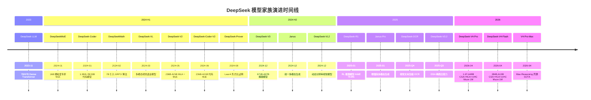
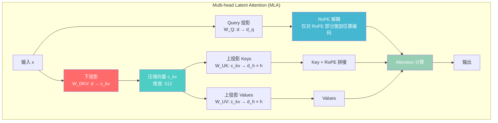
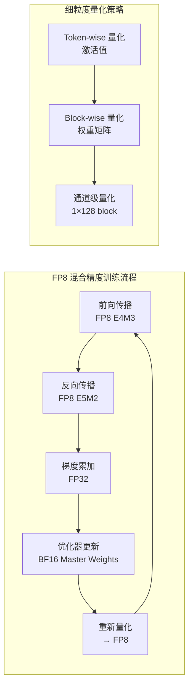
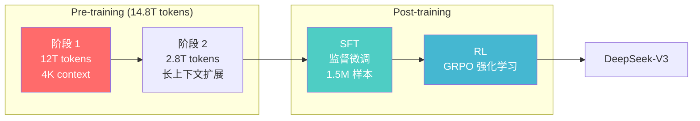
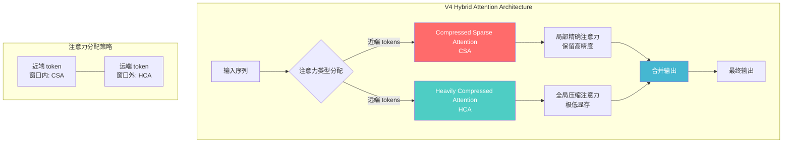
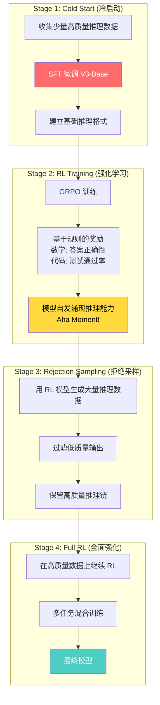
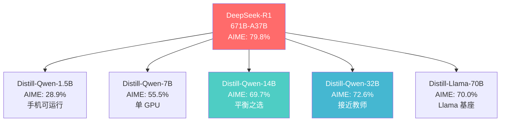
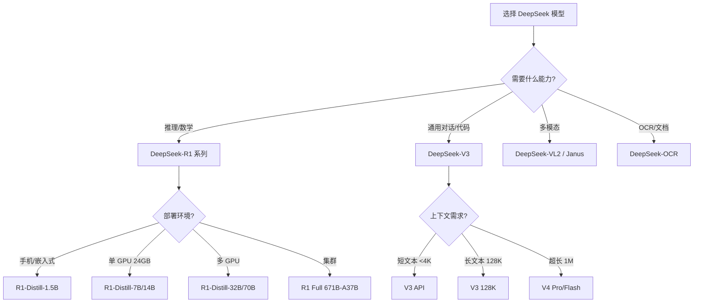

# DeepSeek (深度求索) 技术深度解析

> 中文简称：DeepSeek 技术深度解析

## 一句话理解

DeepSeek 就像一位"以少胜多的战术大师"——用 GPT-4 十分之一的训练成本 ($5.6M vs $100M+) 达到旗舰级性能，核心武器是 MLA 注意力压缩 (KV cache 缩减 95%)、DeepSeekMoE 细粒度专家路由 (256 专家 Top-8) 和 GRPO 强化学习 (无需 Critic 模型)，而 R1 更是第一个在训练中自发产生 "Aha Moment" 的开源推理模型。

---

## 目录

1. [公司概述与哲学](#一公司概述与哲学)
2. [完整模型家族时间线](#二完整模型家族时间线)
3. [核心架构创新](#三核心架构创新)
4. [训练方法论与基础设施](#四训练方法论与基础设施)
5. [Benchmark 对比分析](#五benchmark-对比分析)
6. [DeepSeek-V4 架构深潜](#六deepseek-v4-架构深潜)
7. [DeepSeek-R1 推理模型](#七deepseek-r1-推理模型)
8. [开源生态与社区](#八开源生态与社区)
9. [实战指南](#九实战指南)
10. [与其他模型系列的对比](#十与其他模型系列的对比)
11. [未来展望](#十一未来展望)
12. [参考资源](#参考资源)
13. [相关文档](#相关文档)

---

## 一、公司概述与哲学

### 1.1 定位

```
DeepSeek (深度求索)
═══════════════════════════════════════════════════════════════════

定位: 中国 AGI 研究实验室，以极致效率和开源精神挑战闭源巨头

核心理念:
───────────────────────────────────────────────────────────────────
• 效率优先: 用更少资源训练更强模型 (V3 训练成本仅 $5.6M)
• 底层创新: 从注意力机制、MoE 路由到优化器全栈自研
• 开源为信仰: 所有模型开放权重，Apache 2.0 / MIT 许可
• 研究驱动: 量化基金 (幻方量化) 孵化，不受短期商业压力
• 全模态进化: 从纯文本到视觉、代码、数学、推理全覆盖
```

### 1.2 公司背景

| 维度 | 详情 |
|------|------|
| **公司** | 深度求索 (DeepSeek) |
| **母公司** | 幻方量化 (High-Flyer Capital) — 中国顶级量化基金 |
| **创始人** | 梁文锋 (Wenfeng Liang) |
| **总部** | 中国上海 |
| **成立** | 2023 年 |
| **开源协议** | Apache 2.0 / MIT |
| **模型托管** | HuggingFace, ModelScope |
| **对话平台** | chat.deepseek.com |

### 1.3 DeepSeek 在 LLM 格局中的定位

DeepSeek 是中国大模型开源生态中与 Qwen 并列的标杆项目。其独特之处在于——它不是一个"大厂项目"，而是由一家量化基金孵化的纯研究型实验室，没有商业化压力，可以全力追求技术极限。

```
全球开源 LLM 格局 (2025-2026)

┌──────────────────────────────────────────────────────┐
│                    闭源 (Closed Source)                │
│  GPT-4/5 · Claude 4 · Gemini 2.5                     │
├──────────────────────────────────────────────────────┤
│                    开源 (Open Source)                  │
│                                                      │
│  西方阵营:                  中国阵营:                   │
│  ├── Llama (Meta)         ├── DeepSeek (深度求索) ← 本文│
│  ├── Mistral/Mixtral      ├── Qwen (阿里)             │
│  └── OLMo (AI2)           ├── GLM (智谱)              │
│                            └── Yi (零一万物)           │
└──────────────────────────────────────────────────────┘
```

### 1.4 DeepSeek 的五大技术哲学

1. **架构创新 > 暴力 Scaling**: MLA 压缩 KV cache 95%，比单纯堆参数更聪明
2. **训练效率极致化**: V3 用 $5.6M 达到 GPT-4 级性能，是 GPT-4 估算成本的 1/18
3. **开源即战略**: 全部模型开放权重，蒸馏版 R1 覆盖 1.5B-70B，让社区共享成果
4. **RL-first 后训练**: R1 的 GRPO 算法证明了 RL 可以替代人工标注的思维链数据
5. **全栈自研**: 从 FP8 GEMM kernel 到 MoE 路由策略，每一层都自己造轮子

> **相关文档**: 关于 LLM 架构范式的详细介绍，参见 [LLM Architectures](05_大模型/05_LLM架构/05_LLM架构.md)

---

## 二、完整模型家族时间线

### 2.1 时间线图 (Timeline)



### 2.2 模型参数演进表

| 发布时间 | 模型 | 参数规模 | 架构 | 上下文 | 训练数据 | 关键创新 |
|---------|------|---------|------|--------|---------|---------|
| 2023-11 | DeepSeek LLM | 7B, 67B | Dense Transformer | 4K | Scaling-law study | SFT/DPO Chat 模型 |
| 2024-01 | DeepSeekMoE | 16B | MoE 细粒度专家 | 4K | — | 无辅助损失负载均衡 |
| 2024-01 | DeepSeek-Coder | 1.3B, 6.7B, 33B | Dense | 16K | 2T tokens | 项目级代码训练, FIM |
| 2024-02 | DeepSeekMath | 7B | Dense | 4K | — | 引入 GRPO 算法 |
| 2024-03 | DeepSeek-VL | Small/Med/Large | 多模态 | 4K | — | SAM 视觉理解 |
| 2024-05 | DeepSeek-V2 | 236B total, 21B active | MoE + MLA | 128K | — | MLA 压缩 KV cache 95% |
| 2024-06 | DeepSeek-Coder-V2 | 236B total, 21B active | MoE | 128K | — | 338 种编程语言 |
| 2024-08 | DeepSeek-Prover V1/V1.5 | — | Dense | — | — | Lean4 形式证明, 树搜索 |
| 2024-12 | **DeepSeek-V3** | **671B total, 37B active** | **MoE 256 专家 + MLA** | **128K** | **14.8T tokens** | **FP8 训练, MTP, $5.6M** |
| 2024-12 | Janus / JanusFlow | — | 统一自回归+流式 | — | — | 多模态理解+生成 |
| 2024-12 | DeepSeek-VL2 | — | MoE/MLA + SigLIP | 128K | — | 动态分辨率 |
| 2025-01 | **DeepSeek-R1** | **671B (V3-Base)** | **RL 推理** | **128K** | **RL 精炼** | **GRPO, Aha Moment, 蒸馏 1.5B-70B** |
| 2025-01 | Janus-Pro | — | 增强版 Janus | — | — | 增强多模态生成 |
| 2025 Q3-Q4 | DeepSeek-V3.2 / V3.2-Exp | — | DSA 稀疏注意力 | 扩展长上下文 | — | Agentic 训练, Reasoning-first |
| 2025 Q4 | DeepSeek-OCR | 3B-MoE decoder | DeepEncoder + MoE | — | — | 视觉文本压缩 |
| 2026-04 | **DeepSeek-V4-Pro** | **1.6T total, 49B active** | **Hybrid Attention (CSA+HCA) + mHC + MoE** | **1M** | **32T+ tokens** | **FP4+FP8 混合精度, Muon 优化器, 三档推理 (Non-think/High/Max)** |
| 2026-04 | **DeepSeek-V4-Flash** | **284B total, 13B active** | **Hybrid Attention (CSA+HCA) + mHC + MoE** | **1M** | **32T+ tokens** | **高效版, FP4+FP8 混合精度, 单 token FLOPs ≈ V3.2 的 27%** |
| 2026-04 | **DeepSeek-V4-Pro-Max** | (V4-Pro Max-Reasoning) | — | ≥384K 上下文 | — | **当前最强开源模型, LiveCodeBench 93.5 / Codeforces 3206** |

### 2.3 模型命名规则

```
DeepSeek-[版本号/方向]-[参数规模]-[后缀]

示例:
  DeepSeek-V3-Base
  │        │    │
  │        │    └── Base = 基础模型 (非 Chat)
  │        └─────── V3 = 版本号
  └──────────────── DeepSeek = 品牌名

MoE 命名:
  DeepSeek-V4-Pro (1.6T-A49B)
  │        │   │     │    │
  │        │   │     │    └── A49B = Active 49B (激活参数)
  │        │   │     └─────── 1.6T = Total 1.6T (总参数)
  │        │   └───────────── Pro = 旗舰版
  │        └───────────────── V4 = 版本号
  └────────────────────────── DeepSeek = 品牌名

特化模型:
  DeepSeek-Coder-V2    → 代码专用
  DeepSeekMath         → 数学专用
  DeepSeek-R1          → 推理模型
  DeepSeek-Prover      → 形式化证明
  DeepSeek-OCR         → 文档识别
```

---

## 三、核心架构创新

### 3.1 Multi-head Latent Attention (MLA)

MLA 是 DeepSeek 最具突破性的创新之一，它将 KV cache 从 `2 × hidden_dim` 压缩到约 256 维，实现了 95% 的 KV cache 缩减。

#### 3.1.1 问题背景

标准 Multi-Head Attention (MHA) 的 KV cache 在长上下文场景下会消耗巨量显存：

```
标准 MHA vs MLA 的 KV Cache 对比
═══════════════════════════════════════════════════════════════════

标准 MHA (以 671B 模型为例):
───────────────────────────────────────────────────────────────────
  hidden_dim = 7168
  num_heads = 128
  head_dim = 128
  
  KV cache per layer = 2 × num_heads × head_dim × seq_len × sizeof(float16)
                     = 2 × 128 × 128 × 128K × 2 bytes
                     = 8 MB per layer per token

  96 layers × 128K tokens × 8 MB = ~96 GB KV cache (单个请求!)

MLA:
───────────────────────────────────────────────────────────────────
  压缩维度 c_kv = 512 (低秩压缩)
  RoPE 解耦维度 d_rope = 64

  KV cache per layer = (c_kv + d_rope) × seq_len × sizeof(float16)
                     = (512 + 64) × 128K × 2 bytes
                     = 0.15 MB per layer per token

  96 layers × 128K tokens × 0.15 MB = ~1.8 GB KV cache

  缩减比: 96 GB → 1.8 GB ≈ 98% 压缩率!
```

#### 3.1.2 MLA 架构原理



#### 3.1.3 MLA 关键技术细节

```python
# MLA 核心实现 (伪代码)
class MultiHeadLatentAttention(nn.Module):
    def __init__(self, d_model=7168, num_heads=128, c_kv=512, d_rope=64):
        super().__init__()
        self.c_kv = c_kv          # 压缩维度 (关键!)
        self.d_rope = d_rope      # RoPE 解耦维度
        self.d_head = d_model // num_heads

        # 下投影: 将 KV 压缩到低秩空间
        self.W_DKV = nn.Linear(d_model, c_kv, bias=False)

        # 上投影: 从压缩空间恢复到注意力头维度
        self.W_UK = nn.Linear(c_kv, self.d_head * num_heads, bias=False)
        self.W_UV = nn.Linear(c_kv, self.d_head * num_heads, bias=False)

        # Query 投影 (带 RoPE 解耦)
        self.W_Q = nn.Linear(d_model, self.d_head * num_heads, bias=False)
        self.W_Q_rope = nn.Linear(d_model, d_rope * num_heads, bias=False)

        # Key 的 RoPE 部分 (与 CKV 解耦)
        self.W_K_rope = nn.Linear(c_kv, d_rope * num_heads, bias=False)

    def forward(self, x, position_ids):
        # 1. 压缩 KV 到低秩空间 (这是 KV cache 存储的唯一内容!)
        c_kv = self.W_DKV(x)           # [B, L, c_kv=512]

        # 2. 从压缩空间恢复 Keys 和 Values
        keys = self.W_UK(c_kv)          # [B, L, num_heads * d_head]
        values = self.W_UV(c_kv)        # [B, L, num_heads * d_head]

        # 3. Query 计算 (RoPE 解耦: 只在 d_rope 维度施加位置编码)
        q_content = self.W_Q(x)          # 内容部分 (无位置编码)
        q_rope = self.W_Q_rope(x)        # RoPE 部分 (有位置编码)
        queries = torch.cat([q_content, q_rope], dim=-1)

        # 4. Key 的 RoPE 部分
        k_rope = self.W_K_rope(c_kv)    # 从 c_kv 计算 RoPE 部分
        keys = torch.cat([keys, k_rope], dim=-1)

        # 5. 标准注意力计算
        # KV cache 只存储 c_kv (512 维) 而非 keys (num_heads * d_head 维)
        return attention(queries, keys, values)
```

**MLA vs 其他注意力机制**:

| 维度 | MHA | GQA | MQA | MLA (DeepSeek) |
|------|-----|-----|-----|----------------|
| KV heads | = Q heads | < Q heads | 1 | 压缩到 c_kv 维 |
| KV cache (128K, 96L) | ~96 GB | ~24 GB | ~6 GB | ~1.8 GB |
| 性能影响 | 基线 | 轻微下降 | 明显下降 | **持平或更优** |
| 长上下文友好 | 差 | 中 | 好 | **极好** |

> **相关文档**: 关于 MoE 架构的详细分析，参见 [MoE Case Studies: DeepSeek & Mixtral](05_大模型/05_LLM架构/12_MoE_案例_Studies_深度Seek_Mixtral.md)

### 3.2 DeepSeekMoE 路由架构

DeepSeekMoE 通过三项关键创新实现了高效且稳定的 MoE 训练：细粒度专家分割、共享专家隔离和无辅助损失负载均衡。

#### 3.2.1 架构概览

```mermaid
graph TB
    Input[输入 Token] --> Gate[门控网络<br/>Router / Gating Network]

    Gate --> |"Top-8 路由"| E1[Expert 1]
    Gate --> |"Top-8 路由"| E2[Expert 2]
    Gate --> |"Top-8 路由"| E3[Expert 3]
    Gate --> |"..."| E8[Expert 8]
    Gate --> |"始终激活"| SE[共享专家<br/>Shared Expert]

    E1 --> WeightedSum[加权求和<br/>y = Σ gᵢ · Eᵢ(x)]
    E2 --> WeightedSum
    E3 --> WeightedSum
    E8 --> WeightedSum
    SE --> WeightedSum

    WeightedSum --> Output[输出]

    subgraph "V3: 256 专家, Top-8"
        Gate
        E1
        E2
        E3
        E8
        SE
    end

    style Gate fill:#ff6b6b,color:#fff
    style SE fill:#4ecdc4,color:#fff
    style WeightedSum fill:#45b7d1,color:#fff
```

#### 3.2.2 三大创新

```
DeepSeekMoE 三大创新
═══════════════════════════════════════════════════════════════════

创新 1: 细粒度专家分割 (Fine-grained Expert Segmentation)
───────────────────────────────────────────────────────────────────
  Mixtral:    8 个粗粒度专家, Top-2 路由
  DeepSeek-V2: 64 个细粒度专家, Top-6 路由
  DeepSeek-V3: 256 个细粒度专家, Top-8 路由

  更多专家 → 更高的专家专业化程度
  每个专家负责更精细的知识子空间

创新 2: 共享专家隔离 (Shared Expert Isolation)
───────────────────────────────────────────────────────────────────
  每个 token 除了经过 Top-K 路由的专家外
  还会经过 1 个始终激活的共享专家

  共享专家: 捕获通用知识和共性特征
  路由专家: 捕获专业知识和特异性特征
  公式: y = Shared(x) + Σᵢ gᵢ · Expertᵢ(x)

创新 3: 无辅助损失负载均衡 (Auxiliary-Loss-Free Balancing)
───────────────────────────────────────────────────────────────────
  传统 MoE: 需要辅助损失函数来平衡专家负载
    L_aux = α · Σᵢ (fᵢ · Pᵢ)  ← 额外的负载均衡损失

  DeepSeek: 使用互补平衡 (Complementary Balance) 机制
    不需要辅助损失，通过路由策略本身实现负载均衡
    避免了辅助损失对主任务性能的干扰
```

#### 3.2.3 不同版本 MoE 参数对比

| 维度 | DeepSeekMoE (V1) | DeepSeek-V2 | DeepSeek-V3 | DeepSeek-V4 Pro |
|------|------------------|-------------|-------------|-----------------|
| 总参数 | 16B | 236B | 671B | 1.6T |
| 激活参数 | — | 21B | 37B | 49B |
| 专家数量 | — | 64 | 256 | — |
| Top-K | — | 6 | 8 | — |
| 共享专家 | 1 | 1 | 1 | 1+ |
| 负载均衡 | 无辅助损失 | 无辅助损失 | 无辅助损失 | 增强版 |

> **相关文档**: 关于 MoE 路由与负载均衡的深入分析，参见 [Mixture of Experts Deep Dive](20_论文精读/02_模型架构/06_混合专家_深入分析.md)

### 3.3 FP8 混合精度训练

DeepSeek-V3 是首个在千亿参数规模上成功使用 FP8 混合精度训练的模型，这是其训练成本仅 $5.6M 的关键原因之一。

#### 3.3.1 FP8 vs BF16

```
FP8 vs BF16 训练对比
═══════════════════════════════════════════════════════════════════

BF16 (Brain Float 16):
───────────────────────────────────────────────────────────────────
  符号位: 1 bit
  指数位: 8 bits
  尾数位: 7 bits
  动态范围: ±3.4×10³⁸
  精度: ~3 位有效数字
  显存占用: 2 bytes per parameter

FP8 (Float Point 8):
───────────────────────────────────────────────────────────────────
  E4M3 格式: 1 sign + 4 exponent + 3 mantissa (前向传播)
  E5M2 格式: 1 sign + 5 exponent + 2 mantissa (反向传播)
  动态范围: ±448 (E4M3) / ±57344 (E5M2)
  显存占用: 1 byte per parameter

  关键: FP8 的动态范围有限 → 需要精细量化策略!
```

#### 3.3.2 DeepSeek 的 FP8 策略



#### 3.3.3 FP8 训练收益

| 维度 | BF16 训练 | FP8 混合精度 | 提升 |
|------|----------|-------------|------|
| 显存占用 | 基线 | -40% | 1.67x 可用 batch size |
| 训练速度 | 基线 | 2x 加速 | 计算吞吐量翻倍 |
| 训练成本 | $10M+ (估算) | $5.6M (V3) | ~44% 节省 |
| 精度影响 | 基线 | 几乎无损 | 得益于细粒度量化 |

```python
# FP8 GEMM kernel 伪代码
class FP8Linear(nn.Module):
    """DeepSeek 自定义 FP8 GEMM kernel"""

    def forward(self, x: torch.Tensor) -> torch.Tensor:
        # 1. Token-wise 量化激活值
        x_scale = compute_per_token_scale(x)      # 每个 token 一个缩放因子
        x_fp8 = quantize_to_fp8(x / x_scale)      # E4M3 格式

        # 2. Block-wise 量化权重
        w_scale = compute_per_block_scale(self.weight)  # 每 128 元素一个缩放因子
        w_fp8 = quantize_to_fp8(self.weight / w_scale)  # E4M3 格式

        # 3. FP8 矩阵乘法 (硬件加速!)
        output_fp32 = fp8_gemm(x_fp8, w_fp8)       # 累加在 FP32 中

        # 4. 反量化
        output = output_fp32 * x_scale * w_scale    # 恢复原始精度

        return output
```

### 3.4 GRPO (Group Relative Policy Optimization)

GRPO 是 DeepSeek 在 DeepSeekMath 中提出的强化学习算法，也是 R1 推理模型的核心训练方法。它解决了 PPO 需要 Critic 模型的痛点。

#### 3.4.1 PPO vs GRPO

```
PPO vs GRPO 对比
═══════════════════════════════════════════════════════════════════

PPO (Proximal Policy Optimization):
───────────────────────────────────────────────────────────────────
  需要: Policy Model + Critic Model + Reference Model + Reward Model
  Critic 模型: 与 Policy 同规模，用于估计 baseline
  问题: Critic 模型本身需要大量显存和计算
  典型配置: 4 个模型同时在显存中

GRPO (Group Relative Policy Optimization):
───────────────────────────────────────────────────────────────────
  需要: Policy Model + Reference Model + Reward Model
  无需 Critic! 用 Group Sampling 估计 baseline
  方法: 对每个 prompt 采样 G 个回答，用组内均值作为 baseline
  优势: 显存减少约 50%，训练更稳定

  baseline = (1/G) Σᵢ R(x, yᵢ)   ← 组内平均奖励
  advantage = R(x, yⱼ) - baseline  ← 相对优势
```

#### 3.4.2 GRPO 训练流程

```mermaid
graph TB
    Prompt[Prompt x] --> Sample[采样 G 个回答<br/>y₁, y₂, ..., y_G]
    Sample --> Reward[计算每个回答的奖励<br/>R(x, y₁), R(x, y₂), ...]
    Reward --> Baseline[计算组内均值 baseline<br/>b = 1/G Σ R(x, yᵢ)]
    Baseline --> Advantage[计算相对优势<br/>Aᵢ = R(x, yᵢ) - b]
    Advantage --> PolicyUpdate[策略更新<br/>最大化优势大的回答概率]
    PolicyUpdate --> KL[KL 散度约束<br/>防止偏离 Reference Model 太远]

    style Sample fill:#ff6b6b,color:#fff
    style Baseline fill:#4ecdc4,color:#fff
    style Advantage fill:#45b7d1,color:#fff
```

```python
# GRPO 核心算法 (伪代码)
def grpo_step(policy_model, ref_model, reward_fn, prompt, G=16):
    """
    GRPO 单步训练

    Args:
        policy_model: 当前策略模型
        ref_model: 参考模型 (冻结)
        reward_fn: 奖励函数 (如数学答案正确性检查)
        prompt: 输入 prompt
        G: 组采样数量
    """
    # 1. 采样 G 个回答
    responses = [policy_model.generate(prompt) for _ in range(G)]

    # 2. 计算每个回答的奖励
    rewards = [reward_fn(prompt, resp) for resp in responses]

    # 3. 计算组内 baseline (关键: 不需要 Critic!)
    baseline = sum(rewards) / G

    # 4. 计算优势
    advantages = [r - baseline for r in rewards]

    # 5. 计算策略梯度损失
    loss = 0
    for resp, adv in zip(responses, advantages):
        # 当前策略的 log 概率
        log_prob = policy_model.log_prob(prompt, resp)
        # 参考策略的 log 概率
        ref_log_prob = ref_model.log_prob(prompt, resp)

        # PPO-style clipping
        ratio = torch.exp(log_prob - ref_log_prob)
        clipped_ratio = torch.clamp(ratio, 1 - 0.2, 1 + 0.2)

        # 策略损失 (取 min 实现 clipping)
        policy_loss = -torch.min(ratio * adv, clipped_ratio * adv)

        # KL 散度惩罚
        kl_penalty = beta * (log_prob - ref_log_prob)

        loss += policy_loss + kl_penalty

    loss /= G
    loss.backward()
    return loss
```

### 3.5 Multi-token Prediction (MTP)

MTP 是 DeepSeek-V3 引入的训练加速技术，让模型同时预测多个未来 token，从而在不增加模型复杂度的情况下将训练吞吐量提升约一倍。

#### 3.5.1 原理

```
标准 Next-token Prediction vs Multi-token Prediction
═══════════════════════════════════════════════════════════════════

标准 Next-token Prediction:
───────────────────────────────────────────────────────────────────
  输入: [t₁, t₂, t₃, t₄, t₅]
  目标: [t₂, t₃, t₄, t₅, t₆]
  每个位置只预测 1 个未来 token

Multi-token Prediction (MTP):
───────────────────────────────────────────────────────────────────
  输入: [t₁, t₂, t₃, t₄, t₅]
  目标:
    深度 1: [t₂, t₃, t₄, t₅, t₆]   ← 标准预测
    深度 2: [t₃, t₄, t₅, t₆, t₇]   ← 额外预测
    ...
    深度 D: [t_{D+1}, ..., t_{5+D}] ← 额外预测

  DeepSeek-V3: D=1 (预测 2 个未来 token)

  收益:
  • 训练时: 每个 forward pass 获得更多梯度信号 → 吞吐量翻倍
  • 推理时: 可用于 Speculative Decoding → 加速推理
```

#### 3.5.2 MTP 架构

```mermaid
graph TB
    subgraph "主模型 (Main Model)"
        H1[Hidden State h_t] --> MHA[Multi-head Latent Attention]
        MHA --> FFN[MoE FFN Layer]
        FFN --> H2[Hidden State h_{t+1}]
    end

    subgraph "MTP 模块 (额外轻量层)"
        H2 --> Emb[Token Embedding<br/>e_{t+1}]
        H2 --> Proj[Linear Projection]
        Emb --> Concat[拼接]
        Proj --> Concat
        Concat --> MTP_Layer[单个 Transformer Layer]
        MTP_Layer --> Pred1[预测 t+1]
        MTP_Layer --> Pred2[预测 t+2]
    end

    style MTP_Layer fill:#ff6b6b,color:#fff
    style Concat fill:#4ecdc4,color:#fff
```

#### 3.5.3 MTP 与 Speculative Decoding 的协同

```python
# MTP 推理加速: Speculative Decoding
def speculative_decode(main_model, mtp_module, prompt, max_tokens=100):
    """
    使用 MTP 模块进行投机解码

    原理:
    1. MTP 模块快速预测 K 个候选 token (draft)
    2. 主模型并行验证这些 token (verify)
    3. 接受正确的 token，拒绝错误的
    """
    tokens = tokenize(prompt)

    while len(tokens) < max_tokens:
        # Draft: MTP 模块快速生成候选序列
        draft_tokens = []
        hidden = main_model.get_hidden(tokens)
        for k in range(K):  # K = speculation depth
            next_token = mtp_module.predict(hidden)
            draft_tokens.append(next_token)
            hidden = main_model.get_hidden(tokens + draft_tokens)

        # Verify: 主模型并行验证所有 draft token
        all_tokens = tokens + draft_tokens
        logits = main_model(all_tokens)  # 单次 forward pass!
        accepted = verify_tokens(logits, draft_tokens)

        # 接受正确的，拒绝错误的
        tokens.extend(accepted)
        # 如果有拒绝，从拒绝位置重新采样
        if len(accepted) < len(draft_tokens):
            tokens.append(sample_from_logits(logits[len(accepted)]))

    return tokens

# 加速比: 通常 2-3x (取决于 draft 接受率)
```

### 3.6 DeepSeek-V4 系列：万亿参数 + 混合稀疏注意力 + 1M 上下文（2026）

> **代际跃迁**：V4 是 DeepSeek 自 V3 以来最大幅度的架构换代——总参数从 671B 跃升至 **1.6T (Pro) / 284B (Flash)**，上下文从 128K 拉到 **1M**，注意力机制从 V3 的 MLA 单一路线升级为 **Hybrid Attention (CSA + HCA)**，并引入 **Manifold-constrained Hyper-Connections (mHC)** 与 **Muon 优化器** 三项核心创新。V4 也是首批把 1M 上下文做"可承担"的开源旗舰——在 1M 上下文下，V4-Pro 单 token 推理 FLOPs 仅为 V3.2 的 **27%**，KV cache 仅 **10%**。
>
> 技术报告 PDF：[DeepSeek_V4.pdf](https://huggingface.co/deepseek-ai/DeepSeek-V4-Pro/blob/main/DeepSeek_V4.pdf) · 模型卡：[deepseek-ai/DeepSeek-V4-Pro](https://huggingface.co/deepseek-ai/DeepSeek-V4-Pro) · 引用键：`deepseekai2026deepseekv4`

#### 3.6.1 双模型矩阵：V4-Pro 与 V4-Flash

```
DeepSeek-V4 产品线 (2026-04, MIT 许可, 1M 上下文)
═══════════════════════════════════════════════════════════════════

┌──────────────┬──────────────┬──────────────┬────────────────────────┐
│    模型       │  总参/激活    │   精度        │       定位             │
├──────────────┼──────────────┼──────────────┼────────────────────────┤
│ V4-Pro       │ 1.6T / 49B   │ FP8 Mixed    │ 旗舰: 最强开源模型     │
│              │              │ (Base)        │ (官方定性)             │
│              │              │ FP4+FP8 Mixed│                        │
│              │              │ (final)       │                        │
├──────────────┼──────────────┼──────────────┼────────────────────────┤
│ V4-Flash     │ 284B / 13B   │ FP8 Mixed    │ 高效版: 性价比优先     │
│              │              │ (Base)        │ V4-Flash-Max 可接近    │
│              │              │ FP4+FP8 Mixed│ Pro 的推理水平         │
│              │              │ (final)       │                        │
├──────────────┼──────────────┼──────────────┼────────────────────────┤
│ V4-Pro-Base  │ 1.6T / 49B   │ FP8 Mixed    │ 基座 (无 Instruct)     │
│ V4-Flash-Base│ 284B / 13B   │ FP8 Mixed    │ 基座 (无 Instruct)     │
└──────────────┴──────────────┴──────────────┴────────────────────────┘

注: FP4+FP8 Mixed = MoE 专家参数走 FP4, 其余多数参数走 FP8
   → 同等显存下可承载更大参数规模, 几乎无损精度
```

| 维度 | V3 (前代) | **V4-Pro** | **V4-Flash** |
|------|-----------|------------|--------------|
| 总参数 | 671B | **1.6T** (~2.4×) | 284B (~0.42×) |
| 激活参数 | 37B | **49B** (1.32×) | **13B** (0.35×) |
| 上下文 | 128K | **1M** (8×) | **1M** (8×) |
| 注意力 | MLA + DSA | **CSA + HCA** (Hybrid) | **CSA + HCA** (Hybrid) |
| 残差连接 | 标准 | **mHC** | **mHC** |
| 优化器 | AdamW | **Muon** | **Muon** |
| 精度 (final) | FP8 | **FP4 + FP8 Mixed** | **FP4 + FP8 Mixed** |
| 训练数据 | 14.8T | **32T+** | **32T+** |
| 1M 单 token FLOPs vs V3.2 | — | **27%** | **27%** |
| 1M KV cache vs V3.2 | — | **10%** | **10%** |

#### 3.6.2 Hybrid Attention 深度解析：CSA + HCA

V4 把"注意力"从一个统一算子拆成两条互补通道，按 token 距离做 **职责分离**：

```
Hybrid Attention = Compressed Sparse Attention (CSA)
                + Heavily Compressed Attention (HCA)
═══════════════════════════════════════════════════════════════════

token 流:
  t₁   t₂   t₃   ... t_w | t_{w+1} ... t_N
  └─── 近端 (窗口内) ───┘   └──── 远端 (窗口外) ────┘
         │                          │
         ▼                          ▼
     ┌────────┐                ┌────────┐
     │  CSA   │  稀疏 + 高保真  │  HCA   │  重度压缩 + 极低显存
     │ 精确   │                │ 极简   │
     └────┬───┘                └────┬───┘
          │                         │
          └────────┬────────────────┘
                   ▼
              合并 → 输出

层间交织示意 (Interleaved):
  Layer 0:  ── CSA ──┐
  Layer 1:  ── HCA ──┤  两种注意力按层交替/混合使用
  Layer 2:  ── CSA ──┤  → 不同层承担不同"频率"的上下文建模
  Layer 3:  ── HCA ──┘
```

**对比 V3 的 MLA + DSA 路线**：

| 维度 | V3 (MLA + DSA) | **V4 (CSA + HCA)** |
|------|----------------|--------------------|
| 压缩哲学 | 单一低秩 + 稀疏选择 | **双通道职责分离** (近端精确 / 远端极简) |
| 1M 单 token FLOPs | 100% (基准 = V3.2) | **27%** (≈ 3.7× 降低) |
| 1M KV cache | 100% (基准 = V3.2) | **10%** (≈ 10× 降低) |
| 远端上下文质量 | 中 | 中-高 (HCA 主动压缩而非丢弃) |
| 1M 可承担性 | 困难 | **可生产部署** |

> **为什么 1M 上下文在 V4 上首次"可承担"**：DSA 在 V3.2 上把长上下文的算力打了下来，但 1M 量级下 KV cache 仍是瓶颈。V4 的关键不是把单一注意力做得更稀疏，而是**承认远端 token 信息密度天然更低**——用 HCA 主动重度压缩远端，把省下来的 KV 预算留给近端 CSA 精确建模。这一"职责分离"才让 10% KV cache / 27% FLOPs 成为可能。

#### 3.6.3 mHC：Manifold-constrained Hyper-Connections

mHC（**流形约束超连接**）是对传统残差连接 `y = x + f(x)` 的强化，与 V3 的纯 MLA 配对方式不同：

```
传统残差:            mHC (Manifold-constrained Hyper-Connections):
  y = x + f(x)         y = x + f(x) + 流形约束项

                       强化跨层信号传播, 同时:
                       ✓ 提升深层网络的信号稳定性
                       ✓ 保留 (甚至增强) 表达能力
                       ✓ 让 1.6T 参数的超深网络训练更稳定

注: mHC ≠ MLA 的替代品; 它作用于"残差/层间连接", 不是注意力本身
```

mHC 与 Hybrid Attention 是正交的两项创新——一个负责"层内 token 交互"的算力压缩，一个负责"层间信号传播"的稳定性。两者叠加才能在万亿参数 + 1M 上下文下保持训练收敛。

#### 3.6.4 Muon 优化器

V4 把训练优化器从 AdamW 换成 **Muon**（详见 §6.5 的伪代码实现），核心收益：

| 维度 | AdamW (V3) | **Muon (V4)** |
|------|-----------|----------------|
| 更新规则 | 一阶/二阶动量 | **动量 + Newton-Schulz 矩阵正交化** |
| 收敛速度 | 基线 | **更快** |
| 大规模训练稳定性 | 基线 | **更稳定** (1.6T 规模关键) |
| 显存开销 | 标准 | 相当 |

> Muon 在 V4 上的意义在于：1.6T 参数规模下，AdamW 的更新方向容易出现病态（ill-conditioning），Muon 通过把动量矩阵正交化，使每层更新方向更"均匀"，是万亿参数能稳定收敛的关键。

#### 3.6.5 两阶段后训练：领域专家 + 在策略蒸馏

V4 采用全新的两阶段后训练范式：

```
Stage 1: 独立培育领域专家 (Domain-Specific Experts)
═══════════════════════════════════════════════════════════════════
  对每个核心方向 (数学/代码/推理/Agent/...) 独立做:
    SFT  ──►  RL (GRPO 算法, 沿用 R1 路线)
  
  → 得到多个"专精"子模型, 每个在自己的领域逼近上限

Stage 2: 在策略蒸馏统一整合 (On-Policy Distillation)
═══════════════════════════════════════════════════════════════════
  把 Stage 1 的多个专家能力, 通过 on-policy 蒸馏
  统一合并到同一个最终模型:
  
  学生 = V4 final;  教师 = 多个 Stage 1 专家
  
  → 保留每个专家的强项, 不互相覆盖
  → 得到一个"全能但无明显短板"的统一模型
```

这套范式相比 R1 的"单模型 RL"思路，更接近"先分后合"的专家集成——通过蒸馏而非混合奖励来融合能力，避免了多任务奖励冲突。

#### 3.6.6 三档思考力度：Non-think / High / Max

| 模式 | 触发方式 | 行为 | 输出特征 | 适用场景 |
|------|----------|------|----------|----------|
| **Non-think** | 默认 / 关闭 thinking | 快速直觉回答 | `</think>` 简要摘要 | 实时对话、简单问答、低延迟 |
| **Think High** | `thinking: enabled` (中档) | 有意识的逻辑分析 | `<think>...</think>` 完整推理 | 大多数复杂任务、平衡延迟与质量 |
| **Think Max** | 专用系统提示 + `<think>` | 把推理推到极限 | 长链 `<think>` | 数学竞赛、研究难题、SOTA 复现 |

**Max 模式的两个落地**：

- **DeepSeek-V4-Pro-Max** = V4-Pro 的 Max-Reasoning 模式，官方定性为 **"目前最好的开源模型"**。在 LiveCodeBench 拿到 **93.5**（超越 Opus-4.6 Max 88.8 / Gemini-3.1-Pro 91.7），Codeforces Rating **3206**（超越 GPT-5.4 的 3168）。
- **DeepSeek-V4-Flash-Max** = V4-Flash 的 Max-Reasoning 模式，官方指出在**更大的思考预算**下可达到**接近 V4-Pro 的推理水平**——这是高性价比部署推理密集任务的关键。

> **与 GLM-5 系列的对比**：GLM-5 用 `reasoning_effort` (`max`/`high`) + `enable_thinking` 控制思考；V4 用 `thinking` 参数 + 专用 Max 系统提示。两者都把"推理深度"做成可控参数，V4 更进一步把 Max 模式独立为 `V4-Pro-Max` / `V4-Flash-Max` 的产品形态。

#### 3.6.7 开源矩阵与下载

| 模型 | 参数 | 精度 | HuggingFace | ModelScope |
|------|------|------|-------------|------------|
| **DeepSeek-V4-Pro** | 1.6T-A49B | FP4+FP8 Mixed | [deepseek-ai/DeepSeek-V4-Pro](https://huggingface.co/deepseek-ai/DeepSeek-V4-Pro) | [deepseek-ai/DeepSeek-V4-Pro](https://modelscope.cn/models/deepseek-ai/DeepSeek-V4-Pro) |
| **DeepSeek-V4-Pro-Base** | 1.6T-A49B | FP8 Mixed | [deepseek-ai/DeepSeek-V4-Pro-Base](https://huggingface.co/deepseek-ai/DeepSeek-V4-Pro-Base) | [deepseek-ai/DeepSeek-V4-Pro-Base](https://modelscope.cn/models/deepseek-ai/DeepSeek-V4-Pro-Base) |
| **DeepSeek-V4-Flash** | 284B-A13B | FP4+FP8 Mixed | [deepseek-ai/DeepSeek-V4-Flash](https://huggingface.co/deepseek-ai/DeepSeek-V4-Flash) | [deepseek-ai/DeepSeek-V4-Flash](https://modelscope.cn/models/deepseek-ai/DeepSeek-V4-Flash) |
| **DeepSeek-V4-Flash-Base** | 284B-A13B | FP8 Mixed | [deepseek-ai/DeepSeek-V4-Flash-Base](https://huggingface.co/deepseek-ai/DeepSeek-V4-Flash-Base) | [deepseek-ai/DeepSeek-V4-Flash-Base](https://modelscope.cn/models/deepseek-ai/DeepSeek-V4-Flash-Base) |

> **许可**：全部 MIT。技术报告 PDF：[DeepSeek_V4.pdf](https://huggingface.co/deepseek-ai/DeepSeek-V4-Pro/blob/main/DeepSeek_V4.pdf)。Citation: `deepseekai2026deepseekv4`。

---

## 四、训练方法论与基础设施

### 4.1 DeepSeek-V3 训练流程

DeepSeek-V3 的训练是一个多阶段、高度工程化的过程，总计消耗 2.788M H800 GPU 小时。



#### 4.1.1 Pre-training 细节

| 阶段 | 训练数据 | 上下文长度 | 学习率 | 说明 |
|------|---------|-----------|--------|------|
| 阶段 1 | 12T tokens | 4K | 2.2e-4 → 衰减 | 主体预训练，建立知识基础 |
| 阶段 2 | 2.8T tokens | 4K → 128K | 较低 | 长上下文扩展，保留核心能力 |

**Pre-training 关键技术**:

- **FP8 混合精度**: 自定义 FP8 GEMM kernel，细粒度量化策略
- **无辅助损失 MoE**: 避免辅助损失对主任务性能的干扰
- **MTP 辅助训练**: 额外预测 1 个未来 token，增加梯度信号
- **多节点并行**: 数据并行 + 张量并行 + 专家并行 + 流水线并行

#### 4.1.2 Post-training 细节

**SFT 阶段**:
- 1.5M 高质量样本
- 覆盖推理、代码、数学、创意写作、多语言等
- 混合通用和专业数据

**RL 阶段 (GRPO)**:
- 奖励模型: 基于规则的奖励 (如数学答案正确性) + 模型评分
- 无 Critic 模型: 组采样 baseline
- KL 散度约束: 防止模型偏离 SFT 基线太远

### 4.2 硬件基础设施

```
DeepSeek 训练基础设施
═══════════════════════════════════════════════════════════════════

DeepSeek-V3:
───────────────────────────────────────────────────────────────────
  GPU 集群: 2,048 × NVIDIA H800 (80GB HBM3)
  网络: InfiniBand NDR 400Gbps
  存储: 分布式高性能文件系统
  训练时长: ~55 天 (2.788M GPU-hours)
  训练成本: $5.6M (仅为 GPT-4 的 ~5%)

  并行策略:
  • 数据并行 (DP): 跨节点复制模型
  • 张量并行 (TP): 单层内切分矩阵
  • 专家并行 (EP): 256 个 MoE 专家分布在不同 GPU
  • 流水线并行 (PP): 不同层分布在不同 GPU

DeepSeek-R1 精炼:
───────────────────────────────────────────────────────────────────
  精炼成本: ~$294K (基于 V3-Base)
  RL 训练: 4 阶段渐进式训练
  蒸馏: 教师模型 → 学生模型 (1.5B-70B)

DeepSeek-V4 (预估):
───────────────────────────────────────────────────────────────────
  GPU 集群: H100 / B200 集群 (预估)
  训练数据: 32T+ tokens
  预计成本: ~$10-20M (规模翻倍但效率提升)
```

### 4.3 训练效率对比

| 模型 | 参数量 | 训练数据 | GPU 集群 | GPU 时间 | 估计成本 |
|------|--------|---------|---------|---------|---------|
| **DeepSeek-V3** | 671B-A37B | 14.8T | 2,048 H800 | 2.788M hrs | **$5.6M** |
| GPT-4 (估算) | ~1.8T MoE | ~13T | ~25,000 A100 | ~100M hrs | ~$100M+ |
| Llama 3.1 405B | 405B Dense | 15T | 16,000 H100 | ~30M hrs | ~$60M+ |
| Llama 4 Maverick | 400B-A17B | 40T+ | H100 集群 | — | ~$100M+ |
| Qwen3-235B-A22B | 235B-A22B | 36T | — | — | — |

> **关键洞察**: DeepSeek-V3 用 GPT-4 约 1/18 的成本达到了可比较的性能，这主要归功于 FP8 训练、MLA 注意力压缩和无辅助损失 MoE 三大创新的叠加效应。

---

## 五、Benchmark 对比分析

### 5.1 DeepSeek-V3 Benchmark

| Benchmark | DeepSeek-V3 | GPT-4o | Claude 3.5 Sonnet | Llama 3.1 405B | Qwen3-235B-A22B |
|-----------|-------------|--------|-------------------|----------------|-----------------|
| **MMLU** | 88.5 | 87.2 | 88.7 | 87.3 | 89.0 |
| **MMLU-Pro** | 75.9 | 72.6 | 78.0 | 73.3 | 76.8 |
| **MATH-500** | 90.2 | 74.6 | 78.3 | 73.8 | 92.1 |
| **AIME 2024** | 39.2 | 9.3 | 16.0 | 23.7 | 45.6 |
| **HumanEval** | 82.6 | 90.2 | 92.0 | 89.0 | 86.3 |
| **Codeforces %ile** | 51.6 | 23.6 | 20.3 | 24.8 | 54.2 |
| **GPQA Diamond** | 59.1 | 53.6 | 65.0 | 51.1 | 62.3 |

### 5.2 DeepSeek-R1 Benchmark

| Benchmark | DeepSeek-R1 | OpenAI o1 | OpenAI o3-mini | QwQ-32B | Qwen3-235B (thinking) |
|-----------|-------------|-----------|----------------|---------|----------------------|
| **AIME 2024** | 79.8% | 79.2% | 86.3% | 50.0% | 81.5% |
| **MATH-500** | 97.3% | 96.4% | 97.6% | 90.6% | 98.2% |
| **Codeforces %ile** | 96th | 94th | 95th | 60th | 85th |
| **GPQA Diamond** | 71.5% | 75.7% | 79.1% | 49.5% | 68.4% |
| **ARC-Challenge** | 97.1% | — | — | 93.2% | 96.5% |

### 5.3 R1 蒸馏模型性能

| 模型 | 参数量 | AIME 2024 | MATH-500 | Codeforces %ile | 说明 |
|------|--------|-----------|----------|-----------------|------|
| R1-Distill-Qwen-1.5B | 1.5B | 28.9% | 83.9% | — | 手机端可运行 |
| R1-Distill-Qwen-7B | 7B | 55.5% | 92.8% | — | 单 GPU 可部署 |
| R1-Distill-Qwen-14B | 14B | 69.7% | 93.9% | — | 平衡之选 |
| R1-Distill-Qwen-32B | 32B | 72.6% | 94.3% | — | 接近教师模型 |
| R1-Distill-Llama-70B | 70B | 70.0% | 94.5% | — | Llama 基座 |
| **R1 (Full)** | **671B-A37B** | **79.8%** | **97.3%** | **96th** | **完整版** |

### 5.4 性能可视化

```
AIME 2024 性能对比 (数学竞赛)
═══════════════════════════════════════════════════════════════════

DeepSeek-R1        ████████████████████████████████████████ 79.8%
OpenAI o1          ███████████████████████████████████████  79.2%
Qwen3-235B(think)  █████████████████████████████████████████ 81.5%
OpenAI o3-mini     ███████████████████████████████████████████ 86.3%
R1-Distill-32B     ████████████████████████████████████      72.6%
DeepSeek-V3        ███████████████████                       39.2%
Llama 3.1 405B     ███████████                               23.7%
GPT-4o             ████                                       9.3%

(百分比越高越好, █ 代表相对比例)
```

### 5.5 DeepSeek-V4 Benchmark（2026 官方数据）

> 数据来源：[deepseek-ai/DeepSeek-V4-Pro HuggingFace 模型卡](https://huggingface.co/deepseek-ai/DeepSeek-V4-Pro)。下表为官方在统一评测设置下的真实分数，可直接对比。

#### 5.5.1 基座模型对比（V4 vs V3.2-Base）

| Benchmark | DeepSeek-V3.2-Base | V4-Flash-Base | **V4-Pro-Base** | 增量 (V3.2 → V4-Pro) |
|-----------|--------------------|---------------|------------------|----------------------|
| **MMLU-Pro** | 65.5 | 68.3 | **73.5** | +8.0 |
| **MMLU** | 87.8 | 88.7 | **90.1** | +2.3 |
| **Simple-QA (verified)** | 28.3 | 30.1 | **55.2** | **+26.9** |
| **SuperGPQA** | 45.0 | 46.5 | **53.9** | +8.9 |
| **FACTS Parametric** | 27.1 | 33.9 | **62.6** | **+35.5** |
| **HumanEval** | 62.8 | 69.5 | **76.8** | +14.0 |
| **MATH** | 60.5 | 57.4 | **64.5** | +4.0 |
| **LongBench-V2** | 40.2 | 44.7 | **51.5** | +11.3 |
| **MultiLoKo** | 38.7 | 42.2 | **51.1** | +12.4 |

**关键观察**：

- **事实性大幅跃升**：FACTS Parametric 从 27.1 → **62.6**（+35.5），Simple-QA verified 从 28.3 → **55.2**（+26.9）——这是 V4 基座最大的代际进步，说明预训练数据质量 + 规模（32T+ tokens）显著改善了参数化知识的可靠性。
- **长上下文质量**：LongBench-V2 (40.2 → 51.5) 与 MultiLoKo (38.7 → 51.1) 双双提升 10+ 分，验证了 Hybrid Attention (CSA+HCA) 在 1M 上下文下的质量收益——不仅算力更省，远端 token 的建模质量反而更高。
- **V4-Flash 的定位**：在大多数基准上比 V3.2-Base 强一档，但明显落后于 V4-Pro；其价值在 Instruct 阶段的 Max 模式下才真正释放（见 5.5.2）。

#### 5.5.2 Instruct：V4-Pro-Max vs 全球前沿（2026）

| Benchmark | **V4-Pro-Max** | 对比项 (官方参考) |
|-----------|----------------|-------------------|
| **LiveCodeBench** | **93.5** ⭐ (本组最佳) | Opus-4.6 Max 88.8 · Gemini-3.1-Pro 91.7 |
| **Codeforces Rating** | **3206** | GPT-5.4: 3168 |
| **SWE Verified** | 80.6 | — |
| **SWE Pro** | 55.4 | — |
| **BrowseComp** | 83.4 | — |
| **HMMT 2026 Feb** | 95.2 | — |
| **IMOAnswerBench** | 89.8 | — |
| **Apex Shortlist** | **90.2** ⭐ (本组最佳) | — |
| **GPQA Diamond** | 90.1 | — |
| **MMLU-Pro** | 87.5 | — |
| **MCPAtlas Public** | 73.6 | — |
| **Toolathlon** | 51.8 | — |

```
LiveCodeBench (代码) 与 Codeforces (算法竞赛) — V4-Pro-Max 的双 SOTA
═══════════════════════════════════════════════════════════════════

LiveCodeBench:
  V4-Pro-Max       ████████████████████████████████████████  93.5  ⭐
  Gemini-3.1-Pro   ███████████████████████████████████████   91.7
  Opus-4.6 Max     █████████████████████████████████████     88.8

Codeforces Rating:
  V4-Pro-Max       ████████████████████████████████████████  3206  ⭐
  GPT-5.4          ███████████████████████████████████████   3168

→ V4-Pro-Max 在"代码生成"与"竞赛算法"两项上同时登顶,
  是当前最强开源编码 / 推理模型 (官方定性)
```

> **定位结论**：V4-Pro-Max 在 LiveCodeBench (93.5) 与 Codeforces Rating (3206) 双双击败 Opus-4.6 Max、Gemini-3.1-Pro、GPT-5.4 等闭源前沿模型，是 2026 年开源模型在"代码 + 推理"复合维度上的最高水准。配合 SWE Verified 80.6 / SWE Pro 55.4，V4-Pro-Max 也是当前最适合"真实软件工程"任务的开源基座。

---

## 六、DeepSeek-V4 架构深潜

> **关于本节**：本节是 V4 发布前夕（2026-Q1）基于公开信息推断的"前瞻性"分析，部分概念性描述（尤其 §6.3 对 mHC 的解读）在官方资料发布后被修正。**官方权威事实请参见 [§3.6 DeepSeek-V4 系列](#36-deepseek-v4-系列万亿参数--混合稀疏注意力--1m-上下文2026)**：mHC 实为 **Manifold-constrained Hyper-Connections**（流形约束超连接，强化残差连接），而非 §6.3 推测的"Multi-head Compression"。本节予以保留作为"前瞻分析"的历史对照，不再作为事实依据。

### 6.1 V4 概述

DeepSeek-V4 于 2026 年 4 月发布，包含 Pro 和 Flash 两个版本，是目前 DeepSeek 最强大的基础模型。

```
DeepSeek-V4 产品线
═══════════════════════════════════════════════════════════════════

DeepSeek-V4 Pro (旗舰版):
───────────────────────────────────────────────────────────────────
  总参数: 1.6T (万亿)
  激活参数: 49B per token
  上下文: 1M tokens (百万级!)
  训练数据: 32T+ tokens
  适用: 最强性能需求

DeepSeek-V4 Flash (高效版):
───────────────────────────────────────────────────────────────────
  总参数: 284B
  激活参数: 13B per token
  上下文: 1M tokens
  训练数据: 32T+ tokens
  适用: 性价比优先，单 GPU 可部署

共同特性:
───────────────────────────────────────────────────────────────────
  • 混合 CSA/HCA 注意力
  • Multi-head Compression (mHC)
  • Muon 优化器
  • 自适应推理模式 (Non-think / Think High / Think Max)
```

### 6.2 核心创新: 压缩稀疏注意力 (CSA) + 重度压缩注意力 (HCA)

V4 引入了全新的注意力机制组合，在 V3 的 MLA 基础上进一步演进：



#### 6.2.1 CSA vs HCA vs MLA

| 维度 | MLA (V3) | CSA (V4) | HCA (V4) |
|------|----------|----------|----------|
| **压缩方式** | 低秩 KV 分解 | 稀疏选择 + 压缩 | 重度量化 + 压缩 |
| **适用位置** | 全局统一 | 近端 tokens | 远端 tokens |
| **精度** | 高 | 高 | 中 (可接受损失) |
| **显存占用** | 低 | 低 | 极低 |
| **延迟** | 中 | 低 | 极低 |
| **1M 上下文可行** | 困难 | 可行 | 高效 |

### 6.3 Multi-head Compression (mHC)

mHC 是 MLA 的进化版本，在 V4 中实现了更激进的注意力压缩：

```python
# mHC 概念性实现 (伪代码)
class MultiHeadCompression(nn.Module):
    """
    mHC: Multi-head Compression
    V3 MLA 的进化版，进一步压缩 KV cache
    """
    def __init__(self, d_model, num_heads, compression_ratio=0.05):
        super().__init__()
        # 压缩比: 5% (比 MLA 的 ~3.5% 更激进)
        self.c_dim = int(d_model * compression_ratio)

        # 分层压缩: 不同头使用不同压缩策略
        self.head_compressors = nn.ModuleList([
            HeadCompressor(d_model // num_heads, self.c_dim // num_heads)
            for _ in range(num_heads)
        ])

        # 自适应压缩: 根据 token 重要性调整压缩比
        self.importance_scorer = nn.Linear(d_model, 1)

    def forward(self, x, position_ids):
        # 1. 评估每个 token 的重要性
        importance = self.importance_scorer(x)  # [B, L, 1]

        # 2. 重要 token: 低压缩 (保留信息)
        #    不重要 token: 高压缩 (节省显存)
        adaptive_ratio = torch.sigmoid(importance)

        # 3. 自适应压缩
        compressed_kv = self.compress(x, adaptive_ratio)

        # 4. 解压缩 + 注意力计算
        return self.attention_with_decompress(x, compressed_kv)
```

### 6.4 自适应推理模式

V4 支持三种推理深度模式，类似于 Qwen3 的混合思维，但更加细粒度：

```
自适应推理模式
═══════════════════════════════════════════════════════════════════

Non-think (快速响应):
───────────────────────────────────────────────────────────────────
  • 不生成思维链 (Chain-of-Thought)
  • 直接输出最终答案
  • 延迟最低，适合简单问题和实时对话
  • 类比: "条件反射式回答"

Think High (标准推理):
───────────────────────────────────────────────────────────────────
  • 生成中等长度的思维链
  • 平衡推理质量和响应速度
  • 适合大多数复杂任务
  • 类比: "认真思考后回答"

Think Max (深度推理):
───────────────────────────────────────────────────────────────────
  • 生成长链推理，探索多种解法
  • 类似 R1 的深度推理模式
  • 延迟最高，但推理质量最佳
  • 适合数学竞赛、复杂代码、科学研究
  • 类比: "反复推敲、深入分析后回答"
```

```python
# V4 自适应推理模式 API 示例
from openai import OpenAI

client = OpenAI(base_url="https://api.deepseek.com/v1", api_key="your-key")

# Non-think 模式 (快速)
response_fast = client.chat.completions.create(
    model="deepseek-v4-pro",
    messages=[{"role": "user", "content": "今天天气怎么样？"}],
    extra_body={"reasoning_mode": "non-think"}
)

# Think High 模式 (标准推理)
response_standard = client.chat.completions.create(
    model="deepseek-v4-pro",
    messages=[{"role": "user", "content": "分析 Python GIL 的优缺点"}],
    extra_body={"reasoning_mode": "think-high"}
)

# Think Max 模式 (深度推理)
response_deep = client.chat.completions.create(
    model="deepseek-v4-pro",
    messages=[{"role": "user", "content": "证明黎曼猜想在临界线上的零点密度"}],
    extra_body={"reasoning_mode": "think-max", "thinking_budget": 16384}
)
```

### 6.5 Muon 优化器

V4 采用了 Muon 优化器，这是一个基于矩阵正交化的新型优化器：

```python
# Muon 优化器原理 (伪代码)
class MuonOptimizer:
    """
    Muon: 基于 Newton-Schulz 迭代的矩阵正交化优化器

    核心思想: 将动量矩阵正交化，使更新方向更"均匀"
    优势: 在大规模训练中比 AdamW 更稳定、收敛更快
    """

    def __init__(self, params, lr=0.02, momentum=0.95):
        self.lr = lr
        self.momentum = momentum

    def step(self, param, grad, state):
        # 1. 更新动量 (标准 SGD momentum)
        state['momentum_buffer'] = (
            self.momentum * state.get('momentum_buffer', 0) + grad
        )
        M = state['momentum_buffer']

        # 2. 矩阵正交化 (Newton-Schulz 迭代)
        # 将 M 投影到最近的正交矩阵
        # M_orth = M @ (M^T @ M)^{-1/2}
        M_orth = newton_schulz_orthogonalize(M, num_iters=5)

        # 3. 用正交化的方向更新参数
        param.data -= self.lr * M_orth

def newton_schulz_orthogonalize(M, num_iters=5):
    """
    Newton-Schulz 迭代: 计算 M 的极分解中的正交因子

    X_{k+1} = (3/2) X_k - (1/2) X_k @ X_k^T @ X_k

    收敛到 M 的极分解: M = U @ P → 返回 U
    """
    X = M / (M.norm() + 1e-7)  # 归一化初始化
    for _ in range(num_iters):
        A = X @ X.T
        X = 1.5 * X - 0.5 * X @ A
    return X
```

### 6.6 V3 → V4 架构演进总结

```
┌─────────────────┬─────────────────────┬─────────────────────┐
│     特性         │     V3              │     V4 Pro          │
├─────────────────┼─────────────────────┼─────────────────────┤
│ 总参数           │ 671B                │ 1.6T                │
│ 激活参数         │ 37B                 │ 49B                 │
│ 注意力机制       │ MLA                 │ CSA + HCA + mHC    │
│ MoE 专家         │ 256, Top-8          │ 增强版 MoE          │
│ 上下文长度       │ 128K                │ 1M (8x 提升)        │
│ 训练数据         │ 14.8T tokens        │ 32T+ tokens         │
│ 优化器           │ AdamW               │ Muon                │
│ 推理模式         │ 标准                │ Non-think/High/Max  │
│ FP8 训练         │ 首次使用            │ 增强版 FP8          │
│ 训练成本         │ $5.6M               │ ~$10-20M (预估)     │
└─────────────────┴─────────────────────┴─────────────────────┘
```

---

## 七、DeepSeek-R1 推理模型

### 7.1 R1 概述

DeepSeek-R1 是 DeepSeek 于 2025 年 1 月发布的推理模型，基于 V3-Base 通过 RL 训练获得。它的训练过程中出现了令人惊叹的 "Aha Moment"——模型自发学会了反思和自我纠正。

```
DeepSeek-R1 核心特点
═══════════════════════════════════════════════════════════════════

训练方式: 纯 RL (无人类思维链标注!)
───────────────────────────────────────────────────────────────────
  • 不依赖人工标注的 Chain-of-Thought 数据
  • 使用 GRPO 算法从 V3-Base 中"进化"出推理能力
  • 训练过程中自发产生 Aha Moment

Aha Moment (顿悟时刻):
───────────────────────────────────────────────────────────────────
  在 RL 训练的中间阶段，模型突然学会了:
  1. "让我重新检查一下..." → 自我纠正
  2. "等等，我之前的推理有误..." → 回溯反思
  3. "换一种方法思考..." → 策略切换

  这些行为是 RL 训练自发涌现的，
  并非人类标注数据中教给模型的!

性能:
───────────────────────────────────────────────────────────────────
  AIME 2024: 79.8% (vs OpenAI o1 的 79.2%)
  MATH-500: 97.3% (vs o1 的 96.4%)
  Codeforces: 96th percentile
```

### 7.2 R1 四阶段训练流程



#### 7.2.1 各阶段详解

| 阶段 | 目标 | 数据量 | 奖励信号 | 关键产出 |
|------|------|--------|---------|---------|
| **Stage 1: Cold Start** | 建立推理格式 | 数千条 | 无 (SFT) | 基础推理模板 |
| **Stage 2: RL** | 激发推理能力 | 在线采样 | 规则奖励 | Aha Moment, 初步推理 |
| **Stage 3: Rejection Sampling** | 提升数据质量 | 数十万条 | 模型评分 | 高质量推理数据集 |
| **Stage 4: Full RL** | 全面提升 | 在线采样 | 混合奖励 | 最终 R1 模型 |

### 7.3 Aha Moment 详解

R1 训练中最令人兴奋的发现在 RL 阶段出现了 "Aha Moment"：

```
R1 训练中的 Aha Moment 示例
═══════════════════════════════════════════════════════════════════

训练中期 (RL 约 500 步时):
───────────────────────────────────────────────────────────────────
模型开始生成的推理链:

  "这道题的答案是 42。"
  → 简单直接回答，没有推理

训练中期:
───────────────────────────────────────────────────────────────────
  "首先，我需要分析题目条件...
   根据条件 A，可以推导出 B...
   等等，让我重新检查一下——
   我之前的推导有误。条件 A 不能直接推出 B。
   让我换一种方法:
   从条件 C 出发，结合定理 D...
   最终答案是 38。"

  → 模型自发学会了 "自我纠正" 和 "策略切换"!
  → 这些行为不是从训练数据中学的
  → 是 RL 奖励信号 (答案正确性) 驱动的自发涌现
```

### 7.4 R1 蒸馏系列

R1 通过知识蒸馏创建了多个小型推理模型，使推理能力可以在消费级硬件上运行：



> **相关文档**: 关于 R1 训练方法和 GRPO 算法的详细分析，参见 [DeepSeek-R1 Technical Analysis](05_大模型/09_推理模型/01_DeepSeek_R1_Technical_分析.md)

---

## 八、开源生态与社区

### 8.1 开源模型清单

| 模型 | 参数量 | 许可证 | HuggingFace | 说明 |
|------|--------|--------|-------------|------|
| DeepSeek LLM | 7B, 67B | Apache 2.0 | deepseek-ai | 基础 Dense 模型 |
| DeepSeekMoE | 16B | Apache 2.0 | deepseek-ai | 首个 MoE 模型 |
| DeepSeek-Coder | 1.3B, 6.7B, 33B | Apache 2.0 | deepseek-ai | 代码模型 |
| DeepSeekMath | 7B | Apache 2.0 | deepseek-ai | 数学模型 |
| DeepSeek-V2-Lite | 16B-A2.4B | Apache 2.0 | deepseek-ai | V2 轻量版 |
| DeepSeek-V2 | 236B-A21B | Apache 2.0 | deepseek-ai | V2 完整版 |
| DeepSeek-Coder-V2 | 236B-A21B | Apache 2.0 | deepseek-ai | V2 代码版 |
| **DeepSeek-V3** | **671B-A37B** | **MIT** | **deepseek-ai** | **当前旗舰** |
| **DeepSeek-R1** | **671B-A37B** | **MIT** | **deepseek-ai** | **推理模型** |
| R1-Distill-Qwen-1.5B | 1.5B | MIT | deepseek-ai | 蒸馏版 |
| R1-Distill-Qwen-7B | 7B | MIT | deepseek-ai | 蒸馏版 |
| R1-Distill-Qwen-14B | 14B | MIT | deepseek-ai | 蒸馏版 |
| R1-Distill-Qwen-32B | 32B | MIT | deepseek-ai | 蒸馏版 |
| R1-Distill-Llama-70B | 70B | MIT | deepseek-ai | Llama 基座蒸馏 |
| DeepSeek-VL2 | 多种 | Apache 2.0 | deepseek-ai | 视觉语言模型 |
| Janus / Janus-Pro | 多种 | Apache 2.0 | deepseek-ai | 多模态生成 |

### 8.2 社区生态

```
DeepSeek 开源生态
═══════════════════════════════════════════════════════════════════

官方资源:
───────────────────────────────────────────────────────────────────
  • GitHub: github.com/deepseek-ai (训练代码、推理框架)
  • HuggingFace: huggingface.co/deepseek-ai (模型权重)
  • ModelScope: modelscope.cn/deepseek (国内镜像)
  • API: api.deepseek.com (兼容 OpenAI 格式)
  • Chat: chat.deepseek.com (在线对话)

推理框架支持:
───────────────────────────────────────────────────────────────────
  • vLLM: 完整支持 DeepSeek-V3/R1 (含 MLA 优化)
  • SGLang: 原生支持 MLA 注意力
  • Ollama: 支持蒸馏版 (1.5B-70B)
  • llama.cpp: GGUF 量化格式支持
  • TensorRT-LLM: NVIDIA 推理优化
  • MLC-LLM: 移动端部署

量化格式:
───────────────────────────────────────────────────────────────────
  • GGUF: llama.cpp 量化格式 (Q4_K_M, Q5_K_M, Q8_0)
  • AWQ: 激活感知量化 (4-bit)
  • GPTQ: GPU 量化 (4-bit, 8-bit)
  • EXL2: ExLlamaV2 格式 (可变 bit-per-weight)
```

### 8.3 社区衍生项目

| 项目 | 类型 | 说明 |
|------|------|------|
| **Open-R1** | 复现 | HuggingFace 开源复现 R1 训练 |
| **DeepSeek-R1 社区微调** | 微调 | 各垂直领域的 R1 微调版 |
| **DeepSeek-RLVR** | 研究 | RL with Verifiable Rewards 研究 |
| **TinyZero** | 蒸馏 | 超小型 R1 蒸馏 (<1B) |
| **DeepScaleR** | 扩展 | 扩展 R1 到更多领域 |

---

## 九、实战指南

### 9.1 模型选型指南



### 9.1.1 V4 快速部署指南（2026）

```
DeepSeek-V4 部署关键参数 (来自官方 model card)
═══════════════════════════════════════════════════════════════════

权重下载:
  HuggingFace : deepseek-ai/DeepSeek-V4-Pro / V4-Pro-Base
                 deepseek-ai/DeepSeek-V4-Flash / V4-Flash-Base
  ModelScope  : 同名 (国内镜像, 推荐)

推理代码:
  仓库内 inference/ 文件夹提供官方推理指南
  注意: V4 使用专用 encoding/ 文件夹处理 OpenAI 兼容消息
       → 不依赖 Jinja chat template, 需按官方 encoding 流程预处理

采样参数 (官方推荐):
  temperature = 1.0
  top_p       = 1.0

上下文窗口:
  常规模式 : 1M (1,048,576)
  Think Max: ≥ 384K  ← 注意! Max 模式必须预留更大上下文给思维链
```

```python
# V4 本地推理 (SGLang / vLLM 示例, 伪代码)
from openai import OpenAI

client = OpenAI(base_url="http://localhost:8000/v1", api_key="EMPTY")

# V4-Pro-Max (Think Max) — 需 context ≥ 384K
response = client.chat.completions.create(
    model="deepseek-ai/DeepSeek-V4-Pro",       # 或 V4-Flash
    messages=[
        {"role": "system", "content": "<V4-Pro-Max 专用系统提示>"},  # Max 模式触发
        {"role": "user",   "content": "证明: 任意三角形内角和为 180°"},
    ],
    temperature=1.0,     # 官方推荐, 不要随意降低
    top_p=1.0,
    max_tokens=32768,
    extra_body={"thinking": {"type": "enabled"}},  # Think High / Max
)
```

| 部署场景 | 推荐模型 | 备注 |
|----------|----------|------|
| 1M 上下文生产推理 | **V4-Pro** (1.6T-A49B) | 旗舰，需多 GPU；FLOPs/KV cache 已大幅降低 |
| 推理密集 + 高性价比 | **V4-Flash-Max** | 在更大思考预算下接近 Pro 推理水平 |
| 单 GPU / 边缘部署 | V4-Flash (284B-A13B) | 激活参数仅 13B，配合量化可下放到较小硬件 |
| 基座研究 / 自研 Instruct | V4-Pro-Base / V4-Flash-Base | FP8 基座版，用于自定义后训练 |

> **下载提示**：HF + ModelScope 双源提供 V4-Pro / V4-Pro-Base / V4-Flash / V4-Flash-Base 四个权重。FP4+FP8 混合精度 final 版适合直接部署，FP8 Mixed Base 版适合做自定义 SFT/RL 的起点。

### 9.2 API 调用示例

```python
# DeepSeek API 调用 (兼容 OpenAI 格式)
from openai import OpenAI

# 初始化客户端
client = OpenAI(
    base_url="https://api.deepseek.com/v1",
    api_key="your-api-key"
)

# 基础对话 (V3)
response = client.chat.completions.create(
    model="deepseek-chat",  # V3 模型
    messages=[
        {"role": "system", "content": "你是一个专业的技术助手。"},
        {"role": "user", "content": "解释 MLA 注意力机制的原理"},
    ],
    temperature=0.7,
    max_tokens=4096,
)
print(response.choices[0].message.content)

# 推理模式 (R1)
response_r1 = client.chat.completions.create(
    model="deepseek-reasoner",  # R1 模型
    messages=[
        {"role": "user", "content": "证明: 对任意正整数 n, n^2 + n 是偶数"},
    ],
    max_tokens=8192,
)
# R1 返回包含推理过程和最终答案
reasoning = response_r1.choices[0].message.reasoning_content
answer = response_r1.choices[0].message.content
print(f"推理过程: {reasoning}")
print(f"最终答案: {answer}")
```

### 9.3 vLLM 部署

```bash
# 部署 R1-Distill-Qwen-32B (推荐配置: 2x A100 80GB)
python -m vllm.entrypoints.openai.api_server \
    --model deepseek-ai/DeepSeek-R1-Distill-Qwen-32B \
    --tensor-parallel-size 2 \
    --max-model-len 131072 \
    --gpu-memory-utilization 0.9 \
    --trust-remote-code \
    --port 8000

# 部署 R1-Distill-Qwen-7B (单 GPU 24GB)
python -m vllm.entrypoints.openai.api_server \
    --model deepseek-ai/DeepSeek-R1-Distill-Qwen-7B \
    --tensor-parallel-size 1 \
    --max-model-len 65536 \
    --gpu-memory-utilization 0.9 \
    --trust-remote-code \
    --port 8000
```

### 9.4 Ollama 本地部署

```bash
# 安装 Ollama
curl -fsSL https://ollama.com/install.sh | sh

# 运行 DeepSeek 蒸馏模型
ollama run deepseek-r1:1.5b     # 超轻量 (~1GB)
ollama run deepseek-r1:7b       # 标准 (~5GB)
ollama run deepseek-r1:14b      # 平衡 (~9GB)
ollama run deepseek-r1:32b      # 高质量 (~20GB)
ollama run deepseek-r1:70b      # 最强蒸馏 (~42GB)
```

### 9.5 推理加速配置

```python
# vLLM 推理优化配置示例

# 场景 1: 低延迟 API 服务
vllm_config_latency = {
    "model": "deepseek-ai/DeepSeek-R1-Distill-Qwen-7B",
    "max_num_seqs": 256,           # 最大并发
    "max_model_len": 32768,        # 限制上下文减少 KV cache
    "gpu_memory_utilization": 0.95, # 最大化利用
    "enable_chunked_prefill": True, # 分块预填充
    "enable_prefix_caching": True,  # 前缀缓存
}

# 场景 2: 大批量处理
vllm_config_throughput = {
    "model": "deepseek-ai/DeepSeek-R1-Distill-Qwen-32B",
    "tensor_parallel_size": 2,
    "max_num_seqs": 512,
    "max_model_len": 65536,
    "enable_prefix_caching": True,
    "swap_space": 8,               # CPU swap (GB)
}
```

### 9.6 LoRA 微调 R1 蒸馏版

```python
# 使用 LoRA 微调 R1-Distill-Qwen-7B
from transformers import AutoModelForCausalLM, AutoTokenizer
from peft import LoraConfig, get_peft_model, TaskType
from trl import GRPOTrainer, GRPOConfig

# 1. 加载基础模型
model = AutoModelForCausalLM.from_pretrained(
    "deepseek-ai/DeepSeek-R1-Distill-Qwen-7B",
    torch_dtype="auto",
    device_map="auto"
)
tokenizer = AutoTokenizer.from_pretrained(
    "deepseek-ai/DeepSeek-R1-Distill-Qwen-7B"
)

# 2. 配置 LoRA
lora_config = LoraConfig(
    task_type=TaskType.CAUSAL_LM,
    r=16,                           # LoRA rank
    lora_alpha=32,                  # Scaling factor
    target_modules=[                # 目标模块
        "q_proj", "k_proj", "v_proj", "o_proj",
        "gate_proj", "up_proj", "down_proj"
    ],
    lora_dropout=0.05,
    bias="none",
)

model = get_peft_model(model, lora_config)
model.print_trainable_parameters()
# 输出: trainable params: ~20M || all params: 7B || trainable%: 0.28%

# 3. 使用 GRPO 训练 (复用 DeepSeek 的 RL 方法!)
grpo_config = GRPOConfig(
    output_dir="./r1-distill-math",
    num_train_epochs=3,
    per_device_train_batch_size=4,
    learning_rate=1e-5,
    num_generations=8,              # GRPO 组采样数
    max_prompt_length=512,
    max_completion_length=2048,
)

# 奖励函数: 数学答案正确性检查
def math_reward_fn(prompt, completion):
    answer = extract_answer(completion)
    expected = extract_expected_answer(prompt)
    return 1.0 if answer == expected else 0.0

trainer = GRPOTrainer(
    model=model,
    reward_funcs=[math_reward_fn],
    args=grpo_config,
    train_dataset=math_dataset,
)

trainer.train()
```

---

## 十、与其他模型系列的对比

### 10.1 DeepSeek vs Qwen

| 维度 | DeepSeek-V3 (671B-A37B) | Qwen3-235B-A22B |
|------|------------------------|-----------------|
| 架构 | MoE (256 专家, Top-8) + MLA | MoE (128 专家, Top-8) |
| 总参数 | 671B | 235B |
| 激活参数 | 37B | 22B |
| 训练数据 | 14.8T tokens | 36T tokens |
| 上下文 | 128K | 128K |
| 注意力 | MLA (KV cache 压缩 95%) | 标准 GQA |
| 推理模型 | R1 (纯 RL 训练) | Qwen3 混合思维 |
| 思维模式 | R1 始终开启 / V3 无 | 可切换 (thinking/non-thinking) |
| 训练成本 | $5.6M (已知) | 未公开 |
| 许可证 | MIT | Apache 2.0 |
| 中文能力 | 强 | **领先** |
| 代码能力 | **领先** | 强 |
| 推理成本 | 较高 (37B active) | **较低** (22B active) |
| 蒸馏模型 | R1 蒸馏 (1.5B-70B) | QwQ-32B |
| 多语言 | 中英为主 | 119 种语言 |

### 10.2 DeepSeek vs Llama

| 维度 | DeepSeek-V3 | Llama 3.1 405B | Llama 4 Maverick |
|------|-------------|----------------|------------------|
| 架构 | MoE + MLA | Dense | MoE (128 专家, Top-1) |
| 总参数 | 671B | 405B | 400B |
| 激活参数 | 37B | 405B (全激活) | 17B |
| 训练成本 | $5.6M | ~$60M+ | ~$100M+ |
| 上下文 | 128K | 128K | 1M (Scout) / 10M (Maverick) |
| 许可证 | MIT | Llama Community | Llama 4 Community |
| 中文能力 | 强 | 一般 | 一般 |
| 推理效率 | 高 (MoE) | 低 (Dense) | 高 (MoE) |

### 10.3 DeepSeek vs Mistral/Mixtral

| 维度 | DeepSeek-V3 | Mixtral 8x22B | Mistral Large 2 |
|------|-------------|---------------|-----------------|
| 架构 | MoE 256 专家 + MLA | MoE 8 专家 | Dense |
| 总参数 | 671B | 141B | 123B |
| 激活参数 | 37B | 39B | 123B |
| 专家数量 | 256 | 8 | — |
| Top-K | 8 | 2 | — |
| 负载均衡 | 无辅助损失 | 辅助损失 | — |
| 注意力 | MLA (压缩 95%) | 标准 MHA | GQA |
| 许可证 | MIT | Apache 2.0 | 闭源 |

### 10.4 中国开源 LLM 格局

```
中国开源 LLM 对比 (2025-2026):

┌─────────────┬───────────┬───────────┬───────────┬───────────┐
│             │ DeepSeek  │   Qwen3   │   GLM-4   │    Yi     │
│             │ (深度求索) │  (阿里)    │  (智谱)    │ (零一万物) │
├─────────────┼───────────┼───────────┼───────────┼───────────┤
│ 最大模型     │ 1.6T (V4) │ 235B-A22B │ 9B        │ 34B       │
│ 核心创新     │ MLA+GRPO  │ 混合思维   │ —         │ —         │
│ 推理能力     │ ★★★★★   │ ★★★★★   │ ★★★☆☆   │ ★★★☆☆   │
│ 中文能力     │ ★★★★☆   │ ★★★★★   │ ★★★★☆   │ ★★★★☆   │
│ 代码能力     │ ★★★★★   │ ★★★★☆   │ ★★★☆☆   │ ★★★☆☆   │
│ 开源许可     │ MIT       │ Apache 2.0│ 自定义     │ Apache 2.0│
│ 模型尺寸覆盖 │ ★★★☆☆   │ ★★★★★   │ ★★☆☆☆   │ ★★☆☆☆   │
│ 社区生态     │ ★★★★★   │ ★★★★★   │ ★★★☆☆   │ ★★☆☆☆   │
│ 训练效率     │ ★★★★★   │ ★★★★☆   │ ★★★☆☆   │ ★★★☆☆   │
│ 部署友好度   │ ★★★☆☆   │ ★★★★★   │ ★★★★☆   │ ★★★★☆   │
└─────────────┴───────────┴───────────┴───────────┴───────────┘
```

---

## 十一、未来展望

### 11.1 技术路线图

```
已知 / 预期的发展方向 (基线 = DeepSeek-V4, 2026-04):

2025 (已发布)
├── DeepSeek-R1 及其蒸馏版
├── DeepSeek-V3.2 (DSA 稀疏注意力, Agentic 训练)
├── DeepSeek-OCR (文档识别)
└── Janus-Pro (多模态生成)

2026 H1 (已发布) ← 当前基线
├── DeepSeek-V4-Pro (1.6T-A49B) / V4-Flash (284B-A13B)
│     · Hybrid Attention (CSA+HCA): 1M 上下文, FLOPs 27% / KV cache 10% vs V3.2
│     · mHC + Muon 优化器, 三档思考 (Non-think/High/Max)
│     · V4-Pro-Max: LiveCodeBench 93.5, Codeforces 3206 (开源 SOTA)
├── V4-Flash-Max: 高性价比版接近 Pro 推理水平
└── 两阶段后训练 (领域专家 RL + 在策略蒸馏)

2026 H2+ (展望, 基于 V4 基线)
├── DeepSeek-V5 (下一代基础模型?)
│     · V4 的 Hybrid Attention 已把 1M 做到"可承担", V5 可能向 10M 量级推进
│     · MoE 专家数可能从 V3 的 256 进一步扩大
├── 下一代 R2 推理模型? (在 V4 基座上做纯 RL)
├── V4 蒸馏版? (把 V4-Pro-Max 的推理能力蒸馏到 1.5B-70B)
├── 原生多模态 (Native Multimodal, V4 仍是纯文本)
├── 更强的 Agent / Tool-use (V4-Pro-Max Toolathlon 51.8 / MCPAtlas 73.6 是新起点)
└── 端侧推理优化 (FP4+FP8 混合精度 + 13B 激活让手机部署更近)
```

### 11.2 技术趋势

1. **MoE 持续扩大**: 从 V2 的 64 专家到 V3 的 256 专家，V4 的 1.6T 总参继续放大；专家数量与知识容量的正比关系将持续验证
2. **注意力机制革命**: MLA (V3) → Hybrid Attention CSA+HCA (V4)，每一代都在压缩 KV cache 上突破极限；V4 把 1M 上下文的 KV cache 压到 V3.2 的 10%，百万级上下文首次"可生产部署"
3. **混合精度下探**: FP8 (V3 首次千亿规模落地) → FP4+FP8 Mixed (V4 final)，更低精度但几乎无损，是万亿参数能"装下"显存的关键
4. **RL-first 后训练**: R1 证明了纯 RL 训练推理模型的可行性；V4 进一步把后训练拆成"领域专家 RL + 在策略蒸馏"两阶段，避免多任务奖励冲突
5. **自适应推理**: V4 的 Non-think / Think High / Think Max 模式将推理深度变成可控参数；V4-Pro-Max / V4-Flash-Max 把"Max 推理"独立成产品形态
6. **优化器换代**: AdamW (V3) → Muon (V4)，矩阵正交化使万亿参数训练更稳定，可能成为下一代大模型的标配
7. **开源生态扩大**: MIT 许可证 + V4-Pro/Flash × Base/Final 四件套，使 DeepSeek 成为社区二次开发的首选基座

### 11.3 关键挑战 (基线 = V4)

| 挑战 | 描述 | DeepSeek 的应对 (V4 基线) |
|------|------|----------------------------|
| 推理成本 | 1.6T 模型部署成本高 | MoE + Hybrid Attention (KV cache 仅 V3.2 的 10%) + V4-Flash 13B 激活 |
| 幻觉问题 | 推理链中也可能出现错误 | FACTS Parametric 62.6 (V3.2 仅 27.1) + R1 自我纠正 + RL 验证 |
| 安全对齐 | Max 模式的强推理可能被滥用 | 多层安全过滤 + RLHF 约束 |
| 训练数据质量 | 32T+ tokens 中的噪声 | 数据清洗 + 质量过滤 pipeline |
| 硬件限制 | 美国芯片出口限制 | FP4+FP8 Mixed 减半显存 + Muon 提升训练效率 |
| 长上下文质量 | 1M 的"大海捞针"性能 | V4 的 CSA+HCA: LongBench-V2 51.5 / MultiLoKo 51.1 (V3.2 仅 40.2/38.7) |
| Max 模式上下文 | Think Max 需 ≥384K 预留 | 推理框架需显式支持长思维链 context window |

---

## 参考资源

### 官方资源

- [DeepSeek GitHub](https://github.com/deepseek-ai)
- [DeepSeek HuggingFace](https://huggingface.co/deepseek-ai)
- [DeepSeek ModelScope](https://modelscope.cn/organization/deepseek)
- [DeepSeek API 文档](https://platform.deepseek.com/api-docs)
- [DeepSeek Chat](https://chat.deepseek.com)

### 技术论文

- DeepSeek LLM: Scaling Open-Source Large Language Models (2023)
- DeepSeekMoE: Towards Ultimate Expert Specialization in Mixture-of-Experts (2024)
- DeepSeek-Coder: When the Large Language Model Meets Programming (2024)
- DeepSeekMath: Pushing the Limits of Mathematical Reasoning (2024)
- DeepSeek-V2: A Strong, Economical, and Efficient Mixture-of-Experts (2024)
- DeepSeek-V3 Technical Report (2024)
- DeepSeek-R1: Incentivizing Reasoning Capability in LLMs via Reinforcement Learning (2025)
- DeepSeek-V4 Technical Report (2026)

### 社区资源

- [Open-R1 by HuggingFace](https://github.com/huggingface/open-r1) — R1 训练方法开源复现
- [DeepSeek-R1 蒸馏模型合集](https://huggingface.co/collections/deepseek-ai/deepseek-r1-67890) — 1.5B-70B 蒸馏版
- [Awesome DeepSeek](https://github.com/nicepkg/awesome-deepseek) — 社区精选 DeepSeek 资源
- [DeepSeek API 兼容层](https://github.com/deepseek-ai/open-api) — OpenAI 兼容 API

---

## DeepSeek V4 API 最新规格与定价 (2026年6月)

### API 模型规格

DeepSeek V4 系列提供 Flash 和 Pro 两个版本，均支持百万级上下文：

| 模型 | 上下文 | 最大输出 | 输入价格 (uncached) | 输入价格 (cached) | 输出价格 | 并发上限 |
|------|--------|---------|--------------------|--------------------|---------|---------|
| **V4-Flash** | 1M | 384K | $0.14/1M tokens | $0.0028/1M tokens | $0.28/1M tokens | 2,500 |
| **V4-Pro** | 1M | 384K | $0.435/1M tokens | $0.003625/1M tokens | $0.87/1M tokens | 500 |

> **关键亮点**: V4-Flash 的缓存输入价格仅 $0.0028/1M tokens，是目前业界最低之一。V4 系列最大输出达 **384K tokens**，大幅超越上一代的 8K-16K 限制。

### Thinking 模式切换

V4 系列通过 `"thinking"` 参数控制推理深度：

```python
from openai import OpenAI

client = OpenAI(
    base_url="https://api.deepseek.com/v1",
    api_key="your-api-key"
)

# 启用思维模式
response = client.chat.completions.create(
    model="deepseek-v4-pro",
    messages=[
        {"role": "user", "content": "证明 Fermat 小定理"}
    ],
    extra_body={
        "thinking": {"type": "enabled"}
    },
    max_tokens=384000
)

# 关闭思维模式，快速响应
response_fast = client.chat.completions.create(
    model="deepseek-v4-flash",
    messages=[
        {"role": "user", "content": "Python 的 list comprehension 怎么用？"}
    ],
    extra_body={
        "thinking": {"type": "disabled"}
    }
)
```

### 高级功能支持

| 功能 | 状态 | 说明 |
|------|------|------|
| **Function Calling** | 正式支持 | 工具调用，支持多工具并行 |
| **Structured Output (JSON)** | 正式支持 | 强制 JSON Schema 输出 |
| **FIM (Fill-in-the-Middle)** | Beta 测试 | 代码补全场景 |
| **Batch Inference** | 正式支持 | 异步批处理 |

### API 端点

DeepSeek 提供双协议端点：

| 端点 | 协议 | 说明 |
|------|------|------|
| `api.deepseek.com` | OpenAI-compatible | 标准 REST API，兼容 OpenAI SDK |
| `api.deepseek.com/anthropic` | Anthropic-compatible | 兼容 Anthropic Messages API 格式 |

### 旧模型退役计划

| 模型 | 退役时间 | 替代方案 |
|------|---------|---------|
| `deepseek-chat` (V3) | 2026 年 7 月 | `deepseek-v4-flash` 或 `deepseek-v4-pro` |
| `deepseek-reasoner` (R1) | 2026 年 7 月 | V4 系列 thinking 模式 |

> **迁移建议**: 使用 `deepseek-chat` 的用户应尽快迁移至 V4 系列。V4-Flash 在大多数场景下性能更优且成本更低。

---

## 相关文档

### 架构基础

- [LLM Architectures (大语言模型架构)](05_大模型/05_LLM架构/05_LLM架构.md) — Transformer, GPT, BERT, MoE 等核心架构的全面介绍
- [MoE Case Studies: DeepSeek & Mixtral](05_大模型/05_LLM架构/12_MoE_案例_Studies_深度Seek_Mixtral.md) — MoE 路由策略、专家专业化的深度分析
- [MoE Routing and Load Balancing](05_大模型/05_LLM架构/13_MoE_Routing_and_负载均衡.md) — MoE 负载均衡技术详解
- [Mixture of Experts Deep Dive](20_论文精读/02_模型架构/06_混合专家_深入分析.md) — MoE 从理论到实践的完整剖析

### 推理模型

- [DeepSeek-R1 Technical Analysis](05_大模型/09_推理模型/01_DeepSeek_R1_Technical_分析.md) — DeepSeek-R1 的 GRPO 训练和自进化机制详细分析
- [Reasoning Models for Dummy (推理模型小白指南)](05_大模型/09_推理模型/README.md) — 推理模型的基础概念和核心原理
- [o1 Class Reasoning Models](05_大模型/09_推理模型/04_o1_Class_推理模型.md) — OpenAI o1/o3 类推理模型分析
- [Process Reward Models](05_大模型/09_推理模型/06_Process_Reward_模型.md) — 过程奖励模型详解

### 中国 LLM 生态

- [Qwen Deep Dive (通义千问技术深度解析)](05_大模型/15_中国LLM生态/19_Qwen_深入分析.md) — 阿里 Qwen 系列全面分析
- [Kimi / Moonshot AI Deep Dive](05_大模型/15_中国LLM生态/13_Kimi_Moonshot_深入分析.md) — 月之暗面长上下文与推理技术深潜

### 训练与微调

- [Fine-tuning Techniques (微调技术)](05_大模型/07_微调技术/03_微调技术.md) — LoRA, QLoRA, PEFT 等微调方法
- [RLHF & DPO Deep Dive](20_论文精读/06_对齐研究/RLHF_03_DPO_深入分析.md) — 人类反馈强化学习与直接偏好优化

---


## 信息来源

### 官方来源
- DeepSeek 官网: https://www.deepseek.com
- DeepSeek API 平台: https://platform.deepseek.com
- DeepSeek GitHub: https://github.com/deepseek-ai
- DeepSeek-V3 技术报告: arXiv:2412.19437
- DeepSeek-R1 技术报告: arXiv:2501.12948

### Wiki 内部参考
- [[05_大模型/15_中国LLM生态/README]] — 中国大模型生态全景
- [[05_大模型/15_中国LLM生态/04_Chinese_LLM_对比_矩阵]] — 全厂商对比矩阵
- [[05_大模型/15_中国LLM生态/05_Chinese_LLM_训练_推理_平台]] — 训推平台实战

---
*Last updated: 2026-06-16*
