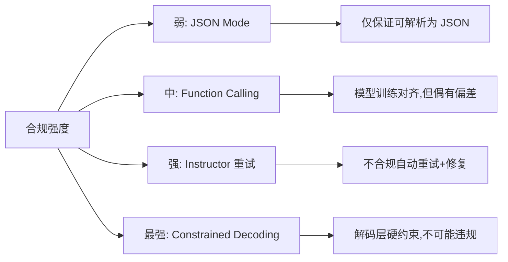
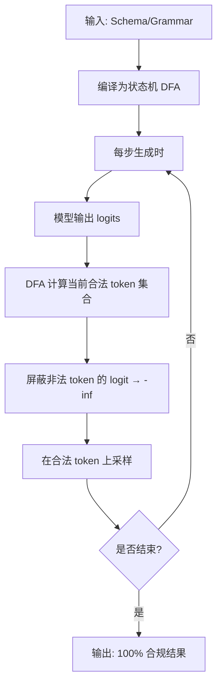
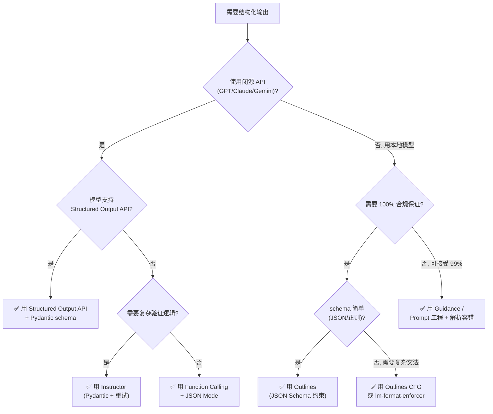
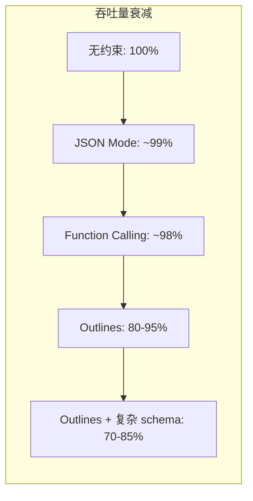

# LLM 结构化输出完全指南

> 中文简称：LLM 结构化输出完全指南

> **一句话理解**: 让 LLM 返回可靠结构化数据的技术全景——从 Function Calling 到约束解码,覆盖原理、框架对比、选型决策与生产故障恢复。

## 目录

1. [为什么需要结构化输出?](#为什么需要结构化输出)
2. [技术方案全景对比](#技术方案全景对比)
3. [Constrained Decoding 原理](#constrained-decoding-原理)
4. [Instructor 详解](#instructor-详解)
5. [PydanticAI 详解](#pydanticai-详解)
6. [Outlines 详解](#outlines-详解)
7. [lm-format-enforcer](#lm-format-enforcer)
8. [Pydantic 模型驱动](#pydantic-模型驱动)
9. [Function Calling vs Structured Output 选型决策树](#function-calling-vs-structured-output-选型决策树)
10. [性能开销对比](#性能开销对比)
11. [生产故障模式与 fallback 策略](#生产故障模式与-fallback-策略)
12. [最佳实践](#最佳实践)

## 为什么需要结构化输出?

LLM 原生输出是自由文本,但生产应用需要可靠的数据结构(如 JSON、Pydantic 对象)。结构化输出是 LLM 从玩具到生产的关键桥梁。

具体痛点:
- **解析失败**: 模型偶尔输出带 markdown 代码块标记的 JSON,导致 `json.loads()` 抛异常
- **字段缺失**: 模型忘记返回某些字段,或返回了多余的"解释性"文本
- **类型不匹配**: 期望 `int` 却得到 `"3"`;期望枚举却得到自由文本
- **Schema 违规**: 嵌套层级错误、数组结构错误、字段名拼写错误
- **下游连锁故障**: 上游一次格式错误,导致整个数据处理管道崩溃

> 据生产实践统计,无约束的 LLM 输出在复杂 schema 下(>10 字段/嵌套 >3 层)首次合规率约 85-92%,意味着每 10 次调用就有 1-2 次需要兜底处理。

## 技术方案全景对比

| 方案 | 原理 | 合规保证 | 适用模型 | 性能开销 |
|------|------|----------|----------|----------|
| **Function Calling** | 模型原生支持函数参数输出 | 训练时对齐,高 | GPT/Claude/Gemini 等主流 API | 几乎为零 |
| **JSON Mode** | API 强制输出合法 JSON | 仅保证是 JSON,不保证 schema | OpenAI/Anthropic 等 | 几乎为零 |
| **Structured Output API** | API 强制 JSON Schema 合规 | 100% schema 合规 | OpenAI gpt-4o-2024-08-06+ | 几乎为零 |
| **Instructor** | Pydantic + 重试机制 | 高(重试兜底) | 任意 API | 重试时翻倍 |
| **PydanticAI** | Agent 框架内置结构化输出 | 高 | 任意 API | 框架开销 |
| **Outlines** | 状态机驱动的受控生成 | 100% 合规 | 本地模型 | 推理时 5-20% |
| **lm-format-enforcer** | 字节级格式强制 | 100% 合规 | 本地模型 | 推理时 5-15% |
| **Guidance** | 模板化受控生成 | 高 | 本地/部分 API | 视复杂度 |

### 按合规保证强度分层



## Constrained Decoding 原理

约束解码(Constrained Decoding)是**在 token 采样阶段屏蔽不合规 token** 的技术,从根本上保证输出格式合规。

### 三种约束方式

#### 1. 正则表达式约束 (Regex Constrained Generation)

将正则编译为 DFA(确定有限自动机),在每一步采样时:
1. 查询 DFA 当前状态下哪些 token 前缀仍能被正则接受
2. 将不合法 token 的 logit 设为 `-inf`
3. 在合法 token 上做 softmax 采样

```python
# Outlines 正则约束示例
from outlines import models, generate

model = models.transformers("mistral-7b")
# 只允许输出电话号码格式
generator = generate.regex(model, r"\(\d{3}\) \d{3}-\d{4}")
result = generator("My phone number is")
# 一定输出 (415) 555-1234 这样的格式
```

#### 2. JSON Schema 约束

将 JSON Schema 转换为 GBNF(GGML BNF)语法或等价的上下文无关文法,然后编译为状态机强制输出合规 JSON。

```python
from pydantic import BaseModel
from outlines import models, generate

class User(BaseModel):
    name: str
    age: int

model = models.transformers("llama-3-8b")
generator = generate.json(model, User)
user = user_generator("Extract: Allen is 30 years old")
# 100% 符合 User schema
```

#### 3. CFG (Context-Free Grammar) 约束

最通用的形式,用上下文无关文法描述任意格式(SQL、数学表达式、特定 DSL):

```python
# Outlines CFG 示例: 强制输出数学表达式
grammar = """
expr    ::= term (("+" | "-") term)*
term    ::= factor (("*" | "/") factor)*
factor  ::= number | "(" expr ")"
number  ::= [0-9]+
"""
generator = generate.cfg(model, grammar)
```

### 约束解码的工作流



> **深入**: → [[05_大模型/16_Constrained_Generation/Constrained_Decoding_2026]] 详解约束解码的工程实现。

## Instructor 详解

[Instructor](https://python.useinstructor.com/) 是最流行的结构化输出库,通过 Pydantic + 自动重试实现高可靠结构化输出:

```python
import instructor
from pydantic import BaseModel, Field, field_validator
from openai import OpenAI

class UserInfo(BaseModel):
    name: str
    age: int
    occupation: str

    @field_validator("age")
    @classmethod
    def check_age(cls, v):
        if v < 0 or v > 150:
            raise ValueError("age must be between 0 and 150")
        return v

client = instructor.from_openai(OpenAI())
user = client.chat.completions.create(
    model="gpt-4o",
    response_model=UserInfo,
    messages=[{"role": "user", "content": "Allen, 30岁, 工程师"}],
    max_retries=3,  # 失败自动重试 3 次
)
# user.name == "Allen", user.age == 30
```

### 核心特性
- **自动重试**: 输出不符合 schema 时自动重试,把上一次错误反馈给模型
- **Pydantic 验证**: 利用 Pydantic 的验证器确保数据质量(含自定义校验)
- **流式支持**: 支持流式结构化输出(部分对象渐进返回)
- **多 provider**: 支持 OpenAI、Anthropic、Gemini、Cohere、Mistral、Ollama 等
- **模式控制**: `mode=instructor.Mode.JSON` / `Mode.TOOLS` / `Mode.JSON_SCHEMA`

### 重试机制的工作原理

```python
# Instructor 内部逻辑(伪代码)
def create_with_retry(messages, response_model, max_retries=3):
    for attempt in range(max_retries):
        try:
            raw = llm.call(messages)
            return response_model.model_validate_json(raw)
        except ValidationError as e:
            # 把错误信息加到对话中,让模型知道哪里错了
            messages.append({"role": "assistant", "content": raw})
            messages.append({
                "role": "user",
                "content": f"Validation error: {e}. Please fix and retry."
            })
    raise InstructorRetryException("Max retries exceeded")
```

## PydanticAI 详解

[PydanticAI](https://ai.pydantic.dev/) 是 Pydantic 团队构建的 Agent 框架:

- 结构化输出作为一等公民
- 内置依赖注入(测试时替换 LLM/外部服务)
- 流式支持
- 类型安全的工具调用
- 测试友好(Mock 模型)

```python
from pydantic_ai import Agent
from pydantic import BaseModel

class Response(BaseModel):
    answer: str
    confidence: float

agent = Agent("openai:gpt-4o", result_type=Response)
result = agent.run_sync("What is the capital of France?")
# result.data.answer == "Paris", result.data.confidence == 0.99
```

## Outlines 详解

[Outlines](https://github.com/dottxt-ai/outlines) 通过受控生成实现结构化输出,是本地模型结构化输出的首选:

- **正则表达式约束**: 编译为 DFA,逐 token 屏蔽非法选择
- **JSON Schema 约束**: 编译为等价 CFG,再转状态机
- **Pydantic 模型约束**: 自动转换为 JSON Schema
- **CFG 约束**: 支持任意上下文无关文法
- **适用于本地模型**: Llama、Mistral、Qwen、Phi 等

### Outlines vs 其他框架

| 特性 | Outlines | lm-format-enforcer | Instructor |
|------|----------|---------------------|------------|
| 工作层级 | 解码层(采样前屏蔽) | 解码层(字节级) | 应用层(重试) |
| 合规保证 | 100% | 100% | 高(重试) |
| 本地模型 | ✅ 原生支持 | ✅ | ❌ 仅 API |
| 闭源 API | ❌ | ❌ | ✅ |
| 性能开销 | 5-20% | 5-15% | 重试时翻倍 |
| 文法支持 | Regex/JSON/CFG/Choice | Regex/JSON | Pydantic |

## lm-format-enforcer

[lm-format-enforcer](https://github.com/damian-romeron/lm-format-enforcer) 是字节级格式强制库,与 Outlines 思路类似但实现不同:

- **字节级状态机**: 在字符级别而非 token 级别做约束,对 tokenizer 更鲁棒
- **与 vLLM/Text-Generation-Inserter 集成**: 作为 logit processor 插入
- **性能更优**: 在某些 schema 下比 Outlines 快 20-40%
- **支持 JSON Schema**: 通过 CharacterLevelParser 解析 schema

```python
# lm-format-enforcer + vLLM
from pydantic import BaseModel
from lmformatenforcer import JsonSchemaParser
from lmformatenforcer.integrations.transformers import build_transformers_prefix_allowed_tokens_fn

class Answer(BaseModel):
    text: str
    score: float

parser = JsonSchemaParser(Answer.model_json_schema())
prefix_fn = build_transformers_prefix_allowed_tokens_fn(tokenizer, parser)

output = model.generate(
    prompt,
    prefix_allowed_tokens_fn=prefix_fn,
)
```

## Pydantic 模型驱动

Pydantic 是结构化输出生态的核心,因为它提供:

### 1. Schema 定义
```python
from pydantic import BaseModel, Field
from typing import Literal, Optional
from enum import Enum

class Sentiment(str, Enum):
    POSITIVE = "positive"
    NEGATIVE = "negative"
    NEUTRAL = "neutral"

class Review(BaseModel):
    text: str = Field(..., description="原始评论文本")
    sentiment: Sentiment
    score: float = Field(..., ge=0, le=1, description="情感分数 0-1")
    keywords: list[str] = Field(default_factory=list, max_length=5)
    summary: Optional[str] = Field(None, max_length=100)
```

### 2. 自定义验证器
```python
from pydantic import field_validator, model_validator

class Order(BaseModel):
    items: list[str]
    total: float

    @field_validator("items")
    @classmethod
    def non_empty(cls, v):
        if not v:
            raise ValueError("items cannot be empty")
        return v

    @model_validator(mode="after")
    def check_total_positive(self):
        if self.total < 0:
            raise ValueError("total must be positive")
        return self
```

### 3. 自动导出 JSON Schema
```python
print(Review.model_json_schema())
# 可直接传给 OpenAI Structured Output API 或 Outlines
```

> **最佳实践**: Pydantic 的 `description` 和 `Field` 约束会被序列化进 JSON Schema,模型会"看到"这些提示——好的描述能显著提升输出质量。

## Function Calling vs Structured Output 选型决策树



### 选型快速对照

| 场景 | 推荐方案 | 理由 |
|------|----------|------|
| 闭源 API + 简单 schema | Structured Output API | 原生支持,零开销 |
| 闭源 API + 复杂验证 | Instructor | 自动重试 + 自定义校验 |
| 本地模型 + JSON 输出 | Outlines JSON | 100% 合规 |
| 本地模型 + 特定 DSL | Outlines CFG | 任意文法 |
| 混合(本地+API) | Instructor(适配层) | 统一接口 |
| 极致吞吐量本地 | lm-format-enforcer | 开销略低 |
| Agent 框架 | PydanticAI | 结构化输出+工具一体 |

## 性能开销对比

约束并非免费——不同方案的延迟和吞吐量代价:

### 延迟开销(单次推理)

| 方案 | 额外延迟 | 说明 |
|------|----------|------|
| Structured Output API | <5ms | 服务端优化 |
| Function Calling | <5ms | 训练时对齐 |
| JSON Mode | <5ms | 服务端实现 |
| Outlines(预处理后) | 5-20% 推理时间 | 状态机查询 |
| Outlines(首次编译) | +数百 ms | schema 编译,可缓存 |
| Instructor 重试 | 每次 +1x 推理 | 失败 N 次则 N 倍 |
| lm-format-enforcer | 5-15% 推理时间 | 字节级解析 |

### 吞吐量影响



### 性能优化技巧

1. **缓存编译结果**: Outlines 的 schema→DFA 编译结果可缓存复用
2. **预编译 grammar**: 服务启动时预编译常用 schema
3. **限制 schema 复杂度**: 深层嵌套/大数组会显著拖慢状态机查询
4. **批量请求时摊薄开销**: 批处理中 DFA 编译只算一次
5. **选择性约束**: 只对关键字段约束,自由字段放开

## 生产故障模式与 fallback 策略

### 常见故障模式

#### 1. Schema 过于严格导致生成质量下降
**现象**: 强约束下模型"束手束脚",输出看似合规但语义空洞。
**原因**: 合法 token 太少,模型无法表达丰富语义。
**对策**: 放宽非关键字段(用 `Optional` 或更宽的 union 类型)。

#### 2. 约束与 tokenizer 冲突
**现象**: 某些 token 跨越 DFA 状态边界,导致合法 token 误判。
**原因**: BPE/SentencePiece 的多字节 token 与字符级 DFA 不对齐。
**对策**: Outlines 会做 token 对齐预处理;lm-format-enforcer 用字节级规避。

#### 3. 超长输出截断
**现象**: 输出达到 max_tokens 时结构未闭合(JSON 不完整)。
**对策**:
- 设置足够大的 `max_tokens`
- 实现尾部修复:自动补全缺失的 `}` 和 `]`
- 用 `Field(max_length=N)` 限制字段长度

#### 4. Function Calling 偶发幻觉
**现象**: 模型返回不存在的函数名或编造参数。
**对策**: 用严格的 Pydantic schema + Instructor 重试兜底。

### Fallback 策略分层

```python
import instructor
from pydantic import BaseModel
import logging

logger = logging.getLogger(__name__)

class OutputModel(BaseModel):
    field_a: str
    field_b: int

async def robust_extract(text: str) -> OutputModel | None:
    """三级 fallback: 约束生成 → 重试 → 解析容错 → 放弃"""
    # Level 1: 尝试 Structured Output API
    try:
        return await client.call_with_structured_output(text)
    except Exception as e:
        logger.warning(f"Structured output failed: {e}")

    # Level 2: Instructor 重试
    try:
        return await instructor_client.create(
            response_model=OutputModel,
            messages=[{"role": "user", "content": text}],
            max_retries=3,
        )
    except Exception as e:
        logger.warning(f"Instructor failed: {e}")

    # Level 3: 裸文本 + 手动解析 + 修复
    try:
        raw = await client.call_plain(text)
        return parse_with_repair(raw)  # 自动修复 JSON
    except Exception as e:
        logger.error(f"All fallbacks failed: {e}")
        return None  # 或返回默认值 / 入死信队列
```

### 监控指标

| 指标 | 告警阈值 | 说明 |
|------|----------|------|
| 首次合规率 | <90% | 模型/约束可能有问题 |
| 平均重试次数 | >1.5 | schema 可能过严 |
| 解析失败率 | >1% | 需要 review fallback 链 |
| P99 延迟 | >基线 3x | 重试风暴 |

## 最佳实践

1. **优先使用 Structured Output API**: 闭源模型原生支持时最可靠、最经济
2. **Pydantic 定义 schema**: 类型安全 + 自动验证 + 自文档化
3. **添加重试机制**: 网络和模型不稳定时的兜底(Instructor 默认 3 次)
4. **宽松到严格**: 先用 JSON Mode 快速验证,再启用 schema 约束
5. **测试边界值**: 用极端输入(超长文本、多语言、空输入)测试鲁棒性
6. **字段加 description**: Pydantic 的 description 会进 schema,指导模型生成
7. **避免过深嵌套**: 超过 3 层嵌套显著降低合规率和生成质量
8. **实现 fallback 链**: 生产环境必须有"约束→重试→解析→默认值"的多级兜底
9. **缓存 DFA 编译**: Outlines/lm-format-enforcer 的编译结果可复用
10. **监控首次合规率**: 这是衡量整个结构化输出管道健康度的核心指标

> **关联**: → [[05_大模型/16_Constrained_Generation/Constrained_Decoding_2026|约束解码深度指南]] | → [[05_大模型/08_Prompt_Engineering/Prompt_Engineering_Complete_Guide|提示词工程]] | → [[15_智能体/GenAI_L11_Integrating_with_Function_Calling|Function Calling]] | → [[90_学习/guides/ai_engineering_roadmap_2026|AI 工程路线图]]
