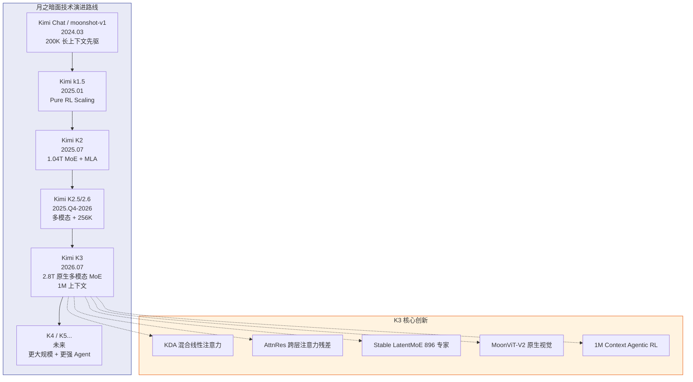

# Kimi K3 技术报告深度解析

> 中文简称：Kimi K3 技术报告深度解析

> **一句话理解**: Kimi K3 是月之暗面 2026年7月发布的全球首个 2.8 万亿参数开源原生多模态 MoE 大模型，通过 KDA 混合线性注意力、Stable LatentMoE、AttnRes 三项核心架构创新，在百万 Token 上下文、编程能力和智能体任务上达到全球第一梯队水平，整体扩展效率较 K2 提升 2.5 倍。

---

## 目录

1. [概述与核心参数](#1-概述与核心参数)
2. [模型架构深度解析](#2-模型架构深度解析)
   - [2.1 KDA (Kimi Delta Attention)](#21-kda-kimi-delta-attention)
   - [2.2 Gated MLA (门控多头潜在注意力)](#22-gated-mla-门控多头潜在注意力)
   - [2.3 Attention Residuals (注意力残差)](#23-attention-residuals-注意力残差)
   - [2.4 Stable LatentMoE (稳定潜在混合专家)](#24-stable-latentmoe-稳定潜在混合专家)
   - [2.5 SiTU-GLU 激活函数](#25-situ-glu-激活函数)
   - [2.6 Quantile Balancing (分位数均衡路由)](#26-quantile-balancing-分位数均衡路由)
   - [2.7 MoonViT-V2 视觉编码器](#27-moonvit-v2-视觉编码器)
3. [训练方法论](#3-训练方法论)
   - [3.1 预训练数据与配方](#31-预训练数据与配方)
   - [3.2 上下文扩展策略](#32-上下文扩展策略)
   - [3.3 Per-Head Muon 优化器](#33-per-head-muon-优化器)
   - [3.4 Moon Clip 二阶优化器](#34-moon-clip-二阶优化器)
   - [3.5 后训练三阶段流水线](#35-后训练三阶段流水线)
   - [3.6 百万上下文智能体强化学习](#36-百万上下文智能体强化学习)
4. [推理优化](#4-推理优化)
   - [4.1 MXFP4 量化感知训练](#41-mxfp4-量化感知训练)
   - [4.2 EAGLE-3 推测解码](#42-eagle-3-推测解码)
   - [4.3 FlashKDA 高性能算子](#43-flashkda-高性能算子)
   - [4.4 Mooncake 分离式推理架构](#44-mooncake-分离式推理架构)
   - [4.5 KV Cache 管理策略](#45-kv-cache-管理策略)
5. [基础设施与系统工程](#5-基础设施与系统工程)
   - [5.1 MoonEP 专家并行](#51-moonep-专家并行)
   - [5.2 KDA 上下文并行](#52-kda-上下文并行)
   - [5.3 AgentENV 微虚拟机沙箱](#53-agentenv-微虚拟机沙箱)
6. [Benchmark 全面分析](#6-benchmark-全面分析)
7. [与 K2 及其他模型的架构对比](#7-与-k2-及其他模型的架构对比)
8. [定价、开源与生态](#8-定价开源与生态)
9. [技术哲学与行业影响](#9-技术哲学与行业影响)
10. [总结与展望](#10-总结与展望)
11. [附录：术语速查表](#11-附录术语速查表)

---

## 1. 概述与核心参数

### 1.1 发布背景

2026年7月27日，月之暗面（Moonshot AI）正式发布 Kimi K3 的完整模型权重、47页技术报告以及三项关键基础设施代码（MoonEP、FlashKDA、AgentENV）。这是继 Kimi K2（2025年7月）一年后的又一次重大迭代，标志着月之暗面从"万亿参数级"迈入"三万亿参数级"时代。

```
Kimi K3 核心参数
═══════════════════════════════════════════════════════════════════

总参数量:         2.8 Trillion (2.8 万亿)
活跃参数量:       104 Billion (1040 亿)
模型层数:         93 layers (+ 1 Dense Layer)
  ├── KDA 层:     69 layers (线性注意力)
  └── Gated MLA:  24 layers (门控潜在注意力)
注意力头数:       96 attention heads
注意力隐藏维度:   7168
专家配置:         896 routing experts + 2 shared experts
每 Token 激活:    16 routing experts (激活率 ~1.8%)
MoE 隐藏维度:     3072 (per expert)
Latent MoE 维度:  3584 (压缩后)
词表大小:         160K tokens
上下文窗口:       1,048,576 tokens (1M)
视觉编码器:       MoonViT-V2 (401M params)
多模态:           原生文本 + 图像理解
优化器:           Per-Head Muon + Moon Clip
训练数据:         ~20T tokens (多模态混合)
量化:             MXFP4 权重 / MXFP8 激活 (QAT)
缩放效率:         较 K2 提升 ~2.5x
许可证:           Kimi K3 License (修改版 MIT)
```

### 1.2 核心定位

Kimi K3 的定位不是"又一个聊天机器人"，而是**开源前沿智能基座（Open Frontier Intelligence）**：
- **编程领域**：Code Arena 全球第一（1679 Elo），超越所有闭源模型
- **智能体领域**：支持百万步长任务迭代，上千次工具调用
- **多模态领域**：原生视觉理解，统一处理文本、图片、视频
- **综合智能**：Artificial Analysis Intelligence Index 全球第四

### 1.3 大白话总览

> 如果把 AI 模型比作一个学生：
> - **K2** 是一个有 384 个专业老师（专家）的学校，每次上课选 8 个老师，能读 12.8 万字的书
> - **K3** 则把老师扩到 896 个，每次选 16 个，能读 100 万字的书。更关键的是，K3 换了一套更高效的学习方法（KDA 注意力 + AttnRes 残差），使得花同样的时间，学到的东西是 K2 的 2.5 倍。而且 K3 不仅能看文字，还能直接看图片和视频，还能在编程比赛里拿全球第一名。

---

## 2. 模型架构深度解析

K3 的架构设计围绕三个核心维度优化信息流通：**序列维度**（KDA + Gated MLA）、**深度维度**（AttnRes）、**通道维度**（Stable LatentMoE）。

```
Kimi K3 架构全景图
═══════════════════════════════════════════════════════════════════

┌─────────────────────────────────────────────────────────────────┐
│                      输入 (Text + Image + Video)                  │
├─────────────────────────────────────────────────────────────────┤
│  ┌──────────────────────┐    ┌──────────────────────────────┐   │
│  │  MoonViT-V2           │    │  Text Tokenizer               │   │
│  │  视觉编码器 (~400M)    │    │  文本分词器                    │   │
│  └──────────┬───────────┘    └──────────────┬───────────────┘   │
│             └──────────────┬───────────────┘                    │
│                            ▼                                     │
├─────────────────────────────────────────────────────────────────┤
│                   93 层 Transformer Block                         │
│                                                                   │
│  ┌─────────────────────────────────────────────────────────┐    │
│  │  Block Pattern (3:1 比例)                                  │    │
│  │  ┌──────────────────────────────────────────────────┐    │    │
│  │  │  Layer 1-3: KDA (Kimi Delta Attention)            │    │    │
│  │  │  ├── 线性注意力 + 通道级遗忘门                     │    │    │
│  │  │  ├── 有界 Scaled Sigmoid 衰减                      │    │    │
│  │  │  └── 固定大小循环状态 (替代 KV Cache)              │    │    │
│  │  └──────────────────────────────────────────────────┘    │    │
│  │  ┌──────────────────────────────────────────────────┐    │    │
│  │  │  Layer 4: Gated MLA (门控多头潜在注意力)          │    │    │
│  │  │  ├── KV Cache 低秩压缩                              │    │    │
│  │  │  ├── 门控机制动态筛选                                │    │    │
│  │  │  └── 全局注意力回溯                                  │    │    │
│  │  └──────────────────────────────────────────────────┘    │    │
│  └─────────────────────────────────────────────────────────┘    │
│                                                                   │
│  ┌─────────────────────────────────────────────────────────┐    │
│  │  Attention Residuals (AttnRes) — Block 级跨层信息检索       │    │
│  │  ├── 每 Block 可读取全部前置 Block 的注意力输出            │    │
│  │  ├── 打破传统逐层残差瓶颈                                  │    │
│  │  ├── O(Ld)→O(Nd) 内存复杂度优化                            │    │
│  │  └── <2% 额外成本，~25% 训练效率提升                       │    │
│  └─────────────────────────────────────────────────────────┘    │
│                                                                   │
│  ┌─────────────────────────────────────────────────────────┐    │
│  │  Stable LatentMoE Feed-Forward                            │    │
│  │  ┌──────────────────────────────────────────────────┐    │    │
│  │  │  Input (7168-dim)                                   │    │    │
│  │  │      │                                               │    │    │
│  │  │      ▼                                               │    │    │
│  │  │  Latent Projection (→ 3584-dim)  ← 压缩一半维度      │    │    │
│  │  │      │                                               │    │    │
│  │  │      ▼                                               │    │    │
│  │  │  RMSNorm → Router → Top-16 Expert Selection         │    │    │
│  │  │      │                                               │    │    │
│  │  │      ├── Expert 1 (SiTU-GLU)  ──┐                    │    │    │
│  │  │      ├── Expert 2 (SiTU-GLU)  ──┤                    │    │    │
│  │  │      ├── ...                     ──┼── Combine       │    │    │
│  │  │      └── Expert 16 (SiTU-GLU) ──┘                    │    │    │
│  │  │                                                       │    │    │
│  │  │  Quantile Balancing: 基于分位数的无辅助损失路由       │    │    │
│  │  └──────────────────────────────────────────────────┘    │    │
│  └─────────────────────────────────────────────────────────┘    │
│                                                                   │
│  RMSNorm + Residual Connection                                    │
└─────────────────────────────────────────────────────────────────┘
                            │
                            ▼
┌─────────────────────────────────────────────────────────────────┐
│                         LM Head (输出头)                          │
└─────────────────────────────────────────────────────────────────┘
```

---

### 2.1 KDA (Kimi Delta Attention)

#### 大白话解释

> **KDA 就像一个聪明的读书笔记系统。** 传统注意力机制要求你每次回答问题都要把整本书从头翻一遍（这会随着书越来越厚而变得越来越慢）。KDA 则是在阅读过程中不断更新一个"动态摘要"——只记录最重要的信息，忘掉不太重要的。当读到新内容时，对照这个摘要决定哪些旧信息留着、哪些可以慢慢忘掉。这样不管你读了多厚的书，回答问题时的成本几乎不变。

#### 专业技术解释

**KDA (Kimi Delta Attention)** 是月之暗面自研的线性注意力变体，基于 Delta 规则（Delta-rule）构建，核心创新在于引入了**通道级别的遗忘门（Channel-wise Forget Gate）**。

**数学原理：**

Delta 规则的核心思想是将注意力计算转化为递归状态更新：
\[
S_t = S_{t-1} \odot \alpha_t + v_t \otimes k_t
\]
\[
o_t = S_t \cdot q_t
\]

其中 \(S_t\) 为循环状态矩阵（固定大小），\(\alpha_t\) 为通道级遗忘门，\(k_t, v_t, q_t\) 分别为键、值、查询向量。

**KDA vs 标准 Softmax Attention 的关键区别：**

| 维度 | 标准 Softmax Attention | KDA (Kimi Delta Attention) |
|------|----------------------|---------------------------|
| **计算复杂度** | \(O(n^2)\) — 随序列长度平方增长 | \(O(n)\) — 线性增长 |
| **状态存储** | 完整 KV Cache，每层每 token 存储 | 固定大小循环状态 \(S_t\) |
| **1M tokens KV Cache** | ~数十 GB per layer（不可接受） | 固定大小，不随长度增长 |
| **遗忘机制** | 无（全量保留） | 通道级有界遗忘门 |
| **长程依赖** | 全局注意力，理论最优 | 近似全局，实际表现优异 |

**K3 的 KDA 改进（相对早期 Kimi Linear）：**

K3 将早期版本中的**无界负 Softplus 遗忘映射**替换为**有界 Scaled Sigmoid**：

```
旧版 (Kimi Linear):
  decay = -softplus(w)  → 无下界，可能无限衰减

K3 版 (KDA):
  decay = σ(w) · scale   → 有界 [0, scale]
  其中 σ 为 Sigmoid 函数，scale 为可学习缩放因子
```

这个改动的意义在于：当序列极长（百万级 Token）时，无界衰减可能导致状态数值溢出或梯度消失。有界约束确保了训练和推理的数值稳定性。

**KDA + Gated MLA 混合策略：**

K3 的 93 层中，69 层使用 KDA，24 层使用 Gated MLA，比例约 **3:1**。每个 Block 包含 3 层 KDA 接 1 层 Gated MLA：
- **KDA 层**：负责高效处理长序列，维护全局状态摘要
- **Gated MLA 层**：负责"回查原文"，对关键细节进行精确检索，弥补线性注意力的近似误差

这种混合设计在长上下文建模效率和表达能力之间取得了最优平衡。

---

### 2.2 Gated MLA (门控多头潜在注意力)

#### 大白话解释

> **Gated MLA 像是 KDA 的"校对员"。** KDA 做了读书笔记后，Gated MLA 会翻回原书对照检查："有没有漏记什么？有没有记错的地方？"它通过一个"门控开关"来决定哪些信息需要重新仔细看，哪些可以快速略过。而且它用了压缩技术，把需要记住的东西压缩成一个小包裹，节省了大量存储空间。

#### 专业技术解释

**Gated MLA (Gated Multi-head Latent Attention)** 是在 DeepSeek 提出的 MLA 基础上增加了门控机制的增强版本。核心思想延续了 MLA 的 KV Cache 低秩压缩，同时引入门控信号动态调节注意力选择。

**标准 MLA 原理回顾：**

MLA 通过对 Key 和 Value 进行低秩联合压缩来减少 KV Cache：
\[
c_t^{KV} = W_{DKV} \cdot h_t \quad \text{(压缩到潜在空间)}
\]
\[
k_t^C = W_{UK} \cdot c_t^{KV}, \quad v_t^C = W_{UV} \cdot c_t^{KV} \quad \text{(推理时解压)}
\]

只需缓存低维的 \(c_t^{KV}\) 而非完整的高维 K、V 向量。

**Gated MLA 的增强：**

Gated MLA 在标准 MLA 的基础上增加了门控机制：
\[
g_t = \sigma(W_g \cdot h_t) \quad \text{(门控信号)}
\]
\[
\text{output} = g_t \odot \text{Attention}(Q, K, V)
\]

门控信号 \(g_t \in (0,1)\) 允许模型动态决定对每个注意力头的输出赋予多少权重——对于不重要的上下文信息，门控趋近于 0，模型可以"选择性地忽略"。

**在 K3 混合架构中的角色：**

| 层类型 | 层数 | 作用 |
|--------|------|------|
| **KDA** | 69 | 高效维护全局状态摘要，线性复杂度 |
| **Gated MLA** | 24 | 精确检索关键信息，弥补近似误差 |

每 4 层中的第 4 层为 Gated MLA，其"翻书回查"机制是 K3 在超长上下文中保持高精度的关键设计。

---

### 2.3 Attention Residuals (注意力残差)

#### 大白话解释

> **AttnRes 就像给每一层模型开了"后门通道"。** 传统 Transformer 中，信息只能一层一层往上传，传到最后就像经历了无数次"传话游戏"，原始细节全磨没了。AttnRes 允许每一层直接查看前面所有层的信息，就像每层都能直接翻看之前所有的笔记，而不仅仅是上一层的笔记。这让模型能记住更多细节，训练也更稳定。

#### 专业技术解释

**Attention Residuals (AttnRes)** 是 K3 提出的一种跨层注意力残差连接机制，旨在打破传统 Transformer 的逐层信息传播瓶颈。

**传统残差连接的问题：**

标准 Transformer 每层的信息流动为：
\[
h_{l+1} = h_l + F_l(h_l)
\]

经过 \(L\) 层后，浅层表征会经历 \(L\) 次残差混合，信号逐渐衰减。深层难以直接获取浅层的原始特征。

**AttnRes 的设计（Block 级实现）：**

AttnRes 将连续多层注意力 + MoE 模块打包为逻辑块（Block），仅在块级别执行跨层注意力残差计算：
\[
\text{AttnOut}_{\text{block}}' = \text{AttnOut}_{\text{block}} + \sum_{i=1}^{\text{prev\_blocks}} \alpha_{\text{block},i} \cdot \text{AttnOut}_i
\]

其中 \(\alpha_{\text{block},i}\) 为可学习的跨块权重。这种 Block 级设计将内存开销从理论 \(O(Ld)\) 降至 \(O(Nd)\) 量级（\(L\) 为总层数，\(N\) 为块数），使"轻量架构"支撑"万亿参数"成为可能。

**关键指标：**

| 指标 | 数值 |
|------|------|
| 额外计算开销 | <2% |
| 训练效率提升 | ~25% |
| GPU 内核优化前延迟 | 283.6 ms |
| GPU 内核优化后延迟 | 114.4 ms（~2.5x 加速） |

AttnRes 的核心价值在于：以极小的额外成本换取显著的信息流动改善，使得 93 层深度网络中的每一层都能充分利用所有前置层的表征。

---

### 2.4 Stable LatentMoE (稳定潜在混合专家)

#### 大白话解释

> **Stable LatentMoE 就像一个超大规模的专家顾问团。** K3 有 896 个专家（比 K2 的 384 个翻了不止一倍），但每次只叫 16 个来干活。为了让 896 个专家不被"饿死"或"累死"，K3 用了三个办法：(1) 先把问题压缩成"电报"再发给专家，节省通信成本；(2) 给每个专家加"保险丝"防止过载；(3) 用一种叫分位数均衡的智能调度，确保每个专家工作量差不多。

#### 专业技术解释

**Stable LatentMoE** 是 K3 针对极高稀疏度 MoE（896 选 16，激活率 <1.8%）设计的稳定训练框架，包含三个层次的技术：

**第一层：Latent Space Compression（潜在空间压缩）**

在路由之前，先将 7168 维隐藏向量压缩到 3584 维：
\[
h_{\text{latent}} = W_{\text{down}} \cdot h \quad (7168 \rightarrow 3584)
\]

压缩后的向量再送入 Router 进行专家选择。这带来两个好处：
1. **通信减半**：跨卡传输的向量维度减半
2. **路由更稳定**：更低维度减少了路由噪声

**第二层：RMSNorm 前置**

在 expert up-projection 之前插入 RMSNorm：
\[
h_{\text{expert}} = \text{RMSNorm}(h_{\text{latent}}) \cdot W_{\text{up}}
\]

这有效抑制了路由分支的激活值爆炸，在极高稀疏度下保持训练稳定。

**第三层：SiTU-GLU + Quantile Balancing**

详见 §2.5 和 §2.6。

**Stable LatentMoE 架构对比：**

| 组件 | 传统 MoE | Stable LatentMoE (K3) |
|------|---------|----------------------|
| 专家数 | 64-256 | **896** |
| 激活专家 | 2-8 | **16** |
| 隐藏维度 | 原始维度 | **压缩 50%** |
| 激活函数 | SwiGLU / GeGLU | **SiTU-GLU** |
| 负载均衡 | 辅助损失 | **Quantile Balancing（无辅助损失）** |
| 归一化 | 仅输出 | **RMSNorm 前置 + 输出** |

---

### 2.5 SiTU-GLU 激活函数

#### 大白话解释

> **SiTU-GLU 就像给神经元的输出加了"天花板和地板"。** 传统激活函数允许输出值无限大，在训练大模型时容易"爆炸"导致崩溃。SiTU 用 Sigmoid 和 Tanh 组合做了一个"软封顶"——接近上限时自动放缓增长，而不会突然截断。这让训练过程更平稳，不容易翻车。

#### 专业技术解释

**SiTU (Sigmoid Tanh Unit)** 是 K3 自研的有界激活函数，用于替代 SwiGLU 作为 MoE 专家中的激活函数。

**SwiGLU 的问题：**

SwiGLU 定义为 \(\text{SwiGLU}(x) = x \cdot \sigma(xW_g) \cdot W_{\text{up}}\)，其值域无上界。在大规模 MoE 训练中，路由分数波动可导致某些专家的激活值持续增长（激活爆炸），引发训练不稳定。

**SiTU-GLU 的设计：**

SiTU 结合 Sigmoid 和 Tanh，实现平滑有界输出：
\[
\text{SiTU}(x) = \sigma(x) \odot \tanh(x)
\]

其中 \(\sigma\)（Sigmoid）提供门控信号（0到1之间），\(\tanh\) 提供有界非线性（-1到1之间）。两者乘积始终落在 \((-1, 1)\) 区间。

**SiTU-GLU 对比 SwiGLU：**

| 特性 | SwiGLU | SiTU-GLU |
|------|--------|----------|
| 值域 | 无界 \((\text{-}\infty, \infty)\) | 有界 \((-1, 1)\) |
| 低精度溢出风险 | 高 | **低（软封顶）** |
| Gate 分支 | \(\sigma(xW_g)\) | 同上，但 up 分支也有界 |
| Up 分支 | 线性 \(xW_{\text{up}}\) | \(\tanh(xW_{\text{up}})\) |
| 训练稳定性 | 依赖梯度裁剪 | **原生稳定** |

**"Smooth Cap" 软封顶的意义：**

与硬截断（如 ReLU6 的 clamp）不同，SiTU 的"软封顶"在接近边界时梯度平滑衰减而非突变，避免了梯度截断带来的训练信号损失。

---

### 2.6 Quantile Balancing (分位数均衡路由)

#### 大白话解释

> **Quantile Balancing 就像一个智能调度系统。** 传统 MoE 模型中，有些专家忙得要死（热门领域），有些专家闲得发慌（冷门领域），需要通过人工调参来平衡。Quantile Balancing 让路由分数自己说话——直接从分数的分布（分位数）来分配任务，不需要任何人工调参。在 896 个专家的规模下，这就像从手工排班变成了 AI 自动排班。

#### 专业技术解释

**Quantile Balancing (QB)** 是 K3 提出的一种无辅助损失（Auxiliary-Loss-Free）的 MoE 负载均衡策略。在 896 个专家、稀疏度极高的场景下，传统基于辅助损失的方法面临两大困境：
1. 辅助损失超参数敏感，需要大量调参
2. 辅助损失可能与主任务损失冲突，损害模型性能

**QB 的核心原理：**

QB 直接从路由分数（Router Logits）的经验分位数推导专家分配阈值，而非通过辅助损失间接调节：

```
传统辅助损失方法:
  L_total = L_task + λ · L_load_balance
  问题: λ 敏感，需要大量调参

Quantile Balancing (K3):
  1. 收集每个专家的路由分数分布
  2. 估计每个专家的分位数阈值 τ_e = Q_p(scores_e)
  3. 基于分位数阈值分配 Token，确保每个专家接收相近数量的 Token
  4. 无需任何超参数 λ
```

**QB 的数学表述：**

对于专家 \(e\)，其分位数阈值 \(\tau_e\) 满足：
\[
\mathbb{P}(\text{score}_e > \tau_e) \approx \frac{\text{target\_capacity}_e}{\text{total\_tokens}}
\]

这使得每个专家处理的 Token 数自然趋近于目标容量，且无需额外损失项。

**QB vs 传统方法的对比：**

| 维度 | 辅助损失方法 | Quantile Balancing |
|------|------------|-------------------|
| 超参数 | 需要 λ（均衡强度） | **0 个超参数** |
| 对主任务影响 | 可能负面 | **无影响**（无额外损失） |
| 均衡精度 | 近似 | **精确分位数匹配** |
| 计算开销 | 低 | **低**（仅排序/分位数估计） |
| 扩展性 | 中等 | **优秀**（896 专家验证） |

---

### 2.7 MoonViT-V2 视觉编码器

#### 大白话解释

> **MoonViT-V2 是 K3 的"眼睛"。** 大多数多模态模型的做法是先拿一个现成的图片识别模型（如 SigLIP）当眼睛，再接到语言模型上。但 K3 选择从零开始训练自己的眼睛——直接从"看图片预测下一个词"的方式学习。这样做的好处是眼睛和大脑更协调，训练更稳定，而且能统一处理图片和视频。

#### 专业技术解释

**MoonViT-V2** 是 K3 的原生视觉编码器，参数量约 4 亿（~400M），核心创新在于完全摒弃了对比学习预训练的依赖。

**与主流方案的区别：**

| 方案 | 代表模型 | 训练方式 |
|------|---------|----------|
| 对比预训练 + 对齐 | GPT-4V, LLaVA 系列 | 先用 SigLIP/CLIP 训练视觉编码器，再与 LLM 对齐 |
| 联合预训练 | Gemini 系列 | 视觉和语言从零联合训练 |
| **Next-Token Prediction** | **K3 (MoonViT-V2)** | 直接用 NTP 损失从零训练视觉编码器 |

**MoonViT-V2 的训练方法：**

MoonViT-V2 直接用 Next-Token Prediction 目标从零训练：
\[
\mathcal{L}_{\text{NTP}} = -\sum_{t} \log P(x_t | x_{<t}, \text{image})
\]

这摒弃了对比学习（如 SigLIP）的两阶段流程，将视觉编码器的训练与语言模型完全统一于同一个目标函数下。

**关键优势：**

1. **梯度更稳定**：对比学习中的 large batch 和 hard negative mining 容易导致训练不稳定，NTP 目标的梯度更平滑
2. **端到端优化**：视觉编码器和语言主干共享同一优化目标，避免了特征空间不对齐的问题
3. **统一架构**：图片和视频使用同一编码器处理，无需额外的视频适配层
4. **免对比预训练**：在达到 SigLIP 初始化基线效果的同时，获得更稳定的优化过程

**梯度范数对比（技术报告数据）：**

MoonViT-V2 在训练过程中的梯度范数波动显著小于 SigLIP 初始化方案，表明其优化路径更加平滑稳定。

---

## 3. 训练方法论

### 3.1 预训练数据与配方

#### 大白话解释

> **K3 的预训练就像给模型准备了一套"百科全书 + 题库 + 代码库"的营养餐。** 不只是大量喂数据，而是精心配比不同类型的数据（文字、代码、数学题、图片），而且同一份知识用不同风格重写多遍，让模型从每个角度都学到东西。就像同一个数学概念，既用教科书语言讲一遍，又用大白话讲一遍，再用代码实现一遍。

#### 专业技术解释

K3 的预训练数据总量约 **20T tokens**，采用多模态混合策略：

```
K3 预训练数据组成
═══════════════════════════════════════════════════════════════════

┌──────────────────────────────────────────────────────────────┐
│  数据来源与大致配比                                            │
│  ├── 文本-代码混合数据                         ~8T tokens    │
│  ├── 数学与推理数据                             ~3T tokens    │
│  ├── 多模态数据（图文对、视频帧）               ~3T tokens    │
│  ├── 高质量知识数据（百科、学术、专业文档）       ~4T tokens    │
│  └── 合成数据（风格改写、数据增强）              ~2T tokens    │
└──────────────────────────────────────────────────────────────┘
```

**关键数据策略：**

1. **Stylistic Rewriting（风格改写）**：同一事实用不同风格重写（正式→口语→技术），最大化每条数据的学习信号密度
2. **多模态混合训练**：文本和视觉数据从预训练阶段即混合输入，而非后训练阶段才加入
3. **数据质量优先**：延续 K2 的数据筛选标准，强调高质量知识数据占比

**数据效率声明：**

月之暗面声称，通过 Per-Head Muon 优化器和数据配方优化，原本需要 **40T 数据** 才能达到的训练效果，现在 **20T 数据** 就能实现。在全球优质训练数据趋于枯竭的背景下，这一数据效率提升具有重要战略意义。

---

### 3.2 上下文扩展策略

#### 大白话解释

> **K3 的上下文扩展就像一个"渐进式马拉松训练"。** 不是一上来就跑 100 万 Token，而是分阶段：先跑 4K（打基础），再跑 32K（适应中等长度），最后冲刺 1M（终极目标）。这种阶梯式训练比一步到位更稳定，不会让模型"拉伤"。

#### 专业技术解释

K3 采用三阶段渐进式上下文扩展：

| 阶段 | 上下文长度 | 训练方法 | 训练目标 |
|------|-----------|----------|----------|
| **Phase 1** | 4K tokens | 标准预训练 | 基础语言能力与知识学习 |
| **Phase 2** | 32K tokens | 上下文退火 (Annealing) | 渐进扩展，避免性能退化 |
| **Phase 3** | 1M tokens | KDA 原生适配（无需 RoPE 插值）| 百万级长上下文外推 |

**与 K2 的关键区别：**

K2 使用 **YaRN (Yet another RoPE extensioN)** 位置编码插值将上下文从 32K 扩展到 128K。K3 由于采用了 KDA 线性注意力，**天然适配长序列**，无需 RoPE 插值等人工扩展手段。KDA 的固定大小循环状态使得上下文长度不增加显存开销。

```
上下文扩展路线对比
═══════════════════════════════════════════════════════════════════

K2 (RoPE + YaRN):
  4K ──→ 32K ──[YaRN 插值]──→ 128K
                                  │
                           需要位置编码外推
                           高频/中频/低频分量分别处理

K3 (KDA 原生):
  4K ──→ 32K ──→ 1M
                    │
             KDA 固定状态大小
             无需位置编码插值
             天然支持任意长度
```

---

### 3.3 Per-Head Muon 优化器

#### 大白话解释

> **Per-Head Muon 就像给每个注意力头分配了专属的"私人教练"。** 传统优化器（如 Adam）对所有参数用同一套更新规则。Per-Head Muon 则为每个注意力头定制优化策略——有的头需要大步快跑，有的头需要小步稳走。这让大规模训练更高效，收敛更快。

#### 专业技术解释

**Per-Head Muon** 是 Muon 优化器（MomentUm Orthogonalized by Newton-schulz）的扩展版本。核心改进是将优化粒度从"整层参数矩阵"细化到"每个注意力头的参数矩阵"。

**Muon 回顾：**

Muon 通过 Newton-Schulz 迭代对动量矩阵进行正交化：
\[
M_t = \beta M_{t-1} + (1-\beta) g_t
\]
\[
\text{Update} = \text{NewtonSchulz}(M_t)
\]

正交化确保了参数更新方向的正交性，避免了更新方向之间的干扰。

**Per-Head 扩展：**

在多头注意力中，每个头有独立的 Q、K、V 权重矩阵。Per-Head Muon 对每个头分别应用 Muon 的动量和正交化：
\[
\text{For head } h: \quad M_t^h = \beta M_{t-1}^h + (1-\beta) g_t^h
\]
\[
\text{Update}^h = \text{NewtonSchulz}(M_t^h)
\]

**优势：**

1. **自适应粒度**：不同头可能关注不同特征模式，独立优化更高效
2. **数值稳定性**：小矩阵的正交化比大矩阵更稳定
3. **Token 效率**：相比全局 Adam，Per-Head Muon 需要更少的训练 Token 即可达到相同性能

---

### 3.4 Moon Clip 二阶优化器

#### 大白话解释

> **Moon Clip 就像一个带"安全阀"的导航系统。** 训练模型就像开车去目的地，优化器是导航。传统导航只看一阶信息（当前位置的坡度），Moon Clip 还看二阶信息（坡度的变化趋势），路线更精准。同时加了"安全阀"——当模型参数更新幅度过大时自动限速，防止"翻车"。

#### 专业技术解释

**Moon Clip** 是月之暗面自研的二阶优化器，结合了二阶优化信息和梯度裁剪机制。技术报告声称，它对 K3 的训练稳定性和数据效率有显著贡献。

**核心设计：**

Moon Clip 在以下方面增强了标准优化器：

1. **二阶信息近似**：利用类似 K-FAC（Kronecker-Factored Approximate Curvature）的方法近似 Fisher 信息矩阵，获得参数空间的曲率信息
2. **自适应步长**：基于曲率动态调整每个参数维度的学习率
3. **梯度裁剪整合**：将梯度裁剪机制直接融入优化器更新步骤，而非作为独立的后处理

**与 Adam 的对比：**

| 维度 | Adam | Moon Clip |
|------|------|-----------|
| 信息阶数 | 一阶（梯度 + 二阶矩估计）| 二阶（曲率近似）|
| 步长适应 | 逐参数标量 | 逐参数矩阵方向 |
| 梯度裁剪 | 外部独立操作 | 内部集成 |
| 数据效率 | 基准 | **宣称 ~2x 提升** |

---

### 3.5 后训练三阶段流水线

#### 大白话解释

> **K3 的后训练就像"理论 + 实习 + 大师班"三阶段培养。** 第一阶段：监督微调打基础，让模型学会好好回答问题。第二阶段：强化学习分领域训练——通用的、写代码的、当智能体的分开练，每个领域还有不同难度的训练档位。第三阶段：让多个顶尖模型当老师，把各自的绝活浓缩到一个 K3 模型里。

#### 专业技术解释

K3 的后训练体系采用完整的**三阶段流水线**：

```
K3 后训练三阶段流水线
═══════════════════════════════════════════════════════════════════

Phase 1: Supervised Fine-Tuning (监督微调)
───────────────────────────────────────────────────────────────────
├── 高质量指令-回复对
├── 多任务覆盖: 代码、数学、写作、分析、多模态
├── 格式对齐: 结构化输出、Markdown、工具调用格式
└── 输出预算控制: 限制冗余输出长度

Phase 2: Multi-Domain RL with Tiered Intensity (分领域多档位强化学习)
───────────────────────────────────────────────────────────────────
┌──────────────────────────────────────────────────────────────┐
│  Domain 1: General Reasoning (通用推理)                       │
│  ├── Tier 1 (轻量): 短链推理，快速响应                        │
│  ├── Tier 2 (中等): 多步推理，中等深度                        │
│  └── Tier 3 (深度): 长链推理，深度思考模式                     │
├──────────────────────────────────────────────────────────────┤
│  Domain 2: Agent Intelligence (智能体)                        │
│  ├── Tier 1: 单步工具调用                                    │
│  ├── Tier 2: 多步任务规划与执行                               │
│  └── Tier 3: 百万步长周期任务 (1M context RL)                 │
├──────────────────────────────────────────────────────────────┤
│  Domain 3: Coding Agent (编程智能体)                          │
│  ├── Tier 1: 单函数生成与修复                                 │
│  ├── Tier 2: 多文件项目工程                                   │
│  └── Tier 3: 全流程软件工程 (芯片设计、科研复现)              │
└──────────────────────────────────────────────────────────────┘

Phase 3: Multi-Teacher Single-Strategy Distillation (多教师单策略蒸馏)
───────────────────────────────────────────────────────────────────
├── 多个教师模型: 不同领域的最强模型
├── 单策略蒸馏: 统一学生模型的推理策略
├── 能力融合: 各领域的优势能力汇集于一个 K3 模型
└── 无损压缩: 保持教师模型能力的同时降低推理成本
```

**关键技术详解：**

| 技术 | 说明 | 目的 |
|------|------|------|
| **Verifiable Rewards** | 代码通过测试用例、数学通过答案验证 | 客观、无偏的奖励信号 |
| **Self-Critique Rubric** | 模型按准确性/完整性/清晰度/深度自评 | 替代人工标注，降低成本 |
| **Output Budget Control** | 严格限制输出长度 | 防止过度啰嗦 |
| **Temperature Decay** | 训练中从高温逐步降至低温 | 先充分探索，后精确收敛 |
| **Auxiliary PTX Loss** | 保留预训练损失项 | 防止灾难性遗忘 |

---

### 3.6 百万上下文智能体强化学习

#### 大白话解释

> **百万上下文 RL 就是让 K3 在"虚拟世界"里练习做复杂任务。** 想象一个实习生需要在 100 万字的项目文档中工作，调用上千次工具，持续工作 24 小时不中断。传统 AI 训练根本模拟不了这种场景。K3 用 AgentENV 微虚拟机搭建了这样的训练环境，让模型在沙箱里反复练习这种超长周期任务。

#### 专业技术解释

K3 的 1M Context Agentic RL 是业界首次将强化学习扩展到百万 Token 上下文的智能体训练。

**核心挑战：**

1. **状态空间爆炸**：1M Token 上下文中，可能的状态组合数量巨大
2. **稀疏奖励**：复杂任务中，正奖励信号可能极为稀疏
3. **长程信用分配**：需要将最终的成功/失败反馈追溯到数千步之前的决策
4. **计算开销**：1M Token 的 RL 单步 Rollout 计算成本巨大

**K3 的解决方案：**

1. **AgentENV 微虚拟机沙箱**（详见 §5.3）：提供可控、可重置的任务执行环境
2. **渐进式上下文扩展 RL**：从短上下文 RL 逐步扩展到百万上下文
3. **分层奖励设计**：结合即时奖励（工具调用成功）和最终奖励（任务完成）
4. **KDA 的高效长序列处理**：KDA 的线性复杂度使得百万 Token 的 RL Rollout 计算可行

---

## 4. 推理优化

### 4.1 MXFP4/MXFP8 量化感知训练

#### 大白话解释

> **MXFP4/MXFP8 量化就像把一本精装大字典压缩成口袋书。** 模型参数本来用 16 位浮点数存储，显存占用大。K3 在训练阶段就让模型适应低位精度——权重用 4 位（MXFP4），激活值用 8 位（MXFP8），推理时直接用压缩版，显存大幅降低，速度显著提升，而且精度损失很小——因为模型在训练时就学会了如何在压缩状态下工作。

#### 专业技术解释

**MXFP4 (Microscaling Floating Point 4-bit)** 和 **MXFP8** 是微软提出的微缩放浮点格式标准。K3 从 SFT 阶段开始采用 **Quantization-Aware Training (QAT)** 策略，使用 MXFP4 权重配合 MXFP8 激活值，实现广泛的硬件兼容性。

**MXFP 格式特点：**

\[
\text{MXFP value} = (-1)^s \times 2^{E_{\text{shared}}} \times m
\]

- MXFP4: 1 位符号 + 2 位指数 + 1 位尾数（每组共享指数）
- MXFP8: 1 位符号 + 4-5 位指数 + 2-3 位尾数（更高精度）
- 相比 FP16，MXFP4 权重显存和带宽需求降低 ~75%
- MXFP8 激活值提供比 INT8 更大的动态范围

**QAT 流程：**

1. 训练中插入"伪量化"算子，模拟 MXFP 格式的量化误差
2. 前向传播使用量化权重，反向传播使用全精度梯度（STE, Straight-Through Estimator）
3. 模型学习在量化约束下保持性能
4. 权重和激活使用不同精度（W4A8），在精度和效率间取得平衡

---

### 4.2 EAGLE-3 推测解码

#### 大白话解释

> **EAGLE-3 就像让模型学会了"预判"。** 传统的 AI 生成文字是一个字一个字往外蹦。EAGLE-3 让模型同时预测接下来可能的好几个字，然后一次性验证对错。这就像一边猜答案一边对答案，猜对了就省时间，猜错了也只是退回重来。实际使用中能快 2-3 倍。

#### 专业技术解释

**EAGLE-3 (Extrapolation Algorithm for Greater Language-model Efficiency v3)** 是一种推测解码（Speculative Decoding）方法。K3 集成了 EAGLE-3 进行推理加速。

**推测解码原理：**

1. **Draft Model**（草稿模型）：一个小型快速模型预测接下来的 \(k\) 个 Token
2. **Target Model**（目标模型，即 K3）：一次性并行验证这 \(k\) 个 Token
3. 验证通过的 Token 直接接受，不通过的丢弃并重新生成

**EAGLE-3 的增强：**

- 基于特征级别的草稿预测（而非 Token 级别），提升接受率
- 支持动态草稿长度，根据上下文难度自适应调整
- 与 KDA 的线性注意力特性协同，验证阶段计算高效

**实际效果：** 在 K3 的部署中，EAGLE-3 在编程场景实现 2-3x 的解码速度提升。

---

### 4.3 FlashKDA 高性能算子

#### 大白话解释

> **FlashKDA 就像给 KDA 注意力机制装上了"涡轮增压"。** KDA 虽然理论上很快，但如果用通用的 GPU 代码来跑，效率还是不够。FlashKDA 是专门针对 KDA 的"定制引擎"，充分利用 GPU 的 Tensor Core 加速，把预填充速度提升了近 2 倍。

#### 专业技术解释

**FlashKDA** 是月之暗面自研的 KDA 高性能 GPU 算子，针对 NVIDIA GPU 架构深度优化。

**优化技术要点：**

1. **全 Tensor Core 化**：KDA 的所有核心计算（矩阵乘、逐元素操作）全部映射到 Tensor Core
2. **共享内存优化**：循环状态 \(S_t\) 常驻共享内存，避免全局内存往返
3. **Warp 级并行**：通道级遗忘门的计算以 Warp 为单位并行
4. **KDA 专用 Kernel Fusion**：状态更新、遗忘门计算、输出投影融合为单个 Kernel

**性能数据（NVIDIA H20 芯片）：**

| 场景 | 标准实现 | FlashKDA | 加速比 |
|------|---------|----------|--------|
| Prefill（预填充）| 基准 | — | **1.72x – 2.22x** |
| Decode（逐 Token 生成）| 基准 | — | 显著加速 |

---

### 4.4 Mooncake 分离式推理架构

#### 大白话解释

> **Mooncake 就像把厨房和服务区分开。** 传统 AI 推理是一台机器既做计算又管存储，互相拖累。Mooncake 把"存储配料"（KV Cache）和"烹饪"（模型计算）分开——预处理好的数据就近缓存，模型只负责计算，不浪费时间去翻找数据。

#### 专业技术解释

**Mooncake** 是月之暗面的分离式推理架构，核心设计是将 Prefill（预填充）和 Decode（解码）阶段分离到不同的硬件资源上，并在两者之间建立高效的 KV Cache 传输通道。

**架构要点：**

```
Mooncake 分离式推理架构
═══════════════════════════════════════════════════════════════════

┌─────────────────────────────────────────────────────────────────┐
│                      Load Balancer                               │
└──────────┬──────────────────────────────────┬───────────────────┘
           │                                  │
           ▼                                  ▼
┌──────────────────────┐          ┌──────────────────────────────┐
│  Prefill Pool         │          │  Decode Pool                  │
│  (预填充节点池)        │  KV Cache│  (解码节点池)                  │
│                      │◄────────►│                              │
│  ├── 高吞吐              │          │  ├── 低延迟                    │
│  ├── 处理新输入           │          │  ├── 逐 Token 生成             │
│  ├── 生成 KV Cache        │          │  ├── 缓存命中率 >90% (编程)    │
│  └── 异步传输到 Decode    │          │  └── 从缓存池加载 KV Cache     │
└──────────────────────┘          └──────────────────────────────┘
```

**缓存命中率与成本：**

| 场景 | 缓存命中率 | 输入成本 (per 1M tokens) |
|------|-----------|------------------------|
| 编程（高重复上下文）| >90% | ¥2（缓存命中价）|
| 通用对话 | ~60-70% | ¥2–¥20 混合 |
| 首次查询 | 0% | ¥20（缓存未命中价）|

---

### 4.5 KV Cache 管理策略

#### 大白话解释

> **K3 的 KV 缓存管理就像图书馆的三级存储系统。** 最常用的书放桌面（GPU 显存），次常用的放书架（外部缓存池），很少用的放仓库（压缩存储）。同时还有"预算调度"——根据问题难度决定缓存多少内容，"感知前缀缓存"——自动识别重复出现的段落避免重复存储。

#### 专业技术解释

K3 的 KV Cache 管理包含三个层面：

**1. 外部 KV Cache 池：**
- 将 KV Cache 卸载到 CPU 内存或 NVMe 存储
- 请求到达时异步加载回 GPU 显存
- 支持跨请求共享缓存

**2. 预算调度（Budget Scheduling）：**
- 每个请求分配 KV Cache 预算
- 根据预计输出长度和优先级动态调整
- 预算用尽时触发缓存逐出

**3. 感知前缀缓存（Prefix-Aware Caching）：**
- 自动检测系统提示和共享前缀
- 相同前缀只缓存一次，所有请求复用
- KDA 的固定状态大小使前缀缓存管理更简单

---

## 5. 基础设施与系统工程

K3 的训练和推理依赖于月之暗面自研的三项关键基础设施技术，这些技术已与模型权重一同开源。

---

### 5.1 MoonEP 专家并行

#### 大白话解释

> **MoonEP 就像一个超级高效的物流系统。** 896 个专家分布在几十上百张 GPU 上，每时每刻都有 Token 需要在不同专家之间传递。MoonEP 做到了"零拷贝传输"——数据不用复制来复制去，直接原地处理。而且确保每个专家的活儿一样多，不会有人闲着有人累趴。

#### 专业技术解释

**MoonEP (Moon Expert Parallelism)** 是专为大规模 MoE 设计的专家并行通信库。

**核心特性：**

1. **零拷贝（Zero-Copy）通信**：Token 在 GPU 间路由时直接在 NVIDIA GPUDirect RDMA 层面完成，无需经过 CPU 内存中转
2. **完美负载均衡**：结合 Quantile Balancing 算法，确保每个专家的 Token 分配量几乎完全相等
3. **All-to-All 优化**：针对 MoE 的 All-to-All 通信模式进行专门优化，减少通信开销
4. **896 专家规模验证**：已在 K3 的 896 专家训练中实战验证

```
MoonEP 通信流程
═══════════════════════════════════════════════════════════════════

Token Dispatch (分发):
  GPU 0: [T1, T2, T3] ──→ Router ──→ Expert 0 (GPU 0)
                    ├──────────────→ Expert 5 (GPU 1)
                    └──────────────→ Expert 12 (GPU 2)

Token Combine (聚合):
  Expert outputs on multiple GPUs ──→ Combine ──→ Next Layer
```

---

### 5.2 KDA 上下文并行

#### 大白话解释

> **KDA 上下文并行就像把一本超长的书分给几个人同时读。** 100 万 Token 的序列被切成多段，分别放在不同 GPU 上处理。独特之处在于 KDA 的固定状态通信开销——不管切多少段，GPU 之间需要同步的信息量是恒定的，不会出现"大家都在等最慢的那个人"的情况。

#### 专业技术解释

**KDA Context Parallelism** 是针对 KDA 线性注意力设计的上下文并行策略。

**与传统序列并行的区别：**

| 维度 | 传统 Ring Attention | KDA 上下文并行 |
|------|-------------------|---------------|
| 通信模式 | 环形传递 KV 块 | 固定大小状态同步 |
| 通信开销 | 随序列长度增长 | **恒定（O(1)）** |
| 算力利用率 | 存在等待时间 | **高利用率** |
| 适用长度 | 中长序列（<256K）| **超长序列（1M+）** |

**核心原理：**

KDA 的循环状态 \(S_t\) 大小固定（\(d \times d\)），在上下文并行中只需同步这个固定大小的矩阵，而非随序列长度增长的 KV Cache。这使得百万 Token 级别的序列可以高效地跨 GPU 并行处理。

---

### 5.3 AgentENV 微虚拟机沙箱

#### 大白话解释

> **AgentENV 就像给 K3 搭建了一个"模拟城市"。** 在真实世界里训练 AI 智能体太危险也太昂贵——万一它不小心删除了服务器文件呢？AgentENV 在隔离的微虚拟机里模拟出完整的工具环境（终端、文件系统、浏览器等），K3 在里面可以随便折腾，犯错了也没关系，重置一下就行了。

#### 专业技术解释

**AgentENV** 是月之暗面与 KVCache.ai 联合开发的微虚拟机沙箱环境，专为大规模智能体任务训练而设计。

**关键特性：**

1. **微虚拟机隔离**：每个 Agent 实例运行在独立的轻量级 VM 中，互不干扰
2. **完整工具链**：内置终端、文件系统、Python 解释器、浏览器等工具
3. **快照与重置**：支持环境快照和快速重置，支持大规模并行 Rollout
4. **百万步长支持**：单个任务可执行上千次工具调用，持续数小时至数十小时
5. **可观测性**：完整的执行轨迹记录，用于训练数据生成和调试

**AgentENV 在 K3 训练中的角色：**

```
AgentENV 训练循环
═══════════════════════════════════════════════════════════════════

┌─────────────────────────────────────────────────────────────────┐
│  K3 模型                                                        │
│  ├── 观察环境状态 + 任务描述                                     │
│  ├── 生成动作（工具调用）                                        │
│  └── 发送动作到 AgentENV                                        │
└───────────────────────────┬─────────────────────────────────────┘
                            │
                            ▼
┌─────────────────────────────────────────────────────────────────┐
│  AgentENV 微虚拟机                                               │
│  ├── 执行工具调用（bash, python, browser, file ops...）          │
│  ├── 收集执行结果和状态变化                                       │
│  ├── 计算奖励信号                                                │
│  └── 返回观察 + 奖励给 K3                                        │
└─────────────────────────────────────────────────────────────────┘
```

---

## 6. Benchmark 全面分析

> 以下数据均来源于 Kimi K3 官方 GitHub README 中的完整评测表（K3 使用 max reasoning effort, temperature=1.0）。

### 6.1 总体定位

技术报告明确指出 K3 的整体性能定位：

> **"略逊于最强的 Claude Fable 5 与 GPT-5.6 Sol，但稳定优于 Claude Opus 4.8、GPT-5.5 和 GLM-5.2。"**

SemiAnalysis 的综合评测将 K3 排在全球第三（仅次于 Fable 5 和 GPT-5.6 Sol），超过 Gemini。

### 6.2 推理与知识 (Reasoning & Knowledge)

| Benchmark | Kimi K3 (max) | Claude Fable 5 | GPT-5.6 Sol | Claude Opus 4.8 | GPT-5.5 | GLM-5.2 |
|-----------|---------------|----------------|-------------|-----------------|---------|---------|
| **GPQA Diamond** | **93.5** | 92.6 | 94.1 | 91.0 | 93.5 | 91.2 |
| **HLE-Full** (w/o / w/ tools) | 43.5 / 56.0 | 53.3 / 63.0 | 44.5 / 58.0 | 49.8 / 57.9 | 41.4 / 52.2 | — |
| **CritPt** | 23.4 | 28.6 | 32.3 | 20.9 | 27.1 | 20.9 |
| **AA-LCR** | **74.7** | 70.0 | 73.7 | 67.7 | 74.3 | 71.3 |

### 6.3 编程能力 (Coding)

| Benchmark | Kimi K3 (max) | Claude Fable 5 | GPT-5.6 Sol | Claude Opus 4.8 | GPT-5.5 | GLM-5.2 |
|-----------|---------------|----------------|-------------|-----------------|---------|---------|
| **DeepSWE** | 67.5 | 70.0 | **73.0** | 59.0 | 67.0 | 46.2 |
| **Terminal-Bench 2.1** | **88.3** | 88.0 | 88.8 | 84.6 | 83.4 | 82.7 |
| **FrontierSWE** | 81.2 | **86.6** | 71.3 | 66.7 | 64.9 | 67.3 |
| **ProgramBench** | **77.8** | 76.8 | 77.6 | 71.9 | 70.8 | 63.7 |
| **SWE-Marathon** | **42.0** | 35.0 | 39.0 | 40.0 | 14.0 | 13.0 |
| **PostTrainBench** | 36.6 | **41.4** | 34.6 | 34.1 | 28.4 | 34.3 |
| **MLS-Bench-Lite** | 48.3 | **49.9** | 46.2 | 42.8 | 35.5 | 40.4 |
| **SciCode** | 58.7 | **60.2** | 56.1 | 53.5 | 56.1 | 50.5 |
| **Kimi Code Bench 2.0** | 72.9 | **76.9** | 64.8 | 71.7 | 69.0 | 64.2 |

> **Code Arena** 盲测排行榜：K3 以 **1679 Elo** 登顶全球第一，超越 Claude Fable 5（1631）和 GPT-5.6 Sol（1618），是首个在此榜单夺冠的开源模型。

> **SWE-Marathon** 是亮点：给模型 24 小时独立做 GPU 内核优化，K3 得分 42.0，**比 Claude Fable 5 高 7 分**。

### 6.4 智能体能力 (Agentic)

| Benchmark | Kimi K3 (max) | Claude Fable 5 | GPT-5.6 Sol | Claude Opus 4.8 | GPT-5.5 | GLM-5.2 |
|-----------|---------------|----------------|-------------|-----------------|---------|---------|
| **BrowseComp** | **91.2** | 88.0 | 90.4 | 84.3 | 84.4 | — |
| **DeepSearchQA (F1)** | **95.0** | 94.2 | — | 93.1 | — | — |
| **MCPMark-Verified** | **94.5** | 87.4 | 92.9 | 76.4 | 92.9 | — |
| **AutomationBench** | **30.8** | 29.1 | 29.7 | 27.2 | 22.7 | 12.9 |
| **OSWorld-Verified** | 84.8 | **85.0** | 83.0 | 83.4 | 79.0 | — |
| **Toolathlon-Verified** | 76.5 | **77.9** | 74.9 | 76.2 | 73.5 | 59.9 |
| **Harvey Lab-AA** | **94.6** | 93.6 | 87.2 | 91.1 | 86.3 | 91.0 |
| **τ³-Banking** | **33.4** | 26.8 | 33.0 | 27.6 | 31.3 | 26.8 |
| **CorpFin v2** | 71.6 | **71.8** | 64.4 | 66.7 | 68.4 | 66.1 |
| **Finance Agent v2** | 54.4 | **56.3** | 53.8 | 53.9 | 51.8 | 49.7 |
| **Legal Research Bench** | 44.2 | **49.5** | 48.1 | 43.8 | 40.4 | 31.3 |
| **GDPval-AA v2 (Elo)** | 1686 | **1747** | 1736 | 1593 | 1491 | 1510 |
| **AA-Briefcase (Elo)** | 1548 | **1583** | 1495 | 1354 | 1158 | 1260 |
| **Agents' Last Exam** | 28.3 | 25.7† | **29.6** | 27.0 | 26.6 | 20.4 |
| **ResearchRubrics** | **76.2** | — | 73.8 | 73.5 | 64.0 | 71.1 |
| **JobBench** | 54.3 | **57.4** | 45.4 | 48.4 | 38.3 | 43.4 |
| **OfficeQA Pro** | 63.3 | **69.9** | 63.2 | 63.9 | 60.9 | 41.4 |
| **SpreadsheetBench 2** | **34.8** | 34.7 | 32.4 | 31.6 | 29.1 | 28.1 |
| **OSWorld 2.0** | 58.3 | **66.1** | 62.6 | 55.7 | 49.5 | — |
| **SaaS-Bench** | 60.1 | — | **61.4** | 56.1 | 43.8 | — |
| **MCP-Atlas** | 84.2 | **84.7** | 83.6 | 83.6 | 82.8 | 82.6 |
| **APEX-Agents** | 41.0 | **43.3** | 39.9 | 39.4 | 38.5 | 35.6 |

### 6.5 视觉能力 (Vision)

| Benchmark | Kimi K3 (max) | Claude Fable 5 | GPT-5.6 Sol | Claude Opus 4.8 | GPT-5.5 |
|-----------|---------------|----------------|-------------|-----------------|---------|
| **OmniDocBench** | **91.1** | 89.8 | 85.8 | 87.9 | 89.4 |
| **Video-MME (w. sub)** | **90.0** | — | 89.5 | 86.0 | 89.3 |
| **MMVU** | **82.1** | — | 81.2 | 79.2 | 81.7 |
| **MMMU-Pro** (w/o / w/ py) | 81.6 / 83.4 | 81.2 / **86.5** | 83.0 / 84.6 | 78.9 / 82.7 | 81.2 / 83.2 |
| **CharXiv (RQ)** (w/o / w/ py) | 84.8 / 91.3 | 88.9 / 93.5 | 84.6 / 89.1 | 80.5 / 89.9 | 84.1 / 89.0 |
| **MathVision** (w/o / w/ py) | 94.3 / 97.8 | 94.8 / 98.6 | 95.8 / 97.8 | 86.7 / 97.1 | 92.2 / 96.8 |
| **ZeroBench (pass@5)** (w/o / w/ py) | 23.0 / 41.0 | 23.0 / 46.0 | 17.0 / 35.0 | 17.0 / 34.0 | 22.0 / 41.0 |
| **WorldVQA** | 51.0 | **56.7** | 41.8 | 39.1 | 38.5 |
| **PerceptionBench** | 58.5 | 57.2 | **59.7** | 47.2 | 55.8 |
| **BabyVision w/ python** | 85.7 | **90.5** | 88.9 | 81.2 | 83.6 |

### 6.6 关键洞察

1. **Agent 能力突出**：在 BrowseComp（91.2）、MCPMark-Verified（94.5）、AutomationBench（30.8）三项 Agent 核心基准上，K3 **超越所有闭源模型**
2. **GPU 内核优化领先**：SWE-Marathon (42.0) 比 Claude Fable 5 高 7 分，证明 K3 在底层系统编程上的独特优势
3. **视觉综合竞争力强**：OmniDocBench (91.1)、Video-MME (90.0)、MMVU (82.1) 三项视觉基准均超越所有对比模型
4. **推理差距可控**：GPQA Diamond (93.5) 仅落后 GPT-5.6 Sol 0.6 分，整体推理能力与顶级闭源模型极为接近

### 6.7 智能体场景案例

| 场景 | 表现 |
|------|------|
| **GPU 内核优化**（24小时自主） | 优化 AttnRes（283.6→114.4ms）、DSA（+55.1%）、KDA（+73.6%）、MLA 内核，性能与 Fable 5 持平 |
| **MiniTriton 编译器开发** | 从零构建类 Triton 编译器（自研 GPU 编译框架），MLIR + PTX 代码生成，性能比肩 Triton/torch.compile，达理论峰值 90% |
| **芯片设计**（48小时自主） | Nangate 45nm 工艺，4mm² 面积，100MHz 时序收敛，8700+ tokens/s 仿真吞吐 |
| **科研代码复现**（2小时） | 交叉验证 20+ 篇论文，生成 3000+ 行 Python，产出交互式 HTML 可视化看板 |
| **视频剪辑** | 从 56 个素材片段中自动剪辑预告片，帧级节拍同步 |
| **百万步长任务** | 支持上千次工具调用的长周期智能体任务 |

---

## 7. 与 K2 及其他模型的架构对比

### 7.1 Kimi K3 vs Kimi K2

| 维度 | Kimi K2 | Kimi K3 | 变化 |
|------|---------|---------|------|
| **总参数量** | 1.04T | 2.8T | +169% |
| **活跃参数量** | 32.6B | 104B | +219% |
| **模型层数** | 61 | 93 (+ 1 Dense) | +54% |
| **注意力头数** | 64 | 96 | +50% |
| **总专家数** | 384 + 1 shared | 896 + 2 shared | +133% |
| **激活专家数** | 8 | 16 | +100% |
| **注意力机制** | MLA | **KDA + Gated MLA 混合 (3:1)** | 架构升级 |
| **注意力残差** | 标准残差 | **AttnRes (Block级跨层注意力残差)** | 新增 |
| **MoE 架构** | 标准 MoE | **Stable LatentMoE** | 架构升级 |
| **激活函数** | SwiGLU | **SiTU-GLU** | 替换 |
| **负载均衡** | 辅助损失 | **Quantile Balancing (无辅助损失)** | 替换 |
| **上下文长度** | 128K | **1,048,576 (1M)** | +719% |
| **词表大小** | — | 160K | 新增 |
| **位置编码** | RoPE + YaRN 插值 | **KDA 原生适配** | 替换 |
| **视觉能力** | 无 | **原生多模态 (MoonViT-V2, 401M)** | 新增 |
| **优化器** | MuonClip | **Per-Head Muon + Moon Clip** | 升级 |
| **训练数据** | 15.5T tokens | ~20T tokens | +29% |
| **量化** | — | MXFP4 权重 / MXFP8 激活 (QAT) | 新增 |
| **缩放效率** | 基准 | **~2.5x 提升** | 质变 |
| **开源许可** | Apache 2.0 | **Kimi K3 License** | 变更 |

### 7.2 Kimi K3 vs 其他头部模型

| 维度 | Kimi K3 | DeepSeek V4 | GLM-5.2 | Claude Fable 5 | GPT-5.6 Sol |
|------|---------|-------------|---------|----------------|-------------|
| **总参数** | 2.8T | 1.6T | 744B | 未公开 | 未公开 |
| **活跃参数** | 104B | 49B | 40B | 未公开 | 未公开 |
| **层数** | 93 + 1 Dense | — | — | 未公开 | 未公开 |
| **注意力头数** | 96 | — | — | 未公开 | 未公开 |
| **专家数** | 896 + 2 shared | 256 + 1 shared | 256 | 未公开 | 未公开 |
| **上下文** | 1M | 1M | 1M | 200K+ | 未公开 |
| **多模态** | 原生 (MoonViT-V2) | 外部视觉 | 外部视觉 | 原生 | 原生 |
| **开源** | ✅ 开放权重 | ✅ 开放权重 | ✅ MIT 开源 | ❌ 闭源 | ❌ 闭源 |
| **量化** | MXFP4/MXFP8 QAT | FP8 | — | — | — |
| **Code Arena** | 🥇 1679 | — | — | 1631 | 1618 |
| **综合智能** | #3-#4 全球 | — | — | #1-#2 | #1-#2 |
| **词表** | 160K | — | — | — | — |

### 7.3 技术路线差异化总结

```
顶级模型技术路线对比
═══════════════════════════════════════════════════════════════════

注意力机制:
  Kimi K3:     KDA (线性) + Gated MLA ── 混合路线
  DeepSeek:    MLA ── 纯潜在注意力
  GLM:         MLA + DSA ── 潜在注意力 + 差分注意力
  Claude/GPT:  未公开/标准注意力变体

MoE 路由:
  Kimi K3:     Quantile Balancing (无辅助损失)
  DeepSeek:    辅助损失 + 设备级均衡
  GLM:         IndexShare (每4层共享 indexer)

多模态:
  Kimi K3:     原生从零训练 (MoonViT-V2, NTP 目标)
  GPT/Claude:  原生联合训练
  GLM:         外部视觉编码器对齐

开源策略:
  Kimi K3:     开放权重 + Infra 代码 + 技术报告
  DeepSeek:    全量开源
  GLM:         MIT 纯开源
  Claude/GPT:  完全闭源
```

---

## 8. 定价、开源与生态

### 8.1 API 定价

| 计费项 | 价格 (per 1M tokens) |
|--------|---------------------|
| 输入（缓存命中）| ¥2 |
| 输入（缓存未命中）| ¥20 |
| 输出 | ¥100 |

**第三方成本测算（Artificial Analysis）：**

| 模型 | 单任务成本 |
|------|-----------|
| Kimi K3 | ~$0.94 |
| GPT-5.6 Sol | ~$1.04 |
| Claude Opus 4.8 | ~$1.80 |

K3 以接近 GPT-5.6 Sol 的成本提供了 Claude Opus 4.8 约一半的价格。

### 8.2 开源内容

| 开源项 | 内容 | 许可 |
|--------|------|------|
| **模型权重** | K3 完整权重（2.8T 参数）| Kimi K3 License |
| **技术报告** | 47 页 PDF 完整技术报告 | — |
| **MoonEP** | 专家并行通信库源码 | 开源 |
| **FlashKDA** | KDA 高性能 GPU 算子源码 | 开源 |
| **AgentENV** | 微虚拟机沙箱框架源码 | 开源 |

### 8.3 Kimi K3 License 要点

- 学术研究和个人使用免费
- 企业商业化：月活超 1 亿或月收入超 2000 万美元需另签协议
- 需在界面显著位置标注"Powered by Kimi K3"

### 8.4 平台生态与推理引擎

| 平台 | 可用性 |
|------|--------|
| kimi.com 网页版 | ✅ 即日可用 |
| Kimi 手机 App | ✅ 即日可用 |
| Kimi Work 桌面客户端 | ✅ 即日可用 |
| Kimi Code CLI | ✅ 即日可用（推荐 Agent 框架）|
| Kimi API (platform.kimi.ai) | ✅ 即日可用（OpenAI/Anthropic 兼容）|
| Hugging Face | ✅ 权重下载 |
| Cursor | ✅ 已接入 |
| Devin (Cognition) | ✅ 桌面 + CLI 已接入 |
| Nebius / Baseten / Fireworks | ✅ Day 0 适配 |

**推荐推理引擎：**

| 引擎 | 说明 |
|------|------|
| **vLLM** | 官方提供 recipes，推荐生产部署 |
| **SGLang** | 官方提供 cookbook |
| **TokenSpeed** | 官方提供 recipes |

**Thinking Effort 控制：**

K3 始终启用思考模式（thinking enabled），通过 `reasoning_effort` 参数控制推理深度：

| 档位 | 说明 | 适用场景 |
|------|------|----------|
| **low** | 轻量推理，快速响应 | 简单问答、信息检索 |
| **high** | 中等深度推理 | 代码审查、文档分析 |
| **max** (默认) | 最大推理深度 | 复杂编程、数学证明、Agent 任务 |

多轮对话中，K3 需要保留完整的 `reasoning_content`（思维链内容）以维持上下文连贯性。

---

## 9. 技术哲学与行业影响

### 9.1 K3 的技术哲学

```
Kimi K3 技术哲学
═══════════════════════════════════════════════════════════════════

1. "Scaling Efficiency > Scaling Size"
   ───────────────────────────────────────────────────────────────
   • 不只是堆参数，而是让每个参数发挥更大价值
   • 2.5x 缩放效率意味着同样的算力预算可以做更大的事
   • 数据效率同样关键：20T 数据达到别人 40T 的效果

2. "Architecture Innovation for the Next Scale"
   ───────────────────────────────────────────────────────────────
   • KDA + AttnRes 不是为 K3 设计的，是为 K4、K5 铺路
   • 线性注意力 + 跨层残差是走向更大规模的基础设施

3. "Agent-First Training"
   ───────────────────────────────────────────────────────────────
   • 从训练阶段就面向智能体任务设计
   • AgentENV + 百万上下文 RL 是 Agentic AI 的训练基建

4. "Open by Default"
   ───────────────────────────────────────────────────────────────
   • 模型权重 + 技术报告 + Infra 代码三位一体开源
   • 推动全球开源 AI 生态发展
```

### 9.2 行业影响

1. **"第二次 DeepSeek 冲击"**：华尔街分析师将 K3 发布视为继 DeepSeek-R1 之后中国 AI 产业的第二次重大冲击
2. **开源 vs 闭源差距抹平**：K3 在 Code Arena 超越所有闭源模型，证明在编程这一核心赛道，开源已追平甚至超越闭源
3. **资本市场震动**：K3 发布当周，Z.ai 港股盘中一度跌 30%，MiniMax 跌 16%
4. **Moonshot 财务指标**：API 收入超七成来自海外，ARR 突破 3 亿美元，估值 315 亿美元
5. **国产算力生态**：K3 的部署能力已突破英伟达生态，适配国产芯片

---

## 10. 总结与展望

### 10.1 技术路线演进



### 10.2 关键结论

| 维度 | 评估 |
|------|------|
| **技术深度** | 从 KDA 线性注意力到 Stable LatentMoE 再到 MoonViT-V2，全栈自研架构创新 |
| **工程能力** | MoonEP + FlashKDA + AgentENV 三项 Infra 开源，体现系统工程实力 |
| **性能水平** | Code Arena 全球第一，综合智能全球第四 |
| **开源贡献** | 全球最大开源模型 + 完整技术报告 + Infra 代码 |
| **商业落地** | ARR $3 亿美元，70%+ 海外收入，多平台覆盖 |
| **缩放效率** | 较 K2 提升 2.5x，为更大规模模型铺路 |

### 10.3 未来展望

1. **K4/K5 更大规模**：KDA + AttnRes 架构为万亿级以上扩展奠定基础
2. **Agent 生态深化**：AgentENV + 百万上下文 RL 将推动智能体能力进一步发展
3. **多模态增强**：从视觉扩展到语音、视频生成等更多模态
4. **国产算力适配**：进一步突破英伟达生态依赖
5. **端侧部署**：量化 + 蒸馏技术可能使 K3 衍生出端侧版本

---

## 11. 附录：术语速查表

| 术语 | 英文全称 | 大白话解释 | 在 K3 中的角色 |
|------|----------|-----------|---------------|
| **KDA** | Kimi Delta Attention | 动态摘要式注意力，边读边做笔记 | 69层主力注意力，实现 1M 上下文 |
| **Gated MLA** | Gated Multi-head Latent Attention | 带开关的压缩注意力，能选择性回查原文 | 24层补充注意力，弥补线性近似误差 |
| **AttnRes** | Attention Residuals | 跨层后门通道，每层能看所有前层笔记 | 打破信息传播瓶颈，提升 25% 效率 |
| **Stable LatentMoE** | — | 896个专家的稳定调度系统 | 极端稀疏下的训练稳定性保障 |
| **SiTU-GLU** | Sigmoid Tanh Unit GLU | 带天花板和地板的激活函数 | 防止训练"爆炸" |
| **QB** | Quantile Balancing | 基于分位数的智能排班 | 无超参的专家负载均衡 |
| **MoonViT-V2** | — | K3 自研的眼睛，从零学看图 | 原生视觉理解，统一处理图/视频 |
| **MoonEP** | Moon Expert Parallelism | 专家间的零拷贝物流系统 | 896 专家跨 GPU 高效通信 |
| **FlashKDA** | — | KDA 的 GPU 涡轮增压 | 1.7-2.2x 预填充加速 |
| **AgentENV** | — | 给 K3 练习用的模拟城市 | 百万步长智能体训练环境 |
| **EAGLE-3** | Extrapolation Algorithm for Greater Language-model Efficiency v3 | 预判式加速生成 | 2-3x 解码速度提升 |
| **MXFP4/MXFP8** | Microscaling Floating Point 4/8-bit | 把大字典压成口袋书 | 权重 4-bit + 激活 8-bit 量化推理 |

---

## 延伸阅读

### 项目内部参考
- [[05_大模型/14_中国LLM生态/13_Kimi_Moonshot_深入分析]] — Kimi K2 及 Moonshot AI 全系列深度技术分析
- [[05_大模型/14_中国LLM生态/README]] — 中国大模型生态全景对比
- [[05_大模型/04_LLM架构/12_MoE_Case_Studies_DeepSeek_Mixtral]] — MoE 架构设计与路由策略详解
- [[05_大模型/03_Transformer架构/05_Transformer_大白话入门]] — Transformer 架构家族演化

### 外部资源
- Kimi K3 官方仓库: https://github.com/MoonshotAI/Kimi-K3
- Kimi K3 技术报告: k3_tech_report.pdf (GitHub 仓库内)
- Moonshot AI 官网: https://www.moonshot.cn
- Kimi API 平台: https://platform.kimi.ai
- Kimi Chat: https://kimi.com

---

*Last updated: 2026-08-03*
