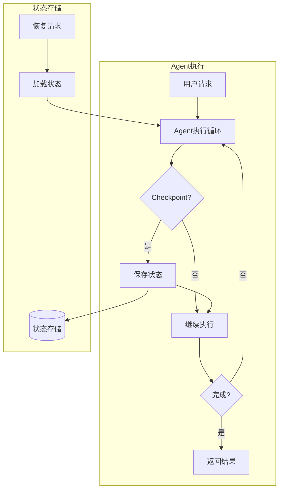
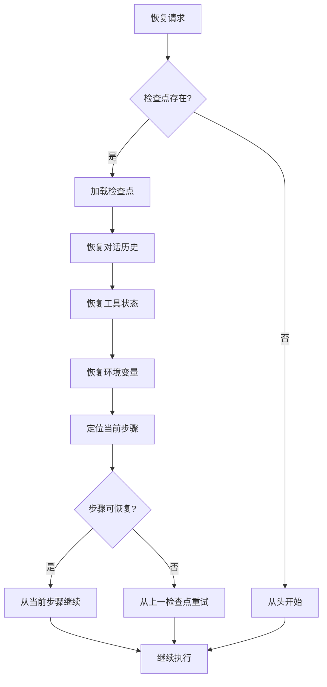

# Agent 状态管理 (Agent State Management)

> **一句话理解**: Agent 状态管理让 AI 智能体具备"记忆"和"恢复"能力——就像游戏存档一样，随时暂停、随时继续，不怕意外中断。

---

## 1. 为什么需要状态管理？

### 1.1 核心问题

| 问题场景 | 无状态管理 | 有状态管理 |
|---------|-----------|-----------|
| 长任务中断 | 全部重来，浪费时间和成本 | 从断点继续，无需重复 |
| 服务崩溃 | 用户体验中断 | 自动恢复，用户无感知 |
| 调试排障 | 无法复现问题 | 回放执行轨迹 |
| 成本控制 | 重复调用 API | 避免重复计算 |

### 1.2 典型应用场景

```
场景1: 复杂研究报告生成 (30+ 步骤)
├─ 步骤1-10: 文献搜索
├─ 步骤11-20: 数据分析  ← 如果这里崩溃？
├─ 步骤21-30: 报告撰写
└─ 无状态管理: 从步骤1重新开始，重复花费 $50
   有状态管理: 从步骤11继续，仅需 $5

场景2: 自动化运维任务
├─ 检查集群状态
├─ 执行故障修复  ← 如果网络断开？
├─ 验证修复结果
└─ 无状态管理: 需要人工介入确认
   有状态管理: 自动恢复并继续
```

---

## 2. 核心概念

### 2.1 状态管理架构



### 2.2 状态类型定义

| 状态类型 | 说明 | 存储内容 |
|---------|------|---------|
| **对话状态** | 多轮对话上下文 | 消息历史、用户意图 |
| **执行状态** | 任务执行进度 | 当前步骤、已完成步骤 |
| **工具状态** | 工具调用记录 | 调用参数、返回结果 |
| **环境状态** | 外部环境信息 | 变量值、连接状态 |
| **元状态** | 执行元数据 | 开始时间、Token消耗、成本 |

### 2.3 状态数据模型

```python
from dataclasses import dataclass, field
from typing import Any, Optional
from datetime import datetime
from enum import Enum

class AgentStateStatus(Enum):
    """Agent 状态枚举"""
    PENDING = "pending"        # 待执行
    RUNNING = "running"        # 执行中
    PAUSED = "paused"          # 已暂停
    COMPLETED = "completed"    # 已完成
    FAILED = "failed"          # 已失败

@dataclass
class Checkpoint:
    """检查点数据结构"""
    checkpoint_id: str                    # 唯一标识
    task_id: str                          # 任务ID
    timestamp: datetime                   # 创建时间
    step_index: int                       # 当前步骤索引
    total_steps: int                      # 总步骤数
    
    # 核心状态
    messages: list[dict]                  # 对话历史
    current_step: dict                    # 当前步骤信息
    completed_steps: list[dict]           # 已完成步骤
    
    # 工具状态
    tool_calls: list[dict]                # 工具调用记录
    tool_results: dict[str, Any]          # 工具结果缓存
    
    # 环境状态
    variables: dict[str, Any]             # 上下文变量
    external_state: dict[str, Any]        # 外部状态引用
    
    # 元数据
    tokens_used: int = 0                  # Token消耗
    cost_usd: float = 0.0                 # 成本(美元)
    parent_checkpoint_id: Optional[str] = None  # 父检查点

@dataclass
class AgentState:
    """Agent 完整状态"""
    state_id: str
    status: AgentStateStatus
    created_at: datetime
    updated_at: datetime
    
    # 当前检查点
    current_checkpoint: Optional[Checkpoint] = None
    
    # 检查点历史 (用于回滚)
    checkpoint_history: list[Checkpoint] = field(default_factory=list)
    
    # 错误信息
    last_error: Optional[str] = None
    retry_count: int = 0
```

---

## 3. 状态持久化实现

### 3.1 存储后端选择

| 存储类型 | 适用场景 | 优点 | 缺点 |
|---------|---------|------|------|
| **内存** | 短期任务、测试 | 极快速度 | 不持久 |
| **Redis** | 高频访问、分布式 | 快速、支持TTL | 需要额外服务 |
| **PostgreSQL** | 企业级、需要查询 | 可靠、支持复杂查询 | 相对较慢 |
| **S3/OSS** | 大状态、冷存储 | 成本低、容量大 | 延迟高 |

### 3.2 状态存储抽象层

```python
from abc import ABC, abstractmethod
from typing import Optional
import json
import redis
import boto3

class StateStore(ABC):
    """状态存储抽象接口"""
    
    @abstractmethod
    async def save(self, checkpoint: Checkpoint) -> bool:
        """保存检查点"""
        pass
    
    @abstractmethod
    async def load(self, checkpoint_id: str) -> Optional[Checkpoint]:
        """加载检查点"""
        pass
    
    @abstractmethod
    async def delete(self, checkpoint_id: str) -> bool:
        """删除检查点"""
        pass
    
    @abstractmethod
    async def list_by_task(self, task_id: str) -> list[Checkpoint]:
        """列出任务的所有检查点"""
        pass

class RedisStateStore(StateStore):
    """Redis 状态存储实现"""
    
    def __init__(self, redis_url: str, ttl_seconds: int = 86400):
        self.client = redis.from_url(redis_url)
        self.ttl = ttl_seconds
    
    async def save(self, checkpoint: Checkpoint) -> bool:
        key = f"checkpoint:{checkpoint.checkpoint_id}"
        data = self._serialize(checkpoint)
        return self.client.setex(key, self.ttl, data)
    
    async def load(self, checkpoint_id: str) -> Optional[Checkpoint]:
        key = f"checkpoint:{checkpoint_id}"
        data = self.client.get(key)
        if data:
            return self._deserialize(data)
        return None
    
    async def delete(self, checkpoint_id: str) -> bool:
        key = f"checkpoint:{checkpoint_id}"
        return self.client.delete(key) > 0
    
    async def list_by_task(self, task_id: str) -> list[Checkpoint]:
        pattern = f"checkpoint:*:{task_id}:*"
        keys = self.client.keys(pattern)
        checkpoints = []
        for key in keys:
            data = self.client.get(key)
            if data:
                checkpoints.append(self._deserialize(data))
        return checkpoints
    
    def _serialize(self, checkpoint: Checkpoint) -> bytes:
        # 转换为可序列化格式
        data = {
            'checkpoint_id': checkpoint.checkpoint_id,
            'task_id': checkpoint.task_id,
            'timestamp': checkpoint.timestamp.isoformat(),
            'step_index': checkpoint.step_index,
            'total_steps': checkpoint.total_steps,
            'messages': checkpoint.messages,
            'current_step': checkpoint.current_step,
            'completed_steps': checkpoint.completed_steps,
            'tool_calls': checkpoint.tool_calls,
            'tool_results': checkpoint.tool_results,
            'variables': checkpoint.variables,
            'external_state': checkpoint.external_state,
            'tokens_used': checkpoint.tokens_used,
            'cost_usd': checkpoint.cost_usd,
            'parent_checkpoint_id': checkpoint.parent_checkpoint_id,
        }
        return json.dumps(data).encode('utf-8')
    
    def _deserialize(self, data: bytes) -> Checkpoint:
        obj = json.loads(data.decode('utf-8'))
        return Checkpoint(
            checkpoint_id=obj['checkpoint_id'],
            task_id=obj['task_id'],
            timestamp=datetime.fromisoformat(obj['timestamp']),
            step_index=obj['step_index'],
            total_steps=obj['total_steps'],
            messages=obj['messages'],
            current_step=obj['current_step'],
            completed_steps=obj['completed_steps'],
            tool_calls=obj['tool_calls'],
            tool_results=obj['tool_results'],
            variables=obj['variables'],
            external_state=obj['external_state'],
            tokens_used=obj['tokens_used'],
            cost_usd=obj['cost_usd'],
            parent_checkpoint_id=obj.get('parent_checkpoint_id'),
        )

class S3StateStore(StateStore):
    """S3 状态存储实现 (适合大状态)"""
    
    def __init__(self, bucket: str, prefix: str = "agent-states/"):
        self.s3 = boto3.client('s3')
        self.bucket = bucket
        self.prefix = prefix
    
    async def save(self, checkpoint: Checkpoint) -> bool:
        key = f"{self.prefix}{checkpoint.task_id}/{checkpoint.checkpoint_id}.json"
        data = self._serialize(checkpoint)
        self.s3.put_object(Bucket=self.bucket, Key=key, Body=data)
        return True
    
    async def load(self, checkpoint_id: str) -> Optional[Checkpoint]:
        # 需要通过 task_id 和 checkpoint_id 构建 key
        # 实际实现需要额外的索引机制
        pass
```

### 3.3 检查点策略

```python
from enum import Enum
from typing import Callable

class CheckpointStrategy(Enum):
    """检查点策略"""
    EVERY_STEP = "every_step"        # 每步保存
    ON_SUCCESS = "on_success"        # 步骤成功后保存
    TIME_BASED = "time_based"        # 基于时间间隔
    COST_BASED = "cost_based"        # 基于成本阈值
    CUSTOM = "custom"                # 自定义条件

class CheckpointManager:
    """检查点管理器"""
    
    def __init__(
        self,
        store: StateStore,
        strategy: CheckpointStrategy = CheckpointStrategy.ON_SUCCESS,
        interval_seconds: int = 60,
        cost_threshold: float = 0.5,
        custom_condition: Callable[[Checkpoint], bool] = None
    ):
        self.store = store
        self.strategy = strategy
        self.interval_seconds = interval_seconds
        self.cost_threshold = cost_threshold
        self.custom_condition = custom_condition
        self.last_checkpoint_time = datetime.now()
    
    def should_checkpoint(self, checkpoint: Checkpoint) -> bool:
        """判断是否需要创建检查点"""
        if self.strategy == CheckpointStrategy.EVERY_STEP:
            return True
        
        elif self.strategy == CheckpointStrategy.ON_SUCCESS:
            return checkpoint.current_step.get('status') == 'success'
        
        elif self.strategy == CheckpointStrategy.TIME_BASED:
            elapsed = (datetime.now() - self.last_checkpoint_time).total_seconds()
            return elapsed >= self.interval_seconds
        
        elif self.strategy == CheckpointStrategy.COST_BASED:
            return checkpoint.cost_usd >= self.cost_threshold
        
        elif self.strategy == CheckpointStrategy.CUSTOM:
            return self.custom_condition(checkpoint) if self.custom_condition else False
        
        return False
    
    async def create_checkpoint(
        self, 
        checkpoint: Checkpoint
    ) -> str:
        """创建并保存检查点"""
        # 生成唯一ID
        checkpoint.checkpoint_id = self._generate_id(checkpoint.task_id)
        checkpoint.timestamp = datetime.now()
        
        # 保存到存储
        await self.store.save(checkpoint)
        
        # 更新最后检查点时间
        self.last_checkpoint_time = datetime.now()
        
        return checkpoint.checkpoint_id
    
    def _generate_id(self, task_id: str) -> str:
        import uuid
        return f"{task_id}_{uuid.uuid4().hex[:8]}"
```

---

## 4. 断点续传实现

### 4.1 恢复流程



### 4.2 状态恢复器

```python
class StateRecovery:
    """状态恢复器"""
    
    def __init__(self, store: StateStore):
        self.store = store
    
    async def recover(
        self, 
        checkpoint_id: str,
        agent_executor  # Agent 执行器
    ) -> dict:
        """从检查点恢复执行"""
        
        # 1. 加载检查点
        checkpoint = await self.store.load(checkpoint_id)
        if not checkpoint:
            raise ValueError(f"检查点不存在: {checkpoint_id}")
        
        # 2. 恢复对话历史
        agent_executor.messages = checkpoint.messages
        
        # 3. 恢复工具结果缓存
        agent_executor.tool_result_cache = checkpoint.tool_results
        
        # 4. 恢复环境变量
        agent_executor.variables = checkpoint.variables
        
        # 5. 恢复外部状态
        await self._restore_external_state(checkpoint.external_state)
        
        # 6. 返回恢复信息
        return {
            'checkpoint_id': checkpoint_id,
            'task_id': checkpoint.task_id,
            'step_index': checkpoint.step_index,
            'total_steps': checkpoint.total_steps,
            'resumable': True,
            'message': f"从步骤 {checkpoint.step_index}/{checkpoint.total_steps} 恢复"
        }
    
    async def _restore_external_state(self, external_state: dict):
        """恢复外部状态 (如数据库连接、文件句柄等)"""
        for key, state in external_state.items():
            if state.get('type') == 'database_connection':
                # 恢复数据库连接
                pass
            elif state.get('type') == 'file_handle':
                # 恢复文件句柄
                pass
```

### 4.3 带状态管理的 Agent 执行器

```python
from dataclasses import dataclass
from typing import Any, Callable
import asyncio

@dataclass
class ExecutionConfig:
    """执行配置"""
    max_steps: int = 20
    checkpoint_strategy: CheckpointStrategy = CheckpointStrategy.ON_SUCCESS
    auto_resume: bool = True
    max_retries: int = 3

class StatefulAgentExecutor:
    """带状态管理的 Agent 执行器"""
    
    def __init__(
        self,
        llm,                    # LLM 实例
        tools: list,            # 工具列表
        store: StateStore,      # 状态存储
        config: ExecutionConfig = None
    ):
        self.llm = llm
        self.tools = {t.name: t for t in tools}
        self.store = store
        self.config = config or ExecutionConfig()
        
        # 状态
        self.messages: list[dict] = []
        self.tool_result_cache: dict[str, Any] = {}
        self.variables: dict[str, Any] = {}
        self.current_checkpoint: Optional[Checkpoint] = None
        self.checkpoint_manager = CheckpointManager(
            store=store,
            strategy=config.checkpoint_strategy if config else CheckpointStrategy.ON_SUCCESS
        )
    
    async def run(
        self, 
        task: str, 
        checkpoint_id: Optional[str] = None
    ) -> dict:
        """执行任务"""
        
        # 恢复或初始化
        if checkpoint_id:
            recovery = await self._recover(checkpoint_id)
            start_step = recovery['step_index']
            task_id = recovery['task_id']
        else:
            self._init_state(task)
            start_step = 0
            task_id = self._generate_task_id()
        
        # 创建初始检查点
        self.current_checkpoint = Checkpoint(
            checkpoint_id="",
            task_id=task_id,
            timestamp=datetime.now(),
            step_index=start_step,
            total_steps=self.config.max_steps,
            messages=self.messages.copy(),
            current_step={},
            completed_steps=[],
            tool_calls=[],
            tool_results=self.tool_result_cache.copy(),
            variables=self.variables.copy(),
            external_state={}
        )
        
        # 执行循环
        step = start_step
        while step < self.config.max_steps:
            step += 1
            
            try:
                # 执行一步
                result = await self._execute_step(step)
                
                # 更新检查点
                self.current_checkpoint.step_index = step
                self.current_checkpoint.messages = self.messages.copy()
                self.current_checkpoint.completed_steps.append({
                    'step': step,
                    'result': result,
                    'timestamp': datetime.now().isoformat()
                })
                
                # 检查是否需要保存检查点
                if self.checkpoint_manager.should_checkpoint(self.current_checkpoint):
                    await self.checkpoint_manager.create_checkpoint(self.current_checkpoint)
                
                # 检查是否完成
                if result.get('finished'):
                    return {
                        'status': 'completed',
                        'output': result.get('output'),
                        'steps': step,
                        'checkpoint_id': self.current_checkpoint.checkpoint_id
                    }
                
            except Exception as e:
                # 错误处理
                self.current_checkpoint.last_error = str(e)
                
                if self.config.auto_resume:
                    # 自动保存检查点以便恢复
                    await self.checkpoint_manager.create_checkpoint(self.current_checkpoint)
                
                # 重试逻辑
                if self.current_checkpoint.retry_count < self.config.max_retries:
                    self.current_checkpoint.retry_count += 1
                    continue
                
                return {
                    'status': 'failed',
                    'error': str(e),
                    'checkpoint_id': self.current_checkpoint.checkpoint_id,
                    'recoverable': True
                }
        
        return {
            'status': 'max_steps_reached',
            'checkpoint_id': self.current_checkpoint.checkpoint_id
        }
    
    async def _recover(self, checkpoint_id: str) -> dict:
        """从检查点恢复"""
        recovery = StateRecovery(self.store)
        return await recovery.recover(checkpoint_id, self)
    
    async def _execute_step(self, step: int) -> dict:
        """执行单步"""
        # 调用 LLM
        response = await self._call_llm()
        
        # 检查是否需要调用工具
        if response.tool_calls:
            for tool_call in response.tool_calls:
                result = await self._execute_tool(tool_call)
                self.tool_result_cache[tool_call.id] = result
            
            return {'finished': False, 'tool_calls': response.tool_calls}
        
        # 没有工具调用，返回最终答案
        return {'finished': True, 'output': response.content}
    
    async def _call_llm(self):
        """调用 LLM"""
        # 实际实现调用 LLM API
        pass
    
    async def _execute_tool(self, tool_call) -> Any:
        """执行工具调用"""
        tool = self.tools.get(tool_call.name)
        if not tool:
            raise ValueError(f"工具不存在: {tool_call.name}")
        return await tool.arun(tool_call.arguments)
    
    def _init_state(self, task: str):
        """初始化状态"""
        self.messages = [{'role': 'user', 'content': task}]
        self.tool_result_cache = {}
        self.variables = {}
    
    def _generate_task_id(self) -> str:
        import uuid
        return uuid.uuid4().hex
```

---

## 5. 分布式状态同步

### 5.1 分布式场景挑战

| 挑战 | 说明 | 解决方案 |
|-----|------|---------|
| **并发冲突** | 多实例同时修改状态 | 乐观锁/悲观锁 |
| **数据一致性** | 不同节点状态不同步 | 最终一致性模型 |
| **脑裂问题** | 网络分区导致状态分歧 | 多数派选举 |
| **延迟问题** | 跨区域同步延迟 | 本地优先 + 异步同步 |

### 5.2 分布式状态管理

```python
import asyncio
from typing import Optional
from datetime import datetime

class DistributedStateManager:
    """分布式状态管理器"""
    
    def __init__(
        self,
        store: StateStore,
        node_id: str,
        lock_timeout: int = 30
    ):
        self.store = store
        self.node_id = node_id
        self.lock_timeout = lock_timeout
        self.local_cache: dict[str, Checkpoint] = {}
    
    async def acquire_lock(
        self, 
        task_id: str,
        checkpoint_id: str
    ) -> bool:
        """获取状态锁"""
        lock_key = f"lock:{task_id}:{checkpoint_id}"
        # 使用 Redis SETNX 实现分布式锁
        if isinstance(self.store, RedisStateStore):
            return self.store.client.set(
                lock_key, 
                self.node_id, 
                nx=True,  # 仅当 key 不存在时设置
                ex=self.lock_timeout
            )
        return True
    
    async def release_lock(
        self, 
        task_id: str, 
        checkpoint_id: str
    ):
        """释放状态锁"""
        lock_key = f"lock:{task_id}:{checkpoint_id}"
        if isinstance(self.store, RedisStateStore):
            # 使用 Lua 脚本确保原子性
            lua_script = """
            if redis.call("get", KEYS[1]) == ARGV[1] then
                return redis.call("del", KEYS[1])
            else
                return 0
            end
            """
            self.store.client.eval(
                lua_script, 1, lock_key, self.node_id
            )
    
    async def sync_state(
        self, 
        checkpoint: Checkpoint,
        force: bool = False
    ) -> bool:
        """同步状态到分布式存储"""
        lock_acquired = await self.acquire_lock(
            checkpoint.task_id, 
            checkpoint.checkpoint_id
        )
        
        if not lock_acquired and not force:
            raise RuntimeError("无法获取状态锁，可能有其他节点正在修改")
        
        try:
            # 更新版本号
            if not hasattr(checkpoint, 'version'):
                checkpoint.version = 1
            else:
                checkpoint.version += 1
            
            # 保存到存储
            await self.store.save(checkpoint)
            
            # 更新本地缓存
            self.local_cache[checkpoint.checkpoint_id] = checkpoint
            
            return True
        finally:
            await self.release_lock(
                checkpoint.task_id, 
                checkpoint.checkpoint_id
            )
    
    async def get_latest_state(
        self, 
        task_id: str
    ) -> Optional[Checkpoint]:
        """获取任务的最新状态"""
        checkpoints = await self.store.list_by_task(task_id)
        if not checkpoints:
            return None
        
        # 按时间排序，返回最新的
        return max(checkpoints, key=lambda c: c.timestamp)
```

---

## 6. 状态回滚与版本控制

### 6.1 回滚场景

| 场景 | 触发条件 | 回滚策略 |
|-----|---------|---------|
| **步骤失败** | 工具调用异常 | 回滚到上一步骤 |
| **成本超限** | 超过预算阈值 | 回滚并终止 |
| **用户取消** | 用户主动取消 | 回滚到安全点 |
| **质量不达标** | 输出质量差 | 回滚并换策略 |

### 6.2 回滚实现

```python
class StateRollback:
    """状态回滚管理器"""
    
    def __init__(self, store: StateStore):
        self.store = store
        self.max_history = 10  # 保留的历史版本数
    
    async def rollback_to(
        self, 
        task_id: str, 
        target_checkpoint_id: str
    ) -> Checkpoint:
        """回滚到指定检查点"""
        
        # 加载目标检查点
        target = await self.store.load(target_checkpoint_id)
        if not target:
            raise ValueError(f"检查点不存在: {target_checkpoint_id}")
        
        # 创建回滚记录
        rollback_record = {
            'type': 'rollback',
            'from_checkpoint': None,  # 当前检查点
            'to_checkpoint': target_checkpoint_id,
            'timestamp': datetime.now().isoformat(),
            'reason': 'user_requested'
        }
        
        # 返回目标状态
        return target
    
    async def get_rollback_options(
        self, 
        task_id: str
    ) -> list[dict]:
        """获取可回滚的选项"""
        checkpoints = await self.store.list_by_task(task_id)
        
        options = []
        for cp in checkpoints:
            options.append({
                'checkpoint_id': cp.checkpoint_id,
                'step_index': cp.step_index,
                'timestamp': cp.timestamp.isoformat(),
                'tokens_used': cp.tokens_used,
                'cost_usd': cp.cost_usd,
                'has_error': cp.last_error is not None
            })
        
        # 按步骤排序
        return sorted(options, key=lambda x: x['step_index'])
    
    async def create_savepoint(
        self, 
        checkpoint: Checkpoint,
        label: str
    ) -> str:
        """创建命名存档点 (用于重要决策前)"""
        checkpoint.metadata = checkpoint.metadata or {}
        checkpoint.metadata['label'] = label
        checkpoint.metadata['is_savepoint'] = True
        
        await self.store.save(checkpoint)
        return checkpoint.checkpoint_id
```

---

## 7. 最佳实践

### 7.1 检查点策略选择

| 场景 | 推荐策略 | 理由 |
|-----|---------|------|
| 短任务 (<5步) | ON_SUCCESS | 开销小，够用 |
| 中等任务 (5-20步) | TIME_BASED (30s) | 平衡成本与安全 |
| 长任务 (20+步) | COST_BASED ($0.5) | 成本可控 |
| 高价值任务 | EVERY_STEP | 最大保护 |
| 调试阶段 | CUSTOM | 灵活控制 |

### 7.2 存储选择

| 规模 | 推荐 | 配置建议 |
|-----|------|---------|
| 单机开发 | SQLite | `checkpoint.db` |
| 小团队 | Redis | 1GB 内存，24h TTL |
| 企业级 | PostgreSQL | 独立表空间，定期归档 |
| 大规模 | Redis + S3 | 热数据 Redis，冷数据 S3 |

### 7.3 监控与告警

```yaml
# 监控指标
metrics:
  - name: checkpoint_save_count
    type: counter
    description: 检查点保存次数
  
  - name: checkpoint_restore_count
    type: counter
    description: 检查点恢复次数
  
  - name: checkpoint_size_bytes
    type: gauge
    description: 检查点大小
  
  - name: state_sync_latency_ms
    type: histogram
    description: 状态同步延迟

# 告警规则
alerts:
  - name: checkpoint_save_failure
    condition: checkpoint_save_failure_rate > 0.01
    severity: warning
    message: "检查点保存失败率过高"
  
  - name: state_size_too_large
    condition: checkpoint_size_bytes > 10MB
    severity: warning
    message: "状态大小超过阈值，建议优化"
```

---

## 8. 常见问题

### Q1: 检查点应该保存多频繁？

> 取决于任务价值和成本。一般建议：
> - 每 $0.5 API 调用成本保存一次
> - 或每 30 秒保存一次
> - 关键决策点前强制保存

### Q2: 如何处理不可恢复的外部状态？

> 对于无法序列化的外部资源 (如文件句柄、网络连接)：
> 1. 记录资源描述信息而非资源本身
> 2. 恢复时重新建立连接
> 3. 使用幂等操作避免重复执行副作用

### Q3: 状态同步延迟怎么办？

> 采用"最终一致性"模型：
> 1. 本地先保存，后台异步同步
> 2. 冲突时以最新版本为准
> 3. 提供强制同步接口

---

## 9. 参考资源

- [LangGraph Persistence](https://langchain-ai.github.io/langgraph/how-tos/persistence/)
- [Temporal Workflow State](https://docs.temporal.io/workflows#state)
- [Redis Distributed Locks](https://redis.io/docs/manual/patterns/distributed-locks/)
- [Checkpointing in PyTorch](https://pytorch.org/docs/stable/checkpoint.html)

---

*Last updated: 2026-04-13*
*Version: 1.0.0*
