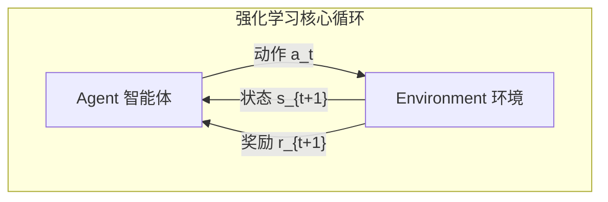

# 强化学习基础 (RL Fundamentals)

> **一句话理解**: 强化学习就是让 AI 通过试错来学习最优策略——像一只小狗通过奖励学会坐下、握手、翻滚，只不过这里的"小狗"是算法，"奖励"是数学函数。

---

## TL;DR

- **RL = Agent + Environment + Reward**: 智能体与环境交互，通过试错最大化累积奖励
- **数学框架**: MDP (Markov Decision Process) = ⟨S, A, P, R, γ⟩
- **核心方程**: Bellman 方程 V(s) = R(s) + γ × Σ P(s'|s,a) × V(s')
- **两大流派**: Value-based (Q-Learning/DQN) vs Policy-based (REINFORCE/PPO)
- **LLM 对齐**: RLHF → DPO → GRPO，从复杂工程走向优雅算法



---

## 1. 马尔可夫决策过程 (MDP)

### 1.1 五元组定义

```
MDP = ⟨S, A, P, R, γ⟩

S: 状态空间 (State Space)
   - 离散: {晴天, 阴天, 雨天}
   - 连续: ℝⁿ（如机器人关节角度）

A: 动作空间 (Action Space)  
   - 离散: {上, 下, 左, 右}
   - 连续: [-1, 1]ⁿ（如方向盘转角）

P: 状态转移概率 (Transition Probability)
   - P(s'|s, a): 在状态 s 执行动作 a 后转移到 s' 的概率
   - Markov 性质: P(s'|s, a) 只依赖当前状态 s，不依赖历史

R: 奖励函数 (Reward Function)
   - R(s, a, s'): 执行动作后获得的即时奖励
   - 设计好的奖励函数是 RL 成功的关键

γ: 折扣因子 (Discount Factor)
   - γ ∈ [0, 1]
   - γ = 0: 只看眼前（贪婪）
   - γ → 1: 更关注长期收益
   - 常用值: 0.99
```

### 1.2 策略 (Policy)

```
策略 π: 状态 → 动作的映射

确定性策略: a = π(s)
  例：如果状态是"红灯"，动作是"停车"

随机策略: π(a|s) = P(a_t = a | s_t = s)
  例：在"黄灯"状态，70% 概率减速，30% 概率加速通过

最优策略 π*: 使期望累积奖励最大的策略
  π* = argmax_π E[Σ γ^t R(s_t, a_t) | π]
```

### 1.3 价值函数 (Value Function)

```
状态价值 V^π(s): 从状态 s 出发，遵循策略 π 的期望累积奖励
V^π(s) = E_π[Σ_{t=0}^∞ γ^t R(s_t, a_t) | s_0 = s]

动作价值 Q^π(s, a): 在状态 s 执行动作 a 后，遵循策略 π 的期望累积奖励
Q^π(s, a) = E_π[Σ_{t=0}^∞ γ^t R(s_t, a_t) | s_0 = s, a_0 = a]

关系: V^π(s) = Σ_a π(a|s) Q^π(s, a)
最优: V*(s) = max_a Q*(s, a)
```

---

## 2. Bellman 方程

### 2.1 核心思想

```
当前价值 = 即时奖励 + 折扣的未来价值

V(s) = R(s) + γ × Σ_{s'} P(s'|s, π(s)) × V(s')
Q(s, a) = R(s, a) + γ × Σ_{s'} P(s'|s, a) × max_{a'} Q(s', a')
```

### 2.2 Bellman Optimality Equation

```
V*(s) = max_a [R(s, a) + γ × Σ_{s'} P(s'|s, a) × V*(s')]
Q*(s, a) = R(s, a) + γ × Σ_{s'} P(s'|s, a) × max_{a'} Q*(s', a')

如果知道 Q*:
  π*(s) = argmax_a Q*(s, a)  # 直接选 Q 值最大的动作
```

---

## 3. 经典算法

### 3.1 Q-Learning (Value-based)

```python
# 表格型 Q-Learning（离散状态+动作）
Q = np.zeros((num_states, num_actions))
alpha = 0.1  # 学习率
gamma = 0.99  # 折扣因子
epsilon = 0.1  # 探索率

for episode in range(num_episodes):
    state = env.reset()
    done = False
    while not done:
        # ε-greedy 探索
        if random() < epsilon:
            action = random_action()
        else:
            action = argmax(Q[state])
        
        next_state, reward, done = env.step(action)
        
        # Q 值更新（Bellman 方程的迭代版本）
        td_target = reward + gamma * max(Q[next_state])
        td_error = td_target - Q[state, action]
        Q[state, action] += alpha * td_error
        
        state = next_state
```

### 3.2 DQN (Deep Q-Network)

```python
# 用神经网络近似 Q 函数（处理连续/高维状态空间）
# 关键创新: Experience Replay + Target Network

class DQN:
    def __init__(self):
        self.q_net = QNetwork()           # 当前网络
        self.target_net = QNetwork()      # 目标网络（慢更新）
        self.replay_buffer = ReplayBuffer(capacity=100000)
    
    def train_step(self, batch):
        states, actions, rewards, next_states, dones = batch
        
        # 当前 Q 值
        q_values = self.q_net(states).gather(1, actions)
        
        # 目标 Q 值（用 target_net 计算，更稳定）
        with torch.no_grad():
            next_q = self.target_net(next_states).max(1)[0]
            td_target = rewards + gamma * next_q * (1 - dones)
        
        loss = F.mse_loss(q_values, td_target)
        loss.backward()
        self.optimizer.step()
        
        # 软更新 target network
        for p, tp in zip(self.q_net.parameters(), self.target_net.parameters()):
            tp.data = 0.005 * p.data + 0.995 * tp.data
```

### 3.3 PPO (Proximal Policy Optimization)

```python
# 策略梯度方法：直接优化策略 π(a|s; θ)
# PPO 的关键创新：clip 防止策略更新过大

def ppo_update(old_policy, new_policy, advantages, clip_eps=0.2):
    ratio = new_policy.prob(action) / old_policy.prob(action)
    
    # 未裁剪的目标
    surr1 = ratio * advantages
    
    # 裁剪的目标（防止更新过大）
    surr2 = clip(ratio, 1 - clip_eps, 1 + clip_eps) * advantages
    
    # 取较小值（悲观估计）
    loss = -min(surr1, surr2).mean()
    return loss

# PPO 是目前最常用的 RL 算法
# 被用于训练 ChatGPT (RLHF)、机器人控制、游戏 AI
```

---

## 4. 探索 vs 利用 (Exploration vs Exploitation)

```
利用 (Exploitation): 选择当前已知的最优动作
  → 短期收益最大，但可能错过更好的策略

探索 (Exploration): 尝试未知的动作
  → 短期可能亏损，但可能发现更优策略

平衡策略：
├── ε-greedy: 以 ε 概率随机探索
├── UCB (Upper Confidence Bound): 优先探索不确定性高的动作
├── Thompson Sampling: 从后验分布中采样
└── Entropy Regularization: 在策略中加熵项鼓励多样性（PPO/SAC 使用）
```

---

## 5. 奖励设计 (Reward Shaping)

### 5.1 核心原则

```
好的奖励设计 = 明确目标 + 避免副作用

反面教材：
  给扫地机器人奖励"移动距离"
  → 机器人学会在原地快速旋转（刷距离但不扫地）

正确做法：
  奖励 = 清扫面积 - 能耗 - 碰撞惩罚
```

### 5.2 稀疏奖励问题

```
问题：围棋中只有最后一手才知道输赢
解决：
1. 奖励塑形 (Reward Shaping): 中间过程给提示性奖励
   - 围棋: 吃子加分，被吃减分
2. 好奇心驱动 (Curiosity): 对"新颖"状态给内在奖励
3. 分层 RL (Hierarchical RL): 把长期目标分解为子目标
4. 逆强化学习 (IRL): 从人类示范中学习奖励函数
```

---

## 6. RL 在 LLM 中的应用

### 6.1 RLHF (Reinforcement Learning from Human Feedback)

```
三步流程：
1. SFT: 用人类标注数据微调基础模型
2. Reward Model: 训练一个奖励模型学习人类偏好
3. PPO: 用 RL 优化 LLM 使其最大化奖励模型的评分

ChatGPT 的成功关键：PPO 训练让模型学会"有帮助、无害、诚实"
```

### 6.2 DPO (Direct Preference Optimization)

```
DPO 的洞见：跳过奖励模型，直接从偏好数据优化策略

数学等价：
  RLHF: π* = argmax E[R(x,y)] - β KL(π || π_ref)
  DPO:  min E[-log σ(β log(π(y_w|x)/π_ref(y_w|x)) - β log(π(y_l|x)/π_ref(y_l|x)))]

优势：
  - 不需要训练奖励模型
  - 更稳定、更容易调参
  - 效果与 RLHF 相当甚至更好
```

### 6.3 GRPO (Group Relative Policy Optimization)

```
DeepSeek 的创新：用组内相对排名替代奖励模型

流程：
1. 对同一个 prompt 生成 G 个回答
2. 用规则/模型对这 G 个回答评分
3. 计算组内相对优势（z-score）
4. 用 PPO 风格的 clip loss 更新策略

优势：
  - 无需奖励模型
  - 比 DPO 更灵活
  - 特别适合数学/推理任务（可以自动验证答案）
```

---

## 7. 实战工具

### 7.1 传统 RL 工具

| 工具 | 用途 | 特点 |
|------|------|------|
| **Gymnasium** | RL 环境 | OpenAI Gym 继任者 |
| **Stable Baselines3** | RL 算法库 | PPO/SAC/TD3 开箱即用 |
| **RLlib** | 分布式 RL | Ray 生态，适合大规模训练 |
| **CleanRL** | 教学级实现 | 单文件实现，代码清晰 |

### 7.2 LLM 对齐工具

| 工具 | 用途 | 特点 |
|------|------|------|
| **TRL** | HuggingFace RL 训练 | 与 Transformers 无缝集成 |
| **OpenRLHF** | 分布式 RLHF | 支持 PPO/DPO/GRPO |
| **veRL** | 字节跳动 | 高效 RLHF 训练 |

---

## 相关阅读

- [[06_Reinforcement_Learning/RL-in-nutshell]] — 强化学习速览
- [[06_Reinforcement_Learning/README_for_dummy]] — 强化学习入门
- [[06_Reinforcement_Learning/Deep_RL/Deep_RL]] — 深度强化学习
- [[07_Model_Training/TRL_RLHF_DPO_Guide]] — RLHF/DPO 微调指南
- [[20_Papers/DQN_Deep_Dive]] — DQN 论文深度解读
- [[20_Papers/RLHF_DPO_Deep_Dive]] — RLHF 与 DPO 深度解读
