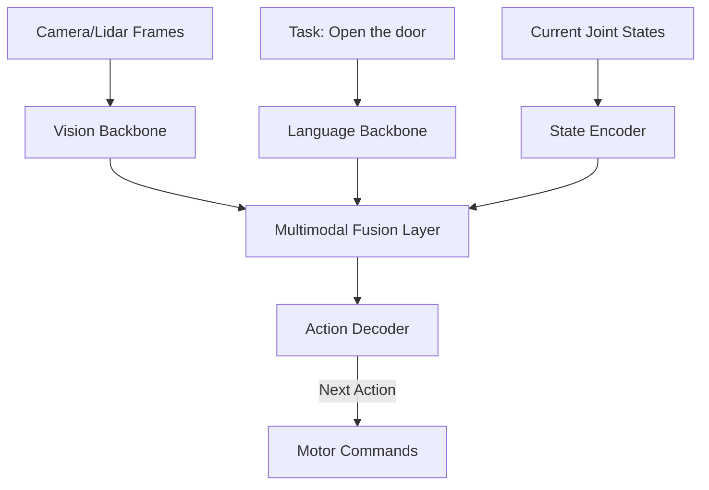

# Robot VLA Training Pipeline 2026: End-to-End Robotic Foundation Models

> **一句话理解**: VLA (Vision-Language-Action) 训练流水线是具身智能的“炼丹炉”——它将海量的视频数据、人类示范数据和仿真环境经验转化为机器人可执行的连贯动作指令。

---

## 目录

| 阶段 | 内容 | 关键技术 |
|------|------|----------|
| [1. 数据采集与增强](#1-数据采集与增强) | 遥操作、VR 示范、视频挖掘 | RT-X, Ego4D |
| [2. 动作 Token 化](#2-动作-token-化) | 连续空间到离散指令的转换 | Action Binning, VQ-Action |
| [3. 多模态对齐训练](#3-多模态对齐训练) | 视觉-文本-动作的统一空间 | Co-training, MoE |
| [4. Sim-to-Real 迁移](#4-sim-to-real-迁移) | 物理仿真、域随机化 | NVIDIA Isaac, PhysX |
| [5. 部署与微调](#5-部署与微调) | 边缘推理、低延迟执行 | TensorRT-Robot |

---

## 1. 数据采集与增强

具身智能最大的挑战在于“高质量动作数据”的稀缺。

- **遥操作 (Teleoperation)**: 人类佩戴传感器或操作机械臂完成任务，记录关节角度和视觉输入。
- **VR/AR 示范**: 利用 VR 头显让示范者在 3D 空间中“指挥”虚拟机器人，产出标注数据。
- **互联网视频挖掘**: 利用大模型从 YouTube 视频中识别“开门”、“切菜”等动作，并通过 **Video-to-Action** 技术反推物理指令。

---

## 2. 动作 Token 化 (Action Tokenization)

就像 LLM 把文字变成 Tokens，VLA 需要把关节的角速度、加速度变成 Tokens。

- **VQ-Action**: 使用向量量化自编码器，将连续的 7 自由度机械臂动作压缩成离散的编码。
- **分级控制**: 
  - **High-level**: “走到冰箱前”。
  - **Low-level**: 关节具体电流输出。
- **2026 趋势**: **RT-2 / π0** 风格的统一预测，即将动作直接作为语言模型的“扩展词表”。

---

## 3. 多模态对齐训练 (VLA Alignment)

### 3.1 跨域联合训练 (Co-training)
利用通用的视觉数据（图片）提升机器人的视觉认知，同时利用专门的机器人动作数据提升控制能力。

---

## 4. Sim-to-Real 迁移

在仿真器（如 NVIDIA Isaac Sim）中练习 100 万次，胜过在现实中摔坏 100 台机器人。

- **域随机化 (Domain Randomization)**: 在仿真中随机改变地板颜色、光照、重力参数，迫使模型学习更具鲁棒性的特征。
- **数字孪生**: 为现实场景构建 1:1 的物理模型，实现精准的闭环验证。

---

## 5. 2026 关键突破：长程规划 (Long-horizon)

早期的 VLA 只能做“拿杯子”这种瞬间动作。2026 年的流水线重点在于：
- **层次化强化学习 (HRL)**: 分解复杂任务（如“帮我做一份三明治”）。
- **世界模型预测试**: 机器人在行动前，会在内部“想象”动作的结果。

---

## 6. 工具与平台

- **OpenX-Embodiment**: 全球最大的机器人动作开源数据集。
- **Robot Operating System (ROS 2)**: 工业标准通信底座。
- **Gymnasium-Robotics**: 强化学习标准接口。

---

## Related

- [[06_Reinforcement_Learning/Robotics_Embodied_AI/Embodied_AI_2026]] — 具身智能概论
- [[06_Reinforcement_Learning/Robotics_Embodied_AI/VLA_Models_2026]] — 模型架构深度解析
- [[03_Deep_Learning/World_Models/World_Models_2026]] — 世界模型在控制中的应用
- [[_concepts/teleoperation]] — 遥操作基础

---

*Last updated: 2026-06-04*
