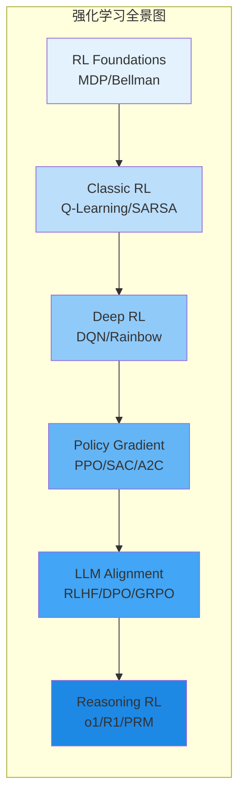
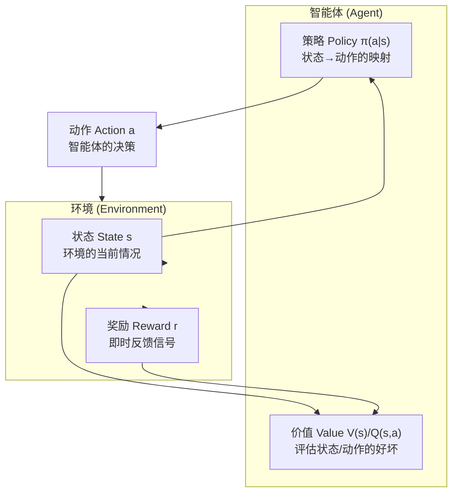
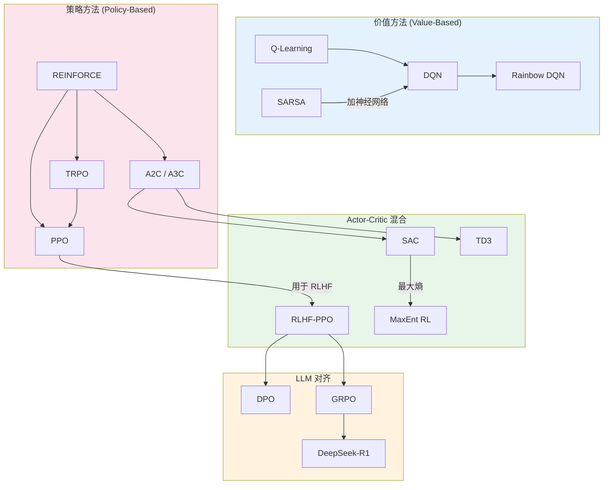
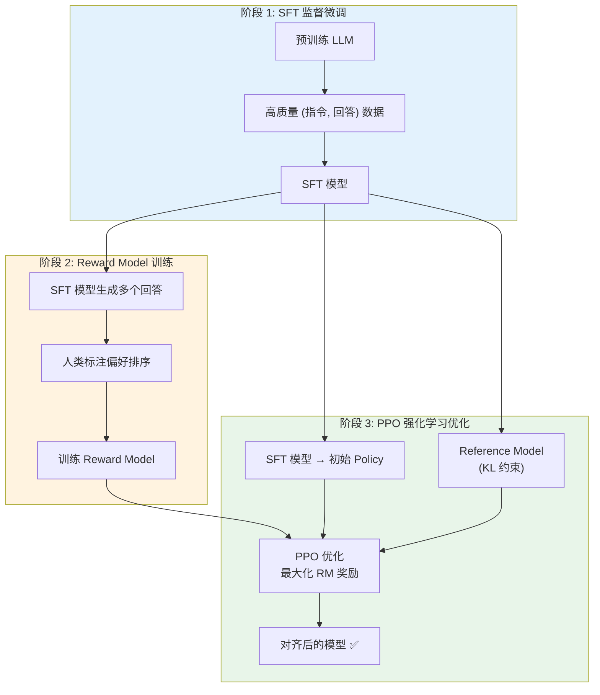
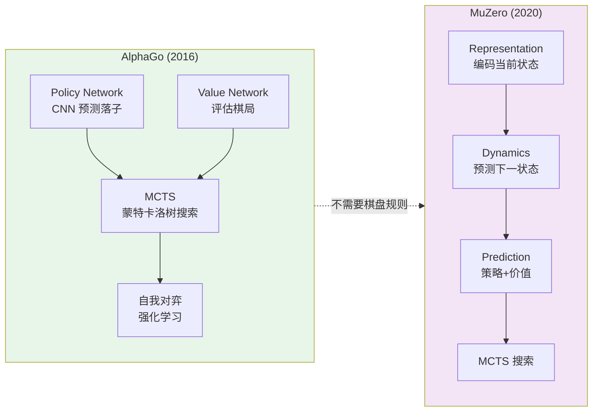
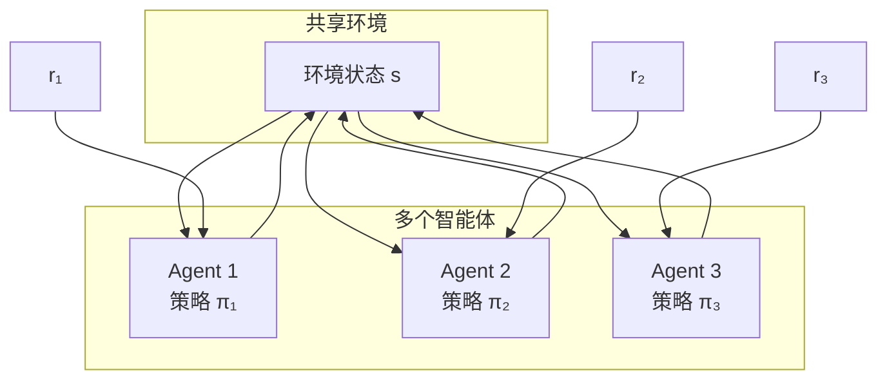
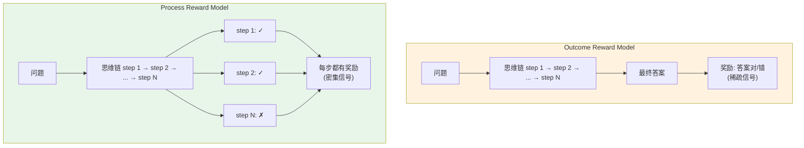
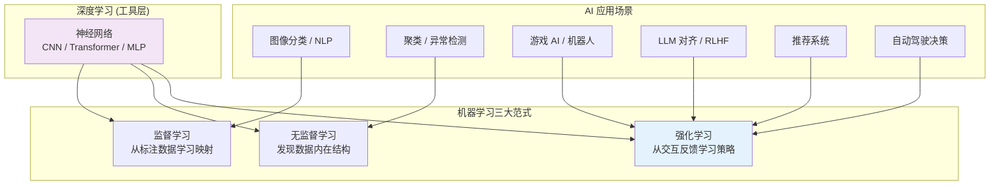

# 强化学习速览 (Reinforcement Learning in a Nutshell)

> 中文简称：强化学习速览

> **一句话理解**: 强化学习就像训练一只小狗——做对了给奖励，做错了不给，它慢慢学会了什么行为能拿到最多零食。

---

## TL;DR

- **RL 核心**: Agent 与 Environment 交互，通过试错最大化累积 Reward
- **数学框架**: MDP (Markov Decision Process) 五元组 ⟨S, A, P, R, γ⟩
- **经典算法**: Q-Learning / SARSA (表格) → DQN (深度) → PPO/SAC (策略梯度)
- **LLM 对齐**: RLHF (PPO) → DPO → GRPO，从重型工程走向优雅算法
- **深度 RL**: DQN 开创先河，Rainbow 集大成，AlphaGo/MuZero 登峰造极
- **推理 RL**: o1/R1 风格用 RL 训练思维链，Process Reward 逐步打分
- **实战工具**: Gymnasium + Stable Baselines3 (传统 RL)，TRL + OpenRLHF (LLM 对齐)



---

## 1. RL 基础概念 (Foundations)

### 1.1 核心要素

强化学习由 6 个核心概念构成：



| 要素 | 符号 | 含义 | 小狗训练类比 |
|------|------|------|-------------|
| **Agent** | - | 做决策的主体 | 小狗 |
| **Environment** | - | Agent 交互的外部世界 | 训练场 + 训练师 |
| **State** | s ∈ S | 环境的当前状况 | "坐下"命令发出时的场景 |
| **Action** | a ∈ A | Agent 的决策输出 | 坐下 / 趴下 / 乱跑 |
| **Reward** | r | 环境的即时反馈 | 零食 (+1) 或没有 (0) |
| **Policy** | π(a\|s) | 状态到动作的映射 | 小狗的"行为策略" |
| **Value** | V(s), Q(s,a) | 长期累积回报的期望 | "在这里听话能拿到多少零食" |

### 1.2 MDP 五元组

MDP (Markov Decision Process) 是 RL 的数学基础：

$$
\text{MDP} = \langle S, A, P, R, \gamma \rangle
$$

| 元素 | 符号 | 定义 | 说明 |
|------|------|------|------|
| 状态空间 | S | 所有可能状态的集合 | 离散或连续 |
| 动作空间 | A | 所有可能动作的集合 | 离散或连续 |
| 转移概率 | P(s'\|s,a) | 执行 a 后到达 s' 的概率 | 环境动力学 |
| 奖励函数 | R(s,a,s') | 状态转移时的即时奖励 | 标量信号 |
| 折扣因子 | γ ∈ [0,1] | 未来奖励的衰减系数 | 0.99 常用 |

**马尔可夫性质**: 未来只依赖现在，与过去无关：

$$
P[S_{t+1} | S_t, A_t, S_{t-1}, \dots] = P[S_{t+1} | S_t, A_t]
$$

### 1.3 贝尔曼方程 (Bellman Equation)

贝尔曼方程是 RL 的灵魂——将长期价值分解为"即时奖励 + 未来价值的折扣"：

**状态值函数**:
$$
V^\pi(s) = \sum_a \pi(a|s) \sum_{s'} P(s'|s,a) \left[ R(s,a,s') + \gamma V^\pi(s') \right]
$$

**最优值函数**:
$$
V^*(s) = \max_a \sum_{s'} P(s'|s,a) \left[ R(s,a,s') + \gamma V^*(s') \right]
$$

**直觉**: 一个状态的价值 = 眼前好处 + 打折后的未来好处。

---

## 2. 经典算法速查 (Classic Algorithms Quick Reference)

### 2.1 一句话 + 公式速查表

| 算法 | 一句话 | 核心更新公式 | 类型 |
|------|--------|-------------|------|
| **Q-Learning** | 用"最大未来价值"更新当前动作价值，不管实际做了什么 | $Q(s,a) \leftarrow Q(s,a) + \alpha [r + \gamma \max_{a'} Q(s',a') - Q(s,a)]$ | Off-Policy TD |
| **SARSA** | 用"实际做的下一步动作"更新，更保守更安全 | $Q(s,a) \leftarrow Q(s,a) + \alpha [r + \gamma Q(s',a') - Q(s,a)]$ | On-Policy TD |
| **Policy Gradient** | 直接优化策略参数，好动作增大概率，坏动作减小概率 | $\nabla_\theta J(\theta) = \mathbb{E}[\nabla_\theta \log \pi_\theta(a\|s) \cdot G_t]$ | On-Policy |
| **Actor-Critic** | Actor 学策略、Critic 学价值，Critic 指导 Actor 改进 | $\theta \leftarrow \theta + \alpha \cdot \delta_t \cdot \nabla_\theta \log \pi_\theta(a\|s)$ | On/Off-Policy |
| **PPO** | 限制策略更新幅度，防止一步走太远导致崩溃 | $L = \mathbb{E}[\min(r_t \hat{A}_t, \text{clip}(r_t, 1-\epsilon, 1+\epsilon) \hat{A}_t)]$ | On-Policy |
| **SAC** | 在最大化奖励的同时最大化策略熵，自动探索 | $J(\pi) = \sum_t \mathbb{E}[r_t + \alpha \mathcal{H}(\pi(\cdot\|s_t))]$ | Off-Policy |

### 2.2 算法关系图



### 2.3 On-Policy vs Off-Policy

| 维度 | On-Policy | Off-Policy |
|------|-----------|------------|
| **定义** | 用当前策略生成的数据训练 | 可以用其他策略生成的数据 |
| **代表** | SARSA, PPO, REINFORCE | Q-Learning, DQN, SAC |
| **数据效率** | 低 (数据用完即弃) | 高 (可重用历史数据) |
| **稳定性** | 更稳定 | 可能不稳定 |
| **探索** | 直接控制 | 间接控制 |
| **类比** | 边做边学 | 看别人的录像学 |

---

## 3. RL 在 LLM 中的应用 (RL for LLM Alignment)

这是 2023-2026 年最火热的 RL 应用方向——用强化学习让大语言模型变得 **有用 (Helpful)、诚实 (Honest)、无害 (Harmless)**。

### 3.1 对齐方法对比表

| 方法 | 核心思想 | 需要的模型数 | 显存需求 (70B) | 稳定性 | 代表工作 |
|------|----------|-------------|---------------|--------|----------|
| **RLHF (PPO)** | 训练 Reward Model + PPO 优化 | 4 个 | ~1960 GB | 中 | InstructGPT, ChatGPT |
| **DPO** | 跳过 RM，直接从偏好学习 | 2 个 | ~280 GB | 高 | Zephyr, Tulu |
| **GRPO** | 去掉 Critic，用 Group Sampling 估计基线 | 2 个 | ~280 GB | 高 | DeepSeek-V3/R1 |
| **RLOO** | Leave-One-Out 基线估计 | 2 个 | ~280 GB | 高 | Anthropic |
| **KTO** | 不需要偏好对，只需好/坏标签 | 2 个 | ~280 GB | 中 | Stanford |

### 3.2 RLHF 三阶段流程



**RLHF 的 KL 惩罚**——防止策略跑偏：

$$
R(x, y) = r_\phi(x, y) - \beta \cdot D_{KL}(\pi_\theta \| \pi_{ref})
$$

### 3.3 DPO: 跳过 Reward Model

DPO 的核心洞察：Reward Model 的最优解可以直接用 Policy 参数表达。

**DPO 损失函数**:

$$
\mathcal{L}_{DPO} = -\mathbb{E}_{(x, y_w, y_l)} \left[ \log \sigma \left( \beta \log \frac{\pi_\theta(y_w|x)}{\pi_{ref}(y_w|x)} - \beta \log \frac{\pi_\theta(y_l|x)}{\pi_{ref}(y_l|x)} \right) \right]
$$

**直觉**: 增大好回答的概率、减小坏回答的概率，同时用 Reference Model 约束不偏离太远。

### 3.4 GRPO: 去掉最贵的 Critic

GRPO (DeepSeek 2024) 的核心创新——用同一 prompt 的多个回答互相比较，替代 Critic Model：

$$
\hat{A}_i = \frac{r_i - \text{mean}(r_1, \dots, r_G)}{\text{std}(r_1, \dots, r_G)}
$$

其中 $r_1, \dots, r_G$ 是同一 prompt 下 $G$ 个回答的奖励。

| 对比 | RLHF-PPO | GRPO |
|------|----------|------|
| 基线估计 | Critic Model $V_\psi(s)$ | Group mean/std |
| 显存节省 | 基准 | 省 50%+ (去掉 Critic) |
| 训练稳定性 | 依赖 Critic 质量 | Group 估计更鲁棒 |
| 计算开销 | 高 | 中 |

> 更多 GRPO 细节参见 [GRPO 与新对齐方法](07_模型训练/06_对齐研究/02_GRPO_and_新型_对齐_Methods.md)

---

## 4. 深度 RL (Deep RL)

深度强化学习 = 用神经网络替代 Q 表或策略表，处理高维输入（图像、语音、连续控制）。

### 4.1 DQN 及其演进

**DQN (2013, DeepMind)** —— 深度 RL 的开山之作：

- **经验回放 (Experience Replay)**: 打破样本时序相关性
- **目标网络 (Target Network)**: 稳定训练目标，防止追逐移动靶

$$
y_i = r_i + \gamma \max_{a'} Q_{\text{target}}(s_i', a'; \theta^-)
$$

**Rainbow DQN (2017)** —— 六大改进的集大成者：

| 改进 | 作用 |
|------|------|
| Double DQN | 解耦动作选择和评估，减少过估计 |
| Dueling DQN | 分离 $V(s)$ 和 $A(s,a)$，更高效学习 |
| Prioritized Replay | 优先回放 TD 误差大的样本 |
| Multi-step Returns | n-step 回报减少偏差 |
| Distributional RL | 学习 Q 值分布而非均值 |
| Noisy Nets | 参数噪声替代 ε-greedy 探索 |

### 4.2 AlphaGo / MuZero



| 系统 | 年份 | 需要环境模型? | 核心突破 |
|------|------|-------------|---------|
| **AlphaGo** | 2016 | 是 (围棋规则) | Policy + Value + MCTS，击败李世石 |
| **AlphaZero** | 2018 | 是 | 纯自我对弈，通用棋类 |
| **MuZero** | 2020 | **否** | 学习环境模型，无需规则即可规划 |

> 深度 RL 详细算法解析参见 [Deep RL 详解](06_强化学习/02_深度强化学习/02_深度强化学习.md)

---

## 5. 多智能体 RL (Multi-Agent RL)

### 5.1 核心概念

多智能体 RL (MARL) 处理多个 Agent 在同一环境中交互的场景：



### 5.2 MARL 场景分类

| 场景类型 | 描述 | 代表算法 | 典型应用 |
|---------|------|---------|---------|
| **合作 (Cooperative)** | 所有 Agent 共享目标 | QMIX, MAPPO | 多机器人协作 |
| **竞争 (Competitive)** | Agent 目标互斥 | Self-Play, PSRO | 博弈/对战 |
| **混合 (Mixed)** | 部分合作部分竞争 | MADDPG | 交通调度 |

### 5.3 Self-Play (自我对弈)

Self-Play 是 AlphaGo/AlphaStar 的核心训练策略——Agent 和自己（的历史版本）对弈：

- **优势**: 无需人类数据，自动 curriculum（难度自适应）
- **挑战**: 策略循环 (rock-paper-scissors 问题)
- **解决**: Fictitious Play、Population-Based Training

> 多智能体与 Agent 架构详见 [AI Agents 详解](15_智能体/01_Agent基础/16_AI_Agent.md)

---

## 6. RL for Reasoning (推理强化学习)

### 6.1 o1/R1 风格：RL 训练思维链

2024-2025 年，RL 被用于训练 LLM 的 **长思维链 (Chain-of-Thought) 推理能力**：

| 方法 | 代表模型 | 奖励信号 | RL 算法 | 特点 |
|------|---------|---------|---------|------|
| **Outcome RL** | DeepSeek-R1 | 最终答案正确性 | GRPO | 简单直接 |
| **Process RL** | o1 (推测) | 逐步正确性 | PRM + PPO | 更细粒度 |
| **Pure RL** | Kimi k1.5 | 可验证奖励 | GRPO | 无需 SFT 冷启动 |

### 6.2 Process Reward Model (PRM) vs Outcome Reward Model (ORM)



| 对比 | ORM (Outcome) | PRM (Process) |
|------|--------------|--------------|
| 奖励时机 | 只在最终 | 每一步都有 |
| 信号密度 | 稀疏 | 密集 |
| 标注成本 | 低 (只需答案) | 高 (每步标注) |
| 训练效率 | 低 (credit assignment 难) | 高 (逐步反馈) |
| 适用场景 | 数学/编程 (可验证) | 开放推理 (难验证) |

> 推理模型更多细节参见 [DeepSeek-R1 技术解析](05_大模型/09_推理模型/01_DeepSeek_R1_Technical_分析.md)

---

## 7. 实战工具 (Practical Tools)

### 7.1 Gymnasium (原 OpenAI Gym)

标准 RL 环境接口，一行代码创建训练环境：

```python
import gymnasium as gym

# 创建环境
env = gym.make("CartPole-v1", render_mode="human")

# 重置环境
state, info = env.reset()

# 交互循环
for _ in range(1000):
    action = env.action_space.sample()  # 随机动作
    next_state, reward, terminated, truncated, info = env.step(action)
    if terminated or truncated:
        state, info = env.reset()
```

### 7.2 Stable Baselines3 (SB3)

开箱即用的 RL 算法库，5 行代码训练 PPO：

```python
from stable_baselines3 import PPO
import gymnasium as gym

# 创建环境
env = gym.make("LunarLander-v2")

# 创建 PPO Agent 并训练
model = PPO("MlpPolicy", env, verbose=1, learning_rate=3e-4)
model.learn(total_timesteps=100_000)

# 保存和加载
model.save("ppo_lunar_lander")
model = PPO.load("ppo_lunar_lander", env=env)

# 评估
obs, _ = env.reset()
for _ in range(1000):
    action, _states = model.predict(obs, deterministic=True)
    obs, reward, terminated, truncated, info = env.step(action)
    env.render()
    if terminated or truncated:
        obs, _ = env.reset()
```

### 7.3 TRL (HuggingFace Transformer Reinforcement Learning)

LLM 对齐训练的官方库，支持 DPO / GRPO / PPO：

```python
from trl import DPOTrainer, DPOConfig
from transformers import AutoModelForCausalLM, AutoTokenizer

# 加载模型
model = AutoModelForCausalLM.from_pretrained("meta-llama/Llama-3-8B")
ref_model = AutoModelForCausalLM.from_pretrained("meta-llama/Llama-3-8B")
tokenizer = AutoTokenizer.from_pretrained("meta-llama/Llama-3-8B")

# DPO 配置
training_args = DPOConfig(
    output_dir="./dpo-output",
    per_device_train_batch_size=4,
    learning_rate=5e-7,
    beta=0.1,
    max_length=512,
    num_train_epochs=3,
    logging_steps=10,
)

# DPO 训练 —— 只需偏好数据 (prompt, chosen, rejected)
trainer = DPOTrainer(
    model=model,
    ref_model=ref_model,
    args=training_args,
    train_dataset=preference_dataset,  # 偏好数据集
    processing_class=tokenizer,
)
trainer.train()
```

### 7.4 GRPO 训练示例 (TRL)

```python
from trl import GRPOConfig, GRPOTrainer

# GRPO 配置 —— 不需要 Reward Model 或 Critic
training_args = GRPOConfig(
    output_dir="./grpo-output",
    per_device_train_batch_size=2,
    learning_rate=1e-6,
    num_generation_per_prompt=8,  # 每个 prompt 生成 G 个回答
    max_new_tokens=512,
    num_train_epochs=1,
)

# 自定义奖励函数 (可以是规则/验证器)
def reward_fn(prompts, completions):
    """可验证奖励: 数学题检查答案正确性"""
    rewards = []
    for prompt, completion in zip(prompts, completions):
        answer = extract_answer(completion)
        expected = extract_expected_answer(prompt)
        rewards.append(1.0 if answer == expected else 0.0)
    return rewards

trainer = GRPOTrainer(
    model=model,
    reward_funcs=[reward_fn],
    args=training_args,
    train_dataset=math_dataset,
    processing_class=tokenizer,
)
trainer.train()
```

### 7.5 工具对比

| 工具 | 用途 | 支持算法 | 适用场景 |
|------|------|---------|---------|
| **Gymnasium** | RL 环境接口 | - (仅提供环境) | 所有 RL 研究 |
| **Stable Baselines3** | 经典 RL 算法库 | PPO, SAC, DQN, A2C, TD3 | 机器人/游戏/控制 |
| **TRL** | LLM 对齐训练 | DPO, GRPO, PPO, KTO, RLOO | 大模型对齐 |
| **OpenRLHF** | 分布式 RLHF | PPO, DPO, GRPO | 大规模 RLHF |
| **veRL** | 字节 RL 框架 | PPO, GRPO | 超大规模训练 |

---

## 8. RL vs 其他范式对比 (Paradigm Comparison)

### 8.1 三大机器学习范式

| 维度 | 监督学习 (Supervised) | 无监督学习 (Unsupervised) | 强化学习 (RL) |
|------|----------------------|--------------------------|--------------|
| **训练数据** | 标注数据 (X, Y) | 无标注数据 X | 环境交互的 (s,a,r) 序列 |
| **学习目标** | 学习 X→Y 的映射 | 发现数据内在结构 | 学习最优策略最大化累积奖励 |
| **反馈机制** | 每个样本都有明确标签 | 无明确反馈 | 稀疏奖励信号，可能有延迟 |
| **数据分布** | i.i.d. (独立同分布) | i.i.d. | 非 i.i.d. (时序相关) |
| **错误代价** | 即时反馈 | 无对错概念 | 错误可能导致灾难性后果 |
| **典型应用** | 图像分类、语音识别 | 聚类、降维 | 游戏 AI、机器人、LLM 对齐 |
| **代表算法** | 线性回归、CNN、Transformer | K-Means、PCA、VAE | Q-Learning、PPO、GRPO |

### 8.2 RL 在 AI 技术栈中的位置



### 8.3 RL 何时是正确选择？

| 问题特征 | 推荐方法 | 理由 |
|---------|---------|------|
| 有明确标签 (X→Y) | 监督学习 | 直接学习映射 |
| 发现数据模式/聚类 | 无监督学习 | 探索内在结构 |
| 序贯决策 + 延迟奖励 | **RL** | RL 专长 |
| 需要探索未知环境 | **RL** | 试错学习 |
| 有可验证的奖励信号 | **RL** | 自动优化 |
| 需要与人类偏好对齐 | **RL (RLHF/DPO)** | 偏好即奖励 |
| 实时控制 (机器人/游戏) | **RL** | 在线决策 |

---

## 快速记忆卡 (Cheat Sheet)

```
┌────────────────────────────────────────────────────────────┐
│                    强化学习速记卡                           │
├────────────────────────────────────────────────────────────┤
│  MDP = ⟨S, A, P, R, γ⟩                                    │
│  Bellman: V(s) = max_a [R(s,a) + γ·V(s')]                 │
│  Q-Learn: Q ← Q + α[r + γ·max Q(s',a') - Q]  (Off-Policy)│
│  SARSA:   Q ← Q + α[r + γ·Q(s',a') - Q]      (On-Policy) │
│  PG:      θ ← θ + α·∇logπ·G                   (策略梯度)   │
│  PPO:     clip(r, 1-ε, 1+ε)·A                 (裁剪更新)   │
│  SAC:     J = Σ[r + α·H(π)]                   (最大熵)     │
│  DQN:     经验回放 + 目标网络 + ε-greedy                    │
│  RLHF:    SFT → Reward Model → PPO             (3阶段)     │
│  DPO:     直接从偏好学习, 跳过 RM                           │
│  GRPO:    Group Sampling 替代 Critic                        │
└────────────────────────────────────────────────────────────┘
```

---

## 延伸阅读 (Further Reading)

| 主题 | 推荐资源 | 链接 |
|------|---------|------|
| RL 基础 | 强化学习基础 (MDP/Bellman) | [03_RL基础.md](06_强化学习/01_强化学习基础/03_RL基础.md) |
| 深度 RL | DQN/PPO/SAC 详解 | [02_深度强化学习.md](06_强化学习/02_深度强化学习/02_深度强化学习.md) |
| PPO 深入 | PPO 论文解读 | [04_PPO_深入分析.md](06_强化学习/02_深度强化学习/04_PPO_深入分析.md) |
| DQN 深入 | DQN 论文解读 | [02_DQN_深入分析.md](06_强化学习/02_深度强化学习/02_DQN_深入分析.md) |
| AI Agents | 智能体架构与工具使用 | [11_Agent_简明指南.md](15_智能体/01_Agent基础/11_Agent_简明指南.md) |
| GRPO/对齐 | 新一代对齐方法详解 | [GRPO 详解](07_模型训练/06_对齐研究/02_GRPO_and_新型_对齐_Methods.md) |
| 推理模型 | o1/R1 推理 RL | [DeepSeek-R1](05_大模型/09_推理模型/01_DeepSeek_R1_Technical_分析.md) |
| RLHF 概念 | RLHF 核心概念 | [RLHF 概念](概念/Training/rlhf.md) |

---

*Last updated: 2026-06-05*

## 相关链接

- [[06_强化学习/01_强化学习基础/04_RL_基础_概览|强化学习基础]] — 详细基础理论
- [[06_强化学习/01_强化学习基础/index|强化学习基础索引]] — 主题导览
- [[06_强化学习/02_深度强化学习/02_深度_RL|深度强化学习]] — RL 与深度学习结合
- [[06_强化学习/03_RLHF与对齐/04_RLHF_DPO_GRPO_深入分析|RLHF/DPO/GRPO 深度解析]] — RL 在 LLM 对齐的应用
- [[06_强化学习/index|强化学习首页]] — 强化学习知识总览
- [[概念/General/reinforcement-learning|强化学习]] — 概念卡片
