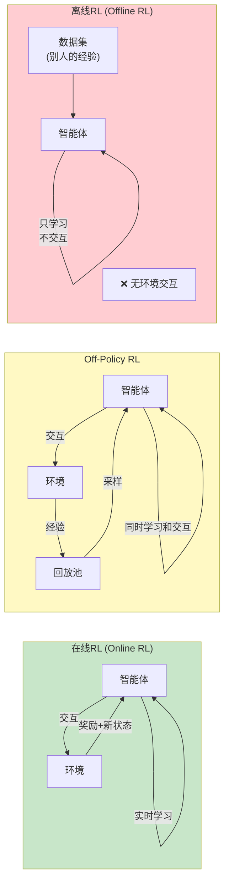
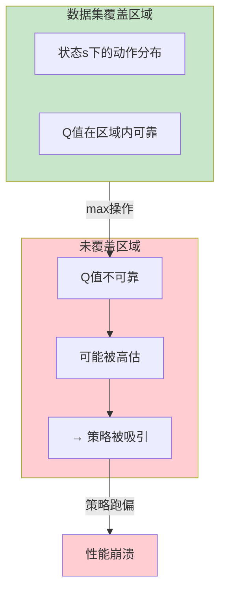
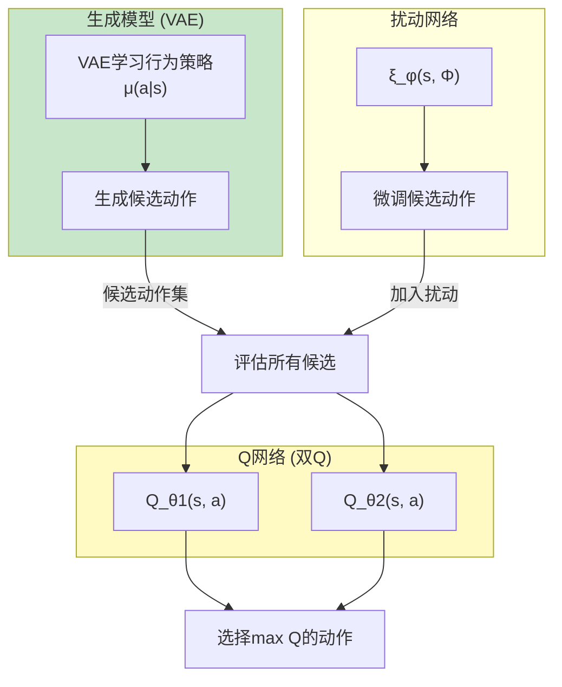
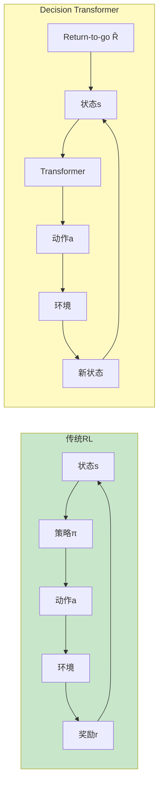
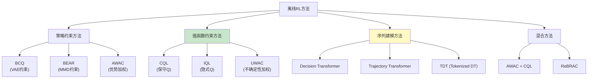

# 离线强化学习深度解析 (Offline RL Deep Dive)

> **一句话理解**: 离线RL就像从历史录像学打仗——不能上战场试错(没有在线交互)，只能从别人录制的战斗视频中学习最优策略，最大的挑战是你学到的策略可能遇到视频中从未出现的局面。

---

## 目录

- [论文信息](#论文信息)
- [1. 什么是离线RL](#1-什么是离线rl)
- [2. 分布偏移问题](#2-分布偏移问题)
- [3. BCQ](#3-bcq)
- [4. CQL](#4-cql)
- [5. IQL](#5-iql)
- [6. Decision Transformer](#6-decision-transformer)
- [7. 其他离线RL方法](#7-其他离线rl方法)
- [8. 评估与基准](#8-评估与基准)
- [9. 代码实现](#9-代码实现)
- [10. 对比表格](#10-对比表格)
- [11. 实际应用](#11-实际应用)
- [Related](#related)

---

## 论文信息

| 属性 | 内容 |
|------|------|
| **BCQ** | Fujimoto et al., ICML 2019 — Batch-Constrained Q-Learning |
| **CQL** | Kumar et al., NeurIPS 2020 — Conservative Q-Learning |
| **IQL** | Kostrikov et al., ICLR 2022 — Implicit Q-Learning |
| **DT** | Chen et al., NeurIPS 2021 — Decision Transformer |
| **综述** | Levine et al., 2020 — Offline RL Tutorial |

---

## 1. 什么是离线RL

### 三种RL范式



### 离线RL的正式定义

```
离线RL (Offline RL / Batch RL):

给定:
  → 一个固定的数据集 D = {(s_i, a_i, r_i, s'_i)}
  → 数据由某个行为策略 μ(a|s) 收集

目标:
  → 从D中学习最优策略 π*
  → 学习过程中不能与环境交互
  → 策略部署后也不再更新

关键区别:
  在线RL:    学习 ←→ 交互 ←→ 学习 ←→ ...
  离线RL:    数据(固定) → 学习 → 部署
```

### 为什么需要离线RL

| 场景 | 为什么不能在线学习 | 数据来源 |
|------|-------------------|----------|
| **医疗** | 在病人身上试错不道德 | 历史治疗记录 |
| **自动驾驶** | 在路上试错太危险 | 人类驾驶日志 |
| **金融** | 用真钱试错成本高 | 历史交易数据 |
| **推荐系统** | 在线A/B测试影响用户体验 | 用户点击日志 |
| **工业控制** | 试错可能损坏设备 | 传感器历史数据 |
| **教育** | 不能拿学生试错 | 在线学习平台日志 |

### 数据来源的多样性

```
离线RL数据集的来源:

1. 专家演示:
   → 高质量、覆盖范围窄
   → 行为克隆(BC)就够了
   
2. 混合策略:
   → 多种策略收集
   → 覆盖范围中
   → 离线RL的理想场景

3. 随机/探索策略:
   → 质量低但覆盖广
   → 包含很多次优行为
   → 离线RL要从中提取最优

4. 在线RL的历史经验:
   → 训练过程中的所有经验
   → 包含各种质量的策略
   → 最常见的数据来源
```

---

## 2. 分布偏移问题

### 核心挑战: Distribution Shift

```
离线RL的根本难题: 分布偏移 (Distribution Shift)

在线RL:
  → 智能体通过交互收集数据
  → 数据分布 = 当前策略分布
  → 总是"on-policy" (分布匹配)

离线RL:
  → 数据由行为策略 μ 收集
  → 学习策略 π ≠ μ
  → π 可能执行数据集中没有的动作

问题:
  → Q函数在数据集覆盖的区域估计较好
  → 在未覆盖区域，Q估计不可靠 (外推错误)
  → Q学习倾向于选择高Q值的动作
  → 但高Q值可能是"外推错误"(过于乐观)
  → 策略被引向不可靠区域 → 灾难性失败
```

### 外推错误的图解



### 数学分析

```
离线RL中的偏差:

在数据集D中:
  → 行为策略 μ(a|s) 决定了哪些(s,a)被访问
  → D只覆盖了 μ 支持的区域

Q学习的致命吸引力:
  Q_target = r + γ · max_a' Q(s', a')

  → max操作会选择Q值最高的动作
  → 如果某个 a' 不在D中 (μ(a'|s')≈0)
  → 但 Q(s',a') 被高估了
  → max就会选它
  → 策略学到: 去那些不可靠的高Q区域

误差传播:
  Step 1: Q(s',a') 高估 → 传播到 Q(s,a)
  Step 2: Q(s,a) 高估 → 传播到 Q(s_{-1}, a_{-1})
  ...
  → 误差指数级放大
  → 整个Q函数崩溃
```

### 为什么在线RL没有这个问题

```
在线RL如何避免外推错误:

1. 持续探索:
   → 智能体会实际执行动作
   → 发现Q值高估的区域
   → 通过交互修正估计

2. 经验回放的平衡:
   → off-policy RL虽然也用回放池
   → 但不断添加新经验
   → 覆盖范围持续扩大

3. 在线RL的"自我修正":
   → 如果策略跑到Q高估的区域
   → 实际获得的reward会低于预期
   → Q值被自动修正

离线RL没有这些保护:
  → 不能探索新区域
  → 不能自我修正
  → 外推错误不断积累
```

---

## 3. BCQ

**BCQ (Batch-Constrained Q-Learning)** 是首个明确解决离线RL外推错误的算法。

### 核心思想

```
BCQ的关键洞察:

问题: Q学习会选数据集外的动作
解决: 限制策略只选数据集覆盖的动作

BCQ约束:
  → 只在行为策略μ的动作分布内选择动作
  → 学到的策略 π 满足: π(a|s) ≈ 0 当 μ(a|s) ≈ 0

如何实现:
  → 用VAE学习行为策略 μ(a|s) 的模型
  → 在μ的"邻域"内搜索最优动作
  → 不在数据集覆盖范围外搜索
```

### BCQ架构



### BCQ的动作选择

```
BCQ的动作选择过程:

1. 用VAE生成候选动作:
   a_generated ~ μ_VAE(·|s)
   生成n个候选: {a_1, ..., a_n}

2. 用扰动网络微调:
   a_i' = a_i + ξ_φ(s, a_i) · Φ
   ξ_φ 是学习的扰动网络
   Φ 是扰动幅度

3. 评估并选择:
   a* = argmax_{a_i'} min(Q_θ1(s, a_i'), Q_θ2(s, a_i'))

关键:
  → 候选动作来自行为策略分布
  → 扰动幅度有限
  → 双Q取min防止高估
  → 不在数据集覆盖外搜索
```

### BCQ的损失函数

```
BCQ的Q损失:

L_Q = E_{(s,a,r,s')~D} [
    (Q(s,a) - (r + γ · max_{a'∈候选} min(Q_1(s',a'), Q_2(s',a'))))²
]

VAE损失 (学习行为策略):
L_VAE = L_recon + KL(分布 || N(0,I))

扰动网络损失 (使Q最大化):
L_ξ = -E[min(Q_1(s, a+ξ·Φ), Q_2(s, a+ξ·Φ))]
```

---

## 4. CQL

**CQL (Conservative Q-Learning)** 是目前最流行的离线RL算法之一，通过对Q函数施加**保守约束**来防止高估。

### 核心思想

```
CQL的关键洞察:

问题: 标准Q学习在离线设置下高估Q值
解决: 显式地惩罚高Q值

CQL的约束:
  → 让Q值在数据集内的状态-动作对上估计准确
  → 让Q值在数据集外的状态-动作对上偏低(保守)
  → 这样max操作不会选择不可靠的高Q区域

实现方式:
  → 在标准Bellman损失上增加保守正则项
  → 正则项推低未采样动作的Q值
```

### CQL的损失函数

```
CQL的目标:

标准Q损失 (最小化Bellman误差):
  L_Bellman = E_{(s,a)~D}[(Q(s,a) - Q_target)²]

保守正则项 (推低未见动作的Q值):
  L_CQL = α · [E_{s~D, a~μ} [Q(s,a)]     ← 未见动作的Q (要最小化)
              - E_{(s,a)~D} [Q(s,a)]]      ← 数据集动作的Q (要保持)

总损失:
  L_total = L_Bellman + α · L_CQL

直觉:
  → 第一项: 正常的Q学习
  → 第二项: 对于随机采样的动作μ,降低其Q值
            对于数据集D中的动作,保持其Q值
  → 效果: 数据集外的Q被"压低" → 防止高估
```

### CQL变体

```
CQL的不同版本:

1. CQL(H) (原始版本):
   → 用logsumexp替代max
   → L_CQL = α·[logsumexp_a Q(s,a) - E_{a~D} Q(s,a)]

2. CQL(Q) (实用版本):
   → 在多个采样点施加约束
   → L_CQL = α·[E_{a~π} Q(s,a) - E_{a~D} Q(s,a)]

3. CQL(var) (方差版本):
   → 加入Q的方差约束
   → 减少Q估计的波动

超参数α:
  → α越大: 越保守 (Q低估)
  → α越小: 越激进 (Q高估)
  → 需要根据数据集质量调节
```

### CQL的理论保证

```
CQL的理论性质:

1. 保守Q值的下界:
   CQL学到的Q函数满足:
   Q_CQL(s,a) ≤ Q_true(s,a)  对所有(s,a)
   
   → 保证不会高估!

2. 策略改进保证:
   在保守Q值下学到的策略π_CQL:
   J(π_CQL) ≥ J(μ) - O(误差项)
   
   → 至少不比行为策略差太多

3. 数据效率:
   CQL利用了数据集中的所有信息
   → 比行为克隆(BC)更高效
   → 比标准Q学习更安全
```

---

## 5. IQL

**IQL (Implicit Q-Learning)** 是2022年提出的简洁方法，**完全避免了对未见动作的查询**。

### 核心思想

```
IQL的关键洞察:

BCQ: 限制动作在行为策略范围内
CQL: 惩罚未见动作的Q值
IQL: 根本不查询未见动作的Q值!

如何做到:
  → 只用数据集中的动作来估计目标Q值
  → 不需要采样或评估新动作
  → 用期望回归(expectile regression)隐式地估计V*(s)
  → 然后用V和Q的关系更新

优势:
  → 极其简洁
  → 没有超参数α
  → 不需要行为策略模型
  → 不需要对抗训练
```

### IQL的三步法

```
IQL的三个网络: Q(s,a), V(s), π(a|s)

步骤1: 训练V函数 (用expectile回归)
  → 用数据集动作的Q值训练V
  → 但不是简单平均，而是expectile (偏向高Q)

  L_V = E_{(s,a)~D} [L_τ^2(Q_θ(s,a) - V_ψ(s))]

  其中 L_τ^2(u) = |τ - 1(u<0)| · u²
  τ 是expectile参数 (如0.7)
  → τ > 0.5 使V偏向较高的Q值 (乐观但不过度)

步骤2: 训练Q函数 (用V作目标)
  → Q的目标用V而不是max Q

  L_Q = E_{(s,a,r,s')~D} [
    (Q_θ(s,a) - (r + γ·V_ψ(s')))²
  ]

  → 不需要查询任何未见动作!
  → V是从数据集动作学到的

步骤3: 提取策略
  → 用Q值做优势加权的行为克隆

  L_π = E_{(s,a)~D} [
    exp(β·(Q_θ(s,a) - V_ψ(s))) · (-log π_θ(a|s))
  ]

  → Q-V = 优势
  → 优势高的动作权重大
  → 本质是优势加权BC
```

### IQL的优势

```
IQL相比BCQ和CQL:

1. 简洁:
   → 不需要行为策略模型 (BCQ需要VAE)
   → 不需要保守约束 (CQL需要α)
   → 不需要对抗训练

2. 稳定:
   → 不评估未见动作 → 无外推错误
   → 期望回归温和地估计最优V

3. 实用:
   → 超参数少 (τ, β)
   → 默认值在大多数任务上有效
   → 实现简单

4. 效果:
   → 在D4RL基准上达到SOTA
   → 比CQL更稳定
   → 比BCQ更灵活
```

---

## 6. Decision Transformer

**Decision Transformer (DT)** 用全新的视角解决离线RL：**把RL重新定义为序列建模问题**。

### 颠覆性思想



### DT的核心创新

```
Decision Transformer的思想:

传统RL: 学习策略 π(a|s) 或 Q(s,a)
DT: 学习序列模型 p(a | R̂, s, context)

序列格式:
  (R̂_1, s_1, a_1, R̂_2, s_2, a_2, ..., R̂_T, s_T, a_T)

其中 R̂_t = Σ_{t'=t}^{T} r_{t'}  (return-to-go)
  → 从当前时刻到结束的累积奖励

Transformer的输入:
  R̂_1, s_1, a_1, R̂_2, s_2, a_2, ...

Transformer的输出:
  a_1, a_2, ... (预测每个时刻的动作)

关键:
  → 给定目标回报 R̂ 和状态序列
  → Transformer预测应该执行什么动作
  → 生成时指定高R̂ → 模型生成高回报的动作
```

### DT的推理流程

```
DT生成(执行)流程:

1. 指定目标回报 R̂_target (如: 我要获得1000分)
2. 初始化: R̂ = R̂_target, s = 初始状态

3. 循环:
   a. 输入 (R̂, s) 给Transformer
   b. Transformer预测动作 a
   c. 执行a, 环境返回 r, s'
   d. 更新 R̂ = R̂ - r (实际获得的奖励)
   e. s = s'
   
4. 重复直到结束

直觉:
  → "我想要R̂分"
  → Transformer: "那你应该执行动作a"
  → 执行a, 得到r分
  → "我还想要 R̂-r 分"
  → 继续...

这就像条件生成!
  → R̂ 是"条件"
  → 模型生成能获得该回报的动作序列
```

### DT vs 传统离线RL

| 维度 | 传统RL (CQL/IQL) | Decision Transformer |
|------|-------------------|----------------------|
| **范式** | RL (贝尔曼方程) | 序列建模 (自回归) |
| **目标** | 学习Q值或策略 | 学习动作的条件分布 |
| **信用分配** | 通过Q值传播 | Transformer注意力直接分配 |
| **不需要** | 贝尔曼方程 | 不需要 |
| **序列建模** | ❌ | ✅ Transformer |
| **长程信用分配** | 🟡 难 (γ^T) | 🟢 好 (注意力) |
| **目标指定** | ❌ 训练后固定 | ✅ 可指定不同R̂ |
| **数据效率** | 🟡 中 | 🟢 高 (序列建模) |
| **推理速度** | 🟢 快 (前向) | 🟡 中 (Transformer) |

### DT的优缺点

```
DT的优点:
  ✅ 统一了RL和序列建模
  ✅ 利用预训练Transformer
  ✅ 长程信用分配更自然
  ✅ 可指定不同目标回报
  ✅ 无需贝尔曼方程 → 无外推错误
  ✅ 利用大规模序列建模能力

DT的缺点:
  ❌ 在训练数据外的回报可能不可达
  ❌ 序列长度限制 (Transformer窗口)
  ❌ 对数据质量敏感 (需要好/坏轨迹都有)
  ❌ 不如CQL/IQL在标准基准上稳定
  ❌ 推理需要完整序列输入
```

---

## 7. 其他离线RL方法

### 方法全景



### 方法详解

| 方法 | 类型 | 核心思想 | 优点 | 缺点 |
|------|------|----------|------|------|
| **BCQ** | 策略约束 | VAE限制动作范围 | 首个方法 | 需要VAE |
| **BEAR** | 策略约束 | MMD约束策略分布 | 理论好 | 计算贵 |
| **AWAC** | 策略约束 | 优势加权BC | 简单有效 | 需要好的V估计 |
| **CQL** | 值约束 | 保守Q学习 | SOTA | α需调 |
| **IQL** | 值约束 | 隐式Q学习 | 最简洁 | expectile需调 |
| **UWAC** | 值约束 | 不确定性加权 | 理论保证 | 需要集成 |
| **DT** | 序列建模 | Transformer | 创新 | 数据需求高 |
| **TT** | 序列建模 | 轨迹Transformer | 规划能力 | 慢 |
| **TD3+BC** | 混合 | TD3+BC正则 | 极简单 | 效果中等 |
| **ReBRAC** | 混合 | 解耦策略-值正则 | 2024 SOTA | 复杂 |

### TD3+BC (最简单的离线RL)

```
TD3+BC (Fujimoto & Gu, 2021):

核心思想: TD3 + 行为克隆正则

策略损失:
  L_π = -E[Q(s, π(s))] + λ · E[(π(s) - a)²]
        \_____________/     \_______________/
        TD3目标 (最大化Q)     BC项 (模仿数据集)

λ 自适应:
  λ = α / E[|Q(s,a)|]

特点:
  → 只加了一行BC正则项
  → 极其简单
  → 效果出奇地好
  → 是最简单的离线RL baseline
```

---

## 8. 评估与基准

### D4RL基准

```
D4RL (Data for Deep Data-Driven RL):

离线RL的标准评估基准

任务领域:
  → Gym MuJoCo: HalfCheetah, Hopper, Walker2d, Ant
  → AntMaze: 不同难度迷宫
  → Kitchen: 厨房任务序列
  → Flow: 交通流控制
  → Carla: 自动驾驶

数据集类型:
  → random: 随机策略收集
  → medium: 中等策略收集
  → medium-replay: 训练过程经验
  → medium-expert: 中等+专家混合
  → expert: 专家策略收集
  → maze2d: 导航任务

评估指标:
  → normalized score: 0(随机) ~ 100(专家)
```

### D4RL上的性能对比

| 数据集 | BC | BCQ | CQL | IQL | DT | TD3+BC |
|--------|-----|-----|-----|-----|-----|--------|
| halfcheetah-medium | 43.1 | 51.0 | 52.5 | 47.4 | 42.6 | 48.3 |
| halfcheetah-expert | 58.5 | 73.8 | 76.0 | 86.7 | — | 65.4 |
| hopper-medium | 52.1 | 68.9 | 72.5 | 66.3 | 67.6 | 59.6 |
| hopper-expert | 111.9 | 109.7 | 105.4 | 91.5 | — | 103.6 |
| **平均** | ~50 | ~65 | ~68 | ~65 | ~60 | ~60 |

> 数据为定性估计 ^[inferred]，具体值因实现而异。

---

## 9. 代码实现

### CQL实现

```python
import torch
import torch.nn as nn
import torch.nn.functional as F
import copy


class CQLAgent:
    """Conservative Q-Learning 离线RL"""

    def __init__(self, state_dim, action_dim, hidden_dim=256,
                 gamma=0.99, tau=0.005, cql_alpha=1.0,
                 lr=3e-4, device='cuda'):
        self.gamma = gamma
        self.tau = tau
        self.cql_alpha = cql_alpha
        self.action_dim = action_dim
        self.device = device

        # 双Q网络
        self.q1 = QNetwork(state_dim, action_dim, hidden_dim).to(device)
        self.q2 = QNetwork(state_dim, action_dim, hidden_dim).to(device)
        self.q1_target = copy.deepcopy(self.q1)
        self.q2_target = copy.deepcopy(self.q2)

        # 确定性策略网络
        self.actor = DeterministicPolicy(
            state_dim, action_dim, hidden_dim
        ).to(device)

        self.q1_optim = torch.optim.Adam(self.q1.parameters(), lr=lr)
        self.q2_optim = torch.optim.Adam(self.q2.parameters(), lr=lr)
        self.actor_optim = torch.optim.Adam(self.actor.parameters(), lr=lr)

    def update(self, batch):
        state, action, reward, next_state, done = batch
        state = state.to(self.device)
        action = action.to(self.device)
        reward = reward.to(self.device)
        next_state = next_state.to(self.device)
        done = done.to(self.device)

        # ======== 1. 计算标准Bellman目标 ========
        with torch.no_grad():
            next_action = self.actor(next_state)
            q1_next = self.q1_target(next_state, next_action)
            q2_next = self.q2_target(next_state, next_action)
            q_next = torch.min(q1_next, q2_next)
            q_target = reward + (1 - done) * self.gamma * q_next

        # ======== 2. 标准Q损失 ========
        q1_pred = self.q1(state, action)
        q2_pred = self.q2(state, action)

        bellman_loss = F.mse_loss(q1_pred, q_target) + \
                       F.mse_loss(q2_pred, q_target)

        # ======== 3. CQL保守正则项 ========
        # 采样随机动作
        random_actions = torch.rand_like(action).clamp(-1, 1)
        # 当前策略的动作
        policy_actions = self.actor(state)
        # 数据集中的动作 (就是action)

        # Q值对各类动作
        q1_rand = self.q1(state, random_actions)
        q1_policy = self.q1(state, policy_actions)
        q1_data = self.q1(state, action)

        q2_rand = self.q2(state, random_actions)
        q2_policy = self.q2(state, policy_actions)

        # CQL损失: 推低随机/策略动作的Q，保持数据集动作的Q
        cql_loss = self.cql_alpha * (
            torch.logsumexp(q1_rand, dim=1).mean()
            + torch.logsumexp(q1_policy, dim=1).mean()
            - 2 * q1_data.mean()
            + torch.logsumexp(q2_rand, dim=1).mean()
            + torch.logsumexp(q2_policy, dim=1).mean()
        )

        # ======== 4. 总Q损失 ========
        q_loss = bellman_loss + cql_loss

        self.q1_optim.zero_grad()
        self.q2_optim.zero_grad()
        q_loss.backward()
        self.q1_optim.step()
        self.q2_optim.step()

        # ======== 5. 更新策略 ========
        policy_action = self.actor(state)
        q1_policy_new = self.q1(state, policy_action)
        q2_policy_new = self.q2(state, policy_action)
        policy_loss = -torch.min(q1_policy_new, q2_policy_new).mean()

        self.actor_optim.zero_grad()
        policy_loss.backward()
        self.actor_optim.step()

        # ======== 6. 软更新目标网络 ========
        for param, target_param in zip(
            self.q1.parameters(), self.q1_target.parameters()
        ):
            target_param.data.copy_(
                self.tau * param.data + (1 - self.tau) * target_param.data
            )

        return {
            'q_loss': bellman_loss.item(),
            'cql_loss': cql_loss.item(),
            'policy_loss': policy_loss.item()
        }


class QNetwork(nn.Module):
    def __init__(self, state_dim, action_dim, hidden_dim=256):
        super().__init__()
        self.net = nn.Sequential(
            nn.Linear(state_dim + action_dim, hidden_dim),
            nn.ReLU(),
            nn.Linear(hidden_dim, hidden_dim),
            nn.ReLU(),
            nn.Linear(hidden_dim, 1),
        )

    def forward(self, state, action):
        return self.net(torch.cat([state, action], dim=-1))


class DeterministicPolicy(nn.Module):
    def __init__(self, state_dim, action_dim, hidden_dim=256,
                 action_range=1.0):
        super().__init__()
        self.action_range = action_range
        self.net = nn.Sequential(
            nn.Linear(state_dim, hidden_dim),
            nn.ReLU(),
            nn.Linear(hidden_dim, hidden_dim),
            nn.ReLU(),
            nn.Linear(hidden_dim, action_dim),
            nn.Tanh(),
        )

    def forward(self, state):
        return self.net(state) * self.action_range
```

### IQL实现 (简化版)

```python
class IQLAgent:
    """Implicit Q-Learning 离线RL"""

    def __init__(self, state_dim, action_dim, hidden_dim=256,
                 gamma=0.99, tau=0.005, expectile=0.7,
                 beta=3.0, lr=3e-4, device='cuda'):
        self.gamma = gamma
        self.tau = tau
        self.expectile = expectile  # expectile参数
        self.beta = beta            # 策略温度
        self.device = device

        self.q1 = QNetwork(state_dim, action_dim, hidden_dim).to(device)
        self.q2 = QNetwork(state_dim, action_dim, hidden_dim).to(device)
        self.q1_target = copy.deepcopy(self.q1)
        self.q2_target = copy.deepcopy(self.q2)

        # V网络 (关键: IQL额外训练V)
        self.v = VNetwork(state_dim, hidden_dim).to(device)

        # 策略 (随机策略)
        self.actor = GaussianPolicy(
            state_dim, action_dim, hidden_dim
        ).to(device)

    def update(self, batch):
        state, action, reward, next_state, done = batch

        # ======== 1. 训练V (expectile回归) ========
        with torch.no_grad():
            q1 = self.q1_target(state, action)
            q2 = self.q2_target(state, action)
            q = torch.min(q1, q2)

        v_pred = self.v(state)
        # expectile损失: τ > 0.5时偏向高Q
        diff = q - v_pred
        v_loss = torch.where(
            diff > 0,
            self.expectile * diff ** 2,
            (1 - self.expectile) * diff ** 2
        ).mean()

        self.v_optim.zero_grad()
        v_loss.backward()
        self.v_optim.step()

        # ======== 2. 训练Q (用V作目标) ========
        with torch.no_grad():
            v_next = self.v(next_state)
            q_target = reward + (1 - done) * self.gamma * v_next

        q1_pred = self.q1(state, action)
        q2_pred = self.q2(state, action)
        q_loss = F.mse_loss(q1_pred, q_target) + \
                 F.mse_loss(q2_pred, q_target)

        # 注意: Q更新用V而非maxQ → 不查询未见动作!

        # ======== 3. 提取策略 (优势加权BC) ========
        with torch.no_grad():
            adv = torch.min(self.q1(state, action),
                           self.q2(state, action)) - self.v(state)
            # 指数加权的优势
            weight = torch.exp(self.beta * adv).clamp(max=100)

        new_action, log_prob = self.actor.sample(state)
        actor_loss = -(weight * log_prob).mean()
```

### Decision Transformer实现

```python
class DecisionTransformer(nn.Module):
    """Decision Transformer 离线RL"""

    def __init__(self, state_dim, action_dim, embed_dim=128,
                 n_heads=4, n_layers=3, max_length=20,
                 target_return=1.0):
        super().__init__()
        self.state_dim = state_dim
        self.action_dim = action_dim
        self.embed_dim = embed_dim
        self.max_length = max_length

        # 嵌入层
        self.embed_return = nn.Linear(1, embed_dim)
        self.embed_state = nn.Linear(state_dim, embed_dim)
        self.embed_action = nn.Linear(action_dim, embed_dim)

        # 位置嵌入
        self.pos_embed = nn.Embedding(max_length * 3, embed_dim)

        # 层归一化
        self.embed_ln = nn.LayerNorm(embed_dim)

        # Transformer
        self.transformer = nn.TransformerEncoder(
            nn.TransformerEncoderLayer(
                d_model=embed_dim,
                nhead=n_heads,
                dim_feedforward=embed_dim * 4,
                dropout=0.1,
                batch_first=True,
            ),
            num_layers=n_layers,
        )

        # 预测头
        self.action_head = nn.Linear(embed_dim, action_dim)

    def forward(self, returns, states, actions, timesteps):
        """
        returns: (B, T) return-to-go
        states: (B, T, state_dim)
        actions: (B, T, action_dim)
        timesteps: (B, T)
        """
        B, T = states.shape[:2]

        # 嵌入
        ret_emb = self.embed_return(returns.unsqueeze(-1))
        state_emb = self.embed_state(states)
        action_emb = self.embed_action(actions)

        # 交错排列: R, s, a, R, s, a, ...
        seq = torch.stack([ret_emb, state_emb, action_emb], dim=2)
        seq = seq.reshape(B, T * 3, self.embed_dim)

        # 位置嵌入
        pos = torch.arange(T * 3, device=states.device)
        seq = seq + self.pos_embed(pos)

        # 层归一化
        seq = self.embed_ln(seq)

        # 因果mask (只能看过去)
        mask = torch.triu(
            torch.ones(T * 3, T * 3, device=states.device),
            diagonal=1
        ).bool()

        # Transformer
        out = self.transformer(seq, mask=mask)

        # 提取状态位置的输出 → 预测动作
        # 状态在第1, 4, 7, ... 位置 (0-indexed: 1, 4, 7...)
        state_outputs = out[:, 1::3, :]  # 每隔3个取一个

        pred_actions = self.action_head(state_outputs)
        return pred_actions

    @torch.no_grad()
    def act(self, state, return_to_go, past_states,
            past_actions, past_returns):
        """选择动作"""
        # 构建序列 (只取最近max_length步)
        seq_len = self.max_length
        states = past_states[-seq_len:]
        actions = past_actions[-seq_len:]
        returns = past_returns[-seq_len:]

        # 预测
        pred_actions = self.forward(
            returns, states, actions, timesteps
        )
        # 取最后一个预测
        return pred_actions[0, -1]
```

---

## 10. 对比表格

### 离线RL方法综合对比

| 方法 | 类型 | 外推错误处理 | 超参数 | 稳定性 | D4RL性能 | 实现难度 |
|------|------|-------------|--------|--------|----------|----------|
| **BC** | 模仿 | ❌ 不处理 | 0 | 🟢 高 | 🟠 低 | 🟢 极易 |
| **BCQ** | 策略约束 | 限制动作 | 多 | 🟡 中 | 🟡 中 | 🔴 难 |
| **CQL** | 值约束 | 保守Q | α | 🟡 中 | 🟢 高 | 🟡 中 |
| **IQL** | 值约束 | 不查询 | τ,β | 🟢 高 | 🟢 高 | 🟢 易 |
| **TD3+BC** | 混合 | BC正则 | λ | 🟢 高 | 🟡 中 | 🟢 极易 |
| **DT** | 序列建模 | 不用Q | 少 | 🟡 中 | 🟡 中 | 🟡 中 |
| **UWAC** | 值约束 | 不确定性 | 多 | 🟡 中 | 🟡 中 | 🔴 难 |
| **ReBRAC** | 混合 | 解耦正则 | 多 | 🟢 高 | 🟢 最高 | 🔴 难 |

### 在线 vs 离线 RL

| 维度 | 在线RL | 离线RL |
|------|--------|--------|
| **环境交互** | ✅ 需要 | ❌ 不需要 |
| **数据来源** | 自己收集 | 固定数据集 |
| **样本效率** | 🟡 (需要探索) | 🟢 (利用全部数据) |
| **安全性** | 🟠 (可能危险) | 🟢 (不交互) |
| **外推错误** | 🟢 可修正 | 🔴 核心挑战 |
| **探索** | ✅ 可以 | ❌ 不能 |
| **适用场景** | 模拟器 | 真实世界 |
| **数据要求** | 交互次数 | 数据质量和覆盖 |

---

## 11. 实际应用

### 离线RL的应用场景

| 领域 | 数据来源 | 常用方法 | 挑战 |
|------|----------|----------|------|
| **医疗** | 电子病历 | CQL/IQL | 安全性、稀疏奖励 |
| **自动驾驶** | 驾驶日志 | CQL | 多模态、长序列 |
| **推荐系统** | 用户日志 | CQL/IQL | 大规模、稀疏 |
| **金融** | 交易历史 | IQL | 非平稳 |
| **机器人** | 演示数据 | BCQ/DT | 连续控制 |
| **教育** | 学习日志 | CQL | 课程设计 |
| **能源** | 电网数据 | CQL/IQL | 约束优化 |
| **NLP** | 对话历史 | DT | 序列建模 |

### 离线RL + LLM

```
离线RL在LLM中的应用:

1. RLHF 的离线版本:
   → DPO 可以视为离线RL的一种
   → 直接从偏好数据优化

2. Decision Transformer for LLM:
   → 把对话历史视为序列
   → 用DT风格的条件生成

3. 离线RL用于工具使用:
   → 从历史工具调用日志学习
   → 优化工具选择策略

4. Constitutional AI 的离线视角:
   → 自我修正数据 → 离线学习
```

---

## Related

- [[06_强化学习/02_Deep_RL/Deep_RL]] — 深度强化学习（总览）
- [[06_强化学习/02_Deep_RL/SAC_Deep_Dive]] — SAC（off-policy对比）
- [[06_强化学习/02_Deep_RL/PPO_Deep_Dive]] — PPO（on-policy对比）
- [[06_强化学习/02_Deep_RL/Model_Based_RL_Deep_Dive]] — 基于模型的RL（模型辅助离线RL）
- [[06_强化学习/01_RL_Foundations/RL_Foundations]] — RL基础（贝尔曼方程）
- [[06_强化学习/03_RLHF_Alignment/RLHF_Alignment]] — RLHF（LLM中的RL应用）
- [[03_深度学习/Transfer_Learning]] — 迁移学习（离线RL是迁移的一种）
- [[概念/Safety/ai-alignment]] — AI对齐（离线安全RL）
