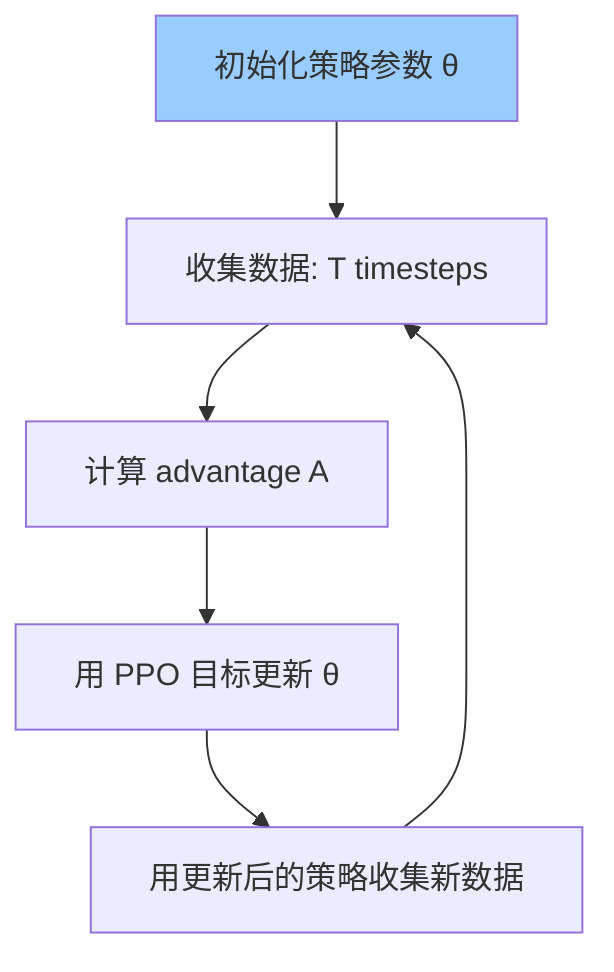

# PPO 深度解读 - OpenAI 默认强化学习算法

> 中文简称：PPO 深度解读 - OpenAI 默认强化学习算法

> **一句话理解**: PPO 就像"安全的学习步伐"——它限制每次更新的幅度，防止策略变化太大导致性能崩溃，同时保持样本效率，是工程上最实用的策略梯度算法。

---

## 论文信息

| 属性 | 内容 |
|------|------|
| **论文** | Proximal Policy Optimization Algorithms |
| **作者** | Schulman et al., OpenAI |
| **发表** | arXiv 2017 |

---

## 1. 为什么需要 PPO？

### 策略梯度的难题

```
问题: 更新步长难把握
- 步长太大: 策略崩溃，性能断崖式下降
- 步长太小: 收敛太慢，样本效率低

之前的方法:
- TRPO: 用 KL 散度约束更新，但计算复杂
- 随机梯度: 步长难以确定
```

---

## 2. PPO 核心思想

### 裁剪替代目标 (Clipped Surrogate Objective)

```
标准策略梯度:
L = E[log π(a|s) · A]

PPO 改进:
L^CLIP(θ) = E[ min( r(θ)·A, clip(r(θ), 1-ε, 1+ε)·A ) ]

其中 r(θ) = π_θ(a|s) / π_θ_old(a|s) (概率比)

clip 效果:
- 当 r(θ) 有利于动作且超出 [1-ε, 1+ε] 时，限制梯度
- 当 r(θ) 不利于动作时，不裁剪（让策略纠正）
```

### ε = 0.2 是什么意思？

```
概率比 r(θ) 限制在 [0.8, 1.2]
- r < 0.8: 策略太保守，裁剪
- r > 1.2: 策略太激进，裁剪
- 0.8 ≤ r ≤ 1.2: 正常梯度

效果: 防止一次更新变化太大
```

---

## 3. 算法流程



```
for epoch in range(K):
    for batch in data:
        # 计算 ratio 和 clipped ratio
        r = π_θ(a|s) / π_θ_old(a|s)
        clipped_r = clip(r, 1-ε, 1+ε)

        # 取最小值（始终优化更保守的策略）
        L = min(r·A, clipped_r·A)

        # 梯度更新
        optimizer.zero_grad()
        -L.mean().backward()
        optimizer.step()
```

---

## 4. 与 TRPO 对比

| 方面 | TRPO | PPO |
|------|------|-----|
| 约束方式 | KL 散度硬约束 | 裁剪软约束 |
| 计算复杂度 | 需要共轭梯度 | 只需一阶优化 |
| 采样效率 | 相似 | 相似 |
| 实现难度 | 复杂 | 简单 |
| 实际效果 | 好 | 几乎一样好 |

---

## 5. 为什么 PPO 最流行？

```
【优点】
✓ 实现简单（只需一阶优化）
✓ 采样效率高
✓ 稳定性好（裁剪防止大更新）
✓ 调参简单（默认 ε=0.2 大多情况可用）
✓ 通用性强（连续/离散动作都行）

【应用】
- OpenAI 默认 RL 算法
- ChatGPT RLHF 的基础（用 PPO 优化奖励）
- 游戏 AI、机器人控制首选
```

---

## 6. 在 RLHF 中的应用

```
ChatGPT 训练流程:

1. SFT: 用人类示范微调
2. 奖励模型: 训练一个 reward model 预测人类偏好
3. PPO: 用 PPO 优化策略，最大化 reward

PPO 在这里的作用:
- 最大化 reward 信号
- 限制策略不偏离 SFT 太远
- 保持语言模型的 fluency
```

---

## 7. 关键公式总结

```
PPO 目标函数:

L^CLIP(θ) = E_t[ min( r_t(θ)·A_t, clip(r_t(θ), 1-ε, 1+ε)·A_t ) ]

其中:
- r_t(θ) = π_θ(a_t|s_t) / π_θ_old(a_t|s_t)
- A_t = 优势函数估计
- ε = 0.2 (通常)
```

---

## 8. 后续发展

```
PPO → PPO2 → Generalized PPO
            → 使用其他价值估计方法
```

---

## 附录：PPO 关键超参数速查

| 参数 | 推荐值 | 说明 |
|------|--------|------|
| clip ε | 0.1–0.3 | 截断范围 |
| GAE λ | 0.95 | 优势估计平滑 |
| Epochs | 3–10 | 每批数据复用次数 |
| Mini-batch Size | 64–4096 | 小批量大小 |
| Entropy Coef | 0.01 | 探索鼓励系数 |
| Value Loss Coef | 0.5 | 价值损失权重 |
| Learning Rate | 3e-4 (Adam) | 学习率 |
| Rollout Steps | 2048 | 每次采集步数 |

## 附录：PPO 应用场景

| 场景 | 代表项目 | 说明 |
|------|----------|------|
| 游戏AI | OpenAI Five, Hide-and-Seek | 多智能体协作 |
| 机器人控制 | MuJoCo, Isaac Gym | 连续动作空间 |
| LLM对齐 | InstructGPT, ChatGPT | RLHF核心算法 |
| 自动驾驶 | 路径规划决策 | 安全约束优化 |

> 💡 PPO 因其“开箱即用”的稳定性，已成为从游戏AI到LLM对齐的事实标准策略梯度算法。

---

*原始论文: [arXiv:1707.06347](https://arxiv.org/abs/1707.06347)*
## 相关链接

- [[06_强化学习/02_Deep_RL/Deep_RL|深度强化学习]] — PPO 所属领域
- [[06_强化学习/02_Deep_RL/index|深度强化学习索引]] — 主题导览
- [[06_强化学习/02_Deep_RL/DQN_Deep_Dive|DQN 深度解析]] — 同类主流算法对比
- [[06_强化学习/03_RLHF_Alignment/RLHF_DPO_GRPO_Deep_Dive|RLHF/DPO/GRPO 深度解析]] — PPO 在 RLHF 中的应用
- [[概念/Training/ppo|PPO]] — PPO 概念卡片
- [[06_强化学习/02_Deep_RL/SAC_Deep_Dive|SAC 深度解析]] — 同类策略梯度算法
