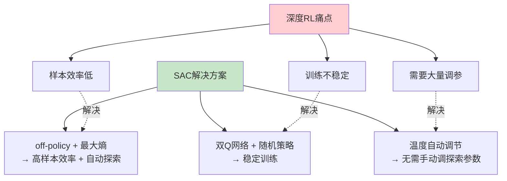
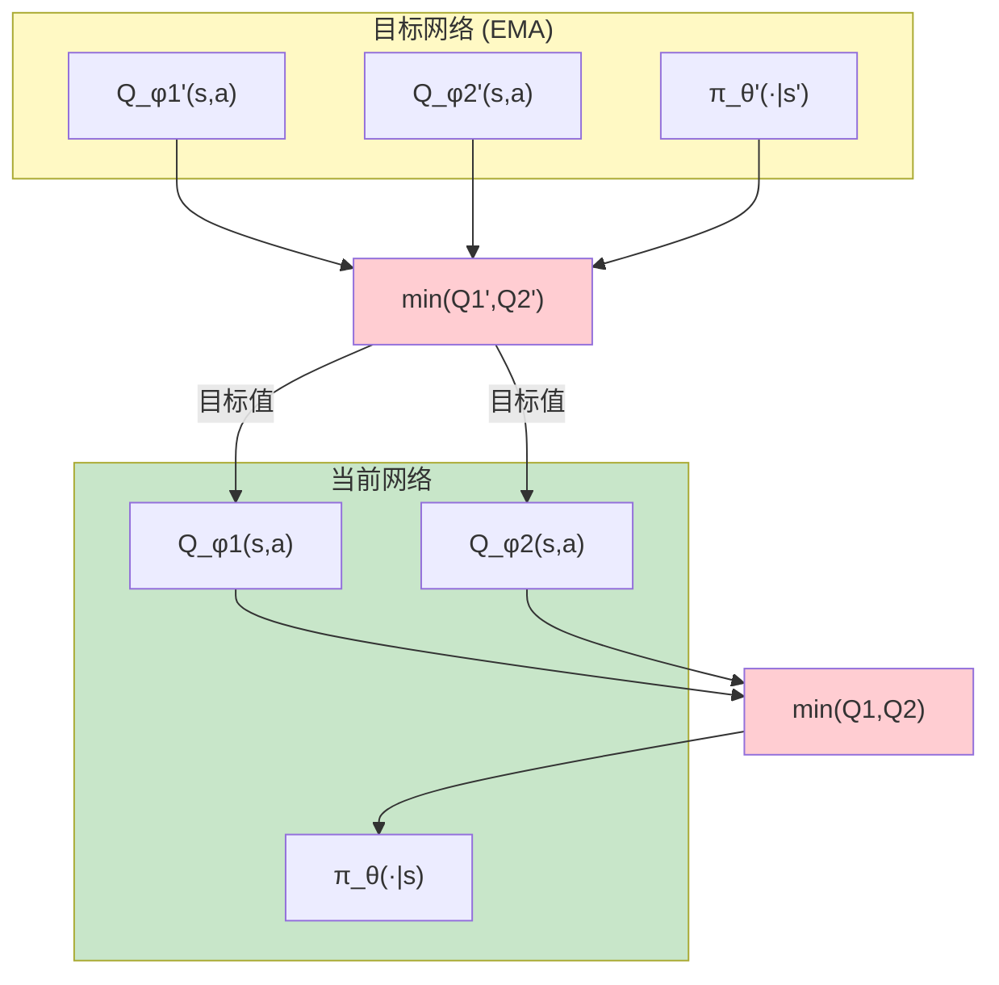
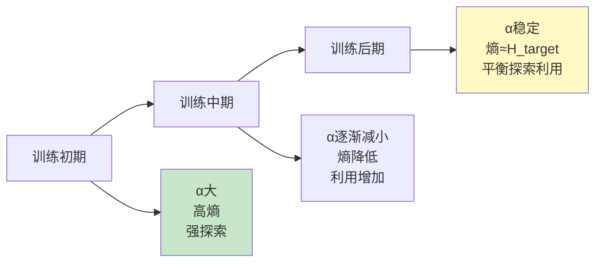
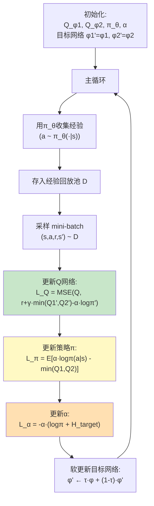

# SAC 深度解析 (Soft Actor-Critic Deep Dive)

> 中文简称：SAC 深度解析

> **一句话理解**: SAC就像一个"既想赢又要稳"的玩家——它不仅追求高回报，还鼓励探索(保持策略的随机性)，通过最大熵原则在利用和探索之间找到最优平衡，是连续控制任务的首选算法。

---

## 目录

- [论文信息](#论文信息)
- [1. 为什么需要SAC](#1-为什么需要sac)
- [2. 最大熵强化学习](#2-最大熵强化学习)
- [3. SAC的三个核心特征](#3-sac的三个核心特征)
- [4. 数学推导](#4-数学推导)
- [5. 双Q网络](#5-双q网络)
- [6. 温度自动调节](#6-温度自动调节)
- [7. 算法流程](#7-算法流程)
- [8. 代码实现](#8-代码实现)
- [9. 与其他算法对比](#9-与其他算法对比)
- [10. 实际应用](#10-实际应用)
- [11. 对比表格](#11-对比表格)
- [Related](#related)

---

## 论文信息

| 属性 | 内容 |
|------|------|
| **论文** | Soft Actor-Critic: Off-Policy Maximum Entropy Deep RL with a Stochastic Actor |
| **作者** | Haarnoja et al. |
| **机构** | UC Berkeley, Google Brain |
| **发表** | ICML 2018 |
| **代码** | [rail-berkeley/softlearning](https://github.com/rail-berkeley/softlearning) |
| **影响** | 连续控制任务的SOTA，Google机器人控制首选 |

---

## 1. 为什么需要SAC

### 深度RL的三大痛点

```
问题1: 样本效率低
  → DDPG/TD3: off-policy，但探索依赖外部噪声
  → PPO: on-policy，数据用一次就扔
  → 需要数百万步交互

问题2: 训练不稳定
  → DDPG: 对超参数极其敏感
  → 值函数高估导致策略崩溃
  → 微小的变化导致完全不同的结果

问题3: 需要大量调参
  → 每个新任务都需要重新调参
  → 探索噪声大小难以确定
  → 没有自动化的探索机制
```

### SAC的解决方案



---

## 2. 最大熵强化学习

### 标准RL vs 最大熵RL

```
标准RL目标:
  max_π E[Σ_t γ^t r(s_t, a_t)]
  → 只关注累积奖励
  → 探索需要外部机制 (ε-greedy, 高斯噪声)

最大熵RL目标:
  max_π E[Σ_t γ^t (r(s_t, a_t) + α·H(π(·|s_t)))]
  → 奖励 + 策略熵
  → H(π) = -E[log π(a|s)] 是策略的熵
  → α 是温度参数，控制熵的权重

直觉:
  → 最大化奖励 AND 最大化随机性
  → 在多个能获得相同奖励的行为之间不偏倚
  → 内在探索机制
```

### 熵正则化的直觉

```
为什么熵很重要?

场景: 走迷宫，有两条路到终点

标准RL:
  → 学会走其中一条 (随机选的)
  → 另一条被遗忘
  → 如果第一条路突然被堵 → 需要重新学习

最大熵RL:
  → 两条路都会走 (都有奖励 + 熵高)
  → 如果一条被堵 → 立即走另一条
  → 更鲁棒、更适应环境变化

更深层的好处:
  → 熵高 = 行为多样 = 更好的探索
  → 避免"过早收敛"到次优策略
  → 学到更丰富的技能组合
```

### 最大熵的最优策略

```
最大熵RL的最优策略不是确定性的!

标准RL最优策略:
  π*(a|s) = δ(a = argmax Q*(s,a))  ← 确定性

最大熵RL最优策略:
  π*(a|s) ∝ exp(1/α · Q_soft*(s,a))  ← 随机性(Boltzmann策略)

  → 概率正比于exp(Q/α)
  → Q高的动作概率大，但其他动作也有概率
  → α→0: 退化为贪婪策略
  → α→∞: 均匀随机策略
```

---

## 3. SAC的三个核心特征

SAC论文标题包含了三个关键特征：

### 特征1: Off-Policy (离策略)

```
Off-Policy:
  → 可以用旧数据训练 (经验回放)
  → 数据效率高
  → 可以重复利用经验

vs On-Policy (PPO):
  → 只能用当前策略收集的数据
  → 数据用完即弃
  → 样本效率低

SAC使用经验回放:
  → 存储所有 (s, a, r, s') 经验
  → 随机采样mini-batch训练
  → 数据利用率高
```

### 特征2: Maximum Entropy (最大熵)

```
如上所述:
  → 目标函数包含熵奖励
  → 自动探索
  → 无需手动设置探索噪声

vs DDPG/TD3:
  → 需要外部探索噪声 (Ornstein-Uhlenbeck, 高斯)
  → 噪声大小需要调参
  → 不同任务需要不同噪声
```

### 特征3: Stochastic Actor (随机策略)

```
SAC的策略网络输出分布:
  → 连续动作: π(a|s) = N(μ(s), σ(s))
  → 输出均值μ和标准差σ
  → 采样动作 a ~ π(·|s)

vs DDPG (确定性策略):
  → π(s) = μ(s) ← 确定性映射
  → 探索完全依赖外部噪声
  → 策略缺乏随机性

随机策略的优势:
  → 自带探索
  → 梯度可计算 (重参数化)
  → 更鲁棒 (多模态策略)
```

---

## 4. 数学推导

### 软Q函数和软值函数

```
定义软Q函数 (Soft Q-Function):

  Q^π(s,a) = E[Σ_{t≥0} γ^t (r_t + α·H(π(·|s_{t+1})))]

  → 在策略π下，执行动作a，然后遵循π的软累积回报

定义软值函数 (Soft Value Function):

  V^π(s) = E_{a~π}[Q^π(s,a) - α·log π(a|s)]

  → 在状态s下，遵循策略π的期望软值

关系:
  V^π(s) = E_{a~π}[Q^π(s,a)] + α·H(π(·|s))
```

### 软贝尔曼方程

```
软贝尔曼方程 (Soft Bellman Equation):

  Q^π(s,a) = r(s,a) + γ · E_{s'~P}[V^π(s')]

  V^π(s') = E_{a'~π}[Q^π(s',a') - α·log π(a'|s')]

展开:
  Q^π(s,a) = r(s,a) + γ · E_{s'}[E_{a'}[Q^π(s',a') - α·log π(a'|s')]]

直觉:
  → Q值 = 即时奖励 + 折扣 × (下一步的期望软值)
  → 软值 = 期望Q值 - α·log概率 = Q值减去选择该动作的"代价"
```

### 最优软Q函数

```
当π是最优最大熵策略时:

  Q*(s,a) = r(s,a) + γ · E_{s'}[V*(s')]

  V*(s) = α · log ∫ exp(Q*(s,a')/α) da'

  → 这是logsumexp形式!
  → V*(s) = α · logsumexp_a(Q*(s,a)/α)

最优策略:
  π*(a|s) = exp((Q*(s,a) - V*(s)) / α)
          = softmax(Q*(s,·)/α)

  → Boltzmann/Softmax策略
  → 概率正比于exp(Q/α)
```

### SAC的损失函数

```
SAC有三个损失函数，交替优化:

1. Critic (Q网络) 损失:
   L_Q(φ) = E[(Q_φ(s,a) - Q_target)²]

   其中 Q_target = r + γ(min(Q_φ1'(s',a'), Q_φ2'(s',a')) - α·log π_θ'(a'|s'))
         a' ~ π_θ'(·|s')

   → 用两个Q网络的最小值 (防止高估)
   → 使用目标网络 (φ')

2. Actor (策略网络) 损失:
   L_π(θ) = E[α·log π_θ(a|s) - Q_φ(s,a)]
            a ~ π_θ(·|s)

   → 最小化: -E[Q(s,a) - α·log π(a|s)]
   → 最大化Q值，同时最大化熵

3. 温度参数 α 损失 (自动调节):
   L_α = E[-α·log π_θ(a|s) - α·H̄]
   
   其中 H̄ 是目标熵 (通常 = -dim(A))
   → 自动调节α使策略熵接近目标
```

---

## 5. 双Q网络

### 高估偏差问题

```
问题: Q学习中的高估偏差 (Overestimation Bias)

在标准Q学习中:
  Q_target = r + γ · max_a' Q(s', a')

max操作引入正偏差:
  E[max_a Q(s,a)] ≥ max_a E[Q(s,a)]
  → 因为max(E[X]) ≤ E[max(X)]

当Q估计有噪声时:
  → max会选到被高估的值
  → 高估被不断放大
  → 策略追逐被高估的动作
  → 性能崩溃

DDPG因此非常不稳定
```

### SAC的双Q解决方案 (Clipped Double Q)

```
SAC的解决方案 (借鉴TD3):

训练两个独立的Q网络: Q_φ1, Q_φ2

在计算目标值时取最小值:
  Q_target = r + γ · (min(Q_φ1'(s',a'), Q_φ2'(s',a')) - α·log π(a'|s'))

取min的效果:
  → 即使一个Q网络高估，另一个可能不高估
  → min抵消高估偏差
  → 更保守但更稳定的Q估计

同时:
  → Actor用 min(Q_φ1(s,a), Q_φ2(s,a)) 作为目标
  → 两个Q网络都参与策略优化
```

### 双Q网络结构



---

## 6. 温度自动调节

### 固定α的问题

```
α (温度参数) 控制熵的权重:

α太大:
  → 策略过于随机
  → 即使知道最优动作也不会选择
  → 奖励低

α太小:
  → 策略过早确定性
  → 探索不足
  → 可能陷入次优

不同任务需要不同的α:
  → 简单任务: α小 (少探索)
  → 复杂任务: α大 (多探索)

固定α需要逐任务调参 → 不实用
```

### 自动温度调节

```
SAC的自动α调节 (SAC v2):

核心思想:
  → 不手动设置α
  → 在策略优化过程中自动调节α
  → 使策略熵保持在目标值附近

目标熵 (Target Entropy):
  H_target = -|A|  (动作空间维度的负数)
  
  例如: 6维连续动作 → H_target = -6

约束优化:
  max_π E[Σ(r + α·H(π))]
  s.t. E[-log π(a|s)] ≥ H_target  (熵不低于目标)

对偶问题 (对α求解):
  L(α) = E[-α·log π(a|s) - α·H_target]
       = -α · (E[log π(a|s)] + H_target)
       = -α · (-H_current + H_target)
       = α · (H_current - H_target)

梯度:
  ∂L/∂α = H_current - H_target

  → 当 H_current > H_target: α减小 (减少探索)
  → 当 H_current < H_target: α增大 (增加探索)
  → 自动平衡!
```

### 自动调节的效果



---

## 7. 算法流程

### SAC完整算法



### SAC伪代码

```
算法: Soft Actor-Critic

输入: 空间回放池D, 目标熵H̄, 软更新率τ

初始化:
  Q_φ1, Q_φ2: 两个Q网络
  π_θ: 策略网络
  α: 温度参数 (初始值1.0)
  Q_φ1' ← Q_φ1, Q_φ2' ← Q_φ2: 目标网络

for each iteration:
    # ======== 数据收集 ========
    for each environment step:
        a_t ~ π_θ(·|s_t)              # 从策略采样
        s_{t+1} ~ P(·|s_t, a_t)       # 环境交互
        D.add((s_t, a_t, r_t, s_{t+1})) # 存入回放池

    # ======== 梯度更新 ========
    for each gradient step:
        # 1. 采样mini-batch
        (s, a, r, s') ~ D

        # 2. 计算目标Q值
        a' ~ π_θ(·|s')                # 从策略采样下一步动作
        Q_target = r + γ·(min(Q_φ1'(s',a'), Q_φ2'(s',a')) 
                          - α·log π_θ(a'|s'))

        # 3. 更新Q网络
        L_Q = ½·[(Q_φ1(s,a) - Q_target)² + (Q_φ2(s,a) - Q_target)²]
        ∇_φ L_Q → 更新φ1, φ2

        # 4. 更新策略
        ã ~ π_θ(·|s)                  # 重参数化采样
        L_π = α·log π_θ(ã|s) - min(Q_φ1(s,ã), Q_φ2(s,ã))
        ∇_θ L_π → 更新θ

        # 5. 更新温度α
        L_α = -α·(log π_θ(ã|s) + H̄)
        ∇α L_α → 更新α

        # 6. 软更新目标网络
        φ1' ← τ·φ1 + (1-τ)·φ1'
        φ2' ← τ·φ2 + (1-τ)·φ2'
```

---

## 8. 代码实现

### 完整SAC实现

```python
import torch
import torch.nn as nn
import torch.nn.functional as F
import numpy as np
from copy import deepcopy


class GaussianPolicy(nn.Module):
    """高斯策略网络: 输出均值和标准差"""

    def __init__(self, state_dim, action_dim, hidden_dim=256,
                 action_range=1.0):
        super().__init__()
        self.action_range = action_range

        self.net = nn.Sequential(
            nn.Linear(state_dim, hidden_dim),
            nn.ReLU(),
            nn.Linear(hidden_dim, hidden_dim),
            nn.ReLU(),
        )
        self.mean = nn.Linear(hidden_dim, action_dim)
        self.log_std = nn.Linear(hidden_dim, action_dim)

    def forward(self, state):
        h = self.net(state)
        mean = self.mean(h)
        log_std = self.log_std(h).clamp(-20, 2)  # 限制标准差范围
        std = log_std.exp()
        return mean, std

    def sample(self, state):
        """重参数化采样"""
        mean, std = self.forward(state)
        dist = torch.distributions.Normal(mean, std)
        x = dist.rsample()  # 重参数化采样
        action = torch.tanh(x) * self.action_range  # 压缩到动作范围

        # 计算log概率 (考虑tanh变换的Jacobian修正)
        log_prob = dist.log_prob(x)
        log_prob -= torch.log(1 - action.pow(2) + 1e-6)
        log_prob = log_prob.sum(dim=-1, keepdim=True)

        return action, log_prob


class QNetwork(nn.Module):
    """双Q网络"""

    def __init__(self, state_dim, action_dim, hidden_dim=256):
        super().__init__()

        # Q1
        self.q1 = nn.Sequential(
            nn.Linear(state_dim + action_dim, hidden_dim),
            nn.ReLU(),
            nn.Linear(hidden_dim, hidden_dim),
            nn.ReLU(),
            nn.Linear(hidden_dim, 1),
        )
        # Q2
        self.q2 = nn.Sequential(
            nn.Linear(state_dim + action_dim, hidden_dim),
            nn.ReLU(),
            nn.Linear(hidden_dim, hidden_dim),
            nn.ReLU(),
            nn.Linear(hidden_dim, 1),
        )

    def forward(self, state, action):
        sa = torch.cat([state, action], dim=-1)
        return self.q1(sa), self.q2(sa)


class SAC:
    """完整SAC算法实现"""

    def __init__(self, state_dim, action_dim, lr=3e-4, gamma=0.99,
                 tau=0.005, alpha_lr=3e-4, hidden_dim=256, device='cuda'):
        self.gamma = gamma
        self.tau = tau
        self.device = device
        self.action_dim = action_dim

        # 策略网络
        self.policy = GaussianPolicy(
            state_dim, action_dim, hidden_dim
        ).to(device)
        self.policy_optim = torch.optim.Adam(self.policy.parameters(), lr=lr)

        # Q网络
        self.q_network = QNetwork(
            state_dim, action_dim, hidden_dim
        ).to(device)
        self.q_optim = torch.optim.Adam(self.q_network.parameters(), lr=lr)

        # 目标Q网络
        self.q_target = deepcopy(self.q_network).to(device)
        for p in self.q_target.parameters():
            p.requires_grad = False

        # 自动温度调节
        self.target_entropy = -float(action_dim)
        self.log_alpha = torch.zeros(1, requires_grad=True, device=device)
        self.alpha_optim = torch.optim.Adam(
            [self.log_alpha], lr=alpha_lr
        )

    @property
    def alpha(self):
        return self.log_alpha.exp()

    def select_action(self, state, evaluate=False):
        """选择动作"""
        with torch.no_grad():
            state = torch.FloatTensor(state).unsqueeze(0).to(self.device)
            if evaluate:
                mean, _ = self.policy(state)
                return mean.cpu().numpy().flatten()
            else:
                action, _ = self.policy.sample(state)
                return action.cpu().numpy().flatten()

    def update(self, replay_buffer, batch_size=256):
        """一步梯度更新"""
        # 采样经验
        state, action, reward, next_state, done = replay_buffer.sample(
            batch_size
        )

        # 转为tensor
        state = torch.FloatTensor(state).to(self.device)
        action = torch.FloatTensor(action).to(self.device)
        reward = torch.FloatTensor(reward).unsqueeze(1).to(self.device)
        next_state = torch.FloatTensor(next_state).to(self.device)
        done = torch.FloatTensor(done).unsqueeze(1).to(self.device)

        # ======== 1. 更新Q网络 ========
        with torch.no_grad():
            next_action, next_log_prob = self.policy.sample(next_state)
            q1_next, q2_next = self.q_target(next_state, next_action)
            q_next = torch.min(q1_next, q2_next) - self.alpha * next_log_prob
            q_target = reward + (1 - done) * self.gamma * q_next

        q1, q2 = self.q_network(state, action)
        q_loss = F.mse_loss(q1, q_target) + F.mse_loss(q2, q_target)

        self.q_optim.zero_grad()
        q_loss.backward()
        self.q_optim.step()

        # ======== 2. 更新策略 ========
        new_action, log_prob = self.policy.sample(state)
        q1_new, q2_new = self.q_network(state, new_action)
        q_new = torch.min(q1_new, q2_new)

        policy_loss = (self.alpha.detach() * log_prob - q_new).mean()

        self.policy_optim.zero_grad()
        policy_loss.backward()
        self.policy_optim.step()

        # ======== 3. 更新温度α ========
        alpha_loss = -(self.log_alpha * (
            log_prob.detach() + self.target_entropy
        )).mean()

        self.alpha_optim.zero_grad()
        alpha_loss.backward()
        self.alpha_optim.step()

        # ======== 4. 软更新目标网络 ========
        for param, target_param in zip(
            self.q_network.parameters(), self.q_target.parameters()
        ):
            target_param.data.copy_(
                self.tau * param.data + (1 - self.tau) * target_param.data
            )

        return {
            'q_loss': q_loss.item(),
            'policy_loss': policy_loss.item(),
            'alpha': self.alpha.item(),
            'q_value': q1.mean().item()
        }


# ======== 经验回放池 ========
class ReplayBuffer:
    def __init__(self, capacity, state_dim, action_dim):
        self.capacity = capacity
        self.ptr = 0
        self.size = 0

        self.state = np.zeros((capacity, state_dim), dtype=np.float32)
        self.action = np.zeros((capacity, action_dim), dtype=np.float32)
        self.reward = np.zeros(capacity, dtype=np.float32)
        self.next_state = np.zeros((capacity, state_dim), dtype=np.float32)
        self.done = np.zeros(capacity, dtype=np.float32)

    def add(self, s, a, r, s', d):
        self.state[self.ptr] = s
        self.action[self.ptr] = a
        self.reward[self.ptr] = r
        self.next_state[self.ptr] = s'
        self.done[self.ptr] = d

        self.ptr = (self.ptr + 1) % self.capacity
        self.size = min(self.size + 1, self.capacity)

    def sample(self, batch_size):
        idx = np.random.randint(0, self.size, size=batch_size)
        return (self.state[idx], self.action[idx], self.reward[idx],
                self.next_state[idx], self.done[idx])


# ======== 训练循环 ========
def train_sac(env, sac, replay_buffer, total_steps=1000000,
              start_steps=10000, update_after=1000, update_every=50):
    """完整SAC训练循环"""

    state, _ = env.reset()
    episode_return = 0
    episode_len = 0

    for step in range(total_steps):
        # 收集经验 (初始随机探索)
        if step < start_steps:
            action = env.action_space.sample()
        else:
            action = sac.select_action(state)

        next_state, reward, done, truncated, _ = env.step(action)
        done = done or truncated

        replay_buffer.add(state, action, reward, next_state, float(done))

        state = next_state
        episode_return += reward
        episode_len += 1

        if done:
            state, _ = env.reset()
            print(f"Step {step}: Return={episode_return:.1f}, "
                  f"Len={episode_len}")
            episode_return = 0
            episode_len = 0

        # 梯度更新
        if step >= update_after and step % update_every == 0:
            for _ in range(update_every):
                metrics = sac.update(replay_buffer)
                if step % 1000 == 0:
                    print(f"  Q={metrics['q_value']:.2f}, "
                          f"α={metrics['alpha']:.4f}")
```

---

## 9. 与其他算法对比

### SAC vs DDPG vs TD3 vs PPO

| 维度 | SAC | DDPG | TD3 | PPO |
|------|-----|------|-----|-----|
| **策略类型** | 随机 | 确定性 | 确定性 | 随机 |
| **on/off-policy** | off | off | off | on |
| **探索机制** | 内在(熵) | 外部噪声 | 外部噪声 | 内在(随机) |
| **Q网络** | 双Q | 单Q | 双Q | 无 |
| **温度调节** | ✅ 自动 | ❌ | ❌ | ❌ |
| **样本效率** | 🟢 高 | 🟡 中 | 🟢 高 | 🟠 低 |
| **稳定性** | 🟢 高 | 🟠 低 | 🟢 高 | 🟢 高 |
| **调参难度** | 🟢 低 | 🔴 高 | 🟡 中 | 🟡 中 |
| **连续控制** | ✅ | ✅ | ✅ | ✅ |
| **离散动作** | 🟡 需修改 | ❌ | ❌ | ✅ |
| **推荐场景** | 连续控制首选 | 已过时 | 连续控制 | 大规模并行 |

### MuJoCo基准性能对比

```
MuJoCo 连续控制任务平均分 (100K-1M步):

算法          | HalfCheetah | Hopper | Walker2d | Ant
--------------|-------------|--------|----------|------
SAC           | ~12000      | ~3300  | ~3800    | ~6000
TD3           | ~11000      | ~3200  | ~3700    | ~5500
DDPG          | ~8000       | ~2000  | ~2500    | ~3000
PPO           | ~2000       | ~2400  | ~2000    | ~1500

→ SAC在大多数连续控制任务上最优或接近最优
→ 且需要的调参最少
```

> 性能数据为定性估计 ^[inferred]。

---

## 10. 实际应用

### SAC的应用场景

| 应用 | 描述 | 为什么用SAC |
|------|------|-------------|
| **机器人控制** | 机械臂抓取、步态 | 样本高效、稳定 |
| **自动驾驶** | 转向、加速控制 | 连续动作空间 |
| **金融交易** | 投资组合优化 | 探索-利用平衡 |
| **资源调度** | 数据中心冷却 | 连续控制 |
| **游戏AI** | 物理引擎游戏 | 连续动作 |
| **化工过程** | 反应条件控制 | 安全探索 |

### SAC的变体

| 叆体 | 改进 | 适用场景 |
|------|------|----------|
| **SAC v2** | 自动α调节 | 默认版本 |
| **Discrete SAC** | 离散动作空间 | 棋盘游戏 |
| **SAC-AE** | 辅助重建任务 | 像素输入 |
| **MASAC** | 多智能体SAC | 多智能体协作 |
| **SAC+HER** | 事后经验回放 | 稀疏奖励 |
| **Risk-Sensitive SAC** | 风险敏感 | 安全约束 |

---

## 11. 对比表格

### 何时使用SAC

| 场景 | 推荐算法 | 理由 |
|------|----------|------|
| **连续控制(模拟器)** | ✅ SAC | 样本高效，稳定 |
| **连续控制(真实机器人)** | ✅ SAC | 样本效率关键 |
| **离散动作** | 🟡 Discrete SAC / DQN | SAC需修改 |
| **大规模并行** | ❌ PPO | SAC不适合大规模并行 |
| **多智能体** | 🟡 MASAC | 需要扩展 |
| **需要确定性策略** | ❌ TD3 | SAC是随机的 |
| **安全约束** | 🟡 CPO / Safe SAC | 需安全RL扩展 |

### SAC的优缺点总结

```
优点:
  ✅ 样本效率高 (off-policy)
  ✅ 训练稳定 (双Q + 目标网络)
  ✅ 自动探索 (最大熵)
  ✅ 无需调探索参数 (自动α)
  ✅ 多模态策略 (随机策略)
  ✅ 鲁棒性好

缺点:
  ❌ 计算量大 (3个网络 + α)
  ❌ 不适合离散动作 (需要修改)
  ❌ 不适合大规模并行 (off-policy)
  ❌ 随机策略在某些场景不如确定性
  ❌ 超参数仍有 (虽然比DDPG少)
```

---

## Related

- [[06_强化学习/02_深度强化学习/02_深度_RL]] — 深度强化学习（总览）
- [[06_强化学习/02_深度强化学习/10_PPO_深入分析]] — PPO深度解析（on-policy对比）
- [[06_强化学习/02_深度强化学习/03_DQN_深入分析]] — DQN深度解析（值函数方法）
- [[06_强化学习/02_深度强化学习/09_离线_RL_深入分析]] — 离线RL（与off-policy相关）
- [[06_强化学习/02_深度强化学习/08_模型_Based_RL_深入分析]] — 基于模型的RL（模型方法对比）
- [[06_强化学习/01_强化学习基础/03_RL基础]] — RL基础（MDP/贝尔曼方程）
- [[06_强化学习/03_RLHF与对齐/04_RLHF_DPO_GRPO_深入分析|RLHF_Alignment]] — RLHF对齐（PPO在RLHF中的应用）
