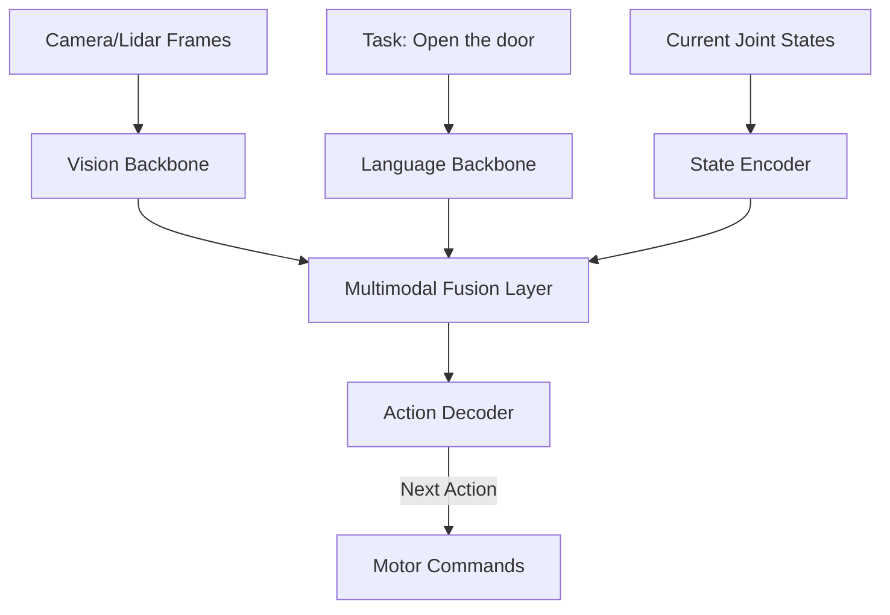

# Robot VLA Training Pipeline 2026: End-to-End Robotic Foundation Models

> **一句话理解**: VLA (Vision-Language-Action) 训练流水线是具身智能的“炼丹炉”——它将海量的视频数据、人类示范数据和仿真环境经验转化为机器人可执行的连贯动作指令。

---

## 目录

| 阶段 | 内容 | 关键技术 |
|------|------|----------|
| [1. 数据采集与增强](#1-数据采集与增强) | 遥操作、VR 示范、视频挖掘 | RT-X, Ego4D |
| [2. 动作 Token 化](#2-动作-token-化) | 连续空间到离散指令的转换 | Action Binning, VQ-Action |
| [3. 多模态对齐训练](#3-多模态对齐训练) | 视觉-文本-动作的统一空间 | Co-training, MoE |
| [4. Sim-to-Real 迁移](#4-sim-to-real-迁移) | 物理仿真、域随机化 | NVIDIA Isaac, PhysX |
| [5. 部署与微调](#5-部署与微调) | 边缘推理、低延迟执行 | TensorRT-Robot |

---

## 1. 数据采集与增强

具身智能最大的挑战在于“高质量动作数据”的稀缺。

- **遥操作 (Teleoperation)**: 人类佩戴传感器或操作机械臂完成任务，记录关节角度和视觉输入。
- **VR/AR 示范**: 利用 VR 头显让示范者在 3D 空间中“指挥”虚拟机器人，产出标注数据。
- **互联网视频挖掘**: 利用大模型从 YouTube 视频中识别“开门”、“切菜”等动作，并通过 **Video-to-Action** 技术反推物理指令。

---

## 2. 动作 Token 化 (Action Tokenization)

就像 LLM 把文字变成 Tokens，VLA 需要把关节的角速度、加速度变成 Tokens。

- **VQ-Action**: 使用向量量化自编码器，将连续的 7 自由度机械臂动作压缩成离散的编码。
- **分级控制**: 
  - **High-level**: “走到冰箱前”。
  - **Low-level**: 关节具体电流输出。
- **2026 趋势**: **RT-2 / π0** 风格的统一预测，即将动作直接作为语言模型的“扩展词表”。

---

## 3. 多模态对齐训练 (VLA Alignment)

### 3.1 跨域联合训练 (Co-training)
利用通用的视觉数据（图片）提升机器人的视觉认知，同时利用专门的机器人动作数据提升控制能力。

---

## 4. Sim-to-Real 迁移

在仿真器（如 NVIDIA Isaac Sim）中练习 100 万次，胜过在现实中摔坏 100 台机器人。

- **域随机化 (Domain Randomization)**: 在仿真中随机改变地板颜色、光照、重力参数，迫使模型学习更具鲁棒性的特征。
- **数字孪生**: 为现实场景构建 1:1 的物理模型，实现精准的闭环验证。

---

## 5. 2026 关键突破：长程规划 (Long-horizon)

早期的 VLA 只能做“拿杯子”这种瞬间动作。2026 年的流水线重点在于：
- **层次化强化学习 (HRL)**: 分解复杂任务（如“帮我做一份三明治”）。
- **世界模型预测试**: 机器人在行动前，会在内部“想象”动作的结果。

---

## 6. 工具与平台

- **OpenX-Embodiment**: 全球最大的机器人动作开源数据集。
- **Robot Operating System (ROS 2)**: 工业标准通信底座。
- **Gymnasium-Robotics**: 强化学习标准接口。

---

## Related

- [[强化学习/Robotics_Embodied_AI/Embodied_AI_2026]] — 具身智能概论
- [[强化学习/Robotics_Embodied_AI/VLA_Models_2026]] — 模型架构深度解析
- [[深度学习/World_Models/World_Models_2026]] — 世界模型在控制中的应用
- [[概念/teleoperation]] — 遥操作基础

---

## 附录：VLA 训练关键参数

| 参数 | 典型值 | 说明 |
|------|--------|------|
| 视觉编码器 | SigLIP / DINOv2 | 图像特征提取 |
| 语言模型基座 | LLaMA-3 / Gemma-2 | 语言理解与推理 |
| 动作 Token 数 | 256–1024 | 动作空间离散化 |
| 训练数据量 | 10K–1M 轨迹 | 遥操作采集 |
| 学习率 | 1e-4 → 1e-5 | 余弦退火 |
| Batch Size | 64–256 | 分布式训练 |
| 训练时长 | 24h–7d | 取决于数据规模 |

## 附录：主流 VLA 模型对比

| 模型 | 机构 | 参数量 | 特点 |
|------|------|--------|------|
| RT-2 | Google DeepMind | 55B | 视觉-语言-动作端到端 |
| π0 | Physical Intelligence | 3B | 通用操作、流匹配 |
| GR00T N1 | NVIDIA | 2B | 人形机器人专用 |
| Octo | UC Berkeley | 93M | 开源、轻量级 |
| OpenVLA | Stanford | 7B | 开源复现 RT-2 |
| Gemini Robotics | Google | — | 多模态融合 |

## 附录：数据采集方法对比

| 方法 | 成本 | 质量 | 规模 | 适用场景 |
|------|------|------|------|----------|
| 遥操作 | 高 | 高 | 中 | 精细操作 |
| 仿真生成 | 低 | 中 | 大 | 导航/移动 |
| 视频学习 | 低 | 中低 | 大 | 预训练 |
| 人类示教 | 中 | 高 | 小 | 复杂任务 |

## 附录：Sim-to-Real 迁移检查清单

| 检查项 | 说明 | 状态 |
|--------|------|------|
| 域随机化 | 视觉/物理参数随机化 | ☐ |
| 动作延迟补偿 | 模拟真实控制延迟 | ☐ |
| 传感器噪声 | 添加真实传感器噪声模型 | ☐ |
| 渐进式迁移 | 从简单任务到复杂任务 | ☐ |
| 安全约束 | 力/速度限制保护 | ☐ |

> 💡 VLA 训练的核心挑战：数据稀缺（遥操作成本高）+ Sim-to-Real Gap（仿真与现实差异）。2026年的突破方向是“少量真实数据 + 大量仿真数据 + 视频预训练”的混合策略。

---

*Last updated: 2026-07-21*

## 附录：VLA 训练常见问题

| 问题 | 解答 |
|------|------|
| 动作空间如何离散化？ | 将连续动作空间均匀分箱，或用VQ-VAE学习码本 |
| 需要多少遥操作数据？ | 单任务100-500轨迹，多任务10K+轨迹 |
| 如何评估VLA模型？ | 成功率 + 泛化性（新物体/新场景/新指令） |
| 训练需要多少GPU？ | 7B模型建议8×A100，3B模型4×A100可训 |
| Sim-to-Real Gap怎么解决？ | 域随机化 + 渐进式微调 + 少量真实数据 |

## 附录：VLA 训练工具链

| 工具 | 用途 | 说明 |
|------|------|------|
| Isaac Sim | 仿真环境 | NVIDIA物理仿真平台 |
| LeRobot | 训练框架 | HuggingFace开源机器人学习 |
| ALOHA | 遥操作硬件 | 低成本双臂遥操作 |
| RoboCasa | 仿真任务 | 厨房场景操作任务 |
| Open X-Embodiment | 数据集 | 1M+多机器人轨迹 |
| DROID | 数据采集 | 分布式遥操作采集网络 |

> 💡 2026年VLA训练的核心趋势：“基础模型预训练 + 少量任务微调”范式正在从 NLP 复制到机器人领域。

## 附录：VLA 训练检查清单

| 检查项 | 说明 | 状态 |
|--------|------|------|
| 数据质量审核 | 过滤失败轨迹、异常动作 | ☐ |
| 动作空间定义 | 确定自由度、控制频率 | ☐ |
| 视觉编码器选择 | SigLIP/DINOv2/CLIP | ☐ |
| 语言指令模板 | 统一任务描述格式 | ☐ |
| 分布式训练配置 | FSDP/DeepSpeed | ☐ |
| 评估基准建立 | 成功率/泛化性测试集 | ☐ |
| 安全约束 | 力/速度/工作空间限制 | ☐ |
| 模型评估 | 成功率/泛化性测试 | ☐ |
| 部署验证 | 真实机器人测试 | ☐ |
| 迭代优化 | 根据反馈调整 | ☐ |
| 文档记录 | 训练配置与结果 | ☐ |
| 版本管理 | 模型/数据版本控制 | ☐ |

---
*Last updated: 2026-07-21*
