# 仿真到现实迁移完整指南 (Sim2Real Transfer Guide)

> **一句话理解**: Sim2Real 就像飞行员在飞行模拟器里训练后再开真飞机——模拟器里学会了基本功，但真飞时还要应对乱流、颠簸等"模拟器想不到"的真实差异，所以训练时必须故意"制造各种意外"，让策略足够鲁棒才能落地。

---

## TL;DR

- **核心问题**: 仿真（Sim）环境与真实（Real）世界之间存在 **Reality Gap**（现实鸿沟），直接迁移几乎必然失败
- **五大技术路线**: 域随机化（Domain Randomization）→ 域适应（Domain Adaptation）→ 系统辨识（System Identification）→ 数字孪生（Digital Twin）→ 渐进式迁移（Curriculum）
- **核心思想**: 不追求"逼真的仿真器"，而是追求"鲁棒的策略"——让策略能处理仿真器无法预见的真实世界变化
- **2026 范式**: Domain Randomization + Digital Twin + Real-World Fine-tuning 三段式成为标准流水线
- **仿真平台**: Isaac Sim（GPU 加速，NVIDIA 生态）、MuJoCo（高保真物理）、PyBullet（轻量易用）、Gazebo（ROS 生态）、Webots（教育友好）
- **里程碑案例**: OpenAI 魔方手（Domain Randomization 典范）、Boston Dynamics（System Identification 大师）、Tesla Autopilot（仿真 + 影子模式）

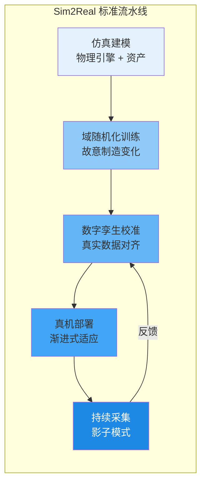

---

## 目录

1. [Sim2Real 问题定义与核心挑战](#1-sim2real-问题定义与核心挑战)
2. [域随机化 (Domain Randomization)](#2-域随机化-domain-randomization)
3. [域适应 (Domain Adaptation)](#3-域适应-domain-adaptation)
4. [系统辨识 (System Identification)](#4-系统辨识-system-identification)
5. [数字孪生 (Digital Twin)](#5-数字孪生-digital-twin)
6. [仿真平台对比](#6-仿真平台对比)
7. [经典成功案例深度解析](#7-经典成功案例深度解析)
8. [渐进式迁移与 Curriculum](#8-渐进式迁移与-curriculum)
9. [代码实战：Sim2Real 训练流水线](#9-代码实战sim2real-训练流水线)
10. [2026 前沿：生成式仿真与 NeRF 环境](#10-2026-前沿生成式仿真与-nerf-环境)
11. [Sim2Real Checklist](#11-sim2real-checklist)
12. [延伸阅读 (Related)](#12-延伸阅读-related)

---

## 1. Sim2Real 问题定义与核心挑战

### 1.1 为什么需要 Sim2Real？

强化学习是 **试错学习**——它需要百万甚至十亿次的交互来训练策略。但在真实物理世界中让机器人试错：

| 限制 | 真实世界 | 仿真世界 |
|------|---------|---------|
| **采样速度** | ~1× 实时（1 个机器人 1 秒 1 步） | 1,000×～1,000,000× 实时（GPU 并行） |
| **样本成本** | 极高（机器人磨损、电费、人力监控） | 近乎免费（GPU 电费） |
| **安全性** | 可能损坏硬件、伤人 | 零风险（只是数字） |
| **可重复性** | 难（光照、摩擦力每次不同） | 完全可控（固定随机种子） |
| **探索自由度** | 受限（不能让机器人做危险动作） | 无限制（随便摔） |

**结论**: 如果只在真实世界训练，一个机器人策略可能需要数百年才能收敛。Sim2Real 的核心价值是：**在仿真中快速训练，然后迁移到真实世界。**

### 1.2 Reality Gap（现实鸿沟）—— 核心难题

Reality Gap 是仿真与真实之间的系统性差异，它来自多个层面：

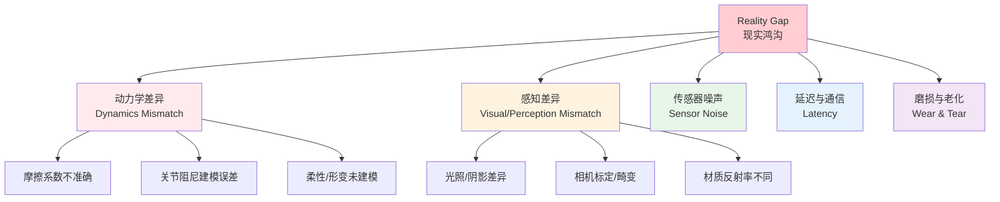

**具体例子**:

- **摩擦系数**: 仿真中地面摩擦 = 0.5，真实可能是 0.3～0.7 之间的随机值，取决于湿度、灰尘、磨损
- **关节延迟**: 仿真中指令是瞬时执行的，真实关节有 5～30ms 的电机响应延迟
- **视觉外观**: 仿真渲染的物体"太干净"，真实场景有划痕、污渍、反光、动态阴影
- **传感器噪声**: 力矩传感器有电气噪声，IMU 有漂移，相机有暗角和色差

> **关键洞察**: Reality Gap 不是"bug"，而是**本质性的物理限制**。完美的仿真在理论上不可能——因为真实世界的物理参数是连续且时变的，而仿真器只能离散近似。

### 1.3 Sim2Real 的两大哲学路线

| 路线 | 核心思想 | 代表方法 | 优点 | 缺点 |
|------|---------|---------|------|------|
| **零样本迁移 (Zero-Shot)** | 在仿真中训练一个"通用到能应对任何差异"的策略 | Domain Randomization | 不需要真实数据 | 策略可能过于保守 |
| **少样本适应 (Few-Shot)** | 用少量真实数据微调仿真策略 | Domain Adaptation, System ID | 更精确 | 需要真实数据采集 |

2026 年的主流是 **两者结合**: 先用 Domain Randomization 训练鲁棒基础策略，再用少量真实数据做 System ID + Fine-tuning。

---

## 2. 域随机化 (Domain Randomization)

### 2.1 核心思想

> **域随机化的直觉**: 如果你在训练时故意让地面摩擦力在 0.1～0.9 之间随机变化、光照在白天到黑夜之间随机切换、物体重量在 0.1kg～5kg 之间随机浮动——那么训练出来的策略就会"见过一切"，真实世界的某个具体值只是它训练分布中的一个采样点，自然能应对。

**数学表述**:

真实世界参数 $\phi_{real}$ 是未知的，但我们假设它落在某个分布 $\Phi$ 内。在仿真训练时，每个 episode 随机采样 $\phi_i \sim p(\phi)$，优化目标变为：

$$
\pi^* = \arg\max_\pi \mathbb{E}_{\phi \sim p(\phi)} \left[ \mathbb{E}_{\tau \sim \pi, M_\phi} \left[ \sum_t \gamma^t r_t \right] \right]
$$

策略 $\pi^*$ 被优化为在整个参数分布上表现良好，而非单一参数点上。

### 2.2 三大类域随机化

#### 2.2.1 视觉随机化 (Visual Domain Randomization)

改变渲染外观，让策略不依赖"完美图像"：

| 随机化对象 | 范围示例 | 代码（Isaac Sim / Gym） |
|-----------|---------|----------------------|
| 贴图/颜色 | 物体颜色随机 RGB | `obj.color = np.random.uniform(0,1,3)` |
| 光照方向 | 太阳角度 0°～360° | `light.set_rotation(np.random.uniform(0,360))` |
| 光照强度 | 0.3x～2.0x 亮度 | `light.intensity = np.random.uniform(300, 2000)` |
| 相机位姿 | 平移 ±10cm，旋转 ±5° | `cam.set_pose(pos+noise, rot+noise)` |
| 背景 | 随机图片背景 | `bg.set_image(random_image_dataset)` |
| 雾/天气 | 雾密度、雨雪 | `scene.fog_density = np.random.uniform(0,0.3)` |

**激进视觉随机化（ADR）**:

OpenAI 在魔方手项目中使用 **Automatic Domain Randomization (ADR)**，将随机化范围逐步扩大：

```
ADR 伪代码:
for episode in training:
    # 从"当前难度"分布中采样
    difficulty = current_difficulty_level()
    params = sample_from_distribution(difficulty)

    # 运行 episode
    reward = run_episode(sim, params, policy)

    # 如果策略掌握了当前难度，扩大范围（增加挑战）
    if performance_above_threshold(reward):
        increase_difficulty_level()
```

#### 2.2.2 动力学随机化 (Dynamics Domain Randomization)

改变物理参数，让策略对"物理不确定性"鲁棒：

```python
# 动力学域随机化示例（MuJoCo / PyBullet 风格）
class DynamicsRandomizer:
    def __init__(self, sim):
        self.sim = sim

    def randomize(self):
        # 摩擦系数
        self.sim.model.geom_friction[:] = np.random.uniform(
            low=0.3, high=1.5, size=self.sim.model.geom_friction.shape
        )
        # 关节阻尼
        self.sim.model.dof_damping[:] = np.random.uniform(
            low=0.01, high=0.5, size=self.sim.model.dof_damping.shape
        )
        # 物体质量
        self.sim.model.body_mass[:] *= np.random.uniform(0.7, 1.3)
        # 电机延迟（关键！模拟真实控制延迟）
        self.action_delay = np.random.randint(1, 5)  # 1~5 帧延迟
        # 观测噪声
        self.obs_noise_std = np.random.uniform(0.001, 0.05)
```

#### 2.2.3 动作随机化 (Action Randomization)

改变执行器层面，模拟电机不完美：

| 随机化 | 说明 | 影响 |
|--------|------|------|
| 动作延迟 | 指令延迟 1～10 帧执行 | 策略学会"提前规划" |
| 动作噪声 | 指令加 ±5% 高斯噪声 | 策略不依赖精确控制 |
| 执行器死区 | 小指令被忽略（电机死区） | 策略学会"足够大"的指令 |
| 力矩限制 | 随机降低最大力矩 | 策略学会"温柔操作" |

### 2.3 域随机化的关键经验法则

| 经验 | 说明 |
|------|------|
| **随机化范围要覆盖真实值** | 如果真实摩擦 = 0.6，你的随机化范围至少应包含 [0.3, 0.9] |
| **不要过度随机化** | 范围太大会导致策略过于保守（"什么情况都安全但什么都不做好"） |
| **渐进式扩大（Curriculum）** | 先小范围训练，逐步扩大——OpenAI ADR 的核心 |
| **对称性保留** | 如果真实任务有物理对称性（如左右对称），随机化不应打破它 |
| **观测归一化** | 配合 Running Mean Std 归一化，让随机化后的输入尺度一致 |

---

## 3. 域适应 (Domain Adaptation)

### 3.1 何时用域适应而非域随机化？

| 场景 | 推荐方法 | 理由 |
|------|---------|------|
| 真实参数完全未知，且范围大 | Domain Randomization | 不需要真实数据 |
| 有少量真实数据可采集 | **Domain Adaptation** | 更精确，避免过度保守 |
| 仿真器物理不准确 | **Domain Adaptation** | 域随机化救不了"模型结构错误" |
| 视觉差异是主要瓶颈 | **域对抗 (GAN-based)** | 专门解决视觉分布差异 |

### 3.2 域对抗训练 (Domain Adversarial Training)

**思想**: 借鉴 GAN，训练一个"域判别器"区分仿真和真实观测，策略网络则试图"欺骗"判别器——最终策略提取的特征变得"域不变"（domain-invariant）。

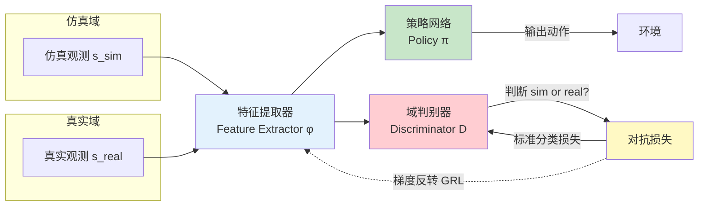

**关键: 梯度反转层 (Gradient Reversal Layer, GRL)**

```
前向传播: GRL 是恒等映射（z_out = z_in）
反向传播: GRL 将梯度取负（dL/dz_in = -λ · dL/dz_out）

效果:
- 判别器努力区分 sim/real → 梯度沿"更好区分"方向更新
- 特征提取器收到反转梯度 → 努力让特征"无法区分" → 域不变特征
```

**代码骨架**:

```python
import torch
import torch.nn as nn

class GradientReversalFunction(torch.autograd.Function):
    @staticmethod
    def forward(ctx, x, lambda_):
        ctx.lambda_ = lambda_
        return x.clone()

    @staticmethod
    def backward(ctx, grads):
        return -ctx.lambda_ * grads, None

class DomainAdversarialPolicy(nn.Module):
    def __init__(self, obs_dim, act_dim, hidden=256):
        super().__init__()
        # 共享特征提取器
        self.feature = nn.Sequential(
            nn.Linear(obs_dim, hidden), nn.ReLU(),
            nn.Linear(hidden, hidden), nn.ReLU(),
        )
        # 策略头
        self.policy_head = nn.Linear(hidden, act_dim)
        # 域判别器头
        self.discriminator = nn.Sequential(
            nn.Linear(hidden, 64), nn.ReLU(),
            nn.Linear(64, 2),  # 0=sim, 1=real
        )

    def forward(self, obs, lambda_grl=1.0):
        feat = self.feature(obs)
        feat = GradientReversalFunction.apply(feat, lambda_grl)
        action = self.policy_head(feat)
        domain_logits = self.discriminator(feat)
        return action, domain_logits
```

### 3.3 渐进式适应 (Progressive Adaptation)

不像域对抗那样"一次性对齐"，而是逐步从仿真过渡到真实：

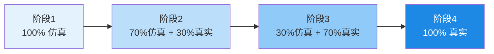

**Curriculum 采样比例控制**:

```python
class ProgressiveSampler:
    def __init__(self, sim_env, real_env):
        self.sim_env = sim_env
        self.real_env = real_env
        self.epoch = 0

    def sample(self):
        # 真实数据比例随训练线性增长
        real_ratio = min(self.epoch / 10000, 0.8)
        if np.random.random() < real_ratio:
            return self.real_env.step()
        else:
            return self.sim_env.step()
```

### 3.4 Sim2Real 对比一览

| 方法 | 需要真实数据 | 对抗训练 | 计算开销 | 典型场景 |
|------|------------|---------|---------|---------|
| Domain Randomization | ❌ | ❌ | 低 | 参数未知、范围大 |
| Domain Adversarial (DANN) | ✅ 少量 | ✅ | 中 | 视觉差异大 |
| Progressive Adaptation | ✅ 渐增 | ❌ | 中 | 安全部署 |
| RL with Real Data (Fine-tune) | ✅ 较多 | ❌ | 高 | 最后冲刺 |

---

## 4. 系统辨识 (System Identification)

### 4.1 核心思想

> **系统辨识的直觉**: 与其"随机化所有参数"（域随机化），不如"精确猜出真实世界的参数到底是什么"，然后把仿真器调成和真实一样。

**流程**:

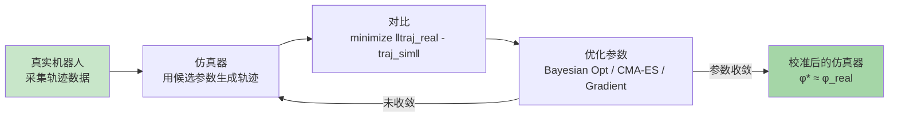

### 4.2 系统辨识的参数类型

| 参数类型 | 示例 | 辨识难度 | 方法 |
|---------|------|---------|------|
| **质量/惯性** | 连杆质量、转动惯量 | 中 | CAD 模型 + 标定 |
| **摩擦** | 关节摩擦、地面摩擦 | 高 | 激励轨迹 + 最小二乘 |
| **柔性** | 连杆柔性、皮带弹性 | 很高 | 模态分析 |
| **延迟** | 通信延迟、电机响应 | 低 | 阶跃响应测量 |
| **传感器参数** | 噪声方差、偏置 | 低 | 静态采集统计 |

### 4.3 Bayesian 系统辨识

用贝叶斯优化高效搜索高维参数空间：

```python
from skopt import gp_minimize

def system_identification(real_trajectories, simulator, param_bounds):
    """
    real_trajectories: 真实机器人采集的轨迹列表
    simulator: 仿真器接口
    param_bounds: [(low, high) for each param]
    """
    def objective(params):
        # 用候选参数运行仿真
        sim_trajectories = simulator.rollout(params)
        # 计算与真实轨迹的差异
        loss = trajectory_distance(real_trajectories, sim_trajectories)
        return loss

    # 贝叶斯优化（适合昂贵评估）
    result = gp_minimize(
        objective,
        dimensions=param_bounds,
        n_calls=50,           # 50 次仿真评估
        n_random_starts=10,
        acq_func='EI',        # Expected Improvement
    )
    return result.x  # 最优参数 φ*

# 辨识后：用 φ* 更新仿真器，再训练策略
sim.set_params(identified_params)
policy = train_rl(sim)  # 在"校准后的"仿真器中训练
```

### 4.4 系统辨识 vs 域随机化

| 维度 | 系统辨识 | 域随机化 |
|------|---------|---------|
| **哲学** | 找到真实参数 | 不在乎具体参数 |
| **真实数据** | 需要 | 不需要 |
| **策略鲁棒性** | 较低（窄分布） | 高（宽分布） |
| **策略性能上限** | 高（精确环境） | 中（需兼容多种情况） |
| **最佳实践** | **两者结合**: 先辨识缩小范围，再在范围内随机化 | 纯随机化 |

---

## 5. 数字孪生 (Digital Twin)

### 5.1 什么是数字孪生？

> **数字孪生 = 实时同步的虚拟副本**。它不只是一个静态的仿真模型，而是一个持续接收真实世界数据、实时更新的"活的"仿真。

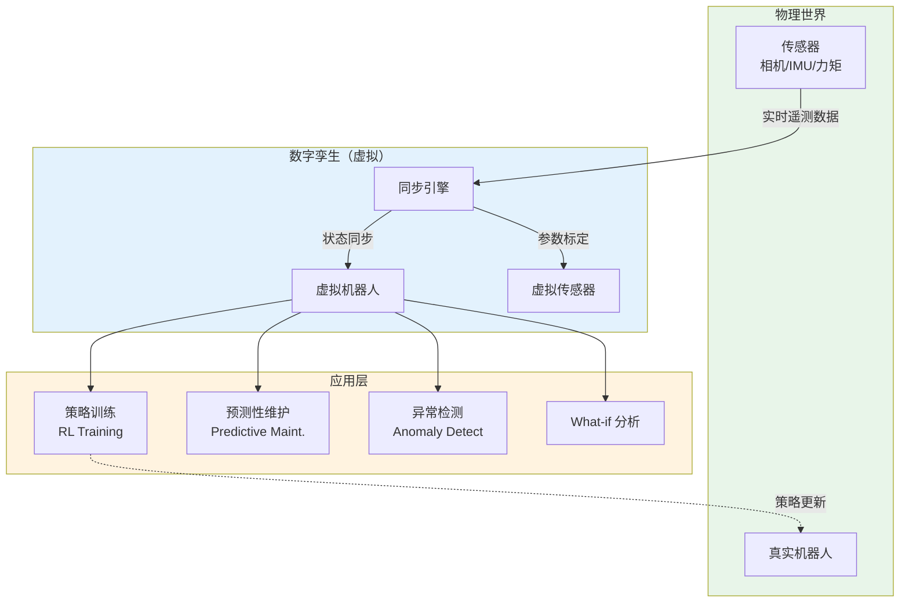

### 5.2 数字孪生 vs 传统仿真

| 维度 | 传统仿真 | 数字孪生 |
|------|---------|---------|
| **数据流向** | 离线建模 → 训练 | 在线同步 → 持续校准 |
| **更新频率** | 手动/批次 | 实时（10～1000 Hz） |
| **参数来源** | 静态标定 | 实时系统辨识 |
| **应用** | 离线训练 | 在线训练 + 预测 + 监控 |
| **成本** | 中等 | 高（需要持续计算+通信） |

### 5.3 数字孪生在 Sim2Real 中的角色

数字孪生充当 Sim2Real 的**桥梁**:

1. **训练前**: 用数字孪生（已用真实数据校准）替代"原始仿真器"，缩小 Reality Gap
2. **训练中**: 策略可以在数字孪生中验证，数字孪生提供"接近真实"的反馈
3. **部署后**: 持续对比真实机器人和数字孪生的行为，检测"分布偏移"——如果真实行为偏离孪生预测，说明环境变了，需要重新训练

```python
# 数字孪生持续校准循环（概念代码）
class DigitalTwin:
    def __init__(self, sim, real_robot):
        self.sim = sim
        self.real = real_robot
        self.param_estimator = OnlineSystemID()

    def sync_loop(self):
        while True:
            # 1. 采集真实数据
            real_state, real_action, real_next = self.real.observe()

            # 2. 仿真预测
            sim_next = self.sim.predict(real_state, real_action)

            # 3. 计算偏差
            delta = self.distance(real_next, sim_next)

            # 4. 在线更新仿真参数
            if delta > threshold:
                new_params = self.param_estimator.update(
                    real_state, real_action, real_next
                )
                self.sim.set_params(new_params)

            # 5. 异常检测
            if delta > critical_threshold:
                alert("Real-Twin divergence! Possible anomaly.")
```

### 5.4 2026 数字孪生平台

| 平台 | 公司 | 特点 |
|------|------|------|
| **NVIDIA Omniverse / Isaac Sim** | NVIDIA | RTX 光线追踪、USD 格式、GPU 加速、工业级 |
| **Siemens Xcelerator** | Siemens | 工业制造孪生，与 PLM 集成 |
| **Azure Digital Twins** | Microsoft | 云原生，IoT 集成 |
| **Unity Industrial** | Unity | 游戏引擎级渲染，易于可视化 |

---

## 6. 仿真平台对比

### 6.1 主流仿真器全面对比

| 平台 | 物理引擎 | GPU 加速 | 渲染质量 | 生态 | 开源 | 最佳场景 |
|------|---------|---------|---------|------|------|---------|
| **NVIDIA Isaac Sim** | PhysX 5 | ✅ 原生 | ⭐⭐⭐⭐⭐ (RTX) | NVIDIA 生态强 | ✅ | 大规模并行 RL、高保真视觉 |
| **MuJoCo** | MuJoCo (自研) | 部分 (MJX) | ⭐⭐⭐ (基础) | 学术标准 | ✅ (2021 开源) | 精确动力学研究、连续控制 |
| **PyBullet** | Bullet | ❌ CPU | ⭐⭐ (基础 OpenGL) | 简单易用 | ✅ | 教学、原型、轻量实验 |
| **Gazebo (Ignition)** | ODE / Bullet / DART | ❌ | ⭐⭐⭐ | **ROS 原生** | ✅ | ROS 机器人集成、SLAM |
| **Webots** | ODE | ❌ | ⭐⭐⭐ | 教育友好 | ✅ | 教学、快速原型 |
| **Habitat (Meta)** | Bullet | ✅ | ⭐⭐⭐⭐ | AI 导航 | ✅ | 室内导航、具身 AI |
| **Brax (Google)** | JAX | ✅ (TPU/GPU) | ❌ (无渲染) | JAX 生态 | ✅ | 超大规模并行 RL |
| **Genesis** | 多引擎统一 | ✅ | ⭐⭐⭐⭐ | 新兴（2024） | ✅ | 统一接口、生成式 |

### 6.2 选型决策树

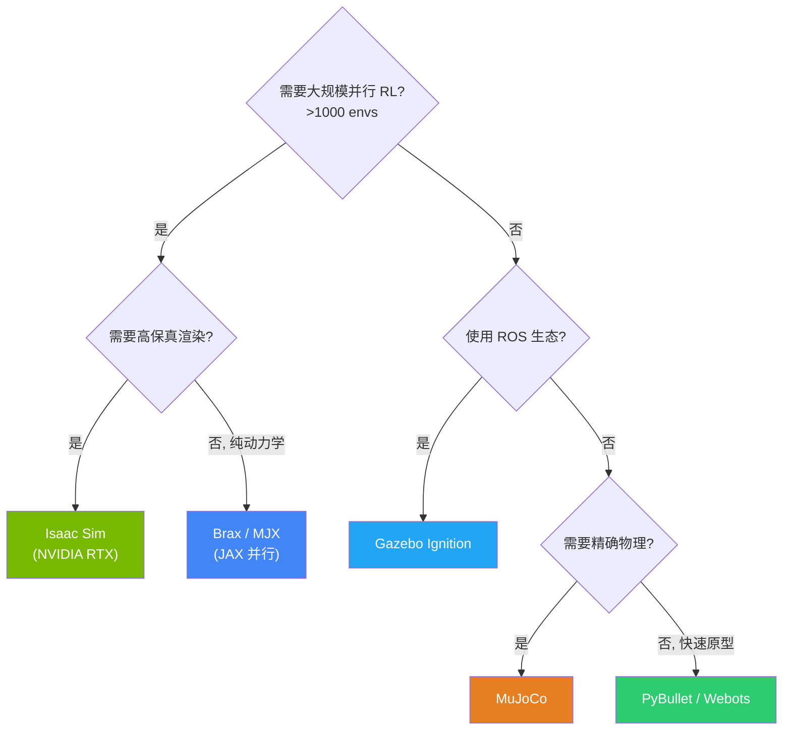

### 6.3 Isaac Sim 代码示例（域随机化训练）

```python
# Isaac Sim + Omniverse Isaac Gym 风格
from omni.isaac.gym.vec_env import VecEnvBase
import numpy as np

class RandomizedFetchEnv(VecEnvBase):
    def __init__(self, num_envs=4096):
        super().__init__()
        self.num_envs = num_envs

    def reset_environments(self, env_ids):
        # --- 视觉随机化 ---
        for env_id in env_ids:
            # 物体颜色随机
            self.objects[env_id].set_color(
                color=np.random.uniform(0, 1, size=(3,))
            )
            # 光照随机
            self.lights[env_id].set_intensity(
                np.random.uniform(300, 2000)
            )

        # --- 动力学随机化（批量） ---
        # 摩擦系数 (num_envs, 3) = [slide, spin, roll]
        self.frictions[env_ids] = torch.rand(
            len(env_ids), 3, device=self.device
        ) * 1.2 + 0.3  # [0.3, 1.5]

        # 物体质量
        self.masses[env_ids] = torch.rand(
            len(env_ids), device=self.device
        ) * 4.0 + 0.5  # [0.5, 4.5] kg

        # 关节阻尼
        self.dampings[env_ids] = torch.rand(
            len(env_ids), self.num_joints, device=self.device
        ) * 0.5 + 0.01

    def step(self, actions):
        # 动作延迟随机化
        delayed_actions = self.apply_action_delay(actions)
        # 观测噪声
        obs = self.get_obs() + torch.randn_like(self.get_obs()) * 0.02
        return obs, rewards, dones, infos
```

---

## 7. 经典成功案例深度解析

### 7.1 OpenAI 魔方手 (2019) —— Domain Randomization 的胜利

**任务**: 用 Shadow Dexterous Hand（24 自由度机械手）单手解魔方。

**为什么是里程碑**:
- 之前 Sim2Real 只能做简单抓取，解魔方需要**精确的指尖控制**
- Reality Gap 极大：手指摩擦、魔方重量、关节间隙都难以精确建模
- OpenAI 证明了：**极致的域随机化可以弥合巨大的 Reality Gap**

**核心技术 —— Automatic Domain Randomization (ADR)**:

| 随机化维度 | 范围 |
|-----------|------|
| 魔方大小 | ±20% |
| 魔方质量 | ±45% |
| 手指摩擦 | 0.1～2.0 |
| 关节阻尼 | ±50% |
| 电机力矩增益 | ±30% |
| 光照 | 全范围 |
| 相机位姿 | ±大量 |

**结果**:
- 训练了约 10,000 年等价的仿真交互
- 真实世界零样本迁移成功
- 能应对"从未见过的干扰"（给手上戴手套、绑绳子、用布盖住）

> **教训**: ADR 的成功说明——当你的仿真器"物理结构大致正确"但"参数不准确"时，极端的域随机化是有效的。

### 7.2 Boston Dynamics —— System Identification 的大师

Boston Dynamics（Atlas、Spot）走了一条**与 OpenAI 完全不同**的路线：

| 维度 | OpenAI 路线 | Boston Dynamics 路线 |
|------|-----------|---------------------|
| 核心方法 | Domain Randomization | System Identification + 经典控制 |
| 仿真依赖 | 极重（10,000 年训练） | 中等（用于原型验证） |
| 真实数据 | 少（验证用） | 大量（持续标定） |
| 控制策略 | 端到端神经网络 | 模型预测控制 (MPC) + RL 混合 |
| 可解释性 | 低 | 高 |

**Atlas 的 Sim2Real 流程**:
1. **精确建模**: 对每个关节做精密的动力学标定（摩擦、柔性、间隙）
2. **仿真验证**: 在高保真仿真器中设计控制律
3. **渐进部署**: 先在安全绳上测试，逐步去除保护
4. **在线适应**: 实时估计状态偏差，动态调整控制参数

### 7.3 Tesla Autopilot —— 数据驱动的 Sim2Real

Tesla 的自动驾驶代表了 Sim2Real 的"数据驱动"极端：

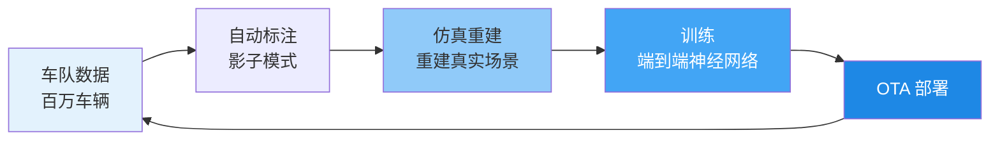

**Tesla 的仿真特点**:
- 不追求"从零仿真"，而是**从真实数据重建**场景
- 自动从车队视频中提取"边缘案例"（corner cases）
- 大量"剪辑"真实场景来生成变体（加雨、加雾、改变光照）

### 7.4 三种路线对比

| 路线 | 代表 | 仿真用量 | 真实数据用量 | 最佳场景 |
|------|------|---------|------------|---------|
| **域随机化** | OpenAI | ⭐⭐⭐⭐⭐ | ⭐ | 参数未知、高风险 |
| **系统辨识** | Boston Dynamics | ⭐⭐⭐ | ⭐⭐⭐⭐ | 精确控制、安全关键 |
| **数据驱动** | Tesla | ⭐⭐⭐ | ⭐⭐⭐⭐⭐ | 大规模部署、有车队 |

---

## 8. 渐进式迁移与 Curriculum

### 8.1 Curriculum Learning 在 Sim2Real 中的应用

不仅随机化参数，还按**难度递增**的方式组织训练：

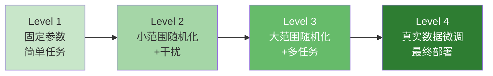

### 8.2 Teacher-Student 蒸馏

**思想**: 训练一个"特权教师"（在仿真中有完整信息），然后蒸馏给"学生"（只能看到部分观测，模拟真实传感器局限）。

```python
# Teacher-Student Sim2Real
# Teacher: 在仿真中看到"特权信息"（真实摩擦、物体质量等）
# Student: 只能看到传感器能提供的（视觉、力矩、关节角度）

class TeacherPolicy(nn.Module):
    """特权策略 - 在仿真中训练"""
    def forward(self, obs):
        # obs 包含: 视觉 + 本体感觉 + 特权信息(摩擦/质量/延迟)
        privileged_info = obs[..., -8:]  # 最后一维是特权参数
        return self.net(obs)  # 可以"作弊"

class StudentPolicy(nn.Module):
    """部署策略 - 蒸馏自 Teacher"""
    def forward(self, obs):
        # obs 只包含: 视觉 + 本体感觉（没有特权信息）
        return self.net(obs)  # 必须从有限信息推断

# 蒸馏过程
for batch in dataloader:
    teacher_action = teacher(batch.full_obs)      # 教师看到一切
    student_action = student(batch.partial_obs)   # 学生只看部分
    loss = F.mse_loss(student_action, teacher_action.detach())
    loss.backward()
```

**为什么有效**: Teacher 学会了"给定真实参数怎么做最好"，Student 学会了"从观测推断参数并模仿 Teacher"——相当于 Student 内化了 System Identification 的能力。

### 8.3 双重仿真 (Dual Simulation)

在"高保真"和"快速"仿真器之间交替：

| 仿真器 | 用途 | 速度 |
|--------|------|------|
| 快速仿真（如 Brax） | 大规模 RL 训练 | 100,000× 实时 |
| 高保真仿真（如 Isaac Sim RTX） | 视觉验证、域随机化 | 100× 实时 |

---

## 9. 代码实战：Sim2Real 训练流水线

### 9.1 完整流水线（Gymnasium + Stable Baselines3 + 域随机化）

```python
"""
Sim2Real 训练流水线示例
环境: 机械臂抓取任务
方法: Domain Randomization + PPO + Teacher-Student
"""
import gymnasium as gym
import numpy as np
from stable_baselines3 import PPO
from stable_baselines3.common.vec_env import SubprocVecEnv, VecMonitor

class Sim2RealFetchEnv(gym.Env):
    """带域随机化的抓取环境"""

    def __init__(self, difficulty=0):
        super().__init__()
        self.difficulty = difficulty  # 0~5, 越高随机化越大
        self.observation_space = gym.spaces.Box(-np.inf, np.inf, (50,))
        self.action_space = gym.spaces.Box(-1, 1, (7,))

        # 仿真器内部状态
        self.sim = self._init_sim()
        self.timestep = 0

    def _randomize(self):
        """根据 difficulty 随机化参数"""
        d = self.difficulty / 5.0  # 归一化到 [0,1]

        # 随机化范围随 difficulty 扩大
        friction_range = 0.5 + d * 1.0  # [0.5, 1.5] at d=1
        mass_range = 0.3 + d * 0.7

        self.friction = np.random.uniform(
            1.0 - friction_range/2, 1.0 + friction_range/2
        )
        self.mass = np.random.uniform(
            1.0 - mass_range/2, 1.0 + mass_range/2
        )
        self.action_delay = np.random.randint(0, int(d * 5) + 1)
        self.obs_noise = d * 0.05

    def reset(self, seed=None, options=None):
        super().reset(seed=seed)
        self._randomize()  # 每个 episode 随机化
        self._action_buffer = []
        obs = self._get_obs()
        return obs, {}

    def step(self, action):
        # 模拟动作延迟
        self._action_buffer.append(action)
        if len(self._action_buffer) > self.action_delay:
            exec_action = self._action_buffer.pop(0)
        else:
            exec_action = np.zeros_like(action)

        # 仿真步进（使用随机化后的参数）
        self.sim.set_params(friction=self.friction, mass=self.mass)
        obs = self._get_obs()
        obs = obs + np.random.randn(*obs.shape) * self.obs_noise

        reward = self._compute_reward(obs, exec_action)
        done = self.timestep > 200
        self.timestep += 1
        return obs, reward, done, False, {}

    def _get_obs(self):
        return np.random.randn(50)  # 简化

    def _compute_reward(self, obs, action):
        return float(np.random.rand())  # 简化


# --- Curriculum 训练循环 ---
def train_with_curriculum(total_steps=2_000_000):
    for level in range(6):  # 6 个难度等级
        print(f"\n=== Training at Difficulty Level {level} ===")

        def make_env():
            return Sim2RealFetchEnv(difficulty=level)

        env = SubprocVecEnv([make_env for _ in range(16)])
        env = VecMonitor(env)

        model = PPO(
            "MlpPolicy", env,
            learning_rate=3e-4,
            n_steps=4096,
            batch_size=256,
            n_epochs=10,
            gamma=0.99,
            ent_coef=0.01,
            verbose=1,
            tensorboard_log="./sim2real_logs/",
        )

        steps_per_level = total_steps // 6
        model.learn(total_timesteps=steps_per_level,
                    reset_num_timesteps=(level == 0))
        model.save(f"ppo_difficulty_{level}.zip")
        env.close()

    return model

# 运行
model = train_with_curriculum()
model.save("sim2real_final.zip")
```

### 9.2 真机微调代码骨架

```python
"""
真机 Fine-tuning: 用少量真实数据微调仿真训练的策略
方法: Offline RL (CQL) 或 Imitation Learning
"""
import torch
from torch.utils.data import DataLoader

class RealRobotDataset(torch.utils.data.Dataset):
    """从真实机器人采集的少量演示数据"""
    def __init__(self, real_trajectories_path):
        self.data = load_trajectories(real_trajectories_path)

    def __len__(self):
        return len(self.data)

    def __getitem__(self, idx):
        return self.data[idx]

def real_world_finetune(sim_policy, real_data_path, epochs=50):
    """
    sim_policy: 仿真训练好的策略
    real_data_path: 真实数据路径
    """
    dataset = RealRobotDataset(real_data_path)
    dataloader = DataLoader(dataset, batch_size=64, shuffle=True)

    optimizer = torch.optim.Adam(sim_policy.parameters(), lr=1e-5)

    for epoch in range(epochs):
        for batch in dataloader:
            obs, expert_actions = batch['obs'], batch['actions']

            # Behavioral Cloning loss（模仿学习微调）
            pred_actions = sim_policy(obs)
            loss = torch.nn.functional.mse_loss(pred_actions, expert_actions)

            # KL 正则化: 防止偏离仿真策略太远
            with torch.no_grad():
                sim_actions = sim_policy_old(obs)  # 冻结的旧策略
            kl_loss = compute_kl(pred_actions, sim_actions)

            total_loss = loss + 0.1 * kl_loss
            total_loss.backward()
            optimizer.step()
            optimizer.zero_grad()

    return sim_policy
```

---

## 10. 2026 前沿：生成式仿真与 NeRF 环境

### 10.1 生成式仿真 (Generative Simulation)

**趋势**: 不再手工建模场景，而是用生成式 AI（扩散模型、3D 生成）**自动生成无限多样的训练场景**。

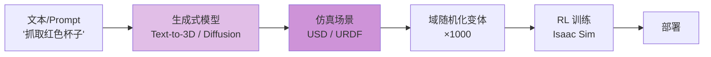

**代表工作**:
- **Genesis (2024-2025)**: 统一多物理引擎 + 生成式场景创建
- **NVIDIA Isaac GR00T**: 从语言指令生成机器人任务场景
- **ViperGPT / VoxPoser**: LLM 驱动的仿真场景生成

### 10.2 NeRF / 3D Gaussian Splatting 训练环境

**核心思想**: 用真实场景的 NeRF（神经辐射场）或 3DGS（3D 高斯泼溅）重建作为**高保真渲染环境**，替代传统渲染器。

| 维度 | 传统渲染 | NeRF/3DGS 环境 |
|------|---------|---------------|
| **视觉真实度** | 需要大量手工资产 | 从照片自动重建 |
| **物理交互** | 完整物理引擎 | 需要额外处理（碰撞近似） |
| **新视角** | 取决于资产质量 | 连续新视角合成 |
| **域差异** | 渲染"太干净" | 接近真实照片 |
| **2026 状态** | 成熟 | **快速成熟中** |

**Pipeline**:

```python
# 概念代码：用 3DGS 构建训练环境
class GaussianSplattingEnv(gym.Env):
    """用 3D 高斯泼溅重建作为渲染环境的 RL 环境"""
    def __init__(self, splat_model_path, physics_engine):
        # 加载重建的场景（从真实照片生成）
        self.scene = load_3dgs(splat_model_path)
        # 物理引擎单独运行（NeRF 只做渲染）
        self.physics = physics_engine  # MuJoCo / PhysX

    def render(self, camera_pose):
        # 从任意视角渲染——视觉上接近真实
        return self.scene.render(camera_pose)

    def step(self, action):
        # 物理在传统引擎中计算
        self.physics.step(action)
        # 渲染用 3DGS（视觉保真）
        obs = self.render(self.get_camera_pose())
        return obs, reward, done, {}
```

### 10.3 世界模型 (World Models) 替代仿真器

**前沿趋势**: 用**学习到的世界模型**（如 DreamerV3、Genie）替代手工物理引擎：

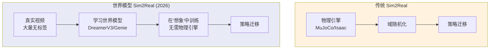

**优势**:
- 世界模型从**真实视频**学习，天然接近真实
- 不需要手工物理建模
- 可以"想象"训练数据中未见过的变体

**挑战**:
- 长时间预测会"漂移"（累积误差）
- 物理约束可能被违反（穿模）
- 需要大量真实视频数据

### 10.4 2026 Sim2Real 技术成熟度

| 技术 | 成熟度 | 典型应用 |
|------|--------|---------|
| Domain Randomization | ⭐⭐⭐⭐⭐ 成熟 | 所有 Sim2Real 项目的基础 |
| System Identification | ⭐⭐⭐⭐ 成熟 | 工业机器人 |
| Digital Twin | ⭐⭐⭐⭐ 产业化 | 工厂、自动驾驶 |
| Teacher-Student 蒸馏 | ⭐⭐⭐⭐ 实用化 | Legged Robot（ANYmal） |
| 生成式仿真 | ⭐⭐⭐ 发展中 | 研究前沿 |
| NeRF/3DGS 环境 | ⭐⭐ 早期 | 实验室 |
| 世界模型替代仿真 | ⭐⭐ 早期 | 研究 |

---

## 11. Sim2Real Checklist

### 11.1 部署前 Checklist

```
✅ 仿真器选择
  □ 物理引擎是否匹配任务精度需求？
  □ 渲染质量是否足够（视觉任务）？
  □ 是否支持 GPU 并行加速？

✅ 域随机化配置
  □ 摩擦系数范围覆盖真实值？
  □ 质量范围覆盖真实值？
  □ 动作延迟已建模？
  □ 观测噪声已添加？
  □ 视觉随机化（光照/颜色/背景）？
  □ 随机化范围未过度？

✅ 系统辨识
  □ 用真实数据校准了关键参数？
  □ 仿真轨迹与真实轨迹误差 < 阈值？

✅ 策略验证
  □ 在域随机化范围内成功率 > 90%？
  □ 在极端参数下不崩溃？
  □ Teacher-Student 蒸馏完成？
  □ 在高保真仿真中通过？

✅ 安全部署
  □ 力矩限制已设置？
  □ 紧急停止 (E-Stop) 可用？
  □ 安全区（笼子/绳索）准备？
  □ 渐进部署计划（先简单后复杂）？

✅ 持续监控
  □ 数字孪生同步已启用？
  □ 分布偏移检测告警？
  □ 数据回传管道正常？
```

### 11.2 常见失败模式与对策

| 失败模式 | 症状 | 对策 |
|---------|------|------|
| **策略在真机不动作** | 输出恒定值 | 域随机化过强→缩小范围 |
| **策略在真机剧烈抖动** | 高频震荡 | 加动作滤波；检查延迟建模 |
| **偶尔成功偶尔失败** | 方差大 | 增加 Curriculum 阶段 |
| **真机比仿真差很多** | 系统性差异 | 做 System Identification |
| **成功后突然失败** | 环境变化 | 启用数字孪生在线适应 |
| **安全事件** | 碰撞/超力 | 加约束层（Safe RL） |

---

## 12. 延伸阅读 (Related)

### 12.1 本知识库交叉引用

- [[06_强化学习/01_RL_Foundations/RL_Foundations|强化学习基础]] — MDP/Bellman 方程，Sim2Real 的数学基础
- [[06_强化学习/02_Deep_RL/Deep_RL|深度强化学习]] — PPO/SAC 等算法，Sim2Real 的主力训练算法
- [[06_强化学习/02_Deep_RL/PPO_Deep_Dive|PPO 深度解读]] — 域随机化训练最常用的策略梯度算法
- [[06_强化学习/05_Robotics_Embodied_AI/Embodied_AI_2026|具身智能 2026]] — Sim2Real 的主要应用场景
- [[06_强化学习/05_Robotics_Embodied_AI/VLA_Embodied_AI_2026|VLA 具身智能]] — VLA 模型的 Sim-to-Real 流程
- [[06_强化学习/05_Robotics_Embodied_AI/Robot_VLA_Training_Pipeline_2026|VLA 训练流水线]] — 完整的机器人训练包括 Sim2Real
- [[06_强化学习/01_RL_Foundations/RL-in-nutshell|强化学习速览]] — RL 全栈知识图谱

### 12.2 关键论文

| 论文 | 核心贡献 |
|------|---------|
| Tobin et al. (2017) "Domain Randomization..." | 域随机化开山之作 |
| OpenAI (2019) "Solving Rubik's Cube with Robot Hand" | ADR 极致域随机化 |
| Peng et al. (2018) "Sim-to-Real Transfer..." | Teacher-Student 蒸馏 |
| Andrychowicz et al. (2020) "Learning Dexterous In-Hand Manipulation" | 大规模 Sim2Real 工程 |
| Tan et al. (2018) "Sim-to-Real: Robot Assisted..." | System ID + RL |
| Muratore et al. (2022) "A Survey on Sim-to-Real Transfer" | 综述 |

### 12.3 工具与平台

| 工具 | 用途 | 链接说明 |
|------|------|---------|
| NVIDIA Isaac Sim | 工业级仿真平台 | GPU 加速、域随机化原生支持 |
| MuJoCo | 高保真物理引擎 | 学术标准，现已开源 |
| Genesis | 统一多引擎平台 | 2024-2025 新兴项目 |
| Omniverse Digital Twin | 数字孪生平台 | NVIDIA 工业孪生 |

---

*Last updated: 2026-07-11*
