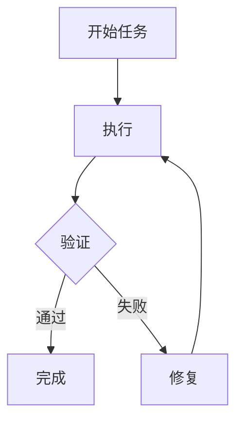

# Agent Skills 实战指南

> 🎯 **目标**：通过手把手教程和真实案例，从零创建、测试、优化和发布一个生产级 Agent Skill。

---

## 一、5 分钟 Quickstart

### 创建你的第一个 Skill

一个 Skill = 一个包含 `SKILL.md` 的文件夹。

```bash
# 创建目录
mkdir -p .agents/skills/roll-dice

# 编写 SKILL.md
cat > .agents/skills/roll-dice/SKILL.md << 'EOF'
---
name: roll-dice
description: Roll dice using a random number generator. Use when asked to roll a die (d6, d20, etc.), roll dice, or generate a random dice roll.
---

To roll a die, use the following command that generates a random number from 1
to the given number of sides:

```bash
echo $((RANDOM % <sides> + 1))
```

Replace `<sides>` with the number of sides on the die (e.g., 6 for a standard
die, 20 for a d20).
EOF
```

### 在 VS Code 中测试

1. 打开项目，打开 Copilot Chat
2. 选择 **Agent** 模式
3. 输入 `/skills` 确认 `roll-dice` 出现在列表中
4. 问：**"Roll a d20"**
5. Agent 应该激活 `roll-dice` Skill 并运行命令

### 背后发生了什么

```
会话启动
    │
    ▼
Tier 1: Agent 扫描 .agents/skills/
    → 发现 roll-dice 的 name + description
    │
    ▼
用户: "Roll a d20"
    │
    ▼
Tier 2: Agent 匹配到 roll-dice skill
    → 加载完整 SKILL.md body
    │
    ▼
Tier 3: Agent 跟随指令
    → 运行: echo $((RANDOM % 20 + 1))
    → 返回: 14
```

---

## 二、实战案例：构建 CSV 分析 Skill

让我们构建一个真实的、有用的 Skill，走完整个创建流程。

### 步骤 1：创建基础结构

```bash
mkdir -p .agents/skills/csv-analyzer/{scripts,references,evals/files,assets}
```

### 步骤 2：编写 SKILL.md

```markdown
---
name: csv-analyzer
description: >
  Analyze CSV and tabular data files — compute summary statistics,
  add derived columns, generate charts, and clean messy data. Use this
  skill when the user has a CSV, TSV, or Excel file and wants to
  explore, transform, or visualize the data, even if they don't
  explicitly mention "CSV" or "analysis."
---

# CSV Data Analysis

## When to use this skill
When the user has a tabular data file (CSV, TSV, Excel) and wants to analyze,
transform, visualize, or clean it.

## Workflow

1. **Understand the data**: Read the file, show column names, types, and row count
2. **Clarify the task**: Confirm what analysis or transformation the user wants
3. **Execute**: Use pandas for data manipulation, matplotlib/plotly for charts
4. **Present results**: Show key findings as markdown tables or charts

## Tools
- Use pandas for data manipulation
- Use matplotlib for static charts
- Use plotly for interactive charts when available

## Gotchas
- Always check encoding — try utf-8 first, fall back to latin-1
- Large files (>100MB): use chunked reading or sampling
- Date columns: try `parse_dates` in `pd.read_csv()`
- Missing values: report count before dropping

## Output format
For summary statistics, use this format:

| Metric | Value |
|--------|-------|
| Total rows | X |
| Columns | X |
| Missing values | X% |

For charts, save to a file and provide the path.
```

### 步骤 3：添加辅助脚本

```python
# scripts/quick_summary.py
# /// script
# dependencies = [
#   "pandas",
# ]
# ///

import pandas as pd
import sys
import json

if len(sys.argv) < 2:
    print("Error: File path required.", file=sys.stderr)
    print("Usage: python scripts/quick_summary.py <file_path>", file=sys.stderr)
    sys.exit(1)

file_path = sys.argv[1]

try:
    encodings = ['utf-8', 'latin-1', 'cp1252']
    df = None
    for enc in encodings:
        try:
            df = pd.read_csv(file_path, encoding=enc, nrows=1000)
            break
        except UnicodeDecodeError:
            continue
    
    if df is None:
        print(json.dumps({"error": "Could not decode file with any encoding"}))
        sys.exit(1)

    summary = {
        "rows": len(df),
        "columns": list(df.columns),
        "dtypes": {col: str(dt) for col, dt in df.dtypes.items()},
        "missing_pct": {col: f"{pct:.1f}%" for col, pct in (df.isnull().mean() * 100).items()},
        "sample": df.head(3).to_dict(orient="records")
    }
    print(json.dumps(summary, indent=2, default=str))
except Exception as e:
    print(json.dumps({"error": str(e)}), file=sys.stderr)
    sys.exit(1)
```

### 步骤 4：创建测试数据

```csv
# evals/files/sales_2025.csv
month,revenue,expenses,region
January,45000,32000,North
February,52000,35000,South
March,48000,31000,East
April,61000,38000,West
May,55000,36000,North
June,67000,42000,South
July,72000,45000,East
August,69000,41000,West
September,58000,37000,North
October,63000,39000,South
November,71000,44000,East
December,85000,52000,West
```

### 步骤 5：设置评估

```json
// evals/evals.json
{
  "skill_name": "csv-analyzer",
  "evals": [
    {
      "id": 1,
      "prompt": "I have a CSV of monthly sales data in data/sales_2025.csv. Can you find the top 3 months by revenue and make a bar chart?",
      "expected_output": "A bar chart image showing the top 3 months by revenue, with labeled axes and values.",
      "files": ["evals/files/sales_2025.csv"],
      "assertions": [
        "The output includes a bar chart image file",
        "The chart shows exactly 3 months",
        "Both axes are labeled",
        "The chart title or caption mentions revenue"
      ]
    },
    {
      "id": 2,
      "prompt": "there's a csv in my downloads called customers.csv, some rows have missing emails — can you clean it up and tell me how many were missing?",
      "expected_output": "A cleaned CSV with missing emails handled, plus a count of how many were missing.",
      "files": ["evals/files/customers.csv"],
      "assertions": [
        "The output reports how many rows had missing emails",
        "The cleaned data no longer has missing email values",
        "The result is saved as a CSV file"
      ]
    }
  ]
}
```

---

## 三、Skill 类型谱系

Agent Skills 的复杂度可以从简单到复杂连续变化：

### 级别 1：纯文本指令（最简单）

```
my-skill/
└── SKILL.md    # 只包含 Markdown 指令
```

适用场景：编码风格指南、审查检查清单、简单工作流指导。

### 级别 2：指令 + 一次性命令

```
my-skill/
└── SKILL.md    # 指令中引用系统工具（uvx、npx 等）
```

适用场景：使用现有工具链执行特定任务。

### 级别 3：指令 + 捆绑脚本

```
my-skill/
├── SKILL.md
└── scripts/
    ├── analyze.py
    └── validate.sh
```

适用场景：需要自定义逻辑的复杂工作流。

### 级别 4：完整 Skill 包

```
my-skill/
├── SKILL.md
├── scripts/
│   ├── extract.py
│   └── validate.py
├── references/
│   ├── api-errors.md
│   └── schema.yaml
├── assets/
│   ├── template.html
│   └── config.json
└── evals/
    ├── evals.json
    └── files/
```

适用场景：生产级、可评估、可分发的完整 Skill。

---

## 四、从零到发布的完整工作流

### Phase 1: 提取（Extract）

```
真实任务 → 执行 → 收集成功步骤和纠正 → 提取为 SKILL.md
```

**实践建议**：
- 在 Agent 对话中完成一个真实任务
- 记录所有纠正和偏好
- 注意 Agent 犯错的模式

### Phase 2: 精炼（Refine）

```
SKILL.md 初稿 → 执行 → 阅读轨迹 → 修订 → 循环
```

**关注重点**：
- Agent 浪费时间在无用步骤上？ → 指令太模糊
- Agent 做了不该做的事？ → 添加明确的否定指令
- Agent 跳过了关键步骤？ → 添加检查清单

### Phase 3: 评估（Evaluate）

```
设计测试用例 → 运行 with/without 对比 → 评分 → 分析模式
```

**使用 `skill-creator` Skill 自动化**：
```bash
# Anthropic 提供的自动化工具
npx skills add https://github.com/anthropics/skills --skill skill-creator
```

### Phase 4: 优化（Optimize）

```
训练集/验证集分割 → 优化 description → 防止过拟合 → 选择最佳版本
```

### Phase 5: 发布（Publish）

```bash
# 1. 验证
skills-ref validate ./my-skill

# 2. 提交到 Git
git add .agents/skills/my-skill
git commit -m "Add my-skill agent skill"

# 3. 发布到 GitHub（公开分享）
# 或保留在私有仓库中（团队内部使用）
```

---

## 五、高级模式

### 5.1 多 Skill 协作


### 5.2 条件资源加载

```markdown
## 高级分析

对于需要统计建模的任务，加载：
- [统计方法参考](references/statistics.md)

对于需要地理可视化的任务，加载：
- [地图绘制指南](references/mapping.md)
```

### 5.3 Skill 模板

创建新 Skill 的 Skill：

```markdown
---
name: skill-template
description: Template for creating new agent skills.
---

# Create a New Skill

## Directory Structure
Create a directory with this structure:
...

## SKILL.md Template
...
```

### 5.4 验证循环模式



在 SKILL.md 中实现：

```markdown
## 工作流

1. 执行分析
2. 运行 `scripts/validate.py output/`
3. 如果失败：
   - 阅读错误消息
   - 修复问题
   - 从步骤 2 重新开始
4. 只有验证通过后才交付
```

---

## 六、常见陷阱与解决方案

| 陷阱 | 症状 | 解决方案 |
|------|------|---------|
| **Description 太宽泛** | Skill 在不相关任务时也被触发 | 添加明确的"不要用于"边界 |
| **Description 太窄** | Skill 在应该触发时不触发 | 包含更多关键词和场景描述 |
| **指令太长** | Agent 丢失重点，输出质量下降 | 保持 < 500 行，用 references/ 分流 |
| **缺少边缘情况** | 特定输入时 Agent 犯错 | 添加 Gotchas 章节 |
| **脚本交互式** | Agent 运行时挂起 | 所有输入通过 CLI 参数或环境变量 |
| **过度规定** | Agent 无法灵活适应变化 | 只在脆弱操作处精确指定 |
| **缺少示例** | Agent 理解偏了 | 添加具体的输入/输出示例 |

---

## 七、Skill 安装与管理

### 安装方式

```bash
# 方式 1：npx skills（推荐）
npx skills add https://github.com/anthropics/skills --skill frontend-design

# 方式 2：手动复制
git clone https://github.com/someone/their-skills
cp -r their-skills/skills/my-skill ~/.agents/skills/

# 方式 3：项目级安装
mkdir -p .agents/skills/
# 直接创建或复制 SKILL.md 到项目目录
```

### 多客户端共享

```
~/.agents/skills/          ← 用户级，所有兼容客户端可见
├── csv-analyzer/
├── pdf-processing/
└── frontend-design/

project/.agents/skills/    ← 项目级，覆盖用户级
├── custom-linter/
└── deploy-workflow/
```

**优先级**：项目级 > 用户级（同名时项目级覆盖）

---

## 🔗 相关主题

- [Agent Skills 深度解析](./Agent_Skills_Deep_Dive.md) — 完整规范和理论
- [AI Skills 速成](./Skills-in-nutshell.md) — 传统 Skill 编程实现
- [AI Agents](../../06_Reinforcement_Learning/AI_Agents/Agent-in-nutshell.md) — Agent 基础

> 📅 **最后更新**：2026-04-11 | **来源**：[agentskills.io](https://agentskills.io), [github.com/anthropics/skills](https://github.com/anthropics/skills)
