# Pruning 与知识蒸馏：LLM 压缩实战 (Pruning and Knowledge Distillation for LLMs)

> **一句话理解**: Pruning 是给模型"减肥"——把多余的脑细胞去掉；蒸馏是给模型"请家教"——让大模型教小模型做题。两者结合就能得到一个又小又聪明的模型。

---

## 目录

1. [Pruning 基础](#1-pruning-基础)
2. [Unstructured Pruning 非结构化剪枝](#2-unstructured-pruning-非结构化剪枝)
3. [Structured Pruning 结构化剪枝](#3-structured-pruning-结构化剪枝)
4. [Knowledge Distillation 基础](#4-knowledge-distillation-基础)
5. [LLM 蒸馏方法](#5-llm-蒸馏方法)
6. [蒸馏实践指南](#6-蒸馏实践指南)
7. [Pruning vs Distillation vs Quantization](#7-pruning-vs-distillation-vs-quantization)
8. [方法对比总表](#8-方法对比总表)
9. [实战代码与工具链](#9-实战代码与工具链)
10. [前沿挑战与未来方向](#10-前沿挑战与未来方向)
11. [交叉引用与延伸阅读](#11-交叉引用与延伸阅读)

---

## 1. Pruning 基础

### 1.1 为什么要剪枝

LLM 的核心矛盾是 **模型规模与部署成本**。研究表明，大型语言模型存在严重的参数冗余——多数模型在剪枝 20-30% 参数后，性能下降不到 1%：

```
LLM 参数冗余的现实
═══════════════════════════════════════════════════════════════════

Llama 3.1 405B:
  • 参数量: 4050 亿
  • FP16 显存: 810 GB（10+ 张 A100-80GB）
  • 推理延迟: 10-50 tokens/s（取决于部署方式）

研究发现:
  • 50% 以上的权重绝对值接近零
  • 部分 Attention Head 对输出几乎无贡献
  • FFN 层中大量神经元是冗余的

Lottery Ticket Hypothesis (彩票假说):
  ───────────────────────────────────────────────────────────
  "一个密集随机初始化的网络中，存在一个子网络（中奖彩票），
   当它被独立训练时，能在相同迭代次数内达到与原网络相当的
   测试精度。"  —— Jonathan Frankle & Michael Carbin, 2018

  核心启示: 训练后的大模型，真正"有用"的参数可能只占 10-30%。
  剪枝的目标就是找到这张"中奖彩票"。
```

### 1.2 Pruning 的分类体系

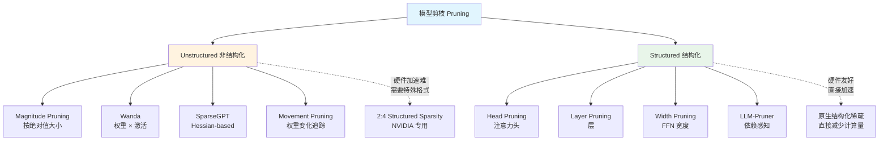

**非结构化剪枝** 移除单个权重（将权重设为 0），模型在逻辑上变小，但物理矩阵尺寸不变，需要特殊硬件支持才能加速。

**结构化剪枝** 移除整个结构单元（行、列、头、层），模型物理尺寸变小，在任何硬件上都能直接加速。

### 1.3 剪枝比例 vs 精度权衡

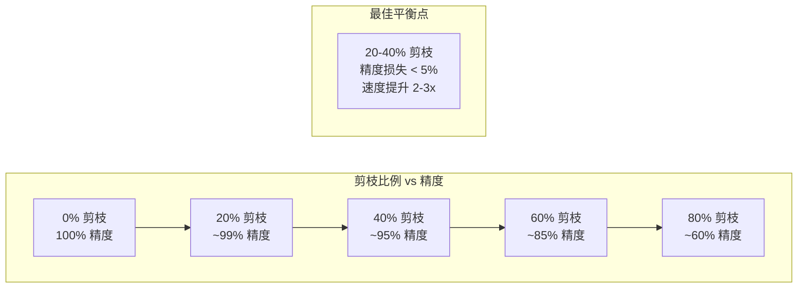

> **经验法则**: 对于 7B+ 参数的 LLM，20-30% 的非结构化剪枝通常几乎无损；超过 50% 需要配合蒸馏或微调来恢复精度。模型越大，冗余度越高，可剪枝比例也越大。

---

## 2. Unstructured Pruning 非结构化剪枝

### 2.1 Magnitude Pruning 幅度剪枝

**Magnitude Pruning** 是最直观的剪枝方法——"越小的权重越不重要"，直接按绝对值大小移除：

$$
\text{Score}(w_i) = |w_i|
$$

将所有权重按绝对值排序，移除最小的 $k\%$ 个权重：

```python
import torch
import torch.nn as nn

def magnitude_pruning(model: nn.Module, sparsity: float = 0.3):
    """
    对模型中所有 Linear 层执行 Magnitude Pruning。
    
    Args:
        model: PyTorch 模型
        sparsity: 剪枝比例（0-1），0.3 表示移除 30% 的权重
    
    Returns:
        mask_dict: 每层的剪枝掩码（可用于后续微调恢复）
    """
    mask_dict = {}
    
    for name, module in model.named_modules():
        if isinstance(module, nn.Linear):
            weight = module.weight.data
            
            # 计算阈值：将所有权重的绝对值排序，取第 k 百分位
            threshold = torch.quantile(
                weight.abs().flatten(), 
                sparsity
            )
            
            # 生成二值掩码：绝对值大于阈值的保留（1），否则剪掉（0）
            mask = (weight.abs() > threshold).float()
            
            # 应用掩码：被剪枝的权重变为 0
            module.weight.data *= mask
            mask_dict[name] = mask
    
    return mask_dict

# 使用示例
# model = AutoModelForCausalLM.from_pretrained("meta-llama/Llama-2-7b-hf")
# masks = magnitude_pruning(model, sparsity=0.3)
# print(f"剪枝 30% 权重后，模型中零权重占比: ~30%")
```

**优点**: 实现简单、计算快、不需要校准数据。

**局限**: 不考虑权重之间的协同关系——一个小权重可能在某些输入上起关键作用。

### 2.2 Wanda：权重 × 激活剪枝

**Wanda** (Pruning by Weights and Activations, Sun et al., 2023) 是当前 LLM 剪枝领域的标杆方法之一。核心思想是：**仅看权重大小不够，还要看该权重接收到的输入信号强度**。

$$
\text{Score}(W_{ij}) = |W_{ij}| \times \|X_j\|_2
$$

其中 $W_{ij}$ 是第 $j$ 列的权重，$X_j$ 是该列对应的输入激活。直觉是：即使一个权重较大，如果对应输入几乎为零（输入特征不活跃），这个权重也不重要。

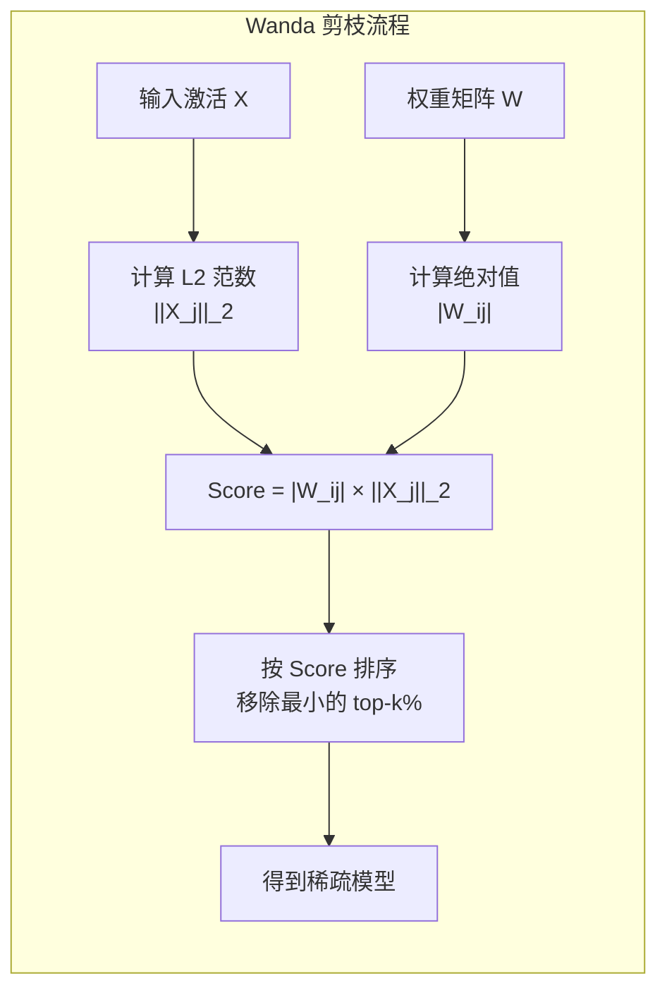

```python
@torch.no_grad()
def wanda_pruning(model, tokenizer, dataset, sparsity=0.5, device="cuda"):
    """Wanda (Sun et al., 2023): Score = |W_ij| × ||X_j||_2, one-shot, 无需微调。"""
    model.eval()
    activation_norms = {}
    
    def hook_fn(name):
        def hook(module, input, output):
            activation_norms[name] = torch.norm(input[0].float(), p=2, dim=(0, 1))
        return hook
    
    hooks = []
    for name, module in model.named_modules():
        if isinstance(module, nn.Linear) and "mlp" in name:
            hooks.append(module.register_forward_hook(hook_fn(name)))
    
    for sample in dataset:  # 128 条校准样本，一次前向传播
        inputs = tokenizer(sample, return_tensors="pt").to(device)
        model(**inputs)
    for h in hooks: h.remove()
    
    for name, module in model.named_modules():
        if name in activation_norms:
            W = module.weight.data.float()
            scores = W.abs() * activation_norms[name].unsqueeze(0)  # Wanda Score
            threshold = torch.kthvalue(scores.flatten(), int(scores.numel() * sparsity)).values
            module.weight.data *= (scores > threshold).float().half()
    return model
# 校准: 128 条 C4/RedPajama | 7B 模型约 5-10 分钟 (单 A100)
```

**Wanda 为什么有效**：

| 维度 | Magnitude Pruning | Wanda |
|------|-------------------|-------|
| **评估标准** | 仅看权重绝对值 | 权重 × 输入激活 |
| **校准数据** | 不需要 | 需要（128 条） |
| **精度损失 (50%)** | 高 | 低-中 |
| **计算开销** | 极低 | 低（一次前向传播） |
| **是否需要微调** | 否 | 否 |

### 2.3 SparseGPT：一次性 Hessian 剪枝

**SparseGPT** (Frantar & Alistarh, 2023) 是第一个能在单次前向传播中完成大规模非结构化剪枝的方法。它基于 **Optimal Brain Surgeon** 思想，利用 Hessian 矩阵的近似来估计移除每个权重后的误差影响。

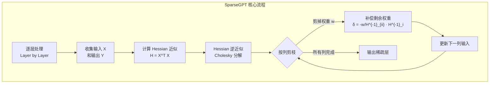

**SparseGPT 的数学核心**：

当移除权重 $w_q$ 时，为了最小化输出误差，需要补偿性地调整剩余权重：

$$
\delta_W = -\frac{w_q}{[\mathbf{H}^{-1}]_{qq}} \cdot [\mathbf{H}^{-1}]_{:, q}
$$

其中 $\mathbf{H} = \mathbf{X}^T \mathbf{X}$ 是 Hessian 矩阵的近似（Fisher 信息矩阵）。

```python
@torch.no_grad()
def sparsegpt_layer(layer: nn.Linear, sparsity: float):
    """SparseGPT one-shot pruning: Hessian-based error compensation per column."""
    W = layer.weight.data.clone().float()
    Hinv = compute_hessian_inverse(layer)  # H = X^T X, Cholesky 分解求逆
    
    for col in range(W.shape[1]):
        w = W[:, col]
        score = w.abs() / torch.sqrt(torch.diag(Hinv)[col] + 1e-8)
        prune_mask = score <= torch.kthvalue(score, int(len(w) * sparsity)).values
        
        # 补偿: 用 Hinv 信息调整剩余列，最小化输出误差
        err = w.clone(); err[~prune_mask] = 0
        W[:, col:] -= torch.ger(Hinv[col, col:] / Hinv[col, col], err)
        W[prune_mask, col] = 0
    
    layer.weight.data = W.half()
```

**SparseGPT 优势**: One-shot（无需迭代）、50-60% 稀疏度下精度可控、已在 OPT-175B/BLOOM-176B 上验证。

### 2.4 Movement Pruning 运动剪枝

**Movement Pruning** (Sanh et al., 2020) 的核心观察是：**在微调过程中，权重的变化方向比绝对值更能反映其重要性**。

$$
\text{Score}(w_i) = -w_i^{(T)} \cdot (w_i^{(T)} - w_i^{(0)})
$$

即微调结束时权重 $w_i^{(T)}$ 与微调过程中权重变化量 $(w_i^{(T)} - w_i^{(0)})$ 的负点积。直觉：如果一个权重在微调时朝远离零的方向移动（变大），说明它很重要；如果朝零的方向移动（变小），说明它在"自我淘汰"。

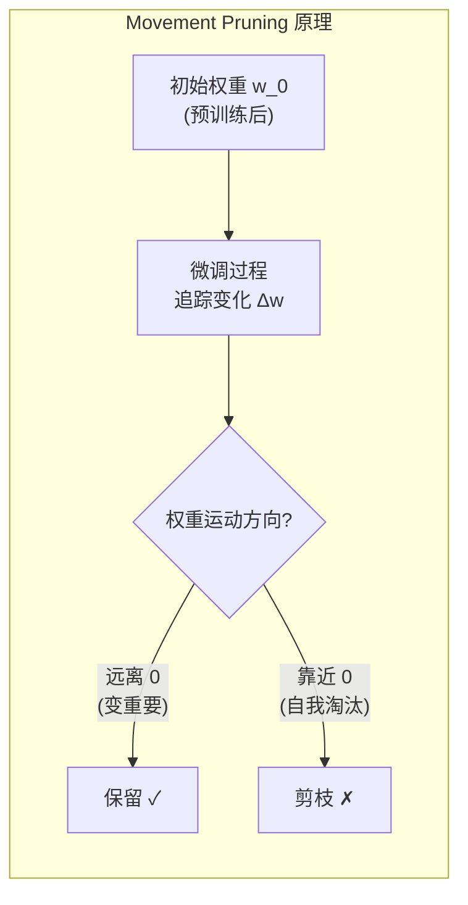

```python
class MovementPruningTracker:
    """追踪微调中权重运动方向，结束后按 Movement Score 剪枝。"""
    
    def __init__(self, model):
        self.initial_weights = {
            n: p.data.clone() for n, p in model.named_parameters()
            if 'weight' in name and p.requires_grad
        }
    
    def prune(self, model, sparsity=0.3):
        for name, param in model.named_parameters():
            if name in self.initial_weights:
                delta_w = param.data - self.initial_weights[name]
                score = -param.data * delta_w  # 远离零 → 高分
                threshold = torch.quantile(score.flatten(), sparsity)
                param.data *= (score > threshold).float()
```

**适用**: 需要微调的下游任务。**局限**: 依赖完整微调过程，不适合 one-shot。

### 2.5 2:4 Structured Sparsity（NVIDIA GPU 专用）

**NVIDIA 的 2:4 Structured Sparsity** 是一种介于非结构化和结构化之间的稀疏模式——在每 4 个连续权重中，恰好有 2 个为零。这种模式被 Ampere 及后续架构的 GPU 原生支持，可获得硬件级加速。

```
2:4 Sparsity 模式（每 4 个连续元素中有 2 个零）
═══════════════════════════════════════════════════════════════════

合法模式示例:
  [1, 0, 1, 0]  ✓    [0, 1, 0, 1]  ✓    [1, 1, 0, 0]  ✓
  [0, 0, 1, 1]  ✓    [1, 0, 0, 1]  ✓    [0, 1, 1, 0]  ✓

非法模式示例:
  [1, 1, 1, 0]  ✗ (只有 1 个零)
  [0, 0, 0, 1]  ✗ (3 个零，不是 2:4)

硬件实现:
  ┌────────────────────────────────────────────┐
  │  NVIDIA Ampere Tensor Core                 │
  │                                            │
  │  Dense:   [a, b, c, d] × W  → 4 MACs     │
  │  2:4:     [a, 0, c, 0] × W  → 2 MACs     │
  │                                            │
  │  加速比: 2x (理论值)                       │
  │  实际加速: 1.5-2x (取决于内存带宽)         │
  └────────────────────────────────────────────┘
```

```python
def enforce_2_4_sparsity(weight: torch.Tensor) -> torch.Tensor:
    """每 4 个连续元素保留绝对值最大的 2 个，其余置零。"""
    shape = weight.shape
    flat = weight.flatten()
    # 补齐到 4 的倍数
    pad = (4 - len(flat) % 4) % 4
    if pad: flat = torch.cat([flat, torch.zeros(pad, device=flat.device)])
    blocks = flat.reshape(-1, 4)
    _, idx = blocks.abs().topk(2, dim=1)
    mask = torch.zeros_like(blocks).scatter_(1, idx, 1.0)
    return (blocks * mask).flatten()[:shape.numel()].reshape(shape)

# 工具链: NVIDIA ASP (自动 2:4 训练)、TensorRT (稀疏推理加速)、NeMo
```

> **2:4 的关键价值**: 与纯非结构化剪枝不同，2:4 稀疏在 NVIDIA GPU 上有 **原生硬件加速**，无需特殊稀疏计算库，可直接获得约 2x 的计算加速。参见 [Quantization Techniques 2026](../10_Deployment_Inference/Quantization_Techniques_2026.md) 中关于稀疏+量化联合优化的讨论。

---

## 3. Structured Pruning 结构化剪枝

### 3.1 Head Pruning 注意力头剪枝

Transformer 的 Multi-Head Attention 中，不是每个头都同等重要。Head Pruning 移除贡献最小的注意力头：

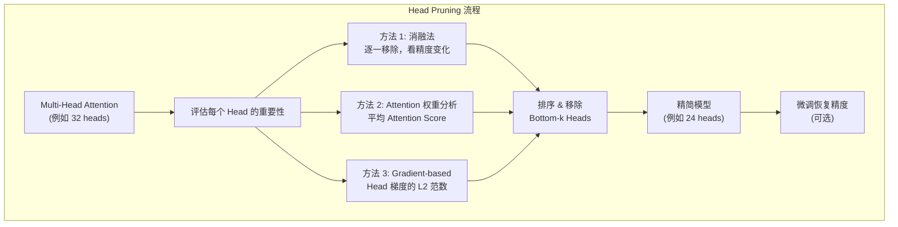

```python
def head_importance_score(model, dataloader, num_heads=32):
    """Leave-One-Out: 逐一关闭每个 Head，loss 增量越大 → 头越重要。"""
    model.eval()
    base_loss = sum(model(**b).loss.item() for b in dataloader) / len(dataloader)
    scores = torch.zeros(num_heads)
    for h in range(num_heads):
        hooks = []
        for layer in model.model.layers:
            def zero_head(mod, inp, out, idx=h):
                hd = out.shape[-1] // num_heads
                out[..., idx*hd:(idx+1)*hd] = 0
                return out
            hooks.append(layer.self_attn.register_forward_hook(zero_head))
        scores[h] = sum(model(**b).loss.item() for b in dataloader) / len(dataloader) - base_loss
        for hk in hooks: hk.remove()
    return scores  # prune_heads = scores.topk(8, largest=False).indices
```

### 3.2 Layer Pruning 层剪枝

Layer Pruning 直接移除整个 Transformer 层，是最激进的结构化剪枝方式。例如将 Llama-2-7B（32 层）剪到 24 层或 16 层：

```
Layer Pruning 策略
═══════════════════════════════════════════════════════════════════
1. BlockPruning:  移除最浅+最深层 → [L3, L4, ..., L29] (保留中间层)
2. UniformSampling: 均匀间隔采样 → [L1, L3, L5, L7] (相邻层功能相似)
3. Importance-based: 逐层评估 loss 变化 → 按评分保留 top-K 层
```

### 3.3 Width Pruning 宽度剪枝

Width Pruning 减少 FFN 层的中间维度（intermediate size）或 attention 的 head 维度。例如将 FFN 中间维度从 11008 减到 8192：

```python
def width_pruning_ffn(ffn_layer, target_ratio=0.75):
    """减少 FFN 中间维度：按神经元 L1 范数保留 top-K%。"""
    gate_w, up_w, down_w = ffn_layer.gate_proj.weight.data, ffn_layer.up_proj.weight.data, ffn_layer.down_proj.weight.data
    target_size = int(gate_w.shape[0] * target_ratio)
    
    # 每个中间神经元的综合重要性
    importance = gate_w.abs().sum(1) + up_w.abs().sum(1) + down_w.abs().sum(0)
    topk, _ = importance.topk(target_size)
    idx = topk.sort().indices
    
    # 切片三个矩阵保持维度对齐
    ffn_layer.gate_proj.weight.data = gate_w[idx]
    ffn_layer.up_proj.weight.data = up_w[idx]
    ffn_layer.down_proj.weight.data = down_w[:, idx]
    ffn_layer.intermediate_size = target_size
    return ffn_layer
```

### 3.4 LLM-Pruner：依赖感知结构化剪枝

**LLM-Pruner** (Ma et al., 2023) 解决了结构化剪枝中的一个核心难题：**模块间的依赖关系**。在 Transformer 中，剪掉一个层的某些维度可能破坏后续层的维度对齐。

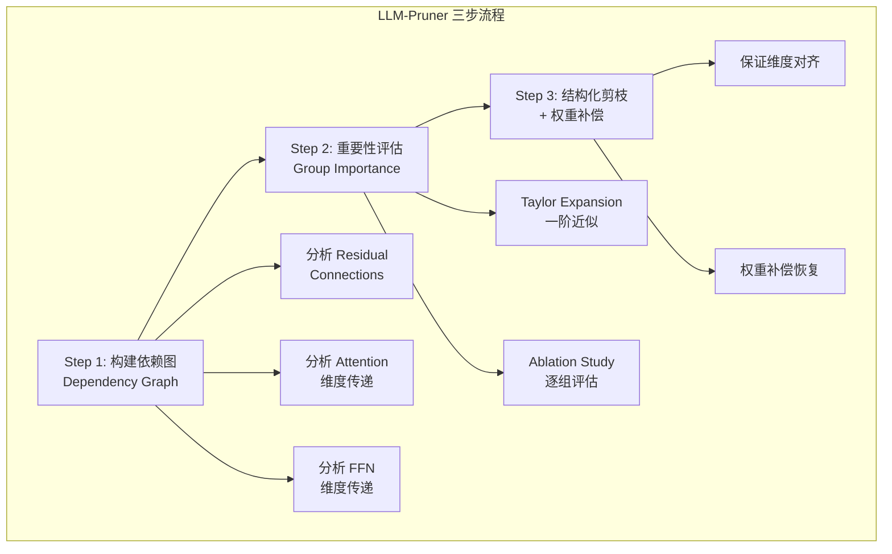

```python
# LLM-Pruner 核心依赖约束（剪枝时必须同步的维度组）
# Attention: Q/K/V head 维度必须对齐 → 同步剪枝
# FFN (SwiGLU): gate/up 输出维度 = down 输入维度 → 同步
# Residual: x = x + attention(x) → attention 输出维度不可变

from llmpruner import LLMPruner
pruner = LLMPruner(model, tokenizer)
pruner.prune(target_sparsity=0.3, method="taylor")
```

---

## 4. Knowledge Distillation 基础

### 4.1 Teacher-Student 框架

**知识蒸馏** (Knowledge Distillation, KD) 的核心思想是：**让小模型（Student）学习大模型（Teacher）的"软知识"，而不仅仅是硬标签**。

> **类比**: 传统训练就像学生只对照标准答案做题（答对/答错）；知识蒸馏就像学生可以看老师的解题思路——不仅知道正确答案，还知道哪些答案"接近正确"、哪些"完全离谱"。

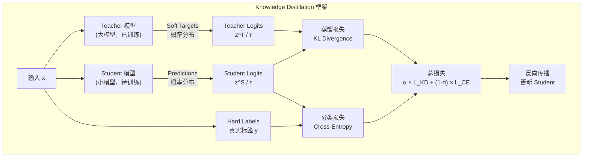

### 4.2 Logit 蒸馏与温度缩放

**Logit Distillation** 是最经典的蒸馏方法。Teacher 模型输出的 logit 向量经过 softmax 后形成概率分布（soft labels），Student 学习这个分布：

$$
p_i = \frac{\exp(z_i / \tau)}{\sum_j \exp(z_j / \tau)}
$$

其中 $\tau$ 是 **温度参数 (Temperature)**：

```
Temperature 对概率分布的影响
═══════════════════════════════════════════════════════════════════

Teacher Logits: [5.0, 2.0, 0.5, 0.1]

τ = 1.0 (正常 softmax):
  P = [0.92, 0.046, 0.010, 0.007]
  → 太"尖"了，几乎就是 one-hot，信息量少

τ = 3.0 (蒸馏用高温):
  P = [0.55, 0.22, 0.14, 0.12]
  → 平滑化！Student 能学到"猫和狗有相似性"

τ = 10.0 (极高温度):
  P = [0.30, 0.27, 0.24, 0.23]
  → 太平了，接近均匀分布，失去区分度

最佳实践:
  • 小模型 (≤1B): τ = 2-5
  • 中模型 (1-10B): τ = 3-8
  • 大模型 (≥10B): τ = 5-10
```

**蒸馏损失函数**：

$$
\mathcal{L}_{KD} = \tau^2 \cdot D_{KL}(p^T_\tau \| p^S_\tau)
$$

$\tau^2$ 因子用于补偿温度缩放对梯度的影响。

```python
import torch.nn.functional as F

def knowledge_distillation_loss(student_logits, teacher_logits, labels,
                                temperature=4.0, alpha=0.7):
    """
    经典 KD 损失: α × L_KD + (1-α) × L_CE
    τ² 缩放补偿温度对梯度的影响。
    """
    ce_loss = F.cross_entropy(
        student_logits.view(-1, student_logits.size(-1)),
        labels.view(-1), ignore_index=-100
    )
    # 蒸馏损失: Teacher soft Targets vs Student Log Probabilities
    teacher_probs = F.softmax(teacher_logits / temperature, dim=-1)
    student_log = F.log_softmax(student_logits / temperature, dim=-1)
    kd_loss = F.kl_div(
        student_log.view(-1, student_log.size(-1)),
        teacher_probs.view(-1, teacher_probs.size(-1)),
        reduction='batchmean'
    ) * (temperature ** 2)
    return alpha * kd_loss + (1 - alpha) * ce_loss
```

### 4.3 Feature Distillation 特征蒸馏

**Feature Distillation** (也叫 Hidden State Distillation) 不仅让 Student 模仿 Teacher 的输出，还模仿中间层的特征表示：

$$
\mathcal{L}_{feat} = \text{MSE}(W \cdot h^S, h^T)
$$

其中 $h^S$ 和 $h^T$ 分别是 Student 和 Teacher 的隐藏状态，$W$ 是一个可学习的投影矩阵（因为两者维度可能不同）。

### 4.4 Attention Transfer 注意力迁移

**Attention Transfer** (Zagoruyko & Komodakis, 2017) 让 Student 学习 Teacher 的注意力模式——即"看哪些位置"的知识：

```python
def attention_transfer_loss(student_attn, teacher_attn):
    """注意力迁移: Student 学习 Teacher 的 Attention Map (Zagoruyko 2017)。"""
    # 对 head 维度取均值后归一化，再计算 MSE
    s = F.normalize(student_attn.mean(dim=1), p=2, dim=(-2, -1))
    t = F.normalize(teacher_attn.mean(dim=1), p=2, dim=(-2, -1))
    return F.mse_loss(s, t)
```

---

## 5. LLM 蒸馏方法

### 5.1 SFT Distillation：Teacher 输出作为训练数据

**SFT Distillation** 是当前 LLM 蒸馏最主流、最实用的方法。核心流程非常简单：**用大模型生成高质量训练数据，然后拿这些数据去 SFT 训练小模型**。

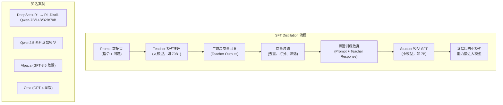

**DeepSeek-R1 蒸馏案例**：

```
DeepSeek-R1 蒸馏策略
═══════════════════════════════════════════════════════════════════

Teacher: DeepSeek-R1 (671B MoE, 37B active)

蒸馏数据:
  • 约 800K 条高质量推理数据
  • 覆盖: 数学、代码、逻辑推理、科学问答
  • Teacher 生成 + 人工验证 + 规则过滤

Student 模型家族:
  ┌─────────────────────┬────────────┬─────────────┬───────────┐
  │ Student             │ Base Model │ 参数量       │ 提升       │
  ├─────────────────────┼────────────┼─────────────┼───────────┤
  │ R1-Distill-Qwen-7B  │ Qwen2.5    │ 7B          │ +5x MATH  │
  │ R1-Distill-Qwen-14B │ Qwen2.5    │ 14B         │ +8x MATH  │
  │ R1-Distill-Qwen-32B │ Qwen2.5    │ 32B         │ +12x MATH │
  │ R1-Distill-Qwen-70B │ Qwen2.5    │ 70B         │ 接近 R1   │
  └─────────────────────┴────────────┴─────────────┴───────────┘

关键发现:
  1. 蒸馏效果 > 纯 RL 训练（同规模下）
  2. 70B Student 几乎达到 Teacher 水平
  3. 推理能力（Chain-of-Thought）成功迁移
  4. 蒸馏成本远低于从头训练
```

### 5.2 Logit Distillation for LLMs（MiniLM 方法）

**MiniLM** (Wang et al., 2020) 最初用于 BERT 压缩，但其核心思想已被扩展到 LLM 场景。关键创新是用 **Teacher 最后一层的 Self-Attention 分布** 作为蒸馏目标，而非完整的 logit 向量（LLM 词表太大，完整 logit 蒸馏开销巨大）：

```python
class MiniLMStyleDistillation(nn.Module):
    """MiniLM 风格蒸馏：对齐 Teacher 和 Student 的 Attention 分布，避免大词表 logit 开销。"""
    
    def __init__(self, teacher_model, student_model):
        super().__init__()
        self.teacher, self.student = teacher_model, student_model
        t_h, s_h = teacher_model.config.hidden_size, student_model.config.hidden_size
        self.projection = nn.Linear(s_h, t_h, bias=False) if t_h != s_h else nn.Identity()
    
    def forward(self, input_ids, attention_mask=None, labels=None):
        with torch.no_grad():
            teacher_outputs = self.teacher(input_ids=input_ids,
                attention_mask=attention_mask, output_attentions=True)
        student_outputs = self.student(input_ids=input_ids,
            attention_mask=attention_mask, output_attentions=True, labels=labels)
        
        # Attention 蒸馏：对齐最后一层的 Attention 分布
        teacher_attn = teacher_outputs.attentions[-1]
        student_attn = student_outputs.attentions[-1]
        if teacher_attn.shape[1] != student_attn.shape[1]:
            student_attn = student_attn.mean(dim=1, keepdim=True).expand_as(teacher_attn)
        
        attn_loss = F.kl_div(student_attn.log(), teacher_attn, reduction='batchmean')
        ce_loss = student_outputs.loss if labels is not None else 0
        return 0.7 * attn_loss + 0.3 * ce_loss
```

### 5.3 Self-Distillation 自蒸馏

**Self-Distillation** 不需要外部 Teacher 模型——模型从自己的早期 checkpoint 或 ensemble 中学习：

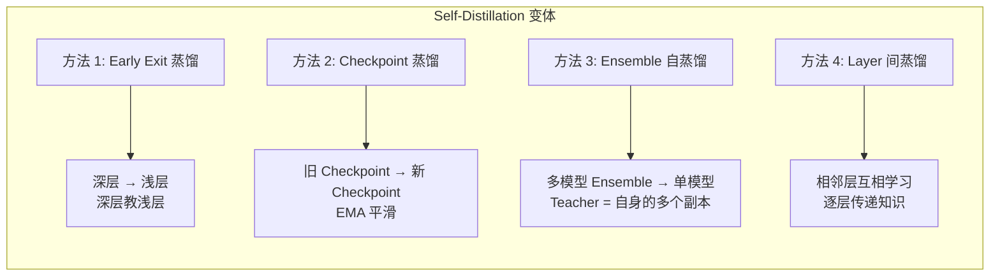

```python
class SelfDistillationTrainer:
    """Self-Distillation via EMA: 维护模型权重的 EMA 副本作为 Teacher。"""
    
    def __init__(self, model, ema_decay=0.999):
        self.model = model
        self.ema_model = copy.deepcopy(model)
        for p in self.ema_model.parameters(): p.requires_grad = False
        self.ema_decay = ema_decay
    
    @torch.no_grad()
    def update_ema(self):
        """θ_EMA = decay × θ_EMA + (1 - decay) × θ"""
        for ep, mp in zip(self.ema_model.parameters(), self.model.parameters()):
            ep.data.mul_(self.ema_decay).add_(mp.data, alpha=1 - self.ema_decay)
    
    def compute_loss(self, batch):
        student_out = self.model(**batch)
        with torch.no_grad():
            teacher_out = self.ema_model(**batch)
        kd_loss = F.kl_div(
            F.log_softmax(student_out.logits / 4.0, dim=-1),
            F.softmax(teacher_out.logits / 4.0, dim=-1),
            reduction='batchmean'
        ) * 16.0  # τ² = 4²
        return student_out.loss + 0.5 * kd_loss
```

### 5.4 On-Policy Distillation 在线蒸馏

**On-Policy Distillation** 与 SFT Distillation 的关键区别在于：**Student 自己生成数据，Teacher 负责纠正和评分**。这避免了 "分布偏移" 问题——Teacher 生成的数据可能不在 Student 的能力分布上。

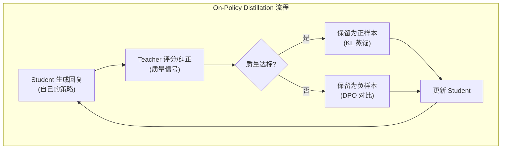

```python
def on_policy_distillation_step(student, teacher, tokenizer, prompts):
    """
    On-policy distillation: Student 生成, Teacher 纠正。
    
    优势: Student 在自身的输出分布上学习，避免 exposure bias。
    应用: DeepSeek-R1 的 RL 阶段本质上是 on-policy distillation。
    """
    # Student 自回归生成（on-policy）
    student_outputs = student.generate(prompts, do_sample=True, temperature=0.8)
    student_text = tokenizer.batch_decode(student_outputs, skip_special_tokens=True)
    
    # Teacher 对 Student 生成内容评分（作为 reward signal）
    with torch.no_grad():
        teacher_scores = []
        for prompt, response in zip(prompts, student_text):
            # Teacher 评估 Student 回复的质量
            score = teacher.evaluate_quality(prompt, response)
            teacher_scores.append(score)
    
    # 用 Teacher 评分作为 reward，执行蒸馏 + RL 更新
    rewards = torch.tensor(teacher_scores, device=student.device)
    loss = compute_policy_gradient_loss(student, student_outputs, rewards)
    return loss
```

> **On-policy vs Off-policy**: SFT Distillation 是 off-policy（Teacher 生成，Student 学习），On-policy Distillation 让 Student 在自己的分布上获得反馈。后者在推理任务上效果显著——DeepSeek-R1 的 RL 训练本质上就是一种 on-policy distillation，Student 通过自身探索 + Teacher 评分来提升推理能力。

### 5.5 LLaMA 4 蒸馏：Behemoth → Scout / Maverick

Meta 的 LLaMA 4 系列（2025）是 LLM 蒸馏的里程碑案例。Teacher 模型 **Behemoth**（2T 参数，288B active）被蒸馏为两个 Student 模型：

```
LLaMA 4 蒸馏架构
═══════════════════════════════════════════════════════════════════

Teacher: LLaMA 4 Behemoth
  • 总参数: 2T (2 万亿)
  • Active 参数: 288B (MoE 架构)
  • 专家数: 128
  • 训练数据: 40T+ tokens

Student 1: LLaMA 4 Scout
  • 总参数: 109B
  • Active 参数: 17B
  • 上下文: 10M tokens (超长上下文)
  • 蒸馏方法: SFT + 动态损失加权

Student 2: LLaMA 4 Maverick
  • 总参数: 400B
  • Active 参数: 17B
  • 上下文: 1M tokens
  • 蒸馏方法: SFT + MetaP 超参数迁移

蒸馏策略:
───────────────────────────────────────────────────────────────────
1. 动态损失加权 (Dynamic Loss Weighting)
   • 不同类型的数据用不同的蒸馏权重
   • 数学/代码数据: 高权重（Teacher 优势领域）
   • 通用对话数据: 低权重（Student 自主学习）
   
2. MetaP 超参数迁移
   • Teacher 的最优超参数配置直接迁移给 Student
   • 包括: 学习率调度、MoE 路由策略、专家负载均衡
   • 省去 Student 大量的超参数搜索成本

3. 渐进式蒸馏
   • Phase 1: 大规模 SFT 蒸馏 (80% 训练)
   • Phase 2: 对齐蒸馏 (DPO/GRPO 阶段也使用 Teacher 数据)
   • Phase 3: 专项微调 (针对特定 benchmark 优化)
```

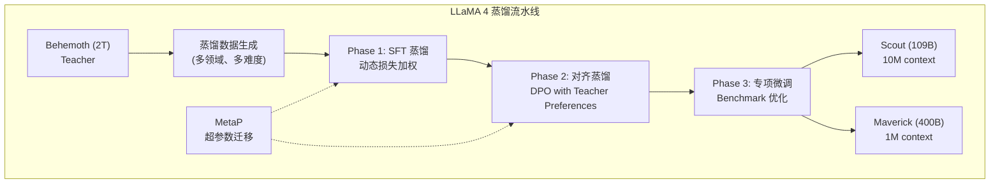

---

## 6. 蒸馏实践指南

### 6.1 选择 Teacher 模型

```
Teacher 选择决策树
═══════════════════════════════════════════════════════════════════

Student 规模    → Teacher 推荐
  ≤ 14B         → 70B+ (Qwen2.5-72B, Llama-3.1-70B, DeepSeek-R1)
  14-70B        → 200B+ 或 MoE (DeepSeek-V3, LLaMA 4 Behemoth)
  ≥ 70B         → Self-Distillation 或 Ensemble

目标领域        → Teacher 推荐
  通用对话      → GPT-4o / Claude 3.5 (API)
  数学推理      → DeepSeek-R1 / o1
  代码生成      → GPT-4o / DeepSeek-Coder-V2
  多语言        → Qwen2.5-72B (中英优势)
```

### 6.2 蒸馏数据管线

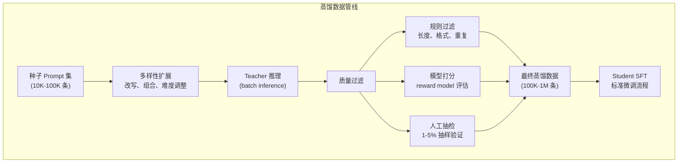

### 6.3 质量 vs 数量

| 策略 | 数据量 | 筛选标准 | 优点 | 缺点 | 案例 |
|------|--------|---------|------|------|------|
| **Quality-first** | 10K-50K | 人工审核 + 规则验证 | 噪声低 | 多样性不足 | R1 数学精选 (~50K) |
| **Quantity-first** | 500K-5M | 自动过滤 | 覆盖面广 | 含噪声 | Alpaca 52K |
| **Hybrid** ★ | 混合 | 核心精选 + 通用自动筛 | 兼顾质量与覆盖 | 管线复杂 | R1 完整蒸馏 (800K) |

### 6.4 混合蒸馏 + SFT

最佳实践是将蒸馏与传统 SFT 结合：

```python
# 混合训练数据配比建议（经验值）
training_mix = {
    "distillation_data": 0.50,  # Teacher 生成 → 能力迁移
    "human_sft_data":    0.30,  # 人工标注   → 对齐、安全
    "synthetic_data":    0.15,  # Student 自生成 + Teacher 验证 → 补盲区
    "replay_data":       0.05,  # 预训练数据子集 → 防灾难性遗忘
}

# 训练顺序: Phase 1 纯蒸馏 → Phase 2 混合 → Phase 3 SFT + DPO/GRPO
```

### 6.5 蒸馏效果评估

| 评估维度 | 指标 | 目标 |
|----------|------|------|
| **知识保留** | MMLU, ARC, HellaSwag | ≥ 90% Teacher 分数 |
| **推理能力** | GSM8K, MATH, BBH | ≥ 85% Teacher 分数 |
| **代码能力** | HumanEval, MBPP | ≥ 80% Teacher 分数 |
| **生成质量** | BLEU, ROUGE, BERTScore | 与 Teacher 差距 < 5% |
| **推理速度** | tokens/s | ≥ 5x Teacher 速度 |
| **部署成本** | 显存占用 | ≤ 20% Teacher 显存 |

---

## 7. Pruning vs Distillation vs Quantization

### 7.1 三大压缩方法概览

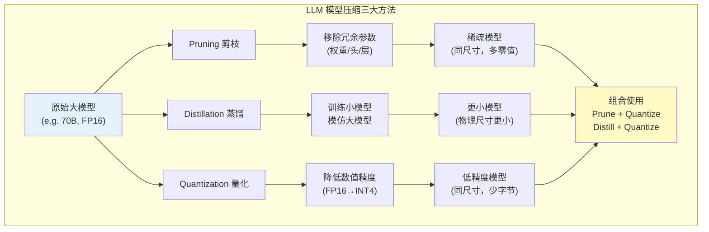

### 7.2 何时使用哪种方法

| 约束场景 | 推荐方法 | 理由 |
|---------|---------|------|
| **显存不足 + 精度优先** | Quantization (INT8/INT4) | 几乎无精度损失，直接减小体积 |
| **显存不足 + 可妥协** | Pruning 50%+ + Quantization | 叠加可获 4-8x 压缩 |
| **延迟高 + GPU** | Structured Pruning (Head/Layer) | 直接减少计算量 |
| **延迟高 + NVIDIA** | 2:4 Sparsity | 硬件原生 2x 加速 |
| **边缘/移动端** | Distillation | 小模型在任何硬件上都快 |
| **模型家族** | SFT Distillation | 一次 Teacher 推理，多次 Student 训练 |
| **快速压缩 (10min)** | Wanda | One-shot, 无需训练 |
| **精确压缩 (1h)** | SparseGPT | One-shot, 更高精度 |
| **最佳效果 (天级)** | Distillation | 效果最好但最耗时 |

### 7.3 组合策略：压缩流水线

实际生产中，三种方法通常组合使用，形成端到端的压缩流水线：

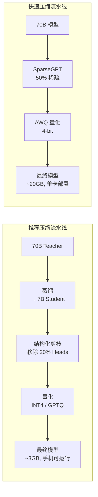

```
原始: Llama-2-70B (FP16, 140GB) — 组合策略效果对比
═══════════════════════════════════════════════════════════════════

流水线 A: 蒸馏 → 量化
  70B → 蒸馏 7B (14GB) → INT4 (3.5GB)  |  40x 压缩 | 20-40x 加速 | 精度: 中

流水线 B: 非结构化剪枝 → 量化
  70B → Wanda 50% (稀疏 140GB) → INT4 (35GB)  |  4x 压缩 | 2-4x 加速 | 精度: 低损失

流水线 C: 结构化剪枝 → 量化
  70B → LLM-Pruner 25% (~105GB) → INT4 (~26GB)  |  5.4x 压缩 | 3-5x 加速 | 精度: 低

流水线 D: Full Combo (蒸馏 + 剪枝 + 量化)
  70B → 蒸馏 14B (28GB) → 剪枝 20% (~22GB) → INT4 (~5.5GB)  |  25x | 15-25x 加速
```

> **与 PEFT 的关系**: 蒸馏后的 Student 模型通常还需要进一步微调。PEFT 技术（如 LoRA）可以在蒸馏后以低成本适配下游任务，详见 [PEFT 2026](../05_NLP_LLMs/Fine_tuning_Techniques/PEFT_2026/PEFT_2026.md)。

---

## 8. 方法对比总表

### 8.1 压缩方法全景对比

| **方法** | **压缩比** | **精度损失** | **速度提升** | **适用场景** | **是否需要训练** | **典型工具** |
|----------|------------|-------------|-------------|-------------|-----------------|-------------|
| **Magnitude Pruning** | 20-40% | 中-高 | 需硬件支持 | 快速实验 | 否 | torch.nn.utils.prune |
| **Wanda** | 20-60% | 低-中 | 2-3x | 快速压缩 | 否 (one-shot) | llm-compressor |
| **SparseGPT** | 50-60% | 低 | 2-3x | 一次性压缩 | 否 (one-shot) | llm-compressor |
| **Movement Pruning** | 20-50% | 低 | 需硬件支持 | 微调后压缩 | 是 (微调过程) | MovementPruning lib |
| **2:4 Sparsity** | 50% (固定) | 低 | 2x (硬件) | NVIDIA GPU | 是 (稀疏训练) | NVIDIA ASP |
| **LLM-Pruner** | 结构化 | 低 | 硬件友好 | 边缘部署 | 轻量微调 | llm-pruner |
| **Head Pruning** | 10-30% | 低 | 1.2-1.5x | 推理加速 | 否/轻量 | 自定义 |
| **Layer Pruning** | 25-50% | 中 | 2-4x | 模型缩小 | 轻量微调 | llm-compressor |
| **SFT 蒸馏** | 10-100x | 中 | 10-100x | 模型家族 | 是 (SFT) | HuggingFace TRL |
| **Logit 蒸馏** | 2-8x | 低-中 | 2-8x | 精度敏感 | 是 | MiniLM, 自定义 |
| **Feature 蒸馏** | 2-4x | 低 | 2-4x | 推理加速 | 是 | 自定义 |
| **Self-Distillation** | 1-2x | 极低 | 1-2x | 模型精炼 | 是 | 自定义 |
| **INT4 量化** | 4x (固定) | 极低 | 1.5-2x | 显存优化 | 否 (PTQ) | GPTQ, AWQ |
| **INT8 量化** | 2x (固定) | 几乎无 | 1.2-1.5x | 无损压缩 | 否 (PTQ) | SmoothQuant |

### 8.2 知名蒸馏模型家族对比

| **模型家族** | **Teacher** | **Students** | **蒸馏数据量** | **核心能力** |
|-------------|-------------|-------------|---------------|-------------|
| **DeepSeek-R1-Distill** | R1 (671B MoE) | 7B/14B/32B/70B | ~800K | 数学推理、CoT |
| **Qwen2.5 系列** | Qwen2.5-72B | 0.5B/1.5B/3B/7B/14B/32B | 未公开 | 通用+代码+数学 |
| **Alpaca** | GPT-3.5 | 7B | 52K | 指令跟随 |
| **Orca 2** | GPT-4 | 7B/13B | ~1M | 推理+解释 |
| **MiniLM** | BERT-large | BERT-base/6L | 无 (logit) | NLU 任务 |
| **LLaMA 4 Scout** | Behemoth (2T) | 109B (17B active) | 40T+ tokens | 10M 上下文 |
| **LLaMA 4 Maverick** | Behemoth (2T) | 400B (17B active) | 40T+ tokens | 通用+多模态 |

### 8.3 剪枝方法在不同模型规模上的表现

| 模型规模 | 50% 稀疏精度保持 | 建议 |
|---------|----------------|------|
| 1.3B | ~85% | 不建议大幅剪枝 |
| 2.7B | ~90% | 轻度剪枝 |
| 7B | ~95% | 甜蜜点：50% 稀疏几乎无损 |
| 13B | ~96% | 安全剪枝区间 |
| 30B-70B | ~97-98% | 冗余高，可激进剪枝 |
| 175B+ | ~99% | 极高冗余 |

> **关键洞察**: 模型越大，冗余越多，同等稀疏度下精度损失越小。Wanda/SparseGPT 在 7B+ 模型上接近无损。

---

## 9. 实战代码与工具链

### 9.1 llm-compressor 工具链

[llm-compressor](https://github.com/vllm-project/llm-compressor) 是目前最流行的 LLM 压缩一站式工具，支持剪枝、量化和蒸馏：

```python
from llmcompressor.modifiers.pruning import WandaPruningModifier
from llmcompressor.modifiers.quantization import QuantizationModifier
from llmcompressor import oneshot

model_id = "meta-llama/Llama-2-7b-hf"
model = AutoModelForCausalLM.from_pretrained(model_id, torch_dtype="auto")
tokenizer = AutoTokenizer.from_pretrained(model_id)
calibration_data = load_calibration_dataset("ultrachat", num_samples=128, tokenizer=tokenizer)

recipe = {
    "pruning": WandaPruningModifier(sparsity=0.5, targets=["re:.*mlp.*", "re:.*self_attn.*"]),
    "quantization": QuantizationModifier(scheme="W4A16", targets=["Linear"]),
}

oneshot(model=model, dataset=calibration_data, recipe=recipe, output_dir="./compressed-llama2-7b")
# 结果: 14GB → ~2.5GB | vLLM 推理 ~40 tokens/s (A100)
```

### 9.2 HuggingFace TRL 蒸馏训练

```python
from trl import SFTTrainer, SFTConfig

distillation_dataset = load_dataset("json", data_files="distill_data.jsonl")
model = AutoModelForCausalLM.from_pretrained(student_id, torch_dtype="bfloat16",
    attn_implementation="flash_attention_2")
tokenizer = AutoTokenizer.from_pretrained(student_id)
tokenizer.pad_token = tokenizer.eos_token

training_args = SFTConfig(
    output_dir="./distilled-student",
    num_train_epochs=3,
    per_device_train_batch_size=4,
    gradient_accumulation_steps=8,
    learning_rate=2e-5,
    bf16=True,
    warmup_ratio=0.1,
    lr_scheduler_type="cosine",
    max_seq_length=2048,
)

trainer = SFTTrainer(model=model, args=training_args,
    train_dataset=distillation_dataset["train"], tokenizer=tokenizer)
trainer.train()
# 预期: 7B Student 达到 Teacher (70B) 的 85-90% MMLU | 推理 80+ tokens/s
```

### 9.3 vLLM 部署稀疏模型

```python
from vllm import LLM, SamplingParams

# 加载压缩后的模型（剪枝 + 量化联合部署）
llm = LLM(
    model="./compressed-llama2-7b",
    quantization="gptq",
    dtype="float16",
    tensor_parallel_size=1,
    # sparse_backend="compressed-tensors",  # vLLM >= 0.4 稀疏加速
)

# 压缩后性能参考 (A100 40GB):
#   原始 7B FP16:    ~60 tokens/s, 14GB 显存
#   剪枝 50% + INT4: ~120 tokens/s (2x 加速), 2.5GB 显存
```

---

## 10. 前沿挑战与未来方向

### 10.1 当前核心挑战

| 挑战 | 问题描述 | 当前方向 |
|------|---------|---------|
| **稀疏硬件鸿沟** | 非结构化剪枝的零值无法被主流硬件有效利用 | TVM/Triton 编译器优化、专用硬件 |
| **蒸馏版权问题** | 用 GPT-4 输出训练开源模型的法律风险 | 使用开源 Teacher (DeepSeek, Qwen) |
| **MoE 剪枝特殊性** | MoE 天然稀疏，如何进一步压缩 | 减少专家数、合并相似专家 |
| **长上下文蒸馏** | 100K+ 上下文 Teacher → 短上下文 Student | RoPE 缩放迁移、渐进式长度训练 |
| **天花板效应** | Student 永远无法超越 Teacher（纯蒸馏上限） | 蒸馏 + RL 后训练可突破上限 |

### 10.2 未来方向

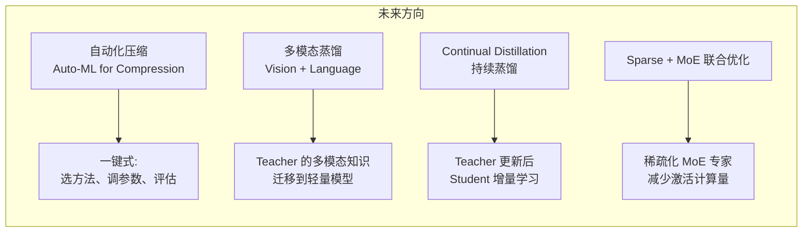

| 方向 | 描述 | 预期时间线 |
|------|------|-----------|
| **Auto-Compression** | 自动搜索最优压缩策略（剪枝率 + 量化位宽 + 蒸馏温度） | 2025-2026 |
| **On-device Distillation** | 在手机/PC 上直接执行蒸馏训练 | 2026-2027 |
| **Speculative Decoding + Pruning** | 用稀疏模型做 draft，密集模型验证 | 2025 |
| **Reasoning Distillation** | 蒸馏 Process Reward (PRM) 而非仅 Outcome | 2025-2026 |
| **Universal Compression Standard** | 统一稀疏格式标准（类似 GGUF 之于量化） | 2026+ |

---

## 11. 交叉引用与延伸阅读

### 项目内关联文档

- [**量化技术深度解析 2026**](../10_Deployment_Inference/Quantization_Techniques_2026.md) — 量化的完整方法论，与本文的剪枝+量化组合策略直接互补
- [**PEFT 2026 参数高效微调**](../05_NLP_LLMs/Fine_tuning_Techniques/PEFT_2026/PEFT_2026.md) — 蒸馏后 Student 的低成本微调方法（LoRA、DoRA 等）
- [**Meta LLaMA 深度解析**](../05_NLP_LLMs/Global_LLM_Ecosystem/Meta_LLaMA_Deep_Dive.md) — LLaMA 4 Behemoth→Scout/Maverick 蒸馏架构的详细分析
- [**分布式训练 2026**](./Distributed_Training_2026.md) — 蒸馏训练中的大规模数据并行和 Teacher 推理并行
- [**GRPO 与对齐方法**](./GRPO_and_New_Alignment_Methods.md) — 蒸馏后的对齐阶段（DPO/GRPO）方法详解

### 关键论文

| 论文 | 年份 | 核心贡献 |
|------|------|---------|
| Wanda (Sun et al.) | 2023 | 权重 × 激活 one-shot 剪枝 |
| SparseGPT (Frantar & Alistarh) | 2023 | Hessian-based one-shot 剪枝 |
| LLM-Pruner (Ma et al.) | 2023 | 依赖感知结构化剪枝 |
| Movement Pruning (Sanh et al.) | 2020 | 微调过程中的权重运动追踪 |
| Knowledge Distillation (Hinton et al.) | 2015 | Teacher-Student 蒸馏框架 |
| MiniLM (Wang et al.) | 2020 | 多头 Attention 蒸馏 |
| LLaMA 4 (Meta) | 2025 | 2T Teacher → Scout/Maverick 蒸馏 |
| DeepSeek-R1 (DeepSeek) | 2025 | 推理能力蒸馏到 7B-70B 家族 |

### 推荐工具

| 工具 | 用途 | 链接 |
|------|------|------|
| **llm-compressor** | 一站式剪枝+量化 | github.com/vllm-project/llm-compressor |
| **llm-pruner** | 结构化剪枝 | github.com/horseee/LLM-Pruner |
| **NVIDIA ASP** | 2:4 稀疏训练 | github.com/NVIDIA/apex |
| **HuggingFace TRL** | SFT 蒸馏训练 | github.com/huggingface/trl |
| **vLLM** | 稀疏模型推理 | github.com/vllm-project/vllm |
| **Compressed-Tensors** | 稀疏格式标准 | github.com/neuralmagic/compressed-tensors |

---

> **总结**: Pruning 和 Knowledge Distillation 是 LLM 压缩的两大核心方法。Pruning 适合"快速瘦身"（尤其是 Wanda/SparseGPT 的 one-shot 方案），Distillation 适合"训练模型家族"（如 DeepSeek-R1 的蒸馏策略）。实际生产中，两者与量化联合使用，可以将 70B 模型压缩到手机可运行的 3GB 文件，同时保持 85%+ 的原始性能。选择哪种方法，取决于你的具体约束——时间、硬件、精度要求和部署场景。

---

*Last updated: 2026-06-04*
