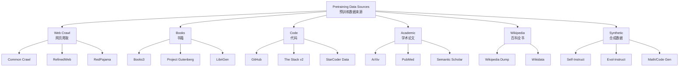
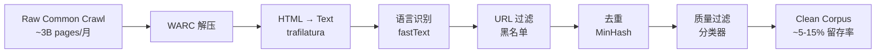
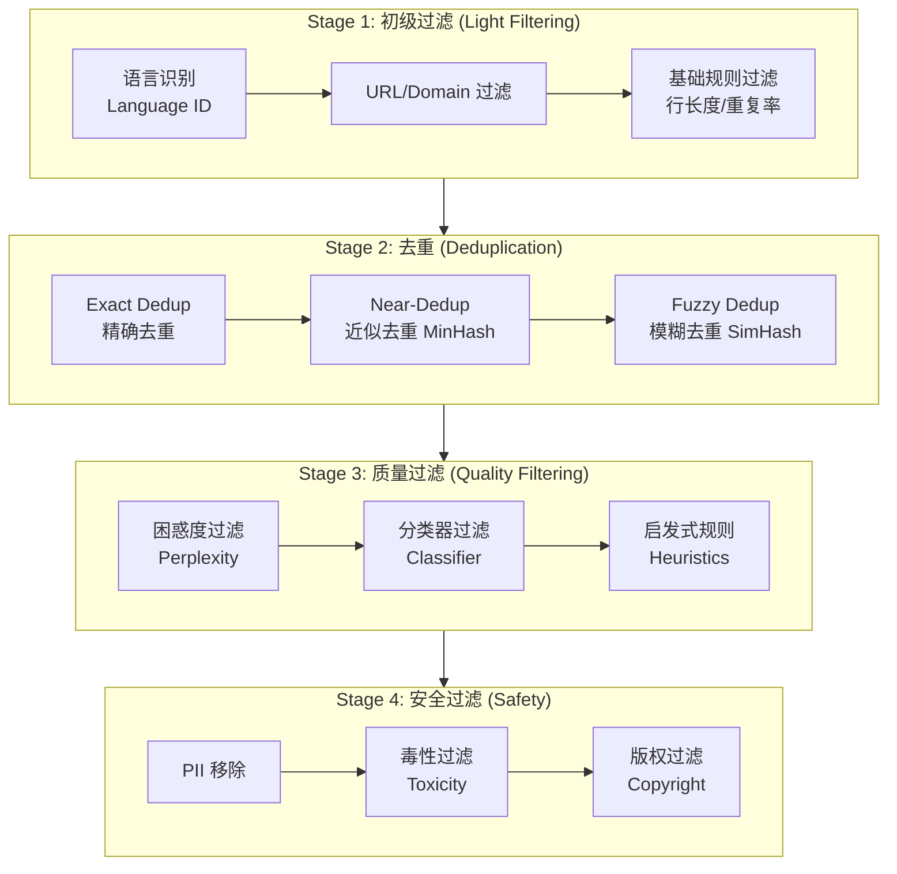
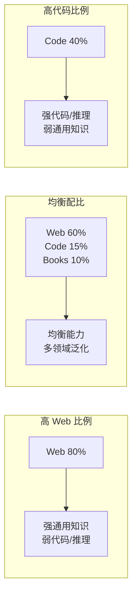
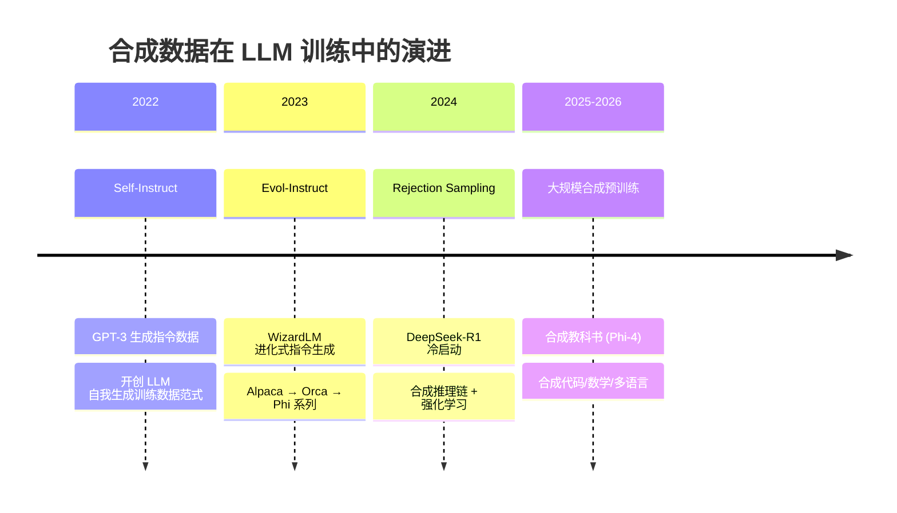
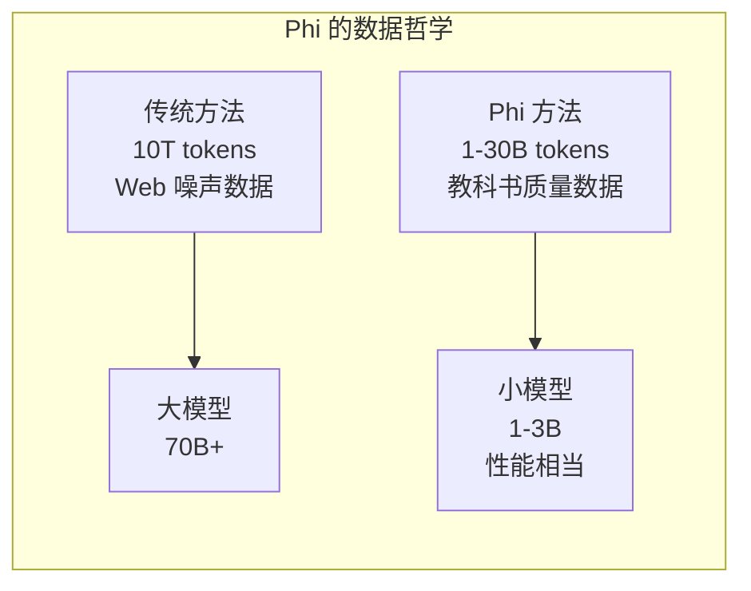
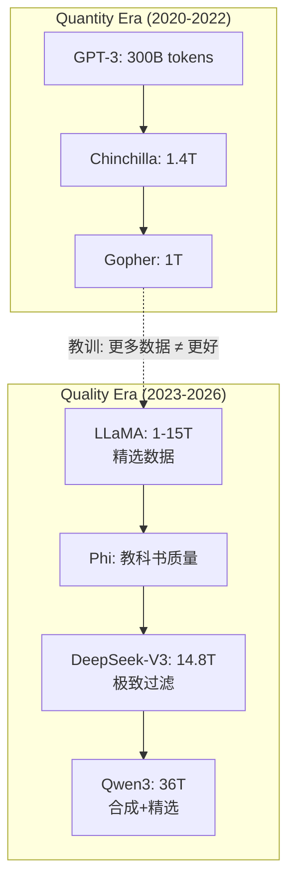
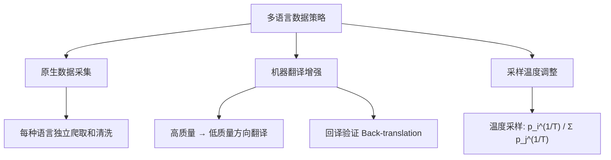
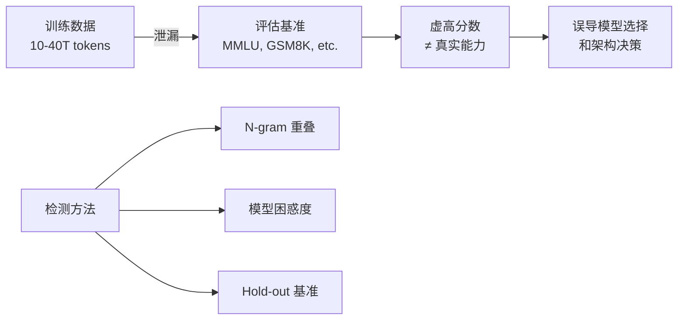
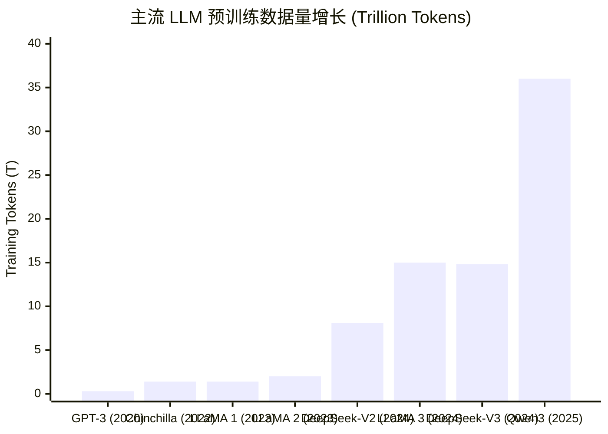

# Data Curation and Mixture for LLM Pretraining 2026

> **一句话理解**: 数据配比就像大厨调配食材——光有好原料不够，还得精确控制每道菜的比例和烹饪顺序，否则再贵的松露也会做成黑暗料理。

---

## 目录

| 章节 | 内容 | 难度 |
|------|------|------|
| [数据收集总览](#1-数据收集总览) | Web、Books、Code、Academic、Wikipedia 数据来源 | 入门 |
| [数据清洗 Pipeline](#2-数据清洗-pipeline) | 语言识别、URL 过滤、去重、质量过滤、PII 移除 | 进阶 |
| [Data Mixture 数据配比](#3-data-mixture-数据配比) | 配比对能力的影响、典型比例、DoReMi、DSIR、分布式加载 | 进阶 |
| [Synthetic Data 合成数据](#4-synthetic-data-合成数据) | Self-Instruct、Evol-Instruct、拒绝采样、冷启动 | 进阶 |
| [Quality > Quantity 质量胜于数量](#5-quality--quantity-质量胜于数量) | LLaMA 1 启示、Phi、DCLM、FineWeb | 前沿 |
| [Multilingual Data 多语言数据](#6-multilingual-data-多语言数据) | 英语主导问题、平衡策略、机器翻译增强 | 进阶 |
| [Contamination & Leakage 数据污染与泄漏](#7-contamination--leakage-数据污染与泄漏) | 基准污染检测、Hold-out 策略 | 前沿 |
| [数据配比对比表](#8-数据配比对比表) | LLaMA / Qwen / DeepSeek 全景对比 | 查表 |
| [实战代码](#9-实战代码) | 数据过滤、去重、质量分类器 | 实战 |
| [相关文档](#10-相关文档) | 交叉引用 | 导航 |

---

## 1. 数据收集总览

### 1.1 数据来源全景图

现代 LLM 的预训练数据通常达到 **10–40 Trillion tokens**，来源涵盖 Web、书籍、代码、学术论文和百科。



### 1.2 Web Crawl 网页数据

Web 数据是预训练的"主食"，占总数据量的 **50–70%**。

| 数据集 | 规模 | 来源 | 特点 |
|--------|------|------|------|
| **Common Crawl** | ~250B tokens/月 | 全网爬取 | 覆盖广、噪声大、需重度清洗 |
| **RefinedWeb** | ~5T tokens | Falcon 团队 (TII) | 仅用 URL + 规则过滤，不用分类器 |
| **RedPajama-V2** | >30T tokens | Together AI | 复刻 LLaMA 数据配比，含 100+ 质量信号 |
| **FineWeb** | 15T tokens | HuggingFace | 精选 Common Crawl 子集，质量信号标注 |
| **CulturaX** | 6.3T tokens | 167 种语言 | 多语言清洗，覆盖非英语语料 |
| **DCLM** | 4T tokens | DataComp 社区 | 高质量 Common Crawl 子集，系统化基准 |

**Common Crawl 处理流程**:



> **关键洞察**: Common Crawl 原始数据中只有约 **5–15%** 的内容能通过严格的质量过滤。这意味着从 2020 年至今的 Common Crawl 原始数据量约 ~100T tokens，清洗后约 **10–15T tokens** 可用。

### 1.3 Books 书籍数据

书籍提供 **长上下文理解** 和 **文学风格**，是 Web 数据无法替代的高质量语料。

| 数据集 | 规模 | 说明 |
|--------|------|------|
| **Books3** | ~12B tokens | 196K 本书，含版权争议，已被多个项目弃用 |
| **Project Gutenberg** | ~3B tokens | 70K+ 版权过期书籍，安全合规 |
| **LibriGen** | ~5B tokens | 合成教科书风格数据 |
| **Proofpile 2** | ~32B tokens | AlgebraicStack，含数学/代码/长文本 |

> **注意**: Books3 因版权争议（包含大量盗版书籍），自 LLaMA 2 起主流项目已转向合规替代品。LLaMA 3 使用了大量出版商授权数据。

### 1.4 Code 代码数据

代码数据不仅训练模型的编程能力，还显著提升 **逻辑推理 (logical reasoning)** 能力。

| 数据集 | 规模 | 语言数 | 说明 |
|--------|------|--------|------|
| **The Stack v2** | ~600B tokens | 600+ 编程语言 | BigCode 项目，许可合规 |
| **StarCoder Data** | ~1T tokens | 80+ 语言 | The Stack v1 清洗子集 |
| **GitHub (raw)** | ~数 T tokens | 全部 | 需重度过滤低质量 repo |

代码数据清洗的关键过滤条件：

- **Stars / Forks**: 高星项目优先
- **文件大小**: 过滤 >1MB 单文件（通常是生成代码）
- **注释比**: 注释行 / 总行数 > 5%
- **重复率**: 过滤高重复率文件
- **测试文件**: 通常保留（含高质量断言逻辑）

### 1.5 Academic 学术数据

| 数据集 | 规模 | 领域 | 说明 |
|--------|------|------|------|
| **ArXiv** | ~10B tokens | 物理/数学/CS | LaTeX 源码，结构化强 |
| **PubMed** | ~15B tokens | 生物医学 | 摘要 + 全文 |
| **Semantic Scholar** | ~8B tokens | 全领域 | 论文摘要与引用图 |
| **peS2o** | ~40B tokens | 全领域 | OLMo 使用的学术子集 |

### 1.6 Wikipedia

Wikipedia 是高质量 **事实性知识** 的核心来源：

- 英文 Wikipedia: ~4B tokens
- 全语言 Wikipedia: ~15B tokens
- 特点：高度结构化、事实密集、定期更新
- 几乎所有主流 LLM 都将 Wikipedia 作为基础数据

---

## 2. 数据清洗 Pipeline

### 2.1 Pipeline 全景

一个完整的 LLM 数据清洗 Pipeline 包含以下阶段：



### 2.2 Language ID 语言识别

使用 **fastText** 的语言识别模型对每条文本进行分类：

```python
import fasttext

# 加载预训练的语言识别模型
model = fasttext.load_model("lid.176.bin")

def identify_language(text: str, threshold: float = 0.8) -> str | None:
    """
    识别文本语言。返回 ISO 639-1 语言代码，置信度低于阈值则返回 None。
    """
    # fastText 要求单行输入
    text_clean = text.replace("\n", " ").strip()
    predictions = model.predict(text_clean, k=1)

    label = predictions[0][0]           # e.g. "__label__en"
    confidence = predictions[1][0]      # e.g. 0.98

    lang_code = label.replace("__label__", "")
    if confidence >= threshold:
        return lang_code
    return None

# 批量过滤示例
corpus = [
    "The quick brown fox jumps over the lazy dog.",
    "今天天气真好，适合出去散步。",
    "これはテストです。",
    "xk3j$#@! asdf qwerty",
]

for text in corpus:
    lang = identify_language(text)
    print(f"Language: {lang:>5s} | Text: {text[:50]}")
```

**关键点**:
- fastText lid.176 支持 **176 种语言**
- 推理速度：**>100K 文本/秒**（CPU）
- 对于短文本（<20 字符），置信度下降，通常直接丢弃

### 2.3 URL / Domain 过滤

基于 URL 和域名黑名单进行过滤：

```python
# 常见黑名单来源
BLOCKED_DOMAINS = {
    # 色情/暴力/垃圾网站
    "pornhub.com", "xvideos.com",
    # SEO 垃圾站
    "pinterest.com", "quora.com",   # 视项目需要
    # 已知低质量内容农场
    "contentfarm.example.com",
}

BLOCKED_URL_PATTERNS = [
    r"/tag/",           # Tag 聚合页
    r"/category/",      # 分类页
    r"/author/",        # 作者页
    r"\?page=\d+",      # 分页
    r"/wp-content/",    # WordPress 资源页
    r"\.(jpg|png|gif|pdf|zip)$",  # 非文本资源
]

def url_filter(url: str) -> bool:
    """返回 True 表示保留，False 表示过滤。"""
    from urllib.parse import urlparse
    import re

    parsed = urlparse(url)
    domain = parsed.netloc.lower()

    # 域名黑名单
    if domain in BLOCKED_DOMAINS:
        return False

    # URL 模式匹配
    for pattern in BLOCKED_URL_PATTERNS:
        if re.search(pattern, url, re.IGNORECASE):
            return False

    return True
```

> **RefinedWeb 的启示**: Falcon 团队发现仅通过 **URL 过滤 + 语言识别 + 去重**（不使用质量分类器），就能获得与使用分类器相当的预训练效果。这说明 URL 过滤是一个被低估的高质量信号。

### 2.4 Deduplication 去重

去重是数据清洗中 **投入产出比最高** 的步骤。研究表明，Web 数据中约 **30–50%** 的内容存在不同程度的重复。

#### 2.4.1 Exact Dedup 精确去重

对文本计算 hash，完全相同的文本被去除：

```python
import hashlib

def exact_dedup(texts: list[str]) -> list[str]:
    """
    精确去重：基于 SHA-256 hash。
    时间复杂度 O(n)，适用于大规模数据集。
    """
    seen_hashes: set[str] = set()
    unique_texts: list[str] = []

    for text in texts:
        # Normalize: 去除首尾空白，统一小写（可选）
        normalized = text.strip()
        text_hash = hashlib.sha256(normalized.encode("utf-8")).hexdigest()

        if text_hash not in seen_hashes:
            seen_hashes.add(text_hash)
            unique_texts.append(text)

    return unique_texts
```

#### 2.4.2 MinHash Near-Dedup 近似去重

使用 **MinHash + LSH (Locality Sensitive Hashing)** 检测近似重复文档：

```python
from datasketch import MinHash, MinHashLSH

def create_minhash(text: str, num_perm: int = 128) -> MinHash:
    """为文本创建 MinHash 签名。"""
    m = MinHash(num_perm=num_perm)
    # 使用 3-gram shingling
    for i in range(len(text) - 2):
        m.update(text[i:i+3].encode("utf-8"))
    return m

def near_dedup_lsh(texts: list[str], threshold: float = 0.8) -> list[str]:
    """
    基于 MinHash LSH 的近似去重。
    threshold: Jaccard 相似度阈值，高于此值视为近似重复。
    """
    lsh = MinHashLSH(threshold=threshold, num_perm=128)
    unique_texts: list[str] = []

    for idx, text in enumerate(texts):
        doc_id = f"doc_{idx}"
        minhash = create_minhash(text)

        # 查询是否已有近似文档
        result = lsh.query(minhash)
        if len(result) == 0:
            # 无近似重复，插入 LSH 索引并保留
            lsh.insert(doc_id, minhash)
            unique_texts.append(text)

    return unique_texts
```

**MinHash 核心原理**:

| 概念 | 说明 |
|------|------|
| **Shingling** | 将文本拆分为 k-gram 集合（通常 k=3 或 5） |
| **MinHash** | 用多个随机排列对集合进行签名，估计 Jaccard 相似度 |
| **LSH** | 将相似签名 hash 到同一桶中，避免全量两两比较 |
| **阈值** | Jaccard > 0.8 通常视为近似重复 |
| **规模** | datasketch 可处理 **数十亿文档**（配合 Redis/LevelDB） |

#### 2.4.3 SimHash Fuzzy Dedup 模糊去重

SimHash 检测 **段落级别** 的模糊重复：

```python
import simhash

def simhash_dedup(texts: list[str], threshold: int = 3) -> list[str]:
    """
    SimHash 模糊去重。
    threshold: Hamming 距离阈值，越小越严格。
    通常 threshold=3 对应约 80% 相似度。
    """
    from simhash import Simhash, SimhashIndex

    index = SimhashIndex([], k=threshold)
    unique_texts: list[str] = []

    for idx, text in enumerate(texts):
        h = Simhash(text)
        doc_id = str(idx)

        # 查询近似文档
        duplicates = index.get_near_dups(h)
        if len(duplicates) == 0:
            index.add(doc_id, h)
            unique_texts.append(text)

    return unique_texts
```

#### 去重方法对比

| 方法 | 检测粒度 | 速度 | 准确率 | 适用场景 |
|------|---------|------|--------|---------|
| **Exact Hash** | 完全相同 | 极快 O(n) | 100% | 删除完全重复 |
| **MinHash LSH** | 文档级近似 | 快（亚线性） | ~95% | 大规模近似去重 |
| **SimHash** | 段落级模糊 | 中等 | ~90% | 细粒度模糊去重 |
| **Suffix Array** | 子串级 | 慢 | 最高 | 论文级精确去重 |

### 2.5 Quality Filtering 质量过滤

#### 2.5.1 基于规则 (Rule-based)

```python
def rule_based_filter(text: str) -> bool:
    """
    启发式规则过滤。返回 True 表示保留。
    参考 RedPajama / FineWeb 的过滤策略。
    """
    lines = text.split("\n")
    if len(lines) < 3:
        return False  # 太短的文档

    # 1. 平均行长度：太短 = 导航菜单/列表
    avg_line_len = sum(len(line) for line in lines) / len(lines)
    if avg_line_len < 30:
        return False

    # 2. 重复行比例：高重复 = 模板/垃圾
    unique_lines = set(lines)
    dup_ratio = 1 - len(unique_lines) / len(lines)
    if dup_ratio > 0.3:
        return False

    # 3. 特殊字符比例
    special_chars = sum(1 for c in text if c in "#*|=_-[]{}")
    special_ratio = special_chars / len(text) if len(text) > 0 else 0
    if special_ratio > 0.1:
        return False

    # 4. 停用词密度（英文）
    stop_words = {"the", "is", "at", "of", "on", "and", "a", "to", "in"}
    words = text.lower().split()
    stop_count = sum(1 for w in words if w in stop_words)
    stop_ratio = stop_count / len(words) if len(words) > 0 else 0
    if stop_ratio < 0.02:
        return False  # 停用词太少 = 可能是乱码

    # 5. 文档长度
    if len(text) < 200 or len(text) > 200_000:
        return False

    return True
```

#### 2.5.2 基于分类器 (Classifier-based)

```python
"""
质量分类器：使用参考数据集训练二分类器。
正样本 = Wikipedia / Books（高质量）
负样本 = Common Crawl 随机采样（低质量）
"""
from sklearn.feature_extraction.text import TfidfVectorizer
from sklearn.linear_model import LogisticRegression
from sklearn.pipeline import Pipeline

def build_quality_classifier(
    positive_texts: list[str],   # Wikipedia / Books 样本
    negative_texts: list[str],   # CC 随机样本
) -> Pipeline:
    """
    训练质量分类器。
    实际生产中通常使用 fastText 或小型 Transformer。
    """
    X = positive_texts + negative_texts
    y = [1] * len(positive_texts) + [0] * len(negative_texts)

    pipeline = Pipeline([
        ("tfidf", TfidfVectorizer(
            max_features=100_000,
            ngram_range=(1, 3),
            sublinear_tf=True,
        )),
        ("clf", LogisticRegression(
            C=1.0,
            max_iter=1000,
            class_weight="balanced",
        )),
    ])

    pipeline.fit(X, y)
    return pipeline

def filter_by_classifier(
    classifier: Pipeline,
    texts: list[str],
    threshold: float = 0.5,
) -> list[str]:
    """基于分类器概率分数过滤文本。"""
    probs = classifier.predict_proba(texts)[:, 1]
    return [t for t, p in zip(texts, probs) if p >= threshold]
```

> **DCLM 的发现**: DataComp-LM 研究表明，使用 **小型 fastText 分类器**（训练于 Wikipedia vs CC）进行质量过滤，效果优于复杂的大型 Transformer 分类器，且速度快 100x+。

#### 2.5.3 困惑度过滤 (Perplexity-based)

使用已训练的小型语言模型计算文本困惑度。困惑度异常高 = 乱码/噪声，异常低 = 重复/模板。

```python
def perplexity_filter(
    text: str,
    model,           # 小型 LM (e.g. KenLM or GPT-2 small)
    low_pct: float = 5,     # 丢弃困惑度过低的 5%（重复模板）
    high_pct: float = 95,   # 丢弃困惑度过高的 5%（乱码噪声）
) -> bool:
    """
    基于困惑度的质量过滤。
    需要先计算语料库的困惑度分布，确定分位数阈值。
    """
    ppl = model.perplexity(text)
    # 实际使用中，阈值从训练集分位数得出
    return low_pct_threshold <= ppl <= high_pct_threshold
```

### 2.6 PII Removal 个人信息移除

```python
import re

# PII 检测模式
PII_PATTERNS = {
    "email": r"\b[A-Za-z0-9._%+-]+@[A-Za-z0-9.-]+\.[A-Z|a-z]{2,}\b",
    "phone_us": r"\b(?:\+?1[-.]?)?\(?[0-9]{3}\)?[-.\s]?[0-9]{3}[-.\s]?[0-9]{4}\b",
    "phone_cn": r"\b1[3-9]\d{9}\b",
    "ssn": r"\b\d{3}-\d{2}-\d{4}\b",
    "credit_card": r"\b(?:\d{4}[-\s]?){3}\d{4}\b",
    "ip_address": r"\b(?:\d{1,3}\.){3}\d{1,3}\b",
}

def remove_pii(text: str, replacement: str = "[REDACTED]") -> str:
    """移除文本中的个人身份信息 (PII)。"""
    for pii_type, pattern in PII_PATTERNS.items():
        text = re.sub(pattern, replacement, text)
    return text
```

> **合规注意**: PII 移除不仅是数据质量问题，更是 **法律合规** 要求（GDPR、CCPA）。主流项目如 FineWeb 和 DCLM 均包含严格的 PII 过滤步骤。

---

## 3. Data Mixture 数据配比

### 3.1 为什么数据配比如此重要？

数据配比 (Data Mixture) 直接决定模型的 **能力分布 (capability distribution)**。



**核心发现**:

1. **代码数据** 不仅提升编程能力，还显著提升 **数学推理** 和 **逻辑能力**
2. **书籍数据** 提升 **长文本理解** 和 **叙事连贯性**
3. **学术数据** 提升 **专业知识** 和 **科学推理**
4. **多语言数据** 比例影响 **跨语言迁移** 效果

### 3.2 典型数据配比

| 领域 | 典型占比 | 作用 |
|------|---------|------|
| **Web (Common Crawl)** | 50–70% | 通用知识、语言建模基础 |
| **Code (GitHub/Stack)** | 10–20% | 编程、逻辑推理、结构化思维 |
| **Books** | 5–15% | 长文本理解、文学风格 |
| **Wikipedia** | 3–8% | 事实性知识、百科信息 |
| **Academic (ArXiv/PubMed)** | 5–15% | 科学推理、专业知识 |
| **Social/Forum** | 0–5% | 对话风格、多样化表达 |

### 3.3 主流模型的数据配比

#### LLaMA 1 (1.4T tokens)

| 数据源 | 占比 | Tokens (估算) |
|--------|------|--------------|
| CommonCrawl (filtered) | 67.0% | ~938B |
| C4 | 15.0% | ~210B |
| GitHub | 4.5% | ~63B |
| Wikipedia | 4.5% | ~63B |
| Books | 4.5% | ~63B |
| ArXiv | 2.5% | ~35B |
| Stack Exchange | 2.0% | ~28B |

> **LLaMA 1 的关键洞察**: 在 Chinchilla 定律的基础上，Meta 选择 **过度训练** 小模型（更多 tokens），而非训练更大模型。这一策略后来被所有主流项目采纳。详见 [Scaling Laws and Training Dynamics](./Scaling_Laws_and_Training_Dynamics.md)。

#### LLaMA 3 (15T tokens)

LLaMA 3 将训练数据量扩大到 **15T tokens**（LLaMA 1 的 ~10x），且 **50%+ 为非英语数据**，覆盖 30+ 种语言。

- 数据来源更加多样化，包含大量 **授权出版商** 数据
- 代码数据占比提升至 ~15%
- 引入 **知识增强**：用 LLaMA 2 生成分类器标注数据质量

#### Qwen3 (36T tokens)

- **36T tokens** 是截至 2025 年公开报告中 **最大** 的预训练数据量之一
- 覆盖 **119 种语言和方言**
- 大规模使用 **合成数据** 增强数学/推理能力
- 详细的领域配比未完全公开，但已知包含大量 Web + Code + Books

#### DeepSeek-V3 (14.8T tokens)

- 使用 **14.8T tokens** 高质量数据
- 重点优化了 **数学、代码、推理** 领域的数据配比
- 训练成本仅 **$5.6M**（2048 H800），极高数据效率
- 数据清洗 Pipeline 极其严格

### 3.4 DoReMi 领域权重优化

**DoReMi** (Domain Reweighting with Minimax Optimization) 是 Google 提出的自动学习最优数据配比方法：

```python
"""
DoReMi 核心思想:
1. 训练一个小型 reference model（领域专家混合）
2. 用 minimax 优化调整每个领域的权重
3. 将学到的权重应用到大模型训练
"""
import torch
import torch.nn.functional as F

def doremi_weight_update(
    domain_weights: torch.Tensor,   # [num_domains], 初始均匀
    domain_losses: torch.Tensor,    # [num_domains], 每个领域的验证 loss
    eta: float = 0.1,               # 学习率
) -> torch.Tensor:
    """
    DoReMi 权重更新规则 (Exponentiated Gradient):
    w_i' = w_i * exp(eta * loss_i) / Z
    Z 是归一化常数。
    直觉：loss 高的领域权重增加，迫使模型更多关注困难领域。
    """
    log_weights = torch.log(domain_weights) + eta * domain_losses
    new_weights = F.softmax(log_weights, dim=0)
    return new_weights

# 示例：5 个领域
domains = ["web", "code", "books", "wiki", "academic"]
initial_weights = torch.ones(5) / 5  # 均匀分布
example_losses = torch.tensor([2.1, 3.5, 2.8, 1.9, 3.2])  # 验证集 loss

new_weights = doremi_weight_update(initial_weights, example_losses)
for d, w in zip(domains, new_weights):
    print(f"  {d:>10s}: {w:.4f}")
# code 和 academic 权重会上升（loss 高）
# wiki 权重会下降（loss 低）
```

**DoReMi vs 手动调参**:

| 方面 | 手动调配比 | DoReMi 自动优化 |
|------|-----------|----------------|
| 效率 | 需要多次完整训练 | 用小模型代理 |
| 精度 | 依赖直觉和经验 | 数据驱动 |
| 可迁移性 | 模型规模变化时需重调 | 权重可跨规模迁移 |
| 局限 | — | 依赖代理模型的准确性 |

### 3.5 DSIR 数据选择

**DSIR** (Data Selection via Importance Resampling) 是一种从大数据池中高效选择子集的方法：

```python
"""
DSIR 核心步骤:
1. 用轻量级 feature extractor (e.g. hash features) 提取文本特征
2. 估计目标分布和源分布的重要性权重
3. 按权重进行重采样
"""
import numpy as np

def dsir_select(
    source_features: np.ndarray,     # [N, D] 源数据特征
    target_features: np.ndarray,     # [M, D] 目标分布特征
    n_select: int,                   # 选择数量
) -> np.ndarray:
    """
    DSIR 重要性采样。
    返回选中样本的索引。
    """
    # 估计重要性权重 w(x) = p_target(x) / p_source(x)
    # 使用 hash 特征近似估计
    source_density = estimate_density(source_features)
    target_density = estimate_density(target_features)

    # 在源数据点上评估权重
    weights = target_density / (source_density + 1e-8)
    weights = np.clip(weights, 0, 100)  # 防止极端权重

    # 按权重采样
    probs = weights / weights.sum()
    selected_indices = np.random.choice(
        len(source_features),
        size=n_select,
        replace=False,
        p=probs,
    )
    return selected_indices
```

### 3.6 Distributed Data Engineering at Scale

在大规模分布式训练（如 512x H100 集群）中，如何高效、准确地将 Trillion 级别的 Token 喂给模型是一个巨大的工程挑战。

#### 3.6.1 Streaming Datasets 流式数据

传统的 `map-style` 数据加载需要将所有索引读入内存，在 TB 级数据面前会造成 OOM。2026 年的标准实践是使用 **IterableDataset** 流式加载。

```python
"""
使用 HuggingFace `datasets` 库实现分布式流式加载。
"""
from datasets import load_dataset
from torch.utils.data import DataLoader

def get_distributed_stream(
    dataset_name: str,
    split: str = "train",
    batch_size: int = 4,
):
    # streaming=True 开启流式模式，不下载完整文件
    ds = load_dataset(dataset_name, split=split, streaming=True)
    
    # 自动处理分布式分片：每个 rank 只读取自己的数据部分
    # ds = ds.shard(num_shards=world_size, index=global_rank)
    
    # 打乱缓冲区
    ds = ds.shuffle(buffer_size=10_000, seed=42)
    
    return DataLoader(ds, batch_size=batch_size)
```

#### 3.6.2 Sharding & Shuffling 分片与打乱

为了保证训练的随机性，需要实施 **两级打乱策略**：
1. **全局打乱 (Global Shuffle)**: 在预处理阶段将数据切分为数万个小文件 (shards)，并随机打乱文件顺序。
2. **局部打乱 (Local Shuffle)**: 每个训练进程读取分片时，维护一个缓冲区进行实时打乱。

#### 3.6.3 Deterministic Resumption 确定性续训

在分布式环境下，如果训练中断，如何保证恢复后数据不重不漏？

- **方案**: 记录每个进程已读取的 `sample_index` 或文件 offset。
- **最佳实践**: 使用 `WebDataset` 或 `MosaicML Streaming`，它们支持将数据加载状态保存到 checkpoint 中。

```python
# MosaicML Streaming 示例 (2026 行业标准)
from streaming import StreamingDataset

dataset = StreamingDataset(
    local="./local_cache",
    remote="s3://my-bucket/pretraining-data",
    split="train",
    shuffle=True,
    batch_size=32
)

# 恢复训练时，StreamingDataset 会根据 checkpoint 自动定位 offset
```

---

## 4. Synthetic Data 合成数据

### 4.1 合成数据的角色演变



### 4.2 Self-Instruct

Self-Instruct 是让 LLM 自动生成 **指令-响应对** 的开创性方法：

```python
"""
Self-Instruct 流程:
1. 人工编写 ~175 条种子指令
2. LLM 基于种子指令生成新指令
3. LLM 为每条新指令生成响应
4. 过滤低质量/重复指令
"""

SELF_INSTRUCT_PROMPT = """
You are a helpful assistant. Generate {n} diverse instructions
that a user might ask. Each instruction should be:
- Self-contained (no external references needed)
- Diverse in topic and format
- Appropriate for an AI assistant to answer

Seed examples:
{seed_examples}

Generate {n} new instructions:
"""

def self_instruct_generate(
    model,
    seed_instructions: list[str],
    n_new: int = 5,
) -> list[dict]:
    """生成新的指令-响应对。"""
    results = []

    # Step 1: 生成新指令
    prompt = SELF_INSTRUCT_PROMPT.format(
        n=n_new,
        seed_examples="\n".join(f"- {s}" for s in seed_instructions[:8]),
    )
    new_instructions = model.generate(prompt)

    # Step 2: 为每条指令生成响应
    for instruction in new_instructions:
        response = model.generate(
            f"Instruction: {instruction}\nResponse:"
        )
        results.append({
            "instruction": instruction,
            "response": response,
        })

    # Step 3: ROUGE 去重过滤
    results = filter_diverse(results, rouge_threshold=0.7)
    return results
```

### 4.3 Evol-Instruct (WizardLM)

Evol-Instruct 通过 **进化策略** 逐步提升指令的复杂度和多样性：

```python
"""
Evol-Instruct 进化策略:
1. Adding Constraints: 增加约束条件
2. Concretizing: 使指令更具体
3. Increasing Reasoning Steps: 增加推理步骤
4. Complicating Input: 使输入更复杂
5. Deepening: 深化问题层次
"""

EVOL_PROMPTS = {
    "add_constraint": """
Rewrite the following instruction by adding one or more constraints:
Original: {instruction}
""",
    "concretize": """
Rewrite the following instruction to be more specific and concrete:
Original: {instruction}
""",
    "reasoning_steps": """
Rewrite the following instruction to require multi-step reasoning:
Original: {instruction}
""",
    "complicate_input": """
Rewrite the following instruction with more complex input:
Original: {instruction}
""",
    "deepen": """
Rewrite the following instruction to require deeper understanding:
Original: {instruction}
""",
}

def evol_instruct(
    model,
    instruction: str,
    evolution_type: str = "add_constraint",
) -> str:
    """进化单条指令。"""
    prompt = EVOL_PROMPTS[evolution_type].format(instruction=instruction)
    evolved = model.generate(prompt)
    return evolved

def evol_instruct_pipeline(
    model,
    seed_instructions: list[str],
    n_rounds: int = 3,
) -> list[dict]:
    """多轮进化 Pipeline。"""
    all_instructions = list(seed_instructions)

    for round_idx in range(n_rounds):
        new_instructions = []
        for instruction in all_instructions[-len(seed_instructions):]:
            for evol_type in EVOL_PROMPTS:
                evolved = evol_instruct(model, instruction, evol_type)
                new_instructions.append(evolved)
        all_instructions.extend(new_instructions)

    # 生成响应 + 质量过滤
    dataset = []
    for instruction in all_instructions:
        response = model.generate(f"Q: {instruction}\nA:")
        if quality_check(instruction, response):
            dataset.append({
                "instruction": instruction,
                "response": response,
            })

    return dataset
```

### 4.4 Math & Code 合成数据

```python
"""
数学合成数据生成示例:
1. 使用程序化方法生成数学问题和解答
2. 使用 LLM 生成推理链 (Chain-of-Thought)
3. 通过答案验证器过滤正确解答
"""

def generate_math_synthetic(
    model,
    topic: str = "algebra",
    difficulty: str = "medium",
    n_samples: int = 1000,
) -> list[dict]:
    """生成数学合成数据。"""
    samples = []

    for _ in range(n_samples):
        # Step 1: 生成问题
        problem = model.generate(
            f"Generate a {difficulty} difficulty {topic} problem. "
            "Only output the problem statement."
        )

        # Step 2: 生成带推理链的解答
        solution = model.generate(
            f"Solve step by step:\n{problem}\n\nSolution:"
        )

        # Step 3: 答案验证 (programmatic verifier)
        answer = extract_final_answer(solution)
        if verify_answer(problem, answer):
            samples.append({
                "problem": problem,
                "solution": solution,
                "verified_answer": answer,
            })

    return samples
```

### 4.5 Rejection Sampling 拒绝采样

DeepSeek-R1 使用 **冷启动数据** 进行初始对齐，约 **~100K 高质量样本**：

```python
"""
Rejection Sampling 拒绝采样流程:
1. 对每个问题采样 N 个回答 (N = 64~256)
2. 使用 Verifier 评估每个回答
3. 保留得分最高的 K 个回答
4. 用于 SFT 或 RL 训练
"""

def rejection_sampling(
    model,
    problem: str,
    verifier,
    n_samples: int = 64,
    top_k: int = 4,
    temperature: float = 1.0,
) -> list[str]:
    """
    拒绝采样：生成多个候选，保留最优的 K 个。
    DeepSeek-R1 冷启动数据的核心生成方法。
    """
    candidates = []
    for _ in range(n_samples):
        response = model.generate(
            problem,
            temperature=temperature,
            top_p=0.95,
            max_tokens=4096,
        )
        candidates.append(response)

    # Verifier 评分
    scored = []
    for response in candidates:
        score = verifier.score(problem, response)
        scored.append((score, response))

    # 排序取 Top-K
    scored.sort(key=lambda x: x[0], reverse=True)
    return [response for _, response in scored[:top_k]]
```

### 4.6 合成数据的规模与质量权衡

| 方法 | 典型规模 | 质量 | 成本 | 应用场景 |
|------|---------|------|------|---------|
| **Self-Instruct** | ~52K | 中 | 低 | SFT 基础 |
| **Evol-Instruct** | ~70-250K | 中高 | 中 | 复杂指令跟随 |
| **Math 合成** | ~100K-1M | 高（可验证） | 中 | 数学推理 |
| **Code 合成** | ~100K-数 M | 高（可执行） | 中 | 编程能力 |
| **DeepSeek-R1 冷启动** | ~100K | 极高 | 高 | RL 冷启动 |
| **Phi 教科书** | ~20B tokens | 极高 | 高 | 预训练 |

---

## 5. Quality > Quantity 质量胜于数量

### 5.1 LLaMA 1 的启示

LLaMA 1 (2023) 的关键发现：

> *"A smaller model trained on more data outperforms a larger model trained on fewer data."*

| 模型 | 参数量 | 训练 Tokens | 性能 |
|------|--------|------------|------|
| GPT-3 | 175B | 300B | Baseline |
| Chinchilla | 70B | 1.4T | ≈ GPT-3 |
| **LLaMA 7B** | 7B | 1T | > GPT-3 13B |
| **LLaMA 13B** | 13B | 1T | > GPT-3 20B (多数基准) |

**含义**: 数据质量和训练量可以 **补偿模型规模**。一个小模型如果喂足够多的高质量数据，可以超越更大的模型。这与 [Scaling Laws and Training Dynamics](./Scaling_Laws_and_Training_Dynamics.md) 中讨论的 Chinchilla 定律密切相关。

### 5.2 Phi 系列: "Textbook-Quality" 数据

Microsoft 的 **Phi** 系列模型将 "质量胜于数量" 推到了极致：

| 模型 | 参数量 | 训练 Tokens | 数据来源 |
|------|--------|------------|---------|
| **Phi-1** | 1.3B | 1B | GPT-3.5 生成的教科书 + 习题 |
| **Phi-1.5** | 1.3B | 30B | 教科书 + 合成推理 |
| **Phi-2** | 2.7B | 1.4T | 教科书 + 过滤 Web |
| **Phi-3 mini** | 3.8B | 3.3T | 教科书质量 Web + 合成 |
| **Phi-4** | 14B | 9.6T | 合成数据为主 |

**Phi-1 实验**: 用 GPT-3.5 生成 **仅 1B tokens** 的教科书质量 Python 教材，训练的 1.3B 参数模型在 HumanEval 上达到 **50.6%**，接近 LLaMA 7B 的代码能力。



### 5.3 DCLM 研究

**DataComp for Language Models (DCLM)** 是一项系统化的数据质量研究：

- **目标**: 在统一基准上比较不同数据清洗策略
- **发现**:
 - 质量过滤 > 数量扩张
 - **基于分类器的过滤** 效果最好（Wikipedia 作为正样本）
 - 去重的边际收益随规模增大而递减
 - 最佳策略 = 分类器过滤 + MinHash 去重 + URL 过滤

### 5.4 FineWeb 高质量子集

HuggingFace 的 **FineWeb** 项目提供了系统化的数据质量研究：

```python
"""
FineWeb 质量层级:
1. FineWeb (全量): 15T tokens — 基础清洗
2. FineWeb-Edu: 1.3T tokens — 教育价值高分数据
3. FineWeb-Edu V2: 5.4T tokens — 扩展版本

关键发现:
- 在 100B token 预算下，FineWeb-Edu 训练的模型
  在 MMLU / ARC / HellaSwag 上超越 LLaMA 3 8B
- 教育价值评分器: 使用 LLaMA 3 70B 对文本进行
  "教育价值" 1-5 分评分
"""

# FineWeb-Edu 评分器使用示例
EDU_SCORE_PROMPT = """
Rate the educational value of the following text on a scale of 1-5:
1 = No educational value (ads, spam, low-quality content)
3 = Some educational value (general knowledge, casual learning)
5 = High educational value (textbook-quality, deep explanations)

Text: {text}

Score (1-5):
"""

def score_educational_value(model, text: str) -> int:
    """评估文本的教育价值。"""
    prompt = EDU_SCORE_PROMPT.format(text=text[:2000])
    score = model.generate(prompt, max_tokens=2)
    return int(score.strip())
```

### 5.5 质量 vs 数量：总结



---

## 6. Multilingual Data 多语言数据

### 6.1 英语主导问题

LLM 训练数据中 **英语占比超过 70%**，导致严重的语言不平衡：

| 语言 | 全球使用人口 | Web 数据占比 | 训练数据占比 |
|------|------------|------------|------------|
| 英语 | ~1.5B (含二语) | ~60% | ~70-80% |
| 中文 | ~1.1B | ~20% | ~5-10% |
| 西班牙语 | ~550M | ~5% | ~2-3% |
| 阿拉伯语 | ~420M | ~2% | ~0.5-1% |
| 印地语 | ~600M | ~1% | ~0.1-0.5% |
| 斯瓦希里语 | ~100M | <0.1% | <0.01% |

### 6.2 平衡多语言策略



**温度采样 (Temperature Sampling)**:

$$
w_i = \frac{p_i^{1/T}}{\sum_j p_j^{1/T}}
$$

其中 $p_i$ 是语言 $i$ 在原始数据中的比例，$T$ 是温度参数：

- $T = 1$: 保持原始比例
- $T > 1$: 向低资源语言倾斜（常用 $T = 5$）
- $T \to \infty$: 完全均匀

```python
import numpy as np

def temperature_sampling(
    lang_proportions: dict[str, float],
    temperature: float = 5.0,
) -> dict[str, float]:
    """
    温度采样调整多语言配比。
    较高的温度使低资源语言获得更多采样权重。
    """
    langs = list(lang_proportions.keys())
    props = np.array([lang_proportions[l] for l in langs])

    # 温度采样
    adjusted = props ** (1.0 / temperature)
    normalized = adjusted / adjusted.sum()

    return dict(zip(langs, normalized))

# 示例
original = {"en": 0.70, "zh": 0.10, "es": 0.05, "ar": 0.02, "sw": 0.001}
balanced = temperature_sampling(original, temperature=5.0)

for lang in original:
    print(f"  {lang}: {original[lang]:.3f} → {balanced[lang]:.3f}")
# 英语: 0.700 → 0.390 (下降)
# 斯瓦希里语: 0.001 → 0.056 (上升)
```

### 6.3 机器翻译增强

```python
"""
机器翻译增强策略:
1. 选取高质量英文数据
2. 翻译为目标语言
3. 回译验证：翻译 → 英文，检查语义一致性
4. 过滤翻译质量低的样本
"""

def translation_augmentation(
    translator,
    english_texts: list[str],
    target_lang: str,
    back_translate_threshold: float = 0.85,
) -> list[dict]:
    """通过机器翻译扩充多语言数据。"""
    augmented = []

    for text in english_texts:
        # Forward translation
        translated = translator.translate(text, target_lang)

        # Back-translation for quality check
        back_translated = translator.translate(translated, "en")

        # Semantic similarity check
        similarity = compute_similarity(text, back_translated)
        if similarity >= back_translate_threshold:
            augmented.append({
                "text": translated,
                "source_lang": "en",
                "target_lang": target_lang,
                "quality_score": similarity,
            })

    return augmented
```

### 6.4 Qwen 的多语言实践

Qwen 系列在多语言方面的实践是业界标杆：

| 版本 | 语言覆盖 | 策略 |
|------|---------|------|
| **Qwen 1** | ~30 语言 | 基础多语言 |
| **Qwen 2** | ~27 语言 | 扩展低资源 |
| **Qwen 2.5** | ~29 语言 | 深度优化 |
| **Qwen3** | **119 语言和方言** | 覆盖大量低资源语言 |

Qwen3 的多语言策略：

1. **大规模原生数据采集**: 从 Web 中系统采集 119 种语言的原生数据
2. **Tokenizer 优化**: 使用多语言友好的 Tokenizer，低资源语言的 tokenization 效率更高（详见 [Tokenizer Design 2026](./Tokenizer_Design_2026.md)）
3. **方言支持**: 首次大规模支持方言（如粤语、闽南语等）
4. **跨语言对齐**: 确保不同语言的模型能力相对均衡

---

## 7. Contamination & Leakage 数据污染与泄漏

### 7.1 问题概述

数据污染 (Contamination) 是指 **评估基准的测试数据** 出现在 **训练数据** 中，导致模型在基准上的得分虚高。



### 7.2 污染检测方法

#### 7.2.1 N-gram 重叠检测

```python
def detect_contamination_ngram(
    training_data: list[str],
    benchmark_data: list[str],
    n: int = 13,
    threshold: float = 0.5,
) -> dict:
    """
    检测训练数据与基准之间的 N-gram 重叠。
    OpenAI 使用 13-gram 重叠作为污染指标。
    """
    # 构建训练数据的 N-gram 索引
    train_ngrams: set[tuple] = set()
    for doc in training_data:
        tokens = doc.split()
        for i in range(len(tokens) - n + 1):
            ngram = tuple(tokens[i:i+n])
            train_ngrams.add(ngram)

    # 检测基准数据中的重叠
    results = {}
    for benchmark_name, examples in benchmark_data.items():
        contaminated = 0
        total = len(examples)

        for example in examples:
            tokens = example.split()
            example_ngrams = set()
            for i in range(len(tokens) - n + 1):
                ngram = tuple(tokens[i:i+n])
                example_ngrams.add(ngram)

            if len(example_ngrams) > 0:
                overlap = len(example_ngrams & train_ngrams) / len(example_ngrams)
                if overlap >= threshold:
                    contaminated += 1

        results[benchmark_name] = {
            "contaminated": contaminated,
            "total": total,
            "ratio": contaminated / total if total > 0 else 0,
        }

    return results
```

#### 7.2.2 困惑度异常检测

```python
def detect_contamination_perplexity(
    model,
    benchmark_examples: list[str],
    reference_corpus: list[str],
) -> dict:
    """
    如果模型对基准文本的困惑度异常低，
    可能表示该文本出现在训练数据中。
    """
    # 计算基准文本的平均困惑度
    benchmark_ppls = [model.perplexity(ex) for ex in benchmark_examples]
    avg_benchmark_ppl = sum(benchmark_ppls) / len(benchmark_ppls)

    # 计算参考语料的平均困惑度（已知未污染）
    reference_ppls = [model.perplexity(ref) for ref in reference_corpus]
    avg_reference_ppl = sum(reference_ppls) / len(reference_ppls)

    # 如果基准困惑度远低于参考，可能存在污染
    ratio = avg_benchmark_ppl / avg_reference_ppl
    is_contaminated = ratio < 0.5  # 阈值可根据经验调整

    return {
        "benchmark_ppl": avg_benchmark_ppl,
        "reference_ppl": avg_reference_ppl,
        "ratio": ratio,
        "likely_contaminated": is_contaminated,
    }
```

### 7.3 Hold-out 基准策略

```python
"""
Hold-out 策略:
1. 在训练开始前，从基准数据中保留一部分作为 "canary"
2. 训练后检查模型是否 "记住" 了这些 canary
3. 如果 canary 被记住，说明整个基准可能已被污染

替代方案:
- 使用全新的、未公开的基准
- 在训练数据中主动排除已知基准
- 使用动态基准 (e.g. Chatbot Arena)
"""

HOLD_OUT_RATIO = 0.1  # 保留 10% 的基准数据作为 canary

def create_holdout_benchmark(
    benchmark: list[dict],
    hold_out_ratio: float = HOLD_OUT_RATIO,
    seed: int = 42,
) -> tuple[list[dict], list[dict]]:
    """分割基准为公开部分和 hold-out 部分。"""
    import random
    random.seed(seed)

    indices = list(range(len(benchmark)))
    random.shuffle(indices)

    split = int(len(indices) * hold_out_ratio)
    holdout_indices = set(indices[:split])

    public = [b for i, b in enumerate(benchmark) if i not in holdout_indices]
    holdout = [b for i, b in enumerate(benchmark) if i in holdout_indices]

    return public, holdout
```

### 7.4 污染对评估的影响

| 基准 | 污染前分数 | 去污染后分数 | 下降幅度 | 模型 |
|------|-----------|------------|---------|------|
| MMLU | 86.4% | 83.1% | -3.3% | GPT-4 (est.) |
| GSM8K | 95.0% | 88.2% | -6.8% | 某 70B 模型 |
| HellaSwag | 87.3% | 86.9% | -0.4% | LLaMA 2 70B |
| ARC-C | 67.3% | 63.1% | -4.2% | 某 13B 模型 |

> **最佳实践**: 报告模型性能时，同时报告 **污染检测结果**。越来越多的顶会要求作者声明基准数据是否可能出现在训练数据中。

---

## 8. 数据配比对比表

### 8.1 主流 LLM 数据配比全景对比

| 模型 | 总 Token | Web | Code | Books | Wiki | Academic | 多语言 |
|------|---------|-----|------|-------|------|----------|--------|
| **LLaMA 1** | 1.4T | 67% | 4.5% | 4.5% | 4.5% | 2.5% | — |
| **LLaMA 2** | 2T | ~65% | ~5% | ~5% | ~5% | ~3% | — |
| **LLaMA 3** | 15T | ~60% | ~15% | ~10% | ~5% | ~5% | 50%+ |
| **Mistral 7B** | ~1T | ~70% | ~5% | ~5% | ~5% | ~5% | — |
| **Qwen 2.5** | ~18T | 大量 | 大量 | — | — | — | 29 语言 |
| **Qwen3** | 36T | 大量 | 大量 | — | — | — | 119 语言 |
| **DeepSeek-V2** | 8.1T | 主 | 显著 | — | — | — | — |
| **DeepSeek-V3** | 14.8T | 主 | — | — | — | — | — |
| **Phi-4** | 9.6T | 过滤后 | 合成 | 合成 | — | 合成 | — |
| **DBRX** | 12T | ~60% | ~10% | ~10% | ~5% | ~10% | — |

### 8.2 数据规模增长趋势



### 8.3 数据清洗 Pipeline 对比

| 项目 | 语言 ID | 去重方法 | 质量过滤 | PII | 开源 |
|------|---------|---------|---------|-----|------|
| **RedPajama-V2** | fastText | MinHash + 精确 | 40+ 质量信号 | 部分 | 是 |
| **FineWeb** | fastText | MinHash | 分类器 + 启发式 | 是 | 是 |
| **DCLM** | fastText | MinHash | 系统化基准 | 是 | 是 |
| **RefinedWeb** | fastText | MinHash + 精确 | URL 过滤为主 | — | 部分 |
| **CulturaX** | fastText | 精确 | 启发式 | — | 是 |
| **Dolma (OLMo)** | fastText | MinHash | 启发式 + 分类器 | 是 | 是 |

---

## 9. 实战代码

### 9.1 完整数据过滤 Pipeline

```python
"""
完整的数据过滤 Pipeline 示例。
整合语言识别、URL 过滤、去重、质量过滤。
"""
import hashlib
import re
from dataclasses import dataclass
from typing import Optional

import fasttext
from datasketch import MinHash, MinHashLSH


@dataclass
class FilterConfig:
    """数据过滤配置。"""
    # 语言识别
    target_languages: set[str] = None
    lang_confidence_threshold: float = 0.8

    # URL 过滤
    blocked_domains: set[str] = None
    blocked_url_patterns: list[str] = None

    # 去重
    dedup_method: str = "minhash"  # "exact", "minhash", "both"
    minhash_threshold: float = 0.8
    minhash_num_perm: int = 128

    # 质量过滤
    min_doc_length: int = 200
    max_doc_length: int = 200_000
    min_avg_line_length: float = 30.0
    max_dup_line_ratio: float = 0.3
    max_special_char_ratio: float = 0.1
    min_stop_word_ratio: float = 0.02

    # 分类器
    quality_classifier_path: Optional[str] = None
    quality_threshold: float = 0.5

    def __post_init__(self):
        if self.target_languages is None:
            self.target_languages = {"en", "zh", "es", "fr", "de", "ja", "ko"}
        if self.blocked_domains is None:
            self.blocked_domains = set()
        if self.blocked_url_patterns is None:
            self.blocked_url_patterns = []


class DataFilterPipeline:
    """完整的数据过滤 Pipeline。"""

    def __init__(self, config: FilterConfig):
        self.config = config
        # 加载语言识别模型
        self.lang_model = fasttext.load_model("lid.176.bin")

        # 去重索引
        if config.dedup_method in ("minhash", "both"):
            self.lsh = MinHashLSH(
                threshold=config.minhash_threshold,
                num_perm=config.minhash_num_perm,
            )
        self.seen_hashes: set[str] = set()
        self.doc_counter = 0

        # 质量分类器（可选）
        self.quality_clf = None
        if config.quality_classifier_path:
            self.quality_clf = fasttext.load_model(
                config.quality_classifier_path
            )

        # 统计
        self.stats = {
            "total": 0,
            "passed_lang": 0,
            "passed_url": 0,
            "passed_dedup": 0,
            "passed_quality": 0,
            "final": 0,
        }

    def filter_language(self, text: str) -> bool:
        """语言识别过滤。"""
        text_clean = text.replace("\n", " ").strip()
        pred = self.lang_model.predict(text_clean, k=1)
        lang = pred[0][0].replace("__label__", "")
        conf = pred[1][0]
        return (
            lang in self.config.target_languages
            and conf >= self.config.lang_confidence_threshold
        )

    def filter_url(self, url: str) -> bool:
        """URL / 域名过滤。"""
        from urllib.parse import urlparse
        parsed = urlparse(url)
        domain = parsed.netloc.lower()
        if domain in self.config.blocked_domains:
            return False
        for pattern in self.config.blocked_url_patterns:
            if re.search(pattern, url, re.IGNORECASE):
                return False
        return True

    def _create_minhash(self, text: str) -> MinHash:
        """创建 MinHash 签名。"""
        m = MinHash(num_perm=self.config.minhash_num_perm)
        for i in range(len(text) - 2):
            m.update(text[i:i+3].encode("utf-8"))
        return m

    def filter_dedup(self, text: str) -> bool:
        """去重过滤。"""
        # 精确去重
        if self.config.dedup_method in ("exact", "both"):
            text_hash = hashlib.sha256(
                text.strip().encode("utf-8")
            ).hexdigest()
            if text_hash in self.seen_hashes:
                return False
            self.seen_hashes.add(text_hash)

        # MinHash 近似去重
        if self.config.dedup_method in ("minhash", "both"):
            mh = self._create_minhash(text)
            if len(self.lsh.query(mh)) > 0:
                return False
            self.lsh.insert(f"doc_{self.doc_counter}", mh)

        self.doc_counter += 1
        return True

    def filter_quality_heuristic(self, text: str) -> bool:
        """启发式质量过滤。"""
        cfg = self.config

        # 文档长度
        if len(text) < cfg.min_doc_length or len(text) > cfg.max_doc_length:
            return False

        lines = text.split("\n")
        if len(lines) < 3:
            return False

        # 平均行长度
        avg_line_len = sum(len(line) for line in lines) / len(lines)
        if avg_line_len < cfg.min_avg_line_length:
            return False

        # 重复行比例
        unique_lines = set(lines)
        dup_ratio = 1 - len(unique_lines) / len(lines)
        if dup_ratio > cfg.max_dup_line_ratio:
            return False

        # 特殊字符比例
        special_chars = sum(1 for c in text if c in "#*|=_-[]{}")
        special_ratio = special_chars / len(text)
        if special_ratio > cfg.max_special_char_ratio:
            return False

        return True

    def filter_quality_classifier(self, text: str) -> bool:
        """分类器质量过滤。"""
        if self.quality_clf is None:
            return True
        text_clean = text.replace("\n", " ").strip()[:2000]
        pred = self.quality_clf.predict(text_clean)
        score = float(pred[1][0])
        return score >= self.config.quality_threshold

    def process(self, documents: list[dict]) -> list[dict]:
        """
        处理一批文档。
        每个文档格式: {"text": str, "url": str, ...}
        返回过滤后的文档列表。
        """
        results = []

        for doc in documents:
            text = doc.get("text", "")
            url = doc.get("url", "")
            self.stats["total"] += 1

            # Stage 1: 语言识别
            if not self.filter_language(text):
                continue
            self.stats["passed_lang"] += 1

            # Stage 2: URL 过滤
            if url and not self.filter_url(url):
                continue
            self.stats["passed_url"] += 1

            # Stage 3: 去重
            if not self.filter_dedup(text):
                continue
            self.stats["passed_dedup"] += 1

            # Stage 4: 质量过滤
            if not self.filter_quality_heuristic(text):
                continue
            if not self.filter_quality_classifier(text):
                continue
            self.stats["passed_quality"] += 1

            results.append(doc)
            self.stats["final"] += 1

        return results

    def print_stats(self):
        """打印过滤统计。"""
        s = self.stats
        total = max(s["total"], 1)
        print("=" * 60)
        print("Data Filtering Statistics / 数据过滤统计")
        print("=" * 60)
        print(f"  Total documents:      {s['total']:>10,}")
        print(f"  Passed language ID:   {s['passed_lang']:>10,} "
              f"({s['passed_lang']/total:.1%})")
        print(f"  Passed URL filter:    {s['passed_url']:>10,} "
              f"({s['passed_url']/total:.1%})")
        print(f"  Passed deduplication: {s['passed_dedup']:>10,} "
              f"({s['passed_dedup']/total:.1%})")
        print(f"  Passed quality:       {s['passed_quality']:>10,} "
              f"({s['passed_quality']/total:.1%})")
        print(f"  Final retained:       {s['final']:>10,} "
              f"({s['final']/total:.1%})")
        print("=" * 60)


# ====== 使用示例 ======
if __name__ == "__main__":
    config = FilterConfig(
        target_languages={"en", "zh"},
        blocked_domains={"spam-site.com", "content-farm.net"},
        blocked_url_patterns=[r"/tag/", r"\?page=\d+"],
        dedup_method="both",
        minhash_threshold=0.8,
        quality_threshold=0.6,
    )

    pipeline = DataFilterPipeline(config)

    sample_docs = [
        {
            "text": "Machine learning is a subset of artificial intelligence "
                    "that focuses on developing algorithms that can learn from "
                    "and make predictions based on data. The field has seen "
                    "tremendous growth in recent years.",
            "url": "https://example.com/ml-intro",
        },
        {
            "text": "深度学习是机器学习的一个分支，它使用多层神经网络来学习数据的表示。"
                    "近年来，深度学习在计算机视觉、自然语言处理等领域取得了突破性进展。",
            "url": "https://example.com/deep-learning",
        },
        {
            "text": "BUY NOW!!! FREE SHIPPING!!! Click here for amazing deals!!!",
            "url": "https://spam-site.com/deals",
        },
    ]

    filtered = pipeline.process(sample_docs)
    pipeline.print_stats()
    print(f"\nRetained {len(filtered)} / {len(sample_docs)} documents")
```

### 9.2 大规模去重工具 (Datasketch + Redis)

```python
"""
大规模去重方案：使用 Datasketch + Redis 处理数十亿文档。
适用于生产环境。
"""
from datasketch import MinHash, MinHashLSH
import redis
import hashlib

class ScalableDeduplication:
    """
    可扩展的去重系统。
    - MinHash 签名存储在 Redis 中
    - 支持分布式部署
    - 可处理数十亿文档
    """

    def __init__(
        self,
        redis_host: str = "localhost",
        redis_port: int = 6379,
        threshold: float = 0.8,
        num_perm: int = 128,
    ):
        self.redis = redis.Redis(host=redis_host, port=redis_port)
        self.num_perm = num_perm

        # 使用 Redis 存储的 LSH
        self.lsh = MinHashLSH(
            threshold=threshold,
            num_perm=num_perm,
            storage_config={
                "type": "redis",
                "redis": {"host": redis_host, "port": redis_port},
            },
        )

        # 精确去重使用 Redis SET
        self.exact_set_key = "exact_dedup_hashes"

    def create_minhash(self, text: str) -> MinHash:
        """创建文档的 MinHash 签名。"""
        m = MinHash(num_perm=self.num_perm)
        # 使用 5-gram 提升精度
        for i in range(len(text) - 4):
            m.update(text[i:i+5].encode("utf-8"))
        return m

    def is_duplicate(self, doc_id: str, text: str) -> bool:
        """
        检查文档是否为重复。
        返回 True = 重复（应丢弃），False = 唯一（应保留）。
        """
        # Step 1: 精确去重
        text_hash = hashlib.md5(text.strip().encode()).hexdigest()
        if self.redis.sismember(self.exact_set_key, text_hash):
            return True
        self.redis.sadd(self.exact_set_key, text_hash)

        # Step 2: 近似去重
        minhash = self.create_minhash(text)
        candidates = self.lsh.query(minhash)
        if len(candidates) > 0:
            return True

        # Step 3: 插入索引
        self.lsh.insert(doc_id, minhash)
        return False

    def batch_dedup(
        self,
        documents: list[dict],
        batch_size: int = 10_000,
    ) -> list[dict]:
        """批量去重。"""
        unique_docs = []
        for i, doc in enumerate(documents):
            doc_id = doc.get("id", f"doc_{i}")
            text = doc.get("text", "")
            if not self.is_duplicate(doc_id, text):
                unique_docs.append(doc)
        return unique_docs

    def get_stats(self) -> dict:
        """获取去重统计信息。"""
        return {
            "exact_hashes": self.redis.scard(self.exact_set_key),
            "lsh_keys": len(self.lsh),
        }
```

### 9.3 质量分类器训练与评估

```python
"""
质量分类器：训练 + 评估完整流程。
使用 fastText 训练轻量级文本分类器。
"""
import fasttext
import numpy as np
from sklearn.metrics import (
    classification_report,
    precision_recall_curve,
    auc,
)

def train_quality_classifier(
    positive_file: str,    # 高质量样本 (Wikipedia/Books), 一行一条
    negative_file: str,    # 低质量样本 (CC random), 一行一条
    output_path: str = "quality_classifier.bin",
    n_epochs: int = 25,
    lr: float = 0.5,
) -> str:
    """
    训练 fastText 质量分类器。
    输入文件格式: __label__positive <text> / __label__negative <text>
    """
    # 准备训练文件
    train_file = "/tmp/quality_train.txt"
    valid_file = "/tmp/quality_valid.txt"

    # 读取数据并分割 train/valid (90/10)
    pos_lines = open(positive_file).readlines()
    neg_lines = open(negative_file).readlines()

    np.random.seed(42)
    np.random.shuffle(pos_lines)
    np.random.shuffle(neg_lines)

    split_pos = int(len(pos_lines) * 0.9)
    split_neg = int(len(neg_lines) * 0.9)

    train_lines = (
        [f"__label__positive {l}" for l in pos_lines[:split_pos]]
        + [f"__label__negative {l}" for l in neg_lines[:split_neg]]
    )
    valid_lines = (
        [f"__label__positive {l}" for l in pos_lines[split_pos:]]
        + [f"__label__negative {l}" for l in neg_lines[split_neg:]]
    )

    np.random.shuffle(train_lines)
    np.random.shuffle(valid_lines)

    with open(train_file, "w") as f:
        f.writelines(train_lines)
    with open(valid_file, "w") as f:
        f.writelines(valid_lines)

    # 训练
    model = fasttext.train_supervised(
        input=train_file,
        epoch=n_epochs,
        lr=lr,
        wordNgrams=2,
        dim=100,
        minCount=5,
        verbose=2,
    )

    # 评估
    result = model.test(valid_file)
    print(f"Validation: P={result[1]:.4f}, R={result[2]:.4f}, "
          f"N={result[0]}")

    # 保存
    model.save_model(output_path)
    print(f"Model saved to {output_path}")
    return output_path


def evaluate_quality_classifier(
    model_path: str,
    test_file: str,
    thresholds: list[float] = None,
) -> dict:
    """评估质量分类器在不同阈值下的表现。"""
    if thresholds is None:
        thresholds = [0.3, 0.4, 0.5, 0.6, 0.7, 0.8]

    model = fasttext.load_model(model_path)

    # 加载测试数据
    labels, texts = [], []
    with open(test_file) as f:
        for line in f:
            parts = line.strip().split(" ", 1)
            label = 1 if parts[0] == "__label__positive" else 0
            labels.append(label)
            texts.append(parts[1] if len(parts) > 1 else "")

    # 预测概率
    probs = []
    for text in texts:
        pred = model.predict(text)
        label = pred[0][0]
        score = pred[1][0]
        if label == "__label__positive":
            probs.append(score)
        else:
            probs.append(1 - score)

    probs = np.array(probs)
    labels = np.array(labels)

    # 各阈值下的指标
    results = {}
    for thresh in thresholds:
        preds = (probs >= thresh).astype(int)
        tp = ((preds == 1) & (labels == 1)).sum()
        fp = ((preds == 1) & (labels == 0)).sum()
        fn = ((preds == 0) & (labels == 1)).sum()
        tn = ((preds == 0) & (labels == 0)).sum()

        precision = tp / (tp + fp) if (tp + fp) > 0 else 0
        recall = tp / (tp + fn) if (tp + fn) > 0 else 0
        f1 = (2 * precision * recall / (precision + recall)
              if (precision + recall) > 0 else 0)
        retain_rate = preds.mean()

        results[thresh] = {
            "precision": precision,
            "recall": recall,
            "f1": f1,
            "retain_rate": retain_rate,
        }
        print(f"  Threshold={thresh:.1f}: P={precision:.3f}, "
              f"R={recall:.3f}, F1={f1:.3f}, Retain={retain_rate:.1%}")

    # AUC-PR
    precision_curve, recall_curve, _ = precision_recall_curve(labels, probs)
    auc_pr = auc(recall_curve, precision_curve)
    print(f"  AUC-PR: {auc_pr:.4f}")

    return {"thresholds": results, "auc_pr": auc_pr}
```

---

## 10. 相关文档

### 项目内文档

- [Tokenizer Design 2026](./Tokenizer_Design_2026.md) — Tokenizer 设计对多语言数据效率的影响，BPE/SentencePiece/Unigram 对比
- [Scaling Laws and Training Dynamics](./Scaling_Laws_and_Training_Dynamics.md) — Chinchilla 定律、数据规模与模型规模的最优比例
- [Distributed Training 2026](./Distributed_Training_2026.md) — FSDP/DeepSpeed/Megatron 分布式训练，数据加载与并行策略
- [LLaMA Deep Dive](../22_Papers/LLaMA_Deep_Dive.md) — LLaMA 系列论文深度解读，数据配比细节分析

### 关键论文与资源

- **Touvron et al.** "LLaMA: Open and Efficient Foundation Language Models" (2023)
- **Touvron et al.** "LLaMA 2: Open Foundation and Fine-Tuned Chat Models" (2023)
- **Dubey et al.** "The LLaMA 3 Herd of Models" (2024)
- **Qwen Team** "Qwen3 Technical Report" (2025)
- **DeepSeek AI** "DeepSeek-V3 Technical Report" (2024)
- **Gunasekar et al.** "Textbooks Are All You Need" (Phi-1, 2023)
- **Li et al.** "DCLM: DataComp for Language Models" (2024)
- **Penedo et al.** "The FineWeb Datasets" (2024)
- **Xie et al.** "DoReMi: Optimizing Data Mixtures Speeds Up Language Model Pretraining" (2023)
- **Wettig et al.** "DSIR: Data Selection via Importance Resampling" (2023)
- **Wang et al.** "Self-Instruct: Aligning LMs with Self Generated Instructions" (2022)
- **Xu et al.** "WizardLM: Empowering LLMs with Evol-Instruct" (2023)
- **Penedo et al.** "The RefinedWeb Dataset" (2023)

### 开源工具与数据集

| 工具/数据集 | 链接 | 用途 |
|------------|------|------|
| **DataTrove** (HuggingFace) | `huggingface/datatrove` | 数据过滤 Pipeline 框架 |
| **dolma** (AI2) | `allenai/dolma` | OLMo 数据 Pipeline |
| **datasketch** | `ekzhu/datasketch` | MinHash/LSH 去重库 |
| **RedPajama-V2** | Together AI | 30T+ 清洗 Web 数据 |
| **FineWeb** | HuggingFace | 15T 高质量 Web 数据 |
| **DCLM** | mlfoundations | 系统化数据质量基准 |
| **The Stack v2** | BigCode | 600+ 编程语言数据 |

---

## 附录 A: 数据质量检查清单

```
Pre-training Data Quality Checklist / 预训练数据质量检查清单
============================================================

□ 1. 数据来源
  □ 所有数据源已记录并文档化
  □ 许可证/版权已确认（特别是 Books3 → Gutenberg 迁移）
  □ PII 移除策略已实施

□ 2. 数据清洗
  □ 语言识别覆盖率 > 95%
  □ 精确去重 + 近似去重已执行
  □ 质量分类器已训练并验证（AUC-PR > 0.85）
  □ 启发式规则过滤已实施

□ 3. 数据配比
  □ 各领域占比已确定并有文献支持
  □ 多语言比例已优化（温度采样 T=5）
  □ 合成数据比例 < 20%（避免分布偏移）

□ 4. 污染检测
  □ 已知基准数据已从训练集中排除
  □ N-gram 重叠检测已执行
  □ Hold-out 基准已保留

□ 5. 验证
  □ 在小模型 (1B) 上验证数据配比效果
  □ 多领域评估覆盖所有目标能力
  □ A/B 测试比较不同数据策略
```

---

## 附录 B: 术语表 (Glossary)

| 术语 | English | 解释 |
|------|---------|------|
| 数据配比 | Data Mixture / Data Mixing | 不同数据源在训练集中的比例分配 |
| 去重 | Deduplication | 移除训练数据中的重复或近似重复内容 |
| 合成数据 | Synthetic Data | 由模型生成的训练数据，非人工标注 |
| 拒绝采样 | Rejection Sampling | 生成多个候选样本，保留质量最高的子集 |
| 数据污染 | Data Contamination | 评估基准的测试数据出现在训练数据中 |
| 困惑度 | Perplexity | 语言模型对文本的"惊讶程度"，越低表示越"可预测" |
| MinHash | MinHash | 一种近似相似度估计的 Hash 技术 |
| LSH | Locality Sensitive Hashing | 局部敏感 Hash，将相似项映射到同一桶 |
| DoReMi | Domain Reweighting with Minimax Optimization | 自动学习最优数据领域权重 |
| DSIR | Data Selection via Importance Resampling | 基于重要性采样的数据选择方法 |
| Chinchilla 定律 | Chinchilla Scaling Law | 给定计算预算，模型大小和数据量应同步扩展 |
| 温度采样 | Temperature Sampling | 通过温度参数调整多语言/多领域的采样分布 |

---

*Last updated: 2026-06-04*

## 延伸阅读

- [[synthesis/pretraining-synthetic-data|预训练数据 × 合成数据：从规模到质量的范式转移]]
